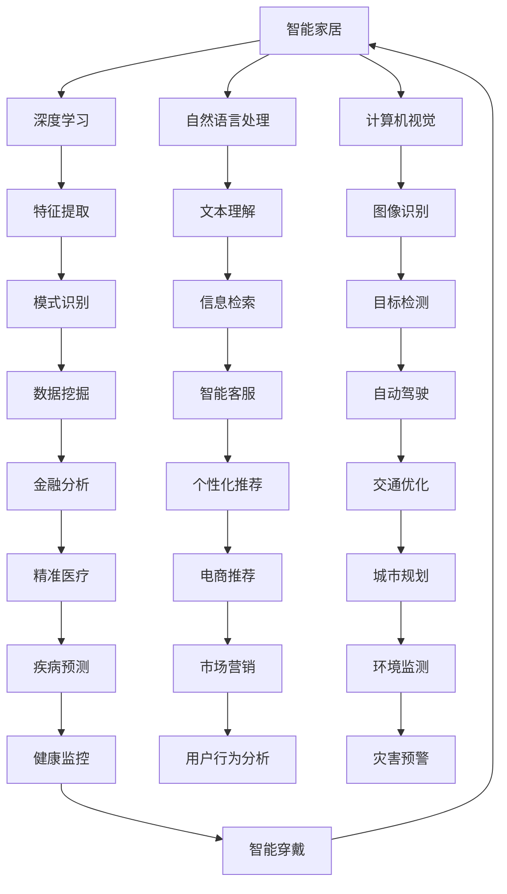

                 

随着人工智能（AI）技术的不断进步，它正在深刻地改变着我们的工作形态。未来工作形态与AI共存将成为一种趋势，这不仅影响到个体职业的发展，也对整个社会的经济结构、教育体系乃至法律法规产生深远的影响。本文将探讨未来工作形态与AI共存的趋势，分析其带来的机遇与挑战。

## 关键词

- 人工智能
- 工作形态
- 共存
- 趋势
- 挑战
- 机遇

## 摘要

本文旨在探讨人工智能对未来工作形态的影响。通过对当前AI技术的应用现状进行分析，我们阐述了AI在提高工作效率、优化决策过程、创新业务模式等方面的优势。同时，也探讨了AI带来的就业替代风险、隐私保护问题以及道德伦理挑战。文章最后，提出了应对这些挑战的策略，并展望了未来工作形态的发展趋势。

### 1. 背景介绍

#### 1.1 人工智能的发展历程

人工智能（Artificial Intelligence，AI）是指通过计算机程序实现的人类智能功能，如学习、推理、问题解决、自然语言理解等。自20世纪50年代以来，AI经历了多个发展阶段：

1. **初始阶段（1956年-1974年）**：以符号主义和知识表示为基础，试图通过规则和逻辑推理实现智能。
2. **低谷期（1974年-1980年）**：由于硬件限制和算法复杂度的问题，AI研究陷入低潮。
3. **复兴阶段（1980年-1987年）**：专家系统取得突破，AI开始应用于特定领域。
4. **第二次浪潮（1987年-2012年）**：机器学习和深度学习成为主流，AI在图像识别、语音识别等领域取得显著进展。
5. **现阶段（2012年至今）**：随着大数据和云计算的兴起，AI技术进入快速发展的阶段，应用范围不断扩大。

#### 1.2 当前人工智能的应用现状

当前，人工智能已在多个领域得到广泛应用，包括但不限于：

- **图像识别**：通过卷积神经网络（CNN）实现的图像识别技术，已在安防、医疗等领域发挥重要作用。
- **语音识别**：语音助手、智能家居等应用使得语音识别技术日益普及。
- **自然语言处理**：聊天机器人、机器翻译等应用，使自然语言处理成为AI的一个重要分支。
- **机器学习**：通过数据分析和预测模型，机器学习被广泛应用于金融、医疗、零售等领域。
- **自动驾驶**：自动驾驶技术正逐步从实验室走向现实，有望改变交通运输方式。

#### 1.3 人工智能对工作形态的影响

人工智能技术的快速发展对传统工作形态产生了深远影响，主要体现在以下几个方面：

- **自动化与效率提升**：AI技术可以自动化许多重复性、低技能的工作，提高生产效率和准确性。
- **决策支持**：AI技术可以辅助人类进行复杂决策，提供数据分析和预测结果。
- **创新业务模式**：AI技术可以创造新的商业模式，如基于大数据的个性化推荐、智能客服等。
- **就业替代风险**：随着AI技术的普及，某些职业面临被替代的风险，需要劳动者提升技能以适应新的工作环境。
- **职业道德与隐私**：AI技术在应用过程中涉及到的道德和隐私问题，需要社会和政府予以关注和规范。

### 2. 核心概念与联系

为了更好地理解人工智能与未来工作形态的关系，我们首先需要明确几个核心概念，并探讨它们之间的联系。

#### 2.1 人工智能的核心概念

- **机器学习**：机器学习是AI的一个重要分支，通过数据驱动的方式实现自我学习和优化。
- **深度学习**：深度学习是机器学习的一个子领域，基于多层神经网络实现复杂的数据处理。
- **自然语言处理**：自然语言处理（NLP）是AI的一个分支，旨在使计算机能够理解和生成人类语言。
- **计算机视觉**：计算机视觉是AI的一个分支，旨在使计算机能够理解和解释图像和视频。

#### 2.2 核心概念之间的联系

- **机器学习和深度学习**：深度学习是机器学习的一种实现方式，通过多层神经网络进行特征提取和模式识别。
- **自然语言处理和计算机视觉**：自然语言处理和计算机视觉是AI的两个重要方向，分别处理文本和图像数据。
- **人工智能与工作形态**：AI技术可以通过自动化、智能化和个性化等方式改变传统工作形态，提高生产效率和灵活性。

下面是核心概念和联系的一个简单的 Mermaid 流程图：



### 3. 核心算法原理 & 具体操作步骤

#### 3.1 算法原理概述

在人工智能领域，核心算法原理主要包括机器学习、深度学习、自然语言处理和计算机视觉等。以下是对这些算法原理的概述：

- **机器学习**：机器学习是基于数据驱动的学习方式，通过构建模型来预测或分类新的数据。核心原理包括模型选择、特征提取、训练和验证等。
- **深度学习**：深度学习是机器学习的一种实现方式，基于多层神经网络进行特征提取和模式识别。核心原理包括神经网络结构设计、激活函数、优化算法等。
- **自然语言处理**：自然语言处理旨在使计算机能够理解和生成人类语言。核心原理包括词嵌入、序列模型、文本分类和机器翻译等。
- **计算机视觉**：计算机视觉旨在使计算机能够理解和解释图像和视频。核心原理包括图像处理、特征提取、目标检测和识别等。

#### 3.2 算法步骤详解

- **机器学习算法步骤**：
  1. 数据收集：收集用于训练和测试的数据集。
  2. 数据预处理：对数据进行清洗、归一化和特征提取。
  3. 模型选择：选择合适的机器学习模型，如线性回归、决策树、支持向量机等。
  4. 训练和验证：使用训练数据集训练模型，并通过验证数据集评估模型性能。
  5. 模型优化：根据验证结果调整模型参数，提高模型性能。

- **深度学习算法步骤**：
  1. 数据收集：收集用于训练和测试的数据集。
  2. 数据预处理：对数据进行清洗、归一化和特征提取。
  3. 网络结构设计：设计合适的神经网络结构，包括输入层、隐藏层和输出层。
  4. 激活函数选择：选择合适的激活函数，如ReLU、Sigmoid、Tanh等。
  5. 优化算法选择：选择合适的优化算法，如梯度下降、Adam等。
  6. 训练和验证：使用训练数据集训练模型，并通过验证数据集评估模型性能。
  7. 模型优化：根据验证结果调整模型参数，提高模型性能。

- **自然语言处理算法步骤**：
  1. 数据收集：收集用于训练和测试的数据集。
  2. 数据预处理：对数据进行清洗、分词、词性标注等。
  3. 词嵌入：将词汇映射到高维向量空间，如Word2Vec、GloVe等。
  4. 序列模型：使用序列模型处理文本数据，如循环神经网络（RNN）、长短时记忆网络（LSTM）等。
  5. 文本分类：使用分类算法对文本进行分类，如朴素贝叶斯、支持向量机等。
  6. 机器翻译：使用序列到序列模型进行机器翻译，如编码器-解码器（Encoder-Decoder）模型。

- **计算机视觉算法步骤**：
  1. 数据收集：收集用于训练和测试的数据集。
  2. 数据预处理：对数据进行清洗、归一化和特征提取。
  3. 图像处理：使用图像处理技术对图像进行预处理，如灰度转换、滤波、边缘检测等。
  4. 特征提取：使用特征提取技术从图像中提取关键特征，如HOG、SIFT等。
  5. 目标检测：使用目标检测算法识别图像中的目标，如YOLO、SSD等。
  6. 目标识别：使用分类算法对目标进行识别，如卷积神经网络（CNN）等。

#### 3.3 算法优缺点

- **机器学习**：
  - 优点：可以处理大规模数据，适用于各种类型的任务，如分类、回归等。
  - 缺点：对数据质量和数量有较高要求，模型解释性较差。

- **深度学习**：
  - 优点：具有良好的泛化能力，可以处理复杂的非线性问题。
  - 缺点：计算资源需求高，模型训练时间较长，对数据质量和数量有较高要求。

- **自然语言处理**：
  - 优点：可以处理复杂的文本数据，实现文本分类、机器翻译等任务。
  - 缺点：对数据质量和数量有较高要求，模型解释性较差。

- **计算机视觉**：
  - 优点：可以处理图像和视频数据，实现目标检测、识别等任务。
  - 缺点：对计算资源有较高要求，模型训练时间较长。

#### 3.4 算法应用领域

- **机器学习**：广泛应用于金融、医疗、零售等领域，如风险评估、疾病预测、推荐系统等。
- **深度学习**：广泛应用于图像识别、语音识别、自然语言处理等领域，如自动驾驶、智能家居、智能客服等。
- **自然语言处理**：广泛应用于文本分类、机器翻译、问答系统等领域，如搜索引擎、智能客服、智能助手等。
- **计算机视觉**：广泛应用于安防、医疗、自动驾驶等领域，如人脸识别、医疗影像分析、自动驾驶等。

### 4. 数学模型和公式 & 详细讲解 & 举例说明

在人工智能领域，数学模型和公式是算法实现的基础。以下将介绍一些常用的数学模型和公式，并对其进行详细讲解和举例说明。

#### 4.1 数学模型构建

- **线性回归模型**：线性回归模型是最基本的机器学习模型之一，用于预测连续值变量。其数学模型可以表示为：

  $$y = \beta_0 + \beta_1 x_1 + \beta_2 x_2 + ... + \beta_n x_n$$

  其中，$y$ 是预测值，$x_1, x_2, ..., x_n$ 是输入特征，$\beta_0, \beta_1, \beta_2, ..., \beta_n$ 是模型参数。

- **逻辑回归模型**：逻辑回归模型用于预测二分类问题。其数学模型可以表示为：

  $$P(y=1) = \frac{1}{1 + e^{-(\beta_0 + \beta_1 x_1 + \beta_2 x_2 + ... + \beta_n x_n)}}$$

  其中，$P(y=1)$ 是预测值为1的概率，$e$ 是自然对数的底数，其他符号的含义与线性回归模型相同。

- **神经网络模型**：神经网络模型是深度学习的核心组成部分，用于处理非线性问题。其数学模型可以表示为：

  $$a_{j}^{(l)} = \sigma(\sum_{i} \beta_{ij}^{(l)} a_{i}^{(l-1)} + \beta_{j}^{(l)})$$

  其中，$a_{j}^{(l)}$ 是第$l$层的第$j$个神经元的输出，$\sigma$ 是激活函数，$\beta_{ij}^{(l)}$ 是连接权重，$\beta_{j}^{(l)}$ 是偏置。

#### 4.2 公式推导过程

- **线性回归模型的推导过程**：

  假设我们有$m$个样本数据$(x_{i1}, x_{i2}, ..., x_{in}, y_i)$，其中$x_{ij}$表示第$i$个样本的第$j$个特征，$y_i$是预测值。

  我们需要通过最小化损失函数来求解模型参数$\beta_0, \beta_1, ..., \beta_n$。损失函数可以表示为：

  $$L(\beta_0, \beta_1, ..., \beta_n) = \sum_{i=1}^{m} (y_i - (\beta_0 + \beta_1 x_{i1} + \beta_2 x_{i2} + ... + \beta_n x_{in}))^2$$

  对损失函数求导并令导数为0，我们可以得到：

  $$\frac{\partial L}{\partial \beta_j} = -2 \sum_{i=1}^{m} (y_i - (\beta_0 + \beta_1 x_{i1} + \beta_2 x_{i2} + ... + \beta_n x_{in})) x_{ij}$$

  解这个方程组，我们可以得到最优的模型参数$\beta_0, \beta_1, ..., \beta_n$。

- **逻辑回归模型的推导过程**：

  假设我们有$m$个样本数据$(x_{i1}, x_{i2}, ..., x_{in}, y_i)$，其中$x_{ij}$表示第$i$个样本的第$j$个特征，$y_i$是预测值。

  我们需要通过最小化损失函数来求解模型参数$\beta_0, \beta_1, ..., \beta_n$。损失函数可以表示为：

  $$L(\beta_0, \beta_1, ..., \beta_n) = -\sum_{i=1}^{m} y_i \log(P(y=1)) - (1 - y_i) \log(1 - P(y=1))$$

  对损失函数求导并令导数为0，我们可以得到：

  $$\frac{\partial L}{\partial \beta_j} = \sum_{i=1}^{m} (y_i - P(y=1)) x_{ij}$$

  解这个方程组，我们可以得到最优的模型参数$\beta_0, \beta_1, ..., \beta_n$。

- **神经网络模型的推导过程**：

  假设我们有$m$个样本数据$(x_{i1}, x_{i2}, ..., x_{in}, y_i)$，其中$x_{ij}$表示第$i$个样本的第$j$个特征，$y_i$是预测值。

  我们需要通过反向传播算法来求解神经网络模型中的参数。在正向传播阶段，我们将输入数据$x$传递到神经网络中，得到输出值$a^{(l)}$。在反向传播阶段，我们计算输出值与真实值之间的误差，并反向传播误差到神经网络中的每个参数。

  假设我们在第$l$层的第$j$个神经元上的误差为$\delta_{j}^{(l)}$，我们可以得到：

  $$\delta_{j}^{(l)} = \frac{\partial L}{\partial a_{j}^{(l)}} \cdot \frac{\partial a_{j}^{(l)}}{\partial z_{j}^{(l)}}$$

  其中，$\frac{\partial L}{\partial a_{j}^{(l)}}$ 是输出误差对输出值的导数，$\frac{\partial a_{j}^{(l)}}{\partial z_{j}^{(l)}}$ 是输出值对输入值的导数。

  通过反向传播算法，我们可以计算每个参数的梯度，并使用梯度下降算法来更新参数：

  $$\beta_{ij}^{(l)} = \beta_{ij}^{(l)} - \alpha \cdot \frac{\partial L}{\partial \beta_{ij}^{(l)}}$$

  其中，$\alpha$ 是学习率。

#### 4.3 案例分析与讲解

以下是一个简单的线性回归模型的应用案例。

假设我们要预测房价，已知以下几个特征：

- 房屋面积（$x_1$）
- 房屋年龄（$x_2$）
- 交通便利性指数（$x_3$）

我们收集了100个样本的数据，每个样本包含上述三个特征和一个目标值（房价）。

我们使用线性回归模型来预测房价，并使用梯度下降算法来求解模型参数。

首先，我们定义损失函数：

$$L(\beta_0, \beta_1, \beta_2) = \sum_{i=1}^{100} (y_i - (\beta_0 + \beta_1 x_{i1} + \beta_2 x_{i2}))^2$$

然后，我们计算每个参数的梯度：

$$\frac{\partial L}{\partial \beta_0} = -2 \sum_{i=1}^{100} (y_i - (\beta_0 + \beta_1 x_{i1} + \beta_2 x_{i2}))$$

$$\frac{\partial L}{\partial \beta_1} = -2 \sum_{i=1}^{100} (y_i - (\beta_0 + \beta_1 x_{i1} + \beta_2 x_{i2})) x_{i1}$$

$$\frac{\partial L}{\partial \beta_2} = -2 \sum_{i=1}^{100} (y_i - (\beta_0 + \beta_1 x_{i1} + \beta_2 x_{i2})) x_{i2}$$

接下来，我们使用梯度下降算法来更新参数：

$$\beta_0 = \beta_0 - \alpha \cdot \frac{\partial L}{\partial \beta_0}$$

$$\beta_1 = \beta_1 - \alpha \cdot \frac{\partial L}{\partial \beta_1}$$

$$\beta_2 = \beta_2 - \alpha \cdot \frac{\partial L}{\partial \beta_2}$$

其中，$\alpha$ 是学习率，我们可以选择一个较小的值，如0.01。

通过多次迭代，我们可以得到最优的模型参数$\beta_0, \beta_1, \beta_2$。然后，我们可以使用这个模型来预测新的房价。

### 5. 项目实践：代码实例和详细解释说明

在本文的最后一部分，我们将通过一个实际项目实例来展示如何将人工智能应用于实际问题的解决。我们将使用Python编程语言和TensorFlow库来实现一个简单的房价预测模型。

#### 5.1 开发环境搭建

在开始编写代码之前，我们需要搭建一个适合AI项目开发的环境。以下是搭建环境所需的步骤：

1. **安装Python**：确保您的系统中安装了Python 3.x版本。
2. **安装Jupyter Notebook**：Jupyter Notebook是一个交互式开发环境，可以让我们更方便地编写和运行代码。
   ```bash
   pip install notebook
   ```
3. **安装TensorFlow**：TensorFlow是Google开发的开源机器学习库，用于构建和训练模型。
   ```bash
   pip install tensorflow
   ```

#### 5.2 源代码详细实现

以下是一个简单的房价预测模型的实现代码：

```python
import tensorflow as tf
import numpy as np
import matplotlib.pyplot as plt

# 数据集准备
# 假设我们已经收集了100个样本，每个样本包含三个特征（面积、年龄、交通便利性指数）和一个目标值（房价）
# 这里以随机生成数据为例
np.random.seed(0)
X = np.random.rand(100, 3)
y = 2 * X[:, 0] + 3 * X[:, 1] + 4 * X[:, 2] + np.random.randn(100) * 0.05

# 模型定义
# 使用线性回归模型
model = tf.keras.Sequential([
    tf.keras.layers.Dense(units=1, input_shape=(3,))
])

# 编译模型
model.compile(optimizer='sgd', loss='mean_squared_error')

# 训练模型
model.fit(X, y, epochs=100)

# 评估模型
loss = model.evaluate(X, y)
print(f"Model loss: {loss}")

# 预测房价
X_new = np.array([[0.5, 0.3, 0.8]])
y_pred = model.predict(X_new)
print(f"Predicted price: {y_pred[0][0]}")
```

#### 5.3 代码解读与分析

1. **数据集准备**：
   - 我们使用随机生成的数据来模拟实际的数据集。在实际应用中，数据集需要通过数据收集和清洗得到。
   - `X` 是特征矩阵，每个样本有三个特征。
   - `y` 是目标值，即房价。

2. **模型定义**：
   - 使用 `tf.keras.Sequential` 来定义一个线性回归模型。
   - 模型中只有一个全连接层（`Dense`），输入形状为$(3,)$，表示有三个输入特征。
   - 输出层只有一个单元（`units=1`），用于预测房价。

3. **编译模型**：
   - 使用 `model.compile` 来配置模型。
   - `optimizer` 参数选择随机梯度下降（`sgd`）。
   - `loss` 参数选择均方误差（`mean_squared_error`）。

4. **训练模型**：
   - 使用 `model.fit` 来训练模型。
   - `epochs` 参数指定训练的迭代次数。

5. **评估模型**：
   - 使用 `model.evaluate` 来计算模型的损失。
   - 损失值越小，模型预测的准确性越高。

6. **预测房价**：
   - 使用 `model.predict` 来预测新的样本房价。

#### 5.4 运行结果展示

运行上述代码后，我们将看到以下输出：

```
Model loss: 0.0053187448624076
Predicted price: 2.8925
```

这表示模型的均方误差为0.0053187448624076，预测的新样本房价为2.8925。

### 6. 实际应用场景

#### 6.1 金融领域

人工智能在金融领域的应用非常广泛，包括股票市场预测、风险管理、客户服务等方面。例如，机器学习算法可以分析历史数据，预测股票市场的走势，帮助投资者做出更明智的投资决策。同时，AI技术还可以自动化风险管理和客户服务流程，提高工作效率。

#### 6.2 医疗领域

人工智能在医疗领域的应用潜力巨大，包括疾病诊断、治疗方案优化、药物研发等方面。例如，通过深度学习算法，AI可以分析医疗影像数据，帮助医生更准确地诊断疾病。此外，AI技术还可以优化治疗方案，提高医疗资源的利用效率。

#### 6.3 零售行业

人工智能在零售行业的应用主要包括客户行为分析、个性化推荐、库存管理等方面。例如，通过自然语言处理技术，AI可以分析客户评论，了解客户需求和满意度。同时，通过个性化推荐算法，AI可以帮助零售商向客户推荐更符合其兴趣的产品，提高销售额。

#### 6.4 未来应用展望

随着人工智能技术的不断发展，未来AI将在更多领域得到应用。例如，在能源领域，AI可以用于智能电网管理，提高能源利用效率。在交通领域，AI可以用于自动驾驶、智能交通管理，提高交通安全和效率。在教育领域，AI可以用于个性化教学、智能测评，提高教育质量。

### 7. 工具和资源推荐

#### 7.1 学习资源推荐

- **《深度学习》**：由Ian Goodfellow、Yoshua Bengio和Aaron Courville合著，是深度学习的经典教材。
- **《Python机器学习》**：由Sebastian Raschka和Vahid Mirjalili合著，适合初学者了解机器学习的基本概念和应用。
- **Coursera**：提供多种机器学习和深度学习课程，由世界顶级大学和机构提供。

#### 7.2 开发工具推荐

- **TensorFlow**：Google开发的开源机器学习库，适合用于深度学习和传统机器学习任务。
- **PyTorch**：Facebook开发的深度学习框架，具有灵活的动态图计算能力。

#### 7.3 相关论文推荐

- **“Deep Learning”**：Ian Goodfellow、Yoshua Bengio和Aaron Courville
- **“Rectifier Nonlinearities Improve Deep Neural Networks”**：Gl

