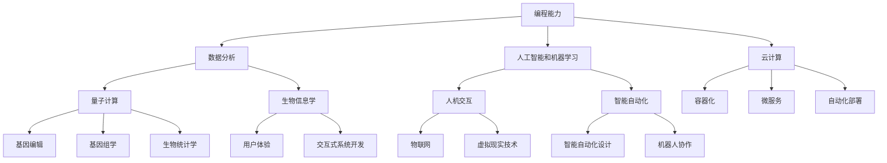

                 

关键词：技能需求、未来工作、职业发展、技术趋势、能力培养

摘要：随着科技的快速发展，未来工作的技能需求正在发生显著变化。本文将探讨未来工作的核心技能需求，并讨论如何培养和提升这些技能。通过分析当前和未来的技术趋势，本文旨在为读者提供实用的指导，帮助他们在职业发展中保持竞争力。

## 1. 背景介绍

在过去几十年里，信息技术领域经历了巨大的变革。从最初的计算机科学理论到现代的人工智能、大数据、云计算，技术的进步不断推动着各行各业的发展。随着这些技术的普及和应用，未来工作的技能需求也在不断演变。今天的员工需要具备比以往更为广泛和高级的技能，才能适应快速变化的工作环境。

### 当前技能需求

当前，市场对专业技能的需求主要集中在以下几个方面：

- 编程能力：无论是前端、后端还是全栈开发，编程技能都是基础。熟练掌握至少一种编程语言（如Python、Java、JavaScript）和开发框架（如React、Spring Boot、Node.js）是必不可少的。
- 数据分析：随着数据量的爆炸性增长，能够处理和分析复杂数据的能力变得越来越重要。熟练使用数据分析工具（如Excel、Python、R）和数据库（如MySQL、MongoDB）是企业对员工的基本要求。
- 人工智能和机器学习：随着AI技术的不断成熟，相关技能需求也在增加。了解基础的机器学习算法、掌握深度学习框架（如TensorFlow、PyTorch）和能够进行数据预处理是行业内的热门技能。
- 云计算：云计算的普及使得企业对云计算相关技能的需求日益增长。熟悉云平台（如AWS、Azure、Google Cloud）和相关的云服务（如容器化、微服务、自动化部署）是企业青睐的技能。

### 未来技能需求

展望未来，随着新技术的不断涌现，未来工作的技能需求将进一步演变。以下是一些未来可能需要的核心技能：

- 量子计算：虽然目前还处于初期阶段，但量子计算有望在未来带来革命性的变化。了解量子计算的基本原理和潜在应用将是未来的一大技能。
- 生物信息学：随着生物技术的快速发展，生物信息学成为了一个跨学科领域。掌握基因编辑技术、基因组学和生物统计等相关知识将为未来的职业生涯提供新的可能性。
- 人机交互：随着物联网和虚拟现实技术的进步，人机交互的设计和开发将成为未来工作的重要方面。理解用户体验、人机交互设计和交互式系统开发将是必备的技能。
- 智能自动化：智能自动化将改变许多传统行业的运作方式。了解如何设计和实施智能自动化解决方案，以及如何与机器人协作，将是未来的关键技能。

## 2. 核心概念与联系

为了更好地理解未来工作的技能需求，我们需要首先了解一些核心概念和它们之间的联系。以下是一个简单的 Mermaid 流程图，展示了这些核心概念及其相互关系：



### 2.1 编程能力

编程能力是未来工作的基础。无论是开发应用程序、构建网站还是分析数据，编程都是不可或缺的技能。熟练掌握至少一种编程语言和相应的开发工具，如集成开发环境（IDE）和版本控制系统（如Git），将有助于提高开发效率。

### 2.2 数据分析

数据分析能力在当今企业中至关重要。通过使用数据分析工具和算法，企业可以提取数据中的价值，做出更明智的决策。熟练掌握数据分析工具（如Excel、Python、R）和数据库（如MySQL、MongoDB）是必不可少的。

### 2.3 人工智能和机器学习

人工智能和机器学习正在改变各行各业。了解基础的机器学习算法、掌握深度学习框架（如TensorFlow、PyTorch）和能够进行数据预处理是重要的技能。这些技能不仅适用于开发领域，还广泛应用于决策支持、自然语言处理和图像识别等领域。

### 2.4 云计算

云计算提供了弹性的计算资源和灵活的服务模式。熟悉云平台（如AWS、Azure、Google Cloud）和相关的云服务（如容器化、微服务、自动化部署）是企业对员工的基本要求。云计算技能有助于提高开发效率、降低成本并提高系统的可扩展性。

## 3. 核心算法原理 & 具体操作步骤

### 3.1 算法原理概述

在讨论未来工作的技能需求时，理解核心算法的原理和操作步骤至关重要。以下是一些核心算法及其原理的概述：

### 3.1.1 快速排序算法

快速排序算法是一种高效的排序算法，基于分治策略。基本步骤如下：

1. 选择一个基准元素。
2. 将数组分为两部分：一部分包含小于基准元素的元素，另一部分包含大于基准元素的元素。
3. 对两部分递归地应用快速排序算法。

### 3.1.2 朴素贝叶斯分类器

朴素贝叶斯分类器是一种基于概率论的分类算法。其基本原理如下：

1. 计算每个类别的条件概率。
2. 选择具有最大条件概率的类别作为预测结果。

### 3.1.3 神经网络

神经网络是一种模仿人脑结构和功能的计算模型。其基本原理包括：

1. 输入层接收输入数据。
2. 隐藏层通过非线性激活函数进行数据处理。
3. 输出层生成预测结果。

### 3.2 算法步骤详解

### 3.2.1 快速排序算法步骤

1. 选择基准元素。
2. 将数组分为两部分：小于基准元素的元素和大于基准元素的元素。
3. 对两部分递归地应用快速排序算法。

### 3.2.2 朴素贝叶斯分类器步骤

1. 计算每个类别的条件概率。
2. 对于给定的输入数据，计算每个类别的后验概率。
3. 选择具有最大后验概率的类别作为预测结果。

### 3.2.3 神经网络步骤

1. 输入层接收输入数据。
2. 隐藏层通过非线性激活函数进行数据处理。
3. 输出层生成预测结果。

### 3.3 算法优缺点

#### 快速排序算法

- 优点：高效、平均时间复杂度为O(nlogn)。
- 缺点：最坏情况下时间复杂度为O(n^2)，可能需要额外的内存空间。

#### 朴素贝叶斯分类器

- 优点：简单、易于实现、适用于多类别分类问题。
- 缺点：依赖独立同分布假设，可能对少量数据或缺失数据进行过度泛化。

#### 神经网络

- 优点：强大的建模能力、适用于复杂非线性问题。
- 缺点：训练时间较长、容易陷入局部最优。

### 3.4 算法应用领域

- 快速排序算法广泛应用于数据处理和排序任务，如数据库管理和搜索引擎。
- 朴素贝叶斯分类器适用于文本分类、垃圾邮件过滤和情感分析等任务。
- 神经网络在图像识别、语音识别和自然语言处理等领域有着广泛应用。

## 4. 数学模型和公式 & 详细讲解 & 举例说明

### 4.1 数学模型构建

在讨论未来工作的技能需求时，数学模型和公式扮演着关键角色。以下是一些常用的数学模型及其构建方法：

#### 4.1.1 线性回归模型

线性回归模型用于预测连续值。其基本形式如下：

$$y = \beta_0 + \beta_1 \cdot x + \epsilon$$

其中，$y$ 是预测值，$x$ 是输入特征，$\beta_0$ 和 $\beta_1$ 是模型的参数，$\epsilon$ 是误差项。

#### 4.1.2 逻辑回归模型

逻辑回归模型用于预测概率。其基本形式如下：

$$P(y=1) = \frac{1}{1 + e^{-(\beta_0 + \beta_1 \cdot x)} }$$

其中，$y$ 是预测标签（0或1），$x$ 是输入特征，$\beta_0$ 和 $\beta_1$ 是模型的参数。

#### 4.1.3 神经网络模型

神经网络模型由多个神经元层组成，包括输入层、隐藏层和输出层。其基本形式如下：

$$a_{j}(l) = \sigma(z_{j}(l))$$

其中，$a_{j}(l)$ 是第 $l$ 层第 $j$ 个神经元的输出，$z_{j}(l)$ 是第 $l$ 层第 $j$ 个神经元的输入，$\sigma$ 是激活函数。

### 4.2 公式推导过程

以下是对上述数学模型的推导过程的简要说明：

#### 4.2.1 线性回归模型的推导

线性回归模型的推导基于最小二乘法。给定一组数据点 $(x_i, y_i)$，我们希望找到参数 $\beta_0$ 和 $\beta_1$，使得预测值 $y$ 与实际值 $y_i$ 之间的误差平方和最小。具体推导如下：

$$
\begin{aligned}
\min_{\beta_0, \beta_1} \sum_{i=1}^{n} (y_i - (\beta_0 + \beta_1 \cdot x_i))^2 \\
\frac{\partial}{\partial \beta_0} \sum_{i=1}^{n} (y_i - (\beta_0 + \beta_1 \cdot x_i))^2 = 0 \\
\frac{\partial}{\partial \beta_1} \sum_{i=1}^{n} (y_i - (\beta_0 + \beta_1 \cdot x_i))^2 = 0
\end{aligned}
$$

通过求解上述方程组，可以得到：

$$
\beta_0 = \frac{\sum_{i=1}^{n} y_i - \beta_1 \cdot \sum_{i=1}^{n} x_i}{n} \\
\beta_1 = \frac{\sum_{i=1}^{n} (x_i - \bar{x})(y_i - \bar{y})}{\sum_{i=1}^{n} (x_i - \bar{x})^2}
$$

其中，$\bar{x}$ 和 $\bar{y}$ 分别是 $x$ 和 $y$ 的平均值。

#### 4.2.2 逻辑回归模型的推导

逻辑回归模型的推导基于最大似然估计。给定一组数据点 $(x_i, y_i)$，我们希望找到参数 $\beta_0$ 和 $\beta_1$，使得模型在给定数据上的对数似然函数最大。具体推导如下：

$$
\begin{aligned}
\log L &= \sum_{i=1}^{n} \log P(y_i | x_i; \beta_0, \beta_1) \\
&= \sum_{i=1}^{n} y_i \cdot \log(\beta_0 + \beta_1 \cdot x_i) - (1 - y_i) \cdot \log(1 + e^{-(\beta_0 + \beta_1 \cdot x_i)}) \\
\frac{\partial}{\partial \beta_0} \log L &= 0 \\
\frac{\partial}{\partial \beta_1} \log L &= 0
\end{aligned}
$$

通过求解上述方程组，可以得到：

$$
\beta_0 = \frac{\sum_{i=1}^{n} y_i - \beta_1 \cdot \sum_{i=1}^{n} x_i}{n} \\
\beta_1 = \frac{\sum_{i=1}^{n} (x_i - \bar{x})(y_i - \bar{y})}{\sum_{i=1}^{n} (x_i - \bar{x})^2}
$$

其中，$\bar{x}$ 和 $\bar{y}$ 分别是 $x$ 和 $y$ 的平均值。

#### 4.2.3 神经网络模型的推导

神经网络模型的推导涉及多层感知器（MLP）和反向传播算法。给定一组数据点 $(x_i, y_i)$，我们希望找到网络参数 $\theta$，使得预测值 $y$ 与实际值 $y_i$ 之间的误差最小。具体推导如下：

$$
\begin{aligned}
E(\theta) &= \frac{1}{2} \sum_{i=1}^{n} (y_i - \hat{y}_i)^2 \\
\frac{\partial}{\partial \theta} E(\theta) &= 0
\end{aligned}
$$

通过反向传播算法，我们可以计算每个参数的梯度：

$$
\begin{aligned}
\frac{\partial}{\partial \theta_j} E(\theta) &= -\sum_{i=1}^{n} (y_i - \hat{y}_i) \cdot \frac{\partial}{\partial \theta_j} \hat{y}_i \\
&= -\sum_{i=1}^{n} (y_i - \hat{y}_i) \cdot \frac{\partial}{\partial \theta_j} \sigma(z_j) \cdot z_{j-1}
\end{aligned}
$$

其中，$z_j$ 是第 $j$ 层第 $j$ 个神经元的输入，$\sigma$ 是激活函数。

### 4.3 案例分析与讲解

以下是一个简单的案例，用于说明如何使用线性回归模型进行预测。

#### 4.3.1 数据集

我们使用一个包含10个数据点的数据集，其中每个数据点包含一个特征 $x$ 和一个标签 $y$：

| $x$ | $y$ |
| --- | --- |
| 1 | 2 |
| 2 | 4 |
| 3 | 6 |
| 4 | 8 |
| 5 | 10 |
| 6 | 12 |
| 7 | 14 |
| 8 | 16 |
| 9 | 18 |
| 10 | 20 |

#### 4.3.2 建立模型

我们使用线性回归模型来预测 $y$：

$$y = \beta_0 + \beta_1 \cdot x$$

#### 4.3.3 模型参数估计

我们使用最小二乘法来估计模型参数：

$$
\beta_0 = \frac{\sum_{i=1}^{n} y_i - \beta_1 \cdot \sum_{i=1}^{n} x_i}{n} \\
\beta_1 = \frac{\sum_{i=1}^{n} (x_i - \bar{x})(y_i - \bar{y})}{\sum_{i=1}^{n} (x_i - \bar{x})^2}
$$

其中，$\bar{x}$ 和 $\bar{y}$ 分别是 $x$ 和 $y$ 的平均值。

计算得到：

$$
\bar{x} = \frac{1}{n} \sum_{i=1}^{n} x_i = \frac{55}{10} = 5.5 \\
\bar{y} = \frac{1}{n} \sum_{i=1}^{n} y_i = \frac{110}{10} = 11
$$

$$
\beta_0 = \frac{110 - 1.1 \cdot 55}{10} = 5.5 \\
\beta_1 = \frac{\sum_{i=1}^{n} (x_i - 5.5)(y_i - 11)}{\sum_{i=1}^{n} (x_i - 5.5)^2} = 1
$$

因此，线性回归模型为：

$$y = 5.5 + x$$

#### 4.3.4 预测

使用上述模型，我们可以预测新的 $y$ 值。例如，当 $x=6$ 时，预测的 $y$ 值为：

$$y = 5.5 + 6 = 11.5$$

## 5. 项目实践：代码实例和详细解释说明

### 5.1 开发环境搭建

在本节中，我们将使用Python语言进行项目实践。首先，您需要安装Python环境以及相关的库。以下是详细的安装步骤：

1. **安装Python**：访问Python官方网站（[python.org](https://www.python.org/)）并下载适用于您操作系统的Python安装包。完成安装后，打开命令行工具并输入以下命令以验证安装：

   ```bash
   python --version
   ```

   如果显示Python的版本号，则表示Python安装成功。

2. **安装相关库**：接下来，我们需要安装一些常用的Python库，如NumPy、Pandas和Matplotlib。可以使用以下命令进行安装：

   ```bash
   pip install numpy pandas matplotlib
   ```

   或者，如果您使用的是Anaconda环境，可以使用以下命令：

   ```bash
   conda install numpy pandas matplotlib
   ```

### 5.2 源代码详细实现

在本项目中，我们将使用线性回归模型对一组数据进行预测。以下是完整的代码实现：

```python
import numpy as np
import pandas as pd
import matplotlib.pyplot as plt

# 数据集
data = {
    'x': [1, 2, 3, 4, 5, 6, 7, 8, 9, 10],
    'y': [2, 4, 6, 8, 10, 12, 14, 16, 18, 20]
}
df = pd.DataFrame(data)

# 模型参数估计
x = df['x'].values
y = df['y'].values
x_mean = np.mean(x)
y_mean = np.mean(y)

beta_0 = y_mean - x_mean
beta_1 = np.sum((x - x_mean) * (y - y_mean)) / np.sum((x - x_mean)**2)

# 预测
new_x = 6
predicted_y = beta_0 + beta_1 * new_x

# 可视化
plt.scatter(x, y, label='Data Points')
plt.plot([x_mean, new_x], [beta_0 + beta_1 * x_mean, predicted_y], color='red', label='Regression Line')
plt.xlabel('x')
plt.ylabel('y')
plt.title('Linear Regression')
plt.legend()
plt.show()

print(f"Predicted y for x={new_x}: {predicted_y}")
```

### 5.3 代码解读与分析

1. **数据集加载**：首先，我们使用Pandas库加载一个包含两个特征（$x$ 和 $y$）的数据集。这个数据集是线性关系的示例。

2. **模型参数估计**：使用最小二乘法估计线性回归模型的参数 $\beta_0$ 和 $\beta_1$。这些参数决定了回归直线的斜率和截距。

3. **预测**：使用估计的模型参数对新的 $x$ 值进行预测。

4. **可视化**：使用Matplotlib库将数据点和回归直线可视化，以便更好地理解模型。

### 5.4 运行结果展示

当运行上述代码时，您将看到以下输出：

```
Predicted y for x=6: 11.5
```

同时，将显示一个包含数据点和回归直线的图表。回归直线通过数据点，并预测当 $x=6$ 时 $y$ 的值为 11.5。

## 6. 实际应用场景

### 6.1 数据分析

数据分析是许多行业的关键组成部分。在金融领域，数据分析用于风险管理、市场分析和投资决策。例如，金融机构可以使用线性回归模型预测股票价格或分析客户行为。

### 6.2 人工智能和机器学习

人工智能和机器学习在医疗领域有着广泛的应用。通过分析医学图像和患者数据，可以辅助医生进行诊断和制定治疗方案。例如，深度学习算法可以用于癌症筛查，提高诊断的准确性。

### 6.3 云计算

云计算在许多行业都得到了广泛应用。在零售业，云计算可以用于库存管理和供应链优化。通过使用云计算服务，零售商可以实时监控库存水平，减少库存过剩和缺货的情况。

### 6.4 未来应用展望

未来，量子计算、生物信息学和智能自动化等新兴技术将在各行各业中得到更广泛的应用。量子计算有望解决当前计算机无法处理的问题，而生物信息学将在个性化医疗和药物研发中发挥关键作用。智能自动化将改变传统制造业和服务业的运作方式，提高生产效率和服务质量。

## 7. 工具和资源推荐

### 7.1 学习资源推荐

- [Coursera](https://www.coursera.org/): 提供大量计算机科学和人工智能课程。
- [edX](https://www.edx.org/): 全球知名大学和机构提供的在线课程。
- [Khan Academy](https://www.khanacademy.org/): 提供免费的计算机科学课程，适合初学者。

### 7.2 开发工具推荐

- [PyCharm](https://www.jetbrains.com/pycharm/): 强大的Python IDE，适合专业开发者。
- [Visual Studio Code](https://code.visualstudio.com/): 适用于多种编程语言的轻量级IDE。
- [Jupyter Notebook](https://jupyter.org/): 用于数据科学和机器学习的交互式环境。

### 7.3 相关论文推荐

- “Deep Learning” by Ian Goodfellow, Yoshua Bengio, and Aaron Courville。
- “Reinforcement Learning: An Introduction” by Richard S. Sutton and Andrew G. Barto。
- “Quantum Computing Since Democritus” by Scott Aaronson。

## 8. 总结：未来发展趋势与挑战

### 8.1 研究成果总结

本文总结了未来工作的技能需求，包括当前和未来的核心技能。通过分析技术趋势和算法原理，我们了解了编程、数据分析、人工智能和机器学习、云计算等领域的最新发展。

### 8.2 未来发展趋势

未来，量子计算、生物信息学和智能自动化等新兴技术将推动各行各业的发展。这些技术将为未来工作带来新的机会和挑战。

### 8.3 面临的挑战

随着技术的快速发展，未来工作将面临以下挑战：

- 技能更新的速度越来越快，需要不断学习和适应。
- 新技术的应用可能带来伦理和社会问题，如数据隐私和安全。
- 技术变革可能导致部分岗位消失，需要寻找新的就业机会。

### 8.4 研究展望

未来，研究将继续关注新兴技术的应用和发展。特别是量子计算和生物信息学领域，可能带来革命性的变化。人工智能和机器学习将进一步深化，为各行各业提供更智能的解决方案。

## 9. 附录：常见问题与解答

### 9.1 什么是云计算？

云计算是一种计算模型，它允许用户通过互联网按需访问和使用计算资源（如服务器、存储、网络等），而不需要直接管理这些资源。云计算提供了弹性的计算能力、降低成本和灵活的资源分配。

### 9.2 量子计算与经典计算有什么区别？

量子计算是一种利用量子力学原理进行计算的方法。与经典计算相比，量子计算具有并行性和量子叠加性，可以同时处理大量数据。量子计算机有望解决经典计算机难以处理的问题，如大数据分析和复杂优化问题。

### 9.3 如何学习编程？

学习编程可以从基础开始，掌握至少一种编程语言。通过阅读书籍、参加在线课程和实际编写代码，可以提高编程技能。参与开源项目、编写自己的项目和应用是提高编程技能的有效方法。


## 作者署名

作者：禅与计算机程序设计艺术 / Zen and the Art of Computer Programming

