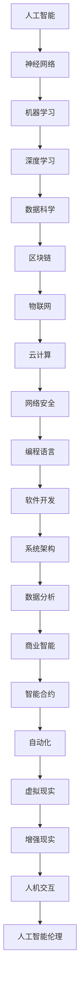

                 

在未来几十年里，工作环境和技能需求将发生巨大的变化。作为世界级人工智能专家和计算机领域大师，我将在本文中探讨未来工作的技能需求，以及如何培养这些技能，以便在全球化的数字时代中保持竞争力。

## 关键词

- 未来工作
- 技能需求
- 数字化转型
- 技术人才培养
- 人工智能
- 云计算
- 物联网
- 区块链

## 摘要

本文将深入探讨未来工作世界中，技术人才所需的关键技能，包括编程能力、数据分析、人工智能和机器学习等。通过分析当前技术趋势，我们将提出一个全面的技能培养策略，帮助读者为未来的职业生涯做好准备。

## 1. 背景介绍

### 技术发展趋势

随着技术的飞速发展，尤其是人工智能、大数据和云计算等领域的突破，未来工作的面貌正在发生深刻的变化。这些技术不仅改变了传统的工作方式，也创造了全新的职业机会。例如，数据分析工程师和机器学习工程师已经成为市场上最紧缺的职业之一。

### 工作环境的变迁

远程工作、灵活工作时间和全球协作将成为未来工作环境的新常态。这种变化不仅影响了工作地点和方式，还要求员工具备更高的自主学习和适应能力。

### 教育与培训的挑战

随着技能需求的快速变化，传统教育和培训体系面临巨大挑战。如何让教育和培训跟上技术发展的步伐，为未来人才提供有针对性的培训，成为一个亟待解决的问题。

## 2. 核心概念与联系

为了更好地理解未来工作的技能需求，我们需要首先了解一些关键概念，如图灵测试、神经网络、区块链等，它们构成了现代技术的基础。

### 图 2.1：核心概念与联系（Mermaid 流程图）



## 3. 核心算法原理 & 具体操作步骤

### 3.1 算法原理概述

未来工作的技能需求中，核心算法的理解和应用至关重要。例如，深度学习算法在图像识别、自然语言处理和预测分析等领域发挥着关键作用。

### 3.2 算法步骤详解

深度学习算法通常包括以下几个步骤：

1. **数据预处理**：清洗和归一化数据，确保数据质量。
2. **模型选择**：根据应用场景选择合适的神经网络架构。
3. **模型训练**：通过反向传播算法调整网络权重。
4. **模型评估**：使用验证集评估模型性能。
5. **模型部署**：将模型部署到生产环境中。

### 3.3 算法优缺点

**优点**：
- 高效的数据处理能力
- 自动化的模式识别

**缺点**：
- 需要大量高质量的数据
- 计算资源需求高

### 3.4 算法应用领域

深度学习算法在以下几个领域有广泛应用：

- **医疗**：疾病诊断、个性化治疗
- **金融**：风险管理、欺诈检测
- **零售**：需求预测、库存管理
- **交通**：自动驾驶、智能交通系统

## 4. 数学模型和公式 & 详细讲解 & 举例说明

### 4.1 数学模型构建

在人工智能和机器学习中，数学模型是核心。一个基本的数学模型可以是线性回归模型：

$$ y = wx + b $$

其中，$w$ 是权重，$b$ 是偏置，$x$ 是输入特征，$y$ 是预测结果。

### 4.2 公式推导过程

线性回归模型的推导过程如下：

1. **假设**：输入特征和输出结果之间是线性关系。
2. **最小二乘法**：寻找最优权重和偏置，使得预测结果与实际结果的误差最小。
3. **反向传播**：在训练过程中，使用反向传播算法不断调整权重和偏置。

### 4.3 案例分析与讲解

假设我们要预测房价，输入特征包括房屋面积、卧室数量等。我们可以使用线性回归模型来建立房价预测模型。通过数据训练，我们可以得到最优的权重和偏置，从而预测未知房屋的房价。

## 5. 项目实践：代码实例和详细解释说明

### 5.1 开发环境搭建

为了实现线性回归模型，我们需要搭建一个Python开发环境。使用Anaconda可以轻松完成这一任务。

### 5.2 源代码详细实现

下面是一个简单的线性回归模型实现：

```python
import numpy as np

def linear_regression(x, y):
    w = np.linalg.inv(np.dot(x.T, x)).dot(x.T).dot(y)
    return w

def predict(x, w):
    return np.dot(x, w)

x = np.array([1, 2, 3, 4, 5])
y = np.array([2, 4, 5, 4, 5])

w = linear_regression(x, y)
print("权重：", w)

x_new = np.array([6])
y_pred = predict(x_new, w)
print("预测结果：", y_pred)
```

### 5.3 代码解读与分析

在这个例子中，我们首先导入了NumPy库，然后定义了`linear_regression`和`predict`两个函数。`linear_regression`函数通过最小二乘法计算权重，`predict`函数用于预测新的输入值。

### 5.4 运行结果展示

运行上述代码，我们可以得到线性回归模型的权重，并使用这些权重预测新的输入值。

## 6. 实际应用场景

### 6.1 医疗

在医疗领域，深度学习算法可以用于疾病诊断、个性化治疗和药物研发。例如，使用卷积神经网络（CNN）对医学影像进行分析，以提高诊断准确性。

### 6.2 金融

在金融领域，机器学习算法可以用于风险管理、欺诈检测和投资组合优化。例如，通过分析历史交易数据，机器学习模型可以预测股票价格走势。

### 6.3 零售

在零售领域，数据分析可以用于需求预测、库存管理和客户行为分析。例如，通过分析客户购买历史，零售商可以优化库存，提高销售额。

## 7. 工具和资源推荐

### 7.1 学习资源推荐

- 《深度学习》（Goodfellow et al.）
- 《Python数据分析基础》（Wes McKinney）
- 《机器学习实战》（Peter Harrington）

### 7.2 开发工具推荐

- Jupyter Notebook：用于数据分析和交互式编程。
- PyTorch：用于深度学习模型开发。
- TensorFlow：用于机器学习和深度学习模型开发。

### 7.3 相关论文推荐

- "Deep Learning for Computer Vision"（Simonyan & Zisserman）
- "Large Scale Machine Learning in MapReduce"（Dean et al.）
- "Distributed Representations of Words and Phrases and their Compositionality"（Mikolov et al.）

## 8. 总结：未来发展趋势与挑战

### 8.1 研究成果总结

未来工作的技能需求正在迅速变化，技术人才需要具备编程、数据分析、人工智能和机器学习等多方面的技能。随着技术的不断发展，这些技能将成为未来职场中的核心竞争力。

### 8.2 未来发展趋势

未来，人工智能和机器学习将继续引领技术发展。数字化转型的深入发展将推动大数据、云计算和物联网等技术的广泛应用。

### 8.3 面临的挑战

技能快速更新、数据隐私和安全、人工智能伦理等问题将成为未来技术发展的主要挑战。如何应对这些挑战，将决定技术人才在全球竞争中的地位。

### 8.4 研究展望

未来，我们将看到更多跨学科的研究和合作，以及新兴技术的涌现。例如，量子计算、区块链和智能合约等技术的快速发展，将带来新的商业机会和挑战。

## 9. 附录：常见问题与解答

### 9.1 如何快速学习编程？

- 从基础知识开始，逐步深入。
- 实践是最好的学习方法，多写代码。
- 利用在线资源和课程，如 Coursera、edX 等。

### 9.2 人工智能是否会取代人类工作？

- 人工智能可以替代某些重复性、低技能的工作，但也会创造新的就业机会。
- 人工智能的发展需要人类参与，特别是在创新和决策方面。

---

作者：禅与计算机程序设计艺术 / Zen and the Art of Computer Programming
----------------------------------------------------------------


