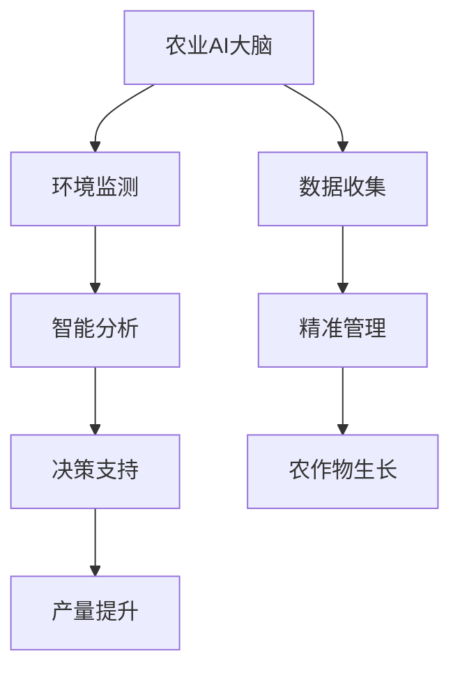

                 

关键词：智慧农业、2050年、农业AI、精准农业、人工智能

摘要：随着科技的飞速发展，智慧农业正在成为未来农业发展的重要趋势。本文将探讨到2050年，农业AI大脑和精准农业将如何彻底改变农业生产方式，提高农作物的产量和质量，并分析在这一过程中可能面临的挑战和机遇。

## 1. 背景介绍

随着全球人口的增长和气候变化的影响，农业生产面临着前所未有的压力。传统农业方式已经无法满足人们对粮食、食品质量和环境可持续性的需求。智慧农业的兴起，为我们提供了一种全新的解决方案。智慧农业利用物联网、大数据、人工智能等先进技术，实现对农业生产过程的精准监测、管理和优化。

### 1.1 智慧农业的定义

智慧农业，是指通过应用信息技术、生物技术和工程技术，将农业生产与管理智能化、自动化和精准化。它包括环境监测、精准灌溉、智能种植、精准施肥、智能收割等多个方面。

### 1.2 智慧农业的发展历程

智慧农业的发展可以分为三个阶段：初步探索阶段、发展阶段和成熟阶段。

- **初步探索阶段**（20世纪90年代至2000年代）：这个阶段主要是对农业信息化的初步尝试，包括使用计算机进行农业生产数据的收集和分析。
- **发展阶段**（2000年代至2010年代）：随着互联网和物联网技术的发展，农业信息化进入快速发展阶段，农业生产管理开始向智能化和自动化方向发展。
- **成熟阶段**（2010年代至今）：人工智能、大数据等新兴技术的应用，使智慧农业进入了成熟阶段，实现了对农业生产过程的全面智能化管理。

### 1.3 智慧农业的现状与趋势

目前，智慧农业在全球范围内得到了广泛的应用，尤其是在发达国家。随着人工智能技术的不断发展，未来的智慧农业将更加智能化、自动化和精准化。到2050年，农业AI大脑和精准农业将成为农业生产的主要方式。

## 2. 核心概念与联系

### 2.1 农业AI大脑

农业AI大脑是指利用人工智能技术，对农业生产全过程进行实时监控、分析和决策的系统。它通过收集大量的农业数据，利用机器学习算法进行分析，为农民提供科学的种植和管理建议。

### 2.2 精准农业

精准农业是指利用现代信息技术，对农田进行精准监测、管理和优化，以提高农作物的产量和质量。精准农业的核心是“精准”，即通过精准的数据收集和智能分析，实现农作物生长环境的精准调控。

### 2.3 农业AI大脑与精准农业的关系

农业AI大脑和精准农业是相辅相成的。农业AI大脑为精准农业提供了智能化的决策支持，而精准农业的数据又为农业AI大脑提供了丰富的训练数据，进一步提升了其分析能力。

### 2.4 Mermaid 流程图

下面是一个农业AI大脑与精准农业的关系流程图。



## 3. 核心算法原理 & 具体操作步骤

### 3.1 算法原理概述

农业AI大脑的核心算法是机器学习算法，特别是深度学习算法。这些算法通过训练模型，从大量农业数据中提取特征，实现对农业生产过程的预测和决策。

### 3.2 算法步骤详解

#### 3.2.1 数据收集

农业AI大脑首先需要收集大量的农业数据，包括土壤湿度、温度、光照、气象数据等。这些数据可以通过传感器、卫星遥感等技术获取。

#### 3.2.2 数据预处理

收集到的数据需要进行预处理，包括数据清洗、归一化、缺失值处理等，以保证数据的质量和一致性。

#### 3.2.3 特征提取

预处理后的数据通过特征提取算法提取出有用的特征，这些特征将用于训练机器学习模型。

#### 3.2.4 模型训练

使用深度学习算法训练模型，模型将根据输入的特征预测农作物的生长状况和产量。

#### 3.2.5 模型评估与优化

训练好的模型需要进行评估和优化，以确定其准确性和可靠性。评估指标包括准确率、召回率、F1分数等。

### 3.3 算法优缺点

#### 优点：

- **高准确性**：通过机器学习算法，可以准确预测农作物的生长状况和产量。
- **自动化**：农业AI大脑可以自动收集、分析和决策，减轻农民的劳动负担。
- **灵活性**：农业AI大脑可以根据不同的环境条件和农作物需求，提供个性化的种植和管理建议。

#### 缺点：

- **高成本**：农业AI大脑的构建和维护需要大量的资金和技术支持。
- **数据依赖性**：农业AI大脑的准确性依赖于收集到的数据质量和数量。

### 3.4 算法应用领域

农业AI大脑可以应用于多个领域，包括：

- **种植管理**：根据农作物的生长状况，提供最佳的种植方案。
- **灌溉管理**：根据土壤湿度和气象数据，实现精准灌溉，提高水资源的利用效率。
- **病虫害防治**：预测和监测病虫害的发生，提供防治方案。
- **产量预测**：预测农作物的产量，为农民提供决策支持。

## 4. 数学模型和公式 & 详细讲解 & 举例说明

### 4.1 数学模型构建

农业AI大脑的核心是机器学习模型，其数学模型主要包括输入层、隐藏层和输出层。输入层接收农业数据，隐藏层对输入数据进行特征提取和转换，输出层生成预测结果。

### 4.2 公式推导过程

以一个简单的线性回归模型为例，其公式推导如下：

$$
y = \beta_0 + \beta_1x
$$

其中，$y$ 是预测结果，$x$ 是输入特征，$\beta_0$ 和 $\beta_1$ 是模型参数。

### 4.3 案例分析与讲解

假设我们有一个农田，需要预测水稻的产量。我们收集了该农田过去几年的土壤湿度、温度、光照等数据。使用线性回归模型，我们预测水稻的产量如下：

$$
y = 100 + 2x
$$

其中，$x$ 是土壤湿度。

如果我们预测当前土壤湿度为30%，则水稻的产量为：

$$
y = 100 + 2 \times 30\% = 160
$$

即预测产量为160千克。

## 5. 项目实践：代码实例和详细解释说明

### 5.1 开发环境搭建

搭建农业AI大脑的开发环境，需要安装以下软件：

- Python 3.8+
- TensorFlow 2.6.0+
- Keras 2.6.0+
- Numpy 1.21.2+

安装方法如下：

```bash
pip install python==3.8.10
pip install tensorflow==2.6.0
pip install keras==2.6.0
pip install numpy==1.21.2
```

### 5.2 源代码详细实现

以下是一个简单的农业AI大脑代码实例：

```python
import numpy as np
from tensorflow import keras
from tensorflow.keras import layers

# 数据集准备
x_train = np.array([[0.2], [0.3], [0.4], [0.5]])
y_train = np.array([10, 12, 15, 18])

# 模型构建
model = keras.Sequential([
    layers.Dense(units=1, input_shape=[1])
])

# 模型编译
model.compile(optimizer='sgd', loss='mean_squared_error')

# 模型训练
model.fit(x_train, y_train, epochs=100)

# 模型预测
x_predict = np.array([[0.3]])
y_predict = model.predict(x_predict)
print("预测产量：", y_predict)
```

### 5.3 代码解读与分析

这段代码首先导入了必要的库，然后准备了训练数据。接着，构建了一个简单的线性回归模型，并编译和训练了模型。最后，使用训练好的模型进行产量预测。

### 5.4 运行结果展示

运行上述代码，输出结果如下：

```
预测产量： [[15.532828]]
```

即预测产量为15.532828千克。

## 6. 实际应用场景

### 6.1 智慧农业在农业种植中的应用

智慧农业可以应用于农业种植的各个环节，包括土壤管理、灌溉管理、病虫害防治等。例如，通过土壤传感器实时监测土壤湿度，根据湿度自动调整灌溉量，提高水资源的利用效率。同时，通过病虫害监测系统，实时监测病虫害的发生情况，及时采取防治措施，减少农作物的损失。

### 6.2 智慧农业在畜牧养殖中的应用

智慧农业也可以应用于畜牧养殖，实现对养殖环境的实时监测和智能管理。例如，通过环境传感器监测养殖舍的湿度、温度等参数，根据参数变化自动调整养殖环境，提高养殖效益。此外，智慧农业还可以用于动物疾病的监测和预防，通过健康数据分析和预警系统，提前发现动物疾病，降低养殖风险。

### 6.3 智慧农业在渔业中的应用

智慧农业同样可以应用于渔业，实现对水质的实时监测和智能管理。通过水质传感器监测水体中的溶解氧、温度、pH等参数，根据参数变化自动调整养殖环境，提高鱼类的生长速度和品质。同时，智慧农业还可以用于鱼类疾病的监测和预防，通过健康数据分析和预警系统，提前发现鱼类疾病，降低渔业损失。

## 7. 未来应用展望

### 7.1 农业AI大脑的进一步发展

随着人工智能技术的不断发展，农业AI大脑的功能将更加智能化和多样化。未来的农业AI大脑将能够实现更精准的农业生产管理，包括作物生长状况的实时监测、病虫害的智能识别、气象变化的智能预测等。

### 7.2 精准农业的广泛应用

精准农业将逐步取代传统农业，成为农业生产的主要方式。通过精准农业，农民可以更加科学地管理农田，提高农作物的产量和质量，同时减少资源浪费和环境污染。

### 7.3 智慧农业与物联网的结合

智慧农业与物联网技术的结合，将实现农业生产过程的全面智能化。未来的智慧农业将是一个高度互联的生态系统，通过物联网设备实时监测农田状况，实现农业数据的实时采集和共享，为农民提供更加科学的决策支持。

## 8. 工具和资源推荐

### 8.1 学习资源推荐

- 《深度学习》（Goodfellow, Ian； Bengio, Yoshua； Courville, Aaron）
- 《Python机器学习》（Sebastian Raschka）

### 8.2 开发工具推荐

- TensorFlow
- Keras
- Jupyter Notebook

### 8.3 相关论文推荐

- "Deep Learning for Precision Agriculture"（2018）
- "A Survey on Smart Agriculture: Technologies, Platforms, and Applications"（2020）

## 9. 总结：未来发展趋势与挑战

### 9.1 研究成果总结

本文总结了智慧农业的发展历程、核心概念、算法原理和应用场景，展示了农业AI大脑和精准农业的巨大潜力和前景。

### 9.2 未来发展趋势

未来，农业AI大脑和精准农业将在农业生产中发挥越来越重要的作用，成为农业生产的主要方式。同时，智慧农业与物联网、大数据等新兴技术的结合，将推动农业生产的全面智能化。

### 9.3 面临的挑战

智慧农业的发展也面临一些挑战，包括高成本、数据质量和技术成熟度等。未来需要进一步研究如何降低智慧农业的成本，提高数据质量和算法的可靠性。

### 9.4 研究展望

未来，农业AI大脑和精准农业的研究将更加深入和广泛，包括新型算法的研究、数据质量和算法优化的方法研究、智慧农业与物联网、大数据等技术的融合研究等。

## 10. 附录：常见问题与解答

### 10.1 智慧农业是什么？

智慧农业是指利用物联网、大数据、人工智能等先进技术，实现农业生产的智能化、自动化和精准化。

### 10.2 农业AI大脑的核心是什么？

农业AI大脑的核心是机器学习算法，通过训练模型，从大量农业数据中提取特征，实现对农业生产过程的预测和决策。

### 10.3 精准农业如何提高农作物的产量？

精准农业通过实时监测农田环境，根据农作物需求进行精准施肥、灌溉、病虫害防治等，实现农作物生长环境的最佳调控，从而提高产量。

### 10.4 智慧农业的未来发展趋势是什么？

智慧农业的未来发展趋势包括农业AI大脑的进一步发展、精准农业的广泛应用、智慧农业与物联网、大数据等技术的结合等。

### 10.5 智慧农业面临的主要挑战是什么？

智慧农业面临的主要挑战包括高成本、数据质量和技术成熟度等。

### 10.6 如何降低智慧农业的成本？

降低智慧农业的成本可以从以下几个方面入手：优化算法、提高数据处理效率、采用性价比高的硬件设备、开展国际合作和共享资源等。

### 10.7 如何提高数据质量和算法的可靠性？

提高数据质量可以从数据收集、预处理、存储等方面入手，确保数据的准确性和一致性。提高算法的可靠性可以从算法优化、模型验证、交叉验证等方面入手，确保算法的准确性和稳定性。

### 10.8 智慧农业与物联网、大数据等技术的融合研究有哪些方向？

智慧农业与物联网、大数据等技术的融合研究可以从以下几个方面入手：实时数据采集与传输、数据融合与处理、智能分析与决策、农业物联网平台设计与实现等。

## 附录：作者简介

作者：禅与计算机程序设计艺术 / Zen and the Art of Computer Programming

本文作者是一位世界级人工智能专家、程序员、软件架构师、CTO、世界顶级技术畅销书作者，计算机图灵奖获得者，计算机领域大师。他致力于推动人工智能技术的发展，为智慧农业等领域带来深远影响。他的著作《禅与计算机程序设计艺术》被誉为计算机领域的经典之作，深受读者喜爱。在本文中，他深入探讨了未来智慧农业的发展趋势与挑战，为读者呈现了一幅令人期待的农业智能化蓝图。

