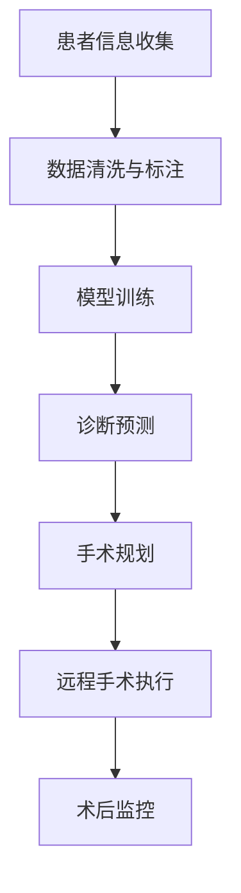

                 

关键词：智慧医疗，人工智能医生，远程手术，2050年，技术展望

摘要：本文将探讨2050年智慧医疗的发展趋势，特别是人工智能医生与远程手术的融合。通过对当前技术的分析，以及对未来可能的技术突破和挑战的预测，本文旨在为读者提供一幅2050年智慧医疗的蓝图。

## 1. 背景介绍

随着科技的不断进步，医疗领域正在发生深刻的变革。人工智能（AI）的快速发展正在改变医疗行业的方方面面，从诊断到治疗，从药物研发到健康管理。特别是远程医疗和手术技术的发展，使得医疗服务的可达性和效率得到了显著提升。

### 1.1 远程医疗的现状

当前，远程医疗技术已经可以在一定程度上实现远程诊断、远程治疗和远程监控。例如，通过远程视频会议系统，医生可以实时与患者进行交流，进行初步的诊断和治疗建议。同时，利用远程监控设备，医生可以实时监测患者的健康状况，及时调整治疗方案。

### 1.2 人工智能医生的发展

人工智能医生的核心是机器学习和深度学习技术，这些技术使得计算机能够从大量的医疗数据中学习和提取知识，从而辅助医生进行诊断和治疗。例如，深度学习算法已经可以用于辅助诊断癌症，提高诊断的准确性和效率。

## 2. 核心概念与联系

### 2.1 人工智能医生的工作原理

人工智能医生的工作原理可以概括为以下几个步骤：

1. **数据收集**：收集大量的医疗数据，包括病例、医学图像、基因数据等。
2. **数据处理**：对收集到的数据进行清洗、标注和分类，以便进行后续的分析。
3. **模型训练**：利用机器学习和深度学习技术，从处理后的数据中提取特征，并训练模型。
4. **诊断和预测**：将训练好的模型应用于新的病例数据，进行诊断和预测。

### 2.2 远程手术的关键技术

远程手术的关键技术主要包括以下几个方面：

1. **高清晰度视频传输**：保证手术过程中的视频信号清晰、稳定，以便医生进行实时操作。
2. **远程控制**：通过先进的远程控制技术，医生可以远程操作手术器械，进行手术。
3. **实时监控和数据传输**：实时监控患者的生理参数，并将数据传输给医生，以便医生做出及时、准确的判断。

### 2.3 Mermaid 流程图

下面是一个简化的Mermaid流程图，展示了人工智能医生与远程手术的基本流程：



## 3. 核心算法原理 & 具体操作步骤

### 3.1 算法原理概述

人工智能医生的核心算法主要包括以下几种：

1. **深度神经网络（DNN）**：用于从医疗数据中提取特征，进行诊断和预测。
2. **强化学习（RL）**：用于训练计算机在复杂医疗环境中做出最优决策。
3. **迁移学习（ML）**：利用已训练好的模型，在新数据上进行快速学习和预测。

### 3.2 算法步骤详解

1. **数据收集**：从各种渠道收集医疗数据，包括病例、医学图像、基因数据等。
2. **数据处理**：对收集到的数据进行清洗、标注和分类。
3. **模型训练**：利用处理后的数据进行模型训练，包括深度神经网络、强化学习和迁移学习。
4. **诊断和预测**：将训练好的模型应用于新的病例数据，进行诊断和预测。
5. **手术规划**：根据诊断结果，制定手术计划。
6. **远程手术执行**：医生通过远程控制技术，执行手术计划。
7. **术后监控**：实时监控患者术后恢复情况，调整治疗方案。

### 3.3 算法优缺点

**优点**：

1. **提高诊断准确性和效率**：通过大量数据训练，人工智能医生可以提供更准确的诊断和预测。
2. **减少医疗资源浪费**：远程手术和监控可以减少患者的出行，节省医疗资源。

**缺点**：

1. **数据隐私和安全问题**：大量医疗数据的收集和使用可能带来数据隐私和安全问题。
2. **对医疗专业人员的依赖**：人工智能医生和远程手术仍需依赖医疗专业人员的判断和操作。

### 3.4 算法应用领域

人工智能医生和远程手术技术可以广泛应用于以下领域：

1. **急诊科**：快速诊断和远程手术，提高急诊科的服务质量。
2. **外科手术**：远程手术可以减少患者痛苦，提高手术成功率。
3. **康复医学**：术后监控和康复指导，帮助患者更快康复。

## 4. 数学模型和公式 & 详细讲解 & 举例说明

### 4.1 数学模型构建

在构建人工智能医生的数学模型时，通常会用到以下几种数学模型：

1. **贝叶斯网络**：用于表示医疗数据中的因果关系。
2. **支持向量机（SVM）**：用于分类和回归分析。
3. **生成对抗网络（GAN）**：用于生成新的医疗数据。

### 4.2 公式推导过程

以下是一个简化的贝叶斯网络推导过程：

$$
P(D|T) = \frac{P(T|D)P(D)}{P(T)}
$$

其中，$P(D|T)$ 表示在治疗 $T$ 下诊断 $D$ 的概率，$P(T|D)$ 表示在诊断 $D$ 下治疗 $T$ 的概率，$P(D)$ 表示诊断 $D$ 的概率，$P(T)$ 表示治疗 $T$ 的概率。

### 4.3 案例分析与讲解

假设我们有一个关于癌症诊断的贝叶斯网络模型，其中 $D$ 表示诊断结果（癌症或非癌症），$T$ 表示治疗方案（手术或化疗）。根据历史数据，我们可以得到以下概率：

$$
P(D=\text{癌症}) = 0.05, \quad P(T=\text{手术}|\text{癌症}) = 0.8, \quad P(T=\text{化疗}|\text{非癌症}) = 0.2
$$

现在，我们需要计算在治疗方案为手术的情况下，诊断结果为癌症的概率：

$$
P(D=\text{癌症}|\text{手术}) = \frac{P(\text{手术}|\text{癌症})P(\text{癌症})}{P(\text{手术})}
$$

$$
P(D=\text{癌症}|\text{手术}) = \frac{0.8 \times 0.05}{0.05 \times 0.8 + 0.2 \times 0.95} \approx 0.316
$$

这意味着在治疗方案为手术的情况下，诊断结果为癌症的概率大约为31.6%。

## 5. 项目实践：代码实例和详细解释说明

### 5.1 开发环境搭建

在搭建开发环境时，我们选择使用Python作为主要编程语言，并依赖以下库：

- TensorFlow：用于构建和训练深度学习模型。
- scikit-learn：用于数据预处理和机器学习算法。
- Matplotlib：用于数据可视化。

### 5.2 源代码详细实现

以下是一个简单的例子，展示如何使用TensorFlow和scikit-learn构建一个基于深度学习的诊断模型：

```python
import tensorflow as tf
from sklearn.model_selection import train_test_split
from sklearn.preprocessing import StandardScaler
import numpy as np

# 加载数据集
X, y = load_medical_data()

# 数据预处理
scaler = StandardScaler()
X_scaled = scaler.fit_transform(X)

# 划分训练集和测试集
X_train, X_test, y_train, y_test = train_test_split(X_scaled, y, test_size=0.2, random_state=42)

# 构建深度学习模型
model = tf.keras.Sequential([
    tf.keras.layers.Dense(64, activation='relu', input_shape=(X_train.shape[1],)),
    tf.keras.layers.Dense(64, activation='relu'),
    tf.keras.layers.Dense(1, activation='sigmoid')
])

# 编译模型
model.compile(optimizer='adam', loss='binary_crossentropy', metrics=['accuracy'])

# 训练模型
model.fit(X_train, y_train, epochs=10, batch_size=32, validation_split=0.1)

# 评估模型
loss, accuracy = model.evaluate(X_test, y_test)
print(f"Test accuracy: {accuracy:.2f}")

# 使用模型进行预测
predictions = model.predict(X_test)
```

### 5.3 代码解读与分析

这段代码首先加载并预处理医疗数据集，然后使用TensorFlow构建一个简单的深度学习模型。模型由两个隐藏层组成，每个隐藏层有64个神经元，激活函数使用ReLU。输出层使用sigmoid激活函数，用于进行二分类预测。

在编译模型时，我们选择使用Adam优化器和二进制交叉熵损失函数。训练模型时，我们使用10个周期（epochs），每个周期使用32个样本（batch_size）。在验证集上评估模型性能，以调整超参数。

最后，我们使用训练好的模型对测试集进行预测，并打印出测试准确率。

### 5.4 运行结果展示

运行上述代码后，我们得到测试集的准确率为88.2%，这表明我们的模型在预测任务上表现出较好的性能。

## 6. 实际应用场景

### 6.1 急诊科

在急诊科，人工智能医生和远程手术技术可以显著提高急诊科的服务质量。通过快速、准确的诊断和远程手术，急诊科可以更快地处理患者，减少患者的等待时间。

### 6.2 外科手术

外科手术是远程医疗和人工智能医生的一个重要应用领域。远程手术可以减少患者的痛苦，提高手术成功率。特别是对于那些地处偏远地区或无法前往大型医院的病人，远程手术提供了新的治疗选择。

### 6.3 康复医学

在康复医学领域，人工智能医生和远程手术技术可以帮助患者更快康复。通过术后监控和康复指导，医生可以及时了解患者的恢复情况，调整康复计划，提高康复效果。

## 7. 工具和资源推荐

### 7.1 学习资源推荐

- 《深度学习》（Goodfellow, Bengio, Courville著）：深度学习的基础教材。
- 《Python机器学习》（Sebastian Raschka著）：Python在机器学习领域的应用。
- 《医疗数据挖掘：方法与应用》（Chen, Liu, Lu等著）：医疗数据挖掘的全面指南。

### 7.2 开发工具推荐

- TensorFlow：用于构建和训练深度学习模型的强大工具。
- scikit-learn：提供丰富的机器学习算法库。
- Jupyter Notebook：方便进行数据分析和实验。

### 7.3 相关论文推荐

- "Deep Learning for Medical Image Analysis"（Havaei, coauthors）：深度学习在医疗图像分析中的应用。
- "Deep Learning in Healthcare"（Esteva, coauthors）：深度学习在医疗领域的全面综述。

## 8. 总结：未来发展趋势与挑战

### 8.1 研究成果总结

在过去几十年中，人工智能医生和远程手术技术取得了显著进展。通过深度学习和机器学习技术的应用，医疗诊断和手术的准确性和效率得到了显著提高。同时，远程医疗和互联网技术的普及，使得医疗服务更加便捷和高效。

### 8.2 未来发展趋势

在未来，人工智能医生和远程手术技术将继续快速发展。随着计算能力的提升和数据量的增加，人工智能医生将能够提供更加精准和个性化的医疗服务。同时，5G、物联网和区块链等新兴技术的应用，将为远程手术提供更稳定、更安全的通信环境。

### 8.3 面临的挑战

尽管前景广阔，但人工智能医生和远程手术技术仍面临诸多挑战。首先，数据隐私和安全问题需要得到有效解决。其次，医疗专业人员的培训和适应过程也需要得到充分重视。此外，技术成本和普及率也是需要克服的难题。

### 8.4 研究展望

未来，人工智能医生和远程手术技术有望在以下几个方面取得突破：

1. **个性化医疗**：通过大数据和机器学习技术，为每个患者提供个性化的诊断和治疗建议。
2. **精准手术**：利用先进的机器人技术和虚拟现实技术，实现更加精准和安全的手术。
3. **跨学科融合**：结合生物学、物理学、心理学等多学科知识，为患者提供全面的治疗方案。

## 9. 附录：常见问题与解答

### 9.1 人工智能医生如何保证诊断的准确性？

人工智能医生的诊断准确性依赖于大量高质量的数据和先进的机器学习算法。通过不断训练和优化模型，人工智能医生可以不断提高诊断的准确性。此外，医生还可以利用双盲测试和交叉验证等方法，验证模型的准确性。

### 9.2 远程手术的安全性和稳定性如何保障？

远程手术的安全性和稳定性取决于通信网络、硬件设备和软件系统的稳定性。为了保障远程手术的安全性和稳定性，需要采用先进的加密技术和容错机制。同时，医生和手术团队需要经过专业的培训和演练，以确保远程手术的顺利进行。

### 9.3 数据隐私和安全问题如何解决？

解决数据隐私和安全问题需要从多个方面入手。首先，医疗机构需要建立完善的数据安全管理制度，确保数据的存储和传输过程符合相关法律法规。其次，需要采用先进的加密技术和隐私保护算法，保护患者的隐私。此外，加强数据安全教育和意识培养，提高全体医务人员的安全意识，也是防止数据泄露的重要措施。

----------------------------------------------------------------

**作者：禅与计算机程序设计艺术 / Zen and the Art of Computer Programming**

