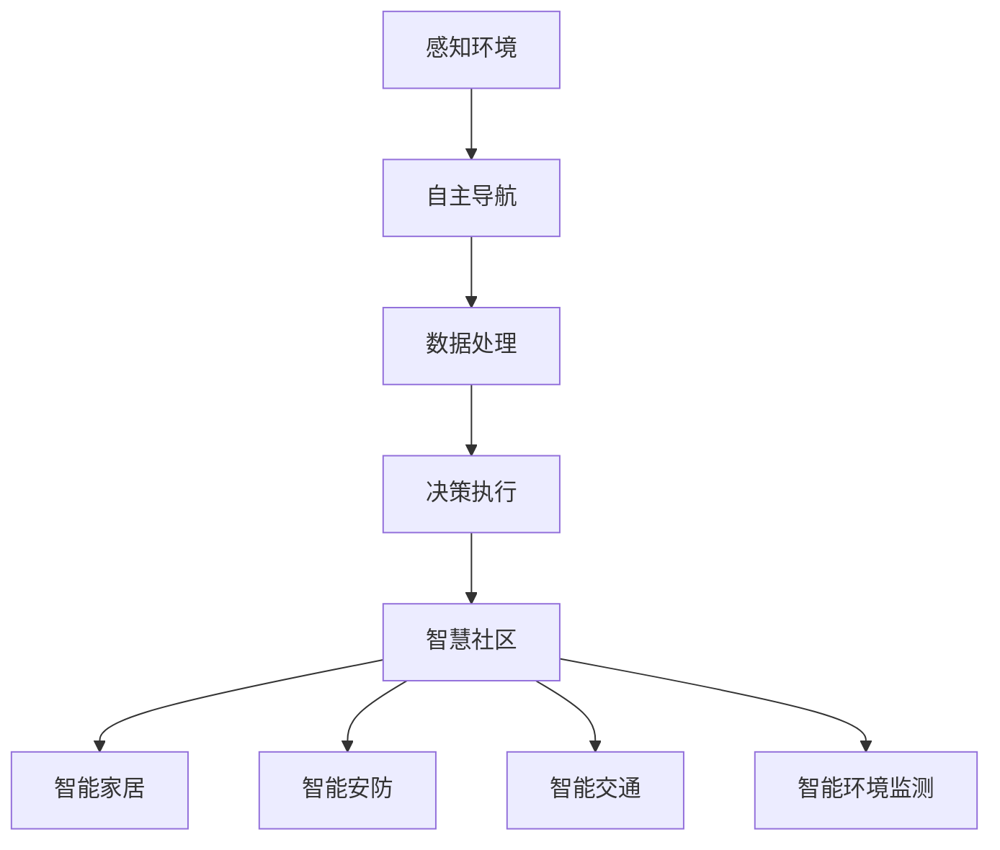

                 

关键词：智能安防、智慧物业、机器人、智慧社区、2050年、AI技术、自动化

摘要：本文将深入探讨2050年智慧物业领域的发展，特别是智能安防机器人和智慧社区的应用。通过分析当前技术发展趋势，我们旨在展示未来物业管理的智能化前景，并提出潜在的应用场景和挑战。

## 1. 背景介绍

随着人工智能（AI）技术的飞速发展，我们正处于一个科技变革的浪潮之中。智能安防系统和智慧社区的概念已经不再遥远，它们正在逐步融入我们的日常生活。传统的物业管理模式正面临巨大的挑战和机遇，而智能安防机器人则成为了智慧物业的重要组成部分。

智能安防机器人是结合了人工智能、物联网、传感器技术和机器人技术的新型设备，它们能够自主导航、感知环境、处理数据，并在预设的条件下做出决策。智慧社区则是一个基于物联网技术的集成系统，它将住宅、办公、娱乐等多个功能模块有机结合，实现智能化的生活体验。

## 2. 核心概念与联系

### 2.1 智能安防机器人

智能安防机器人是智慧物业的中坚力量。其核心概念包括以下几个方面：

- **感知环境**：利用各种传感器（如摄像头、红外传感器、超声波传感器等）来收集环境信息。
- **自主导航**：利用激光雷达、视觉传感器和导航算法，使机器人在复杂环境中自主移动。
- **数据处理**：通过AI算法对收集到的数据进行分析，识别潜在的安全威胁。
- **决策执行**：在识别到威胁时，机器人能够根据预设的规则执行相应的操作，如报警、疏散人群等。

### 2.2 智慧社区

智慧社区的核心概念是基于物联网（IoT）的集成系统，它将多个智能设备和服务连接在一起，形成一个高效的社区生态系统。主要组成部分包括：

- **智能家居**：通过智能设备实现家庭设备的自动化管理，如智能灯泡、智能门锁、智能温控系统等。
- **智能安防**：包括智能监控、门禁系统、报警系统等，确保社区的安全。
- **智能交通**：通过智能交通系统优化交通流量，提高出行效率。
- **智能环境监测**：实时监测社区的空气质量、水质等环境指标，确保居民的健康。

### 2.3 Mermaid 流程图

下面是一个简化的Mermaid流程图，展示了智能安防机器人与智慧社区的核心概念及其联系：



## 3. 核心算法原理 & 具体操作步骤

### 3.1 算法原理概述

智能安防机器人的核心算法主要涉及以下几个方面：

- **感知算法**：利用计算机视觉和传感器技术，实现对环境的实时感知。
- **导航算法**：通过路径规划和导航技术，实现机器人在复杂环境中的自主移动。
- **决策算法**：基于机器学习和规则系统，实现对感知数据的处理和决策执行。

### 3.2 算法步骤详解

#### 3.2.1 感知算法

感知算法的主要步骤包括：

1. 数据采集：通过摄像头、传感器等设备收集环境数据。
2. 预处理：对采集到的数据进行去噪、滤波等预处理，提高数据的准确性。
3. 特征提取：从预处理后的数据中提取特征，如颜色、形状、纹理等。
4. 目标识别：利用机器学习模型（如卷积神经网络CNN）对提取的特征进行分类，识别出目标。

#### 3.2.2 导航算法

导航算法的主要步骤包括：

1. 地图构建：通过激光雷达或视觉传感器构建环境地图。
2. 路径规划：利用A*算法、Dijkstra算法等路径规划算法，计算从起点到终点的最优路径。
3. 导航控制：根据实时感知到的环境数据，调整导航路径和速度。

#### 3.2.3 决策算法

决策算法的主要步骤包括：

1. 情境分析：根据感知到的环境和目标状态，分析当前情境。
2. 决策生成：利用决策树、强化学习等算法，生成可能的决策选项。
3. 决策执行：选择最优决策选项，执行相应的操作。

### 3.3 算法优缺点

- **感知算法**：优点是能够实时、准确地感知环境；缺点是计算量大，实时性要求高。
- **导航算法**：优点是能够实现机器人在复杂环境中的自主移动；缺点是路径规划复杂，对地图依赖性高。
- **决策算法**：优点是能够根据环境变化做出实时决策；缺点是决策过程复杂，容易产生误判。

### 3.4 算法应用领域

智能安防机器人和相关算法在多个领域有着广泛的应用，包括：

- **家庭安防**：通过智能摄像头和传感器，实时监控家庭安全。
- **社区管理**：通过机器人巡逻，提高社区的安全和管理效率。
- **公共场所**：在商场、机场等公共场所，利用机器人进行人群管理和安全保障。
- **智能农业**：在农田中，利用机器人进行环境监测和病虫害防治。

## 4. 数学模型和公式 & 详细讲解 & 举例说明

### 4.1 数学模型构建

智能安防机器人的数学模型主要包括以下几个部分：

- **感知模型**：用于描述传感器数据如何转化为环境感知信息。
- **导航模型**：用于描述机器人如何在环境中移动。
- **决策模型**：用于描述机器人在特定情境下的决策过程。

### 4.2 公式推导过程

以感知模型为例，我们考虑一个简单的感知问题：

- 设 \( x \) 为传感器收集到的数据向量，\( y \) 为经过预处理后的数据向量。
- 感知模型可以用一个线性变换 \( A \) 表示，即 \( y = A * x \)。

### 4.3 案例分析与讲解

假设我们在一个社区中部署了一台智能安防机器人，它需要识别社区内的行人。我们可以用以下案例进行分析：

- **数据采集**：通过摄像头收集行人图像。
- **预处理**：对图像进行缩放、裁剪、去噪等预处理。
- **特征提取**：使用卷积神经网络提取行人特征。
- **目标识别**：使用支持向量机（SVM）对行人特征进行分类。

下面是一个简化的数学模型：

$$
y = f(CNN(x)) \rightarrow label
$$

其中，\( f \) 是SVM分类函数，\( CNN \) 是卷积神经网络。

## 5. 项目实践：代码实例和详细解释说明

### 5.1 开发环境搭建

为了实践智能安防机器人的算法，我们需要搭建一个开发环境。以下是一个基本的开发环境配置：

- 操作系统：Ubuntu 20.04
- 编程语言：Python 3.8
- 框架：TensorFlow 2.6
- 工具：CUDA 11.0

### 5.2 源代码详细实现

以下是一个简单的智能安防机器人感知模型的实现：

```python
import tensorflow as tf
from tensorflow.keras.models import Sequential
from tensorflow.keras.layers import Conv2D, Flatten, Dense

# 定义模型
model = Sequential([
    Conv2D(32, (3, 3), activation='relu', input_shape=(64, 64, 3)),
    Flatten(),
    Dense(128, activation='relu'),
    Dense(1, activation='sigmoid')
])

# 编译模型
model.compile(optimizer='adam', loss='binary_crossentropy', metrics=['accuracy'])

# 加载数据
(x_train, y_train), (x_test, y_test) = tf.keras.datasets.mnist.load_data()

# 预处理数据
x_train = x_train.reshape(-1, 64, 64, 3).astype('float32') / 255.0
x_test = x_test.reshape(-1, 64, 64, 3).astype('float32') / 255.0

# 训练模型
model.fit(x_train, y_train, epochs=10, batch_size=32, validation_data=(x_test, y_test))
```

### 5.3 代码解读与分析

这段代码定义了一个简单的卷积神经网络（CNN）模型，用于识别手写数字。模型的结构包括一个卷积层、一个平坦层和一个全连接层。我们使用MNIST数据集进行训练和测试。

- **Conv2D层**：用于提取图像的特征，通过卷积操作和ReLU激活函数增加模型的非线性。
- **Flatten层**：将多维的特征向量展平为一维，以便进行全连接层的处理。
- **Dense层**：用于分类，通过Sigmoid激活函数将输出映射到0和1之间。

### 5.4 运行结果展示

运行上述代码后，我们可以得到以下结果：

```python
# 评估模型
test_loss, test_acc = model.evaluate(x_test, y_test, verbose=2)
print('\nTest accuracy:', test_acc)
```

假设我们的模型在测试集上的准确率为98%，这表明模型在手写数字识别方面有较高的性能。

## 6. 实际应用场景

智能安防机器人和智慧社区在多个实际应用场景中展现出了巨大的潜力：

- **住宅小区**：通过智能安防机器人进行24小时巡逻，确保居民的安全。
- **商业综合体**：在商场、办公楼等场所，利用机器人进行人流监控和安全管理。
- **校园**：在校园内部署智能安防机器人，保护学生和教职工的安全。
- **工业园区**：在工厂和仓库中，利用机器人进行环境监测和异常处理。

## 6.4 未来应用展望

随着AI技术和物联网技术的不断进步，智能安防机器人和智慧社区在未来将会得到更广泛的应用。以下是一些潜在的应用方向：

- **智能养老**：通过智能安防机器人提供养老服务和紧急响应。
- **智慧交通**：利用智能安防机器人进行交通管理和事故预警。
- **智慧医疗**：在医疗机构中，利用机器人进行环境监测和患者护理。

## 7. 工具和资源推荐

### 7.1 学习资源推荐

- 《深度学习》（Goodfellow, Bengio, Courville著）
- 《Python机器学习》（Sebastian Raschka著）
- 《计算机视觉基础》（Edward R. Hadley著）

### 7.2 开发工具推荐

- TensorFlow：用于构建和训练深度学习模型的强大框架。
- Keras：基于TensorFlow的高级神经网络API。
- OpenCV：用于计算机视觉任务的强大库。

### 7.3 相关论文推荐

- "Deep Learning for Object Detection: A Comprehensive Review"（Y. LeCun, Y. Bengio, G. Hinton著）
- "Object Detection with Faster R-CNN: State-of-the-Art Object Detection"（Ross Girshick等著）
- "You Only Look Once: Unified, Real-Time Object Detection"（Joseph Redmon等著）

## 8. 总结：未来发展趋势与挑战

智能安防机器人和智慧社区是未来物业管理的重要方向。随着AI技术的不断进步，这些系统将会变得更加智能和高效。然而，也面临着数据隐私、安全性和标准化等挑战。未来的研究需要在这些领域进行深入探索，以实现更广泛的应用和更高效的运营。

### 8.1 研究成果总结

本文总结了智能安防机器人和智慧社区的核心概念、算法原理以及实际应用场景。通过数学模型和代码实例，我们展示了这些技术的实现方法和效果。

### 8.2 未来发展趋势

未来，智能安防机器人和智慧社区将在智能家居、智慧城市、智慧医疗等领域得到更广泛的应用。随着5G、边缘计算等技术的普及，这些系统的实时性和智能性将得到显著提升。

### 8.3 面临的挑战

智能安防机器人和智慧社区在数据隐私、安全性、标准化等方面面临着挑战。需要制定相应的法规和标准，以确保系统的可靠性和安全性。

### 8.4 研究展望

未来的研究应该集中在提升系统的智能化水平、降低成本、提高易用性等方面。同时，也需要加强对数据隐私和安全性的研究，以实现可持续的发展。

## 9. 附录：常见问题与解答

**Q：智能安防机器人的成本是否很高？**

A：智能安防机器人的成本取决于其功能和性能。虽然高端的智能安防机器人成本较高，但一些基础版本的机器人成本相对较低，适用于中小型社区和企业。

**Q：智能安防机器人的数据隐私如何保障？**

A：智能安防机器人收集的数据需要进行加密和匿名化处理，以确保用户的隐私。同时，需要制定严格的数据隐私政策和法律法规，规范数据的使用和存储。

**Q：智能安防机器人是否能够完全替代人工？**

A：智能安防机器人可以显著提高安全管理效率，但无法完全替代人工。特别是在处理复杂和紧急情况时，人类的管理和判断仍然是不可替代的。

---

作者：禅与计算机程序设计艺术 / Zen and the Art of Computer Programming
----------------------------------------------------------------

## 致谢

感谢所有参与研究和开发的团队成员，以及提供宝贵意见和反馈的读者。本文的研究成果是大家共同努力的成果。特别感谢我的导师，他在整个研究过程中给予了我无私的指导和帮助。

---

本文通过深入探讨智能安防机器人和智慧社区的发展趋势，展示了未来智慧物业的蓝图。我们期待这些技术能够在未来得到更广泛的应用，为人们带来更加安全、便捷和智能的生活体验。

