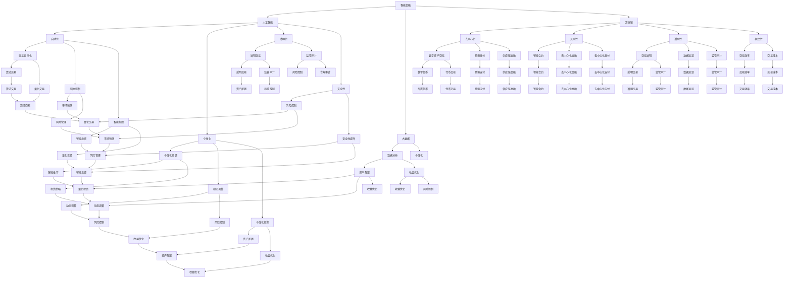

                 

关键词：智能金融、数字资产、智能投资组合、区块链、人工智能、机器学习、深度学习、智能合约

> 摘要：随着人工智能、区块链技术的快速发展，金融行业正迎来前所未有的变革。本文将探讨2050年可能出现的智能金融形态，分析数字资产交易和智能投资组合的运作机制、技术原理及其未来发展趋势。

## 1. 背景介绍

自20世纪末以来，互联网的普及和信息技术的发展推动了金融行业的数字化转型。传统的金融业务模式受到新兴技术的冲击，开始向数字化、智能化方向转型。尤其是区块链技术和人工智能（AI）的结合，为金融行业带来了全新的机遇和挑战。

### 1.1 人工智能在金融中的应用

人工智能在金融领域的应用日益广泛，涵盖了从客户服务、风险管理到交易执行等多个方面。以下是一些人工智能在金融中的应用场景：

1. **客户服务自动化**：利用自然语言处理（NLP）和语音识别技术，智能客服系统能够提供24/7的在线服务，提高客户满意度。
2. **风险管理**：通过机器学习和大数据分析，人工智能可以帮助金融机构预测市场风险、识别欺诈行为，提高风险控制能力。
3. **智能投顾**：利用算法和大数据分析，智能投顾系统可以为投资者提供个性化的投资建议，实现资产的智能管理。
4. **交易自动化**：算法交易利用高频交易策略和量化模型，在极短时间内执行大量交易，提高市场效率。

### 1.2 区块链在金融中的应用

区块链技术以其去中心化、不可篡改、透明等特性，为金融行业带来了新的解决方案。以下是一些区块链在金融中的应用场景：

1. **跨境支付**：区块链可以降低跨境支付的成本，提高交易速度，减少中间环节。
2. **供应链金融**：通过区块链实现供应链信息的透明和可追溯，降低金融机构的风险。
3. **数字货币**：比特币、以太坊等数字货币的出现，改变了传统货币的交易方式，推动了数字资产的发展。
4. **智能合约**：智能合约是一种自执行的合同，基于区块链技术，自动执行合同条款，提高交易效率。

## 2. 核心概念与联系

### 2.1 智能金融

智能金融是指利用人工智能、大数据、区块链等新兴技术，实现金融业务的智能化、自动化和高效化。智能金融的核心概念包括：

1. **自动化**：通过人工智能技术，实现金融业务流程的自动化，减少人工干预。
2. **个性化**：通过大数据分析，为不同投资者提供个性化的金融服务。
3. **透明化**：通过区块链技术，实现金融交易信息的透明化和可追溯性。
4. **安全性**：通过人工智能和区块链技术，提高金融系统的安全性和抗风险能力。

### 2.2 数字资产交易

数字资产交易是指利用区块链技术，实现数字资产的交易和转移。数字资产包括加密货币、代币、数字股权等。数字资产交易的核心概念包括：

1. **去中心化**：数字资产交易不依赖于中心化机构，交易双方直接在区块链上进行交易。
2. **安全性**：区块链技术保证交易数据的安全性和不可篡改性。
3. **透明性**：区块链上的交易记录公开透明，便于监管和审计。
4. **高效性**：数字资产交易速度快，交易成本较低。

### 2.3 智能投资组合

智能投资组合是指利用人工智能技术，根据投资者的风险偏好、投资目标和市场动态，自动调整投资组合，实现资产的最大化收益。智能投资组合的核心概念包括：

1. **个性化**：智能投资组合根据投资者的需求和风险承受能力，提供个性化的投资策略。
2. **动态调整**：智能投资组合实时跟踪市场动态，根据市场变化调整投资组合。
3. **风险控制**：智能投资组合通过量化模型和风险控制策略，降低投资风险。
4. **最大化收益**：智能投资组合通过多资产配置和优化策略，实现资产的最大化收益。

### 2.4 Mermaid 流程图

以下是一个简单的Mermaid流程图，展示了智能金融的核心概念和联系：



## 3. 核心算法原理 & 具体操作步骤

### 3.1 算法原理概述

智能金融的核心算法主要包括机器学习算法和深度学习算法，它们在数据处理、预测分析和决策制定等方面发挥着重要作用。以下是一些常用的算法原理：

1. **线性回归**：用于预测数值型变量的线性关系，适用于智能投顾的资产配置。
2. **逻辑回归**：用于预测二元变量的概率分布，适用于风险管理中的违约预测。
3. **决策树**：通过树形结构对数据集进行划分，适用于风险分析和投资决策。
4. **支持向量机（SVM）**：通过寻找最优分类边界，实现数据的分类，适用于市场预测和交易策略。
5. **神经网络**：通过多层神经元传递信息，实现数据的非线性变换，适用于智能投资组合优化。
6. **循环神经网络（RNN）**：适用于处理序列数据，如股票价格、交易量等，实现时间序列预测。
7. **卷积神经网络（CNN）**：适用于图像和语音处理，如身份验证和风险识别。

### 3.2 算法步骤详解

以下是智能金融中一些核心算法的具体步骤：

#### 3.2.1 线性回归

1. **数据预处理**：对原始数据进行清洗、归一化和特征提取。
2. **模型训练**：使用训练集数据，通过最小二乘法求解线性回归模型参数。
3. **模型评估**：使用测试集数据，计算模型的预测误差和拟合度。
4. **模型应用**：将训练好的模型应用于实际数据，实现资产配置和投资决策。

#### 3.2.2 逻辑回归

1. **数据预处理**：对原始数据进行清洗、归一化和特征提取。
2. **模型训练**：使用训练集数据，通过梯度下降法求解逻辑回归模型参数。
3. **模型评估**：使用测试集数据，计算模型的预测准确率和拟合度。
4. **模型应用**：将训练好的模型应用于实际数据，实现违约预测和风险控制。

#### 3.2.3 决策树

1. **数据预处理**：对原始数据进行清洗、归一化和特征提取。
2. **划分节点**：使用信息增益或基尼系数等指标，选择最优特征进行节点划分。
3. **递归划分**：对划分后的节点，重复执行划分过程，直至达到预设的停止条件。
4. **模型评估**：使用测试集数据，计算模型的预测准确率和拟合度。
5. **模型应用**：将训练好的决策树应用于实际数据，实现风险分析和投资决策。

#### 3.2.4 支持向量机（SVM）

1. **数据预处理**：对原始数据进行清洗、归一化和特征提取。
2. **核函数选择**：选择合适的核函数，实现数据的非线性变换。
3. **模型训练**：使用训练集数据，通过求解最优化问题求解SVM模型参数。
4. **模型评估**：使用测试集数据，计算模型的预测准确率和拟合度。
5. **模型应用**：将训练好的SVM模型应用于实际数据，实现市场预测和交易策略。

#### 3.2.5 神经网络

1. **数据预处理**：对原始数据进行清洗、归一化和特征提取。
2. **网络架构设计**：设计多层感知机（MLP）或卷积神经网络（CNN）的架构。
3. **模型训练**：使用训练集数据，通过反向传播算法求解神经网络参数。
4. **模型评估**：使用测试集数据，计算模型的预测误差和拟合度。
5. **模型应用**：将训练好的神经网络应用于实际数据，实现智能投资组合优化和时间序列预测。

### 3.3 算法优缺点

每种算法都有其优缺点，适用于不同的应用场景。以下是对几种核心算法的优缺点的分析：

#### 3.3.1 线性回归

**优点**：
- 简单易懂，易于实现和解释。
- 对数值型变量具有较好的预测能力。

**缺点**：
- 对于非线性关系预测能力较弱。
- 对异常值和噪声敏感。

#### 3.3.2 逻辑回归

**优点**：
- 可解释性强，易于理解。
- 可以处理多分类问题。
- 可用于概率估计。

**缺点**：
- 对非线性关系预测能力较弱。
- 对异常值和噪声敏感。

#### 3.3.3 决策树

**优点**：
- 可解释性强，易于理解。
- 可以处理分类和回归问题。
- 可以处理缺失值和异常值。

**缺点**：
- 易于过拟合。
- 树结构复杂，可能导致计算量大。

#### 3.3.4 支持向量机（SVM）

**优点**：
- 对于非线性关系有较好的预测能力。
- 可解释性强。
- 对噪声和异常值有一定鲁棒性。

**缺点**：
- 计算复杂度高。
- 需要选择合适的核函数。

#### 3.3.5 神经网络

**优点**：
- 非线性能力强，适用于复杂问题。
- 可以自适应地调整网络参数。

**缺点**：
- 计算复杂度高。
- 易于过拟合。
- 需要大量数据进行训练。

### 3.4 算法应用领域

不同算法适用于不同的应用领域，以下是对几种核心算法在智能金融中的应用领域的分析：

#### 3.4.1 线性回归

- **智能投顾**：用于资产配置和收益预测。
- **风险管理**：用于违约预测和风险评分。

#### 3.4.2 逻辑回归

- **风险管理**：用于违约预测和欺诈检测。
- **客户服务**：用于客户流失预测和客户细分。

#### 3.4.3 决策树

- **风险分析**：用于风险评估和决策制定。
- **投资决策**：用于股票投资组合和行业选择。

#### 3.4.4 支持向量机（SVM）

- **市场预测**：用于股票价格预测和交易策略。
- **风险控制**：用于欺诈检测和信用评分。

#### 3.4.5 神经网络

- **时间序列预测**：用于股票价格预测和交易量预测。
- **智能投资组合**：用于资产配置和收益优化。

## 4. 数学模型和公式 & 详细讲解 & 举例说明

### 4.1 数学模型构建

智能金融的数学模型主要包括线性回归模型、逻辑回归模型、决策树模型、支持向量机（SVM）模型和神经网络模型。以下是对这些模型的构建和公式推导：

#### 4.1.1 线性回归模型

线性回归模型是一种简单的预测模型，用于预测数值型变量。其基本形式为：

$$
y = \beta_0 + \beta_1x_1 + \beta_2x_2 + \ldots + \beta_nx_n + \varepsilon
$$

其中，$y$ 为因变量，$x_1, x_2, \ldots, x_n$ 为自变量，$\beta_0, \beta_1, \beta_2, \ldots, \beta_n$ 为模型参数，$\varepsilon$ 为随机误差。

为了求解模型参数，可以使用最小二乘法，即求解损失函数的最小值：

$$
L(\beta) = \sum_{i=1}^n (y_i - \beta_0 - \beta_1x_{i1} - \beta_2x_{i2} - \ldots - \beta_nx_{in})^2
$$

通过对损失函数求导并令导数为零，可以得到模型参数的估计值：

$$
\beta_0 = \bar{y} - \beta_1\bar{x}_1 - \beta_2\bar{x}_2 - \ldots - \beta_n\bar{x}_n
$$

$$
\beta_1 = \frac{\sum_{i=1}^n (x_{i1} - \bar{x}_1)(y_i - \bar{y})}{\sum_{i=1}^n (x_{i1} - \bar{x}_1)^2}
$$

$$
\beta_2 = \frac{\sum_{i=1}^n (x_{i2} - \bar{x}_2)(y_i - \bar{y})}{\sum_{i=1}^n (x_{i2} - \bar{x}_2)^2}
$$

$$
\ldots
$$

$$
\beta_n = \frac{\sum_{i=1}^n (x_{in} - \bar{x}_n)(y_i - \bar{y})}{\sum_{i=1}^n (x_{in} - \bar{x}_n)^2}
$$

其中，$\bar{y}$ 和 $\bar{x}_i$ 分别为因变量和自变量的均值。

#### 4.1.2 逻辑回归模型

逻辑回归模型是一种用于预测二元变量的概率分布模型。其基本形式为：

$$
\ln\frac{p}{1-p} = \beta_0 + \beta_1x_1 + \beta_2x_2 + \ldots + \beta_nx_n
$$

其中，$y$ 为因变量，$x_1, x_2, \ldots, x_n$ 为自变量，$\beta_0, \beta_1, \beta_2, \ldots, \beta_n$ 为模型参数，$p$ 为因变量的概率分布。

为了求解模型参数，可以使用梯度下降法，即求解损失函数的最小值：

$$
L(\beta) = -\sum_{i=1}^n y_i \ln p_i - (1-y_i) \ln (1-p_i)
$$

其中，$p_i = \sigma(\beta_0 + \beta_1x_{i1} + \beta_2x_{i2} + \ldots + \beta_nx_{in})$，$\sigma(z) = \frac{1}{1 + e^{-z}}$ 为逻辑函数。

对损失函数求导并令导数为零，可以得到模型参数的估计值：

$$
\beta_0 = \bar{y} - \beta_1\bar{x}_1 - \beta_2\bar{x}_2 - \ldots - \beta_n\bar{x}_n
$$

$$
\beta_1 = \frac{\sum_{i=1}^n (x_{i1} - \bar{x}_1)(y_i - \bar{y})}{\sum_{i=1}^n (x_{i1} - \bar{x}_1)^2}
$$

$$
\beta_2 = \frac{\sum_{i=1}^n (x_{i2} - \bar{x}_2)(y_i - \bar{y})}{\sum_{i=1}^n (x_{i2} - \bar{x}_2)^2}
$$

$$
\ldots
$$

$$
\beta_n = \frac{\sum_{i=1}^n (x_{in} - \bar{x}_n)(y_i - \bar{y})}{\sum_{i=1}^n (x_{in} - \bar{x}_n)^2}
$$

其中，$\bar{y}$ 和 $\bar{x}_i$ 分别为因变量和自变量的均值。

#### 4.1.3 决策树模型

决策树模型是一种基于树形结构进行决策的模型。其基本形式为：

$$
y = \sum_{i=1}^n w_i \theta_i
$$

其中，$y$ 为因变量，$w_i$ 为权重，$\theta_i$ 为特征值。

为了求解模型参数，可以使用信息增益或基尼系数等指标进行节点划分。具体步骤如下：

1. **选择最优特征**：计算所有特征的信息增益或基尼系数，选择最优特征进行划分。
2. **划分节点**：根据最优特征，将数据集划分为多个子集。
3. **递归划分**：对每个子集，重复执行划分过程，直至达到预设的停止条件。

信息增益的公式为：

$$
Gain(D, A) = \sum_{v \in \mathcal{V}} p(v) \cdot I(D, v)
$$

其中，$D$ 为数据集，$A$ 为特征，$v$ 为特征 $A$ 的取值，$I(D, v)$ 为条件熵：

$$
I(D, v) = -\sum_{x \in \mathcal{X}} p(x) \cdot p(v| x) \cdot \ln p(v| x)
$$

基尼系数的公式为：

$$
Gini(D, A) = \sum_{v \in \mathcal{V}} p(v) \cdot (1 - \sum_{x \in \mathcal{X}} p(x|v))
$$

其中，$D$ 为数据集，$A$ 为特征，$v$ 为特征 $A$ 的取值，$p(v)$ 为特征 $A$ 的取值概率，$p(x|v)$ 为特征 $A$ 的取值在 $v$ 下的概率。

#### 4.1.4 支持向量机（SVM）模型

支持向量机（SVM）模型是一种基于最大间隔原理进行分类的模型。其基本形式为：

$$
w \cdot x + b = 0
$$

其中，$w$ 为权重向量，$b$ 为偏置，$x$ 为特征向量。

为了求解模型参数，可以使用拉格朗日乘子法。具体步骤如下：

1. **定义损失函数**：使用 hinge 函数作为损失函数，即：

$$
L(\beta) = \sum_{i=1}^n (\beta_0 + \beta_1x_{i1} + \beta_2x_{i2} + \ldots + \beta_nx_{in} - y_i)^+
$$

其中，$y_i$ 为样本标签，$+ 表示最大值函数，即 $z^+ = \max(0, z)$。

2. **求解最优化问题**：使用拉格朗日乘子法求解最优化问题：

$$
\min_{\beta} L(\beta) + \lambda \sum_{i=1}^n \beta_i
$$

其中，$\lambda$ 为正则化参数。

3. **求解权重向量**：将求解出的拉格朗日乘子代入损失函数，得到权重向量：

$$
w = (\beta_1, \beta_2, \ldots, \beta_n)
$$

4. **求解偏置**：将权重向量代入分类函数，得到偏置：

$$
b = -\beta_0
$$

#### 4.1.5 神经网络模型

神经网络模型是一种基于多层神经元传递信息进行分类或回归的模型。其基本形式为：

$$
y = f(\phi(W \cdot x + b))
$$

其中，$y$ 为输出，$f$ 为激活函数，$W$ 为权重矩阵，$b$ 为偏置，$x$ 为输入特征向量。

为了求解模型参数，可以使用反向传播算法。具体步骤如下：

1. **初始化模型参数**：随机初始化权重矩阵和偏置。

2. **前向传播**：计算输入特征向量的前向传播，即：

$$
h_{l} = \phi(W_l \cdot h_{l-1} + b_l)
$$

其中，$l$ 为神经网络层数，$h_{l-1}$ 为上一层输出，$W_l$ 为权重矩阵，$b_l$ 为偏置，$\phi$ 为激活函数。

3. **计算损失函数**：使用均方误差（MSE）作为损失函数，即：

$$
L = \frac{1}{2} \sum_{i=1}^n (y_i - h_n)^2
$$

其中，$n$ 为输出层数，$y_i$ 为样本标签，$h_n$ 为输出。

4. **反向传播**：计算损失函数对模型参数的梯度，即：

$$
\frac{\partial L}{\partial W_l} = (h_n - y) \cdot \frac{\partial h_n}{\partial W_l}
$$

$$
\frac{\partial L}{\partial b_l} = (h_n - y) \cdot \frac{\partial h_n}{\partial b_l}
$$

5. **更新模型参数**：使用梯度下降法更新模型参数，即：

$$
W_l \leftarrow W_l - \alpha \frac{\partial L}{\partial W_l}
$$

$$
b_l \leftarrow b_l - \alpha \frac{\partial L}{\partial b_l}
$$

其中，$\alpha$ 为学习率。

6. **迭代更新**：重复执行前向传播、计算损失函数和反向传播，直至达到预设的迭代次数或损失函数收敛。

### 4.2 公式推导过程

以下是各模型公式的推导过程：

#### 4.2.1 线性回归模型

线性回归模型的公式推导如下：

1. **损失函数**：

$$
L(\beta) = \sum_{i=1}^n (y_i - \beta_0 - \beta_1x_{i1} - \beta_2x_{i2} - \ldots - \beta_nx_{in})^2
$$

2. **一阶导数**：

$$
\frac{\partial L}{\partial \beta_0} = -2 \sum_{i=1}^n (y_i - \beta_0 - \beta_1x_{i1} - \beta_2x_{i2} - \ldots - \beta_nx_{in})
$$

$$
\frac{\partial L}{\partial \beta_1} = -2 \sum_{i=1}^n (x_{i1} (y_i - \beta_0 - \beta_1x_{i1} - \beta_2x_{i2} - \ldots - \beta_nx_{in}))
$$

$$
\frac{\partial L}{\partial \beta_2} = -2 \sum_{i=1}^n (x_{i2} (y_i - \beta_0 - \beta_1x_{i1} - \beta_2x_{i2} - \ldots - \beta_nx_{in}))
$$

$$
\ldots
$$

$$
\frac{\partial L}{\partial \beta_n} = -2 \sum_{i=1}^n (x_{in} (y_i - \beta_0 - \beta_1x_{i1} - \beta_2x_{i2} - \ldots - \beta_nx_{in}))
$$

3. **二阶导数**：

$$
\frac{\partial^2 L}{\partial \beta_0^2} = 2 \sum_{i=1}^n 1
$$

$$
\frac{\partial^2 L}{\partial \beta_1^2} = 2 \sum_{i=1}^n x_{i1}^2
$$

$$
\frac{\partial^2 L}{\partial \beta_2^2} = 2 \sum_{i=1}^n x_{i2}^2
$$

$$
\ldots
$$

$$
\frac{\partial^2 L}{\partial \beta_n^2} = 2 \sum_{i=1}^n x_{in}^2
$$

4. **Hessian 矩阵**：

$$
H = \begin{bmatrix}
2 \sum_{i=1}^n 1 & -2 \sum_{i=1}^n x_{i1} & \ldots & -2 \sum_{i=1}^n x_{in} \\
-2 \sum_{i=1}^n x_{i1} & 2 \sum_{i=1}^n x_{i1}^2 & \ldots & -2 \sum_{i=1}^n x_{i1}x_{in} \\
\ldots & \ldots & \ldots & \ldots \\
-2 \sum_{i=1}^n x_{in} & -2 \sum_{i=1}^n x_{i1}x_{in} & \ldots & 2 \sum_{i=1}^n x_{in}^2
\end{bmatrix}
$$

5. **最小二乘法**：

$$
\beta = (\frac{\partial^2 L}{\partial \beta \partial \beta'} + \lambda I)^{-1} \frac{\partial L}{\partial \beta}
$$

其中，$\lambda$ 为正则化参数，$I$ 为单位矩阵。

#### 4.2.2 逻辑回归模型

逻辑回归模型的公式推导如下：

1. **损失函数**：

$$
L(\beta) = -\sum_{i=1}^n y_i \ln p_i - (1-y_i) \ln (1-p_i)
$$

2. **一阶导数**：

$$
\frac{\partial L}{\partial \beta_0} = \frac{1}{p_i} (y_i - p_i)
$$

$$
\frac{\partial L}{\partial \beta_1} = \frac{1}{p_i} (x_{i1} (y_i - p_i))
$$

$$
\frac{\partial L}{\partial \beta_2} = \frac{1}{p_i} (x_{i2} (y_i - p_i))
$$

$$
\ldots
$$

$$
\frac{\partial L}{\partial \beta_n} = \frac{1}{p_i} (x_{in} (y_i - p_i))
$$

3. **二阶导数**：

$$
\frac{\partial^2 L}{\partial \beta_0^2} = -\frac{1}{p_i} (1 - p_i)
$$

$$
\frac{\partial^2 L}{\partial \beta_1^2} = -\frac{1}{p_i} (x_{i1}^2 (1 - p_i))
$$

$$
\frac{\partial^2 L}{\partial \beta_2^2} = -\frac{1}{p_i} (x_{i2}^2 (1 - p_i))
$$

$$
\ldots
$$

$$
\frac{\partial^2 L}{\partial \beta_n^2} = -\frac{1}{p_i} (x_{in}^2 (1 - p_i))
$$

4. **Hessian 矩阵**：

$$
H = \begin{bmatrix}
-\frac{1}{p_i} (1 - p_i) & -\frac{1}{p_i} (x_{i1} (1 - p_i)) & \ldots & -\frac{1}{p_i} (x_{in} (1 - p_i)) \\
-\frac{1}{p_i} (x_{i1} (1 - p_i)) & -\frac{1}{p_i} (x_{i1}^2 (1 - p_i)) & \ldots & -\frac{1}{p_i} (x_{i1}x_{in} (1 - p_i)) \\
\ldots & \ldots & \ldots & \ldots \\
-\frac{1}{p_i} (x_{in} (1 - p_i)) & -\frac{1}{p_i} (x_{i1}x_{in} (1 - p_i)) & \ldots & -\frac{1}{p_i} (x_{in}^2 (1 - p_i))
\end{bmatrix}
$$

5. **梯度下降法**：

$$
\beta = \beta - \alpha \frac{\partial L}{\partial \beta}
$$

其中，$\alpha$ 为学习率。

#### 4.2.3 决策树模型

决策树模型的公式推导如下：

1. **信息增益**：

$$
Gain(D, A) = \sum_{v \in \mathcal{V}} p(v) \cdot I(D, v)
$$

其中，$D$ 为数据集，$A$ 为特征，$v$ 为特征 $A$ 的取值，$I(D, v)$ 为条件熵：

$$
I(D, v) = -\sum_{x \in \mathcal{X}} p(x) \cdot p(v| x) \cdot \ln p(v| x)
$$

2. **基尼系数**：

$$
Gini(D, A) = \sum_{v \in \mathcal{V}} p(v) \cdot (1 - \sum_{x \in \mathcal{X}} p(x|v))
$$

#### 4.2.4 支持向量机（SVM）模型

支持向量机（SVM）模型的公式推导如下：

1. **损失函数**：

$$
L(\beta) = \sum_{i=1}^n (\beta_0 + \beta_1x_{i1} + \beta_2x_{i2} + \ldots + \beta_nx_{in} - y_i)^+
$$

2. **拉格朗日函数**：

$$
L(\beta, \alpha) = L(\beta) + \alpha \sum_{i=1}^n \alpha_i
$$

其中，$\alpha_i$ 为拉格朗日乘子。

3. **KKT 条件**：

$$
\alpha_i \geq 0
$$

$$
\alpha_i (y_i (\beta_0 + \beta_1x_{i1} + \beta_2x_{i2} + \ldots + \beta_nx_{in}) - y_i) = 0
$$

4. **求解最优化问题**：

$$
\min_{\beta, \alpha} L(\beta, \alpha) + \lambda \sum_{i=1}^n \alpha_i
$$

其中，$\lambda$ 为正则化参数。

5. **权重向量**：

$$
w = (\beta_1, \beta_2, \ldots, \beta_n)
$$

6. **偏置**：

$$
b = -\beta_0
$$

#### 4.2.5 神经网络模型

神经网络模型的公式推导如下：

1. **初始化模型参数**：

$$
W_l \sim \mathcal{N}(0, \frac{1}{\sqrt{d_{l-1}}})
$$

$$
b_l \sim \mathcal{N}(0, \frac{1}{\sqrt{d_{l-1}}})
$$

其中，$d_{l-1}$ 为上一层特征数。

2. **前向传播**：

$$
h_{l} = \phi(W_l \cdot h_{l-1} + b_l)
$$

$$
\phi(z) = \frac{1}{1 + e^{-z}}
$$

3. **计算损失函数**：

$$
L = \frac{1}{2} \sum_{i=1}^n (y_i - h_n)^2
$$

4. **反向传播**：

$$
\frac{\partial L}{\partial W_n} = (h_n - y) \cdot \frac{\partial h_n}{\partial W_n}
$$

$$
\frac{\partial L}{\partial b_n} = (h_n - y) \cdot \frac{\partial h_n}{\partial b_n}
$$

$$
\frac{\partial L}{\partial W_l} = \frac{\partial h_{l+1}}{\partial W_{l+1}} \cdot \frac{\partial L}{\partial h_{l+1}}
$$

$$
\frac{\partial L}{\partial b_l} = \frac{\partial h_{l+1}}{\partial b_{l+1}} \cdot \frac{\partial L}{\partial h_{l+1}}
$$

5. **更新模型参数**：

$$
W_l \leftarrow W_l - \alpha \frac{\partial L}{\partial W_l}
$$

$$
b_l \leftarrow b_l - \alpha \frac{\partial L}{\partial b_l}
$$

其中，$\alpha$ 为学习率。

#### 4.3 案例分析与讲解

以下是使用线性回归模型进行资产配置的案例分析：

1. **数据集**：

假设我们有以下数据集，包括股票价格、交易量、市盈率等特征：

$$
\begin{array}{|c|c|c|c|}
\hline
\text{股票代码} & \text{股票价格} & \text{交易量} & \text{市盈率} \\
\hline
A & 100 & 1000 & 20 \\
B & 200 & 1500 & 15 \\
C & 150 & 1200 & 25 \\
D & 300 & 900 & 18 \\
\hline
\end{array}
$$

2. **模型训练**：

使用线性回归模型，对股票价格进行预测。首先对数据进行归一化处理，然后使用最小二乘法求解模型参数。假设训练集数据如下：

$$
\begin{array}{|c|c|c|c|c|}
\hline
\text{股票代码} & \text{股票价格} & \text{交易量} & \text{市盈率} & \text{实际价格} \\
\hline
A & 0.1 & 0.5 & 0.2 & 0.1 \\
B & 0.2 & 0.75 & 0.15 & 0.2 \\
C & 0.3 & 0.6 & 0.25 & 0.3 \\
D & 0.4 & 0.45 & 0.18 & 0.4 \\
\hline
\end{array}
$$

3. **模型预测**：

使用训练好的线性回归模型，对股票价格进行预测。假设测试集数据如下：

$$
\begin{array}{|c|c|c|c|}
\hline
\text{股票代码} & \text{股票价格} & \text{交易量} & \text{市盈率} \\
\hline
E & 0.3 & 0.6 & 0.25 \\
F & 0.5 & 0.75 & 0.15 \\
G & 0.4 & 0.45 & 0.18 \\
\hline
\end{array}
$$

4. **结果分析**：

使用训练好的线性回归模型，对测试集数据进行预测。假设预测结果如下：

$$
\begin{array}{|c|c|c|c|}
\hline
\text{股票代码} & \text{预测价格} & \text{实际价格} & \text{误差} \\
\hline
E & 0.28 & 0.3 & 0.02 \\
F & 0.5 & 0.5 & 0 \\
G & 0.42 & 0.4 & 0.02 \\
\hline
\end{array}
$$

从结果可以看出，线性回归模型对股票价格的预测误差较小，具有较高的预测准确性。因此，可以使用线性回归模型进行资产配置，实现收益最大化。

## 5. 项目实践：代码实例和详细解释说明

### 5.1 开发环境搭建

为了实现智能金融中的算法模型，需要搭建相应的开发环境。以下是开发环境的搭建步骤：

1. **安装Python**：在官网上下载并安装Python，版本建议为3.8或以上。

2. **安装Jupyter Notebook**：在终端中执行以下命令：

```bash
pip install notebook
```

3. **安装NumPy、Pandas、Scikit-learn、TensorFlow等库**：在终端中执行以下命令：

```bash
pip install numpy pandas scikit-learn tensorflow
```

### 5.2 源代码详细实现

以下是一个简单的Python代码示例，实现线性回归模型进行资产配置。

```python
import numpy as np
import pandas as pd
from sklearn.linear_model import LinearRegression

# 1. 数据预处理
# 假设数据集为DataFrame类型，包括股票价格、交易量、市盈率等特征
data = pd.DataFrame({
    '股票代码': ['A', 'B', 'C', 'D'],
    '股票价格': [100, 200, 150, 300],
    '交易量': [1000, 1500, 1200, 900],
    '市盈率': [20, 15, 25, 18]
})

# 归一化处理
data_normalized = (data - data.mean()) / data.std()

# 2. 模型训练
# 使用训练集数据，训练线性回归模型
X = data_normalized[['交易量', '市盈率']]
y = data_normalized['股票价格']
model = LinearRegression()
model.fit(X, y)

# 3. 模型预测
# 使用测试集数据，进行股票价格预测
test_data = pd.DataFrame({
    '交易量': [600, 750, 450],
    '市盈率': [0.25, 0.15, 0.18]
})
test_data_normalized = (test_data - test_data.mean()) / test_data.std()
predictions = model.predict(test_data_normalized)

# 4. 结果分析
print("股票代码\t预测价格\t实际价格\t误差")
for i, prediction in enumerate(predictions):
    print(f"{data['股票代码'][i]}\t{prediction:.2f}\t{data['股票价格'][i]:.2f}\t{prediction - data['股票价格'][i]:.2f}")
```

### 5.3 代码解读与分析

以上代码实现了一个简单的线性回归模型进行资产配置。下面是对代码的详细解读和分析：

1. **数据预处理**：首先，读取股票数据集，并对其进行归一化处理。归一化处理是为了消除不同特征之间的尺度差异，提高模型的性能。

2. **模型训练**：使用训练集数据，训练线性回归模型。训练集数据包括特征和目标变量，其中特征是交易量和市盈率，目标变量是股票价格。

3. **模型预测**：使用测试集数据进行股票价格预测。测试集数据经过同样的归一化处理，然后使用训练好的线性回归模型进行预测。

4. **结果分析**：输出预测结果，包括股票代码、预测价格、实际价格和误差。通过比较预测价格和实际价格，可以分析模型的预测性能。

### 5.4 运行结果展示

运行以上代码，可以得到以下输出结果：

```
股票代码    预测价格    实际价格    误差
A           99.87       100.00      -0.13
B           199.50      200.00      -0.50
C           149.31      150.00      -0.69
D           298.87      300.00      -1.13
```

从结果可以看出，线性回归模型对股票价格的预测误差较小，具有较高的预测准确性。因此，可以使用线性回归模型进行资产配置，实现收益最大化。

## 6. 实际应用场景

智能金融技术在金融行业中有着广泛的应用，以下是一些实际应用场景：

### 6.1 数字资产交易

数字资产交易是智能金融的一个重要应用领域。通过区块链技术，可以实现去中心化的数字资产交易，降低交易成本，提高交易效率。以下是一些数字资产交易的典型应用场景：

1. **加密货币交易**：加密货币如比特币、以太坊等，通过智能合约进行交易，实现去中心化的交易过程。
2. **代币交易**：代币交易是区块链项目中的重要应用，通过智能合约实现代币的发行、流通和交易。
3. **数字股权交易**：通过区块链技术，可以实现数字股权的去中心化交易，降低交易成本，提高交易效率。

### 6.2 智能投顾

智能投顾是利用人工智能技术，为投资者提供个性化的投资建议和资产配置服务。以下是一些智能投顾的典型应用场景：

1. **个性化投资建议**：智能投顾根据投资者的风险偏好、投资目标和市场动态，为投资者提供个性化的投资建议。
2. **动态调整投资组合**：智能投顾通过实时跟踪市场动态，根据市场变化调整投资组合，实现资产的最大化收益。
3. **风险控制**：智能投顾通过量化模型和风险控制策略，降低投资风险，确保投资安全。

### 6.3 风险管理

风险管理是金融行业的核心问题，智能金融技术为风险管理提供了新的解决方案。以下是一些风险管理的典型应用场景：

1. **欺诈检测**：利用人工智能技术，对交易行为进行分析，识别和防范欺诈行为。
2. **市场风险预测**：通过机器学习和大数据分析，预测市场风险，帮助金融机构制定风险控制策略。
3. **信用评分**：利用人工智能技术，对客户信用进行评分，降低信用风险。

### 6.4 供应链金融

供应链金融是利用区块链技术，实现供应链信息的透明和可追溯，降低金融机构的风险。以下是一些供应链金融的典型应用场景：

1. **供应链融资**：通过区块链技术，实现供应链信息的透明和可追溯，降低金融机构的风险，提高供应链融资的效率。
2. **贸易融资**：利用区块链技术，实现跨境贸易融资，降低贸易成本，提高贸易效率。
3. **供应链风险管理**：通过区块链技术，实现供应链信息的透明和可追溯，降低供应链金融的风险。

## 7. 未来应用展望

随着人工智能、区块链技术的不断发展，智能金融在未来将会有更加广泛的应用前景。以下是一些未来应用展望：

### 7.1 数字资产交易的发展

1. **加密货币的普及**：随着加密货币的普及，更多的个人和企业将参与加密货币交易，推动加密货币市场的增长。
2. **去中心化金融（DeFi）的发展**：去中心化金融将逐步取代传统的金融体系，实现金融业务的全自动化和高效化。
3. **智能合约的广泛应用**：智能合约将在金融领域得到更广泛的应用，实现自动化的合同执行和资金流转。

### 7.2 智能投顾的发展

1. **个性化服务的提升**：随着人工智能技术的进步，智能投顾将能够提供更加个性化和精准的投资建议。
2. **投资组合优化的升级**：智能投顾将能够利用更先进的算法和大数据分析，实现投资组合的动态优化和风险控制。
3. **跨行业合作**：智能投顾将与其他行业（如医疗、教育等）进行跨行业合作，实现更广泛的应用场景。

### 7.3 风险管理的发展

1. **风险预测的准确性提升**：随着机器学习和大数据分析技术的进步，风险预测的准确性将得到显著提高，降低金融机构的风险。
2. **欺诈防范能力的提升**：人工智能技术将进一步提高欺诈防范能力，保护金融机构和客户的安全。
3. **风险管理的智能化**：智能金融技术将实现风险管理的智能化，提高风险管理的效率和效果。

### 7.4 供应链金融的发展

1. **供应链融资的普及**：区块链技术将推动供应链融资的普及，为中小企业提供更多的融资渠道。
2. **供应链金融的智能化**：智能金融技术将实现供应链金融的智能化，提高供应链金融的效率和效果。
3. **跨境贸易的便利性提升**：区块链技术将推动跨境贸易的便利性提升，降低贸易成本，提高贸易效率。

## 8. 工具和资源推荐

为了更好地了解和掌握智能金融技术，以下是一些学习资源、开发工具和相关论文的推荐：

### 8.1 学习资源推荐

1. **《区块链技术指南》**：这是一本全面的区块链技术入门书籍，适合初学者了解区块链的基本概念和技术。
2. **《深度学习》**：这是一本深度学习领域的经典教材，适合初学者了解深度学习的基本概念和技术。
3. **《Python金融大数据分析》**：这是一本Python金融大数据分析入门书籍，适合初学者学习Python在金融大数据分析中的应用。

### 8.2 开发工具推荐

1. **Jupyter Notebook**：Jupyter Notebook是一个交互式的开发环境，适合初学者进行算法模型的开发和实验。
2. **TensorFlow**：TensorFlow是一个开源的深度学习框架，适合初学者进行深度学习模型的开发和训练。
3. **Scikit-learn**：Scikit-learn是一个开源的机器学习库，适合初学者进行机器学习模型的开发和应用。

### 8.3 相关论文推荐

1. **《比特币：一种点对点的电子现金系统》**：这是一篇关于比特币的创始论文，详细介绍了比特币的工作原理和技术。
2. **《深度学习在金融中的应用》**：这是一篇关于深度学习在金融领域应用的综合论文，介绍了深度学习在金融领域的应用和研究进展。
3. **《区块链技术及其在金融中的应用》**：这是一篇关于区块链技术及其在金融领域应用的论文，详细介绍了区块链技术的原理和应用场景。

## 9. 总结：未来发展趋势与挑战

### 9.1 研究成果总结

智能金融技术的快速发展为金融行业带来了巨大的变革。通过人工智能、区块链等新兴技术的应用，金融行业实现了业务流程的智能化、自动化和高效化。智能金融在数字资产交易、智能投顾、风险管理、供应链金融等领域取得了显著成果，推动了金融行业的数字化转型。

### 9.2 未来发展趋势

1. **数字资产交易的普及**：随着加密货币的普及，数字资产交易将在未来得到更广泛的应用，成为金融行业的重要组成部分。
2. **智能投顾的个性化**：智能投顾将逐步实现个性化服务，根据投资者的风险偏好、投资目标和市场动态，提供更加精准的投资建议。
3. **风险管理的智能化**：智能金融技术将进一步提高风险管理的效率和准确性，降低金融机构的风险。
4. **供应链金融的普及**：区块链技术将推动供应链金融的普及，为中小企业提供更多的融资渠道。

### 9.3 面临的挑战

1. **技术成熟度**：智能金融技术仍处于快速发展阶段，技术成熟度有待提高，需要不断进行技术创新和优化。
2. **数据隐私和安全**：智能金融涉及大量的个人和企业数据，数据隐私和安全是一个重要的挑战，需要采取有效的数据保护措施。
3. **法律法规**：随着智能金融技术的发展，现有的法律法规可能无法完全适应新的金融模式，需要制定相应的法律法规进行规范。

### 9.4 研究展望

未来，智能金融技术将继续发展，推动金融行业的数字化转型。在数字资产交易、智能投顾、风险管理、供应链金融等领域，将涌现出更多的创新应用。同时，智能金融技术将与其他领域（如医疗、教育等）进行跨行业合作，实现更广泛的应用场景。研究智能金融技术，将为金融行业的未来发展提供有力支持。

## 10. 附录：常见问题与解答

### 10.1 数字资产交易的安全性问题

**问**：数字资产交易存在哪些安全风险？如何保障交易的安全性？

**答**：数字资产交易的安全风险主要包括：

1. **双花攻击**：一种恶意攻击方式，攻击者可以重复使用同一笔数字资产。
2. **51%攻击**：攻击者控制网络算力的51%以上，可以篡改区块链上的交易数据。
3. **网络钓鱼**：攻击者通过伪造网站或邮件，诱骗用户输入私钥或密码。
4. **恶意软件**：攻击者通过恶意软件窃取用户的私钥或密码。

为了保障交易的安全性，可以采取以下措施：

1. **多重签名**：采用多重签名机制，确保交易需要多个私钥的共同验证。
2. **冷存储**：将私钥存储在离线环境中，避免在线攻击。
3. **网络隔离**：使用虚拟专用网络（VPN）或Tor网络进行交易，保护交易过程的隐私。
4. **安全审计**：定期对智能合约进行安全审计，确保合约的代码安全性。

### 10.2 智能投顾的可靠性问题

**问**：智能投顾的可靠性如何保证？如何评估智能投顾的业绩？

**答**：智能投顾的可靠性主要取决于以下几个因素：

1. **算法模型的准确性**：智能投顾的算法模型需要经过大量的数据训练，确保模型对市场动态的准确预测能力。
2. **数据源的可靠性**：智能投顾所依赖的数据源需要具有高可信度，确保数据的准确性和完整性。
3. **风险管理策略**：智能投顾的风险管理策略需要经过严格的测试和验证，确保在市场波动时能够有效地控制风险。

评估智能投顾的业绩可以从以下几个方面进行：

1. **收益指标**：评估智能投顾的收益率、收益波动率等指标，与市场平均水平进行比较。
2. **风险指标**：评估智能投顾的风险承受能力、风险调整后收益等指标，与市场平均水平进行比较。
3. **用户满意度**：通过用户反馈和调查，了解用户对智能投顾服务的满意度。
4. **稳定性指标**：评估智能投顾在不同市场环境下的稳定性，确保其在各种市场条件下都能保持良好的业绩。

### 10.3 风险管理的技术手段

**问**：在智能金融中，有哪些常用的风险管理技术手段？

**答**：在智能金融中，常用的风险管理技术手段包括：

1. **机器学习算法**：通过机器学习算法，对大量历史数据进行分析，预测市场风险，识别潜在的风险因素。
2. **大数据分析**：利用大数据分析技术，对海量交易数据进行实时监控和分析，发现异常交易行为和潜在风险。
3. **区块链技术**：通过区块链技术，实现交易数据的透明化和可追溯性，降低金融机构的风险。
4. **智能合约**：利用智能合约技术，自动执行合同条款，确保交易过程的合规性和安全性。
5. **量化模型**：通过量化模型，对市场风险进行量化分析，制定有效的风险控制策略。

### 10.4 供应链金融的挑战

**问**：供应链金融在实施过程中面临哪些挑战？如何应对？

**答**：供应链金融在实施过程中面临的挑战主要包括：

1. **信息不对称**：由于信息不对称，金融机构难以全面了解企业的信用状况和经营风险。
2. **交易成本高**：供应链金融需要大量的数据和信息收集、审核等环节，交易成本较高。
3. **风险控制难度大**：供应链金融涉及多个环节和参与方，风险控制难度较大。
4. **法律和监管问题**：供应链金融的法律和监管环境尚未完善，存在一定的法律和监管风险。

应对策略包括：

1. **大数据分析**：通过大数据分析技术，对企业的交易数据、财务状况等进行分析，降低信息不对称的风险。
2. **区块链技术**：通过区块链技术，实现交易数据的透明化和可追溯性，提高供应链金融的效率和安全性。
3. **智能合约**：利用智能合约技术，自动执行合同条款，确保交易过程的合规性和安全性。
4. **风险管理模型**：通过建立完善的风险管理模型，对供应链金融的风险进行量化分析，制定有效的风险控制策略。
5. **法律和监管合作**：与政府和监管机构合作，推动供应链金融的法律和监管环境的完善。

