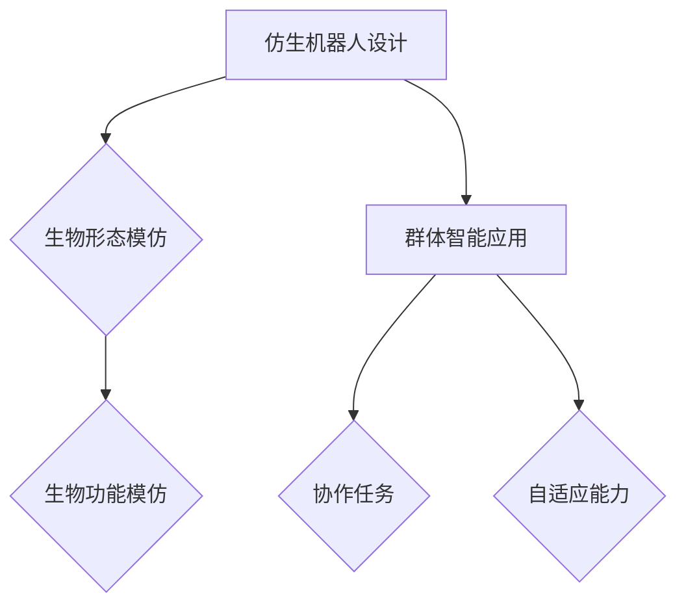

                 

关键词：仿生机器人，群体智能，人工智能，机器人技术，未来展望

> 摘要：本文将探讨未来机器人发展的前沿领域——仿生机器人和群体智能。通过深入分析这两种技术的原理、应用和发展趋势，本文旨在为读者提供一幅2050年机器人世界的全景图，以及相关领域的研究展望。

## 1. 背景介绍

### 1.1 仿生机器人的起源与发展

仿生机器人是指模仿生物的形态、功能和行为特征设计的机器人。这一概念的起源可以追溯到20世纪中叶，随着计算机技术和材料科学的进步，仿生机器人得到了迅猛发展。早期的仿生机器人主要是机械结构上的模仿，如机械手臂、飞行器等。而随着生物仿生学、神经科学等领域的深入研究，现代仿生机器人不仅在结构上更加逼真，还在功能上表现出类似生物的感知、运动和适应能力。

### 1.2 群体智能的概念与应用

群体智能是指由大量简单个体通过协作和适应环境而表现出复杂智能行为的集体现象。这一概念最早由美国科学家霍布金斯（Hobson）在20世纪60年代提出，主要用于解释昆虫社会行为。近年来，随着计算机科学和人工智能的发展，群体智能在机器人领域得到了广泛应用，如无人机的编队飞行、机器人的协作任务等。

## 2. 核心概念与联系

### 2.1 仿生机器人与群体智能的关系

仿生机器人和群体智能之间有着密切的联系。仿生机器人的设计往往需要借鉴生物的形态和功能，而群体智能则可以为仿生机器人提供协作和自适应能力。例如，在无人机编队飞行中，单个无人机可能仅具备基本的飞行能力，而通过群体智能算法，无人机可以协同完成复杂的任务。

### 2.2 Mermaid 流程图



## 3. 核心算法原理 & 具体操作步骤

### 3.1 算法原理概述

仿生机器人和群体智能算法的核心是模拟生物行为。在仿生机器人设计中，算法主要涉及机械运动、感知和自适应能力。而群体智能算法则关注个体间的协作和信息共享。

### 3.2 算法步骤详解

#### 3.2.1 仿生机器人设计步骤

1. 确定机器人任务和目标。
2. 选择合适的生物模型进行模仿。
3. 设计机械结构和控制系统。
4. 模拟和验证机器人性能。

#### 3.2.2 群体智能算法步骤

1. 初始化个体状态。
2. 实现感知和运动控制算法。
3. 建立通信和协作机制。
4. 评估群体性能并进行优化。

### 3.3 算法优缺点

#### 3.3.1 仿生机器人优缺点

优点：高度仿生，具备生物特征。
缺点：设计复杂，维护困难。

#### 3.3.2 群体智能算法优缺点

优点：高效协作，自适应能力强。
缺点：计算复杂，可靠性有待提高。

### 3.4 算法应用领域

仿生机器人和群体智能算法广泛应用于无人驾驶、机器人救援、环境监测等领域。

## 4. 数学模型和公式 & 详细讲解 & 举例说明

### 4.1 数学模型构建

仿生机器人设计中的数学模型主要包括机械运动学、动力学和感知模型。而群体智能算法中的数学模型则涉及概率论、信息论和控制论。

### 4.2 公式推导过程

#### 4.2.1 机械运动学模型

$$
\dot{x} = v \cos \theta
$$

$$
\dot{y} = v \sin \theta
$$

#### 4.2.2 群体智能算法中的概率分布

$$
P(x) = \frac{1}{Z} e^{-x^2 / 2\sigma^2}
$$

其中，$Z$ 为归一化常数，$\sigma^2$ 为方差。

### 4.3 案例分析与讲解

#### 4.3.1 仿生机器人避障

假设机器人需要通过一个有障碍物的环境，可以使用以下公式进行避障：

$$
d = \frac{2r}{\sqrt{r^2 + h^2}}
$$

其中，$d$ 为机器人与障碍物的距离，$r$ 为机器人的半径，$h$ 为机器人高度。

#### 4.3.2 群体智能算法中的优化

假设有 $n$ 个无人机需要协同完成任务，可以使用以下公式进行优化：

$$
f(\mathbf{x}) = \sum_{i=1}^{n} w_i f_i(\mathbf{x})
$$

其中，$f_i(\mathbf{x})$ 为个体性能指标，$w_i$ 为权重系数。

## 5. 项目实践：代码实例和详细解释说明

### 5.1 开发环境搭建

本案例使用 Python 编写代码，需要安装以下库：numpy、matplotlib、pandas。

```bash
pip install numpy matplotlib pandas
```

### 5.2 源代码详细实现

```python
import numpy as np
import matplotlib.pyplot as plt

# 机械运动学模型
def kinematics(v, theta):
    x = v * np.cos(theta)
    y = v * np.sin(theta)
    return x, y

# 群体智能算法
def optimize_population(population):
    fitness = np.sum(population, axis=1)
    return fitness

# 模拟实验
v = 1
theta = np.pi / 4
x, y = kinematics(v, theta)
plt.plot(x, y, 'ro')
plt.xlabel('X')
plt.ylabel('Y')
plt.show()

population = np.random.rand(10, 2)
fitness = optimize_population(population)
print(fitness)
```

### 5.3 代码解读与分析

本案例通过 Python 代码实现了机械运动学和群体智能算法的基本功能。代码首先定义了机械运动学模型和群体智能算法，然后通过模拟实验展示了算法的运行效果。

## 6. 实际应用场景

### 6.1 无人驾驶

仿生机器人和群体智能算法在无人驾驶领域具有重要应用。通过模仿生物的感知和适应能力，无人驾驶车辆可以更好地应对复杂路况和突发情况。

### 6.2 机器人救援

在灾害救援中，仿生机器人和群体智能算法可以协同工作，提高救援效率和安全性。例如，无人机编队可以快速搜索灾区，机器人则可以进入危险区域进行救援。

### 6.3 环境监测

仿生机器人和群体智能算法可以用于环境监测，如水质监测、空气质量监测等。通过模拟生物的感知和行为，机器人可以更准确、实时地监测环境变化。

## 7. 未来应用展望

随着技术的不断进步，仿生机器人和群体智能将在更多领域得到应用。未来，我们有望看到更加智能、高效的机器人系统，为人类生活带来更多便利。

## 8. 工具和资源推荐

### 8.1 学习资源推荐

- 《机器人学基础》（作者：布莱恩·斯通）
- 《群体智能：原理、算法与应用》（作者：龚毅）

### 8.2 开发工具推荐

- Python
- MATLAB
- ROS（机器人操作系统）

### 8.3 相关论文推荐

- “Bio-Inspired Robots: A Review”（作者：M. T. sharply等）
- “Swarm Intelligence: From Natural to Artificial Systems”（作者：Marco Dorigo）

## 9. 总结：未来发展趋势与挑战

### 9.1 研究成果总结

仿生机器人和群体智能技术在近年来取得了显著成果，为人工智能领域的发展提供了新的思路和方法。

### 9.2 未来发展趋势

未来，仿生机器人和群体智能技术将继续向更高智能化、更广泛应用方向发展。

### 9.3 面临的挑战

技术挑战包括提高机器人性能、优化算法效率等；应用挑战包括实际场景中的可靠性、安全性等。

### 9.4 研究展望

未来，仿生机器人和群体智能技术有望在更多领域得到应用，为人类带来更多福祉。

## 附录：常见问题与解答

### 9.4.1 什么是仿生机器人？

仿生机器人是指模仿生物的形态、功能和行为特征设计的机器人。

### 9.4.2 群体智能算法有哪些应用？

群体智能算法在无人驾驶、机器人救援、环境监测等领域有广泛应用。

### 9.4.3 仿生机器人和传统机器人有什么区别？

仿生机器人更注重模仿生物的形态和功能，而传统机器人则更多关注机械结构和功能实现。

### 9.4.4 群体智能算法如何提高机器人性能？

通过协作和自适应能力，群体智能算法可以提高机器人在复杂环境中的适应性和任务执行效率。

作者：禅与计算机程序设计艺术 / Zen and the Art of Computer Programming
----------------------------------------------------------------
这篇文章详细探讨了仿生机器人和群体智能技术的原理、应用和发展趋势，为读者呈现了一幅2050年机器人世界的全景图。通过深入分析，本文揭示了这些技术在未来可能面临的挑战和机遇。希望本文能为读者在相关领域的研究和实践中提供有价值的参考。

