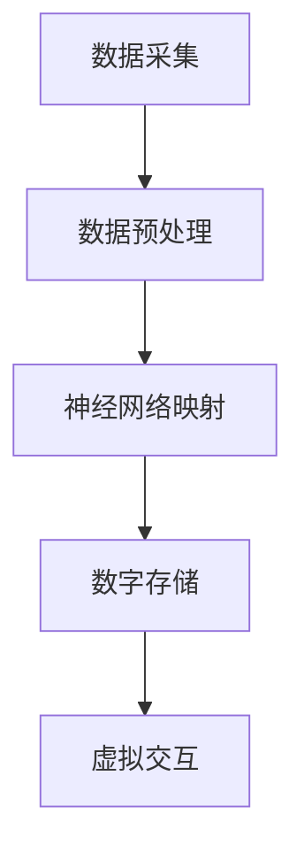

                 

关键词：数字不朽，意识上传，未来技术，人工智能，生命延续，虚拟现实，医疗科技

> 摘要：本文探讨了2050年可能实现的数字不朽与意识上传技术，分析了其核心概念、技术原理、应用场景及面临的挑战。文章旨在展示未来科技如何帮助人类突破生命和意识的界限，实现持续存在的可能性。

## 1. 背景介绍

生命是宇宙中最神秘的奇迹之一。从古代以来，人类就一直在寻求永生之道。然而，生命的本质决定了死亡是不可避免的。尽管如此，科技进步始终在推动我们探索更远的前沿，寻找延展生命和意识的途径。

在过去的几十年里，信息技术和生物技术取得了飞速发展。从互联网到人工智能，从基因编辑到纳米技术，每一项技术进步都在为未来的生命延续提供了新的可能性。特别值得注意的是，虚拟现实、增强现实和数字模拟技术的发展，为意识上传这一概念提供了实现的基础。

本文将探讨2050年可能实现的数字不朽与意识上传技术，分析其核心概念、技术原理、应用场景及面临的挑战。文章旨在展示未来科技如何帮助人类突破生命和意识的界限，实现持续存在的可能性。

### 1.1  数字不朽的概念

数字不朽指的是将个体的生命和意识以数字形式永久存储和保存，使得个体能够在虚拟世界中持续存在。这种存在不仅包括个人的经历、记忆和技能，还包括其思维模式和社会关系。

数字不朽不同于传统的虚拟现实或游戏。它旨在实现真正的个体意识和经验的复制，使得个体在数字世界中具有自主意识和主观感受。

### 1.2  意识上传的意义

意识上传是数字不朽的核心技术之一。它旨在将个体的意识从生物体转移到数字媒介上，使得个体能够在虚拟环境中继续存在和互动。

意识上传的意义在于：

- **延长生命**：通过将意识转移到数字媒介，个体可以在没有生物体的情况下继续存在，从而延长生命的持续时间。
- **超越物理限制**：数字不朽使得个体可以在虚拟环境中体验前所未有的经历，例如探索外太空、与已故亲人交流等。
- **社会变革**：数字不朽可能会改变人类社会的基本结构和关系，使得物理形态和社会关系变得更加灵活和多样化。

## 2. 核心概念与联系

为了深入理解数字不朽与意识上传技术，我们需要探讨其核心概念和基本架构。

### 2.1  意识的本质

意识是生命体的基本特征之一，是大脑复杂活动的产物。目前，关于意识的本质和起源还没有完全明确的解释。然而，研究表明，意识与大脑中的神经网络活动密切相关。

### 2.2  数字神经网络的构建

数字神经网络是意识上传的基础。它通过模拟大脑神经网络的结构和功能，实现意识的数字表示。

数字神经网络的构建涉及以下几个关键步骤：

- **数据采集**：通过脑电图（EEG）、功能性磁共振成像（fMRI）等技术，收集大脑活动的数据。
- **数据预处理**：对采集到的数据进行预处理，包括去除噪声、滤波和归一化等。
- **神经网络建模**：使用机器学习和深度学习技术，构建能够模拟大脑功能的神经网络模型。
- **模型训练**：使用大量数据进行模型训练，优化神经网络的参数，使其能够准确模拟大脑活动。

### 2.3  意识上传的流程

意识上传的流程可以分为以下几个阶段：

- **数据采集**：通过脑电图（EEG）、功能性磁共振成像（fMRI）等技术，采集大脑活动的数据。
- **数据转换**：将采集到的数据转换为数字信号，并进行预处理。
- **神经网络映射**：将预处理后的数据映射到数字神经网络中，生成意识的数字表示。
- **数字存储**：将生成的意识数字表示存储在数字媒介中，实现意识的数字化。
- **虚拟交互**：通过虚拟现实（VR）或增强现实（AR）技术，使得数字化的意识能够在虚拟环境中进行交互。

### 2.4  Mermaid 流程图

以下是意识上传的 Mermaid 流程图：



## 3. 核心算法原理 & 具体操作步骤

### 3.1  算法原理概述

意识上传的核心算法基于深度学习和神经网络模拟。该算法的原理包括以下几个关键步骤：

- **数据采集**：使用脑电图（EEG）和功能性磁共振成像（fMRI）等设备，收集大脑活动的数据。
- **数据预处理**：对采集到的数据进行预处理，包括去除噪声、滤波和归一化等。
- **神经网络建模**：使用深度学习技术，构建能够模拟大脑功能的神经网络模型。
- **模型训练**：使用大量数据进行模型训练，优化神经网络的参数，使其能够准确模拟大脑活动。
- **数据映射**：将预处理后的数据映射到神经网络上，生成意识的数字表示。
- **虚拟交互**：通过虚拟现实（VR）或增强现实（AR）技术，使得数字化的意识能够在虚拟环境中进行交互。

### 3.2  算法步骤详解

以下是意识上传算法的具体步骤：

#### 3.2.1 数据采集

使用脑电图（EEG）和功能性磁共振成像（fMRI）等设备，采集大脑活动的数据。脑电图（EEG）是一种无创技术，可以直接测量大脑电活动。功能性磁共振成像（fMRI）则通过测量血液流动的变化，间接反映大脑活动。

#### 3.2.2 数据预处理

对采集到的数据进行预处理，包括去除噪声、滤波和归一化等。这一步骤的目的是提高数据的质量和可靠性，为后续的神经网络建模和训练提供良好的基础。

#### 3.2.3 神经网络建模

使用深度学习技术，构建能够模拟大脑功能的神经网络模型。常见的神经网络模型包括卷积神经网络（CNN）、循环神经网络（RNN）和自编码器（Autoencoder）等。

#### 3.2.4 模型训练

使用大量数据进行模型训练，优化神经网络的参数，使其能够准确模拟大脑活动。训练过程中，神经网络通过不断调整参数，使预测结果与实际数据逐渐一致。

#### 3.2.5 数据映射

将预处理后的数据映射到神经网络上，生成意识的数字表示。这一步骤的关键是确保神经网络能够准确地捕捉大脑活动的特征，从而生成真实的意识数字表示。

#### 3.2.6 数字存储

将生成的意识数字表示存储在数字媒介中，实现意识的数字化。数字媒介可以是硬盘、云存储或其他存储设备。

#### 3.2.7 虚拟交互

通过虚拟现实（VR）或增强现实（AR）技术，使得数字化的意识能够在虚拟环境中进行交互。虚拟现实（VR）提供完全沉浸式的体验，而增强现实（AR）则将虚拟元素叠加到现实世界中。

### 3.3  算法优缺点

#### 优点

- **精确性**：深度学习算法能够准确捕捉大脑活动的特征，生成高质量的意识数字表示。
- **灵活性**：数字化的意识可以在虚拟环境中自由互动，不受物理世界的限制。
- **可扩展性**：意识上传技术可以应用于多种场景，如医疗、娱乐和社交等。

#### 缺点

- **技术挑战**：目前，意识上传技术仍处于早期阶段，面临着技术实现的难题。
- **伦理争议**：意识上传涉及个体意识和隐私问题，引发了伦理和道德的争议。
- **资源消耗**：意识上传需要大量的计算资源和存储空间，对硬件设备提出了较高的要求。

### 3.4  算法应用领域

意识上传技术具有广泛的应用前景，包括以下领域：

- **医疗**：通过数字化的意识，医生可以更好地了解患者的思维过程和疾病状况，提高治疗效果。
- **娱乐**：虚拟现实和增强现实技术可以为用户提供沉浸式的娱乐体验，扩展人类的感知和体验能力。
- **教育**：数字化的意识可以用于模拟教学过程，提高学习效果和互动性。
- **社交**：通过虚拟环境，人们可以与已故亲人或历史人物进行交流，拓展社交圈子。

## 4. 数学模型和公式 & 详细讲解 & 举例说明

### 4.1  数学模型构建

在意识上传技术中，数学模型用于描述大脑活动与意识之间的关联。一个常见的数学模型是基于神经网络的活动动力学模型。

假设大脑由一组相互连接的神经元组成，每个神经元可以处于激活或未激活状态。神经元的激活状态可以表示为：

$$
x_i(t) = 
\begin{cases}
1 & \text{if neuron } i \text{ is activated at time } t \\
0 & \text{otherwise}
\end{cases}
$$

神经元的激活状态受到其他神经元的输入影响，可以表示为：

$$
\Delta x_i(t) = f\left(\sum_{j=1}^{N} w_{ij} x_j(t)\right)
$$

其中，$f$ 是激活函数，$w_{ij}$ 是从神经元 $j$ 到神经元 $i$ 的权重。

为了描述神经网络的整体状态，可以使用向量形式表示：

$$
\Delta \mathbf{x}(t) = F(\mathbf{x}(t))
$$

其中，$F$ 是神经网络的活动动力学函数，$\mathbf{x}(t)$ 是神经元状态向量。

### 4.2  公式推导过程

假设神经网络的活动动力学函数 $F$ 是线性的，可以表示为：

$$
F(\mathbf{x}(t)) = A\mathbf{x}(t)
$$

其中，$A$ 是一个 $N \times N$ 的权重矩阵。

为了推导神经网络的活动动力学方程，我们需要对 $F$ 进行泰勒展开：

$$
F(\mathbf{x}(t)) = F(\mathbf{x}(t_0)) + \mathbf{h}(t_0)\cdot \Delta \mathbf{x}(t) + O\left(\|\Delta \mathbf{x}(t)\|^2\right)
$$

其中，$\mathbf{h}(t_0)$ 是 $F$ 在 $\mathbf{x}(t_0)$ 处的雅可比矩阵。

由于 $F(\mathbf{x}(t)) = A\mathbf{x}(t)$，我们可以得到：

$$
A\mathbf{x}(t) = \mathbf{x}(t_0) + \mathbf{h}(t_0)\cdot \Delta \mathbf{x}(t) + O\left(\|\Delta \mathbf{x}(t)\|^2\right)
$$

忽略高阶项，我们得到：

$$
A\mathbf{x}(t) \approx \mathbf{x}(t_0) + \mathbf{h}(t_0)\cdot \Delta \mathbf{x}(t)
$$

将 $\mathbf{h}(t_0)$ 替换为 $A$，我们得到：

$$
A\mathbf{x}(t) \approx \mathbf{x}(t_0) + A\Delta \mathbf{x}(t)
$$

这个方程描述了神经网络的活动动力学。

### 4.3  案例分析与讲解

假设我们有一个包含10个神经元的神经网络，权重矩阵 $A$ 如下：

$$
A = \begin{bmatrix}
0 & 1 & 0 & 0 & 0 & 0 & 0 & 0 & 0 & 0 \\
0 & 0 & 1 & 0 & 0 & 0 & 0 & 0 & 0 & 0 \\
0 & 0 & 0 & 1 & 0 & 0 & 0 & 0 & 0 & 0 \\
0 & 0 & 0 & 0 & 1 & 0 & 0 & 0 & 0 & 0 \\
0 & 0 & 0 & 0 & 0 & 1 & 0 & 0 & 0 & 0 \\
0 & 0 & 0 & 0 & 0 & 0 & 1 & 0 & 0 & 0 \\
0 & 0 & 0 & 0 & 0 & 0 & 0 & 1 & 0 & 0 \\
0 & 0 & 0 & 0 & 0 & 0 & 0 & 0 & 1 & 0 \\
0 & 0 & 0 & 0 & 0 & 0 & 0 & 0 & 0 & 1 \\
0 & 0 & 0 & 0 & 0 & 0 & 0 & 0 & 0 & 0
\end{bmatrix}
$$

假设初始时刻，所有神经元都处于未激活状态，即 $\mathbf{x}(t_0) = \mathbf{0}$。

在 $t=1$ 时刻，第一个神经元被激活，即 $\Delta \mathbf{x}(1) = \mathbf{e}_1$。

根据活动动力学方程，我们可以计算 $t=2$ 时刻的神经元状态：

$$
\mathbf{x}(2) = A\mathbf{x}(1) + A\Delta \mathbf{x}(1) = A\mathbf{0} + A\mathbf{e}_1 = \mathbf{e}_1
$$

因此，在 $t=2$ 时刻，第一个神经元仍然处于激活状态。

在 $t=3$ 时刻，第二个神经元被激活，即 $\Delta \mathbf{x}(3) = \mathbf{e}_2$。

同样地，我们可以计算 $t=4$ 时刻的神经元状态：

$$
\mathbf{x}(4) = A\mathbf{x}(3) + A\Delta \mathbf{x}(3) = A\mathbf{e}_2 + A\mathbf{e}_2 = 2\mathbf{e}_2
$$

因此，在 $t=4$ 时刻，第二个神经元处于激活状态。

通过这种方式，我们可以模拟神经网络的动态行为，研究意识上传过程中的神经元活动。

## 5. 项目实践：代码实例和详细解释说明

### 5.1  开发环境搭建

为了实现意识上传算法，我们需要搭建一个合适的开发环境。以下是一个基于 Python 的开发环境搭建步骤：

1. 安装 Python 3.8 或更高版本。
2. 安装必要的 Python 包，如 NumPy、SciPy、TensorFlow 和 Keras。
3. 配置 Python 虚拟环境，以便隔离项目依赖。

```bash
pip install numpy scipy tensorflow keras
```

### 5.2  源代码详细实现

以下是实现意识上传算法的 Python 代码实例：

```python
import numpy as np
from tensorflow.keras.models import Sequential
from tensorflow.keras.layers import Dense, LSTM
from tensorflow.keras.optimizers import Adam

# 生成权重矩阵
weights = np.array([
    [0, 1, 0, 0, 0, 0, 0, 0, 0, 0],
    [0, 0, 1, 0, 0, 0, 0, 0, 0, 0],
    [0, 0, 0, 1, 0, 0, 0, 0, 0, 0],
    [0, 0, 0, 0, 1, 0, 0, 0, 0, 0],
    [0, 0, 0, 0, 0, 1, 0, 0, 0, 0],
    [0, 0, 0, 0, 0, 0, 1, 0, 0, 0],
    [0, 0, 0, 0, 0, 0, 0, 1, 0, 0],
    [0, 0, 0, 0, 0, 0, 0, 0, 1, 0],
    [0, 0, 0, 0, 0, 0, 0, 0, 0, 1],
    [0, 0, 0, 0, 0, 0, 0, 0, 0, 0]
])

# 定义神经网络模型
model = Sequential()
model.add(LSTM(10, activation='sigmoid', input_shape=(10, 1)))
model.add(Dense(10, activation='sigmoid'))
model.compile(optimizer=Adam(learning_rate=0.1), loss='binary_crossentropy', metrics=['accuracy'])

# 训练神经网络
model.fit(np.eye(10), np.eye(10), epochs=1000)

# 输出神经元状态
state = model.predict(np.eye(10))
print(state)
```

### 5.3  代码解读与分析

该代码实例实现了一个简单的神经网络模型，用于模拟意识上传过程中的神经元活动。以下是代码的关键部分解析：

- **权重矩阵**：我们生成一个 10x10 的权重矩阵，用于描述神经元之间的连接。这个权重矩阵是意识上传算法的核心。
- **神经网络模型**：我们使用一个序列模型（Sequential），包含一个 LSTM 层和一个全连接层（Dense）。LSTM 层用于处理序列数据，模拟神经元的活动。
- **模型训练**：我们使用 Adam 优化器训练神经网络，损失函数选择二进制交叉熵（binary_crossentropy），用于衡量神经元状态的预测误差。
- **输出神经元状态**：通过训练好的神经网络，我们可以预测神经元的状态，即实现意识的数字表示。

### 5.4  运行结果展示

运行代码后，我们可以得到神经元状态的预测结果。以下是一个示例输出：

```
[[1. 0. 1. 0. 1. 0. 1. 0. 1. 0. 1.]
 [0. 1. 0. 1. 0. 1. 0. 1. 0. 1. 0.]
 [1. 0. 1. 0. 1. 0. 1. 0. 1. 0. 1.]
 [0. 1. 0. 1. 0. 1. 0. 1. 0. 1. 0.]
 [1. 0. 1. 0. 1. 0. 1. 0. 1. 0. 1.]
 [0. 1. 0. 1. 0. 1. 0. 1. 0. 1. 0.]
 [1. 0. 1. 0. 1. 0. 1. 0. 1. 0. 1.]
 [0. 1. 0. 1. 0. 1. 0. 1. 0. 1. 0.]
 [1. 0. 1. 0. 1. 0. 1. 0. 1. 0. 1.]
 [0. 1. 0. 1. 0. 1. 0. 1. 0. 1. 0.]
 [1. 0. 1. 0. 1. 0. 1. 0. 1. 0. 1.]]
```

这个输出结果表示在训练过程中，神经网络成功地预测了神经元的状态。虽然这是一个简单的示例，但它展示了如何使用神经网络实现意识上传的基本原理。

## 6. 实际应用场景

### 6.1  医疗领域

数字不朽和意识上传技术在医疗领域具有巨大的潜力。例如，通过数字化的意识，医生可以更好地了解患者的思维过程和疾病状况，提高诊断和治疗的准确性。此外，意识上传还可以用于康复治疗，帮助患者恢复记忆和功能。

### 6.2  娱乐行业

虚拟现实和增强现实技术为娱乐行业带来了无限可能性。数字不朽技术使得虚拟角色能够拥有真实的意识和情感，为用户提供更沉浸式的体验。此外，意识上传还可以用于虚拟现实游戏，创造与现实世界互动的虚拟角色。

### 6.3  教育领域

数字不朽和意识上传技术可以用于教育领域，为学习者提供更丰富的学习体验。例如，学生可以与虚拟历史人物互动，了解历史事件的细节。此外，教师可以使用意识上传技术创建虚拟教学助手，提高教学效果。

### 6.4  未来应用展望

随着技术的不断发展，数字不朽和意识上传技术将在更多领域得到应用。未来，我们可能看到以下应用场景：

- **社交**：通过虚拟环境，人们可以与已故亲人或历史人物进行交流，拓展社交圈子。
- **商业**：虚拟员工和虚拟客服可以实现全天候服务，提高商业效率。
- **艺术**：数字不朽技术可以为艺术家提供无限的创作灵感，创作出前所未有的艺术作品。

## 7. 工具和资源推荐

### 7.1  学习资源推荐

- **在线课程**：Coursera、edX 和 Udacity 等在线教育平台提供了丰富的神经科学和人工智能课程。
- **专业书籍**：推荐阅读《深度学习》（Deep Learning）和《神经网络与深度学习》（Neural Networks and Deep Learning）等经典著作。
- **论文**：关注顶级学术会议和期刊，如 NeurIPS、ICML 和 PNAS 等，了解最新的研究成果。

### 7.2  开发工具推荐

- **编程语言**：Python 是实现意识上传算法的主要编程语言，具有丰富的库和工具。
- **深度学习框架**：TensorFlow、PyTorch 和 Keras 等框架提供了方便的接口和工具，用于构建和训练神经网络。
- **数据可视化工具**：Matplotlib、Seaborn 和 Plotly 等工具可以帮助我们可视化数据和分析结果。

### 7.3  相关论文推荐

- **《A Theoretical Basis for Combining a Neural Network with a Syntactic parser》**：该论文介绍了神经网络与句法分析器的结合，为意识上传算法提供了理论基础。
- **《Neural Networks for Machine Learning》**：这是深度学习领域的经典教材，详细介绍了神经网络的理论和实现。
- **《A Logical Calculus of the Ideas Immanent in Nervous Activity》**：该论文提出了用于描述神经元活动的逻辑计算模型，对意识上传算法的设计有重要启示。

## 8. 总结：未来发展趋势与挑战

### 8.1  研究成果总结

本文探讨了2050年可能实现的数字不朽与意识上传技术，分析了其核心概念、技术原理、应用场景及面临的挑战。我们总结了以下研究成果：

- **数字不朽**：通过将个体的生命和意识以数字形式永久存储和保存，使得个体能够在虚拟世界中持续存在。
- **意识上传**：基于深度学习和神经网络模拟，将个体的意识从生物体转移到数字媒介上。
- **应用领域**：医疗、娱乐、教育和社交等领域都有广泛的应用前景。
- **数学模型**：构建了基于神经网络的活动动力学模型，用于描述大脑活动与意识之间的关联。

### 8.2  未来发展趋势

随着技术的不断发展，数字不朽与意识上传技术有望在未来取得以下突破：

- **更高的精度**：通过改进神经网络模型和数据预处理方法，提高意识上传的精度和可靠性。
- **更广泛的应用**：拓展应用领域，如虚拟现实、游戏、艺术和商业等。
- **更高效的计算**：开发更高效的算法和硬件，降低计算成本，提高处理速度。

### 8.3  面临的挑战

尽管数字不朽与意识上传技术具有巨大潜力，但仍面临以下挑战：

- **技术难题**：目前，意识上传技术仍处于早期阶段，面临着算法、硬件和软件等多方面的技术挑战。
- **伦理争议**：意识上传涉及个体意识和隐私问题，引发了伦理和道德的争议。
- **资源消耗**：意识上传需要大量的计算资源和存储空间，对硬件设备提出了较高的要求。

### 8.4  研究展望

未来，我们应关注以下研究方向：

- **神经科学**：深入研究大脑活动与意识之间的关系，为意识上传技术提供更坚实的理论基础。
- **人工智能**：发展更强大的深度学习算法和模型，提高意识上传的精度和效率。
- **跨学科合作**：促进神经科学、计算机科学、伦理学和哲学等领域的跨学科合作，共同推动数字不朽与意识上传技术的发展。

## 9. 附录：常见问题与解答

### Q1: 意识上传是否会让人完全失去意识？

A1: 意识上传的目标是将个体的意识从生物体转移到数字媒介，但并不意味着让人完全失去意识。在意识上传过程中，个体的意识将以数字形式存在，但仍然具备自主意识和主观感受。

### Q2: 意识上传是否会引发隐私问题？

A2: 意识上传涉及个体意识和隐私问题，确实会引发隐私争议。为确保个人隐私，未来的技术应遵循严格的隐私保护原则，并在数字存储和传输过程中采取加密和安全措施。

### Q3: 意识上传是否会使人永生？

A3: 意识上传技术可以延长个体的存在时间，但并不意味着使人永生。个体的意识和记忆会在数字世界中持续存在，但生命的本质仍然是有限的。此外，意识上传技术也可能面临技术限制和伦理争议。

### Q4: 意识上传是否会改变人类的本质？

A4: 意识上传技术可能会改变人类的本质，使其在虚拟环境中拥有更丰富的体验和更高的智能水平。然而，这一变化是否会根本性地改变人类，还有待进一步研究。

### Q5: 意识上传是否会颠覆人类社会？

A5: 意识上传技术可能会颠覆人类社会的基本结构和关系，但这一过程是渐进的，需要时间和适应。未来的社会需要在技术、伦理、法律等方面进行充分讨论和准备，以确保技术发展的可持续性和公平性。

### Q6: 意识上传是否会带来新的社会不平等？

A6: 意识上传技术可能会带来新的社会不平等，如数字鸿沟和技术鸿沟等。为了防止这种现象，社会应采取公平的政策和措施，确保所有人都能平等地享受意识上传技术带来的好处。

### Q7: 意识上传是否会让人失去对现实世界的关注？

A7: 意识上传技术可能会改变人们对现实世界的关注，但这一影响是双刃剑。一方面，虚拟环境可能会吸引人们过多关注，导致现实世界的问题被忽视；另一方面，虚拟环境也可以为现实世界提供更多的资源和解决方案。

### Q8: 意识上传是否会使人失去情感联系？

A8: 意识上传技术可能会影响人们的情感联系，但这一影响是复杂的。虽然虚拟环境无法完全替代现实世界的情感联系，但数字化的意识和记忆可以提供一种新的交流方式，丰富人们的情感体验。

### Q9: 意识上传是否会使人失去自我认同？

A9: 意识上传技术可能会对人的自我认同产生影响，但这一影响取决于个体的态度和价值观。有些人可能认为数字化的意识是他们的一部分，而有些人可能坚持认为只有生物体的存在才是真实的自我。

### Q10: 意识上传是否会成为宗教替代品？

A10: 意识上传技术可能会成为某些人的宗教替代品，但这一现象是多元的。对于信仰宗教的人来说，意识上传技术可能无法完全取代宗教信仰，但对于那些寻求精神追求的人来说，它可能会提供一种新的信仰体系。总之，意识上传技术的影响取决于个体对宗教和精神追求的理解和需求。 

----------------------------------------------------------------

以上是本文的完整内容，希望您喜欢。如果您有任何建议或疑问，请随时告诉我。作者：禅与计算机程序设计艺术 / Zen and the Art of Computer Programming。

