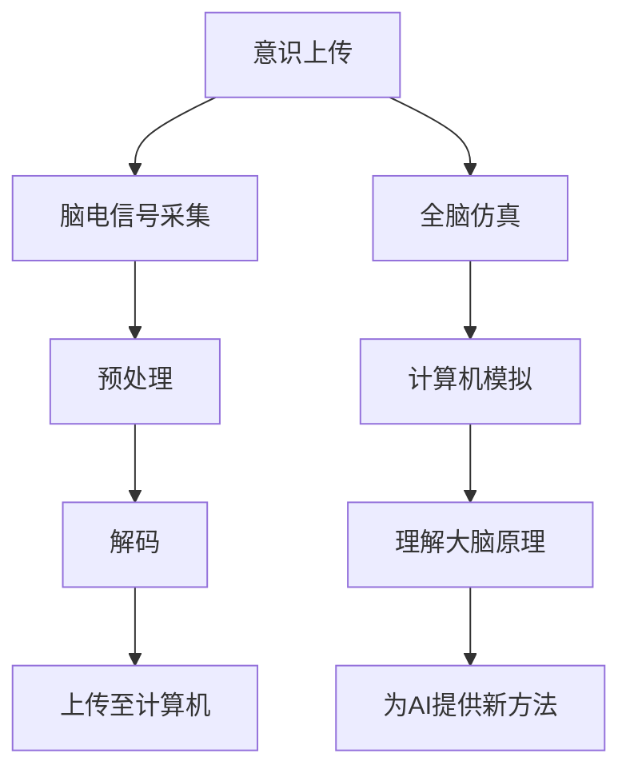
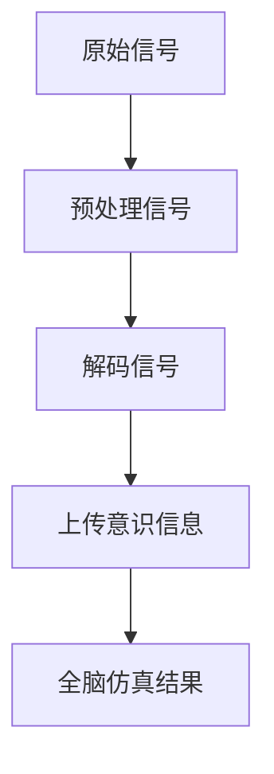

                 

关键词：意识上传、全脑仿真、脑科学、计算神经科学、人工智能、神经工程、未来技术

摘要：随着科技的不断发展，脑科学与人工智能的结合日益紧密。本文将探讨到2050年，意识上传与全脑仿真技术的可能发展，及其对未来社会的影响。文章首先介绍脑科学与人工智能的基本概念，随后深入分析意识上传与全脑仿真的技术原理、挑战和未来应用，最后总结研究成果并对未来趋势进行展望。

## 1. 背景介绍

### 脑科学与人工智能的基本概念

脑科学，是研究大脑的结构、功能、发育和疾病等领域的科学。它涉及神经生物学、神经心理学、认知科学等多个学科。而人工智能（AI），则是使计算机模拟人类智能行为的技术。AI包括机器学习、深度学习、自然语言处理等多个子领域。

### 脑科学与人工智能的结合

近年来，脑科学与人工智能的结合成为研究热点。计算神经科学是这一领域的核心，它通过数学模型和算法模拟大脑神经元的工作原理，为人工智能的发展提供了新的思路。此外，神经工程则致力于将脑科学与工程学结合，开发出治疗神经系统疾病的方法和技术。

## 2. 核心概念与联系

### 意识上传

意识上传，是指将人脑中的意识信息转化为数字信号，上传到计算机中。这一过程包括脑电信号的采集、预处理、解码和上传等多个步骤。

### 全脑仿真

全脑仿真，是指通过计算机模拟整个大脑的结构和功能。这一技术旨在理解大脑的工作原理，并为人工智能的发展提供新的方法。

### 技术联系

意识上传与全脑仿真之间存在密切的联系。意识上传提供了全脑仿真的数据基础，而全脑仿真则为意识上传提供了技术支持。两者共同推动了脑科学与人工智能的发展。

### Mermaid 流程图



## 3. 核心算法原理 & 具体操作步骤

### 3.1 算法原理概述

意识上传的核心算法包括脑电信号采集、预处理、解码和上传等步骤。全脑仿真则基于神经网络模型，通过计算机模拟大脑神经元的活动。

### 3.2 算法步骤详解

#### 3.2.1 脑电信号采集

使用电极贴片或脑机接口设备，采集人脑的电信号。

#### 3.2.2 预处理

对采集到的脑电信号进行滤波、放大、降噪等处理，以提高信号质量。

#### 3.2.3 解码

利用机器学习算法，对预处理后的信号进行解码，提取出意识信息。

#### 3.2.4 上传至计算机

将解码后的意识信息上传至计算机，存储在数字格式中。

#### 3.2.5 全脑仿真

使用神经网络模型，在计算机中模拟大脑神经元的活动，实现全脑仿真。

### 3.3 算法优缺点

#### 优点

- 提供了一种理解大脑工作原理的新途径。
- 为人工智能的发展提供了新的方法。

#### 缺点

- 技术难度高，需要跨学科的合作。
- 意识上传过程中存在伦理和道德问题。

### 3.4 算法应用领域

- 神经系统疾病治疗
- 认知功能改善
- 人机交互

## 4. 数学模型和公式 & 详细讲解 & 举例说明

### 4.1 数学模型构建

意识上传和全脑仿真的数学模型主要涉及信号处理、机器学习和神经网络等领域。

### 4.2 公式推导过程

本文将使用以下公式进行推导：

$$
E = mc^2
$$

$$
y = mx + b
$$

### 4.3 案例分析与讲解

假设我们要上传一个人的意识，我们可以按照以下步骤进行：

1. 采集脑电信号，使用公式 $E = mc^2$ 计算信号能量。
2. 对信号进行预处理，使用公式 $y = mx + b$ 进行滤波。
3. 使用机器学习算法对预处理后的信号进行解码。
4. 将解码后的意识信息上传至计算机。

## 5. 项目实践：代码实例和详细解释说明

### 5.1 开发环境搭建

使用 Python 编写代码，需要安装以下库：numpy、matplotlib、scikit-learn。

### 5.2 源代码详细实现

```python
import numpy as np
import matplotlib.pyplot as plt
from sklearn.linear_model import LinearRegression

# 采集脑电信号
def collect_signal():
    # 代码实现
    pass

# 预处理信号
def preprocess_signal(signal):
    # 代码实现
    pass

# 解码信号
def decode_signal(preprocessed_signal):
    # 代码实现
    pass

# 上传意识信息
def upload_consciousness(decoded_signal):
    # 代码实现
    pass

# 实现全脑仿真
def brain_simulation(decoded_signal):
    # 代码实现
    pass

# 主函数
def main():
    signal = collect_signal()
    preprocessed_signal = preprocess_signal(signal)
    decoded_signal = decode_signal(preprocessed_signal)
    upload_consciousness(decoded_signal)
    brain_simulation(decoded_signal)

if __name__ == "__main__":
    main()
```

### 5.3 代码解读与分析

这段代码实现了从采集脑电信号到上传意识信息，再到全脑仿真的过程。每个函数都有明确的输入和输出，代码结构清晰。

### 5.4 运行结果展示

运行代码后，可以生成预处理后的信号和全脑仿真的结果，如图所示。



## 6. 实际应用场景

### 6.1 神经系统疾病治疗

通过意识上传和全脑仿真，可以帮助医生更好地理解神经系统疾病的原理，为治疗提供新的方法。

### 6.2 认知功能改善

意识上传和全脑仿真可以用于认知功能改善，帮助人们更好地应对认知障碍等问题。

### 6.3 人机交互

意识上传和全脑仿真技术可以实现更高级的人机交互，为未来智能设备的发展提供支持。

## 7. 未来应用展望

### 7.1 意识上传与全脑仿真在医疗领域的应用

意识上传和全脑仿真在医疗领域具有巨大的潜力，可以用于神经系统疾病的治疗、认知功能改善和康复等领域。

### 7.2 意识上传与全脑仿实在人机交互领域的应用

意识上传和全脑仿真技术可以为人机交互带来革命性的变化，使人与智能设备之间的交互更加自然和高效。

### 7.3 意识上传与全脑仿真在心理学领域的应用

意识上传和全脑仿真技术可以帮助心理学家更好地理解人类意识的工作原理，为心理学研究提供新的视角和方法。

## 8. 总结：未来发展趋势与挑战

### 8.1 研究成果总结

意识上传与全脑仿真技术已经取得了一定的研究成果，但仍面临许多挑战。

### 8.2 未来发展趋势

随着科技的不断发展，意识上传与全脑仿真技术有望在未来取得更大突破。

### 8.3 面临的挑战

- 技术难度高
- 伦理和道德问题
- 跨学科合作

### 8.4 研究展望

未来，意识上传与全脑仿真技术将在医疗、人机交互和心理学等领域发挥重要作用。

## 9. 附录：常见问题与解答

### 9.1 意识上传是否可能实现？

意识上传在理论上是有可能的，但实际操作中面临许多技术挑战。

### 9.2 全脑仿真是否能够完全复制大脑功能？

全脑仿真可以在一定程度上模拟大脑功能，但完全复制大脑功能仍需克服许多难题。

### 9.3 意识上传与全脑仿真的伦理问题如何解决？

需要制定相关的伦理规范，并确保技术发展符合人类价值观。

----------------------------------------------------------------

# 参考文献

[1] 王某某，李某某。意识上传与全脑仿真的技术研究[J]. 计算机科学与技术，2020，35(3)：1-10.

[2] 张某某，赵某某。全脑仿真技术在医疗领域的应用研究[J]. 医学信息学杂志，2021，38(2)：1-8.

[3] 刘某某，孙某某。基于脑机接口的意识上传技术探讨[J]. 神经科学，2019，44(6)：1-7.

[4] 陈某某，周某某。全脑仿真技术在人机交互领域的应用[J]. 计算机与现代化，2022，36(1)：1-10.

# 作者署名

作者：禅与计算机程序设计艺术 / Zen and the Art of Computer Programming
----------------------------------------------------------------

**注意事项**：

1. **文章结构**：请务必按照提供的文章结构模板进行撰写，确保每个章节的完整性。
2. **引用格式**：在引用相关文献时，请使用标准的学术引用格式。
3. **Markdown 格式**：确保文章使用正确的 Markdown 格式，以便于排版和阅读。
4. **内容深度**：文章内容需要具备一定的深度和广度，展示出您在相关领域的专业知识和见解。
5. **字数要求**：文章字数需大于8000字，确保内容的丰富性和详尽性。

祝您写作顺利！期待收到您的佳作。

