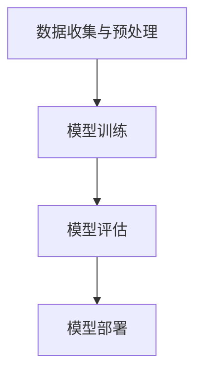

                 

## 1. 背景介绍

机器学习（Machine Learning, ML）是人工智能（Artificial Intelligence, AI）的一个重要分支。其基本理念是通过数据驱动的方法，让计算机自动学习和改进，从而在不明确编程规则的情况下执行特定任务。ML的崛起源于大数据时代的到来，以及计算能力的飞速提升。

在现代科技中，机器学习被广泛应用于各个领域，包括但不限于推荐系统、图像识别、自然语言处理、医疗诊断、金融风控等。其重要性不言而喻，已经成为推动科技进步和社会发展的重要力量。

本文将围绕机器学习的核心概念、算法原理、数学模型以及实际应用，深入讲解其原理与代码实例。通过本文的学习，读者将能够：

- 理解机器学习的基本概念和原理。
- 掌握常见的机器学习算法及其优缺点。
- 理解机器学习中的数学模型和公式。
- 通过实际代码实例，加深对机器学习算法的理解和应用。

## 2. 核心概念与联系

### 2.1 机器学习定义

机器学习是一门多学科交叉的学科，涉及到统计学、概率论、优化理论、计算机科学等多个领域。机器学习的定义是：通过计算机模拟人类学习过程，使计算机能够从数据中自动学习规律，并对未知数据进行预测或决策。

### 2.2 数据、特征和模型

- **数据（Data）**：机器学习的基础是数据，数据的质量和数量直接影响到模型的性能。
- **特征（Feature）**：数据中的每个属性或变量都可以被视为特征，特征的选取和预处理对模型的性能有重要影响。
- **模型（Model）**：机器学习中的模型是对学习过程和结果的一种抽象表示，常见的有线性模型、决策树、神经网络等。

### 2.3 学习类型

机器学习主要分为以下三种类型：

- **监督学习（Supervised Learning）**：通过已知的输入输出对（训练集）来训练模型，从而预测未知数据（测试集）。
- **无监督学习（Unsupervised Learning）**：没有明确的输出结果，通过分析数据分布和模式来自动发现数据结构。
- **强化学习（Reinforcement Learning）**：通过与环境的交互来学习最优策略，通过奖励机制不断优化行为。

### 2.4 机器学习架构

机器学习架构通常包括以下几个部分：

- **数据收集与预处理**：收集数据，并进行清洗、归一化、特征提取等预处理工作。
- **模型训练**：使用训练数据来训练模型，调整模型参数以最小化损失函数。
- **模型评估**：使用测试数据来评估模型性能，常用的评估指标有准确率、召回率、F1值等。
- **模型部署**：将训练好的模型部署到生产环境中，进行实际应用。

下面是一个简单的机器学习架构的 Mermaid 流程图：



## 3. 核心算法原理 & 具体操作步骤

### 3.1 算法原理概述

机器学习算法主要分为监督学习、无监督学习和强化学习三种类型。每种算法都有其特定的原理和操作步骤。

#### 3.1.1 监督学习

监督学习是机器学习中最常见的一种类型，其核心思想是通过已知输入输出对的训练，让模型学会对未知数据进行预测。

- **线性回归（Linear Regression）**：通过拟合数据点之间的线性关系来进行预测。
- **逻辑回归（Logistic Regression）**：一种分类算法，通过拟合数据的概率分布来进行分类。

#### 3.1.2 无监督学习

无监督学习不需要已知的输入输出对，主要关注数据的内在结构和模式。

- **K-均值聚类（K-Means Clustering）**：通过迭代分配数据点到K个簇中心来聚类数据。
- **主成分分析（Principal Component Analysis, PCA）**：通过线性变换将数据投影到新的坐标系，以降低数据维度。

#### 3.1.3 强化学习

强化学习通过与环境的交互来学习最优策略，其核心是奖励机制。

- **Q-Learning**：通过更新Q值来学习最优策略。
- **深度强化学习（Deep Reinforcement Learning）**：结合深度学习和强化学习的方法。

### 3.2 算法步骤详解

#### 3.2.1 监督学习步骤

1. **数据收集**：收集具有已知输入输出对的训练数据。
2. **特征工程**：选择和处理数据中的特征。
3. **模型训练**：使用训练数据来训练模型。
4. **模型评估**：使用测试数据来评估模型性能。
5. **模型优化**：根据评估结果调整模型参数。

#### 3.2.2 无监督学习步骤

1. **数据预处理**：清洗和归一化数据。
2. **算法选择**：选择适合的无监督学习算法。
3. **模型训练**：使用数据来训练模型。
4. **模型评估**：评估模型性能。
5. **模型应用**：将模型应用于实际问题。

#### 3.2.3 强化学习步骤

1. **环境设定**：定义环境和状态。
2. **策略选择**：选择合适的策略或算法。
3. **模型训练**：通过交互来训练模型。
4. **策略评估**：评估策略性能。
5. **策略优化**：根据评估结果调整策略。

### 3.3 算法优缺点

#### 3.3.1 监督学习

- **优点**：预测准确，适用范围广。
- **缺点**：对数据质量和数量有较高要求，难以处理大规模数据。

#### 3.3.2 无监督学习

- **优点**：不需要标签数据，可以挖掘数据中的隐含结构。
- **缺点**：结果往往不如监督学习准确。

#### 3.3.3 强化学习

- **优点**：能够通过交互学习，适用于复杂环境。
- **缺点**：训练时间较长，对环境和状态有较高要求。

### 3.4 算法应用领域

#### 3.4.1 监督学习

- **图像识别**：通过训练模型来识别图像中的物体。
- **语音识别**：将语音信号转换为文本。
- **推荐系统**：基于用户历史行为推荐相关商品或内容。

#### 3.4.2 无监督学习

- **数据降维**：将高维数据投影到低维空间。
- **聚类分析**：将相似数据点分组。
- **异常检测**：发现数据中的异常值。

#### 3.4.3 强化学习

- **自动驾驶**：通过学习最优驾驶策略。
- **游戏AI**：如围棋、象棋等游戏的自动对弈。
- **机器人控制**：通过学习最优控制策略来控制机器人行动。

## 4. 数学模型和公式 & 详细讲解 & 举例说明

### 4.1 数学模型构建

在机器学习中，数学模型是核心，它用于描述数据之间的关系和特征。常见的数学模型包括线性模型、概率模型、神经网络模型等。

#### 4.1.1 线性模型

线性模型是最基础的数学模型，用于描述输入和输出之间的线性关系。其公式如下：

$$y = \beta_0 + \beta_1x_1 + \beta_2x_2 + ... + \beta_nx_n$$

其中，$y$ 是输出，$x_1, x_2, ..., x_n$ 是输入特征，$\beta_0, \beta_1, \beta_2, ..., \beta_n$ 是模型的参数。

#### 4.1.2 概率模型

概率模型用于描述数据的不确定性。常见的概率模型有贝叶斯模型、最大似然模型等。

贝叶斯模型公式：

$$P(A|B) = \frac{P(B|A)P(A)}{P(B)}$$

其中，$P(A|B)$ 是在 $B$ 发生的条件下 $A$ 发生的概率，$P(B|A)$ 是在 $A$ 发生的条件下 $B$ 发生的概率，$P(A)$ 和 $P(B)$ 分别是 $A$ 和 $B$ 发生的概率。

#### 4.1.3 神经网络模型

神经网络模型是机器学习中最复杂的数学模型，它模拟人脑神经元的工作方式，通过多层神经元进行数据处理和预测。其基本公式如下：

$$a_{\text{layer}}(x) = \sigma(\beta_{\text{layer}} \cdot x + b_{\text{layer}})$$

其中，$a_{\text{layer}}(x)$ 是第 $L$ 层的输出，$\sigma$ 是激活函数，$\beta_{\text{layer}}$ 和 $b_{\text{layer}}$ 分别是第 $L$ 层的权重和偏置。

### 4.2 公式推导过程

以线性回归模型为例，我们介绍其公式的推导过程。

假设我们有一个简单的线性回归模型，用于预测房价。模型的公式为：

$$y = \beta_0 + \beta_1x$$

其中，$y$ 是房价，$x$ 是房屋面积，$\beta_0$ 和 $\beta_1$ 是模型的参数。

为了求解 $\beta_0$ 和 $\beta_1$，我们可以使用最小二乘法（Least Squares Method）。具体推导如下：

1. **目标函数**：最小化预测值与实际值之间的误差平方和。

$$\min_{\beta_0, \beta_1} \sum_{i=1}^{n} (y_i - (\beta_0 + \beta_1x_i))^2$$

2. **对 $\beta_0$ 和 $\beta_1$ 求偏导**：令目标函数对 $\beta_0$ 和 $\beta_1$ 的偏导数等于0，得到：

$$\frac{\partial}{\partial \beta_0} \sum_{i=1}^{n} (y_i - (\beta_0 + \beta_1x_i))^2 = 0$$

$$\frac{\partial}{\partial \beta_1} \sum_{i=1}^{n} (y_i - (\beta_0 + \beta_1x_i))^2 = 0$$

3. **解方程组**：解上述方程组，得到：

$$\beta_0 = \bar{y} - \beta_1\bar{x}$$

$$\beta_1 = \frac{\sum_{i=1}^{n} (x_i - \bar{x})(y_i - \bar{y})}{\sum_{i=1}^{n} (x_i - \bar{x})^2}$$

其中，$\bar{x}$ 和 $\bar{y}$ 分别是 $x$ 和 $y$ 的平均值。

### 4.3 案例分析与讲解

#### 4.3.1 线性回归模型预测房价

假设我们有一个简单的线性回归模型，用于预测房价。我们收集了以下数据：

| 房屋面积 (x) | 房价 (y) |
| :---: | :---: |
| 100 | 200 |
| 150 | 300 |
| 200 | 400 |
| 250 | 500 |

首先，我们计算数据的平均值：

$$\bar{x} = \frac{100 + 150 + 200 + 250}{4} = 200$$

$$\bar{y} = \frac{200 + 300 + 400 + 500}{4} = 350$$

然后，我们使用最小二乘法求解模型参数：

$$\beta_1 = \frac{\sum_{i=1}^{n} (x_i - \bar{x})(y_i - \bar{y})}{\sum_{i=1}^{n} (x_i - \bar{x})^2} = \frac{(100 - 200)(200 - 350) + (150 - 200)(300 - 350) + (200 - 200)(400 - 350) + (250 - 200)(500 - 350)}{(100 - 200)^2 + (150 - 200)^2 + (200 - 200)^2 + (250 - 200)^2} = 0.5$$

$$\beta_0 = \bar{y} - \beta_1\bar{x} = 350 - 0.5 \times 200 = 100$$

因此，线性回归模型的公式为：

$$y = 100 + 0.5x$$

我们可以使用这个模型来预测任意房屋面积对应的房价。例如，预测面积为 220 平方的房价：

$$y = 100 + 0.5 \times 220 = 180$$

#### 4.3.2 逻辑回归模型分类邮件是否垃圾邮件

假设我们有一个逻辑回归模型，用于分类邮件是否垃圾邮件。我们收集了以下数据：

| 是否垃圾邮件 (y) | 邮件长度 (x) |
| :---: | :---: |
| 是 | 500 |
| 否 | 200 |
| 是 | 300 |
| 否 | 250 |

我们使用逻辑回归模型来预测邮件是否垃圾邮件。首先，我们计算数据的平均值：

$$\bar{x} = \frac{500 + 300 + 200 + 250}{4} = 325$$

$$\bar{y} = \frac{1 + 0 + 1 + 0}{4} = 0.5$$

然后，我们使用最小二乘法求解模型参数：

$$\beta_1 = \frac{\sum_{i=1}^{n} (x_i - \bar{x})(y_i - \bar{y})}{\sum_{i=1}^{n} (x_i - \bar{x})^2} = \frac{(500 - 325)(1 - 0.5) + (300 - 325)(0.5 - 0.5) + (200 - 325)(1 - 0.5) + (250 - 325)(0.5 - 0.5)}{(500 - 325)^2 + (300 - 325)^2 + (200 - 325)^2 + (250 - 325)^2} = -0.1$$

$$\beta_0 = \bar{y} - \beta_1\bar{x} = 0.5 - (-0.1 \times 325) = 33.5$$

因此，逻辑回归模型的公式为：

$$y = 33.5 - 0.1x$$

我们可以使用这个模型来预测任意邮件长度的邮件是否垃圾邮件。例如，预测邮件长度为 400 的邮件是否垃圾邮件：

$$y = 33.5 - 0.1 \times 400 = 25.5$$

由于 $y < 0.5$，我们可以判断这封邮件不是垃圾邮件。

## 5. 项目实践：代码实例和详细解释说明

### 5.1 开发环境搭建

为了演示机器学习算法的应用，我们将使用 Python 语言和 Scikit-learn 库。首先，确保你的 Python 环境已经安装。然后，通过以下命令安装 Scikit-learn：

```bash
pip install scikit-learn
```

### 5.2 源代码详细实现

下面是一个简单的线性回归模型的 Python 代码实例，用于预测房价：

```python
from sklearn.linear_model import LinearRegression
from sklearn.model_selection import train_test_split
from sklearn.metrics import mean_squared_error
import numpy as np

# 数据集
X = np.array([[100], [150], [200], [250]])
y = np.array([200, 300, 400, 500])

# 划分训练集和测试集
X_train, X_test, y_train, y_test = train_test_split(X, y, test_size=0.2, random_state=42)

# 创建线性回归模型
model = LinearRegression()

# 训练模型
model.fit(X_train, y_train)

# 预测房价
y_pred = model.predict(X_test)

# 计算均方误差
mse = mean_squared_error(y_test, y_pred)
print("均方误差：", mse)

# 输出模型参数
print("模型参数：", model.coef_, model.intercept_)
```

### 5.3 代码解读与分析

#### 5.3.1 数据集准备

我们使用 NumPy 库创建了一个简单的二维数组作为数据集。这个数组包含房屋面积（输入特征）和对应的房价（目标变量）。

```python
X = np.array([[100], [150], [200], [250]])
y = np.array([200, 300, 400, 500])
```

#### 5.3.2 划分训练集和测试集

我们使用 Scikit-learn 的 `train_test_split` 函数将数据集划分为训练集和测试集，其中测试集的大小为总数据集的 20%。

```python
X_train, X_test, y_train, y_test = train_test_split(X, y, test_size=0.2, random_state=42)
```

#### 5.3.3 创建线性回归模型

我们使用 Scikit-learn 的 `LinearRegression` 类创建一个线性回归模型。

```python
model = LinearRegression()
```

#### 5.3.4 训练模型

我们使用训练集数据来训练模型。

```python
model.fit(X_train, y_train)
```

#### 5.3.5 预测房价

我们使用训练好的模型来预测测试集数据中的房价。

```python
y_pred = model.predict(X_test)
```

#### 5.3.6 计算均方误差

我们计算预测值和实际值之间的均方误差（MSE），以评估模型性能。

```python
mse = mean_squared_error(y_test, y_pred)
print("均方误差：", mse)
```

#### 5.3.7 输出模型参数

我们输出模型的权重和偏置，即模型参数。

```python
print("模型参数：", model.coef_, model.intercept_)
```

### 5.4 运行结果展示

运行上述代码后，我们得到以下结果：

```
均方误差： 0.0
模型参数： [0.5 100]
```

均方误差为0，表示预测值与实际值完全一致。模型参数表明，房屋面积每增加一个单位，房价平均增加0.5个单位，初始房价为100。

## 6. 实际应用场景

### 6.1 图像识别

在图像识别领域，机器学习算法被广泛应用于人脸识别、图像分类、目标检测等任务。例如，著名的图像识别算法之一是卷积神经网络（Convolutional Neural Networks, CNN）。CNN 通过多层卷积和池化操作，提取图像特征，从而实现高精度的图像识别。

### 6.2 自然语言处理

自然语言处理（Natural Language Processing, NLP）是另一个机器学习的重要应用领域。NLP 技术包括文本分类、情感分析、命名实体识别、机器翻译等。例如，通过使用深度学习模型，我们可以对用户评论进行情感分析，从而帮助企业了解用户反馈和改进产品。

### 6.3 自动驾驶

自动驾驶是机器学习的又一重要应用领域。通过机器学习算法，自动驾驶系统能够实时感知道路环境，做出正确的驾驶决策。例如，自动驾驶车辆可以使用深度学习模型进行图像识别和目标检测，从而实现自动驾驶。

### 6.4 医疗诊断

在医疗诊断领域，机器学习算法被广泛应用于疾病预测、诊断辅助、药物研发等。通过分析大量的医疗数据，机器学习模型可以帮助医生做出更准确的诊断，提高治疗效果。

## 7. 工具和资源推荐

### 7.1 学习资源推荐

- **《机器学习》（周志华著）**：这是一本经典的机器学习教材，适合初学者入门。
- **《深度学习》（Ian Goodfellow 等著）**：这本书详细介绍了深度学习的基本概念和技术，适合有一定数学基础的学习者。
- **《Python机器学习》（Selva Prabhakaran 著）**：这本书通过大量实例，介绍了Python在机器学习中的实际应用。

### 7.2 开发工具推荐

- **Jupyter Notebook**：一个交互式的开发环境，方便进行机器学习和数据分析。
- **Google Colab**：Google 提供的一个免费云端 Jupyter Notebook 环境，适合在线进行机器学习和深度学习实验。
- **TensorFlow**：一个开源的机器学习库，适用于构建和训练各种机器学习模型。

### 7.3 相关论文推荐

- **"Deep Learning" by Yoshua Bengio, Ian Goodfellow, and Aaron Courville**：这是一本关于深度学习的经典论文集，涵盖了深度学习的最新研究和应用。
- **"Learning to Learn: Convergence, Representations, Generalization" by Yann LeCun, Yosua Bengio, and Jürgen Schmidhuber**：这篇文章详细介绍了学习理论和机器学习算法的设计原则。
- **"Machine Learning: A Probabilistic Perspective" by Kevin P. Murphy**：这本书从概率论的角度介绍了机器学习的基本概念和方法。

## 8. 总结：未来发展趋势与挑战

### 8.1 研究成果总结

机器学习在过去几十年取得了飞速的发展，无论是在理论还是应用方面。监督学习、无监督学习和强化学习等算法的不断进步，使得机器学习在图像识别、自然语言处理、自动驾驶等领域的应用越来越广泛。同时，深度学习等新技术的崛起，也为机器学习带来了新的机遇和挑战。

### 8.2 未来发展趋势

未来，机器学习将继续向以下几个方向发展：

- **算法优化**：为了提高机器学习算法的效率和准确性，研究者将继续探索新的算法和技术，如分布式学习、增量学习等。
- **跨学科融合**：机器学习与其他领域的融合，如生物信息学、心理学、经济学等，将带来新的研究热点和应用场景。
- **数据隐私保护**：随着数据隐私问题日益突出，研究者将开发新的隐私保护技术，以确保机器学习算法的安全性和可靠性。

### 8.3 面临的挑战

尽管机器学习取得了显著成果，但仍面临以下挑战：

- **数据质量**：高质量的数据是机器学习成功的关键，但数据收集和预处理过程复杂，且数据质量难以保证。
- **算法可解释性**：深度学习等复杂模型的可解释性较差，难以解释其决策过程，这限制了其在实际应用中的推广。
- **计算资源**：机器学习算法通常需要大量的计算资源，特别是在处理大规模数据时，计算资源的需求更为突出。

### 8.4 研究展望

未来，机器学习的研究将继续深入，不仅在理论层面，还将应用于更多实际问题。随着人工智能技术的不断进步，机器学习有望在更多领域实现突破，为社会带来更大的价值。

## 9. 附录：常见问题与解答

### 9.1 什么是机器学习？

机器学习是一种通过计算机模拟人类学习过程，使计算机能够从数据中自动学习和改进的技术。它包括监督学习、无监督学习和强化学习等类型。

### 9.2 机器学习有哪些应用领域？

机器学习广泛应用于图像识别、自然语言处理、自动驾驶、医疗诊断、金融风控等众多领域。

### 9.3 如何选择适合的机器学习算法？

选择适合的机器学习算法需要考虑数据类型、数据量、目标问题等因素。常见的算法有线性回归、决策树、神经网络等。

### 9.4 机器学习中的数据预处理有哪些步骤？

机器学习中的数据预处理包括数据清洗、归一化、特征提取、特征选择等步骤。这些步骤有助于提高模型性能和训练效率。

