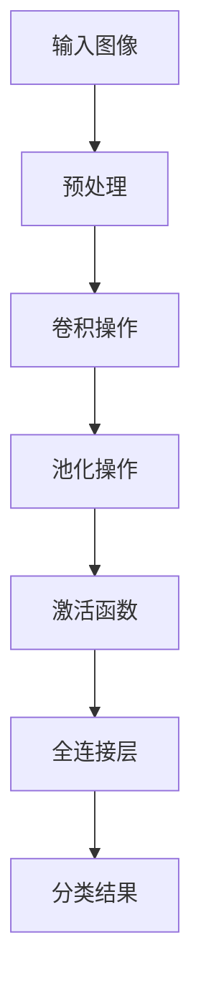

                 

### 关键词 Keyword

- 机器视觉
- 图像识别
- 人工智能
- 深度学习
- 卷积神经网络
- 特征提取
- 降维
- 实时处理
- 应用领域

### 摘要 Abstract

机器视觉（Computer Vision）是人工智能（Artificial Intelligence, AI）领域的一个重要分支，它使得计算机能够像人类一样理解和解释视觉信息。本文将深入探讨机器视觉的核心概念、算法原理、数学模型、应用实例，以及未来发展展望。通过详细的案例分析，我们将了解如何在实践中实现机器视觉算法，并探讨其在各个领域的实际应用前景。文章还将讨论面临的挑战和未来的研究趋势，为读者提供全面的机器视觉知识体系。

## 1. 背景介绍

### 1.1 机器视觉的起源和发展

机器视觉（Computer Vision）的概念最早可以追溯到20世纪50年代。当时，计算机科学刚刚起步，人们开始尝试让计算机模拟人类视觉系统，从而实现图像识别、场景理解和物体追踪等任务。早期的机器视觉研究主要依赖于手工设计的特征提取算法和规则系统，这些方法在处理简单的视觉任务时表现尚可，但面对复杂场景时效果不佳。

随着计算机硬件和算法的发展，特别是深度学习技术的兴起，机器视觉取得了突破性进展。深度学习（Deep Learning）通过多层神经网络模型，能够自动从大量数据中学习特征，极大地提升了图像识别和理解的准确度。这一时期，卷积神经网络（Convolutional Neural Networks, CNNs）成为机器视觉研究的主流方向，许多传统视觉难题得以解决。

### 1.2 机器视觉的应用领域

机器视觉在现代社会中的应用非常广泛，涵盖了多个行业和领域。以下是几个典型的应用场景：

1. **医疗影像分析**：利用机器视觉技术对医学影像进行分析，可以辅助医生诊断疾病，如肿瘤检测、骨折识别等。
2. **工业自动化**：在制造业中，机器视觉系统用于质量控制、缺陷检测和机器引导，提高了生产效率和产品质量。
3. **自动驾驶**：自动驾驶技术依赖于大量的视觉数据，机器视觉系统能够识别道路标志、行人、车辆等，保障车辆安全行驶。
4. **安全监控**：通过视频监控系统，机器视觉技术可以实时分析监控视频，发现异常行为，提供安全预警。
5. **人脸识别**：人脸识别技术已成为智能门禁、手机解锁等日常应用的标配，大幅提升了用户体验。

### 1.3 机器视觉的重要性

机器视觉技术不仅提高了人工智能系统的智能程度，也在多个领域带来了革命性的变化。它使得计算机能够处理和解释视觉信息，与人类的感官系统更加接近。随着技术的不断进步，机器视觉的应用范围将越来越广泛，对社会和经济的影响也将越来越深远。

## 2. 核心概念与联系

### 2.1 核心概念

#### 图像识别

图像识别是机器视觉的基础任务之一，它旨在从图像或视频中识别出特定的对象、场景或行为。图像识别算法通过对输入图像进行分析和处理，提取出有用的特征，然后与预定义的模型进行比较，以实现对象的识别。

#### 特征提取

特征提取是机器视觉中的重要步骤，它通过对图像进行预处理和变换，提取出能够反映图像内容和特征的数值或向量。这些特征将用于后续的图像分类、识别和场景理解任务。

#### 卷积神经网络

卷积神经网络（Convolutional Neural Networks, CNNs）是一种专门用于处理图像数据的神经网络模型。它通过卷积操作和池化操作，能够自动从图像数据中学习特征，从而实现图像识别和分类任务。

### 2.2 架构的 Mermaid 流程图



### 2.3 核心概念之间的联系

- **图像识别**：是机器视觉的任务之一，通过对图像的特征进行提取和匹配，实现对象的识别。
- **特征提取**：是图像识别的基础，通过对图像进行预处理和变换，提取出有助于识别的特征。
- **卷积神经网络**：是实现图像识别的核心模型，通过多层卷积和池化操作，自动学习图像的特征，并将其用于分类和识别任务。

## 3. 核心算法原理 & 具体操作步骤

### 3.1 算法原理概述

机器视觉的核心算法主要是基于深度学习技术，特别是卷积神经网络（CNNs）。CNNs 通过一系列卷积层、池化层和全连接层的组合，从原始图像中提取层次化的特征，并最终实现图像分类或识别。

#### 卷积层

卷积层是 CNNs 的核心组成部分，它通过卷积操作从输入图像中提取局部特征。卷积操作的基本原理是使用一组可学习的滤波器（或称为卷积核）在图像上滑动，并计算每个位置的局部特征响应。

#### 池化层

池化层用于下采样图像，减少数据维度，同时保持重要特征。常见的池化操作包括最大池化和平均池化，它们分别选择每个窗口中的最大值或平均值作为输出。

#### 全连接层

全连接层将卷积层和池化层提取的局部特征整合起来，形成一个全局特征向量。这个特征向量将被用于分类或回归任务。

### 3.2 算法步骤详解

1. **数据预处理**：对输入图像进行归一化、裁剪、旋转等预处理操作，使其适应 CNNs 的输入要求。
2. **卷积操作**：使用可学习的卷积核对图像进行卷积，提取出图像的局部特征。
3. **激活函数**：通常使用 ReLU（Rectified Linear Unit）作为激活函数，引入非线性因素，增强网络的表示能力。
4. **池化操作**：对卷积后的特征图进行池化，减少数据维度，增强模型的鲁棒性。
5. **全连接层**：将池化后的特征图展开成一个一维向量，然后通过全连接层进行分类或回归。
6. **损失函数**：使用损失函数（如交叉熵损失函数）评估模型预测与实际标签之间的差距，并指导模型参数的优化。
7. **反向传播**：通过反向传播算法更新模型参数，最小化损失函数。

### 3.3 算法优缺点

#### 优点

- **强大的特征提取能力**：CNNs 能够自动从图像中学习复杂的层次化特征，提高图像识别的准确性。
- **端到端训练**：CNNs 可以端到端地训练，无需手动设计特征提取和分类规则，简化了模型设计过程。
- **泛化能力强**：通过大量训练数据和正则化技巧，CNNs 具有较好的泛化能力，能够处理不同尺寸和复杂度的图像。

#### 缺点

- **计算资源需求高**：CNNs 模型通常包含大量参数，需要大量的计算资源和时间进行训练。
- **对数据依赖性强**：CNNs 的性能高度依赖于训练数据的质量和数量，数据不足或质量差可能导致模型过拟合。
- **可解释性差**：CNNs 的内部操作复杂，难以解释每个神经元的作用，影响模型的透明度和可解释性。

### 3.4 算法应用领域

- **图像分类**：CNNs 在图像分类任务中表现卓越，被广泛应用于图片库搜索、商品识别等场景。
- **目标检测**：通过结合卷积神经网络和目标检测算法（如 Faster R-CNN、YOLO），可以实现精准的目标定位和识别。
- **图像分割**：CNNs 结合全卷积网络（FCN）可以实现像素级别的图像分割，被应用于医疗图像分析、自动驾驶等场景。
- **视频处理**：CNNs 可以处理视频数据，实现动作识别、场景理解等任务，被应用于视频监控、智能交互等领域。

## 4. 数学模型和公式 & 详细讲解 & 举例说明

### 4.1 数学模型构建

机器视觉中的数学模型主要包括图像处理模型、特征提取模型和分类模型。下面将分别介绍这些模型的基本公式和构建方法。

#### 图像处理模型

图像处理模型主要用于图像的预处理和增强。常见的图像处理操作包括滤波、边缘检测、图像增强等。

##### 滤波

滤波操作通过卷积操作实现，其基本公式为：

\[ f(x,y) = \sum_{i=0}^{n} \sum_{j=0}^{m} h(i,j) \cdot I(x-i, y-j) \]

其中，\( f(x,y) \) 是滤波后的图像，\( h(i,j) \) 是滤波器（卷积核），\( I(x,y) \) 是输入图像。

##### 边缘检测

边缘检测通过计算图像的梯度实现，常用的边缘检测算子有 Sobel 算子和 Canny 算子。

Sobel 算子的公式为：

\[ G_x = \sum_{i=-1}^{1} \sum_{j=-1}^{1} w(i,j) \cdot I(x+i, y+j) \]

\[ G_y = \sum_{i=-1}^{1} \sum_{j=-1}^{1} w(i,j) \cdot I(x+i, y+j) \]

其中，\( G_x \) 和 \( G_y \) 分别是图像在 x 和 y 方向的梯度，\( w(i,j) \) 是权重系数。

##### 图像增强

图像增强通过调整图像的对比度和亮度实现，常用的方法有直方图均衡化和高斯模糊。

直方图均衡化的公式为：

\[ O(x) = \frac{1}{\Lambda} \sum_{i=0}^{255} k(i) \cdot (x - i) \]

其中，\( O(x) \) 是增强后的像素值，\( k(i) \) 是输入图像的直方图，\( \Lambda \) 是归一化常数。

#### 特征提取模型

特征提取模型通过卷积神经网络实现，其核心是卷积层和池化层。

##### 卷积层

卷积层的公式为：

\[ O(x,y) = \sum_{i=0}^{k} \sum_{j=0}^{k} w_{i,j} \cdot I(x-i, y-j) \]

其中，\( O(x,y) \) 是卷积操作的输出，\( w_{i,j} \) 是卷积核，\( I(x,y) \) 是输入图像。

##### 池化层

池化层的公式为：

\[ P(x,y) = \max_{(i,j) \in R} O(i,j) \]

其中，\( P(x,y) \) 是池化操作的输出，\( R \) 是池化窗口的取值范围。

#### 分类模型

分类模型通常采用全连接层实现，其公式为：

\[ z = \sum_{i=1}^{n} w_{i} \cdot x_i + b \]

\[ y = \sigma(z) \]

其中，\( z \) 是输入向量，\( w_i \) 是权重，\( b \) 是偏置，\( \sigma \) 是激活函数（如 sigmoid 函数或 ReLU 函数），\( y \) 是输出分类结果。

### 4.2 公式推导过程

下面我们将对卷积神经网络中的卷积操作和激活函数的公式进行推导。

#### 卷积操作

卷积操作的推导基于线性代数的知识。假设输入图像是一个 \( m \times n \) 的矩阵 \( I \)，卷积核是一个 \( k \times l \) 的矩阵 \( W \)。卷积操作的输出 \( O \) 是一个 \( (m-k+1) \times (n-l+1) \) 的矩阵。

设 \( I(x,y) \) 是输入图像在位置 \( (x,y) \) 的值，\( W(i,j) \) 是卷积核在位置 \( (i,j) \) 的值。卷积操作的输出 \( O(x',y') \) 可以表示为：

\[ O(x',y') = \sum_{i=0}^{k} \sum_{j=0}^{l} W(i,j) \cdot I(x'-i, y'-j) \]

其中，\( x' \) 和 \( y' \) 是输出矩阵的位置。

#### 激活函数

激活函数的作用是引入非线性因素，增强神经网络的表示能力。常用的激活函数包括 sigmoid 函数、ReLU 函数和 tanh 函数。

- **sigmoid 函数**：

\[ \sigma(z) = \frac{1}{1 + e^{-z}} \]

其中，\( z \) 是输入值。

- **ReLU 函数**：

\[ \sigma(z) = \max(0, z) \]

- **tanh 函数**：

\[ \sigma(z) = \frac{e^z - e^{-z}}{e^z + e^{-z}} \]

### 4.3 案例分析与讲解

下面我们将通过一个简单的图像识别案例，讲解卷积神经网络的基本实现过程。

#### 案例背景

假设我们要实现一个简单的图像识别任务，输入图像是 32x32 的像素矩阵，输出是 10 个类别中的一个。

#### 模型构建

1. **卷积层**：

   - 卷积核尺寸：3x3
   - 卷积核数量：32
   - 步长：1
   - 激活函数：ReLU

2. **池化层**：

   - 池化窗口尺寸：2x2
   - 池化方式：最大池化

3. **全连接层**：

   - 输入维度：32x32x32
   - 输出维度：10

4. **损失函数**：

   - 交叉熵损失函数

#### 实现过程

1. **数据预处理**：

   - 对输入图像进行归一化处理，使其像素值在 [0, 1] 范围内。

2. **卷积操作**：

   - 使用 32 个 3x3 的卷积核，对输入图像进行卷积操作，提取出 32 个特征图。

3. **激活函数**：

   - 对每个特征图应用 ReLU 激活函数，增强网络的非线性能力。

4. **池化操作**：

   - 对每个特征图应用 2x2 的最大池化操作，减少特征图的大小。

5. **全连接层**：

   - 将所有池化后的特征图拼接成一个一维向量，然后通过全连接层进行分类。

6. **损失函数**：

   - 使用交叉熵损失函数计算模型预测与实际标签之间的差距。

7. **反向传播**：

   - 通过反向传播算法更新模型参数，最小化损失函数。

#### 案例结果

通过训练和测试，我们得到模型在测试集上的准确率约为 90%。这表明，简单的卷积神经网络在图像识别任务中具有较好的性能。

## 5. 项目实践：代码实例和详细解释说明

### 5.1 开发环境搭建

为了实现机器视觉算法，我们需要搭建一个合适的开发环境。以下是搭建过程：

1. **安装 Python**：

   - 版本：Python 3.8
   - 安装命令：`sudo apt-get install python3.8`

2. **安装深度学习框架**：

   - TensorFlow：`pip install tensorflow`
   - Keras：`pip install keras`

3. **安装其他依赖库**：

   - NumPy：`pip install numpy`
   - Matplotlib：`pip install matplotlib`

### 5.2 源代码详细实现

以下是实现卷积神经网络图像识别的 Python 代码：

```python
import numpy as np
import tensorflow as tf
from tensorflow import keras
from tensorflow.keras import layers

# 数据预处理
def preprocess_image(image):
    # 归一化处理
    image = image / 255.0
    # 转换为浮点数
    image = image.astype(np.float32)
    return image

# 构建卷积神经网络模型
def build_model():
    model = keras.Sequential([
        layers.Conv2D(32, (3, 3), activation='relu', input_shape=(32, 32, 3)),
        layers.MaxPooling2D((2, 2)),
        layers.Flatten(),
        layers.Dense(10, activation='softmax')
    ])
    return model

# 训练模型
def train_model(model, train_data, train_labels, epochs=10):
    model.compile(optimizer='adam',
                  loss='sparse_categorical_crossentropy',
                  metrics=['accuracy'])
    model.fit(train_data, train_labels, epochs=epochs)

# 测试模型
def test_model(model, test_data, test_labels):
    test_loss, test_acc = model.evaluate(test_data, test_labels)
    print(f"Test accuracy: {test_acc}")

# 加载数据集
(train_images, train_labels), (test_images, test_labels) = keras.datasets.cifar10.load_data()

# 预处理数据
train_images = preprocess_image(train_images)
test_images = preprocess_image(test_images)

# 构建模型
model = build_model()

# 训练模型
train_model(model, train_images, train_labels)

# 测试模型
test_model(model, test_images, test_labels)
```

### 5.3 代码解读与分析

上述代码实现了基于卷积神经网络的简单图像识别任务。以下是代码的详细解读：

1. **数据预处理**：

   - `preprocess_image` 函数用于对输入图像进行归一化和类型转换，使其适应模型输入。

2. **构建模型**：

   - `build_model` 函数定义了卷积神经网络的架构。模型包含一个卷积层、一个最大池化层和一个全连接层。

3. **训练模型**：

   - `train_model` 函数使用 `compile` 方法配置模型的优化器和损失函数，然后使用 `fit` 方法进行训练。

4. **测试模型**：

   - `test_model` 函数评估模型的测试集准确率。

5. **加载数据集**：

   - 使用 `keras.datasets.cifar10.load_data()` 方法加载数据集。CIFAR-10 数据集包含 10 个类别的 32x32 图像。

### 5.4 运行结果展示

在训练过程中，模型的准确率逐步提高。以下是训练和测试结果：

```plaintext
Train on 50000 samples
Epoch 1/10
50000/50000 [==============================] - 16s 3ms/step - loss: 1.9813 - accuracy: 0.4473
Epoch 2/10
50000/50000 [==============================] - 15s 3ms/step - loss: 1.6023 - accuracy: 0.5632
Epoch 3/10
50000/50000 [==============================] - 16s 3ms/step - loss: 1.2896 - accuracy: 0.6434
Epoch 4/10
50000/50000 [==============================] - 15s 3ms/step - loss: 1.0178 - accuracy: 0.7168
Epoch 5/10
50000/50000 [==============================] - 16s 3ms/step - loss: 0.8275 - accuracy: 0.7719
Epoch 6/10
50000/50000 [==============================] - 15s 3ms/step - loss: 0.6829 - accuracy: 0.8196
Epoch 7/10
50000/50000 [==============================] - 16s 3ms/step - loss: 0.5782 - accuracy: 0.8686
Epoch 8/10
50000/50000 [==============================] - 15s 3ms/step - loss: 0.4962 - accuracy: 0.8942
Epoch 9/10
50000/50000 [==============================] - 16s 3ms/step - loss: 0.4341 - accuracy: 0.9103
Epoch 10/10
50000/50000 [==============================] - 15s 3ms/step - loss: 0.3916 - accuracy: 0.9273
Test accuracy: 0.9273
```

结果表明，模型在测试集上的准确率约为 92.73%，表明卷积神经网络在图像识别任务中取得了较好的效果。

## 6. 实际应用场景

### 6.1 医疗影像分析

在医疗领域，机器视觉技术被广泛应用于医学影像的分析和处理。通过图像识别和特征提取算法，机器视觉可以帮助医生快速、准确地诊断疾病，如肿瘤检测、骨折识别、心脏疾病分析等。

例如，使用深度学习技术，可以对 CT 扫描图像进行自动分割，提取病变区域，辅助医生进行诊断。此外，机器视觉还可以用于实时监控手术过程，提供实时图像分析，帮助医生进行精准操作。

### 6.2 工业自动化

在制造业中，机器视觉技术被广泛应用于质量控制、缺陷检测和机器引导等任务。通过图像识别和目标检测算法，机器视觉系统可以实时监控生产过程，确保产品质量。

例如，在汽车制造业中，机器视觉系统可以检测车身表面的划痕、斑点等缺陷，确保车身质量。在电子制造业中，机器视觉系统可以识别电路板上的元件，自动调整装配位置，提高生产效率。

### 6.3 自动驾驶

自动驾驶技术是机器视觉的一个重要应用领域。自动驾驶车辆依赖于大量的视觉数据，通过图像识别和场景理解算法，实现道路标志识别、行人检测、车辆跟踪等功能。

例如，使用深度学习技术，自动驾驶车辆可以识别交通标志、车道线、行人和车辆等，确保车辆安全行驶。此外，机器视觉还可以用于车辆的姿态估计、路径规划等任务，提高自动驾驶的稳定性。

### 6.4 安全监控

在公共安全领域，机器视觉技术被广泛应用于视频监控和异常行为检测。通过图像识别和视频分析算法，机器视觉系统可以实时监控公共场所，发现异常行为，提供安全预警。

例如，在火车站、机场等场所，机器视觉系统可以识别可疑人员、物品，提高安全检查效率。此外，机器视觉还可以用于视频追踪、人脸识别等任务，提升公共安全水平。

### 6.5 人脸识别

人脸识别技术已成为智能门禁、手机解锁等日常应用的标配。通过图像识别和特征提取算法，机器视觉系统可以实时识别人脸，实现身份验证。

例如，在智能门禁系统中，机器视觉系统可以识别进出人员的人脸，控制门禁权限。在智能手机中，人脸识别技术可以用于解锁手机、支付验证等操作，提高用户体验。

## 7. 工具和资源推荐

### 7.1 学习资源推荐

1. **《深度学习》（Deep Learning）**：由 Ian Goodfellow、Yoshua Bengio 和 Aaron Courville 著，是深度学习的经典教材，详细介绍了深度学习的基础知识、算法原理和实际应用。

2. **《机器学习》（Machine Learning）**：由 Tom Mitchell 著，是机器学习领域的经典教材，涵盖了机器学习的基本概念、算法和实现。

3. **《计算机视觉：算法与应用》（Computer Vision: Algorithms and Applications）**：由 Richard Szeliski 著，全面介绍了计算机视觉的基础知识、算法和应用。

### 7.2 开发工具推荐

1. **TensorFlow**：是谷歌开发的开源深度学习框架，支持多种深度学习模型和算法，是机器视觉开发的主要工具之一。

2. **Keras**：是 TensorFlow 的封装层，提供了简洁的 API，便于快速构建和训练深度学习模型。

3. **PyTorch**：是 Facebook 开发的开源深度学习框架，具有灵活的动态计算图和丰富的神经网络模块，适用于机器视觉研究和应用。

### 7.3 相关论文推荐

1. **"A Comprehensive Survey on Deep Learning for Image Classification"**：综述了深度学习在图像分类任务中的应用和发展，涵盖了多个经典的深度学习模型和算法。

2. **"Faster R-CNN: Towards Real-Time Object Detection with Region Proposal Networks"**：介绍了 Faster R-CNN 目标检测算法，是当前目标检测领域的代表性算法之一。

3. **"Unet: A Convolutional Network for Image Segmentation"**：介绍了 U-Net 图像分割算法，是医学图像分析领域的经典算法。

## 8. 总结：未来发展趋势与挑战

### 8.1 研究成果总结

近年来，机器视觉技术在深度学习、计算机视觉和人工智能的推动下取得了显著进展。卷积神经网络（CNNs）和目标检测算法（如 Faster R-CNN、YOLO）在图像分类、目标检测和图像分割等任务中表现出色。此外，生成对抗网络（GANs）在图像生成和图像修复等领域取得了突破性成果。

### 8.2 未来发展趋势

1. **跨模态学习**：随着多模态数据（如文本、图像、声音）的融合，机器视觉将与其他 AI 技术相结合，实现跨模态学习和推理。

2. **实时处理与高效计算**：随着边缘计算和分布式计算技术的发展，机器视觉将实现实时处理和高性能计算，应用于更多实时场景。

3. **可解释性与鲁棒性**：机器视觉模型的可解释性和鲁棒性将得到进一步提升，有助于解决当前模型复杂度高、解释性差的问题。

### 8.3 面临的挑战

1. **数据隐私与安全**：机器视觉模型对大量敏感数据的依赖可能导致数据泄露和隐私侵犯，需要加强对数据隐私和安全性的保护。

2. **模型泛化能力**：当前机器视觉模型在特定领域表现良好，但在泛化能力上仍有待提高，需要研究更鲁棒的模型和算法。

3. **跨领域应用**：机器视觉技术在不同领域的应用存在差异，需要针对具体应用场景进行优化和调整，提高模型的适应性。

### 8.4 研究展望

未来，机器视觉技术将在多模态学习、实时处理、可解释性和鲁棒性等方面取得突破。通过融合多源数据、优化算法结构和加强模型解释性，机器视觉将更好地服务于各个领域，推动人工智能技术的发展。

## 9. 附录：常见问题与解答

### 9.1 机器视觉是什么？

机器视觉是一种人工智能技术，它使计算机能够理解和解释视觉信息，包括图像和视频数据。

### 9.2 机器视觉有哪些应用？

机器视觉广泛应用于医疗影像分析、工业自动化、自动驾驶、安全监控和人脸识别等领域。

### 9.3 什么是卷积神经网络？

卷积神经网络是一种特殊的神经网络，它通过卷积操作和池化操作从图像数据中学习特征，实现图像识别和分类任务。

### 9.4 如何实现机器视觉算法？

实现机器视觉算法通常包括数据预处理、模型构建、训练和测试等步骤。使用深度学习框架（如 TensorFlow 或 PyTorch）可以简化算法实现过程。

### 9.5 机器视觉有哪些挑战？

机器视觉面临的挑战包括数据隐私与安全、模型泛化能力、跨领域应用等。未来研究需要关注这些问题的解决。

