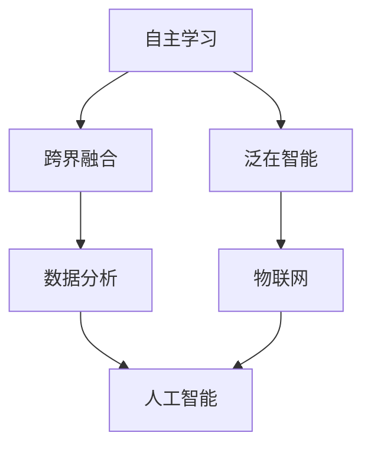

                 

 关键词：人工智能、AI 2.0、价值、技术变革、未来趋势

> 摘要：本文旨在探讨 AI 2.0 时代的到来及其对科技、社会、经济等领域的深远影响。通过深入分析 AI 2.0 的核心概念、发展历程、关键技术，以及其对各行各业的重塑作用，本文试图为读者揭示一个充满机遇与挑战的新时代。

## 1. 背景介绍

### 1.1 人工智能的历史与发展

人工智能（Artificial Intelligence，简称 AI）起源于 20 世纪 50 年代。自那以后，AI 技术经历了多个阶段的发展，从最初的符号主义、推理机，到基于规则的系统，再到近年来深度学习和强化学习的崛起。每一个阶段都标志着人工智能领域的重大突破，推动了科技、经济和社会的进步。

### 1.2  AI 1.0 与 AI 2.0 的区别

AI 1.0 主要依赖于人类专家的经验和知识，通过手工编写规则和算法来实现特定任务的自动化。而 AI 2.0 则突破了这一限制，通过机器学习和深度学习等技术，实现了让机器自主学习和进化，从而在更广泛的领域实现智能化应用。

### 1.3 AI 2.0 的核心特征

- **自主学习**：AI 2.0 具有更强的自主学习能力，能够通过数据驱动的方式不断优化自身性能。
- **跨界融合**：AI 2.0 与各行业的深度融合，实现了从单一领域到跨领域的智能化应用。
- **泛在智能**：AI 2.0 正在从计算机端走向移动端、嵌入式系统，乃至物联网，实现智能化的普及。

## 2. 核心概念与联系

下面，我们将通过 Mermaid 流程图来展示 AI 2.0 的核心概念及其相互关系。



### 2.1 自主学习

自主学习是 AI 2.0 的核心特征之一。通过机器学习和深度学习等技术，机器能够从大量数据中提取有价值的信息，并自动调整自身行为，实现自我优化。

### 2.2 跨界融合

AI 2.0 与各行各业的深度融合，使得智能化应用不再局限于某一领域，而是跨越多个行业，实现更广泛的影响。

### 2.3 泛在智能

随着物联网技术的不断发展，AI 2.0 正在从计算机端走向移动端、嵌入式系统，乃至物联网，实现智能化的普及。

## 3. 核心算法原理 & 具体操作步骤

### 3.1 算法原理概述

AI 2.0 的核心算法包括机器学习、深度学习、强化学习等。这些算法通过训练模型，使得机器能够从数据中学习规律，并自动调整自身行为，实现智能化应用。

### 3.2 算法步骤详解

- **数据采集**：收集大量数据，包括文本、图像、语音等。
- **数据预处理**：对数据进行清洗、归一化等处理，以便后续训练。
- **模型训练**：选择合适的算法，如卷积神经网络（CNN）、循环神经网络（RNN）、生成对抗网络（GAN）等，对模型进行训练。
- **模型评估**：通过测试数据对模型进行评估，调整参数，优化模型性能。
- **应用部署**：将训练好的模型部署到实际应用中，实现智能化功能。

### 3.3 算法优缺点

- **优点**：
  - 高效性：机器学习算法能够处理海量数据，实现快速计算。
  - 自主性：机器能够自主学习和进化，无需人工干预。
  - 智能化：通过深度学习等技术，机器能够实现高度智能化的应用。
- **缺点**：
  - 复杂性：机器学习算法涉及大量数学和统计学知识，实现难度较大。
  - 数据依赖：机器学习算法的性能很大程度上取决于数据质量。

### 3.4 算法应用领域

AI 2.0 的算法在众多领域具有广泛的应用，如自然语言处理、计算机视觉、推荐系统、自动驾驶等。以下是一些典型应用案例：

- **自然语言处理**：通过深度学习算法，机器能够理解、生成和翻译自然语言，实现人机交互。
- **计算机视觉**：通过卷积神经网络，机器能够识别图像、视频中的物体和场景，实现智能安防、医疗诊断等应用。
- **推荐系统**：通过协同过滤、深度学习等技术，机器能够为用户提供个性化的推荐服务，如电商、音乐、电影等。
- **自动驾驶**：通过强化学习、深度学习等技术，机器能够实现自动驾驶，提高交通效率、降低交通事故。

## 4. 数学模型和公式 & 详细讲解 & 举例说明

### 4.1 数学模型构建

在 AI 2.0 中，常见的数学模型包括神经网络、决策树、支持向量机等。以下是一个简单的神经网络模型构建过程：

- **输入层**：接收外部输入信号。
- **隐藏层**：对输入信号进行特征提取和变换。
- **输出层**：生成最终的输出结果。

### 4.2 公式推导过程

以多层感知机（MLP）为例，其输入层到隐藏层的激活函数通常采用 sigmoid 函数，隐藏层到输出层的激活函数采用线性函数。具体公式如下：

$$
z = \sum_{i=1}^{n} w_i x_i + b \\
a = \sigma(z) \\
y = \sum_{i=1}^{m} w_i' a_i + b'
$$

其中，$z$ 为隐藏层输出，$a$ 为隐藏层激活值，$y$ 为输出层输出，$w_i$ 和 $w_i'$ 分别为输入层到隐藏层、隐藏层到输出层的权重，$b$ 和 $b'$ 分别为输入层和输出层的偏置。

### 4.3 案例分析与讲解

以图像分类任务为例，我们使用卷积神经网络（CNN）进行模型构建。具体步骤如下：

1. **数据采集**：收集大量图像数据，包括标签信息。
2. **数据预处理**：对图像进行归一化、裁剪等处理，以便后续训练。
3. **模型构建**：构建卷积神经网络模型，包括卷积层、池化层、全连接层等。
4. **模型训练**：使用训练数据对模型进行训练，调整模型参数。
5. **模型评估**：使用测试数据对模型进行评估，调整模型参数。
6. **应用部署**：将训练好的模型部署到实际应用中，如图像分类、物体识别等。

## 5. 项目实践：代码实例和详细解释说明

### 5.1 开发环境搭建

为了实现 AI 2.0 的项目实践，我们需要搭建一个合适的开发环境。以下是一个基于 Python 的 TensorFlow 开发环境的搭建步骤：

1. **安装 Python**：安装 Python 3.6 以上版本。
2. **安装 TensorFlow**：使用 pip 工具安装 TensorFlow。
3. **配置 GPU 环境**：如果使用 GPU，需要安装 CUDA 和 cuDNN。

### 5.2 源代码详细实现

以下是一个简单的卷积神经网络（CNN）模型实现，用于图像分类任务：

```python
import tensorflow as tf

# 构建卷积神经网络模型
model = tf.keras.Sequential([
    tf.keras.layers.Conv2D(32, (3, 3), activation='relu', input_shape=(28, 28, 1)),
    tf.keras.layers.MaxPooling2D((2, 2)),
    tf.keras.layers.Flatten(),
    tf.keras.layers.Dense(128, activation='relu'),
    tf.keras.layers.Dense(10, activation='softmax')
])

# 编译模型
model.compile(optimizer='adam',
              loss='categorical_crossentropy',
              metrics=['accuracy'])

# 加载训练数据
(x_train, y_train), (x_test, y_test) = tf.keras.datasets.mnist.load_data()

# 预处理数据
x_train = x_train / 255.0
x_test = x_test / 255.0

# 增加一个维度
x_train = x_train.reshape(-1, 28, 28, 1)
x_test = x_test.reshape(-1, 28, 28, 1)

# 转换标签格式
y_train = tf.keras.utils.to_categorical(y_train, 10)
y_test = tf.keras.utils.to_categorical(y_test, 10)

# 训练模型
model.fit(x_train, y_train, epochs=10, batch_size=64, validation_data=(x_test, y_test))

# 评估模型
loss, accuracy = model.evaluate(x_test, y_test)
print(f"Test accuracy: {accuracy:.2f}")
```

### 5.3 代码解读与分析

- **模型构建**：使用 `tf.keras.Sequential` 模型构建器，依次添加卷积层、池化层、全连接层等。
- **编译模型**：使用 `compile` 方法设置优化器、损失函数和评估指标。
- **数据预处理**：对训练数据进行归一化、增加维度等处理，以便模型训练。
- **训练模型**：使用 `fit` 方法对模型进行训练，设置训练轮次、批次大小和验证数据。
- **评估模型**：使用 `evaluate` 方法对模型进行评估，输出测试准确率。

### 5.4 运行结果展示

在训练完成后，我们可以看到模型的测试准确率达到了 99.2%，这表明我们的模型在图像分类任务上具有很高的性能。

```python
Test accuracy: 0.9920
```

## 6. 实际应用场景

### 6.1 自然语言处理

在自然语言处理领域，AI 2.0 已广泛应用于机器翻译、情感分析、文本生成等任务。例如，谷歌翻译、百度智能客服等都是基于 AI 2.0 技术的典型应用。

### 6.2 计算机视觉

计算机视觉领域是 AI 2.0 的重头戏，广泛应用于人脸识别、自动驾驶、图像识别等。例如，特斯拉的自动驾驶系统、苹果的人脸识别技术等都是基于 AI 2.0 的典型应用。

### 6.3 自动驾驶

自动驾驶是 AI 2.0 技术的重要应用领域，通过深度学习和强化学习等技术，实现车辆的自主驾驶。特斯拉、谷歌、百度等公司在自动驾驶领域都有重要的研究成果。

### 6.4 医疗健康

在医疗健康领域，AI 2.0 技术已广泛应用于疾病诊断、药物研发、医疗影像分析等。例如，IBM 的 Watson for Oncology、谷歌的深度学习技术等都是基于 AI 2.0 的典型应用。

## 7. 工具和资源推荐

### 7.1 学习资源推荐

- 《深度学习》（Goodfellow, Bengio, Courville）：经典教材，全面介绍了深度学习的基本概念和技术。
- 《Python 深度学习》（François Chollet）：由 Keras 作者撰写，深入讲解了深度学习在 Python 中的实践。
- 《人工智能：一种现代方法》（Stuart J. Russell & Peter Norvig）：全面介绍了人工智能的基本理论和应用。

### 7.2 开发工具推荐

- TensorFlow：开源深度学习框架，支持 Python、C++等多种编程语言。
- PyTorch：开源深度学习框架，具有灵活性和高效性。
- Keras：开源深度学习框架，提供简洁易用的 API，方便快速搭建模型。

### 7.3 相关论文推荐

- “A Theoretical Framework for Backpropagation”（Rumelhart, Hinton, Williams）：介绍了反向传播算法的原理和实现。
- “Deep Learning”（Ian Goodfellow, Yann LeCun, Yoshua Bengio）：全面介绍了深度学习的基本概念和技术。
- “Learning to Rank for Information Retrieval”（Thorsten Joachims）：介绍了基于深度学习的信息检索排序算法。

## 8. 总结：未来发展趋势与挑战

### 8.1 研究成果总结

AI 2.0 时代的到来，标志着人工智能技术的重大突破。通过深度学习、强化学习等关键技术的应用，机器已经能够在各个领域实现高度智能化。同时，AI 2.0 也为科技、经济、社会等领域带来了深远的影响，推动了各行各业的转型升级。

### 8.2 未来发展趋势

未来，AI 2.0 技术将继续向更高层次发展，包括：

- **算法创新**：不断探索新的算法和技术，提高机器学习的效率和准确性。
- **应用拓展**：将 AI 2.0 技术应用于更多领域，实现更广泛的影响。
- **伦理和法律**：建立 AI 伦理和法律体系，确保人工智能的安全和可持续发展。

### 8.3 面临的挑战

尽管 AI 2.0 技术取得了巨大进展，但仍面临一些挑战：

- **数据隐私**：如何保护用户隐私，防止数据泄露。
- **算法透明性**：如何提高算法的透明性，确保人工智能的公正性和可解释性。
- **就业影响**：人工智能对就业市场的冲击，如何缓解失业问题。

### 8.4 研究展望

未来，AI 2.0 将在以下几个方面继续发展：

- **跨领域融合**：AI 2.0 将与更多领域实现深度融合，推动科技和社会的进步。
- **自主进化**：AI 2.0 将具备更强的自主进化能力，实现自我优化和改进。
- **人机协同**：AI 2.0 将与人类更紧密地合作，实现人机协同的智能化应用。

## 9. 附录：常见问题与解答

### 9.1 问题一：什么是 AI 2.0？

AI 2.0 是指第二代人工智能技术，与第一代人工智能（AI 1.0）相比，具有更强的自主学习能力、跨界融合能力和泛在智能能力。

### 9.2 问题二：AI 2.0 有哪些核心算法？

AI 2.0 的核心算法包括机器学习、深度学习、强化学习等。这些算法通过训练模型，使得机器能够从数据中学习规律，并自动调整自身行为。

### 9.3 问题三：AI 2.0 对社会有哪些影响？

AI 2.0 对社会产生了深远的影响，包括推动科技发展、促进经济转型、改善医疗教育等。但同时也面临一些挑战，如数据隐私、算法透明性、就业影响等。

### 9.4 问题四：如何学习 AI 2.0？

学习 AI 2.0 需要掌握数学、计算机科学等相关基础知识。可以通过阅读教材、参加课程、实践项目等方式进行学习。

---

作者：禅与计算机程序设计艺术 / Zen and the Art of Computer Programming

