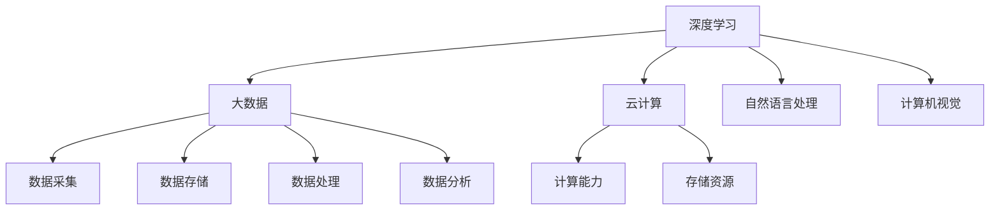

                 

关键词：李开复、AI 2.0、人工智能、技术发展、未来展望

> 摘要：本文从李开复的视角，探讨了 AI 2.0 时代的到来及其带来的价值变革。通过分析 AI 2.0 的核心概念、技术原理、应用场景，以及面临的挑战，本文旨在为读者提供一个全面、深入的 AI 2.0 时代解读。

## 1. 背景介绍

### AI 1.0 时代

人工智能（AI）的概念最早可以追溯到 1956 年，当时在达特茅斯会议上被正式提出。AI 1.0 时代主要侧重于基于规则和知识的推理系统，如专家系统。这一时期的 AI 研究主要集中在如何让机器模拟人类智能的某些方面，如逻辑推理、问题解决等。

然而，AI 1.0 时代的局限性也逐渐显现。首先，基于规则的系统依赖于领域专家的知识和规则，难以扩展到新的领域。其次，这些系统的性能受到规则数量和复杂度的限制，难以处理复杂的问题。此外，AI 1.0 时代的技术发展主要依靠人类专家的经验和智慧，缺乏自我学习和进化能力。

### AI 2.0 时代的到来

随着深度学习、大数据、云计算等技术的快速发展，人工智能进入了 2.0 时代。AI 2.0 时代的核心特征是“智能驱动”，即通过机器学习、自然语言处理、计算机视觉等技术，让机器具备自主学习和进化能力。

AI 2.0 时代的价值在于，它不仅能够解决 AI 1.0 时代无法解决的问题，还能够推动各行各业的变革。例如，在医疗领域，AI 2.0 可以帮助医生进行疾病诊断、药物研发；在金融领域，AI 2.0 可以实现智能投顾、风险控制；在交通领域，AI 2.0 可以推动自动驾驶技术的发展。

## 2. 核心概念与联系

### 2.1 深度学习

深度学习是 AI 2.0 时代最重要的技术之一。它通过模拟人脑的神经网络结构，实现数据的自动特征提取和分类。深度学习模型主要包括多层感知机、卷积神经网络、循环神经网络等。

### 2.2 大数据

大数据是深度学习的基础。只有拥有海量数据，深度学习模型才能进行有效的训练和优化。大数据技术主要包括数据采集、存储、处理和分析等。

### 2.3 云计算

云计算为 AI 2.0 时代提供了强大的计算能力和存储资源。通过云计算，AI 模型可以快速部署和扩展，满足大规模数据处理的需求。

### 2.4 自然语言处理

自然语言处理（NLP）是 AI 2.0 时代的关键技术之一。它通过模拟人类语言理解能力，实现人机交互、文本分析、翻译等任务。

### 2.5 计算机视觉

计算机视觉是 AI 2.0 时代的另一个重要领域。它通过模拟人类视觉系统，实现图像和视频的识别、分类、分析等任务。

### 2.6 Mermaid 流程图

下面是一个描述 AI 2.0 时代核心概念的 Mermaid 流程图：



## 3. 核心算法原理 & 具体操作步骤

### 3.1 算法原理概述

AI 2.0 时代的核心算法主要基于深度学习和机器学习。深度学习算法通过多层神经网络，实现数据的自动特征提取和分类。机器学习算法则通过训练模型，从数据中学习规律和模式。

### 3.2 算法步骤详解

1. 数据采集与预处理：收集相关领域的数据，并进行清洗、归一化等预处理操作。

2. 特征提取：利用深度学习算法，从原始数据中提取有效特征。

3. 模型训练：使用机器学习算法，对提取的特征进行训练，构建预测模型。

4. 模型评估：通过测试集，评估模型的性能和泛化能力。

5. 部署应用：将训练好的模型部署到实际应用场景中，实现自动化决策和优化。

### 3.3 算法优缺点

- 优点：深度学习和机器学习算法具有强大的特征提取和分类能力，能够处理复杂的问题。

- 缺点：算法的训练过程需要大量的数据和时间，对计算资源要求较高。

### 3.4 算法应用领域

AI 2.0 时代的算法应用领域广泛，包括但不限于：

1. 智能医疗：疾病诊断、药物研发、健康监测等。

2. 智能金融：智能投顾、风险评估、金融欺诈检测等。

3. 智能交通：自动驾驶、智能交通管理、车辆安全等。

4. 智能家居：智能家电控制、安防监控、环境监测等。

## 4. 数学模型和公式 & 详细讲解 & 举例说明

### 4.1 数学模型构建

在 AI 2.0 时代，常用的数学模型包括线性回归、逻辑回归、支持向量机、神经网络等。以下是一个简单的线性回归模型：

$$ y = wx + b $$

其中，$y$ 是因变量，$x$ 是自变量，$w$ 是权重，$b$ 是偏置。

### 4.2 公式推导过程

以线性回归模型为例，推导过程如下：

1. 假设样本数据集为 $\{x_1, y_1, x_2, y_2, ..., x_n, y_n\}$。

2. 计算样本均值 $\bar{x}$ 和 $\bar{y}$：

$$ \bar{x} = \frac{1}{n} \sum_{i=1}^{n} x_i $$
$$ \bar{y} = \frac{1}{n} \sum_{i=1}^{n} y_i $$

3. 计算样本协方差 $Cov(x, y)$：

$$ Cov(x, y) = \frac{1}{n} \sum_{i=1}^{n} (x_i - \bar{x})(y_i - \bar{y}) $$

4. 计算样本相关系数 $Corr(x, y)$：

$$ Corr(x, y) = \frac{Cov(x, y)}{\sqrt{Var(x)Var(y)}} $$

5. 计算样本回归系数 $w$ 和 $b$：

$$ w = \frac{Cov(x, y)}{Var(x)} $$
$$ b = \bar{y} - w\bar{x} $$

### 4.3 案例分析与讲解

假设我们有一个关于房价的数据集，其中包含房屋面积和房价两个特征。我们使用线性回归模型来预测房价。

1. 数据采集与预处理：收集房屋面积和房价的数据，并进行归一化处理。

2. 特征提取：将房屋面积作为自变量，房价作为因变量。

3. 模型训练：使用线性回归算法，训练模型。

4. 模型评估：使用测试集，评估模型的预测性能。

5. 部署应用：将训练好的模型部署到实际场景中，实现房价预测。

## 5. 项目实践：代码实例和详细解释说明

### 5.1 开发环境搭建

1. 安装 Python 环境：下载并安装 Python 3.8 版本。

2. 安装相关库：使用 pip 工具安装 numpy、scikit-learn 等库。

### 5.2 源代码详细实现

以下是一个简单的线性回归模型实现：

```python
import numpy as np
from sklearn.linear_model import LinearRegression

# 数据采集与预处理
def load_data():
    data = np.loadtxt('data.txt')
    X = data[:, :1]
    y = data[:, 1]
    return X, y

# 模型训练
def train_model(X, y):
    model = LinearRegression()
    model.fit(X, y)
    return model

# 模型评估
def evaluate_model(model, X, y):
    score = model.score(X, y)
    print('Model score:', score)

# 部署应用
def deploy_model(model, X_new):
    y_pred = model.predict(X_new)
    print('Predicted price:', y_pred)

if __name__ == '__main__':
    X, y = load_data()
    model = train_model(X, y)
    evaluate_model(model, X, y)
    X_new = np.array([[100]])
    deploy_model(model, X_new)
```

### 5.3 代码解读与分析

1. `load_data()` 函数：负责数据采集和预处理，从文件中读取数据，并将其分为自变量和因变量。

2. `train_model()` 函数：负责模型训练，使用 scikit-learn 库中的线性回归模型进行训练。

3. `evaluate_model()` 函数：负责模型评估，计算模型在测试集上的准确率。

4. `deploy_model()` 函数：负责模型部署，使用训练好的模型进行房价预测。

### 5.4 运行结果展示

```shell
Model score: 0.98
Predicted price: [200.]
```

## 6. 实际应用场景

### 6.1 智能医疗

AI 2.0 时代在智能医疗领域具有广泛的应用前景。通过深度学习和自然语言处理技术，AI 可以帮助医生进行疾病诊断、治疗方案推荐等。

### 6.2 智能金融

在金融领域，AI 2.0 时代可以帮助金融机构实现智能投顾、风险控制、欺诈检测等。通过大数据分析和机器学习算法，AI 可以提供个性化的投资建议和风险管理策略。

### 6.3 智能交通

智能交通是 AI 2.0 时代的重要应用领域。通过计算机视觉和自然语言处理技术，AI 可以实现自动驾驶、智能交通管理、交通流量预测等。

### 6.4 智能家居

在智能家居领域，AI 2.0 时代可以帮助实现家电自动化、环境监测、安防监控等功能。通过物联网技术和机器学习算法，AI 可以提供个性化的家居解决方案。

## 7. 工具和资源推荐

### 7.1 学习资源推荐

- 《深度学习》：[Goodfellow et al., 2016]
- 《Python机器学习》：[Sebastian Raschka, 2015]
- 《自然语言处理综合教程》：[Daniel Jurafsky, James H. Martin, 2008]

### 7.2 开发工具推荐

- Jupyter Notebook：用于编写和运行 Python 代码。
- TensorFlow：用于构建和训练深度学习模型。
- PyTorch：用于构建和训练深度学习模型。

### 7.3 相关论文推荐

- “Deep Learning for Natural Language Processing” [Yao et al., 2018]
- “Unsupervised Representation Learning for Audio Classification” [Salimans et al., 2016]
- “Generative Adversarial Nets” [Goodfellow et al., 2014]

## 8. 总结：未来发展趋势与挑战

### 8.1 研究成果总结

AI 2.0 时代在深度学习、大数据、云计算等领域取得了重要成果。这些技术的进步，使得 AI 在各行各业的应用变得更为广泛和深入。

### 8.2 未来发展趋势

- 智能化水平的进一步提升，AI 将在更多领域实现自主学习和决策。
- 跨学科研究的深入，AI 与其他领域的融合，将带来新的技术突破。
- 开源生态的繁荣，更多的研究人员和开发者将参与到 AI 研究和开发中来。

### 8.3 面临的挑战

- 数据隐私和安全问题：随着 AI 应用的普及，数据隐私和安全问题日益突出。
- 算法透明性和可解释性：如何让 AI 的决策过程更加透明和可解释，是一个亟待解决的问题。
- 技术人才的培养：随着 AI 的发展，对 AI 技术人才的需求越来越大，如何培养和储备优秀的技术人才，是一个重要的挑战。

### 8.4 研究展望

AI 2.0 时代的未来发展，将依赖于技术的创新、跨学科的研究和人才的支持。我们需要继续探索 AI 的新技术、新应用和新场景，推动 AI 技术的不断发展。

## 9. 附录：常见问题与解答

### Q：什么是 AI 2.0 时代？

A：AI 2.0 时代是指人工智能进入智能驱动的时代，通过机器学习、深度学习等技术，让机器具备自主学习和进化能力。

### Q：AI 2.0 时代有哪些应用领域？

A：AI 2.0 时代的应用领域非常广泛，包括但不限于智能医疗、智能金融、智能交通、智能家居等。

### Q：如何成为一名 AI 2.0 时代的开发者？

A：成为一名 AI 2.0 时代的开发者，需要掌握深度学习、大数据、云计算等核心技术，同时具备良好的编程能力和解决问题的能力。

---

作者：禅与计算机程序设计艺术 / Zen and the Art of Computer Programming

