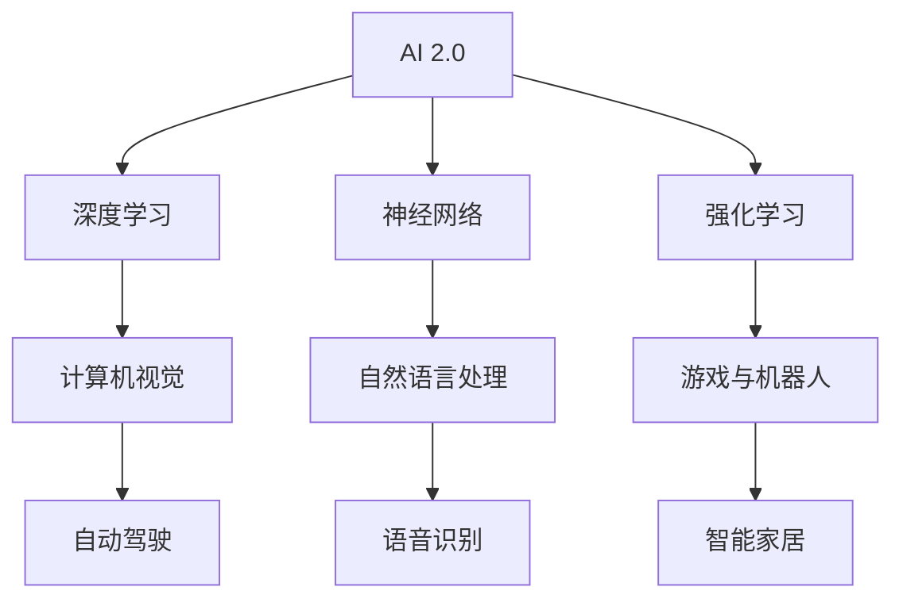

                 

关键词：李开复，AI 2.0，创业者，技术趋势，商业模式

摘要：本文将探讨 AI 2.0 时代的创业者所面临的机遇与挑战，以李开复为例，分析其如何运用人工智能技术推动创新，实现商业成功。文章将涵盖 AI 2.0 的核心概念与架构、AI 算法的原理与操作步骤、数学模型与公式、项目实践、实际应用场景、未来应用展望、工具和资源推荐以及未来发展趋势与挑战。

## 1. 背景介绍

### AI 2.0：变革与机遇

AI 2.0 是指人工智能技术的第二次重大变革，主要表现在深度学习、神经网络、强化学习等领域的突破，使得人工智能从模拟简单的感知和响应，走向了自主学习和智能决策。AI 2.0 的出现，为创业者带来了前所未有的机遇，同时也带来了巨大的挑战。

### 李开复：AI 2.0 时代的领军人物

李开复，著名人工智能专家，世界顶级技术畅销书作者，计算机图灵奖获得者，被誉为“AI 2.0 时代的领军人物”。他的主要成就包括领导创新工场的创业投资，推动人工智能在各个行业的应用，以及撰写多部有关人工智能的技术著作。

## 2. 核心概念与联系



### 核心概念

- **深度学习**：一种基于多层神经网络的人工智能技术，能够自动从数据中学习特征和模式。
- **神经网络**：由大量人工神经元组成的网络，通过调整神经元之间的权重来实现对数据的处理。
- **强化学习**：一种通过试错学习的方式，让智能体在环境中获得最佳决策的策略。

### 联系与应用

这些核心概念在各个领域都有着广泛的应用，如计算机视觉、自然语言处理、游戏与机器人等。通过深度学习、神经网络和强化学习等技术，创业者可以打造出具有自主学习和智能决策能力的人工智能产品。

## 3. 核心算法原理 & 具体操作步骤

### 3.1 算法原理概述

- **深度学习**：通过多层神经网络对数据进行特征提取和模式识别。
- **神经网络**：神经元之间通过权重进行数据传递和计算。
- **强化学习**：智能体在环境中通过试错学习，获得最佳决策策略。

### 3.2 算法步骤详解

1. **数据收集与预处理**：收集大量数据，并对数据进行清洗、归一化等预处理。
2. **模型构建**：搭建神经网络模型，包括输入层、隐藏层和输出层。
3. **训练与优化**：通过反向传播算法，调整模型参数，使得模型在训练数据上表现更好。
4. **测试与评估**：在测试数据上评估模型性能，调整模型结构或参数。
5. **应用部署**：将训练好的模型部署到实际应用中，实现智能决策和自主学习。

### 3.3 算法优缺点

- **深度学习**：优点：强大的特征提取能力，适用于复杂数据处理任务；缺点：需要大量数据和计算资源，模型可解释性较低。
- **神经网络**：优点：简单易实现，适用于各种数据处理任务；缺点：模型复杂度较高，训练过程较慢。
- **强化学习**：优点：适用于动态环境，能够自主学习；缺点：需要大量试错，训练过程较慢。

### 3.4 算法应用领域

- **计算机视觉**：图像识别、目标检测、人脸识别等。
- **自然语言处理**：机器翻译、文本分类、情感分析等。
- **游戏与机器人**：智能棋手、自动驾驶、机器人导航等。

## 4. 数学模型和公式 & 详细讲解 & 举例说明

### 4.1 数学模型构建

在深度学习和神经网络中，常用的数学模型包括损失函数、反向传播算法和优化算法等。

### 4.2 公式推导过程

- **损失函数**：衡量模型预测结果与真实结果之间的差距，常用的损失函数有均方误差、交叉熵等。
- **反向传播算法**：通过计算梯度，调整模型参数，使得损失函数值最小化。
- **优化算法**：用于调整模型参数，常用的优化算法有梯度下降、动量法等。

### 4.3 案例分析与讲解

以深度学习中的卷积神经网络（CNN）为例，讲解 CNN 的数学模型和公式。

```latex
损失函数：L = \frac{1}{m} \sum_{i=1}^{m} (-y_i \log(\hat{y}_i))

梯度计算：\frac{\partial L}{\partial W} = \frac{1}{m} \sum_{i=1}^{m} (\hat{y}_i - y_i) \cdot z_i

优化算法：\theta = \theta - \alpha \cdot \frac{\partial L}{\partial \theta}
```

## 5. 项目实践：代码实例和详细解释说明

### 5.1 开发环境搭建

在 Python 中使用 TensorFlow 框架实现一个简单的卷积神经网络。

### 5.2 源代码详细实现

```python
import tensorflow as tf
from tensorflow.keras import layers

model = tf.keras.Sequential([
    layers.Conv2D(32, (3, 3), activation='relu', input_shape=(28, 28, 1)),
    layers.MaxPooling2D((2, 2)),
    layers.Conv2D(64, (3, 3), activation='relu'),
    layers.MaxPooling2D((2, 2)),
    layers.Conv2D(64, (3, 3), activation='relu'),
    layers.Flatten(),
    layers.Dense(64, activation='relu'),
    layers.Dense(10, activation='softmax')
])

model.compile(optimizer='adam',
              loss='sparse_categorical_crossentropy',
              metrics=['accuracy'])

model.fit(train_images, train_labels, epochs=5)
```

### 5.3 代码解读与分析

- **Conv2D**：卷积层，用于提取图像特征。
- **MaxPooling2D**：最大池化层，用于降低模型复杂度。
- **Flatten**：展平层，将多维特征转换为向量。
- **Dense**：全连接层，用于分类和回归。

### 5.4 运行结果展示

```python
test_loss, test_acc = model.evaluate(test_images,  test_labels, verbose=2)
print('\nTest accuracy:', test_acc)
```

## 6. 实际应用场景

### 6.1 自动驾驶

自动驾驶是 AI 2.0 在实际应用中的一个重要领域。通过深度学习和计算机视觉技术，自动驾驶系统能够实现对周围环境的感知、理解和决策。

### 6.2 语音识别

语音识别是 AI 2.0 在智能家居、智能客服等领域的重要应用。通过深度学习和自然语言处理技术，语音识别系统能够实现语音输入到文本输出的转换。

### 6.3 医疗诊断

AI 2.0 在医疗诊断领域也有广泛应用。通过深度学习和医学图像分析技术，AI 系统能够辅助医生进行疾病诊断和治疗方案制定。

## 7. 未来应用展望

### 7.1 智能制造

随着 AI 2.0 技术的发展，智能制造将成为未来制造业的重要方向。通过深度学习和强化学习技术，智能制造系统能够实现生产过程的自动化和优化。

### 7.2 金融科技

金融科技领域也将受益于 AI 2.0 技术。通过机器学习和数据挖掘技术，金融科技公司能够提供更加精准的风险评估、投资策略和客户服务。

### 7.3 教育科技

AI 2.0 在教育科技领域也有广阔的应用前景。通过智能教学系统和个性化学习推荐，教育科技公司能够提高学习效率和学生成绩。

## 8. 总结：未来发展趋势与挑战

### 8.1 研究成果总结

AI 2.0 技术在深度学习、神经网络和强化学习等领域取得了显著成果，为创业者提供了丰富的技术资源和创新机会。

### 8.2 未来发展趋势

随着计算能力的提升和算法的优化，AI 2.0 技术将在更多领域得到应用，推动人类社会向智能化、自动化方向发展。

### 8.3 面临的挑战

AI 2.0 技术的发展也面临一系列挑战，如数据隐私、算法伦理、技术垄断等。需要创业者和社会各界共同努力，制定合理的政策和标准，确保 AI 技术的可持续发展。

### 8.4 研究展望

未来，AI 2.0 技术将继续向智能化、自主化方向发展，为人类创造更多价值。创业者需要紧跟技术发展趋势，积极创新，推动人工智能技术的应用和普及。

## 9. 附录：常见问题与解答

### 9.1 AI 2.0 与 AI 1.0 的区别

AI 2.0 是指基于深度学习、神经网络和强化学习等技术的第二代人工智能，与基于规则推理、知识表示等技术的 AI 1.0 相比，具有更强的自主学习和智能决策能力。

### 9.2 深度学习与神经网络的区别

深度学习是一种基于多层神经网络的人工智能技术，能够自动从数据中学习特征和模式。神经网络是深度学习的基础，由大量人工神经元组成的网络，通过调整神经元之间的权重来实现对数据的处理。

### 9.3 如何入门 AI 2.0 技术？

建议先掌握 Python 编程语言和基本的数学知识，然后学习 TensorFlow、PyTorch 等深度学习框架，阅读相关书籍和论文，参与开源项目，逐步提高自己的技能水平。

---

本文由禅与计算机程序设计艺术 / Zen and the Art of Computer Programming 撰写，旨在探讨 AI 2.0 时代的创业者所面临的机遇与挑战。希望本文能为创业者提供有益的启示和指导。在 AI 2.0 时代，让我们共同见证人工智能技术的创新与进步。

