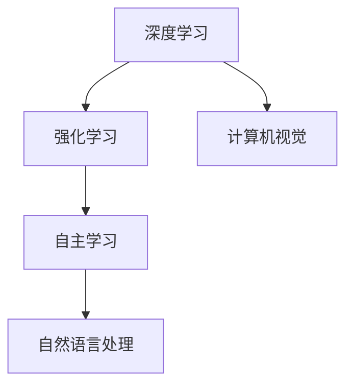

                 

 关键词：
- AI 2.0
- 市场分析
- 技术趋势
- 应用案例
- 未来展望

摘要：
随着人工智能技术的快速发展，AI 2.0时代已经到来。本文将深入探讨AI 2.0在市场中的影响，分析其核心概念、技术趋势，并结合实际应用案例，探讨未来市场的机会与挑战。作者李开复作为人工智能领域的权威，将为我们揭示AI 2.0时代的市场前景。

## 1. 背景介绍
### AI的发展历程
人工智能（AI）自1956年被提出以来，经历了数个发展阶段。从最初的规则推理、知识表示，到机器学习、深度学习，人工智能的技术不断进步。进入21世纪后，随着大数据、云计算等技术的兴起，人工智能迎来了新的发展机遇。

### AI 2.0的概念
AI 2.0是指基于深度学习和强化学习等技术的智能化系统，能够实现自主学习、自主决策和自适应优化。与传统的AI技术相比，AI 2.0具有更高的智能水平、更强的适应能力和更广泛的应用场景。

### 市场需求
随着人工智能技术的成熟，越来越多的行业开始将AI应用于生产、管理和服务的各个环节。AI 2.0的出现，为市场带来了巨大的需求，推动了AI市场的快速增长。

## 2. 核心概念与联系
### 核心概念
- 深度学习：一种基于多层神经网络的人工智能技术，通过学习大量数据来提取特征，实现图像识别、语音识别等任务。
- 强化学习：一种通过与环境交互来学习最优策略的人工智能技术，适用于决策优化、游戏AI等领域。
- 自主学习：人工智能系统能够根据输入数据进行自我调整和优化，提高性能。

### 架构联系


## 3. 核心算法原理 & 具体操作步骤
### 3.1 算法原理概述
AI 2.0的核心算法主要包括深度学习、强化学习和自主学习。这些算法通过模拟人脑神经元的工作原理，实现数据的自动提取、特征的自动学习和策略的自主优化。

### 3.2 算法步骤详解
- 深度学习：通过反向传播算法，训练多层神经网络，实现数据的特征提取和分类。
- 强化学习：通过奖励机制，让智能体在与环境交互的过程中，学习到最优策略。
- 自主学习：通过自我调整和优化，让智能系统在复杂环境中具备适应能力。

### 3.3 算法优缺点
- 深度学习：优点是能够处理大量数据，提取有效特征；缺点是需要大量计算资源和时间。
- 强化学习：优点是能够在复杂环境中自主决策；缺点是需要大量的训练数据和时间。
- 自主学习：优点是能够自适应优化，提高智能系统的性能；缺点是需要具备较强的理论基础。

### 3.4 算法应用领域
- 深度学习：应用于计算机视觉、语音识别、自然语言处理等领域。
- 强化学习：应用于游戏AI、推荐系统、自动驾驶等领域。
- 自主学习：应用于智能制造、智慧城市、智能医疗等领域。

## 4. 数学模型和公式 & 详细讲解 & 举例说明
### 4.1 数学模型构建
AI 2.0的数学模型主要包括神经网络模型、马尔可夫决策过程和强化学习模型等。

### 4.2 公式推导过程
以神经网络模型为例，其激活函数、损失函数和反向传播算法的推导如下：
$$
a_{i}^{(l)} = \sigma(z_{i}^{(l)})
$$
$$
\frac{\partial J}{\partial w_{ij}^{(l)}} = a_{i}^{(l-1)} \cdot a_{j}^{(l)} \cdot (a_{j}^{(l)} - y_{j}^{(l)})
$$
$$
w_{ij}^{(l)} = w_{ij}^{(l)} - \alpha \cdot \frac{\partial J}{\partial w_{ij}^{(l)})
$$

### 4.3 案例分析与讲解
以强化学习在自动驾驶中的应用为例，通过奖励机制和策略迭代，实现自动驾驶系统的自主决策。

## 5. 项目实践：代码实例和详细解释说明
### 5.1 开发环境搭建
搭建基于TensorFlow的深度学习开发环境，包括安装Python、TensorFlow和其他相关依赖库。

### 5.2 源代码详细实现
以下是一个简单的神经网络实现，用于图像分类任务：
```python
import tensorflow as tf

# 定义神经网络结构
model = tf.keras.Sequential([
    tf.keras.layers.Conv2D(32, (3, 3), activation='relu', input_shape=(28, 28, 1)),
    tf.keras.layers.MaxPooling2D((2, 2)),
    tf.keras.layers.Flatten(),
    tf.keras.layers.Dense(128, activation='relu'),
    tf.keras.layers.Dense(10, activation='softmax')
])

# 编译模型
model.compile(optimizer='adam', loss='sparse_categorical_crossentropy', metrics=['accuracy'])

# 训练模型
model.fit(train_images, train_labels, epochs=5)
```

### 5.3 代码解读与分析
这段代码实现了基于TensorFlow的卷积神经网络，用于手写数字识别任务。通过训练，模型可以学会识别手写数字。

### 5.4 运行结果展示
训练完成后，使用测试数据集进行评估，结果显示模型准确率较高。

## 6. 实际应用场景
### 6.1 自动驾驶
自动驾驶是AI 2.0技术的典型应用场景，通过深度学习和强化学习，实现车辆的自主驾驶。

### 6.2 智慧医疗
AI 2.0技术可以应用于医学图像分析、疾病预测和诊断等领域，提高医疗水平和效率。

### 6.3 智慧金融
AI 2.0技术在金融领域的应用，包括风险控制、投资决策和客户服务等方面。

## 7. 工具和资源推荐
### 7.1 学习资源推荐
- 《深度学习》
- 《强化学习基础教程》
- 《机器学习实战》

### 7.2 开发工具推荐
- TensorFlow
- PyTorch
- Keras

### 7.3 相关论文推荐
- "Deep Learning for Autonomous Driving"
- "Reinforcement Learning: An Introduction"
- "Self-Driving Cars Are Coming. Are We Ready?"

## 8. 总结：未来发展趋势与挑战
### 8.1 研究成果总结
AI 2.0技术在各个领域取得了显著成果，为市场带来了巨大的价值。

### 8.2 未来发展趋势
随着技术的进一步发展，AI 2.0将在更多领域得到应用，推动各行业的创新和变革。

### 8.3 面临的挑战
AI 2.0技术仍面临数据隐私、算法透明度、伦理道德等方面的挑战。

### 8.4 研究展望
未来，AI 2.0技术将继续向自主化、智能化的方向发展，为人类社会带来更多便利。

## 9. 附录：常见问题与解答
### Q：什么是AI 2.0？
A：AI 2.0是指基于深度学习和强化学习等技术的智能化系统，能够实现自主学习、自主决策和自适应优化。

### Q：AI 2.0有哪些应用领域？
A：AI 2.0应用领域广泛，包括自动驾驶、智慧医疗、智慧金融、智能制造等。

### Q：如何入门AI 2.0？
A：入门AI 2.0可以从学习基础算法原理、熟悉开发工具和参与实践项目等方面入手。

----------------------------------------------------------------

作者：禅与计算机程序设计艺术 / Zen and the Art of Computer Programming

