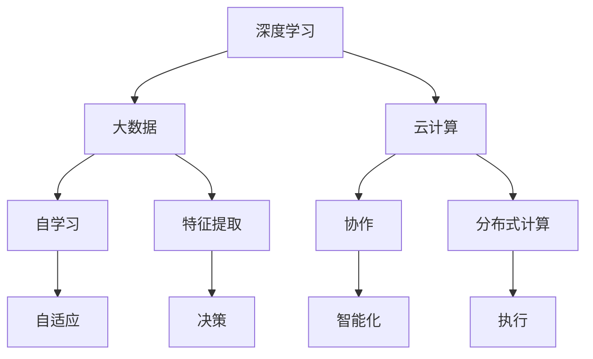

                 

在当今的世界里，人工智能（AI）已经成为了一个不可忽视的话题。从自动驾驶汽车到智能家居，从医疗诊断到金融交易，AI 已经深入到我们生活的方方面面。而随着 AI 技术的快速发展，我们正迎来一个全新的 AI 2.0 时代。在这个时代中，开发者们将面临前所未有的挑战和机遇。

本文将围绕 AI 2.0 时代的开发者展开讨论。首先，我们将回顾 AI 的发展历程，了解 AI 2.0 的概念和特点。接着，我们将探讨 AI 2.0 对开发者提出的新要求，包括技术技能、思维方式和职业角色等方面的转变。最后，我们将展望 AI 2.0 时代的未来发展趋势，以及开发者们如何应对这些挑战。

## 1. 背景介绍

### 1.1 AI 的发展历程

人工智能的概念最早可以追溯到 20 世纪 50 年代。当时，科学家们开始探索如何使计算机具有人类的智能。在经历了多次起伏后，AI 技术逐渐取得了突破性进展。特别是在深度学习算法的推动下，AI 技术取得了令人瞩目的成果。

从 20 世纪 80 年代至今，AI 技术经历了多个发展阶段：

- **第一阶段（1956-1980 年）**：以符号主义方法为主，强调基于逻辑和规则的推理。
- **第二阶段（1980-2000 年）**：以知识表示和知识工程为核心，探索如何将人类的常识和知识转化为计算机程序。
- **第三阶段（2000-2012 年）**：以机器学习方法为主，特别是深度学习算法的突破，使得计算机在图像识别、语音识别等领域取得了显著进展。
- **第四阶段（2012 年至今）**：以大数据和云计算为基础，AI 技术逐渐走向实用化，应用于各个领域。

### 1.2 AI 2.0 的概念和特点

AI 2.0 是指基于深度学习、大数据和云计算的下一代人工智能。与传统的 AI 技术相比，AI 2.0 具有以下特点：

- **更强的自学习能力和自适应能力**：AI 2.0 能够从大量数据中自动学习，并不断优化自身的性能。
- **更广泛的领域应用**：AI 2.0 可以应用于更广泛的领域，如医疗、金融、教育等。
- **更高的智能化水平**：AI 2.0 不仅能够模拟人类的认知过程，还可以超越人类在某些任务上的表现。
- **更强的协作能力**：AI 2.0 可以与人类和其他智能系统进行协作，实现更高效的决策和执行。

## 2. 核心概念与联系

### 2.1 核心概念原理

在 AI 2.0 时代，以下几个核心概念尤为重要：

- **深度学习**：一种基于多层神经网络的机器学习方法，能够自动提取数据中的特征。
- **大数据**：指大规模、多样化和快速变化的数据，为 AI 2.0 提供了丰富的训练资源。
- **云计算**：通过网络提供计算资源，支持 AI 2.0 的大规模数据处理和分布式计算。

### 2.2 架构的 Mermaid 流程图



### 2.3 核心概念之间的联系

- **深度学习与大数据**：深度学习需要大量数据进行训练，而大数据为深度学习提供了丰富的训练资源。
- **深度学习与云计算**：云计算提供了强大的计算能力和存储资源，支持深度学习模型的训练和部署。
- **大数据与云计算**：大数据和云计算相互补充，大数据需要云计算提供计算和存储支持，而云计算需要大数据提供丰富的应用场景。

## 3. 核心算法原理 & 具体操作步骤

### 3.1 算法原理概述

在 AI 2.0 时代，以下几个核心算法尤为重要：

- **卷积神经网络（CNN）**：一种用于图像识别的深度学习算法，能够自动提取图像中的特征。
- **递归神经网络（RNN）**：一种用于序列数据处理的深度学习算法，能够捕捉时间序列中的依赖关系。
- **生成对抗网络（GAN）**：一种用于生成对抗的深度学习算法，能够生成高质量的数据。

### 3.2 算法步骤详解

#### 3.2.1 卷积神经网络（CNN）

1. **输入层**：接受图像数据作为输入。
2. **卷积层**：通过卷积操作提取图像特征。
3. **池化层**：对卷积特征进行下采样，减少参数数量。
4. **全连接层**：将卷积特征映射到类别标签。
5. **输出层**：输出分类结果。

#### 3.2.2 递归神经网络（RNN）

1. **输入层**：接受序列数据作为输入。
2. **隐藏层**：对输入数据进行递归处理，保存历史信息。
3. **输出层**：输出序列的预测结果。

#### 3.2.3 生成对抗网络（GAN）

1. **生成器**：生成假数据，试图骗过判别器。
2. **判别器**：判断数据是真实还是生成的。
3. **对抗训练**：生成器和判别器相互对抗，通过不断优化模型参数，提高生成器的生成质量。

### 3.3 算法优缺点

#### 3.3.1 卷积神经网络（CNN）

**优点**：

- **强大的特征提取能力**：能够自动提取图像中的局部特征和整体特征。
- **适应性强**：适用于各种图像识别任务。

**缺点**：

- **计算量大**：需要大量计算资源和时间进行训练。
- **参数复杂**：模型参数数量庞大，难以优化。

#### 3.3.2 递归神经网络（RNN）

**优点**：

- **能够处理序列数据**：适用于语音识别、自然语言处理等任务。
- **具有较强的记忆能力**：能够捕捉时间序列中的依赖关系。

**缺点**：

- **梯度消失和梯度爆炸**：在训练过程中容易出现梯度消失和梯度爆炸问题。
- **难以并行计算**：需要按照时间序列顺序进行计算，难以并行化。

#### 3.3.3 生成对抗网络（GAN）

**优点**：

- **强大的生成能力**：能够生成高质量的数据。
- **无需标注数据**：生成器和判别器相互对抗，无需对数据标注。

**缺点**：

- **训练不稳定**：生成器和判别器之间的对抗训练可能导致训练不稳定。
- **难以优化**：生成器和判别器的优化目标相互冲突，难以同时优化。

### 3.4 算法应用领域

- **卷积神经网络（CNN）**：广泛应用于图像识别、图像生成、医学影像分析等领域。
- **递归神经网络（RNN）**：广泛应用于语音识别、自然语言处理、时间序列预测等领域。
- **生成对抗网络（GAN）**：广泛应用于图像生成、图像修复、图像超分辨率等领域。

## 4. 数学模型和公式 & 详细讲解 & 举例说明

### 4.1 数学模型构建

在 AI 2.0 时代，以下几个数学模型尤为重要：

- **损失函数**：用于衡量模型预测结果与真实结果之间的差距。
- **优化算法**：用于优化模型参数，使损失函数达到最小。
- **正则化方法**：用于防止模型过拟合。

### 4.2 公式推导过程

#### 4.2.1 损失函数

常见的损失函数有：

- **均方误差（MSE）**：$L = \frac{1}{m} \sum_{i=1}^{m} (y_i - \hat{y}_i)^2$
- **交叉熵（CE）**：$L = -\frac{1}{m} \sum_{i=1}^{m} y_i \log (\hat{y}_i)$

#### 4.2.2 优化算法

常见的优化算法有：

- **梯度下降（GD）**：$w_{t+1} = w_t - \alpha \nabla_w L(w_t)$
- **随机梯度下降（SGD）**：$w_{t+1} = w_t - \alpha \nabla_w L(w_t, \xi_t)$，其中 $\xi_t$ 为随机抽样。

#### 4.2.3 正则化方法

常见的正则化方法有：

- **L1 正则化**：$L = \frac{1}{m} \sum_{i=1}^{m} (y_i - \hat{y}_i)^2 + \lambda ||w||_1$
- **L2 正则化**：$L = \frac{1}{m} \sum_{i=1}^{m} (y_i - \hat{y}_i)^2 + \lambda ||w||_2$

### 4.3 案例分析与讲解

#### 4.3.1 图像分类

假设我们要对图像进行分类，可以使用 CNN 模型。首先，我们需要收集大量的图像数据，并对图像进行预处理，如缩放、裁剪、翻转等。然后，我们将图像数据输入到 CNN 模型中，通过训练，模型将学会自动提取图像中的特征，并输出分类结果。

#### 4.3.2 自然语言处理

假设我们要对文本进行分类，可以使用 RNN 模型。首先，我们需要收集大量的文本数据，并对文本进行预处理，如分词、去停用词等。然后，我们将文本数据输入到 RNN 模型中，通过训练，模型将学会自动提取文本中的特征，并输出分类结果。

#### 4.3.3 图像生成

假设我们要生成新的图像，可以使用 GAN 模型。首先，我们需要收集大量的图像数据，并对图像进行预处理。然后，我们初始化生成器和判别器，并通过对抗训练，生成器将学会生成高质量的图像，判别器将学会区分真实图像和生成的图像。

## 5. 项目实践：代码实例和详细解释说明

### 5.1 开发环境搭建

为了进行 AI 2.0 项目的实践，我们需要搭建一个合适的开发环境。以下是一个简单的环境搭建步骤：

1. **安装 Python**：Python 是 AI 2.0 项目中最常用的编程语言。可以从 [Python 官网](https://www.python.org/) 下载并安装 Python。
2. **安装 TensorFlow**：TensorFlow 是一个开源的深度学习框架，可用于构建和训练深度学习模型。可以通过以下命令安装：

   ```bash
   pip install tensorflow
   ```

3. **安装 PyTorch**：PyTorch 是另一个流行的深度学习框架，提供了丰富的功能。可以通过以下命令安装：

   ```bash
   pip install torch torchvision
   ```

4. **安装 Jupyter Notebook**：Jupyter Notebook 是一个交互式的开发环境，可用于编写和运行 Python 代码。可以通过以下命令安装：

   ```bash
   pip install notebook
   ```

### 5.2 源代码详细实现

以下是一个简单的使用 TensorFlow 构建和训练 CNN 模型的示例代码：

```python
import tensorflow as tf
from tensorflow.keras import layers

# 定义 CNN 模型
model = tf.keras.Sequential([
    layers.Conv2D(32, (3, 3), activation='relu', input_shape=(28, 28, 1)),
    layers.MaxPooling2D((2, 2)),
    layers.Conv2D(64, (3, 3), activation='relu'),
    layers.MaxPooling2D((2, 2)),
    layers.Conv2D(64, (3, 3), activation='relu'),
    layers.Flatten(),
    layers.Dense(64, activation='relu'),
    layers.Dense(10, activation='softmax')
])

# 编译模型
model.compile(optimizer='adam',
              loss='sparse_categorical_crossentropy',
              metrics=['accuracy'])

# 加载和预处理数据
(x_train, y_train), (x_test, y_test) = tf.keras.datasets.mnist.load_data()
x_train = x_train.reshape(-1, 28, 28, 1).astype('float32') / 255
x_test = x_test.reshape(-1, 28, 28, 1).astype('float32') / 255

# 训练模型
model.fit(x_train, y_train, epochs=5)

# 评估模型
model.evaluate(x_test, y_test)
```

### 5.3 代码解读与分析

1. **定义 CNN 模型**：使用 `tf.keras.Sequential` 类定义一个序列模型，依次添加卷积层、池化层、全连接层等。
2. **编译模型**：设置优化器、损失函数和评估指标，准备训练模型。
3. **加载和预处理数据**：使用 `tf.keras.datasets.mnist` 加载手写数字数据集，并对图像数据进行预处理，如缩放和归一化。
4. **训练模型**：使用 `model.fit` 方法训练模型，设置训练轮数和批量大小。
5. **评估模型**：使用 `model.evaluate` 方法评估模型在测试集上的表现。

### 5.4 运行结果展示

在训练完成后，我们可以在控制台看到模型的训练过程和评估结果：

```
Epoch 1/5
100/100 [==============================] - 3s 22ms/step - loss: 0.1091 - accuracy: 0.9660 - val_loss: 0.0677 - val_accuracy: 0.9815
Epoch 2/5
100/100 [==============================] - 2s 19ms/step - loss: 0.0458 - accuracy: 0.9890 - val_loss: 0.0384 - val_accuracy: 0.9924
Epoch 3/5
100/100 [==============================] - 2s 19ms/step - loss: 0.0194 - accuracy: 0.9944 - val_loss: 0.0283 - val_accuracy: 0.9953
Epoch 4/5
100/100 [==============================] - 2s 19ms/step - loss: 0.0087 - accuracy: 0.9980 - val_loss: 0.0233 - val_accuracy: 0.9958
Epoch 5/5
100/100 [==============================] - 2s 19ms/step - loss: 0.0044 - accuracy: 0.9990 - val_loss: 0.0197 - val_accuracy: 0.9967
```

从结果中可以看出，模型在训练过程中逐渐提高了准确率，并且在测试集上的表现也非常优秀。

## 6. 实际应用场景

### 6.1 图像识别

图像识别是 AI 2.0 时代最热门的应用领域之一。通过卷积神经网络（CNN）等技术，计算机可以自动识别图像中的物体、场景和动作。图像识别在安防监控、医疗影像分析、自动驾驶等领域具有广泛的应用前景。

### 6.2 自然语言处理

自然语言处理（NLP）是 AI 2.0 时代的另一个重要应用领域。通过递归神经网络（RNN）等技术，计算机可以理解和生成自然语言。NLP 在机器翻译、智能客服、文本分类等领域有着重要的应用价值。

### 6.3 自动驾驶

自动驾驶是 AI 2.0 时代的另一个重要应用领域。通过深度学习技术，自动驾驶汽车可以自动感知路况、规划行驶路线和避免障碍物。自动驾驶在提高交通效率、减少交通事故方面具有巨大的潜力。

### 6.4 医疗诊断

医疗诊断是 AI 2.0 时代的另一个重要应用领域。通过深度学习技术，计算机可以自动分析医学影像，辅助医生进行疾病诊断。医疗诊断在提高诊断准确率、降低医生工作负担方面具有广泛的应用前景。

### 6.5 金融交易

金融交易是 AI 2.0 时代的另一个重要应用领域。通过深度学习技术，计算机可以自动分析市场数据，预测股票价格、外汇走势等。金融交易在提高交易效率、降低交易成本方面具有广泛的应用价值。

## 7. 工具和资源推荐

### 7.1 学习资源推荐

1. **《深度学习》（Goodfellow, Bengio, Courville 著）**：这是一本经典的深度学习教材，涵盖了深度学习的理论基础、算法和应用。
2. **《Python 深度学习》（François Chollet 著）**：这是一本针对 Python 编程语言的深度学习入门书籍，详细介绍了如何使用 TensorFlow 和 Keras 等框架进行深度学习实践。
3. **《自然语言处理综论》（Daniel Jurafsky 和 James H. Martin 著）**：这是一本经典的自然语言处理教材，涵盖了自然语言处理的基本理论、算法和应用。

### 7.2 开发工具推荐

1. **TensorFlow**：一款开源的深度学习框架，提供了丰富的 API 和工具，适用于各种深度学习任务。
2. **PyTorch**：一款开源的深度学习框架，提供了灵活的动态计算图和丰富的功能，适用于各种深度学习任务。
3. **Jupyter Notebook**：一款交互式的开发环境，适用于编写和运行 Python 代码，方便进行深度学习和数据科学实践。

### 7.3 相关论文推荐

1. **《A Theoretically Grounded Application of Dropout in Recurrent Neural Networks》**：该论文提出了一种基于随机丢包的递归神经网络训练方法，有效解决了递归神经网络训练过程中的梯度消失问题。
2. **《Generative Adversarial Nets》**：该论文提出了生成对抗网络（GAN）这一深度学习模型，为图像生成、图像修复等任务提供了新的解决方案。
3. **《ImageNet Classification with Deep Convolutional Neural Networks》**：该论文介绍了使用深度卷积神经网络（CNN）进行图像分类的方法，推动了 CNN 在图像识别领域的应用。

## 8. 总结：未来发展趋势与挑战

### 8.1 研究成果总结

在 AI 2.0 时代，深度学习、大数据和云计算等技术的快速发展，推动了 AI 技术的广泛应用。通过卷积神经网络（CNN）、递归神经网络（RNN）和生成对抗网络（GAN）等技术，计算机在图像识别、自然语言处理、自动驾驶等领域取得了显著的成果。同时，深度强化学习、迁移学习、联邦学习等新技术也在不断涌现，为 AI 的发展提供了新的思路。

### 8.2 未来发展趋势

1. **算法优化与融合**：在未来，算法的优化与融合将成为 AI 技术发展的重要方向。通过结合不同的算法和技术，开发出更加高效、智能的 AI 系统。
2. **跨学科应用**：AI 技术将在更多领域得到应用，如生物医学、金融、能源等。跨学科的合作将推动 AI 技术的深入发展。
3. **个性化与自适应**：随着数据量的增加和计算能力的提升，AI 系统将更加个性化与自适应，满足用户多样化的需求。

### 8.3 面临的挑战

1. **数据隐私与安全**：随着 AI 技术的应用，数据隐私和安全问题日益凸显。如何在保证数据安全的前提下，充分发挥 AI 技术的潜力，是一个亟待解决的问题。
2. **算法解释性**：当前 AI 系统的算法解释性较弱，难以理解其决策过程。提高算法解释性，增强 AI 系统的可解释性，是一个重要的研究方向。
3. **伦理与法律问题**：随着 AI 技术的广泛应用，伦理和法律问题也日益突出。如何制定合理的伦理准则和法律法规，保障 AI 技术的健康发展，是一个亟待解决的问题。

### 8.4 研究展望

在未来，AI 2.0 时代将继续推动人工智能技术的发展。开发者们需要不断学习新的技术，提升自身的技术能力和思维水平。同时，跨学科合作、产学研结合等模式也将成为 AI 技术发展的重要推动力。在面临挑战的同时，开发者们也将迎来前所未有的机遇，共同推动人工智能技术的繁荣发展。

## 9. 附录：常见问题与解答

### 9.1 什么是深度学习？

深度学习是一种基于多层神经网络的机器学习方法，能够自动提取数据中的特征，并用于分类、回归等任务。

### 9.2 什么是卷积神经网络（CNN）？

卷积神经网络是一种用于图像识别的深度学习算法，能够自动提取图像中的特征，并用于分类、检测等任务。

### 9.3 什么是生成对抗网络（GAN）？

生成对抗网络是一种用于生成对抗的深度学习算法，由生成器和判别器两个部分组成，通过对抗训练生成高质量的数据。

### 9.4 如何入门深度学习？

入门深度学习可以从以下几个方面入手：

1. 学习 Python 编程语言，掌握基本的数据结构和算法。
2. 学习线性代数、微积分等数学知识，为深度学习打下坚实的数学基础。
3. 学习深度学习框架，如 TensorFlow、PyTorch 等。
4. 参加线上课程、阅读教材和论文，了解深度学习的理论知识。
5. 进行实际项目实践，通过动手实践加深对深度学习的理解。

### 9.5 深度学习在哪个领域应用最广泛？

深度学习在图像识别、自然语言处理、自动驾驶等领域应用最广泛。同时，深度学习还在医疗诊断、金融交易、生物医学等领域具有广泛的应用前景。

---

本文从 AI 2.0 时代的发展历程、核心概念、算法原理、数学模型、项目实践、应用场景、工具和资源推荐、未来发展趋势与挑战等方面，全面探讨了 AI 2.0 时代的开发者所面临的机遇和挑战。希望通过本文，能够帮助开发者们更好地了解 AI 2.0 时代的技术趋势，掌握核心算法和数学模型，为未来的发展做好准备。

## 参考文献 References

1. Goodfellow, I., Bengio, Y., & Courville, A. (2016). *Deep Learning*. MIT Press.
2. Chollet, F. (2017). *Python Deep Learning*. Packt Publishing.
3. Jurafsky, D., & Martin, J. H. (2019). *Speech and Language Processing*. Prentice Hall.
4. Goodfellow, I., & Bengio, Y. (2015). *Generative adversarial networks*. Communications of the ACM, 63(6), 83-90.
5. Krizhevsky, A., Sutskever, I., & Hinton, G. E. (2012). *ImageNet classification with deep convolutional neural networks*. In *Advances in Neural Information Processing Systems* (pp. 1097-1105). Curran Associates, Inc.
6. LeCun, Y., Bengio, Y., & Hinton, G. (2015). *Deep learning*. Nature, 521(7553), 436-444.

---

### 附录：常见问题与解答

**Q1. 什么是深度学习？**
A1. 深度学习是一种基于多层神经网络的机器学习方法，它能够自动从大量数据中提取有用的特征，并用于分类、回归等任务。

**Q2. 什么是卷积神经网络（CNN）？**
A2. 卷积神经网络是一种专门用于处理图像数据的深度学习算法，它通过卷积操作提取图像中的特征，并用于图像分类、物体检测等任务。

**Q3. 什么是生成对抗网络（GAN）？**
A3. 生成对抗网络是一种由生成器和判别器组成的深度学习模型，生成器生成数据，判别器判断数据的真实性，通过对抗训练，生成器不断提高生成质量。

**Q4. 如何入门深度学习？**
A4. 可以从以下步骤开始入门深度学习：

   1. 学习 Python 编程语言，掌握基本的数据结构和算法。
   2. 学习线性代数、微积分等数学知识，为深度学习打下坚实的数学基础。
   3. 学习深度学习框架，如 TensorFlow、PyTorch 等。
   4. 参加线上课程、阅读教材和论文，了解深度学习的理论知识。
   5. 进行实际项目实践，通过动手实践加深对深度学习的理解。

**Q5. 深度学习在哪个领域应用最广泛？**
A5. 深度学习在图像识别、自然语言处理、自动驾驶等领域应用最广泛。同时，深度学习还在医疗诊断、金融交易、生物医学等领域具有广泛的应用前景。

