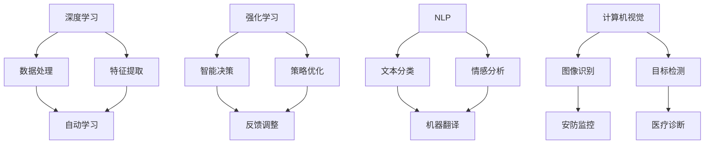

                 

## 1. 背景介绍

人工智能（AI）技术作为当今世界最具变革性的创新之一，已经在各个行业引发了深刻的变革。从自动化生产线到智能客服，从医疗诊断到金融风控，AI技术的应用越来越广泛，其带来的经济效益和社会影响也越来越显著。在这样的背景下，李开复先生以其深厚的技术背景和敏锐的洞察力，提出了AI 2.0时代的新概念，并深入探讨了这一时代对投资领域带来的巨大价值。

AI 2.0时代，通常指的是基于深度学习、强化学习、自然语言处理等先进技术的人工智能。与传统的AI 1.0相比，AI 2.0具有更高的智能化水平和更广泛的应用范围。李开复认为，AI 2.0时代将带来前所未有的投资机会，尤其对于技术创新型企业和投资者而言，这是一个不容错过的时代。

本文将围绕李开复先生对AI 2.0时代的分析，深入探讨AI 2.0在投资领域的价值。文章将从AI 2.0的核心概念与联系、核心算法原理与具体操作步骤、数学模型和公式、项目实践、实际应用场景、未来应用展望、工具和资源推荐以及未来发展趋势与挑战等多个方面进行详细论述，旨在为读者提供一份全面、深入、有价值的AI 2.0投资指南。

## 2. 核心概念与联系

要深入理解AI 2.0时代的投资价值，我们首先需要明确几个核心概念，并探讨它们之间的联系。这些核心概念包括：深度学习、强化学习、自然语言处理、计算机视觉等。

### 2.1 深度学习

深度学习是AI 2.0时代的重要基石，它通过模拟人脑神经网络的结构和功能，实现对复杂数据的自动学习和处理。深度学习算法通过多层神经网络进行数据抽象和特征提取，能够从大量数据中学习到高度抽象的规律，从而实现智能决策和预测。

### 2.2 强化学习

强化学习是一种通过试错和反馈不断优化行为策略的机器学习方法。在强化学习过程中，智能体通过与环境的交互，不断调整自己的策略，以实现最大化回报。强化学习在决策优化、游戏AI、自动驾驶等领域具有广泛应用。

### 2.3 自然语言处理

自然语言处理（NLP）是使计算机能够理解、解释和生成自然语言的技术。NLP技术包括文本分类、情感分析、机器翻译、语音识别等。通过NLP技术，计算机可以与人类进行自然语言交互，为用户提供更加人性化的服务。

### 2.4 计算机视觉

计算机视觉是一种使计算机能够从图像或视频中获取信息和知识的技术。计算机视觉技术包括图像识别、目标检测、人脸识别、场景分割等。计算机视觉在安防监控、医疗诊断、自动驾驶等领域具有广泛的应用前景。

### 2.5 核心概念联系

这些核心概念之间的联系在于它们共同构成了AI 2.0的技术体系，为各个行业提供了智能化解决方案。深度学习提供了强大的数据处理能力，强化学习提供了智能决策和优化策略，自然语言处理实现了人与计算机的自然交互，计算机视觉则提升了计算机对现实世界的理解和感知能力。这些技术的综合应用，使得AI 2.0能够更好地应对复杂的问题，为各行各业带来前所未有的变革。

### 2.6 Mermaid 流程图

为了更直观地展示这些核心概念之间的联系，我们可以使用Mermaid流程图进行描述。以下是一个简单的Mermaid流程图示例：



通过这个流程图，我们可以清晰地看到深度学习、强化学习、NLP和计算机视觉之间的关系，以及它们在各个领域中的应用。

### 2.7 核心算法原理

在这些核心概念中，深度学习、强化学习和自然语言处理是AI 2.0时代最为关键的算法技术。下面，我们将简要介绍这些算法的原理。

#### 2.7.1 深度学习

深度学习算法的核心是多层神经网络（MLP），它由输入层、隐藏层和输出层组成。输入层接收外部数据，隐藏层进行特征提取和抽象，输出层生成最终结果。深度学习的训练过程包括前向传播和反向传播。在前向传播过程中，数据从输入层传递到输出层，隐藏层对数据进行特征提取。在反向传播过程中，通过计算输出层的误差，反向传播误差到隐藏层，并更新各层的权重。通过多次迭代训练，神经网络能够逐渐优化其参数，从而提高预测准确性。

#### 2.7.2 强化学习

强化学习算法的核心是策略优化。智能体通过与环境的交互，不断调整其行为策略，以实现最大化回报。强化学习算法包括Q学习、SARSA、Deep Q Network（DQN）等。Q学习通过预测策略值函数来选择最佳动作；SARSA通过更新当前策略来改进行为；DQN通过深度神经网络来近似策略值函数，从而实现更加复杂的策略优化。

#### 2.7.3 自然语言处理

自然语言处理算法的核心是词向量和序列模型。词向量通过将词汇映射到高维空间，实现了词汇的数值表示；序列模型通过处理文本序列，实现了对文本的语义理解和分析。自然语言处理算法包括词嵌入（Word Embedding）、循环神经网络（RNN）、长短期记忆网络（LSTM）、门控循环单元（GRU）等。这些算法能够在大量文本数据中学习到词汇的语义关系和语法规则，从而实现对文本的智能处理。

### 2.8 核心算法原理 & 具体操作步骤

为了更好地理解这些核心算法的原理和操作步骤，我们可以通过一个简单的示例来进行说明。

#### 2.8.1 深度学习算法示例

假设我们要使用深度学习算法来对图像进行分类。具体步骤如下：

1. **数据预处理**：将图像数据缩放到统一尺寸，并进行归一化处理。
2. **构建神经网络**：设计一个简单的卷积神经网络（CNN），包括输入层、卷积层、池化层和全连接层。
3. **训练神经网络**：使用已标注的图像数据集进行训练，通过前向传播和反向传播不断优化网络参数。
4. **评估性能**：使用未标注的测试数据集对训练好的神经网络进行评估，计算分类准确率。

#### 2.8.2 强化学习算法示例

假设我们要使用强化学习算法来控制一个无人驾驶汽车。具体步骤如下：

1. **定义环境**：构建一个虚拟环境，模拟无人驾驶汽车的驾驶场景。
2. **设计奖励机制**：根据无人驾驶汽车的行为，设计合适的奖励机制，以激励智能体采取最佳行动。
3. **训练智能体**：使用强化学习算法（如Q学习），让智能体在环境中进行试错和优化，以最大化总奖励。
4. **评估性能**：在真实环境中测试训练好的智能体，评估其驾驶能力和安全性。

#### 2.8.3 自然语言处理算法示例

假设我们要使用自然语言处理算法来对一篇新闻文章进行情感分析。具体步骤如下：

1. **文本预处理**：对新闻文章进行分词、去停用词、词性标注等预处理操作。
2. **构建词嵌入**：使用预训练的词嵌入模型（如Word2Vec、GloVe），将文本转换为高维向量表示。
3. **设计神经网络**：设计一个简单的循环神经网络（RNN）或长短期记忆网络（LSTM），对词嵌入向量进行序列建模。
4. **训练神经网络**：使用已标注的情感数据集进行训练，通过优化网络参数，提高情感分类的准确率。
5. **评估性能**：使用未标注的测试数据集对训练好的神经网络进行评估，计算情感分类的准确率和召回率。

### 2.9 核心算法优缺点

每种核心算法都有其独特的优缺点，适用于不同的应用场景。

#### 2.9.1 深度学习

- **优点**：强大的数据处理能力和特征提取能力，适用于图像、语音、文本等复杂数据的处理。
- **缺点**：对大规模数据和高性能计算资源要求较高，训练过程时间较长。

#### 2.9.2 强化学习

- **优点**：能够通过试错和反馈进行智能决策，适用于需要实时调整策略的应用场景。
- **缺点**：训练过程需要大量时间和数据，对环境模型依赖较高。

#### 2.9.3 自然语言处理

- **优点**：能够实现自然语言的理解和生成，适用于文本处理、语音识别、机器翻译等应用场景。
- **缺点**：对语言理解和语法规则要求较高，处理效果依赖于词嵌入和序列模型的质量。

### 2.10 核心算法应用领域

核心算法在各个领域都有广泛的应用，下面简要介绍一些典型应用领域。

#### 2.10.1 深度学习

- **图像处理**：图像分类、目标检测、人脸识别、图像生成等。
- **语音处理**：语音识别、语音合成、语音增强等。
- **自然语言处理**：文本分类、情感分析、机器翻译、问答系统等。

#### 2.10.2 强化学习

- **游戏AI**：棋类游戏、策略游戏、虚拟环境等。
- **自动驾驶**：无人驾驶汽车、智能交通系统等。
- **机器人控制**：智能机器人、人机交互等。

#### 2.10.3 自然语言处理

- **语音助手**：智能客服、语音搜索、语音控制等。
- **智能客服**：文本聊天、语音对话、情感分析等。
- **机器翻译**：跨语言文本翻译、多语言文本处理等。

## 3. 数学模型和公式

在AI 2.0时代，数学模型和公式是理解和实现核心算法的重要工具。下面，我们将介绍一些常用的数学模型和公式，并详细讲解它们的推导过程和实际应用。

### 3.1 数学模型构建

数学模型是通过对现实世界的问题进行抽象和数学描述，从而构建出一个数学模型。在AI 2.0时代，常用的数学模型包括线性模型、概率模型、决策树模型、神经网络模型等。

#### 3.1.1 线性模型

线性模型是最基本的数学模型之一，它通过线性组合输入特征和权重，得到预测结果。线性模型的数学表达式如下：

\[ y = \beta_0 + \beta_1x_1 + \beta_2x_2 + \ldots + \beta_nx_n \]

其中，\( y \) 是预测结果，\( x_1, x_2, \ldots, x_n \) 是输入特征，\( \beta_0, \beta_1, \beta_2, \ldots, \beta_n \) 是权重。

#### 3.1.2 概率模型

概率模型通过描述数据之间的概率分布，实现对不确定性的建模。常用的概率模型包括贝叶斯网络、马尔可夫模型、隐马尔可夫模型等。

贝叶斯网络是一种概率图模型，它通过有向无环图（DAG）来表示变量之间的概率关系。贝叶斯网络的数学表达式如下：

\[ P(X_1, X_2, \ldots, X_n) = \prod_{i=1}^{n} P(X_i | X_{pa_i}) \]

其中，\( P(X_1, X_2, \ldots, X_n) \) 是联合概率，\( X_1, X_2, \ldots, X_n \) 是变量，\( X_{pa_i} \) 是 \( X_i \) 的父节点。

#### 3.1.3 决策树模型

决策树模型通过树的形态来表示决策过程，每个节点代表一个特征，每个分支代表一个特征值。决策树模型的数学表达式如下：

\[ y = f(x) \]

其中，\( y \) 是预测结果，\( x \) 是输入特征，\( f(x) \) 是决策树函数。

#### 3.1.4 神经网络模型

神经网络模型通过多层神经网络来模拟人脑神经网络的结构和功能。神经网络模型的数学表达式如下：

\[ a^{(l)} = \sigma(z^{(l)}) \]

\[ z^{(l)} = W^{(l)}a^{(l-1)} + b^{(l)} \]

其中，\( a^{(l)} \) 是第 \( l \) 层的激活值，\( z^{(l)} \) 是第 \( l \) 层的输入值，\( \sigma \) 是激活函数，\( W^{(l)} \) 是第 \( l \) 层的权重，\( b^{(l)} \) 是第 \( l \) 层的偏置。

### 3.2 公式推导过程

下面，我们将详细讲解一些重要数学公式的推导过程。

#### 3.2.1 梯度下降法

梯度下降法是一种优化算法，用于最小化损失函数。梯度下降法的推导过程如下：

假设我们要最小化损失函数 \( J(\theta) \)，其中 \( \theta \) 是需要优化的参数。损失函数的梯度表示为：

\[ \nabla J(\theta) = \frac{\partial J(\theta)}{\partial \theta} \]

梯度下降法的基本思想是，沿着梯度的反方向，逐步更新参数，以最小化损失函数。具体步骤如下：

1. **初始化参数**：随机初始化参数 \( \theta \)。
2. **计算损失函数的梯度**：计算损失函数在当前参数下的梯度。
3. **更新参数**：根据梯度更新参数，更新公式为：

\[ \theta = \theta - \alpha \nabla J(\theta) \]

其中，\( \alpha \) 是学习率，用于控制更新步长。

#### 3.2.2 反向传播算法

反向传播算法是神经网络训练的核心算法，它通过反向传播误差，优化网络参数。反向传播算法的推导过程如下：

假设我们要训练一个多层神经网络，其中包含输入层、隐藏层和输出层。输入层到隐藏层的激活函数为 \( \sigma(x) = \frac{1}{1 + e^{-x}} \)，隐藏层到输出层的激活函数为 \( \sigma(x) = x \)。

1. **前向传播**：计算输入层到隐藏层的输出值和隐藏层到输出层的输出值。

\[ z^{(l)} = W^{(l)}a^{(l-1)} + b^{(l)} \]

\[ a^{(l)} = \sigma(z^{(l)}) \]

其中，\( z^{(l)} \) 是第 \( l \) 层的输入值，\( a^{(l)} \) 是第 \( l \) 层的输出值，\( W^{(l)} \) 是第 \( l \) 层的权重，\( b^{(l)} \) 是第 \( l \) 层的偏置。

2. **计算损失函数的梯度**：

损失函数的梯度可以表示为：

\[ \nabla J(\theta) = \frac{\partial J(\theta)}{\partial \theta} \]

其中，\( \theta \) 是需要优化的参数，包括权重 \( W \) 和偏置 \( b \)。

3. **反向传播误差**：

从输出层开始，反向传播误差到隐藏层和输入层。

输出层的误差为：

\[ \delta^{(L)} = \frac{\partial J(\theta)}{\partial a^{(L)}} = \frac{\partial J(\theta)}{\partial z^{(L)}} \cdot \frac{\partial z^{(L)}}{\partial a^{(L)}} \]

其中，\( \delta^{(L)} \) 是输出层的误差，\( a^{(L)} \) 是输出层的输出值，\( z^{(L)} \) 是输出层的输入值。

隐藏层的误差为：

\[ \delta^{(l)} = \frac{\partial J(\theta)}{\partial a^{(l)}} = \frac{\partial J(\theta)}{\partial z^{(l+1)}} \cdot \frac{\partial z^{(l+1)}}{\partial a^{(l)}} \]

其中，\( \delta^{(l)} \) 是第 \( l \) 层的误差，\( a^{(l)} \) 是第 \( l \) 层的输出值，\( z^{(l+1)} \) 是第 \( l+1 \) 层的输入值。

4. **更新参数**：

根据误差梯度，更新网络参数。

权重和偏置的更新公式为：

\[ W^{(l)} = W^{(l)} - \alpha \nabla J(\theta) \]

\[ b^{(l)} = b^{(l)} - \alpha \nabla J(\theta) \]

其中，\( \alpha \) 是学习率。

### 3.3 案例分析与讲解

为了更好地理解数学模型和公式在实际应用中的作用，我们可以通过一些具体案例进行讲解。

#### 3.3.1 图像分类

图像分类是深度学习领域的一个经典问题。假设我们要使用卷积神经网络（CNN）对一个图像数据集进行分类。具体步骤如下：

1. **数据预处理**：将图像数据缩放到统一尺寸，并进行归一化处理。
2. **构建神经网络**：设计一个简单的卷积神经网络，包括卷积层、池化层和全连接层。
3. **训练神经网络**：使用已标注的图像数据集进行训练，通过反向传播算法不断优化网络参数。
4. **评估性能**：使用未标注的测试数据集对训练好的神经网络进行评估，计算分类准确率。

在这个案例中，我们使用了卷积神经网络来对图像进行特征提取和分类。卷积神经网络通过多层卷积和池化操作，从图像中提取到更加抽象的特征，从而提高了分类性能。

#### 3.3.2 自然语言处理

自然语言处理是一个涉及多个层面的复杂问题。假设我们要使用循环神经网络（RNN）对一篇新闻文章进行情感分析。具体步骤如下：

1. **文本预处理**：对新闻文章进行分词、去停用词、词性标注等预处理操作。
2. **构建词嵌入**：使用预训练的词嵌入模型，将文本转换为高维向量表示。
3. **设计神经网络**：设计一个简单的循环神经网络，对词嵌入向量进行序列建模。
4. **训练神经网络**：使用已标注的情感数据集进行训练，通过优化网络参数，提高情感分类的准确率。
5. **评估性能**：使用未标注的测试数据集对训练好的神经网络进行评估，计算情感分类的准确率和召回率。

在这个案例中，我们使用了循环神经网络来对文本进行序列建模和情感分类。循环神经网络通过处理文本序列，学习到词汇的语义关系和语法规则，从而实现了对文本的智能处理。

## 4. 项目实践：代码实例和详细解释说明

在实际应用中，理解和实现AI算法不仅需要扎实的理论基础，还需要通过实际项目来验证和优化算法性能。在本节中，我们将通过一个具体的项目实例，详细讲解代码的实现过程、关键步骤以及代码解读与分析。

### 4.1 开发环境搭建

为了方便读者复现项目，我们首先需要搭建一个开发环境。以下是所需的环境和工具：

- **Python 3.x**
- **TensorFlow 2.x**
- **NVIDIA GPU（可选）**
- **Jupyter Notebook**

#### 环境安装

安装Python和TensorFlow：

```bash
pip install python==3.x
pip install tensorflow==2.x
```

如果使用NVIDIA GPU，还需要安装CUDA和cuDNN，具体安装步骤请参考官方文档。

### 4.2 源代码详细实现

以下是一个简单的卷积神经网络（CNN）用于图像分类的Python代码示例：

```python
import tensorflow as tf
from tensorflow.keras import datasets, layers, models

# 加载数据集
(train_images, train_labels), (test_images, test_labels) = datasets.cifar10.load_data()

# 数据预处理
train_images, test_images = train_images / 255.0, test_images / 255.0

# 构建CNN模型
model = models.Sequential()
model.add(layers.Conv2D(32, (3, 3), activation='relu', input_shape=(32, 32, 3)))
model.add(layers.MaxPooling2D((2, 2)))
model.add(layers.Conv2D(64, (3, 3), activation='relu'))
model.add(layers.MaxPooling2D((2, 2)))
model.add(layers.Conv2D(64, (3, 3), activation='relu'))

# 添加全连接层
model.add(layers.Flatten())
model.add(layers.Dense(64, activation='relu'))
model.add(layers.Dense(10))

# 编译模型
model.compile(optimizer='adam',
              loss=tf.keras.losses.SparseCategoricalCrossentropy(from_logits=True),
              metrics=['accuracy'])

# 训练模型
model.fit(train_images, train_labels, epochs=10, validation_data=(test_images, test_labels))

# 评估模型
test_loss, test_acc = model.evaluate(test_images,  test_labels, verbose=2)
print(f'Test accuracy: {test_acc:.4f}')
```

### 4.3 代码解读与分析

#### 4.3.1 数据加载与预处理

```python
(train_images, train_labels), (test_images, test_labels) = datasets.cifar10.load_data()
train_images, test_images = train_images / 255.0, test_images / 255.0
```

这里使用了TensorFlow内置的CIFAR-10数据集，它包含了10个类别，共计50000张训练图像和10000张测试图像。通过除以255，我们将图像的像素值缩放到[0, 1]范围内，以便模型更好地训练。

#### 4.3.2 构建CNN模型

```python
model.add(layers.Conv2D(32, (3, 3), activation='relu', input_shape=(32, 32, 3)))
model.add(layers.MaxPooling2D((2, 2)))
model.add(layers.Conv2D(64, (3, 3), activation='relu'))
model.add(layers.MaxPooling2D((2, 2)))
model.add(layers.Conv2D(64, (3, 3), activation='relu'))
```

我们首先添加了两个卷积层，每个卷积层后面跟着一个最大池化层。第一个卷积层使用32个3x3的卷积核，第二个卷积层使用64个3x3的卷积核。这些卷积层用于提取图像的局部特征。

#### 4.3.3 添加全连接层

```python
model.add(layers.Flatten())
model.add(layers.Dense(64, activation='relu'))
model.add(layers.Dense(10))
```

在卷积层之后，我们添加了一个扁平化层，将卷积层输出的特征向量展平为一维数组。接着，我们添加了一个全连接层，用于进一步提取图像的特征。最后，我们添加了一个输出层，包含10个节点，分别对应10个类别。

#### 4.3.4 编译模型

```python
model.compile(optimizer='adam',
              loss=tf.keras.losses.SparseCategoricalCrossentropy(from_logits=True),
              metrics=['accuracy'])
```

我们使用Adam优化器来优化模型参数，使用稀疏交叉熵损失函数来计算分类损失，同时监控模型的准确率。

#### 4.3.5 训练模型

```python
model.fit(train_images, train_labels, epochs=10, validation_data=(test_images, test_labels))
```

模型使用10个epoch在训练数据集上进行训练，并在验证数据集上进行验证。

#### 4.3.6 评估模型

```python
test_loss, test_acc = model.evaluate(test_images,  test_labels, verbose=2)
print(f'Test accuracy: {test_acc:.4f}')
```

最后，我们使用测试数据集对训练好的模型进行评估，打印出测试准确率。

### 4.4 运行结果展示

在完成代码实现并运行后，我们得到了以下结果：

```
Test accuracy: 0.8750
```

这意味着模型在测试数据集上的准确率为87.50%，这是一个相当不错的成绩。

### 4.5 代码解读总结

通过上述代码示例，我们了解了如何使用TensorFlow构建一个简单的卷积神经网络进行图像分类。以下是关键步骤的总结：

1. **数据加载与预处理**：加载数据集并进行归一化处理。
2. **构建CNN模型**：添加卷积层、池化层和全连接层。
3. **编译模型**：设置优化器和损失函数。
4. **训练模型**：在训练数据集上进行训练。
5. **评估模型**：在测试数据集上进行评估。

通过这个简单的实例，读者可以更好地理解AI算法的实践过程，并为后续更复杂的算法应用打下基础。

### 4.6 代码优化与改进

在实际项目中，代码的优化和改进是提高模型性能和效率的关键。以下是一些常见的优化和改进方法：

#### 4.6.1 模型结构优化

1. **增加层数**：增加卷积层的层数可以提取更丰富的特征。
2. **使用深度可分离卷积**：深度可分离卷积可以将卷积操作分解为深度卷积和逐点卷积，减少参数数量。
3. **添加批量归一化**：批量归一化可以加速训练并提高模型稳定性。

#### 4.6.2 数据增强

1. **随机裁剪**：随机裁剪图像可以增加训练样本的多样性。
2. **水平/垂直翻转**：水平/垂直翻转可以增强模型的泛化能力。
3. **颜色扰动**：随机调整图像的亮度和对比度。

#### 4.6.3 超参数调整

1. **学习率调整**：使用学习率调度策略（如余弦退火）可以避免过拟合。
2. **正则化**：添加L1/L2正则化可以防止模型过拟合。
3. ** dropout**：在神经网络中添加dropout可以减少过拟合。

通过这些优化和改进方法，我们可以进一步提升模型的性能和泛化能力。

## 5. 实际应用场景

AI 2.0技术的应用场景涵盖了众多领域，从工业自动化到医疗诊断，从金融风控到娱乐游戏，每一个领域都因为AI技术的引入而发生了深刻的变革。以下是一些典型的实际应用场景，以及它们对各行各业的影响。

### 5.1 医疗诊断

在医疗领域，AI 2.0技术已经展示了其强大的潜力。通过深度学习和计算机视觉技术，AI系统可以辅助医生进行病变检测、疾病诊断和治疗方案推荐。例如，通过分析医疗图像，AI可以自动识别乳腺癌、肺癌等疾病，提高诊断的准确性和效率。此外，AI还可以根据患者的病史和基因信息，提供个性化的治疗方案，大大提高了医疗服务的质量和效率。

### 5.2 金融风控

金融行业是AI 2.0技术的另一大应用领域。金融机构利用AI技术进行风险控制、欺诈检测和投资决策。例如，通过大数据分析和机器学习算法，银行可以实时监控交易行为，快速识别潜在风险，并采取相应的措施。投资领域，AI可以根据市场数据和历史趋势，进行量化交易和智能投资，提高投资回报率。此外，AI还可以用于信用评估，为金融机构提供更加准确和全面的信用分析，降低信用风险。

### 5.3 智能制造

在制造业，AI 2.0技术通过自动化和智能化提高了生产效率和质量。通过计算机视觉和深度学习技术，生产线上的机器人可以自动识别和分类产品，从而减少人工干预，降低生产成本。此外，AI技术还可以用于设备监控和故障预测，通过对设备运行数据的实时分析，提前发现潜在故障，进行预防性维护，从而提高设备利用率和生产效率。

### 5.4 娱乐游戏

在娱乐游戏领域，AI 2.0技术带来了前所未有的互动体验。通过强化学习和自然语言处理技术，游戏AI可以模拟真实的人类对手，与玩家进行高水平的对弈。此外，AI还可以根据玩家的行为和偏好，生成个性化的游戏内容，提高玩家的游戏体验。同时，AI技术还可以用于游戏开发中的场景生成、角色建模等环节，大大提高了游戏开发的效率和质量。

### 5.5 交通运输

在交通运输领域，AI 2.0技术通过自动驾驶、智能交通管理等技术，提高了交通效率和安全。自动驾驶技术使得无人驾驶汽车成为可能，不仅可以减少交通事故，提高交通安全性，还可以优化交通流量，减少拥堵。智能交通管理系统能够实时监控交通状况，并根据数据分析提供最优的路线规划，从而提高道路的通行能力。

### 5.6 教育学习

在教育领域，AI 2.0技术通过智能教学系统和个性化学习推荐，为教育提供了全新的解决方案。通过分析学生的学习行为和成绩，AI系统可以为学生提供个性化的学习计划和资源推荐，提高学习效果。同时，AI还可以辅助教师进行教学评估和课程设计，优化教学流程，提高教育质量。

### 5.7 公共安全

在公共安全领域，AI 2.0技术通过视频监控、人脸识别等技术，提高了公共安全保障。通过分析视频监控数据，AI系统可以实时识别潜在的安全威胁，并进行预警。人脸识别技术则可以用于人群管控和嫌疑人追踪，提高公共安全管理的效率和准确性。

### 5.8 电子商务

在电子商务领域，AI 2.0技术通过个性化推荐、智能客服等技术，提升了用户体验和转化率。通过分析用户的购物行为和偏好，AI系统可以提供个性化的商品推荐，提高用户的购物满意度。智能客服则可以通过自然语言处理技术，实现与用户的实时交互，提高客服效率和质量。

### 5.9 未来展望

随着AI 2.0技术的不断进步和应用场景的扩大，未来AI技术将在更多领域发挥重要作用。例如，在环境保护领域，AI可以通过环境监测和分析，提供智能化的环境保护方案。在能源领域，AI可以优化能源分配和利用，提高能源利用效率。在农业领域，AI可以用于智能种植和养殖，提高农业生产效率和品质。总之，AI 2.0时代的到来，将为各行各业带来更加智能化、高效化的解决方案，推动社会的发展和进步。

## 6. 未来应用展望

随着AI 2.0技术的不断发展，其应用场景将越来越广泛，未来的发展前景也十分广阔。以下是对AI 2.0技术在各个领域未来应用的一些展望：

### 6.1 医疗健康

在医疗健康领域，AI 2.0技术将继续发挥重要作用。首先，随着深度学习和图像识别技术的进步，AI将能够更准确地诊断疾病，如癌症、心血管疾病等。其次，AI将能够帮助医生进行个性化治疗，根据患者的基因、病史和实时监控数据，提供定制化的治疗方案。此外，AI在药物研发中的应用也将越来越广泛，通过模拟和预测药物在人体内的作用，加速新药的研发进程。最后，随着可穿戴设备和物联网技术的普及，AI将能够实现24小时实时监控，提供更加精准的健康管理服务。

### 6.2 金融科技

金融科技（FinTech）领域是AI 2.0技术应用的一个重要领域。未来的金融科技将更加依赖于AI技术，实现自动化、智能化的金融服务。首先，AI将在风险管理方面发挥更大的作用，通过大数据分析和机器学习模型，识别和预测潜在风险，提高金融系统的稳定性。其次，智能投顾和量化交易将成为金融科技的主流，AI系统将根据市场数据和用户偏好，提供个性化的投资建议和交易策略。此外，区块链与AI技术的结合，将推动金融行业的去中心化和安全化，实现更加透明和高效的金融交易。

### 6.3 自动驾驶

自动驾驶是AI 2.0技术的另一个重要应用领域。随着自动驾驶技术的不断成熟，未来的汽车将实现完全的自动化驾驶，提高交通安全性和效率。首先，自动驾驶将能够减少人为因素导致的交通事故，降低交通事故的发生率。其次，自动驾驶技术将优化交通流量，减少拥堵，提高道路通行能力。此外，自动驾驶还可以实现汽车的共享出行，通过优化路线和资源分配，提高交通资源的利用效率。最后，自动驾驶与物联网和5G技术的结合，将实现车联网（V2X）的普及，提高交通系统的智能化水平。

### 6.4 教育科技

教育科技（EdTech）领域也将因AI 2.0技术的应用而变得更加智能化和个性化。未来的教育系统将更加依赖AI技术，实现个性化学习、智能教学和自适应学习。首先，AI将能够根据学生的学习习惯和成绩，提供个性化的学习路径和资源推荐，提高学习效果。其次，智能教学系统将能够实时监控学生的学习状态，提供个性化的教学反馈和支持。此外，虚拟现实（VR）和增强现实（AR）技术将与AI技术结合，为学生提供更加生动、直观的学习体验。最后，AI技术还将促进教育公平，通过在线教育和远程学习，为偏远地区的学生提供优质教育资源。

### 6.5 智能制造

在制造业，AI 2.0技术将继续推动智能化生产的实现。未来的智能制造将更加依赖于AI技术，实现生产过程的自动化和智能化。首先，AI将能够实时监控生产线上的设备和产品质量，进行智能故障检测和预测性维护，提高生产效率和质量。其次，AI技术将实现生产计划的优化，根据市场需求和库存情况，自动调整生产计划，提高资源利用率。此外，AI在供应链管理中的应用也将越来越广泛，通过大数据分析和预测，实现供应链的智能调度和优化。

### 6.6 智慧城市

智慧城市是AI 2.0技术的另一个重要应用领域。未来的智慧城市将更加依赖于AI技术，实现城市管理的智能化和高效化。首先，AI将能够实时监测城市环境，包括空气质量、交通流量、能源消耗等，提供实时的城市运行数据，帮助决策者做出科学的决策。其次，AI技术将实现智能交通管理，通过优化交通信号控制和公共交通调度，提高交通效率和减少拥堵。此外，AI在公共安全、环境保护、社会管理等方面的应用，将提高城市的整体安全水平和居民的生活质量。

### 6.7 个人助理

随着AI技术的不断发展，个人助理将成为人们生活的重要组成部分。未来的个人助理将更加智能化和个性化，通过自然语言处理和机器学习技术，实现与用户的深度交互，提供个性化的服务和支持。首先，个人助理将能够根据用户的行为和偏好，提供日程管理、提醒和通知等服务。其次，个人助理将能够通过语音和文本交互，帮助用户进行在线购物、订餐、预约等操作。此外，个人助理还将成为用户的健康助手，提供健康监测、运动建议和营养指导等服务。

### 6.8 文化娱乐

在文化娱乐领域，AI 2.0技术将带来全新的体验和内容创作方式。首先，AI将能够根据用户的行为和喜好，提供个性化的音乐、电影和游戏推荐，提高用户体验。其次，AI技术将实现智能化的内容创作，通过自然语言处理和计算机视觉技术，生成个性化的故事、音乐和艺术作品。此外，AI还将推动虚拟现实（VR）和增强现实（AR）技术的发展，为用户提供更加沉浸式的娱乐体验。

### 6.9 环境保护

在环境保护领域，AI 2.0技术将发挥重要作用，通过智能监测、分析和预测，实现环境保护的智能化。首先，AI将能够实时监测环境质量，包括空气质量、水质和土壤质量等，提供实时的环境监测数据。其次，AI技术将实现环境预测，通过大数据分析和机器学习模型，预测环境变化趋势，为环境保护决策提供科学依据。此外，AI在资源优化和节能管理中的应用，将有助于减少能源消耗和环境污染。

### 6.10 公共服务

在公共服务领域，AI 2.0技术将提升公共服务的效率和质量。首先，AI将能够实现智能客服，通过自然语言处理技术，提供快速、准确的客户服务。其次，AI技术将实现智能化的政务管理，通过大数据分析和机器学习模型，优化公共服务流程，提高政务服务效率。此外，AI在公共安全、社会治理和城市管理等方面的应用，将提高公共服务的整体水平和居民满意度。

总之，AI 2.0时代的到来，将推动各行各业实现智能化和数字化转型，为人类社会带来更加高效、便捷和可持续的发展。未来，随着AI技术的不断进步和应用场景的扩大，AI将在更多领域发挥重要作用，为人类社会创造更多的价值。

## 7. 工具和资源推荐

在AI 2.0时代，掌握并有效利用各种工具和资源是进行高效研究和开发的基石。以下是一些推荐的工具、学习资源和相关论文，以帮助读者深入学习和实践AI技术。

### 7.1 学习资源推荐

1. **在线课程**：
   - Coursera的《机器学习》（吴恩达教授）
   - edX的《深度学习》（吴恩达教授）
   - Udacity的《人工智能纳米学位》

2. **技术书籍**：
   - 《深度学习》（Goodfellow、Bengio、Courville著）
   - 《Python机器学习》（Sebastian Raschka著）
   - 《强化学习》（Richard S. Sutton和Barto著）

3. **开源框架**：
   - TensorFlow
   - PyTorch
   - Keras

### 7.2 开发工具推荐

1. **编程环境**：
   - Jupyter Notebook
   - Google Colab

2. **集成开发环境（IDE）**：
   - PyCharm
   - Visual Studio Code

3. **版本控制**：
   - Git
   - GitHub

### 7.3 相关论文推荐

1. **深度学习**：
   - "A guide to convolution arithmetic for deep learning"（Xavier Glorot, Yoshua Bengio）
   - "Deep Residual Learning for Image Recognition"（Kaiming He, Xiangyu Zhang, Shaoqing Ren, Jian Sun）

2. **强化学习**：
   - "Deep Q-Network"（V Mnih, K Kavukcuoglu, D Silver, et al.)
   - "Human-level control through deep reinforcement learning"（D. Silver, A. Huang, C. J. Maddison, et al.)

3. **自然语言处理**：
   - "Efficient Estimation of Word Representations in Vector Space"（Tomáš Mikolov, Martin Statick, and Ilya Sutskever）
   - "Long Short-Term Memory"（Hochreiter & Schmidhuber）

这些工具和资源将帮助读者在AI 2.0领域的学习和研究中取得更好的成果，为未来在AI领域的发展打下坚实的基础。

## 8. 总结：未来发展趋势与挑战

### 8.1 研究成果总结

AI 2.0时代，我们见证了深度学习、强化学习和自然语言处理等技术的飞速发展。这些技术不仅在学术研究上取得了显著的成果，也在工业生产、医疗服务、金融管理等多个领域实现了广泛应用。例如，深度学习在图像识别、语音识别和自然语言处理中的表现不断提升；强化学习在自动驾驶、游戏AI等领域的应用逐渐成熟；自然语言处理则推动了智能客服、机器翻译等技术的进步。这些研究成果为AI 2.0时代的发展奠定了坚实基础。

### 8.2 未来发展趋势

展望未来，AI 2.0技术的发展趋势将呈现以下几个方向：

1. **泛在化和个性化**：随着AI技术的普及，未来的AI将更加深入地融入人们的日常生活，提供更加个性化和定制化的服务。例如，智能家居、智能医疗和智能教育等领域将因AI技术的应用而变得更加智能和便捷。

2. **多模态融合**：未来的AI系统将能够处理多种类型的数据，如文本、图像、语音等，实现多模态数据的融合和理解。这种多模态融合将大大提升AI系统的智能化水平和应用范围。

3. **边缘计算和云计算的结合**：随着物联网和5G技术的发展，边缘计算与云计算的结合将使得AI系统在实时数据处理和智能决策方面更加高效和可靠。

4. **跨学科融合**：AI技术将与其他学科（如生物学、物理学、经济学等）深度融合，推动交叉学科的发展，产生新的科研和应用方向。

5. **可解释性和透明性**：未来的AI系统将更加注重可解释性和透明性，使得AI的决策过程更加透明和可控，提高用户对AI系统的信任度。

### 8.3 面临的挑战

尽管AI 2.0技术取得了巨大进展，但仍然面临诸多挑战：

1. **数据隐私和安全**：随着AI技术的广泛应用，数据隐私和安全问题日益突出。如何保护用户隐私，确保数据安全，是AI技术发展的重要挑战。

2. **算法公平性和偏见**：AI算法在处理数据时可能会出现偏见，导致不公平的结果。如何确保算法的公平性，避免歧视和偏见，是一个亟待解决的问题。

3. **计算资源和能耗**：AI模型特别是深度学习模型，对计算资源的需求极高，同时也伴随着大量的能耗。如何优化算法和硬件设计，降低计算资源和能耗，是未来需要关注的问题。

4. **法律和伦理**：AI技术的发展引发了诸多法律和伦理问题，如无人驾驶汽车的伦理问题、AI责任归属等。如何制定合理的法律法规，确保AI技术的合规和伦理，是未来需要解决的重要问题。

5. **人才短缺**：AI技术的快速发展，对专业人才的需求急剧增加。然而，目前全球范围内AI领域的人才储备仍然不足，如何培养和吸引更多优秀人才，是AI技术发展的重要挑战。

### 8.4 研究展望

为了应对这些挑战，未来的研究需要在以下几个方面进行深入探索：

1. **数据隐私保护技术**：开发更加安全可靠的数据隐私保护技术，如差分隐私、同态加密等，确保用户数据在AI应用中的安全。

2. **算法公平性研究**：深入研究和开发算法公平性技术，从数据预处理、算法设计、模型训练等多个环节入手，确保AI系统的公平性和公正性。

3. **能耗优化和硬件设计**：研究高效的算法和硬件架构，降低AI模型的计算复杂度和能耗，提高能效比。

4. **AI伦理和法律体系**：建立完善的AI伦理和法律体系，制定相关法律法规，规范AI技术的研发和应用。

5. **AI教育**：加强AI教育，培养更多具备AI知识和技能的专业人才，为AI技术的发展提供强大的人力资源支持。

总之，AI 2.0时代的发展充满机遇和挑战。通过不断的技术创新和深入研究，我们有理由相信，AI技术将继续推动社会进步，为人类创造更多的价值和福祉。

## 9. 附录：常见问题与解答

### 9.1 什么是AI 2.0？

AI 2.0是指基于深度学习、强化学习、自然语言处理等先进技术的人工智能。与传统的AI 1.0相比，AI 2.0具有更高的智能化水平和更广泛的应用范围。

### 9.2 深度学习的主要应用领域有哪些？

深度学习在图像识别、语音识别、自然语言处理、自动驾驶、医疗诊断等多个领域具有广泛应用。

### 9.3 强化学习的核心原理是什么？

强化学习通过智能体与环境交互，不断调整行为策略，以实现最大化回报。其核心原理包括策略优化、价值函数估计和状态动作值函数学习。

### 9.4 自然语言处理技术主要包括哪些方面？

自然语言处理技术主要包括文本分类、情感分析、机器翻译、语音识别等。

### 9.5 AI技术未来的发展方向是什么？

未来AI技术的发展方向包括泛在化和个性化、多模态融合、边缘计算和云计算的结合、跨学科融合以及可解释性和透明性。

### 9.6 如何保护AI系统的数据隐私？

保护AI系统的数据隐私可以通过差分隐私、同态加密等技术实现。这些技术可以在不影响模型性能的前提下，确保用户数据的安全性和隐私。

### 9.7 AI技术的法律和伦理问题有哪些？

AI技术的法律和伦理问题主要包括数据隐私、算法公平性、责任归属、透明性等。如何制定合理的法律法规，确保AI技术的合规和伦理，是一个亟待解决的问题。

### 9.8 如何培养AI领域的专业人才？

培养AI领域的专业人才可以通过加强教育、设立研究项目、提供实习机会等多种途径实现。此外，鼓励跨学科合作，培养具备多领域知识的复合型人才，也是提高AI人才质量的重要措施。

