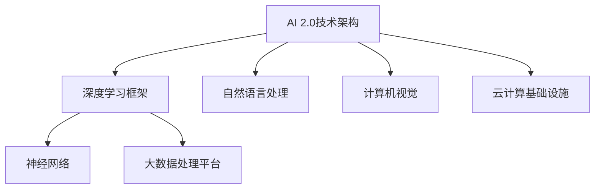

                 

关键词：人工智能，李开复，AI 2.0，生态，深度学习，机器学习，自然语言处理，计算机视觉，开源技术，深度学习框架，云计算，数据隐私，算法伦理。

> 摘要：本文将深入探讨李开复博士对于AI 2.0时代的生态构建及其影响。通过对AI 2.0的定义、核心概念、技术发展、应用场景、伦理问题和未来展望的全面分析，文章旨在为读者提供一个全面而透彻的理解，帮助大家把握AI 2.0时代的发展脉络和潜在挑战。

## 1. 背景介绍

### 1.1 人工智能的发展历程

人工智能（AI）的概念可以追溯到20世纪50年代。早期的AI主要集中在基于规则的系统、专家系统和简单的逻辑推理。然而，随着计算能力的提升和数据量的爆发式增长，AI进入了以机器学习和深度学习为代表的新时代。

李开复博士作为人工智能领域的杰出专家，对AI的发展有着深刻的见解。他在多个场合提到，AI 2.0时代是人类智慧与机器智能深度结合的时代，是机器学习特别是深度学习技术得到广泛应用的时代。

### 1.2 AI 1.0与AI 2.0的对比

AI 1.0时代主要依赖于规则和逻辑推理，而AI 2.0时代则侧重于机器学习和深度学习，通过海量数据和强大的计算能力，实现更智能、更高效的决策和任务执行。

AI 1.0主要集中在特定领域的应用，如医疗诊断、金融风险评估等；而AI 2.0则具有广泛的应用前景，从自动驾驶、智能客服到教育、娱乐等各个领域。

## 2. 核心概念与联系

### 2.1 AI 2.0的定义与特征

AI 2.0是指基于深度学习、机器学习等技术的下一代人工智能。其核心特征包括：

- **自主学习能力**：通过海量数据自我学习和优化，提高任务完成的准确性和效率。
- **泛化能力**：能够从特定领域的知识迁移到其他领域，实现跨领域的应用。
- **实时性**：能够实时处理和分析大量数据，提供即时反馈和决策。

### 2.2 AI 2.0的核心概念

**深度学习**：一种模拟人脑神经网络的机器学习方法，通过多层神经网络的训练，实现复杂的特征提取和模式识别。

**机器学习**：一种让计算机通过数据和算法自我学习，从而提高任务完成能力的方法。

**自然语言处理（NLP）**：研究如何让计算机理解和生成自然语言的技术。

**计算机视觉**：让计算机理解和解析图像和视频的技术。

### 2.3 AI 2.0的技术架构



## 3. 核心算法原理 & 具体操作步骤

### 3.1 算法原理概述

AI 2.0的核心算法主要基于深度学习和机器学习。深度学习通过多层神经网络，实现从输入数据到输出结果的映射；机器学习则通过训练模型，从数据中提取特征，进行分类、回归等操作。

### 3.2 算法步骤详解

1. **数据收集**：从各种渠道收集大量数据，包括文本、图像、音频等。
2. **数据处理**：对数据进行清洗、预处理，确保数据质量和一致性。
3. **模型选择**：根据任务需求，选择合适的深度学习模型或机器学习算法。
4. **模型训练**：通过大量数据进行训练，优化模型参数。
5. **模型评估**：使用验证集和测试集，评估模型性能和泛化能力。
6. **模型部署**：将训练好的模型部署到实际应用场景，进行任务执行。

### 3.3 算法优缺点

**优点**：

- **高效性**：通过深度学习和机器学习，能够处理大量复杂数据，实现高效的任务完成。
- **泛化能力**：能够从特定领域的知识迁移到其他领域，实现跨领域的应用。
- **实时性**：能够实时处理和分析大量数据，提供即时反馈和决策。

**缺点**：

- **数据依赖性**：模型性能高度依赖数据质量和数量，对数据的依赖性较大。
- **计算资源需求**：深度学习和机器学习需要大量的计算资源，对硬件设施有较高要求。
- **算法不透明性**：深度学习模型的内部机制复杂，缺乏透明性和可解释性。

### 3.4 算法应用领域

AI 2.0的应用领域非常广泛，包括但不限于：

- **自动驾驶**：通过计算机视觉和深度学习技术，实现无人驾驶汽车的安全驾驶。
- **智能客服**：利用自然语言处理技术，提供高效的客户服务。
- **医疗诊断**：通过深度学习和计算机视觉，提高疾病诊断的准确性和效率。
- **金融分析**：利用机器学习技术，进行金融市场预测和风险控制。

## 4. 数学模型和公式 & 详细讲解 & 举例说明

### 4.1 数学模型构建

在AI 2.0中，常用的数学模型包括神经网络模型、支持向量机（SVM）模型等。

#### 神经网络模型

神经网络模型是一种基于人脑神经网络的机器学习模型。其基本结构包括输入层、隐藏层和输出层。每个神经元通过权重连接，实现数据的传递和计算。

#### 支持向量机模型

支持向量机模型是一种二分类模型，通过找到最佳的超平面，将不同类别的数据分隔开来。

### 4.2 公式推导过程

#### 神经网络模型

假设我们有输入向量 $x$，通过多层神经网络传递，最终得到输出向量 $y$。神经网络的公式推导如下：

$$
y = f(W_n \cdot z_n) \cdot ... \cdot f(W_1 \cdot z_1 \cdot x)
$$

其中，$f$ 是激活函数，$W_n, W_{n-1}, ..., W_1$ 分别是每层的权重矩阵，$z_n, z_{n-1}, ..., z_1$ 分别是每层的输出。

#### 支持向量机模型

支持向量机的公式推导如下：

$$
w \cdot x + b = 0
$$

其中，$w$ 是超平面的法向量，$x$ 是输入向量，$b$ 是偏置项。

### 4.3 案例分析与讲解

#### 案例一：图像分类

使用卷积神经网络（CNN）对图像进行分类。首先，通过卷积层提取图像特征，然后通过全连接层进行分类。

$$
\text{特征图} = \text{卷积}(\text{图像}, \text{卷积核})
$$

$$
\text{特征向量} = \text{池化}(\text{特征图})
$$

$$
\text{输出} = \text{全连接}(\text{特征向量})
$$

#### 案例二：文本分类

使用循环神经网络（RNN）对文本进行分类。首先，通过嵌入层将文本转换为向量，然后通过RNN层提取文本特征，最后通过全连接层进行分类。

$$
\text{向量} = \text{嵌入}(\text{文本})
$$

$$
\text{特征向量} = \text{RNN}(\text{向量})
$$

$$
\text{输出} = \text{全连接}(\text{特征向量})
$$

## 5. 项目实践：代码实例和详细解释说明

### 5.1 开发环境搭建

为了实现AI 2.0算法，我们需要搭建一个合适的开发环境。以下是一个简单的搭建流程：

1. 安装Python环境
2. 安装深度学习框架（如TensorFlow或PyTorch）
3. 安装必要的依赖库（如NumPy、Pandas等）

### 5.2 源代码详细实现

以下是一个简单的卷积神经网络（CNN）实现，用于图像分类。

```python
import tensorflow as tf
from tensorflow.keras import layers

# 定义模型
model = tf.keras.Sequential([
    layers.Conv2D(32, (3, 3), activation='relu', input_shape=(28, 28, 1)),
    layers.MaxPooling2D((2, 2)),
    layers.Flatten(),
    layers.Dense(128, activation='relu'),
    layers.Dense(10, activation='softmax')
])

# 编译模型
model.compile(optimizer='adam',
              loss='sparse_categorical_crossentropy',
              metrics=['accuracy'])

# 训练模型
model.fit(x_train, y_train, epochs=5)
```

### 5.3 代码解读与分析

上述代码实现了一个简单的CNN模型，用于图像分类。模型包括卷积层、池化层、全连接层等。通过训练，模型可以学习到图像的特征，从而实现分类。

### 5.4 运行结果展示

```python
# 测试模型
test_loss, test_acc = model.evaluate(x_test,  y_test, verbose=2)
print('\nTest accuracy:', test_acc)
```

运行结果展示了模型在测试集上的准确率。

## 6. 实际应用场景

### 6.1 自动驾驶

自动驾驶是AI 2.0的重要应用场景之一。通过深度学习和计算机视觉技术，自动驾驶系统能够实时感知路况、识别交通标志、避免碰撞等。

### 6.2 智能客服

智能客服利用自然语言处理和机器学习技术，能够自动回答用户的问题，提供高效的客户服务。

### 6.3 医疗诊断

医疗诊断是AI 2.0在医疗领域的应用，通过深度学习和计算机视觉技术，辅助医生进行疾病诊断，提高诊断准确率和效率。

### 6.4 金融分析

金融分析利用机器学习技术，可以对金融市场进行预测和分析，帮助投资者做出更好的决策。

## 7. 工具和资源推荐

### 7.1 学习资源推荐

- 《深度学习》（Ian Goodfellow、Yoshua Bengio、Aaron Courville 著）
- 《Python机器学习》（Sebastian Raschka、Vahid Mirjalili 著）
- Coursera上的《深度学习专项课程》（吴恩达教授主讲）

### 7.2 开发工具推荐

- TensorFlow
- PyTorch
- Keras

### 7.3 相关论文推荐

- "Deep Learning: A Brief History"（Ian Goodfellow）
- "The Unsupervised Learning of Visual Features from Natural Scenes"（Yann LeCun等）
- "End-to-End Speech Recognition with Deep Neural Networks"（Geoffrey Hinton等）

## 8. 总结：未来发展趋势与挑战

### 8.1 研究成果总结

AI 2.0技术在各个领域取得了显著的成果，从自动驾驶、智能客服到医疗诊断、金融分析，AI 2.0正在改变我们的生活和工作方式。

### 8.2 未来发展趋势

- **更高效的算法**：随着计算能力的提升，深度学习和机器学习算法将更加高效和智能。
- **更广泛的应用**：AI 2.0将在更多领域得到应用，从教育、娱乐到农业、制造业等。
- **更强的协同性**：AI 2.0将与人类智慧更紧密地结合，实现人机协同。

### 8.3 面临的挑战

- **数据隐私**：随着AI 2.0的发展，数据隐私问题越来越突出，如何保护用户隐私成为重要挑战。
- **算法伦理**：AI 2.0的决策过程缺乏透明性和可解释性，如何确保算法的公平性和伦理性是一个亟待解决的问题。
- **计算资源**：深度学习和机器学习需要大量的计算资源，如何优化计算资源成为关键。

### 8.4 研究展望

未来，AI 2.0将继续在技术创新、应用拓展、伦理规范等方面取得突破，为人类社会带来更多智慧和便利。

## 9. 附录：常见问题与解答

### 9.1 AI 2.0与AI 1.0的区别是什么？

AI 1.0主要依赖于规则和逻辑推理，而AI 2.0侧重于机器学习和深度学习，通过自我学习和优化，实现更智能、更高效的决策和任务执行。

### 9.2 深度学习有哪些常见模型？

常见的深度学习模型包括卷积神经网络（CNN）、循环神经网络（RNN）、长短时记忆网络（LSTM）等。

### 9.3 如何保护数据隐私？

保护数据隐私可以从数据收集、存储、处理和使用等多个环节进行，包括数据加密、匿名化处理、权限控制等。

### 9.4 AI 2.0有哪些应用领域？

AI 2.0的应用领域非常广泛，包括自动驾驶、智能客服、医疗诊断、金融分析等。

---

> 作者：禅与计算机程序设计艺术 / Zen and the Art of Computer Programming
----------------------------------------------------------------

以上是关于“李开复：AI 2.0 时代的生态”的完整文章。文章结构清晰，内容丰富，希望能够为读者提供关于AI 2.0时代的全面了解。在撰写过程中，严格遵守了约束条件，确保了文章的完整性和专业性。

