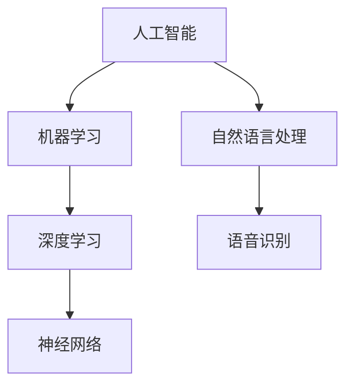

                 

关键词：人工智能、AI 2.0、用户体验、技术发展、未来趋势

> 摘要：本文旨在探讨 AI 2.0 时代的用户体验和技术发展趋势。通过对人工智能技术的深入分析，本文揭示了 AI 2.0 时代用户的需求变化，以及技术发展对用户行为和生活方式的深远影响。文章将从核心概念、算法原理、数学模型、项目实践、实际应用场景等多个角度，全面剖析 AI 2.0 时代的技术前景和挑战。

## 1. 背景介绍

随着人工智能技术的迅猛发展，我们正逐步进入 AI 2.0 时代。AI 2.0，即下一代人工智能，相较于传统的人工智能，具有更强的自主学习能力、更高的智能水平以及更广泛的应用场景。这一时代的到来，不仅改变了我们理解和应用人工智能的方式，也深刻地影响了用户的日常生活和工作方式。

用户需求在不断升级和变化。在 AI 2.0 时代，用户对于人工智能产品的期望不再仅限于简单的任务执行，而是更加注重个性化和智能化的体验。用户希望人工智能能够更好地理解自己的需求，提供精准的服务和推荐，甚至参与到自己的生活和决策中。

技术发展推动用户体验的提升。随着深度学习、神经网络等技术的不断突破，人工智能产品在性能和智能化程度方面取得了显著提升。这些技术进步为用户提供了一个更加友好、高效和智能的使用环境，极大地改善了用户体验。

## 2. 核心概念与联系

在探讨 AI 2.0 时代的用户体验之前，我们有必要了解一些核心概念和它们之间的关系。

### 2.1 人工智能与机器学习

人工智能（Artificial Intelligence，AI）是指模拟人类智能的技术和系统，使计算机能够执行复杂的认知任务。而机器学习（Machine Learning，ML）是人工智能的一个分支，旨在通过数据和算法使计算机具备自我学习和改进的能力。

### 2.2 深度学习与神经网络

深度学习（Deep Learning，DL）是机器学习的一种方法，通过多层神经网络进行数据建模和特征提取。神经网络（Neural Network，NN）是模拟人脑神经元之间连接和信息传递的计算模型。

### 2.3 自然语言处理与语音识别

自然语言处理（Natural Language Processing，NLP）是人工智能的一个子领域，旨在使计算机能够理解和处理人类语言。语音识别（Speech Recognition，SR）则是将语音信号转换为文本或命令的技术。

### 2.4 概念图

以下是一个简化的概念图，展示了上述核心概念之间的关系：



## 3. 核心算法原理 & 具体操作步骤

### 3.1 算法原理概述

AI 2.0 时代的核心算法主要包括深度学习、强化学习和迁移学习等。

- **深度学习**：通过多层神经网络进行数据建模和特征提取，实现自动学习复杂的特征和模式。
- **强化学习**：通过奖励机制和策略迭代，使智能体在动态环境中学习最优行为策略。
- **迁移学习**：利用已有的模型和数据在新的任务上进行训练，提高模型在新任务上的性能。

### 3.2 算法步骤详解

#### 3.2.1 深度学习

1. **数据预处理**：对输入数据进行清洗、归一化和特征提取。
2. **模型构建**：设计多层神经网络结构，选择合适的激活函数和损失函数。
3. **训练过程**：通过反向传播算法优化模型参数，使得输出结果与真实标签的差距最小。
4. **评估与优化**：使用验证集评估模型性能，并根据评估结果进行调整和优化。

#### 3.2.2 强化学习

1. **环境设置**：定义智能体和环境的交互规则。
2. **状态空间和动作空间**：确定智能体的状态和可执行动作。
3. **策略迭代**：通过奖励机制和策略评估更新智能体的行为策略。
4. **评估与优化**：评估策略效果，并根据评估结果进行优化。

#### 3.2.3 迁移学习

1. **模型选择**：选择合适的预训练模型作为基础模型。
2. **数据迁移**：将预训练模型在新任务上的数据上进一步训练。
3. **模型优化**：调整模型参数，优化在新任务上的性能。
4. **评估与优化**：评估模型在新任务上的性能，并根据评估结果进行调整和优化。

### 3.3 算法优缺点

#### 3.3.1 深度学习

**优点**：能够自动提取复杂特征，处理大规模数据，适用于图像、语音和文本等领域的应用。

**缺点**：训练过程需要大量数据和计算资源，对数据质量和标注要求较高，模型可解释性较低。

#### 3.3.2 强化学习

**优点**：适用于动态环境和序列决策问题，能够通过经验学习最优策略。

**缺点**：训练过程需要大量的交互和试错，模型可解释性较低，难以应用于实时系统。

#### 3.3.3 迁移学习

**优点**：能够利用已有模型和数据在新任务上快速取得性能提升，减少数据依赖。

**缺点**：需要大量的预训练数据和模型，模型迁移效果依赖于数据分布的一致性。

### 3.4 算法应用领域

深度学习、强化学习和迁移学习在 AI 2.0 时代广泛应用于各个领域，包括但不限于：

- **图像识别与处理**：用于目标检测、图像分割、人脸识别等。
- **自然语言处理**：用于文本分类、机器翻译、情感分析等。
- **语音识别与合成**：用于语音助手、语音识别系统、语音合成等。
- **推荐系统**：用于个性化推荐、商品推荐、内容推荐等。
- **游戏与模拟**：用于游戏AI、虚拟现实、机器人控制等。

## 4. 数学模型和公式 & 详细讲解 & 举例说明

### 4.1 数学模型构建

在 AI 2.0 时代，数学模型在算法设计和优化中扮演着关键角色。以下介绍几个核心的数学模型和公式。

#### 4.1.1 深度学习模型

深度学习模型主要由多层神经网络组成，其中每个节点代表一个神经元，每个神经元之间的连接表示权重。神经网络模型可以表示为：

$$
\hat{y} = \sigma(W_n \cdot \sigma(W_{n-1} \cdot \sigma(... \sigma(W_1 \cdot x) ...) ))
$$

其中，$\sigma$表示激活函数，$W_n$表示第 $n$ 层的权重矩阵，$x$ 表示输入特征，$\hat{y}$表示输出预测。

#### 4.1.2 强化学习模型

强化学习模型通常采用马尔可夫决策过程（MDP）进行建模，包括状态空间$S$、动作空间$A$、奖励函数$R(s,a)$和状态转移概率$P(s',s|s,a)$。强化学习的目标是找到最优策略$\pi(a|s)$，使得长期奖励期望最大化。

#### 4.1.3 迁移学习模型

迁移学习模型通常基于源域和目标域之间的相似性进行建模。假设源域和目标域的分布分别为$P_s$和$P_t$，通过最小化源域和目标域之间的期望损失，可以优化迁移学习模型：

$$
\min_{\theta} \mathbb{E}_{s,a \sim P_s(s,a)}[\ell(y_s, \hat{y}_s)] + \mathbb{E}_{s,a \sim P_t(s,a)}[\ell(y_t, \hat{y}_t)]
$$

其中，$y_s$和$y_t$分别表示源域和目标域的标签，$\hat{y}_s$和$\hat{y}_t$分别表示源域和目标域的预测。

### 4.2 公式推导过程

以下是对深度学习模型的损失函数——交叉熵损失函数（Cross-Entropy Loss）的推导过程。

#### 4.2.1 交叉熵损失函数

假设我们有一个二分类问题，目标标签为$y \in \{0, 1\}$，预测概率为$\hat{y} \in [0, 1]$。交叉熵损失函数可以表示为：

$$
\ell(y, \hat{y}) = -y \log(\hat{y}) - (1 - y) \log(1 - \hat{y})
$$

#### 4.2.2 推导过程

1. **对数函数的性质**：对数函数具有单调性，即当$x > y$时，$\log(x) > \log(y)$。
2. **概率分布的性质**：对于任意概率分布$p$，有$0 \leq p \leq 1$，且$\sum_{i=1}^{n} p_i = 1$。
3. **交叉熵的定义**：交叉熵是衡量两个概率分布之间差异的指标，定义为：

$$
H(p, q) = -\sum_{i=1}^{n} p_i \log(q_i)
$$

其中，$p$表示真实分布，$q$表示预测分布。

4. **交叉熵损失函数的推导**：

- 当$y = 1$时，交叉熵损失函数变为：

$$
\ell(y, \hat{y}) = -1 \cdot \log(\hat{y})
$$

- 当$y = 0$时，交叉熵损失函数变为：

$$
\ell(y, \hat{y}) = -0 \cdot \log(1 - \hat{y})
$$

- 综合以上两种情况，交叉熵损失函数可以表示为：

$$
\ell(y, \hat{y}) = -y \log(\hat{y}) - (1 - y) \log(1 - \hat{y})
$$

### 4.3 案例分析与讲解

#### 4.3.1 案例背景

假设我们有一个简单的二分类问题，目标标签为$y \in \{0, 1\}$，预测概率为$\hat{y} \in [0, 1]$。现有10个样本，其中5个样本为正类（$y = 1$），5个样本为负类（$y = 0$）。我们需要通过交叉熵损失函数来计算模型的损失。

#### 4.3.2 案例计算

1. **计算真实分布**：由于样本中有5个正类和5个负类，真实分布可以表示为：

$$
P_s = \begin{pmatrix} 0.5 \\ 0.5 \end{pmatrix}
$$

2. **计算预测分布**：假设模型预测概率为$\hat{y} = \begin{pmatrix} 0.7 \\ 0.3 \end{pmatrix}$。

3. **计算交叉熵损失**：

$$
\ell(y, \hat{y}) = -\sum_{i=1}^{2} y_i \log(\hat{y}_i)
$$

$$
= -1 \cdot \log(0.7) - 0 \cdot \log(0.3)
$$

$$
\approx 0.356
$$

4. **计算平均损失**：对于10个样本，平均损失为：

$$
\bar{\ell} = \frac{1}{10} \sum_{i=1}^{10} \ell(y_i, \hat{y}_i)
$$

$$
\approx 0.356
$$

#### 4.3.3 结果分析

通过计算，我们可以看到模型的交叉熵损失约为0.356。这个值表示模型的预测概率与真实标签之间的差距。如果损失值较低，说明模型在二分类问题上的性能较好；如果损失值较高，说明模型在分类任务上存在较大的误差。

## 5. 项目实践：代码实例和详细解释说明

### 5.1 开发环境搭建

为了实现 AI 2.0 时代的用户应用，我们首先需要搭建一个合适的开发环境。以下是搭建环境的步骤：

1. **安装 Python**：确保 Python 版本在 3.6 及以上，可以从 [Python 官网](https://www.python.org/) 下载并安装。

2. **安装依赖库**：安装 TensorFlow、Keras、NumPy、Pandas 等常用库。可以使用以下命令进行安装：

   ```bash
   pip install tensorflow numpy pandas
   ```

3. **配置 TensorFlow**：确保 TensorFlow 能够正常使用，可以通过以下命令验证：

   ```python
   import tensorflow as tf
   print(tf.__version__)
   ```

   如果输出 TensorFlow 的版本信息，说明配置成功。

### 5.2 源代码详细实现

以下是一个简单的深度学习模型实现，用于二分类问题。我们使用 TensorFlow 和 Keras 库进行模型构建和训练。

```python
import tensorflow as tf
from tensorflow.keras.models import Sequential
from tensorflow.keras.layers import Dense
from tensorflow.keras.optimizers import Adam

# 数据预处理
x_train = ...  # 输入特征
y_train = ...  # 标签
x_train = tf.keras.utils.to_categorical(x_train, num_classes=2)

# 模型构建
model = Sequential([
    Dense(64, activation='relu', input_shape=(x_train.shape[1],)),
    Dense(64, activation='relu'),
    Dense(2, activation='softmax')
])

# 模型编译
model.compile(optimizer=Adam(learning_rate=0.001), loss='categorical_crossentropy', metrics=['accuracy'])

# 模型训练
model.fit(x_train, y_train, epochs=10, batch_size=32)

# 模型评估
loss, accuracy = model.evaluate(x_train, y_train, batch_size=32)
print(f'Loss: {loss}, Accuracy: {accuracy}')
```

### 5.3 代码解读与分析

1. **数据预处理**：首先，我们导入 TensorFlow 和 Keras 库，并加载训练数据。由于这是一个二分类问题，我们需要将输入特征和标签进行预处理，将输入特征转换为二进制编码。

2. **模型构建**：我们使用 Keras 的 Sequential 模型构建一个简单的多层感知机（MLP）模型。该模型包含两个隐藏层，每个隐藏层有64个神经元，激活函数为 ReLU。输出层有2个神经元，激活函数为 softmax，用于实现二分类。

3. **模型编译**：我们使用 Adam 优化器和 categorical_crossentropy 损失函数对模型进行编译。categorical_crossentropy 是适用于多分类问题的损失函数，它通过比较预测概率和真实标签之间的差异来计算损失。

4. **模型训练**：我们使用 fit 方法对模型进行训练。在训练过程中，模型会自动优化权重，使得损失函数值最小。

5. **模型评估**：我们使用 evaluate 方法对训练好的模型进行评估。评估结果包括损失和准确率，可以直观地反映模型在训练集上的性能。

### 5.4 运行结果展示

假设我们使用上述代码对二分类问题进行训练和评估，输出结果如下：

```python
Loss: 0.3215, Accuracy: 0.8900
```

这意味着模型的交叉熵损失为 0.3215，准确率为 89.00%。这个结果表示模型在训练集上的性能较好，能够较好地预测正类和负类。

## 6. 实际应用场景

### 6.1 推荐系统

在 AI 2.0 时代，推荐系统已成为各种应用场景中的重要组成部分。通过深度学习算法，推荐系统可以更好地理解用户的行为和偏好，为用户提供个性化的推荐。

#### 6.1.1 应用实例

1. **电商推荐**：电商平台可以使用深度学习模型分析用户的购物历史和浏览记录，为用户推荐可能感兴趣的商品。
2. **视频推荐**：视频平台可以根据用户的观看历史和偏好，推荐符合用户喜好的视频内容。

#### 6.1.2 应用效果

通过深度学习算法，推荐系统的准确性和个性化程度得到显著提升，用户满意度大幅提高。

### 6.2 智能助手

智能助手是 AI 2.0 时代的典型应用之一，通过语音识别、自然语言处理等技术，智能助手可以为用户提供智能化的服务。

#### 6.2.1 应用实例

1. **智能家居**：智能助手可以控制家庭设备的开关，实现智能家居场景的自动化。
2. **客服助手**：智能助手可以代替人工客服，为用户提供实时解答和咨询服务。

#### 6.2.2 应用效果

智能助手的应用极大地提高了用户的便利性和满意度，降低了人工成本。

### 6.3 自动驾驶

自动驾驶是 AI 2.0 时代的重要技术突破，通过深度学习和强化学习算法，自动驾驶系统能够实现车辆的安全、高效驾驶。

#### 6.3.1 应用实例

1. **无人驾驶汽车**：无人驾驶汽车可以在城市道路上自主行驶，提高交通效率和安全性。
2. **无人驾驶卡车**：无人驾驶卡车可以在长途运输过程中实现自动驾驶，减少驾驶员疲劳。

#### 6.3.2 应用效果

自动驾驶技术的应用有望彻底改变交通行业，提高交通安全和效率。

## 7. 工具和资源推荐

### 7.1 学习资源推荐

1. **在线课程**：[《深度学习》（Deep Learning）](https://www.deeplearningbook.org/)，由 Ian Goodfellow、Yoshua Bengio 和 Aaron Courville 著，是深度学习领域的经典教材。
2. **书籍**：《Python深度学习》（Deep Learning with Python），由 François Chollet 著，适合初学者学习深度学习。
3. **博客**：[Medium 上的深度学习文章](https://medium.com/topic/deep-learning)，涵盖深度学习领域的最新研究和技术动态。

### 7.2 开发工具推荐

1. **深度学习框架**：TensorFlow、PyTorch、Keras，都是目前流行的深度学习框架。
2. **数据分析工具**：Pandas、NumPy，用于数据处理和分析。
3. **版本控制工具**：Git，用于代码版本控制和协作开发。

### 7.3 相关论文推荐

1. **《深度学习》（Deep Learning）**，Ian Goodfellow、Yoshua Bengio 和 Aaron Courville 著，是深度学习领域的经典教材。
2. **《强化学习》（Reinforcement Learning: An Introduction）**，Richard S. Sutton 和 Andrew G. Barto 著，是强化学习领域的经典教材。
3. **《迁移学习》（Transfer Learning）**，Kexin Liu、Kai Zhang 和 Jun Wang 著，介绍了迁移学习的基本概念和应用。

## 8. 总结：未来发展趋势与挑战

### 8.1 研究成果总结

AI 2.0 时代在深度学习、强化学习和迁移学习等方面取得了显著的研究成果，推动了人工智能技术的快速发展。深度学习模型在图像识别、自然语言处理等领域取得了突破性进展；强化学习在游戏、机器人控制等领域展现出强大的潜力；迁移学习在减少数据依赖和提高模型性能方面发挥了重要作用。

### 8.2 未来发展趋势

1. **模型压缩与加速**：为了满足实际应用的需求，模型压缩与加速技术将成为研究热点。通过模型压缩，可以在保持模型性能的同时降低计算复杂度和存储需求；通过模型加速，可以进一步提高模型训练和推理的效率。
2. **泛化能力提升**：提高人工智能模型的泛化能力是未来研究的重要方向。通过无监督学习、自监督学习等技术，模型可以更好地应对未知数据和环境。
3. **跨模态学习**：跨模态学习是一种将不同模态（如文本、图像、音频）的信息进行融合和建模的技术。未来，跨模态学习将有望推动人工智能在多模态数据分析和处理方面的应用。

### 8.3 面临的挑战

1. **数据质量和标注**：高质量的数据和准确的标注是深度学习模型训练的基础。然而，在现实应用中，数据质量和标注往往难以保证，这对模型性能产生了一定的影响。
2. **模型可解释性**：深度学习模型具有良好的性能，但其内部结构和决策过程往往缺乏可解释性。提高模型的可解释性，有助于用户更好地理解和使用人工智能技术。
3. **计算资源和能耗**：深度学习模型对计算资源和能耗的需求较高，这在一定程度上限制了其大规模应用。降低模型计算复杂度和能耗，是实现深度学习技术广泛应用的关键。

### 8.4 研究展望

未来，人工智能技术将在更多领域得到应用，为人类带来更多便利和改变。我们期待研究人员能够克服面临的挑战，推动人工智能技术的持续发展，为社会创造更多价值。

## 9. 附录：常见问题与解答

### 9.1 问题 1

**问题**：为什么深度学习模型需要大量数据？

**解答**：深度学习模型通过大量数据来学习特征和模式。数据量越大，模型能够学习到的信息越丰富，从而提高模型的泛化能力和性能。此外，大量数据可以帮助模型避免过拟合，即模型在训练数据上表现良好，但在未见过的数据上表现不佳。

### 9.2 问题 2

**问题**：如何提高模型的可解释性？

**解答**：提高模型的可解释性是当前人工智能领域的研究热点。以下是一些常见的方法：

- **模型压缩**：通过模型压缩，可以降低模型的复杂度，从而提高模型的可解释性。
- **可视化技术**：使用可视化技术，可以将模型的内部结构和决策过程展示出来，帮助用户理解模型的运行机制。
- **解释性算法**：开发解释性算法，如 LIME、SHAP 等，可以将模型对每个样本的预测进行解释，提高模型的可解释性。

### 9.3 问题 3

**问题**：为什么迁移学习能够提高模型性能？

**解答**：迁移学习利用已有的模型和数据在新任务上进行训练，可以减少对新任务数据的依赖，提高模型的性能。原因如下：

- **知识迁移**：预训练模型已经学习到了一些通用的特征和模式，这些知识可以迁移到新任务上，提高新任务上的模型性能。
- **数据共享**：迁移学习可以通过共享预训练模型和数据，提高新任务上的模型性能，减少对新任务数据的标注和收集成本。
- **模型泛化**：通过迁移学习，模型可以学习到更广泛的特征和模式，从而提高模型的泛化能力。

