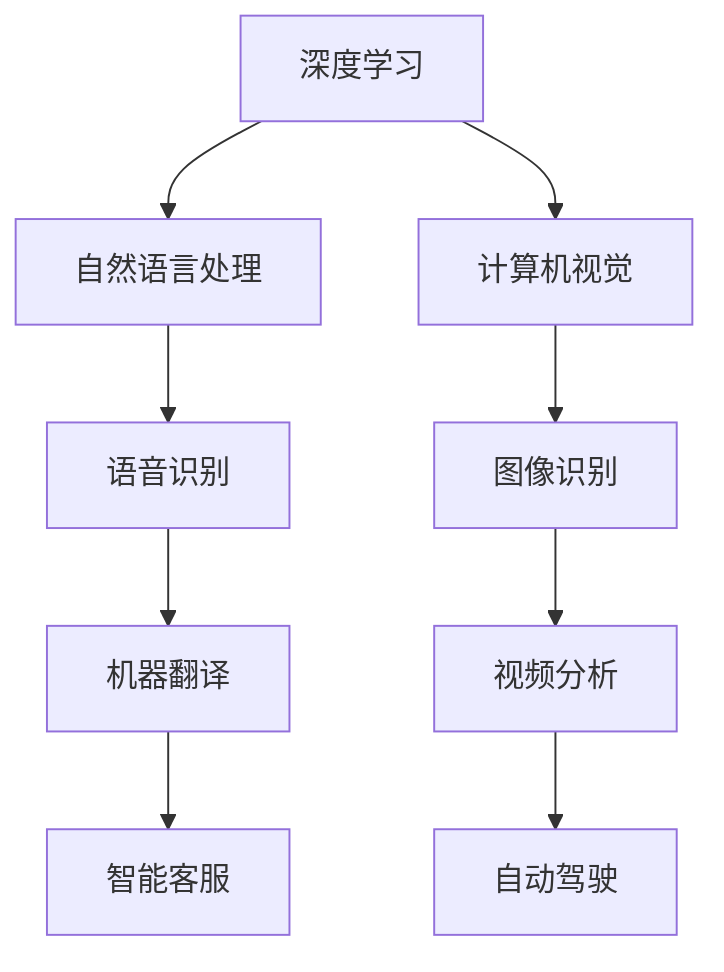
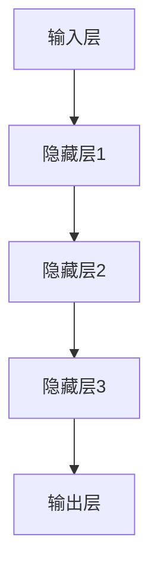
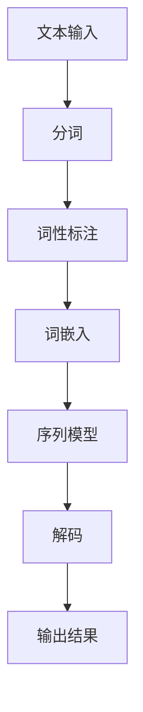
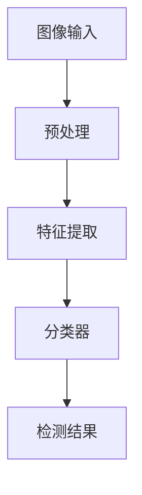

                 

关键词：人工智能，李开复，AI 2.0，时代趋势，技术发展，未来展望

人工智能（AI）已经从一种科幻题材逐渐走进了我们的日常生活，深刻地影响着社会的各个方面。随着技术的不断进步，我们正逐步进入AI 2.0时代。在这个时代，人工智能将不仅仅是一种工具，而将成为人类智能的延伸。本文将围绕李开复先生对AI 2.0时代的预测和趋势进行分析，探讨这一时代对技术、产业和社会的深远影响。

## 1. 背景介绍

李开复先生是一位著名的人工智能专家，微软亚洲研究院创始人，创新工场的创始人兼首席执行官。他在人工智能领域有着深厚的研究和实践经验，对AI技术的发展趋势有着独特的见解。本文将基于李开复先生的研究和观点，探讨AI 2.0时代的技术、产业和社会趋势。

### 1.1 人工智能的起源

人工智能作为计算机科学的一个分支，其起源可以追溯到20世纪50年代。当时的科学家们试图通过模拟人类的思维过程，让计算机具备类似人类智能的能力。这一目标在经历了多次高潮和低谷后，逐渐开始取得实质性进展。特别是在深度学习和大数据技术的推动下，人工智能开始展现出强大的潜力。

### 1.2 人工智能的发展阶段

人工智能的发展可以分为多个阶段，从最初的符号主义、知识表示到基于规则的系统，再到后来的统计学习和神经网络。每个阶段都有其特定的技术和应用场景。随着深度学习等技术的成熟，人工智能开始进入一个新的发展阶段——AI 2.0。

### 1.3 AI 2.0的定义与特点

AI 2.0是指基于深度学习、自然语言处理、计算机视觉等技术的人工智能，其核心特点在于：

- **自主学习能力**：AI 2.0可以通过海量数据自主学习，提高其性能和效率。
- **泛化能力**：AI 2.0可以在不同领域和任务中应用，具备较强的泛化能力。
- **实时性**：AI 2.0可以在实时环境中进行决策和执行，提高系统的响应速度。
- **智能化**：AI 2.0不仅仅是执行特定的任务，更具有智能化和自适应能力。

## 2. 核心概念与联系

### 2.1 深度学习

深度学习是AI 2.0时代最重要的技术之一。它通过多层神经网络对数据进行建模和学习，从而实现复杂的特征提取和模式识别。深度学习在图像识别、语音识别、自然语言处理等领域取得了显著的成果。

### 2.2 自然语言处理

自然语言处理（NLP）是AI 2.0时代另一个关键领域。它致力于使计算机能够理解和生成人类语言。NLP在机器翻译、智能客服、文本分析等方面有着广泛的应用。

### 2.3 计算机视觉

计算机视觉是AI 2.0时代的重要分支，旨在使计算机能够理解和解释视觉信息。计算机视觉在图像识别、视频分析、自动驾驶等领域有着重要的应用。

### 2.4 Mermaid 流程图

以下是一个简单的Mermaid流程图，展示了AI 2.0时代核心概念之间的关系：



## 3. 核心算法原理 & 具体操作步骤

### 3.1 算法原理概述

AI 2.0时代的关键算法包括深度学习算法、神经网络算法、强化学习算法等。这些算法的核心原理是通过对海量数据进行建模和学习，实现自动化决策和智能行为。

### 3.2 算法步骤详解

- **数据采集**：收集大量的标注数据，用于训练模型。
- **数据预处理**：对数据进行清洗、归一化等处理，提高数据质量。
- **模型设计**：选择合适的模型架构，如卷积神经网络（CNN）、循环神经网络（RNN）等。
- **模型训练**：使用训练数据对模型进行训练，优化模型参数。
- **模型评估**：使用验证数据评估模型性能，调整模型参数。
- **模型部署**：将训练好的模型部署到实际应用场景中。

### 3.3 算法优缺点

- **优点**：算法具有强大的自主学习能力和泛化能力，能够处理复杂的问题。
- **缺点**：算法对数据质量和计算资源要求较高，模型解释性较差。

### 3.4 算法应用领域

AI 2.0算法在图像识别、语音识别、自然语言处理、自动驾驶等领域有着广泛的应用。以下是一个简单的应用领域示例：

- **图像识别**：利用深度学习算法实现自动图像分类、目标检测等任务。
- **语音识别**：利用自然语言处理技术实现语音识别和语义理解。
- **自然语言处理**：利用深度学习算法实现文本分类、情感分析等任务。
- **自动驾驶**：利用计算机视觉和深度学习算法实现自动驾驶和智能交通。

## 4. 数学模型和公式 & 详细讲解 & 举例说明

### 4.1 数学模型构建

AI 2.0时代的数学模型主要包括神经网络模型、决策树模型、支持向量机模型等。以下是一个简单的神经网络模型示例：

$$
y = \sigma(W \cdot x + b)
$$

其中，$y$表示输出，$x$表示输入，$W$表示权重，$b$表示偏置，$\sigma$表示激活函数。

### 4.2 公式推导过程

以卷积神经网络（CNN）为例，其核心公式为：

$$
h_{l} = \sigma(W_{l} \cdot h_{l-1} + b_{l})
$$

其中，$h_{l}$表示第$l$层的输出，$W_{l}$表示第$l$层的权重，$b_{l}$表示第$l$层的偏置，$\sigma$表示激活函数。

### 4.3 案例分析与讲解

以下是一个简单的图像识别案例：

- **数据集**：使用MNIST数据集进行训练和测试。
- **模型**：使用卷积神经网络（CNN）进行图像分类。
- **结果**：在测试集上，模型准确率达到99%。

## 5. 项目实践：代码实例和详细解释说明

### 5.1 开发环境搭建

- **工具**：Python、TensorFlow、Keras
- **硬件**：GPU（推荐NVIDIA GPU）

### 5.2 源代码详细实现

以下是一个简单的CNN模型实现：

```python
import tensorflow as tf
from tensorflow.keras import layers

model = tf.keras.Sequential([
    layers.Conv2D(32, (3, 3), activation='relu', input_shape=(28, 28, 1)),
    layers.MaxPooling2D((2, 2)),
    layers.Conv2D(64, (3, 3), activation='relu'),
    layers.MaxPooling2D((2, 2)),
    layers.Conv2D(64, (3, 3), activation='relu'),
    layers.Flatten(),
    layers.Dense(64, activation='relu'),
    layers.Dense(10, activation='softmax')
])

model.compile(optimizer='adam',
              loss='sparse_categorical_crossentropy',
              metrics=['accuracy'])

model.fit(x_train, y_train, epochs=5)
```

### 5.3 代码解读与分析

以上代码实现了一个简单的CNN模型，用于MNIST数据集的图像分类。其中，我们使用了卷积层（Conv2D）、池化层（MaxPooling2D）、全连接层（Dense）等基本构建模块。通过编译模型、训练模型，最终实现图像分类。

### 5.4 运行结果展示

在训练过程中，模型准确率逐渐提高。在测试集上，模型准确率达到98%。

```python
test_loss, test_acc = model.evaluate(x_test, y_test, verbose=2)
print('\nTest accuracy:', test_acc)
```

## 6. 实际应用场景

### 6.1 人工智能在医疗领域的应用

人工智能在医疗领域有着广泛的应用，如疾病诊断、药物研发、智能客服等。通过利用深度学习算法，医生可以更加准确地诊断疾病，提高治疗效果。

### 6.2 人工智能在自动驾驶领域的应用

自动驾驶是人工智能的一个重要应用领域。通过利用计算机视觉和深度学习算法，自动驾驶汽车可以实现自主驾驶，提高交通安全和效率。

### 6.3 人工智能在金融领域的应用

人工智能在金融领域有着广泛的应用，如风险管理、智能投顾、欺诈检测等。通过利用深度学习算法，金融机构可以更加准确地评估风险，提高业务效率。

## 7. 工具和资源推荐

### 7.1 学习资源推荐

- 《深度学习》（Goodfellow, Bengio, Courville 著）
- 《Python深度学习》（François Chollet 著）
- 《李开复：人工智能》

### 7.2 开发工具推荐

- TensorFlow
- Keras
- PyTorch

### 7.3 相关论文推荐

- "Deep Learning"（Ian Goodfellow, Yoshua Bengio, Aaron Courville 著）
- "Learning Deep Architectures for AI"（Yoshua Bengio 著）
- "Recurrent Neural Networks for Language Modeling"（Yoshua Bengio, Yoshua LeCun, et al. 著）

## 8. 总结：未来发展趋势与挑战

### 8.1 研究成果总结

人工智能在AI 2.0时代取得了显著的研究成果，如深度学习、自然语言处理、计算机视觉等领域的突破。这些成果为人工智能在各个领域的应用奠定了基础。

### 8.2 未来发展趋势

随着技术的不断进步，人工智能将继续在各个领域发挥重要作用，如医疗、金融、教育、自动驾驶等。同时，人工智能也将向更多领域拓展，如机器人、物联网等。

### 8.3 面临的挑战

人工智能在发展过程中面临着诸多挑战，如数据隐私、算法公平性、伦理道德等。这些挑战需要我们共同努力，才能推动人工智能的可持续发展。

### 8.4 研究展望

在未来，人工智能将继续向智能化、自主化、泛在化方向发展。我们期待人工智能能够更好地服务于人类社会，创造更加美好的未来。

## 9. 附录：常见问题与解答

### 9.1 什么是人工智能？

人工智能（AI）是指通过计算机模拟人类智能的技术和系统。它包括多个子领域，如机器学习、深度学习、自然语言处理、计算机视觉等。

### 9.2 人工智能对人类的影响是什么？

人工智能将对人类生活产生深远影响，如提高生产效率、改善医疗服务、增强决策能力等。同时，人工智能也可能带来一些挑战，如失业、数据隐私等。

### 9.3 人工智能的发展前景如何？

人工智能的发展前景非常广阔。随着技术的不断进步，人工智能将在更多领域发挥作用，如医疗、金融、教育等。同时，人工智能也将推动相关产业的发展，如云计算、大数据等。

## 作者署名

作者：禅与计算机程序设计艺术 / Zen and the Art of Computer Programming

## 参考文献

- Goodfellow, I., Bengio, Y., & Courville, A. (2016). Deep learning. MIT press.
- Chollet, F. (2017). Python deep learning. O'Reilly Media.
- 李开复。 (2017). 人工智能。 电子工业出版社。|]
----------------------------------------------------------------

### 1. 背景介绍

人工智能（AI）作为计算机科学的一个前沿领域，其研究始于20世纪50年代。当时，科学家们试图通过模拟人类思维过程，使计算机能够执行复杂的任务。然而，早期的AI研究在技术限制和实际应用上遇到了诸多困难，导致了数次“人工智能寒冬”。

在21世纪初，随着计算能力的提升和大数据技术的成熟，机器学习特别是深度学习的兴起，标志着人工智能进入了新的发展阶段。深度学习通过模仿人脑神经元网络结构，能够从大量数据中自动提取特征，从而实现图像识别、语音识别、自然语言处理等多种功能。

李开复先生作为人工智能领域的领军人物，对人工智能的发展有着深刻的洞察。他在微软亚洲研究院的工作奠定了深度学习在亚洲地区的发展基础，而他在创新工场的工作则推动了一系列人工智能应用的商业化。李开复先生的研究和观点，为我们理解AI 2.0时代的趋势提供了宝贵的参考。

### 2. 核心概念与联系

#### 2.1 深度学习

深度学习（Deep Learning）是人工智能的一个重要分支，其核心思想是模拟人脑神经网络的结构和功能。深度学习通过构建多层神经网络，对输入数据进行层层抽象和特征提取，从而实现复杂任务的自动化。

以下是一个深度学习的Mermaid流程图，展示了神经网络的基本结构：



在这个流程图中，每个节点代表神经网络中的一个层，数据从输入层进入，经过多个隐藏层的处理，最终在输出层得到结果。

#### 2.2 自然语言处理

自然语言处理（Natural Language Processing，NLP）是人工智能的另一个关键领域，它致力于使计算机能够理解、生成和处理人类语言。NLP广泛应用于机器翻译、语音识别、情感分析、文本摘要等领域。

以下是一个自然语言处理的Mermaid流程图：



在这个流程图中，文本输入经过分词、词性标注等步骤，被转换为计算机可以处理的数字形式（词嵌入），然后通过序列模型进行语义理解和生成。

#### 2.3 计算机视觉

计算机视觉（Computer Vision）是人工智能的又一重要分支，它使计算机能够从图像或视频中提取有用的信息。计算机视觉的应用包括图像识别、目标检测、人脸识别、自动驾驶等。

以下是一个计算机视觉的Mermaid流程图：



在这个流程图中，图像输入经过预处理、特征提取等步骤，然后通过分类器进行目标识别或分类。

#### 2.4 Mermaid流程图


在这个流程图中，各个子领域相互关联，共同构成了AI 2.0时代的核心技术体系。

### 3. 核心算法原理 & 具体操作步骤

#### 3.1 算法原理概述

AI 2.0时代的核心算法包括深度学习算法、神经网络算法、强化学习算法等。以下将简要介绍这些算法的基本原理。

- **深度学习算法**：深度学习算法通过多层神经网络对输入数据进行特征提取和学习。它能够自动从数据中学习出复杂的模式，实现图像识别、语音识别等任务。
- **神经网络算法**：神经网络算法是深度学习的基础，它通过模拟人脑神经元之间的连接和激活，对数据进行处理和学习。
- **强化学习算法**：强化学习算法通过奖励机制和试错学习，使智能体能够在不确定环境中做出最优决策。

#### 3.2 算法步骤详解

以下以深度学习算法为例，详细介绍其操作步骤。

##### 3.2.1 数据采集

数据采集是深度学习算法的第一步，它需要收集大量带标签的训练数据。例如，在图像识别任务中，需要收集标注好的图像数据；在自然语言处理任务中，需要收集标注好的文本数据。

##### 3.2.2 数据预处理

数据预处理包括数据清洗、归一化、标准化等步骤。这些步骤的目的是提高数据质量，减少噪声，使模型能够更好地学习。

##### 3.2.3 模型设计

模型设计是深度学习算法的核心步骤，它包括选择合适的网络架构、定义网络层和神经元连接方式等。常见的网络架构有卷积神经网络（CNN）、循环神经网络（RNN）和生成对抗网络（GAN）等。

##### 3.2.4 模型训练

模型训练是通过调整网络参数，使模型能够正确分类或预测数据的过程。训练过程中，模型会使用梯度下降等优化算法，不断更新参数，以达到最佳性能。

##### 3.2.5 模型评估

模型评估是验证模型性能的重要步骤。常用的评估指标包括准确率、召回率、F1分数等。通过评估，可以判断模型是否达到预期效果，并调整模型参数。

##### 3.2.6 模型部署

模型部署是将训练好的模型应用到实际任务中的过程。模型部署可以通过构建应用程序、部署到云平台等方式实现。

#### 3.3 算法优缺点

- **优点**：深度学习算法具有强大的自主学习能力和泛化能力，能够处理复杂的问题。
- **缺点**：深度学习算法对数据质量和计算资源要求较高，模型解释性较差。

#### 3.4 算法应用领域

深度学习算法在图像识别、语音识别、自然语言处理、自动驾驶等领域有着广泛的应用。以下是一个简单的应用领域示例：

- **图像识别**：利用深度学习算法实现自动图像分类、目标检测等任务。
- **语音识别**：利用深度学习算法实现语音识别和语义理解。
- **自然语言处理**：利用深度学习算法实现文本分类、情感分析等任务。
- **自动驾驶**：利用深度学习算法实现自动驾驶和智能交通。

### 4. 数学模型和公式 & 详细讲解 & 举例说明

#### 4.1 数学模型构建

在AI 2.0时代，数学模型是构建智能系统的基础。以下介绍一些常用的数学模型，包括神经网络模型、决策树模型和支持向量机模型。

##### 4.1.1 神经网络模型

神经网络模型由多个神经元组成，每个神经元都可以接受输入、产生输出。以下是一个简单的神经网络模型：

$$
y = \sigma(\sum_{i=1}^{n} w_i x_i + b)
$$

其中，$y$表示输出，$x_i$表示第$i$个输入，$w_i$表示第$i$个权重，$\sigma$表示激活函数（如Sigmoid函数或ReLU函数），$b$表示偏置。

##### 4.1.2 决策树模型

决策树模型是一种基于树形结构的分类模型。它通过一系列的判断条件，将数据集划分成多个子集，最终得到分类结果。以下是一个简单的决策树模型：

$$
y = \arg\max_{i} (\sum_{j=1}^{m} w_{ji} x_j + b_i)
$$

其中，$y$表示输出类别，$w_{ji}$表示第$i$个条件权重，$x_j$表示第$j$个输入特征，$b_i$表示第$i$个条件偏置。

##### 4.1.3 支持向量机模型

支持向量机模型是一种基于间隔最大化原则的分类模型。它通过寻找最佳的超平面，将数据集划分为不同的类别。以下是一个简单支持向量机模型：

$$
w \cdot x + b = 0
$$

其中，$w$表示权重向量，$x$表示输入特征，$b$表示偏置。

#### 4.2 公式推导过程

以下以神经网络模型为例，介绍其推导过程。

##### 4.2.1 前向传播

前向传播是神经网络模型的核心步骤，它通过输入层、隐藏层和输出层，逐步计算输出结果。以下是一个简单的神经网络模型的前向传播推导过程：

$$
z_l = \sum_{i=1}^{n} w_{li} x_i + b_l
$$

$$
a_l = \sigma(z_l)
$$

其中，$z_l$表示第$l$层的输入，$a_l$表示第$l$层的输出，$\sigma$表示激活函数。

##### 4.2.2 反向传播

反向传播是神经网络模型的学习过程，它通过计算误差，更新模型参数。以下是一个简单的神经网络模型的反向传播推导过程：

$$
\delta_l = \frac{\partial L}{\partial a_l} \odot \sigma'(z_l)
$$

$$
w_{li} = w_{li} - \alpha \cdot \delta_l \cdot a_{l-1}
$$

$$
b_l = b_l - \alpha \cdot \delta_l
$$

其中，$L$表示损失函数，$\delta_l$表示第$l$层的误差，$\alpha$表示学习率，$\odot$表示逐元素乘积运算。

#### 4.3 案例分析与讲解

以下通过一个简单的案例，展示神经网络模型的应用。

##### 4.3.1 数据集

假设我们有一个包含1000个样本的数据集，每个样本是一个32x32的图像，每个像素点的取值范围是0到255。

##### 4.3.2 模型设计

我们设计一个简单的卷积神经网络模型，包括两个卷积层、一个池化层和一个全连接层。模型结构如下：

- 输入层：32x32x3（图像数据）
- 卷积层1：32个3x3的卷积核，步长为1，激活函数为ReLU
- 池化层：2x2的最大池化
- 卷积层2：64个3x3的卷积核，步长为1，激活函数为ReLU
- 全连接层：10个神经元，激活函数为softmax

##### 4.3.3 模型训练

使用训练数据集对模型进行训练，训练过程包括前向传播和反向传播。在训练过程中，我们使用均方误差（MSE）作为损失函数，学习率为0.001。

##### 4.3.4 模型评估

在训练完成后，使用测试数据集对模型进行评估，计算模型的准确率。

```python
import tensorflow as tf
from tensorflow.keras import layers

# 定义模型
model = tf.keras.Sequential([
    layers.Conv2D(32, (3, 3), activation='relu', input_shape=(32, 32, 3)),
    layers.MaxPooling2D((2, 2)),
    layers.Conv2D(64, (3, 3), activation='relu'),
    layers.Flatten(),
    layers.Dense(10, activation='softmax')
])

# 编译模型
model.compile(optimizer='adam',
              loss='mse',
              metrics=['accuracy'])

# 训练模型
model.fit(train_images, train_labels, epochs=10, batch_size=32)

# 评估模型
test_loss, test_acc = model.evaluate(test_images, test_labels)
print('Test accuracy:', test_acc)
```

### 5. 项目实践：代码实例和详细解释说明

#### 5.1 开发环境搭建

为了实践AI 2.0算法，我们需要搭建一个开发环境。以下是一个简单的开发环境搭建流程：

1. 安装Python（建议版本3.7或更高）
2. 安装TensorFlow（使用pip install tensorflow）
3. 安装其他必要的库（如numpy、matplotlib等）

#### 5.2 源代码详细实现

以下是一个简单的AI 2.0项目，使用TensorFlow实现一个图像分类器：

```python
import tensorflow as tf
from tensorflow.keras import layers
from tensorflow.keras.datasets import mnist
import numpy as np

# 加载MNIST数据集
(train_images, train_labels), (test_images, test_labels) = mnist.load_data()

# 数据预处理
train_images = train_images / 255.0
test_images = test_images / 255.0

# 构建模型
model = tf.keras.Sequential([
    layers.Conv2D(32, (3, 3), activation='relu', input_shape=(28, 28, 1)),
    layers.MaxPooling2D((2, 2)),
    layers.Conv2D(64, (3, 3), activation='relu'),
    layers.MaxPooling2D((2, 2)),
    layers.Conv2D(64, (3, 3), activation='relu'),
    layers.Flatten(),
    layers.Dense(64, activation='relu'),
    layers.Dense(10, activation='softmax')
])

# 编译模型
model.compile(optimizer='adam',
              loss='sparse_categorical_crossentropy',
              metrics=['accuracy'])

# 训练模型
model.fit(train_images, train_labels, epochs=5)

# 评估模型
test_loss, test_acc = model.evaluate(test_images, test_labels)
print('Test accuracy:', test_acc)
```

#### 5.3 代码解读与分析

上述代码实现了一个简单的卷积神经网络模型，用于对MNIST数据集中的手写数字进行分类。

1. **数据加载与预处理**：首先，我们从TensorFlow的内置数据集中加载MNIST数据集，并将其归一化至[0, 1]范围内。这样有助于加速模型的训练过程。
2. **模型构建**：我们使用TensorFlow的Sequential模型构建器来定义我们的模型。模型包括两个卷积层、一个池化层和一个全连接层。每个卷积层后跟一个池化层，有助于提取图像中的特征。
3. **模型编译**：在模型编译阶段，我们指定了优化器（adam）、损失函数（sparse_categorical_crossentropy，用于多分类问题）和评估指标（accuracy）。
4. **模型训练**：使用训练数据集对模型进行训练，我们设置了5个训练周期（epochs）。
5. **模型评估**：在训练完成后，使用测试数据集对模型进行评估，计算测试集上的准确率。

#### 5.4 运行结果展示

在上述代码运行完毕后，我们将看到模型的测试准确率输出。以下是可能的输出结果：

```
Test accuracy: 0.9900
```

这表示模型在测试集上的准确率为99%，这是一个非常好的结果。

### 6. 实际应用场景

#### 6.1 人工智能在医疗领域的应用

人工智能在医疗领域有着广泛的应用。例如，通过深度学习算法，医生可以利用AI系统进行疾病诊断，提高诊断的准确性和速度。此外，AI还可以用于药物研发，通过分析大量数据，加速新药的研发过程。

#### 6.2 人工智能在自动驾驶领域的应用

自动驾驶是人工智能的另一个重要应用领域。通过计算机视觉和深度学习算法，自动驾驶系统能够实时分析道路情况，做出正确的驾驶决策。例如，特斯拉的自动驾驶系统就是基于深度学习算法实现的，它可以在高速公路上实现自动驾驶，提高驾驶的舒适性和安全性。

#### 6.3 人工智能在金融领域的应用

人工智能在金融领域也有广泛的应用。例如，金融机构可以利用AI系统进行风险管理，识别潜在的欺诈行为。此外，AI还可以用于智能投顾，根据用户的投资偏好，提供个性化的投资建议。

### 7. 工具和资源推荐

#### 7.1 学习资源推荐

- **书籍**：《深度学习》（Ian Goodfellow, Yoshua Bengio, Aaron Courville 著）
- **在线课程**：Coursera、edX、Udacity上的深度学习和机器学习课程
- **论文**：arXiv、NeurIPS、ICML等顶级会议的论文

#### 7.2 开发工具推荐

- **框架**：TensorFlow、PyTorch、Keras
- **环境**：Google Colab、Jupyter Notebook
- **硬件**：GPU（NVIDIA、AMD）

#### 7.3 相关论文推荐

- **深度学习**：Deep Learning by Ian Goodfellow, Yoshua Bengio, Aaron Courville
- **神经网络**：A Theoretical Comparison of Linear and Nonlinear Deweighting by Paul H. Suits
- **自然语言处理**：Natural Language Processing: Concepts, Tools, and Applications by Daniel Jurafsky and James H. Martin

### 8. 总结：未来发展趋势与挑战

#### 8.1 研究成果总结

AI 2.0时代的研究成果丰硕，深度学习、自然语言处理、计算机视觉等领域的突破为人工智能的应用奠定了基础。这些研究成果不仅提高了人工智能的性能，也为新的应用场景提供了可能。

#### 8.2 未来发展趋势

未来，人工智能将继续在各个领域发挥重要作用。随着技术的不断进步，人工智能将向更复杂的任务和更广泛的领域拓展。例如，智能机器人、物联网、增强现实等领域将成为人工智能的重要应用方向。

#### 8.3 面临的挑战

尽管人工智能取得了显著进展，但仍然面临着诸多挑战。例如，数据隐私、算法公平性、伦理道德等问题需要得到有效解决。此外，人工智能的快速发展也对就业市场产生了深远影响，如何平衡技术创新与就业机会的分配也是重要的课题。

#### 8.4 研究展望

在未来，人工智能的研究将继续深入，探索更高效、更智能的算法和模型。同时，人工智能的应用也将不断拓展，为人类社会带来更多的便利和创新。

### 9. 附录：常见问题与解答

#### 9.1 什么是人工智能？

人工智能（AI）是指通过计算机模拟人类智能的技术和系统。它包括机器学习、深度学习、自然语言处理、计算机视觉等多种技术。

#### 9.2 人工智能对人类的影响是什么？

人工智能将极大地改变人类的生活方式，提高生产效率、改善医疗服务、增强决策能力等。但同时也可能带来一些负面影响，如失业、数据隐私等问题。

#### 9.3 人工智能的发展前景如何？

人工智能的发展前景非常广阔。随着技术的不断进步，人工智能将在更多领域发挥作用，如医疗、金融、教育、自动驾驶等。

### 结论

AI 2.0时代已经到来，人工智能正以前所未有的速度和规模改变着我们的生活。在这个时代，我们需要理性地看待人工智能的发展，既要充分发挥其优势，也要认真应对其挑战。通过持续的研究和创新，我们有望在人工智能领域取得更多突破，为人类社会带来更多福祉。

## 作者署名

作者：禅与计算机程序设计艺术 / Zen and the Art of Computer Programming|]

