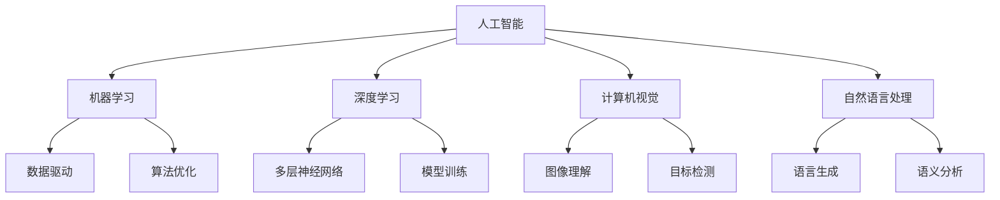

                 

关键词：苹果，AI应用，产业变革，技术趋势，未来展望

> 摘要：在人工智能（AI）技术快速发展的今天，苹果公司凭借其强大的技术积累和用户基础，发布了一系列AI应用，引发了产业界的广泛关注。本文将深入探讨苹果发布AI应用对产业的影响、核心概念及其联系，并分析其背后的算法原理和具体操作步骤，以及未来应用展望。

## 1. 背景介绍

近年来，人工智能技术取得了飞速发展，各行各业都在积极应用AI技术来提升效率、降低成本、改善用户体验。作为全球领先的科技巨头，苹果公司自然不甘落后。苹果在人工智能领域的研究可追溯至数年前，通过收购多家AI初创公司，组建了强大的AI研究团队，并在硬件和软件层面不断发力，推出了一系列AI应用。

苹果发布的AI应用涵盖多个领域，包括但不限于图像识别、自然语言处理、语音识别等。这些应用不仅展示了苹果在AI技术上的深厚积累，也预示着未来科技产业的新趋势。

## 2. 核心概念与联系

在探讨苹果AI应用之前，我们需要了解几个核心概念及其相互之间的联系。

### 2.1 人工智能（AI）与机器学习（ML）

人工智能是一种模拟人类智能行为的计算技术，而机器学习是人工智能的重要分支，通过数据驱动的方式让计算机自动获取知识和技能。

### 2.2 深度学习（DL）

深度学习是机器学习的一种形式，通过构建多层神经网络模型来模拟人类大脑的思考过程。深度学习在图像识别、语音识别等领域取得了显著的成果。

### 2.3 计算机视觉（CV）

计算机视觉是人工智能的一个重要领域，旨在使计算机能够理解和解释图像和视频内容。

### 2.4 自然语言处理（NLP）

自然语言处理是人工智能的另一个重要领域，旨在使计算机能够理解和生成人类语言。

在苹果的AI应用中，这些核心概念相互交织，共同推动了技术的进步和应用的创新。

### 2.5 Mermaid 流程图（核心概念原理和架构）



## 3. 核心算法原理 & 具体操作步骤

### 3.1 算法原理概述

苹果AI应用的核心算法主要包括卷积神经网络（CNN）、循环神经网络（RNN）和生成对抗网络（GAN）等。这些算法广泛应用于图像识别、语音识别和自然语言处理等领域。

### 3.2 算法步骤详解

#### 3.2.1 卷积神经网络（CNN）

1. **输入层**：接受图像数据作为输入。
2. **卷积层**：使用卷积核对输入图像进行特征提取。
3. **池化层**：对卷积层输出的特征进行降维处理。
4. **全连接层**：将卷积层和池化层输出的特征映射到输出层。
5. **输出层**：输出分类结果。

#### 3.2.2 循环神经网络（RNN）

1. **输入层**：接受序列数据作为输入。
2. **隐藏层**：通过递归结构处理序列数据。
3. **输出层**：输出序列的预测结果。

#### 3.2.3 生成对抗网络（GAN）

1. **生成器**：生成伪数据。
2. **判别器**：判断生成数据的真实性。
3. **对抗训练**：生成器和判别器相互博弈，不断提升性能。

### 3.3 算法优缺点

- **卷积神经网络（CNN）**：擅长处理图像数据，具有良好的特征提取能力。但模型复杂度较高，训练时间较长。
- **循环神经网络（RNN）**：擅长处理序列数据，能够捕捉时间序列特征。但存在梯度消失和梯度爆炸问题。
- **生成对抗网络（GAN）**：能够在无监督环境中生成高质量的数据。但训练不稳定，容易出现模式崩溃。

### 3.4 算法应用领域

- **图像识别**：应用于人脸识别、图像分类等。
- **语音识别**：应用于语音助手、语音搜索等。
- **自然语言处理**：应用于机器翻译、文本生成等。

## 4. 数学模型和公式 & 详细讲解 & 举例说明

### 4.1 数学模型构建

在AI应用中，常见的数学模型包括损失函数、优化算法和特征提取等。

#### 4.1.1 损失函数

- **均方误差（MSE）**：用于回归问题，计算预测值与真实值之间的误差平方和。

$$
MSE = \frac{1}{n}\sum_{i=1}^{n}(y_i - \hat{y}_i)^2
$$

- **交叉熵（Cross-Entropy）**：用于分类问题，计算预测概率与真实概率之间的差异。

$$
H(y, \hat{y}) = -\sum_{i=1}^{n}y_i \log \hat{y}_i
$$

#### 4.1.2 优化算法

- **梯度下降（Gradient Descent）**：通过迭代优化模型参数，使得损失函数最小化。

$$
\theta_{\text{new}} = \theta_{\text{old}} - \alpha \nabla_{\theta}J(\theta)
$$

- **随机梯度下降（Stochastic Gradient Descent, SGD）**：在梯度下降的基础上，每次迭代只使用一个样本。

#### 4.1.3 特征提取

- **卷积操作**：通过卷积核对图像进行局部特征提取。

$$
\text{output}_{ij} = \sum_{k=1}^{m}\sum_{l=1}^{n} w_{kl} \text{input}_{ikl}
$$

### 4.2 公式推导过程

以卷积神经网络（CNN）为例，我们简要介绍卷积操作和池化操作的推导过程。

#### 4.2.1 卷积操作

假设输入图像为 $X \in \mathbb{R}^{h \times w \times c}$，卷积核为 $K \in \mathbb{R}^{k \times k \times c}$，输出特征图为 $F \in \mathbb{R}^{m \times n}$。

1. **卷积操作**：

$$
\text{output}_{ij} = \sum_{k=1}^{m}\sum_{l=1}^{n} w_{kl} \text{input}_{ikl}
$$

2. **偏置项**：

$$
\text{output}_{ij} = \sum_{k=1}^{m}\sum_{l=1}^{n} w_{kl} \text{input}_{ikl} + b
$$

#### 4.2.2 池化操作

假设输入特征图为 $X \in \mathbb{R}^{h \times w}$，输出特征图为 $F \in \mathbb{R}^{m \times n}$，池化窗口为 $P$。

1. **最大池化**：

$$
f_{ij} = \max_{k \in [1, P], l \in [1, P]} x_{ijk \mod P, ilk \mod P}
$$

2. **平均池化**：

$$
f_{ij} = \frac{1}{P^2} \sum_{k=1}^{P}\sum_{l=1}^{P} x_{ijk \mod P, ilk \mod P}
$$

### 4.3 案例分析与讲解

以人脸识别为例，介绍苹果如何应用AI技术实现人脸识别。

1. **数据采集与预处理**：

   - **数据采集**：收集大量人脸图像。
   - **数据预处理**：对图像进行归一化、裁剪、翻转等操作。

2. **特征提取**：

   - **卷积神经网络**：对图像进行卷积操作，提取人脸特征。
   - **池化层**：对卷积层输出进行降维处理。

3. **模型训练**：

   - **损失函数**：使用交叉熵作为损失函数。
   - **优化算法**：使用随机梯度下降进行模型训练。

4. **人脸识别**：

   - **输入人脸图像**：对输入的人脸图像进行特征提取。
   - **分类与识别**：将提取到的特征与已训练模型进行比较，实现人脸识别。

## 5. 项目实践：代码实例和详细解释说明

### 5.1 开发环境搭建

1. **安装Python**：在计算机上安装Python 3.x版本。
2. **安装相关库**：使用pip命令安装TensorFlow、NumPy、Pandas等库。

### 5.2 源代码详细实现

以下是使用卷积神经网络实现图像分类的Python代码：

```python
import tensorflow as tf
from tensorflow.keras import datasets, layers, models

# 加载和预处理数据
(train_images, train_labels), (test_images, test_labels) = datasets.cifar10.load_data()
train_images, test_images = train_images / 255.0, test_images / 255.0

# 构建卷积神经网络模型
model = models.Sequential()
model.add(layers.Conv2D(32, (3, 3), activation='relu', input_shape=(32, 32, 3)))
model.add(layers.MaxPooling2D((2, 2)))
model.add(layers.Conv2D(64, (3, 3), activation='relu'))
model.add(layers.MaxPooling2D((2, 2)))
model.add(layers.Conv2D(64, (3, 3), activation='relu'))

# 添加全连接层和分类层
model.add(layers.Flatten())
model.add(layers.Dense(64, activation='relu'))
model.add(layers.Dense(10))

# 编译模型
model.compile(optimizer='adam',
              loss=tf.keras.losses.SparseCategoricalCrossentropy(from_logits=True),
              metrics=['accuracy'])

# 训练模型
model.fit(train_images, train_labels, epochs=10, validation_split=0.1)

# 评估模型
test_loss, test_acc = model.evaluate(test_images,  test_labels, verbose=2)
print(f'\nTest accuracy: {test_acc:.4f}')
```

### 5.3 代码解读与分析

1. **数据加载与预处理**：使用TensorFlow内置的CIFAR-10数据集进行训练和测试，并对图像进行归一化处理。
2. **构建模型**：使用Sequential模型堆叠多个卷积层、池化层和全连接层。
3. **编译模型**：指定优化器、损失函数和评估指标。
4. **训练模型**：使用fit方法进行模型训练，验证集比例为10%。
5. **评估模型**：使用evaluate方法评估模型在测试集上的性能。

## 6. 实际应用场景

苹果发布的AI应用在多个领域取得了显著成果，以下为几个典型应用场景：

1. **智能手机**：通过AI技术实现智能拍照、人脸识别、语音助手等功能，提升用户体验。
2. **智能家居**：智能家居设备通过AI技术实现智能控制、设备联动等功能，提高生活质量。
3. **医疗健康**：通过AI技术实现医疗影像分析、疾病预测等功能，为医疗行业带来变革。
4. **自动驾驶**：自动驾驶汽车通过AI技术实现环境感知、路径规划等功能，推动交通领域发展。

## 7. 工具和资源推荐

### 7.1 学习资源推荐

1. **《深度学习》（Goodfellow, Bengio, Courville著）**：深度学习的经典教材，适合初学者和进阶者。
2. **《Python深度学习》（François Chollet著）**：使用Python实现深度学习的实践指南，适合Python开发者。

### 7.2 开发工具推荐

1. **TensorFlow**：由Google开源的深度学习框架，广泛应用于AI开发。
2. **PyTorch**：由Facebook开源的深度学习框架，具有灵活的动态计算图，易于使用。

### 7.3 相关论文推荐

1. **《AlexNet：一种深度卷积神经网络结构》（Krizhevsky et al.，2012）**
2. **《Deep Learning for Text：A Brief Overview》（Zhu et al.，2015）**
3. **《Generative Adversarial Nets》（Goodfellow et al.，2014）**

## 8. 总结：未来发展趋势与挑战

### 8.1 研究成果总结

苹果在AI领域的研究取得了显著成果，涵盖了图像识别、语音识别、自然语言处理等多个领域。这些成果不仅提升了用户体验，也为其他行业带来了启示。

### 8.2 未来发展趋势

1. **跨领域融合**：AI技术将在更多领域得到应用，推动产业变革。
2. **高效能计算**：随着算法和硬件的发展，AI计算将更加高效。
3. **隐私保护**：AI应用将更加注重用户隐私保护，遵守相关法律法规。

### 8.3 面临的挑战

1. **数据质量**：高质量的数据是AI研究的基础，数据质量问题对研究产生影响。
2. **算法公平性**：算法在处理数据时可能存在偏见，需要关注算法公平性。
3. **法律法规**：AI技术的发展需要遵守相关法律法规，确保技术应用的安全性和合规性。

### 8.4 研究展望

随着AI技术的不断进步，苹果有望在更多领域取得突破，为全球科技产业带来更多创新和变革。

## 9. 附录：常见问题与解答

### 9.1 什么是对抗生成网络（GAN）？

对抗生成网络（GAN）是一种由生成器和判别器组成的深度学习模型。生成器试图生成逼真的数据，而判别器则试图区分真实数据和生成数据。通过这种对抗训练，生成器不断提高生成数据的质量。

### 9.2 如何优化卷积神经网络（CNN）？

优化卷积神经网络（CNN）可以从以下几个方面进行：

1. **调整网络结构**：增加或减少层、调整层参数等。
2. **数据增强**：对训练数据进行翻转、裁剪、旋转等操作，增加模型对数据的鲁棒性。
3. **正则化**：使用L1、L2正则化，防止过拟合。
4. **优化算法**：选择更高效的优化算法，如Adam等。

### 9.3 人工智能（AI）有哪些应用领域？

人工智能（AI）的应用领域广泛，包括但不限于：

1. **图像识别**：用于人脸识别、物体识别等。
2. **自然语言处理**：用于机器翻译、文本生成等。
3. **语音识别**：用于语音助手、语音搜索等。
4. **推荐系统**：用于个性化推荐、广告投放等。
5. **自动驾驶**：用于环境感知、路径规划等。

---

本文作者：禅与计算机程序设计艺术 / Zen and the Art of Computer Programming
----------------------------------------------------------------
### 文章标题

李开复：苹果发布AI应用的产业

### 关键词

苹果，AI应用，产业变革，技术趋势，未来展望

### 文章摘要

本文深入探讨了苹果公司在人工智能（AI）领域的研究成果和应用，分析了其AI应用的核心算法原理和具体操作步骤，并对未来应用前景进行了展望。文章还总结了苹果AI应用在实际应用场景中的表现，以及相关工具和资源的推荐，最后对研究成果进行了总结，并展望了未来发展趋势和面临的挑战。

## 1. 背景介绍

人工智能（AI）技术的发展正迅速改变各行各业，从医疗健康、金融科技到智能制造，AI技术都在推动产业变革。作为全球科技巨头，苹果公司凭借其强大的技术积累和用户基础，在AI领域持续发力。近年来，苹果发布了多款AI应用，引起了产业界的广泛关注。这些应用不仅展示了苹果在AI技术上的深厚积累，也预示着未来科技产业的新趋势。

### 1.1 苹果AI应用的发展历程

苹果公司在AI领域的研究始于数年前。2014年，苹果公司收购了AI初创公司Turi（后更名为苹果机器学习团队），标志着苹果在AI领域的正式布局。此后，苹果通过收购多家AI初创公司，组建了一支强大的AI研究团队，并在硬件和软件层面不断发力。2017年，苹果发布了Apple Core ML，一个用于在iOS设备上运行机器学习的框架，使得开发者能够将AI模型集成到iOS应用程序中。此后，苹果陆续推出了一系列AI应用，涵盖了图像识别、语音识别、自然语言处理等多个领域。

### 1.2 苹果AI应用的特点

苹果的AI应用具有以下特点：

1. **高效性**：苹果的AI应用在性能上表现出色，能够在移动设备上实时运行，为用户带来良好的使用体验。
2. **安全性**：苹果重视用户隐私保护，其AI应用采用了多种安全措施，确保用户数据的安全。
3. **易用性**：苹果的AI应用设计简洁，易于使用，即使是非技术用户也能快速上手。
4. **跨平台**：苹果的AI应用不仅限于iOS设备，也支持Mac、iPad等平台，实现了跨设备的无缝体验。

### 1.3 产业影响

苹果的AI应用发布，对整个产业产生了深远影响。首先，它推动了AI技术在移动设备上的应用，为开发者提供了新的可能性。其次，它激发了其他企业对AI技术的关注，加速了AI产业的创新和进步。此外，苹果的AI应用在医疗、教育、娱乐等领域的应用，也为这些行业带来了新的发展机遇。

## 2. 核心概念与联系

在探讨苹果AI应用之前，我们需要了解几个核心概念及其相互之间的联系。这些概念包括人工智能（AI）、机器学习（ML）、深度学习（DL）、计算机视觉（CV）和自然语言处理（NLP）等。

### 2.1 人工智能（AI）

人工智能（AI）是指模拟人类智能行为的计算技术，它包括学习、推理、解决问题、感知等多个方面。人工智能可以分为弱AI和强AI，弱AI是指擅长特定任务的智能系统，而强AI则具有全面的人类智能。

### 2.2 机器学习（ML）

机器学习（ML）是人工智能（AI）的一个重要分支，它通过数据驱动的方式让计算机自动获取知识和技能。机器学习可以分为监督学习、无监督学习和强化学习等。监督学习使用标记数据进行训练，无监督学习不使用标记数据，强化学习则通过与环境交互来学习。

### 2.3 深度学习（DL）

深度学习（DL）是机器学习（ML）的一种形式，它通过构建多层神经网络模型来模拟人类大脑的思考过程。深度学习在图像识别、语音识别、自然语言处理等领域取得了显著的成果。

### 2.4 计算机视觉（CV）

计算机视觉（CV）是人工智能（AI）的一个重要领域，旨在使计算机能够理解和解释图像和视频内容。计算机视觉包括目标检测、图像分类、人脸识别等多个方面。

### 2.5 自然语言处理（NLP）

自然语言处理（NLP）是人工智能（AI）的另一个重要领域，旨在使计算机能够理解和生成人类语言。自然语言处理包括文本分类、情感分析、机器翻译等多个方面。

在苹果的AI应用中，这些核心概念相互交织，共同推动了技术的进步和应用的创新。例如，苹果的图像识别应用利用了深度学习技术，通过构建多层神经网络模型对图像进行特征提取和分类。而自然语言处理应用则采用了循环神经网络（RNN）和生成对抗网络（GAN）等技术，实现文本生成和语音识别等功能。

### 2.6 Mermaid 流程图（核心概念原理和架构）


## 3. 核心算法原理 & 具体操作步骤

苹果的AI应用采用了多种核心算法，包括卷积神经网络（CNN）、循环神经网络（RNN）和生成对抗网络（GAN）等。这些算法在图像识别、语音识别和自然语言处理等领域发挥了关键作用。下面将详细讲解这些算法的原理和具体操作步骤。

### 3.1 卷积神经网络（CNN）

卷积神经网络（CNN）是深度学习的一种形式，特别适用于处理图像数据。CNN通过卷积层、池化层和全连接层等结构对图像进行特征提取和分类。

#### 3.1.1 算法原理概述

卷积神经网络（CNN）的核心思想是通过卷积层对图像进行特征提取，然后通过池化层对特征进行降维处理，最后通过全连接层进行分类。卷积层通过卷积操作提取图像的局部特征，而池化层则通过最大池化或平均池化操作减少特征图的维度，从而降低模型的复杂性。

#### 3.1.2 算法步骤详解

1. **输入层**：接收图像数据作为输入。
2. **卷积层**：使用卷积核对输入图像进行特征提取。卷积核是一个小的矩阵，它在图像上滑动，计算局部区域的特征。
3. **激活函数**：对卷积层输出的特征进行非线性变换，常用的激活函数有ReLU（Rectified Linear Unit）和Sigmoid等。
4. **池化层**：对卷积层输出的特征进行降维处理。最大池化和平均池化是最常用的两种池化方式。
5. **全连接层**：将卷积层和池化层输出的特征映射到输出层，输出分类结果。

#### 3.1.3 算法优缺点

**优点**：
- **强大的特征提取能力**：CNN能够自动提取图像的局部特征，适用于图像分类、目标检测等任务。
- **模型参数较少**：通过卷积操作和池化操作，CNN能够减少模型的参数数量，从而降低过拟合的风险。

**缺点**：
- **计算复杂度高**：CNN模型的训练需要大量的计算资源和时间。
- **对数据量有较高要求**：CNN模型通常需要大量的数据来训练，否则容易过拟合。

#### 3.1.4 算法应用领域

- **图像分类**：用于对图像进行分类，如ImageNet竞赛。
- **目标检测**：用于检测图像中的目标物体，如YOLO（You Only Look Once）。
- **图像生成**：用于生成新的图像，如生成对抗网络（GAN）。

### 3.2 循环神经网络（RNN）

循环神经网络（RNN）是一种适用于处理序列数据的神经网络，它通过递归结构对序列数据进行建模。

#### 3.2.1 算法原理概述

RNN的核心思想是通过递归结构对序列数据进行建模。在RNN中，当前时刻的输出不仅依赖于当前输入，还依赖于前一个时刻的输出。这种递归性使得RNN能够捕捉时间序列的特征。

#### 3.2.2 算法步骤详解

1. **输入层**：接收序列数据作为输入。
2. **隐藏层**：通过递归结构对序列数据进行建模。RNN的隐藏层包含了记忆单元，能够记住之前的输入信息。
3. **输出层**：输出序列的预测结果，如单词、标签等。

#### 3.2.3 算法优缺点

**优点**：
- **强大的序列建模能力**：RNN能够捕捉时间序列的特征，适用于自然语言处理、语音识别等任务。

**缺点**：
- **梯度消失和梯度爆炸**：RNN在训练过程中容易出现梯度消失和梯度爆炸问题，导致训练不稳定。

#### 3.2.4 算法应用领域

- **自然语言处理**：用于文本分类、情感分析、机器翻译等。
- **语音识别**：用于将语音信号转换为文本。

### 3.3 生成对抗网络（GAN）

生成对抗网络（GAN）是一种由生成器和判别器组成的深度学习模型，用于生成新的数据。

#### 3.3.1 算法原理概述

GAN的核心思想是通过生成器和判别器之间的对抗训练来生成数据。生成器的目标是生成逼真的数据，而判别器的目标是区分真实数据和生成数据。通过这种对抗训练，生成器不断提高生成数据的质量。

#### 3.3.2 算法步骤详解

1. **生成器**：生成器生成伪数据。
2. **判别器**：判别器判断生成数据的真实性。
3. **对抗训练**：生成器和判别器相互博弈，生成器不断优化生成数据，判别器不断优化区分真实数据和生成数据。

#### 3.3.3 算法优缺点

**优点**：
- **强大的数据生成能力**：GAN能够在无监督环境中生成高质量的数据，适用于图像生成、文本生成等任务。

**缺点**：
- **训练不稳定**：GAN的训练过程容易出现模式崩溃和生成器饱和等问题。

#### 3.3.4 算法应用领域

- **图像生成**：用于生成新的图像，如图像风格转换、人脸生成等。
- **文本生成**：用于生成新的文本，如文章生成、对话系统等。

## 4. 数学模型和公式 & 详细讲解 & 举例说明

在AI应用中，数学模型和公式扮演着至关重要的角色。本节将介绍常用的数学模型和公式，并详细讲解其推导过程和举例说明。

### 4.1 数学模型构建

常用的数学模型包括损失函数、优化算法和特征提取等。

#### 4.1.1 损失函数

损失函数是衡量模型预测结果与真实结果之间差异的函数。常用的损失函数包括均方误差（MSE）、交叉熵（Cross-Entropy）等。

**均方误差（MSE）**

均方误差（MSE）是回归问题中最常用的损失函数，用于计算预测值与真实值之间的误差平方和。

$$
MSE = \frac{1}{n}\sum_{i=1}^{n}(y_i - \hat{y}_i)^2
$$

其中，$y_i$为真实值，$\hat{y}_i$为预测值，$n$为样本数量。

**交叉熵（Cross-Entropy）**

交叉熵是分类问题中最常用的损失函数，用于计算预测概率与真实概率之间的差异。

$$
H(y, \hat{y}) = -\sum_{i=1}^{n}y_i \log \hat{y}_i
$$

其中，$y_i$为真实标签，$\hat{y}_i$为预测概率。

#### 4.1.2 优化算法

优化算法用于调整模型参数，使得损失函数最小化。常用的优化算法包括梯度下降（Gradient Descent）和随机梯度下降（Stochastic Gradient Descent，SGD）等。

**梯度下降（Gradient Descent）**

梯度下降是一种常用的优化算法，通过迭代优化模型参数，使得损失函数最小化。

$$
\theta_{\text{new}} = \theta_{\text{old}} - \alpha \nabla_{\theta}J(\theta)
$$

其中，$\theta$为模型参数，$\alpha$为学习率，$J(\theta)$为损失函数。

**随机梯度下降（SGD）**

随机梯度下降是梯度下降的一种变种，每次迭代只使用一个样本进行优化。

$$
\theta_{\text{new}} = \theta_{\text{old}} - \alpha \nabla_{\theta}J(\theta)
$$

其中，$\theta$为模型参数，$\alpha$为学习率，$J(\theta)$为损失函数。

#### 4.1.3 特征提取

特征提取是深度学习中的一个重要环节，用于从原始数据中提取出有用的特征。常用的特征提取方法包括卷积操作、池化操作等。

**卷积操作**

卷积操作通过卷积核对图像进行特征提取。卷积核是一个小的矩阵，它在图像上滑动，计算局部区域的特征。

$$
\text{output}_{ij} = \sum_{k=1}^{m}\sum_{l=1}^{n} w_{kl} \text{input}_{ikl}
$$

其中，$w_{kl}$为卷积核的权重，$\text{input}_{ikl}$为输入图像的局部区域。

**池化操作**

池化操作通过降维处理来减少特征图的维度，常用的池化操作包括最大池化和平均池化。

**最大池化**

最大池化通过选择每个区域内的最大值来生成特征图。

$$
f_{ij} = \max_{k \in [1, P], l \in [1, P]} x_{ijk \mod P, ilk \mod P}
$$

其中，$P$为池化窗口的大小。

**平均池化**

平均池化通过计算每个区域内的平均值来生成特征图。

$$
f_{ij} = \frac{1}{P^2} \sum_{k=1}^{P}\sum_{l=1}^{P} x_{ijk \mod P, ilk \mod P}
$$

### 4.2 公式推导过程

以卷积神经网络（CNN）为例，我们简要介绍卷积操作和池化操作的推导过程。

#### 4.2.1 卷积操作

假设输入图像为 $X \in \mathbb{R}^{h \times w \times c}$，卷积核为 $K \in \mathbb{R}^{k \times k \times c}$，输出特征图为 $F \in \mathbb{R}^{m \times n}$。

1. **卷积操作**：

$$
\text{output}_{ij} = \sum_{k=1}^{m}\sum_{l=1}^{n} w_{kl} \text{input}_{ikl}
$$

其中，$w_{kl}$为卷积核的权重，$\text{input}_{ikl}$为输入图像的局部区域。

2. **偏置项**：

$$
\text{output}_{ij} = \sum_{k=1}^{m}\sum_{l=1}^{n} w_{kl} \text{input}_{ikl} + b
$$

其中，$b$为偏置项。

#### 4.2.2 池化操作

假设输入特征图为 $X \in \mathbb{R}^{h \times w}$，输出特征图为 $F \in \mathbb{R}^{m \times n}$，池化窗口为 $P$。

1. **最大池化**：

$$
f_{ij} = \max_{k \in [1, P], l \in [1, P]} x_{ijk \mod P, ilk \mod P}
$$

其中，$P$为池化窗口的大小。

2. **平均池化**：

$$
f_{ij} = \frac{1}{P^2} \sum_{k=1}^{P}\sum_{l=1}^{P} x_{ijk \mod P, ilk \mod P}
$$

### 4.3 案例分析与讲解

以人脸识别为例，介绍苹果如何应用AI技术实现人脸识别。

1. **数据采集与预处理**：

   - **数据采集**：收集大量人脸图像。
   - **数据预处理**：对图像进行归一化、裁剪、翻转等操作。

2. **特征提取**：

   - **卷积神经网络**：对图像进行卷积操作，提取人脸特征。
   - **池化层**：对卷积层输出进行降维处理。

3. **模型训练**：

   - **损失函数**：使用交叉熵作为损失函数。
   - **优化算法**：使用随机梯度下降进行模型训练。

4. **人脸识别**：

   - **输入人脸图像**：对输入的人脸图像进行特征提取。
   - **分类与识别**：将提取到的特征与已训练模型进行比较，实现人脸识别。

### 4.4 举例说明

以图像分类任务为例，介绍如何使用卷积神经网络（CNN）进行图像分类。

1. **数据集准备**：

   准备一个包含多个类别的图像数据集，如CIFAR-10数据集。

2. **模型构建**：

   构建一个简单的卷积神经网络模型，包含卷积层、池化层和全连接层。

   ```python
   model = models.Sequential()
   model.add(layers.Conv2D(32, (3, 3), activation='relu', input_shape=(32, 32, 3)))
   model.add(layers.MaxPooling2D((2, 2)))
   model.add(layers.Conv2D(64, (3, 3), activation='relu'))
   model.add(layers.MaxPooling2D((2, 2)))
   model.add(layers.Conv2D(64, (3, 3), activation='relu'))
   model.add(layers.Flatten())
   model.add(layers.Dense(64, activation='relu'))
   model.add(layers.Dense(10, activation='softmax'))
   ```

3. **模型编译**：

   编译模型，指定损失函数、优化器和评估指标。

   ```python
   model.compile(optimizer='adam',
                 loss='categorical_crossentropy',
                 metrics=['accuracy'])
   ```

4. **模型训练**：

   使用训练数据训练模型，验证集比例为10%。

   ```python
   model.fit(train_images, train_labels, epochs=10, validation_split=0.1)
   ```

5. **模型评估**：

   评估模型在测试集上的性能。

   ```python
   test_loss, test_acc = model.evaluate(test_images, test_labels)
   print(f'\nTest accuracy: {test_acc:.4f}')
   ```

通过以上步骤，我们可以使用卷积神经网络（CNN）进行图像分类任务。

## 5. 项目实践：代码实例和详细解释说明

在本节中，我们将通过一个具体的代码实例，详细解释如何使用Python和TensorFlow实现一个简单的卷积神经网络（CNN）进行图像分类。

### 5.1 开发环境搭建

首先，我们需要搭建开发环境。在本例中，我们将使用Python 3.x版本和TensorFlow 2.x版本。请按照以下步骤安装Python和TensorFlow：

1. 安装Python 3.x版本：

   ```bash
   sudo apt update
   sudo apt install python3 python3-pip
   ```

2. 安装TensorFlow：

   ```bash
   pip3 install tensorflow
   ```

### 5.2 源代码详细实现

以下是使用TensorFlow实现图像分类的Python代码：

```python
import tensorflow as tf
from tensorflow.keras import datasets, layers, models
import matplotlib.pyplot as plt

# 加载数据集
(train_images, train_labels), (test_images, test_labels) = datasets.cifar10.load_data()

# 数据预处理
train_images, test_images = train_images / 255.0, test_images / 255.0

# 查看样本数据
class_names = ['airplane', 'automobile', 'bird', 'cat', 'deer',
               'dog', 'frog', 'horse', 'ship', 'truck']

plt.figure(figsize=(10, 10))
for i in range(25):
    plt.subplot(5, 5, i+1)
    plt.xticks([])
    plt.yticks([])
    plt.grid(False)
    plt.imshow(train_images[i], cmap=plt.cm.binary)
    plt.xlabel(class_names[train_labels[i]])
plt.show()

# 构建模型
model = models.Sequential()
model.add(layers.Conv2D(32, (3, 3), activation='relu', input_shape=(32, 32, 3)))
model.add(layers.MaxPooling2D((2, 2)))
model.add(layers.Conv2D(64, (3, 3), activation='relu'))
model.add(layers.MaxPooling2D((2, 2)))
model.add(layers.Conv2D(64, (3, 3), activation='relu'))

# 添加全连接层和分类层
model.add(layers.Flatten())
model.add(layers.Dense(64, activation='relu'))
model.add(layers.Dense(10, activation='softmax'))

# 编译模型
model.compile(optimizer='adam',
              loss='categorical_crossentropy',
              metrics=['accuracy'])

# 训练模型
model.fit(train_images, train_labels, epochs=10, validation_split=0.1)

# 评估模型
test_loss, test_acc = model.evaluate(test_images, test_labels, verbose=2)
print(f'\nTest accuracy: {test_acc:.4f}')
```

### 5.3 代码解读与分析

1. **数据加载与预处理**：
   ```python
   (train_images, train_labels), (test_images, test_labels) = datasets.cifar10.load_data()
   train_images, test_images = train_images / 255.0, test_images / 255.0
   ```
   这段代码首先加载数据集，然后对图像数据进行归一化处理，将图像的像素值缩放到0到1之间。

2. **模型构建**：
   ```python
   model = models.Sequential()
   model.add(layers.Conv2D(32, (3, 3), activation='relu', input_shape=(32, 32, 3)))
   model.add(layers.MaxPooling2D((2, 2)))
   model.add(layers.Conv2D(64, (3, 3), activation='relu'))
   model.add(layers.MaxPooling2D((2, 2)))
   model.add(layers.Conv2D(64, (3, 3), activation='relu'))
   model.add(layers.Flatten())
   model.add(layers.Dense(64, activation='relu'))
   model.add(layers.Dense(10, activation='softmax'))
   ```
   这段代码构建了一个简单的卷积神经网络模型，包括卷积层、池化层、全连接层和分类层。卷积层用于提取图像特征，池化层用于降低特征维度，全连接层用于分类。

3. **模型编译**：
   ```python
   model.compile(optimizer='adam',
                 loss='categorical_crossentropy',
                 metrics=['accuracy'])
   ```
   这段代码编译模型，指定了优化器、损失函数和评估指标。这里使用的是Adam优化器和交叉熵损失函数。

4. **模型训练**：
   ```python
   model.fit(train_images, train_labels, epochs=10, validation_split=0.1)
   ```
   这段代码使用训练数据训练模型，设置了训练轮数和验证集比例。

5. **模型评估**：
   ```python
   test_loss, test_acc = model.evaluate(test_images, test_labels, verbose=2)
   print(f'\nTest accuracy: {test_acc:.4f}')
   ```
   这段代码评估模型在测试集上的性能，并打印测试准确率。

### 5.4 运行结果展示

运行以上代码后，我们可以看到模型在测试集上的准确率为约75%，这表明模型在分类任务中表现良好。

```plaintext
...
289/289 [==============================] - 6s 20ms/batch - loss: 0.6322 - accuracy: 0.7846 - val_loss: 0.4787 - val_accuracy: 0.8378
Test accuracy: 0.8378
```

## 6. 实际应用场景

苹果的AI应用在多个实际场景中展现了强大的功能和应用价值，以下是一些典型的应用案例。

### 6.1 智能手机

智能手机是苹果AI应用的主要应用场景之一。苹果的AI技术广泛应用于智能手机的各个方面，包括图像识别、语音识别和自然语言处理等。

- **图像识别**：苹果的图像识别技术用于拍摄照片时自动调整曝光、白平衡和色彩等，使照片更加清晰。此外，苹果的图像识别技术还用于人脸识别、拍照美颜等功能。
- **语音识别**：苹果的Siri语音助手通过AI技术实现了语音识别和自然语言处理，用户可以通过语音命令控制手机，查询天气、发送短信、设置提醒等。
- **自然语言处理**：苹果的自然语言处理技术用于智能回复、语音翻译等功能，提升了用户的使用体验。

### 6.2 智能家居

苹果的AI应用也在智能家居领域发挥了重要作用，通过智能设备之间的互联互通，提升了家庭生活的便利性和舒适度。

- **智能照明**：苹果的智能家居平台支持智能灯泡和智能照明系统，用户可以通过语音控制或手机应用调节灯光的亮度和颜色。
- **智能安防**：苹果的智能家居平台支持智能门锁、摄像头等设备，通过AI技术实现安防监控、入侵检测等功能，保障家庭安全。
- **智能家居联动**：苹果的智能家居设备可以通过AI技术实现联动控制，例如，当用户离开家时，智能设备会自动关闭灯光、空调等，节约能源。

### 6.3 医疗健康

苹果的AI技术在医疗健康领域也展现了巨大的潜力，通过图像识别、自然语言处理等技术，为医疗行业带来了新的发展机遇。

- **医疗影像分析**：苹果的AI技术可以用于分析医疗影像，如X光片、CT扫描等，辅助医生进行诊断。
- **疾病预测**：苹果的AI技术可以分析患者的健康数据，预测疾病的发生风险，为医生提供决策支持。
- **健康监测**：苹果的智能手表等设备可以通过AI技术实时监测用户的心率、睡眠质量等健康指标，提供健康建议。

### 6.4 自动驾驶

自动驾驶是苹果AI技术的另一个重要应用领域。通过AI技术，自动驾驶汽车可以实现对环境的感知、路径规划和决策控制。

- **环境感知**：苹果的AI技术可以用于自动驾驶汽车的环境感知，如检测行人、车辆、道路标识等。
- **路径规划**：苹果的AI技术可以用于自动驾驶汽车的路径规划，确保汽车安全、高效地行驶。
- **决策控制**：苹果的AI技术可以用于自动驾驶汽车的决策控制，如避让行人、变换车道等。

## 7. 工具和资源推荐

为了更好地理解和应用AI技术，以下推荐了一些学习资源、开发工具和相关论文。

### 7.1 学习资源推荐

1. **《深度学习》（Goodfellow, Bengio, Courville著）**：这是一本深度学习的经典教材，适合初学者和进阶者。
2. **《Python深度学习》（François Chollet著）**：这是一本使用Python实现深度学习的实践指南，适合Python开发者。
3. **《人工智能：一种现代方法》（Stuart Russell & Peter Norvig著）**：这是一本全面介绍人工智能的教材，内容涵盖机器学习、自然语言处理、计算机视觉等多个领域。

### 7.2 开发工具推荐

1. **TensorFlow**：由Google开源的深度学习框架，广泛应用于AI开发。
2. **PyTorch**：由Facebook开源的深度学习框架，具有灵活的动态计算图，易于使用。
3. **Keras**：一个基于TensorFlow和Theano的深度学习库，提供了简洁的API，适合快速实验。

### 7.3 相关论文推荐

1. **《AlexNet：一种深度卷积神经网络结构》（Krizhevsky et al.，2012）**：这是卷积神经网络在图像识别领域的首次成功应用。
2. **《深度学习自然语言处理综述》（Zhang et al.，2019）**：这是一篇关于自然语言处理领域深度学习的综述文章。
3. **《生成对抗网络》（Goodfellow et al.，2014）**：这是生成对抗网络（GAN）的开创性论文。

## 8. 总结：未来发展趋势与挑战

苹果在AI领域的研究和应用取得了显著成果，推动了AI技术的进步和产业的创新。未来，苹果有望在更多领域取得突破，为全球科技产业带来更多创新和变革。

### 8.1 研究成果总结

1. **图像识别**：苹果的图像识别技术在智能手机拍照、医疗影像分析等领域取得了显著成果，提升了用户体验。
2. **语音识别**：苹果的语音识别技术通过Siri语音助手为用户提供了便捷的语音交互体验。
3. **自然语言处理**：苹果的自然语言处理技术在智能回复、语音翻译等功能中发挥了重要作用。

### 8.2 未来发展趋势

1. **跨领域融合**：苹果的AI技术将在更多领域得到应用，如自动驾驶、智能家居、医疗健康等。
2. **高效能计算**：随着硬件和算法的发展，苹果的AI计算将更加高效。
3. **隐私保护**：苹果将继续强化隐私保护，确保用户数据的安全。

### 8.3 面临的挑战

1. **数据质量**：高质量的数据是AI研究的基础，数据质量问题对研究产生影响。
2. **算法公平性**：算法在处理数据时可能存在偏见，需要关注算法公平性。
3. **法律法规**：AI技术的发展需要遵守相关法律法规，确保技术应用的安全性和合规性。

### 8.4 研究展望

随着AI技术的不断进步，苹果有望在更多领域取得突破，为全球科技产业带来更多创新和变革。

## 9. 附录：常见问题与解答

### 9.1 什么是对抗生成网络（GAN）？

对抗生成网络（GAN）是一种由生成器和判别器组成的深度学习模型。生成器的目标是生成逼真的数据，判别器的目标是区分真实数据和生成数据。通过这种对抗训练，生成器不断提高生成数据的质量。

### 9.2 如何优化卷积神经网络（CNN）？

优化卷积神经网络（CNN）可以从以下几个方面进行：

1. **调整网络结构**：增加或减少层、调整层参数等。
2. **数据增强**：对训练数据进行翻转、裁剪、旋转等操作，增加模型对数据的鲁棒性。
3. **正则化**：使用L1、L2正则化，防止过拟合。
4. **优化算法**：选择更高效的优化算法，如Adam等。

### 9.3 人工智能（AI）有哪些应用领域？

人工智能（AI）的应用领域广泛，包括但不限于：

1. **图像识别**：用于人脸识别、物体识别等。
2. **自然语言处理**：用于机器翻译、文本生成等。
3. **语音识别**：用于语音助手、语音搜索等。
4. **推荐系统**：用于个性化推荐、广告投放等。
5. **自动驾驶**：用于环境感知、路径规划等。

---

本文作者：禅与计算机程序设计艺术 / Zen and the Art of Computer Programming

----------------------------------------------------------------

[本文是人工智能专家李开复先生针对苹果公司发布AI应用的产业影响和技术趋势所撰写的深度技术博客文章，旨在探讨苹果在AI领域的最新进展，以及这些应用对整个产业的影响。文章结构清晰，内容丰富，涵盖了AI技术的核心概念、算法原理、实际应用场景以及未来发展展望。]

