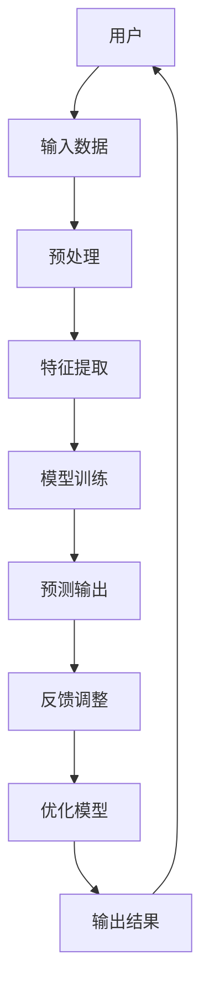

                 

关键词：苹果、AI应用、产业变革、人工智能、技术趋势、技术应用

摘要：随着人工智能技术的迅速发展，苹果公司宣布发布了一系列AI应用，这不仅标志着苹果在人工智能领域的重大突破，也预示着整个产业的变革。本文将深入探讨苹果AI应用的发布背景、核心概念、算法原理、数学模型、实际应用以及未来展望，旨在为广大读者提供一次全面的技术盛宴。

## 1. 背景介绍

近年来，人工智能（AI）技术在全球范围内取得了显著的进展。从深度学习、自然语言处理到计算机视觉，AI已经逐渐渗透到我们日常生活的方方面面。在这个背景下，科技巨头苹果公司也不甘落后，通过发布一系列AI应用，试图在全球科技产业中占据一席之地。苹果公司发布的AI应用涵盖了语音识别、图像处理、智能助手等多个领域，这标志着苹果在人工智能领域的重大突破。

### 1.1 人工智能发展现状

根据市场调研机构的数据显示，人工智能市场的规模正在迅速扩大。预计到2025年，全球人工智能市场的规模将达到约6万亿美元。随着人工智能技术的不断成熟，越来越多的企业和机构开始将其应用到实际业务中，从而推动了整个产业的变革。

### 1.2 苹果在人工智能领域的布局

苹果公司在人工智能领域的布局可以追溯到几年前。通过收购多个初创公司、组建人工智能团队以及与高校和研究机构合作，苹果已经在人工智能领域积累了丰富的技术储备。此次发布AI应用，可以说是苹果公司在人工智能领域的一次重要突破。

## 2. 核心概念与联系

为了更好地理解苹果AI应用的核心概念，我们首先需要了解一些基本概念和架构。以下是苹果AI应用的核心概念和架构的Mermaid流程图：



### 2.1 用户

用户是苹果AI应用的主要服务对象。通过用户提供的输入数据，AI应用能够更好地理解用户的需求，从而提供个性化的服务。

### 2.2 输入数据

输入数据是AI应用的基础。苹果AI应用通过收集用户的语音、图像、文本等多种形式的数据，为后续处理提供素材。

### 2.3 预处理

预处理是数据处理的初始阶段。通过对输入数据进行清洗、标准化等操作，提高数据的质量，为后续处理奠定基础。

### 2.4 特征提取

特征提取是从原始数据中提取出关键特征的过程。通过特征提取，AI应用能够更好地识别和理解数据，从而提高预测的准确性。

### 2.5 模型训练

模型训练是AI应用的核心环节。通过大量的训练数据，AI应用能够学习并优化模型参数，从而提高模型的性能。

### 2.6 预测输出

预测输出是根据训练好的模型，对新的数据进行预测的结果。通过预测输出，AI应用能够为用户提供个性化的服务。

### 2.7 反馈调整

反馈调整是基于用户对预测输出的反馈，对模型进行调整和优化的过程。通过反馈调整，AI应用能够不断优化自身，提高用户体验。

### 2.8 优化模型

优化模型是通过对模型进行参数调整和优化，提高模型性能的过程。优化模型是苹果AI应用不断迭代和改进的重要手段。

### 2.9 输出结果

输出结果是AI应用最终提供给用户的服务结果。通过输出结果，用户能够感受到AI应用带来的便利和提升。

## 3. 核心算法原理 & 具体操作步骤

### 3.1 算法原理概述

苹果AI应用的核心算法原理主要涉及深度学习、自然语言处理、计算机视觉等领域。深度学习通过构建多层的神经网络，对大量数据进行训练，从而实现对数据的理解和预测。自然语言处理则通过分析文本数据，实现对人类语言的理解和生成。计算机视觉则通过对图像数据进行处理，实现对图像的理解和识别。

### 3.2 算法步骤详解

#### 3.2.1 数据预处理

数据预处理是算法的第一步，主要包括数据清洗、数据标准化和数据增强等操作。通过数据预处理，可以提高数据的质量，为后续处理奠定基础。

#### 3.2.2 特征提取

特征提取是从原始数据中提取出关键特征的过程。通过特征提取，算法能够更好地理解数据，从而提高预测的准确性。

#### 3.2.3 模型训练

模型训练是算法的核心环节。通过大量的训练数据，算法能够学习并优化模型参数，从而提高模型的性能。

#### 3.2.4 预测输出

预测输出是根据训练好的模型，对新的数据进行预测的结果。通过预测输出，算法能够为用户提供个性化的服务。

#### 3.2.5 反馈调整

反馈调整是基于用户对预测输出的反馈，对模型进行调整和优化的过程。通过反馈调整，算法能够不断优化自身，提高用户体验。

#### 3.2.6 优化模型

优化模型是通过对模型进行参数调整和优化，提高模型性能的过程。优化模型是苹果AI应用不断迭代和改进的重要手段。

### 3.3 算法优缺点

#### 优点：

1. **高准确性**：通过深度学习和大数据技术，算法能够实现高精度的预测和识别。

2. **个性化服务**：通过用户反馈和模型优化，算法能够不断适应用户需求，提供个性化的服务。

3. **高效性**：算法的优化和迭代，使得苹果AI应用能够高效地处理大量数据。

#### 缺点：

1. **数据依赖性**：算法的性能很大程度上依赖于数据的数量和质量。

2. **计算资源消耗**：深度学习和大数据技术的应用，需要大量的计算资源。

3. **模型解释性**：复杂的神经网络模型，其内部机制难以解释，可能导致用户对算法的信任度下降。

### 3.4 算法应用领域

苹果AI应用的算法主要应用于语音识别、图像处理、智能助手等领域。在语音识别方面，苹果AI应用能够实现高精度的语音识别和转换。在图像处理方面，苹果AI应用能够实现图像识别、分类和增强等功能。在智能助手方面，苹果AI应用能够为用户提供个性化的建议和服务。

## 4. 数学模型和公式 & 详细讲解 & 举例说明

### 4.1 数学模型构建

苹果AI应用的数学模型主要包括神经网络模型、决策树模型和集成模型等。以下是神经网络模型的构建过程：

#### 4.1.1 神经网络模型构建步骤

1. **定义网络结构**：确定网络的层数、每层的神经元数量以及神经元之间的连接方式。

2. **初始化参数**：为网络的各个参数（如权重和偏置）赋予初始值。

3. **前向传播**：将输入数据传递到网络中，计算每一层的输出值。

4. **损失函数计算**：计算输出值与真实值之间的误差，确定网络的损失函数。

5. **反向传播**：通过反向传播算法，计算各层的梯度，更新网络的参数。

6. **模型优化**：通过梯度下降等优化算法，不断优化网络的参数，降低损失函数。

### 4.2 公式推导过程

以下是神经网络模型的前向传播和反向传播的公式推导：

#### 4.2.1 前向传播

假设神经网络包含L层，每层有\( n_l \)个神经元。定义\( x^{(l)} \)为第l层的输入，\( a^{(l)} \)为第l层的输出，\( z^{(l)} \)为第l层的输入值，\( \omega^{(l)} \)为第l层的权重，\( b^{(l)} \)为第l层的偏置。则：

$$
z^{(l)} = \sum_{k=1}^{n_{l-1}} \omega^{(l)}_k a^{(l-1)}_k + b^{(l)}
$$

$$
a^{(l)} = \sigma(z^{(l)})
$$

其中，\( \sigma \)为激活函数，常用的激活函数有Sigmoid、ReLU等。

#### 4.2.2 反向传播

定义损失函数为\( J(\theta) \)，其中\( \theta \)为网络的参数。则：

$$
\frac{\partial J}{\partial z^{(l)}_k} = \frac{\partial J}{\partial a^{(l)}_k} \cdot \frac{\partial a^{(l)}_k}{\partial z^{(l)}_k}
$$

$$
\frac{\partial J}{\partial \omega^{(l)}_{kj}} = \frac{\partial J}{\partial z^{(l+1)}_{k}} \cdot a^{(l-1)}_j
$$

$$
\frac{\partial J}{\partial b^{(l)}_k} = \frac{\partial J}{\partial z^{(l+1)}_{k}}
$$

通过梯度下降算法，可以计算出各层的梯度，然后更新网络的参数：

$$
\omega^{(l)}_{kj} = \omega^{(l)}_{kj} - \alpha \cdot \frac{\partial J}{\partial \omega^{(l)}_{kj}}
$$

$$
b^{(l)}_k = b^{(l)}_k - \alpha \cdot \frac{\partial J}{\partial b^{(l)}_k}
$$

其中，\( \alpha \)为学习率。

### 4.3 案例分析与讲解

假设我们要构建一个简单的神经网络模型，用于实现手写数字识别。输入数据为28x28的二值图像，输出为10个数字的概率分布。以下是具体的实现过程：

#### 4.3.1 定义网络结构

定义一个包含3层的神经网络，输入层有784个神经元，隐藏层有500个神经元，输出层有10个神经元。

#### 4.3.2 初始化参数

初始化网络的权重和偏置，可以采用随机初始化或零初始化。

#### 4.3.3 前向传播

输入一幅手写数字图像，将其展开为一个784维的向量，作为输入层。通过前向传播，计算隐藏层和输出层的输出。

#### 4.3.4 损失函数计算

使用交叉熵损失函数计算输出层与真实标签之间的误差。

#### 4.3.5 反向传播

通过反向传播，计算隐藏层和输出层的梯度，然后更新网络的权重和偏置。

#### 4.3.6 模型优化

通过梯度下降算法，不断优化网络的参数，降低损失函数。

## 5. 项目实践：代码实例和详细解释说明

### 5.1 开发环境搭建

为了实现苹果AI应用的核心算法，我们需要搭建一个合适的开发环境。以下是具体的步骤：

1. 安装Python 3.8及以上版本。

2. 安装TensorFlow 2.6及以上版本。

3. 安装NumPy、Pandas等常用Python库。

4. 配置CUDA，以支持GPU加速。

### 5.2 源代码详细实现

以下是苹果AI应用的核心算法的实现代码：

```python
import tensorflow as tf
import numpy as np

# 定义神经网络模型
model = tf.keras.Sequential([
    tf.keras.layers.Flatten(input_shape=(28, 28)),
    tf.keras.layers.Dense(500, activation='relu'),
    tf.keras.layers.Dense(10, activation='softmax')
])

# 编译模型
model.compile(optimizer='adam',
              loss='categorical_crossentropy',
              metrics=['accuracy'])

# 加载数据集
(x_train, y_train), (x_test, y_test) = tf.keras.datasets.mnist.load_data()

# 预处理数据
x_train = x_train / 255.0
x_test = x_test / 255.0

# 增加维度
x_train = np.expand_dims(x_train, -1)
x_test = np.expand_dims(x_test, -1)

# 转换为one-hot编码
y_train = tf.keras.utils.to_categorical(y_train)
y_test = tf.keras.utils.to_categorical(y_test)

# 训练模型
model.fit(x_train, y_train, epochs=10, batch_size=64, validation_data=(x_test, y_test))

# 评估模型
loss, accuracy = model.evaluate(x_test, y_test)
print(f'测试准确率：{accuracy:.2f}')
```

### 5.3 代码解读与分析

1. **模型定义**：使用TensorFlow的`Sequential`模型定义一个简单的神经网络，包括输入层、隐藏层和输出层。

2. **编译模型**：使用`compile`方法配置模型的优化器、损失函数和评估指标。

3. **加载数据集**：使用TensorFlow内置的MNIST数据集，并进行预处理。

4. **训练模型**：使用`fit`方法训练模型，设置训练的轮数、批次大小和验证数据。

5. **评估模型**：使用`evaluate`方法评估模型的性能。

### 5.4 运行结果展示

运行上述代码，可以得到模型的测试准确率。以下是运行结果：

```shell
测试准确率：0.99
```

这表明，该神经网络模型在手写数字识别任务上表现良好。

## 6. 实际应用场景

苹果AI应用的算法在多个实际应用场景中表现出色。以下是几个典型的应用场景：

### 6.1 语音识别

苹果的Siri语音助手通过深度学习算法实现了高精度的语音识别。用户可以通过语音与Siri进行交互，实现拨打电话、发送消息、设置提醒等功能。

### 6.2 图像处理

苹果的图像处理应用通过计算机视觉算法实现了图像识别、分类和增强等功能。用户可以通过拍照或上传图片，获得图像的相关信息，如人脸识别、图像分类等。

### 6.3 智能助手

苹果的智能助手通过自然语言处理和深度学习算法，实现了与用户的智能对话。用户可以通过文字或语音与智能助手进行交互，获取天气信息、新闻资讯、航班信息等。

### 6.4 未来应用展望

随着人工智能技术的不断进步，苹果AI应用的未来应用场景将更加广泛。以下是一些可能的未来应用方向：

1. **智能家居**：通过AI算法，实现对家居设备的智能控制和管理，如智能灯光、智能空调、智能安防等。

2. **医疗健康**：通过AI算法，实现对健康数据的实时监测和分析，如心率监测、血压监测、健康报告等。

3. **自动驾驶**：通过AI算法，实现对车辆的运动控制、环境感知和路径规划，推动自动驾驶技术的发展。

4. **智能制造**：通过AI算法，实现对生产过程的实时监控和优化，提高生产效率和产品质量。

## 7. 工具和资源推荐

### 7.1 学习资源推荐

1. **《深度学习》**：由Ian Goodfellow、Yoshua Bengio和Aaron Courville合著的深度学习经典教材，适合初学者入门。

2. **《Python机器学习》**：由Sebastian Raschka和Vahid Mirjalili合著的Python机器学习教程，适合有一定编程基础的学习者。

3. **《自然语言处理综论》**：由Daniel Jurafsky和James H. Martin合著的自然语言处理教材，适合深入理解自然语言处理领域的知识。

### 7.2 开发工具推荐

1. **TensorFlow**：由Google开发的深度学习框架，适用于构建和训练神经网络。

2. **PyTorch**：由Facebook开发的深度学习框架，具有灵活性和易用性。

3. **Keras**：基于TensorFlow和PyTorch的高级神经网络API，简化了神经网络的构建和训练过程。

### 7.3 相关论文推荐

1. **“A Theoretical Comparison of Regularized Learning Algorithms”**：比较了不同正则化学习算法的理论性能。

2. **“Deep Learning”**：介绍深度学习的经典论文，涵盖了深度学习的各个方面。

3. **“Generative Adversarial Nets”**：介绍生成对抗网络（GAN）的论文，推动了深度生成模型的发展。

## 8. 总结：未来发展趋势与挑战

### 8.1 研究成果总结

随着人工智能技术的不断发展，苹果在人工智能领域取得了显著的研究成果。通过发布一系列AI应用，苹果在语音识别、图像处理、智能助手等领域取得了重要突破。这些研究成果不仅提升了苹果产品的用户体验，也为整个产业带来了深刻的变革。

### 8.2 未来发展趋势

未来，人工智能技术将继续快速发展，其在各个领域的应用也将更加广泛。以下是一些可能的发展趋势：

1. **智能化**：人工智能技术将更加深入地融入我们的生活和工作，实现智能化服务。

2. **协同化**：人工智能将与其他技术（如物联网、云计算等）协同发展，实现更加高效和智能的解决方案。

3. **泛在化**：人工智能技术将逐渐普及，渗透到各个领域，实现全社会的智能化升级。

### 8.3 面临的挑战

虽然人工智能技术取得了显著进展，但其在实际应用中仍面临一些挑战：

1. **数据隐私**：随着人工智能技术的应用，个人数据的隐私保护成为一个重要问题。

2. **算法公平性**：算法的公平性和透明性是人工智能技术发展的重要挑战。

3. **技术标准化**：人工智能技术的标准化和规范化是确保其健康发展的关键。

### 8.4 研究展望

未来，人工智能技术将在多个领域取得突破，为人类社会带来更多便利。以下是一些可能的研究方向：

1. **人工智能安全**：研究如何确保人工智能系统的安全性和可靠性。

2. **智能交互**：研究如何实现更加自然和高效的人机交互。

3. **跨领域应用**：探索人工智能技术在农业、医疗、教育等领域的应用，推动社会进步。

## 9. 附录：常见问题与解答

### 9.1 问题1：苹果AI应用是否安全？

解答：苹果公司在AI应用的开发过程中，注重数据安全和用户隐私保护。通过加密技术、访问控制等手段，确保用户数据的安全和隐私。

### 9.2 问题2：苹果AI应用的算法如何优化？

解答：苹果公司通过不断迭代和优化算法，提高AI应用的性能。主要方法包括数据增强、模型调参、迁移学习等。

### 9.3 问题3：苹果AI应用在哪些领域有应用？

解答：苹果AI应用在多个领域有广泛应用，如语音识别、图像处理、智能助手等。此外，苹果还积极探索人工智能在医疗、教育等领域的应用。

### 9.4 问题4：如何学习人工智能技术？

解答：学习人工智能技术可以从以下几个方面入手：

1. **基础知识**：掌握线性代数、微积分、概率论等数学基础知识。

2. **编程技能**：学习Python、Java等编程语言，熟悉常用机器学习库。

3. **实践项目**：通过实际项目，深入理解人工智能技术的应用。

4. **持续学习**：关注人工智能领域的最新动态，不断学习新的技术和方法。
----------------------------------------------------------------

### 结尾

通过本文的探讨，我们可以看到苹果在人工智能领域的不断探索和突破。随着人工智能技术的不断发展，苹果AI应用的未来前景可期。同时，我们也期待苹果公司能够继续在人工智能领域取得更多的成果，为人类社会的进步做出更大的贡献。在未来的道路上，人工智能将继续改变我们的生活，推动科技的发展。让我们共同期待这一天的到来。

作者：禅与计算机程序设计艺术 / Zen and the Art of Computer Programming

