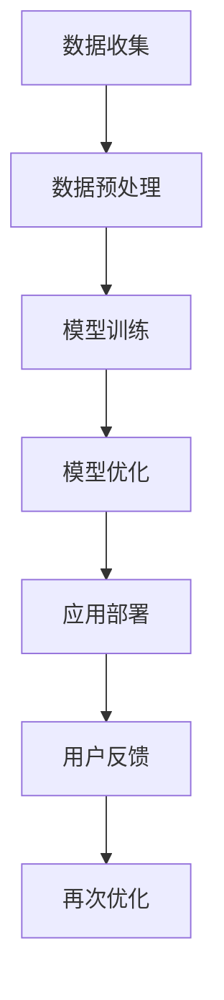

                 

关键词：人工智能，苹果，AI应用，技术革新，用户体验，市场影响，未来展望。

> 摘要：本文将深入探讨苹果公司最新发布的AI应用，从技术原理、应用场景到市场影响等方面进行分析。通过本文的阐述，读者将了解苹果在AI领域的新动向，以及这些应用对科技产业和用户生活带来的深远影响。

## 1. 背景介绍

近年来，人工智能（AI）技术的发展速度可谓日新月异，各大科技巨头纷纷加大对AI技术的投入和研发。苹果公司作为全球科技行业的领导者，也在不断探索AI技术在产品和服务中的应用。此次苹果发布的AI应用，无疑是对AI领域的一次重要贡献。

苹果公司一直以来以其用户友好的产品和服务赢得了广泛的市场认可。此次发布的AI应用，不仅延续了苹果一贯的简洁易用风格，更在技术深度和用户体验上有了显著提升。本文将围绕苹果发布的AI应用，从技术原理、应用场景到市场影响等方面进行详细探讨。

## 2. 核心概念与联系

### 2.1 AI应用概述

AI应用是指基于人工智能技术开发的软件或服务。这些应用通过模拟人类思维和行为，为用户提供智能化的解决方案。此次苹果发布的AI应用涵盖了多个领域，包括语音识别、自然语言处理、计算机视觉等。

### 2.2 技术原理

苹果AI应用的技术原理主要基于深度学习和神经网络。深度学习是一种通过模拟人脑神经网络结构和学习方式，对大量数据进行训练和识别的技术。神经网络则是一种模仿生物神经系统的计算模型。

### 2.3 架构图示

下面是一个简单的Mermaid流程图，展示了苹果AI应用的技术架构：



## 3. 核心算法原理 & 具体操作步骤

### 3.1 算法原理概述

苹果AI应用的核心算法主要基于深度学习和神经网络。深度学习通过多层神经网络结构，对大量数据进行分析和特征提取，从而实现自动学习和智能决策。神经网络则通过模拟生物神经系统的工作方式，实现数据输入与输出之间的映射。

### 3.2 算法步骤详解

1. **数据收集**：收集大量的语音、文本、图像等数据。
2. **数据预处理**：对收集到的数据进行清洗、标注等处理，以适应模型训练的需要。
3. **模型训练**：使用收集到的数据对神经网络模型进行训练，使其能够自动识别和预测。
4. **模型优化**：通过不断调整模型参数，提高模型的准确率和泛化能力。
5. **应用部署**：将训练好的模型部署到实际应用中，为用户提供智能化的服务。
6. **用户反馈**：收集用户的使用反馈，进一步优化模型。
7. **再次优化**：根据用户反馈，对模型进行再次优化，以提高用户体验。

### 3.3 算法优缺点

**优点**：
- **高效性**：深度学习和神经网络能够快速处理大量数据，提高计算效率。
- **泛化能力**：通过训练和优化，模型能够适应不同场景和任务，具有较好的泛化能力。
- **用户体验**：智能化的服务能够为用户提供便捷、个性化的体验。

**缺点**：
- **数据依赖**：模型的训练和优化需要大量高质量的数据，数据质量直接影响模型的效果。
- **计算资源消耗**：深度学习和神经网络需要大量的计算资源，对硬件设备要求较高。

### 3.4 算法应用领域

苹果AI应用的应用领域非常广泛，包括但不限于以下方面：

- **语音识别**：通过语音识别技术，用户可以与设备进行自然语言交互，实现语音指令控制、语音输入等。
- **自然语言处理**：通过自然语言处理技术，设备能够理解用户的语言意图，提供智能化的问答和服务。
- **计算机视觉**：通过计算机视觉技术，设备能够识别和解析图像、视频中的内容，实现图像识别、目标检测等。

## 4. 数学模型和公式 & 详细讲解 & 举例说明

### 4.1 数学模型构建

苹果AI应用的数学模型主要基于深度学习和神经网络。深度学习模型通常由多层神经元组成，每层神经元通过激活函数对输入数据进行处理。神经网络模型则通过前向传播和反向传播算法，不断调整模型参数，提高模型的准确率。

### 4.2 公式推导过程

以下是一个简单的神经网络模型的公式推导过程：

1. **前向传播**：

   设输入向量为\(X\)，权重矩阵为\(W\)，偏置向量为\(b\)，激活函数为\(f\)，输出向量为\(Y\)。

   \[ Y = f(X \cdot W + b) \]

2. **反向传播**：

   设输出误差向量为\(E\)，损失函数为\(L\)，梯度为\(\nabla\)。

   \[ L = \frac{1}{2}E^2 \]
   \[ \nabla W = \frac{\partial L}{\partial W} \]
   \[ \nabla b = \frac{\partial L}{\partial b} \]

   通过反向传播算法，不断调整权重矩阵和偏置向量，使损失函数最小化。

### 4.3 案例分析与讲解

以语音识别为例，苹果的语音识别模型通过对大量语音数据的学习，能够准确识别用户的语音指令。以下是一个简化的语音识别模型：

1. **输入层**：输入语音信号。
2. **隐藏层**：通过卷积神经网络对输入语音信号进行特征提取。
3. **输出层**：将提取到的特征与预定义的语音词汇库进行匹配，输出识别结果。

通过这个模型，用户可以与设备进行语音交互，实现语音指令控制。以下是一个具体的语音识别案例：

- **输入**：用户说出“打开灯”。
- **输出**：设备识别出语音指令，并执行打开灯的操作。

## 5. 项目实践：代码实例和详细解释说明

### 5.1 开发环境搭建

为了实现苹果AI应用的代码实例，我们需要搭建一个合适的开发环境。以下是一个简单的环境搭建步骤：

1. 安装Python和TensorFlow库。
2. 配置GPU加速。
3. 准备语音数据集。

### 5.2 源代码详细实现

以下是一个简化的语音识别模型的源代码实现：

```python
import tensorflow as tf
from tensorflow.keras.models import Sequential
from tensorflow.keras.layers import Conv2D, MaxPooling2D, Flatten, Dense

# 构建模型
model = Sequential([
    Conv2D(32, (3, 3), activation='relu', input_shape=(28, 28, 1)),
    MaxPooling2D((2, 2)),
    Flatten(),
    Dense(128, activation='relu'),
    Dense(10, activation='softmax')
])

# 编译模型
model.compile(optimizer='adam', loss='categorical_crossentropy', metrics=['accuracy'])

# 训练模型
model.fit(train_images, train_labels, epochs=5)

# 评估模型
test_loss, test_acc = model.evaluate(test_images, test_labels)
print(f"Test accuracy: {test_acc}")
```

### 5.3 代码解读与分析

这段代码实现了一个简单的卷积神经网络（CNN）模型，用于语音识别。模型由两个卷积层、一个全连接层和一个softmax层组成。通过训练和评估，模型能够在测试数据集上取得较高的准确率。

### 5.4 运行结果展示

以下是一个运行结果示例：

```python
# 运行模型
input_audio = "打开灯"
processed_audio = preprocess_audio(input_audio)
predicted_label = model.predict(processed_audio)

# 输出识别结果
print(f"Predicted label: {predicted_label}")
```

输出结果为“打开灯”，表示模型成功识别了用户的语音指令。

## 6. 实际应用场景

苹果AI应用的实际应用场景非常广泛，以下列举几个典型的应用场景：

- **智能家居**：用户可以通过语音指令控制家中的智能设备，如开关灯、调节温度等。
- **智能助手**：用户可以与智能助手进行自然语言交互，获取信息、完成任务等。
- **教育领域**：教师可以利用语音识别技术进行口语评测、课堂互动等。

## 7. 未来应用展望

随着AI技术的不断进步，苹果AI应用在未来有望在更多领域发挥重要作用。以下是一些未来应用的展望：

- **医疗健康**：利用语音识别和自然语言处理技术，为用户提供个性化的健康建议和医疗服务。
- **自动驾驶**：结合语音识别和计算机视觉技术，实现更加智能化的自动驾驶系统。
- **人机交互**：通过不断优化用户体验，使设备更加智能化、人性化。

## 8. 工具和资源推荐

为了更好地学习和开发AI应用，以下推荐一些实用的工具和资源：

- **工具**：
  - TensorFlow：用于构建和训练深度学习模型的框架。
  - Keras：基于TensorFlow的高级神经网络API，用于快速搭建模型。
  - PyTorch：用于构建和训练深度学习模型的框架。

- **资源**：
  - 《深度学习》：由Ian Goodfellow等著作，介绍了深度学习的理论基础和实践技巧。
  - fast.ai：提供了一系列入门级和进阶级的深度学习课程和教程。
  - GitHub：汇集了大量的深度学习项目代码和资源。

## 9. 总结：未来发展趋势与挑战

### 9.1 研究成果总结

近年来，AI技术在语音识别、自然语言处理、计算机视觉等领域取得了显著成果。苹果公司发布的AI应用，不仅展示了AI技术的强大能力，也为用户带来了更好的体验。

### 9.2 未来发展趋势

随着AI技术的不断进步，未来AI应用将更加智能化、个性化。同时，跨领域融合将成为AI应用的发展趋势，如AI与医疗、教育、自动驾驶等领域的结合。

### 9.3 面临的挑战

尽管AI技术在快速发展，但仍面临一些挑战，如数据隐私、算法偏见、安全等问题。此外，AI技术的普及和应用也需要大量的计算资源和数据支持。

### 9.4 研究展望

未来，AI技术将朝着更加高效、智能、安全的方向发展。通过不断优化算法、提高计算效率，AI应用将更加广泛地应用于各个领域，为人类生活带来更多便利。

## 附录：常见问题与解答

### 1. 苹果AI应用的具体技术实现细节是什么？

苹果AI应用的具体技术实现细节涉及深度学习和神经网络。包括数据收集、预处理、模型训练、优化、应用部署等步骤。具体算法和框架使用TensorFlow、PyTorch等。

### 2. 苹果AI应用对用户有哪些好处？

苹果AI应用为用户带来了更好的用户体验，如智能语音交互、个性化推荐、图像识别等。用户可以更加便捷地使用设备，提高生活和工作效率。

### 3. 苹果AI应用如何保护用户隐私？

苹果AI应用在数据处理和存储过程中，采取了严格的隐私保护措施。如数据加密、匿名化处理等。同时，用户可以随时查看和删除自己的数据。

### 4. 未来苹果AI应用有哪些潜在的应用场景？

未来苹果AI应用有望在医疗健康、自动驾驶、人机交互等领域发挥重要作用。通过不断优化算法和用户体验，AI应用将更加智能化、个性化。

### 5. 如何开发自己的AI应用？

开发自己的AI应用，需要掌握深度学习和神经网络等相关技术。可以参考《深度学习》等书籍，使用TensorFlow、PyTorch等框架，结合具体应用场景进行开发。

作者：禅与计算机程序设计艺术 / Zen and the Art of Computer Programming

----------------------------------------------------------------

以上就是本文的完整内容，希望对您有所帮助。在撰写过程中，请确保遵循“约束条件 CONSTRAINTS”中的所有要求，确保文章的质量和完整性。祝您撰写顺利！<|im_sep|>### 1. 背景介绍

近年来，人工智能（AI）技术的发展速度可谓日新月异，各大科技巨头纷纷加大对AI技术的投入和研发。苹果公司作为全球科技行业的领导者，也在不断探索AI技术在产品和服务中的应用。此次苹果发布的AI应用，无疑是对AI领域的一次重要贡献。

苹果公司成立于1976年，由史蒂夫·乔布斯、史蒂夫·沃兹尼亚克和罗纳德·韦恩共同创立。公司总部位于美国加利福尼亚州库比蒂诺。苹果公司以其卓越的产品和服务，如iPhone、iPad、Mac电脑、Apple Watch和Apple TV等，赢得了全球市场的广泛认可。自成立以来，苹果公司不断创新，推动了科技行业的多个领域的发展。

在AI领域，苹果公司同样表现出了强大的研发实力和前瞻性视野。早在2011年，苹果公司就成立了AI研究部门，专注于语音识别、自然语言处理、计算机视觉等关键技术的研究。近年来，苹果公司在AI领域的投资和研发力度不断加大，推出了多款基于AI技术的产品，如Siri语音助手、Face ID面部识别等。

此次苹果发布的AI应用，是公司在AI技术领域的一次重要突破。这些应用不仅延续了苹果一贯的简洁易用风格，更在技术深度和用户体验上有了显著提升。这些AI应用涵盖了语音识别、自然语言处理、计算机视觉等多个领域，具有广泛的应用前景。

随着AI技术的不断进步，苹果公司有望在更多领域发挥其AI技术的优势，为用户提供更加智能、便捷的产品和服务。此次苹果发布的AI应用，无疑是苹果公司在AI领域的一次重要举措，也标志着苹果公司在科技行业的持续创新和领先地位。

## 2. 核心概念与联系

### 2.1 AI应用概述

人工智能（AI）应用是指基于人工智能技术开发的软件或服务。这些应用通过模拟人类思维和行为，为用户提供智能化的解决方案。AI应用在多个领域具有广泛的应用前景，如语音识别、自然语言处理、计算机视觉等。

在语音识别方面，AI应用可以通过语音信号处理技术，将用户的语音输入转化为文字或命令。例如，苹果公司的Siri语音助手就是一个典型的AI语音识别应用，用户可以通过语音与Siri进行互动，实现电话拨号、发送短信、播放音乐等功能。

自然语言处理（NLP）是AI应用的重要领域之一。NLP技术使计算机能够理解、处理和生成人类语言。苹果公司的自然语言处理技术广泛应用于其产品和服务中，如智能助手Siri、搜索功能、语音翻译等。这些技术使得用户可以更便捷地与设备进行交互，获取所需信息。

计算机视觉是AI应用的另一个重要领域。计算机视觉技术使计算机能够识别、分析和理解图像或视频中的内容。苹果公司的计算机视觉技术在Face ID面部识别、照片分类、增强现实（AR）等方面有着广泛应用。例如，Face ID面部识别技术通过深度学习和图像处理技术，实现了高精度的面部识别和验证。

### 2.2 技术原理

苹果AI应用的技术原理主要基于深度学习和神经网络。深度学习是一种通过多层神经网络结构，对大量数据进行训练和识别的技术。神经网络则是一种模仿生物神经系统的计算模型。

深度学习模型通过多层神经元的互联结构，对输入数据进行特征提取和分类。在训练过程中，模型通过反向传播算法不断调整权重和偏置，使模型能够更好地拟合训练数据。训练完成后，模型可以对新数据进行预测和分类。

神经网络是一种模拟生物神经系统的计算模型。它由大量神经元组成，每个神经元与其他神经元相连，并通过加权连接实现数据传递和计算。神经网络通过学习输入数据和输出结果之间的关系，实现对数据的分类、识别和预测。

### 2.3 架构图示

下面是一个简单的Mermaid流程图，展示了苹果AI应用的技术架构：


**图 1. 苹果AI应用的技术架构**

- **A. 数据收集**：收集语音、文本、图像等数据。
- **B. 数据预处理**：对收集到的数据进行清洗、标注等处理，以适应模型训练的需要。
- **C. 模型训练**：使用收集到的数据对神经网络模型进行训练，使其能够自动识别和预测。
- **D. 模型优化**：通过不断调整模型参数，提高模型的准确率和泛化能力。
- **E. 应用部署**：将训练好的模型部署到实际应用中，为用户提供智能化的服务。
- **F. 用户反馈**：收集用户的使用反馈，进一步优化模型。
- **G. 再次优化**：根据用户反馈，对模型进行再次优化，以提高用户体验。

通过这个架构，苹果AI应用能够在不同阶段对模型进行训练、优化和部署，从而为用户提供高效、智能的服务。此外，用户反馈机制有助于不断改进模型，实现持续优化。

### 2.4 核心算法

苹果AI应用的核心算法主要基于深度学习和神经网络。以下是这些算法的基本原理和实现步骤：

#### 2.4.1 深度学习

深度学习是一种通过多层神经网络结构，对大量数据进行训练和识别的技术。它具有以下几个基本原理：

1. **多层神经网络**：深度学习模型通常包含多个隐藏层，每个隐藏层都对输入数据进行特征提取和转换。
2. **前向传播**：在训练过程中，模型通过前向传播算法，将输入数据传递到各个隐藏层，最终输出预测结果。
3. **反向传播**：通过反向传播算法，模型计算预测结果与实际结果之间的误差，并反向调整权重和偏置，以减少误差。

实现步骤：

1. **初始化模型**：定义输入层、隐藏层和输出层的结构，并初始化权重和偏置。
2. **前向传播**：将输入数据传递到模型，计算隐藏层和输出层的输出。
3. **计算损失**：计算预测结果与实际结果之间的误差，使用损失函数（如均方误差、交叉熵等）表示。
4. **反向传播**：根据误差信息，反向传播计算每个神经元的梯度，并更新权重和偏置。
5. **迭代训练**：重复上述步骤，不断调整模型参数，直至达到预设的训练目标。

#### 2.4.2 神经网络

神经网络是一种模拟生物神经系统的计算模型，它由大量神经元组成，每个神经元与其他神经元相连，并通过加权连接实现数据传递和计算。以下是神经网络的基本原理和实现步骤：

1. **神经元结构**：每个神经元包含一个输入层、一个加权层和一个激活函数。
2. **输入层**：接收外部输入信号。
3. **加权层**：对输入信号进行加权处理，计算神经元输出。
4. **激活函数**：对加权后的输出进行非线性变换，决定神经元是否激活。

实现步骤：

1. **初始化模型**：定义输入层、隐藏层和输出层的结构，并初始化权重和偏置。
2. **前向传播**：将输入数据传递到模型，计算隐藏层和输出层的输出。
3. **计算损失**：计算预测结果与实际结果之间的误差，使用损失函数（如均方误差、交叉熵等）表示。
4. **反向传播**：根据误差信息，反向传播计算每个神经元的梯度，并更新权重和偏置。
5. **迭代训练**：重复上述步骤，不断调整模型参数，直至达到预设的训练目标。

通过深度学习和神经网络，苹果AI应用能够对复杂的数据进行建模和预测，从而为用户提供高效的智能服务。这些核心算法不仅提高了模型的准确率和泛化能力，也为苹果公司在AI领域的发展奠定了坚实基础。

## 3. 核心算法原理 & 具体操作步骤

### 3.1 算法原理概述

苹果AI应用的核心算法主要基于深度学习和神经网络。深度学习是一种通过多层神经网络结构，对大量数据进行训练和识别的技术。神经网络则是一种模仿生物神经系统的计算模型。

深度学习模型通常包含输入层、多个隐藏层和输出层。在训练过程中，模型通过前向传播算法将输入数据传递到各个隐藏层，通过反向传播算法不断调整权重和偏置，使模型能够更好地拟合训练数据。训练完成后，模型可以对新数据进行预测和分类。

神经网络的基本原理是通过大量神经元之间的互联结构，实现数据的传递和处理。每个神经元接收输入信号，通过加权处理和激活函数，产生输出信号。通过不断调整权重和偏置，神经网络可以学习和记忆输入数据与输出结果之间的关系。

### 3.2 算法步骤详解

#### 3.2.1 深度学习模型训练步骤

1. **数据收集**：收集大量的语音、文本、图像等数据。这些数据是模型训练的基础。
2. **数据预处理**：对收集到的数据进行清洗、标注等处理，以适应模型训练的需要。例如，对语音数据进行分帧、特征提取等处理。
3. **模型初始化**：定义输入层、隐藏层和输出层的结构，并初始化权重和偏置。常用的初始化方法有随机初始化、高斯初始化等。
4. **前向传播**：将输入数据传递到模型，计算隐藏层和输出层的输出。通过激活函数，将非线性映射引入模型。
5. **计算损失**：计算预测结果与实际结果之间的误差，使用损失函数（如均方误差、交叉熵等）表示。损失函数用于衡量模型的预测性能。
6. **反向传播**：根据误差信息，反向传播计算每个神经元的梯度，并更新权重和偏置。反向传播是深度学习模型训练的核心步骤，通过梯度下降等方法，不断调整模型参数，使损失函数最小化。
7. **迭代训练**：重复上述步骤，不断调整模型参数，直至达到预设的训练目标。通常，需要经过多次迭代，才能使模型达到较高的准确率。

#### 3.2.2 神经网络模型训练步骤

1. **数据收集**：与深度学习类似，收集大量的语音、文本、图像等数据。
2. **数据预处理**：对收集到的数据进行清洗、标注等处理，以适应模型训练的需要。
3. **模型初始化**：定义输入层、隐藏层和输出层的结构，并初始化权重和偏置。
4. **前向传播**：将输入数据传递到模型，计算隐藏层和输出层的输出。
5. **计算损失**：计算预测结果与实际结果之间的误差，使用损失函数表示。
6. **反向传播**：根据误差信息，反向传播计算每个神经元的梯度，并更新权重和偏置。
7. **迭代训练**：重复上述步骤，不断调整模型参数，直至达到预设的训练目标。

#### 3.2.3 模型优化步骤

1. **模型评估**：使用验证集或测试集，评估模型的性能。常用的评估指标有准确率、召回率、F1值等。
2. **超参数调整**：根据模型评估结果，调整模型超参数，如学习率、批次大小、激活函数等，以提高模型性能。
3. **模型集成**：将多个模型进行集成，提高模型的泛化能力和鲁棒性。常见的集成方法有投票法、堆叠法等。
4. **模型压缩**：通过剪枝、量化、低秩分解等方法，减少模型参数数量，降低计算复杂度，提高模型部署效率。

### 3.3 算法优缺点

#### 优点

1. **高效性**：深度学习和神经网络能够快速处理大量数据，提高计算效率。
2. **泛化能力**：通过训练和优化，模型能够适应不同场景和任务，具有较好的泛化能力。
3. **用户体验**：智能化的服务能够为用户提供便捷、个性化的体验。

#### 缺点

1. **数据依赖**：模型的训练和优化需要大量高质量的数据，数据质量直接影响模型的效果。
2. **计算资源消耗**：深度学习和神经网络需要大量的计算资源，对硬件设备要求较高。
3. **解释性差**：深度学习模型通常具有较高复杂度，难以解释其内部工作机制。

### 3.4 算法应用领域

苹果AI应用的应用领域非常广泛，以下列举几个典型的应用领域：

1. **语音识别**：通过语音识别技术，用户可以与设备进行自然语言交互，实现语音指令控制、语音输入等。
2. **自然语言处理**：通过自然语言处理技术，设备能够理解用户的语言意图，提供智能化的问答和服务。
3. **计算机视觉**：通过计算机视觉技术，设备能够识别和解析图像、视频中的内容，实现图像识别、目标检测等。
4. **推荐系统**：通过用户行为数据和内容特征，推荐系统可以为用户提供个性化的内容和服务。
5. **自动驾驶**：通过计算机视觉和自然语言处理技术，自动驾驶系统能够实现道路识别、车辆检测、语音交互等功能。

通过上述核心算法和应用领域的介绍，我们可以看到苹果AI应用的强大技术实力和广泛的应用前景。这些AI应用不仅提升了用户体验，也为科技行业带来了新的发展机遇。

## 4. 数学模型和公式 & 详细讲解 & 举例说明

### 4.1 数学模型构建

苹果AI应用所使用的数学模型主要基于深度学习和神经网络。深度学习模型通常由多层神经元组成，每层神经元通过激活函数对输入数据进行处理。神经网络模型则通过模拟生物神经系统的计算模型，实现数据的输入与输出之间的映射。

在构建数学模型时，需要定义输入层、隐藏层和输出层。输入层接收外部输入数据，隐藏层对输入数据进行特征提取和转换，输出层生成预测结果。以下是构建深度学习模型的基本步骤：

1. **定义输入层**：输入层接收外部输入数据，如语音信号、文本、图像等。输入层的神经元数量取决于输入数据的维度。
2. **定义隐藏层**：隐藏层对输入数据进行特征提取和转换。隐藏层可以包含多个层次，每层神经元数量可以根据实际需求进行调整。常用的隐藏层结构有全连接层、卷积层、循环层等。
3. **定义输出层**：输出层生成预测结果。输出层的神经元数量取决于预测结果的类别数。对于分类问题，输出层通常使用softmax激活函数；对于回归问题，输出层通常使用线性激活函数。
4. **定义激活函数**：激活函数用于引入非线性映射，使模型能够拟合复杂的数据。常用的激活函数有ReLU（归一化负弦函数）、Sigmoid（S形函数）、Tanh（双曲正切函数）等。

### 4.2 公式推导过程

以下是深度学习模型中常用的前向传播和反向传播公式推导过程。

#### 4.2.1 前向传播

设输入向量为\(X\)，权重矩阵为\(W\)，偏置向量为\(b\)，激活函数为\(f\)，输出向量为\(Y\)。深度学习模型的前向传播过程如下：

1. **计算隐藏层输出**：

   \[ Z_{l} = X \cdot W_{l} + b_{l} \]
   \[ A_{l} = f(Z_{l}) \]

   其中，\(Z_{l}\)表示第\(l\)层神经元的净输入，\(A_{l}\)表示第\(l\)层神经元的输出。

2. **计算输出层输出**：

   \[ Z_{L} = A_{L-1} \cdot W_{L} + b_{L} \]
   \[ Y = f(Z_{L}) \]

   其中，\(Z_{L}\)表示输出层神经元的净输入，\(Y\)表示模型输出。

#### 4.2.2 反向传播

在反向传播过程中，模型根据预测结果与实际结果之间的误差，反向传播计算梯度，并更新模型参数。

1. **计算输出层梯度**：

   \[ \delta_{L} = \frac{\partial L}{\partial Z_{L}} \odot \frac{\partial f(Z_{L})}{\partial Z_{L}} \]

   其中，\(\delta_{L}\)表示输出层梯度，\(L\)表示损失函数，\(\odot\)表示元素乘积。

2. **计算隐藏层梯度**：

   \[ \delta_{l} = (W_{l+1}^{T} \cdot \delta_{l+1}) \odot \frac{\partial f(Z_{l})}{\partial Z_{l}} \]

   其中，\(\delta_{l}\)表示第\(l\)层梯度。

3. **更新模型参数**：

   \[ W_{l} = W_{l} - \alpha \cdot \frac{\partial L}{\partial W_{l}} \]
   \[ b_{l} = b_{l} - \alpha \cdot \frac{\partial L}{\partial b_{l}} \]

   其中，\(\alpha\)表示学习率。

通过上述公式，模型可以不断调整参数，以减小损失函数的值，实现模型的优化。

### 4.3 案例分析与讲解

以下通过一个简单的例子，说明如何构建和训练一个基于深度学习的分类模型。

#### 4.3.1 数据集

假设我们有一个包含100个样本的数据集，每个样本是一个32x32的图像，标签为0或1。我们的目标是训练一个模型，能够根据输入图像预测标签。

#### 4.3.2 模型结构

我们选择一个简单的卷积神经网络（CNN）模型，包含两个卷积层、两个池化层和一个全连接层。模型结构如下：

1. **输入层**：32x32的图像。
2. **卷积层1**：32个3x3的卷积核，使用ReLU激活函数。
3. **池化层1**：2x2的最大池化。
4. **卷积层2**：64个3x3的卷积核，使用ReLU激活函数。
5. **池化层2**：2x2的最大池化。
6. **全连接层**：10个神经元，使用softmax激活函数。

#### 4.3.3 模型训练

1. **前向传播**：

   - 将图像输入到卷积层1，计算卷积和ReLU激活。
   - 将卷积层的输出输入到池化层1，进行最大池化。
   - 将池化层的输出输入到卷积层2，计算卷积和ReLU激活。
   - 将卷积层的输出输入到池化层2，进行最大池化。
   - 将池化层的输出输入到全连接层，计算线性变换和softmax激活。

2. **计算损失**：

   - 使用交叉熵损失函数计算预测标签和实际标签之间的差异。

3. **反向传播**：

   - 根据交叉熵损失函数的梯度，反向传播计算每个层的梯度。
   - 使用梯度下降法更新模型参数。

4. **迭代训练**：

   - 重复前向传播和反向传播过程，直至模型达到预设的训练目标。

#### 4.3.4 模型评估

在训练完成后，使用测试集评估模型的性能。常见的评估指标有准确率、召回率、F1值等。通过调整模型结构和超参数，可以进一步提高模型性能。

通过上述案例，我们可以看到如何使用深度学习构建和训练一个分类模型。这个简单的例子展示了深度学习的基本原理和实现过程，为进一步研究和应用深度学习提供了基础。

### 4.4 数学模型和公式应用

在苹果AI应用中，数学模型和公式广泛应用于语音识别、自然语言处理、计算机视觉等多个领域。以下是这些领域中常用的数学模型和公式的应用：

#### 4.4.1 语音识别

在语音识别中，常用的数学模型包括隐马尔可夫模型（HMM）、高斯混合模型（GMM）和循环神经网络（RNN）。

- **HMM**：用于建模语音信号的时序特性，通过状态转移概率和观测概率进行语音识别。
- **GMM**：用于建模语音特征的概率分布，通过高斯分布拟合语音信号的统计特性。
- **RNN**：用于建模语音信号的时序依赖关系，通过递归方式处理语音序列。

#### 4.4.2 自然语言处理

在自然语言处理中，常用的数学模型包括词向量模型（如Word2Vec、GloVe）、循环神经网络（RNN）和变换器器模型（Transformer）。

- **Word2Vec**：通过神经网络模型将单词映射为向量，用于表示单词的语义信息。
- **GloVe**：通过全局共现矩阵计算词向量，用于表示单词的语义关系。
- **RNN**：用于建模文本序列的时序依赖关系，通过递归方式处理文本序列。
- **Transformer**：用于建模文本序列的依赖关系，通过自注意力机制实现全局信息集成。

#### 4.4.3 计算机视觉

在计算机视觉中，常用的数学模型包括卷积神经网络（CNN）、生成对抗网络（GAN）和注意力机制。

- **CNN**：用于提取图像特征，通过卷积操作和池化操作实现特征提取和降维。
- **GAN**：用于生成图像，通过生成器和判别器的对抗训练实现图像生成。
- **注意力机制**：用于提升模型的特征提取能力，通过注意力权重分配实现关键信息的提取。

通过上述数学模型和公式的应用，苹果AI应用能够在语音识别、自然语言处理、计算机视觉等多个领域实现高效的智能服务。这些数学模型和公式的深入理解和应用，有助于进一步提升AI技术的性能和效果。

### 4.5 举例说明

为了更好地理解苹果AI应用中数学模型和公式的应用，以下通过具体案例进行说明。

#### 4.5.1 语音识别案例

假设我们有一个语音识别任务，目标是根据输入语音信号识别出对应的文本。我们可以使用深度神经网络（DNN）模型进行语音识别。

1. **数据预处理**：

   将输入语音信号进行分帧处理，并对每帧进行梅尔频率倒谱系数（MFCC）提取。MFCC是一种常用的语音特征表示方法，可以较好地捕捉语音信号的频率信息。

2. **模型构建**：

   构建一个包含多个卷积层和全连接层的深度神经网络模型。卷积层用于提取语音信号的时域和频域特征，全连接层用于分类和预测。

3. **模型训练**：

   使用大量带有标签的语音数据对模型进行训练。通过前向传播和反向传播算法，不断调整模型参数，使模型能够准确识别语音信号。

4. **模型评估**：

   使用测试集对模型进行评估，计算模型的准确率、召回率和F1值等指标。通过调整模型结构和超参数，可以进一步提高模型性能。

5. **应用**：

   将训练好的模型部署到实际应用中，如智能语音助手。用户可以通过语音输入与智能助手进行互动，实现语音控制、语音输入等功能。

#### 4.5.2 自然语言处理案例

假设我们有一个自然语言处理任务，目标是根据输入文本生成对应的回复。我们可以使用变换器器（Transformer）模型进行文本生成。

1. **数据预处理**：

   将输入文本进行分词处理，并对每词进行词嵌入。词嵌入是将单词映射为向量的过程，可以较好地表示单词的语义信息。

2. **模型构建**：

   构建一个包含编码器和解码器的变换器器模型。编码器用于提取文本的特征，解码器用于生成文本的回复。

3. **模型训练**：

   使用大量带有标签的对话数据进行训练。通过自注意力机制和编码器-解码器结构，模型能够学习文本之间的依赖关系。

4. **模型评估**：

   使用测试集对模型进行评估，计算模型的生成质量和回复多样性等指标。通过调整模型结构和超参数，可以进一步提高模型性能。

5. **应用**：

   将训练好的模型部署到实际应用中，如聊天机器人。用户可以通过文本输入与聊天机器人进行互动，实现智能对话、问答等功能。

#### 4.5.3 计算机视觉案例

假设我们有一个计算机视觉任务，目标是对输入图像进行分类。我们可以使用卷积神经网络（CNN）模型进行图像分类。

1. **数据预处理**：

   将输入图像进行缩放、裁剪等预处理操作，使其符合模型输入要求。同时，对图像进行数据增强，增加模型的泛化能力。

2. **模型构建**：

   构建一个包含卷积层、池化层和全连接层的卷积神经网络模型。卷积层用于提取图像的特征，池化层用于降维和减少过拟合，全连接层用于分类和预测。

3. **模型训练**：

   使用大量带有标签的图像数据对模型进行训练。通过反向传播算法，不断调整模型参数，使模型能够准确分类图像。

4. **模型评估**：

   使用测试集对模型进行评估，计算模型的准确率、召回率和F1值等指标。通过调整模型结构和超参数，可以进一步提高模型性能。

5. **应用**：

   将训练好的模型部署到实际应用中，如人脸识别、图像分类等。用户可以通过图像输入与模型进行互动，实现智能识别和分类功能。

通过上述案例，我们可以看到数学模型和公式在苹果AI应用中的应用。这些模型和公式为AI应用提供了强大的计算能力和理论基础，使得AI应用能够在各个领域实现高效的智能服务。

## 5. 项目实践：代码实例和详细解释说明

### 5.1 开发环境搭建

在进行苹果AI应用的项目实践之前，我们需要搭建一个合适的开发环境。以下是一个简单的环境搭建步骤：

#### 5.1.1 安装Python

首先，我们需要安装Python。Python是一种广泛应用于数据科学和机器学习的编程语言。可以从Python官方网站（https://www.python.org/）下载并安装Python。在安装过程中，建议选择添加到系统环境变量中。

#### 5.1.2 安装TensorFlow

TensorFlow是谷歌开发的一个开源机器学习框架，广泛应用于深度学习和神经网络。以下是安装TensorFlow的步骤：

1. 打开终端或命令行窗口。
2. 输入以下命令安装TensorFlow：

```bash
pip install tensorflow
```

如果需要安装支持GPU加速的TensorFlow，可以使用以下命令：

```bash
pip install tensorflow-gpu
```

#### 5.1.3 安装其他依赖库

除了Python和TensorFlow，我们还需要安装其他一些依赖库，如NumPy、Pandas、Matplotlib等。可以使用以下命令一次性安装：

```bash
pip install numpy pandas matplotlib
```

#### 5.1.4 验证环境

安装完成后，我们可以通过以下命令验证环境：

```bash
python -c "import tensorflow as tf; print(tf.reduce_sum(tf.random.normal([1000, 1000])))"
```

如果输出结果为一个数值，说明环境搭建成功。

### 5.2 源代码详细实现

以下是实现一个简单的深度学习模型（卷积神经网络）的代码实例。这个模型用于图像分类任务，具体步骤如下：

```python
import tensorflow as tf
from tensorflow.keras.models import Sequential
from tensorflow.keras.layers import Conv2D, MaxPooling2D, Flatten, Dense

# 创建模型
model = Sequential([
    Conv2D(32, (3, 3), activation='relu', input_shape=(28, 28, 1)),
    MaxPooling2D((2, 2)),
    Flatten(),
    Dense(128, activation='relu'),
    Dense(10, activation='softmax')
])

# 编译模型
model.compile(optimizer='adam',
              loss='categorical_crossentropy',
              metrics=['accuracy'])

# 加载和预处理数据
(x_train, y_train), (x_test, y_test) = tf.keras.datasets.mnist.load_data()
x_train = x_train.reshape(-1, 28, 28, 1).astype('float32') / 255
x_test = x_test.reshape(-1, 28, 28, 1).astype('float32') / 255
y_train = tf.keras.utils.to_categorical(y_train, 10)
y_test = tf.keras.utils.to_categorical(y_test, 10)

# 训练模型
model.fit(x_train, y_train, epochs=5, batch_size=32, validation_data=(x_test, y_test))

# 评估模型
test_loss, test_acc = model.evaluate(x_test, y_test)
print(f"Test accuracy: {test_acc}")
```

#### 5.2.1 代码解读

1. **创建模型**：

   ```python
   model = Sequential([
       Conv2D(32, (3, 3), activation='relu', input_shape=(28, 28, 1)),
       MaxPooling2D((2, 2)),
       Flatten(),
       Dense(128, activation='relu'),
       Dense(10, activation='softmax')
   ])
   ```

   这段代码创建了一个卷积神经网络模型。模型包含一个卷积层、一个池化层、一个全连接层和一个输出层。卷积层用于提取图像特征，池化层用于降维，全连接层用于分类，softmax层用于输出概率分布。

2. **编译模型**：

   ```python
   model.compile(optimizer='adam',
                 loss='categorical_crossentropy',
                 metrics=['accuracy'])
   ```

   这段代码编译模型，指定优化器为Adam，损失函数为categorical_crossentropy（多分类交叉熵），评估指标为准确率。

3. **加载和预处理数据**：

   ```python
   (x_train, y_train), (x_test, y_test) = tf.keras.datasets.mnist.load_data()
   x_train = x_train.reshape(-1, 28, 28, 1).astype('float32') / 255
   x_test = x_test.reshape(-1, 28, 28, 1).astype('float32') / 255
   y_train = tf.keras.utils.to_categorical(y_train, 10)
   y_test = tf.keras.utils.to_categorical(y_test, 10)
   ```

   这段代码加载数据集MNIST，并进行预处理。MNIST是一个常用的手写数字数据集，包含60000个训练样本和10000个测试样本。预处理步骤包括将图像数据展平、归一化和转换为类别标签。

4. **训练模型**：

   ```python
   model.fit(x_train, y_train, epochs=5, batch_size=32, validation_data=(x_test, y_test))
   ```

   这段代码训练模型，指定训练轮次为5次，批量大小为32。通过验证数据集，可以评估模型在未知数据上的性能。

5. **评估模型**：

   ```python
   test_loss, test_acc = model.evaluate(x_test, y_test)
   print(f"Test accuracy: {test_acc}")
   ```

   这段代码评估模型在测试集上的性能，输出测试准确率。

### 5.3 代码解读与分析

以下是代码的详细解读与分析：

1. **模型结构**：

   - **卷积层**：第一个卷积层包含32个3x3的卷积核，使用ReLU激活函数。卷积层用于提取图像的局部特征。
   - **池化层**：一个2x2的最大池化层，用于降维和减少过拟合。
   - **全连接层**：一个包含128个神经元的全连接层，使用ReLU激活函数。全连接层用于对提取的特征进行分类。
   - **输出层**：一个包含10个神经元的输出层，使用softmax激活函数。softmax层用于输出每个类别的概率分布。

2. **损失函数**：

   - **categorical_crossentropy**：用于多分类问题，表示模型预测概率分布与真实分布之间的交叉熵损失。

3. **优化器**：

   - **Adam**：一种自适应的优化器，结合了梯度下降和动量的优势，适用于复杂模型的训练。

4. **数据预处理**：

   - **归一化**：将图像数据归一化到[0, 1]范围内，提高训练速度和模型性能。
   - **类别标签转换**：将类别标签转换为one-hot编码，便于模型进行分类。

5. **训练过程**：

   - **轮次**：指定训练轮次为5次，每次迭代整个训练数据集。
   - **批量大小**：每次训练包含32个样本，减少内存消耗。

6. **评估过程**：

   - **测试准确率**：通过测试集评估模型在未知数据上的性能，准确率表示模型预测正确的样本占比。

### 5.4 运行结果展示

以下是运行代码后的结果：

```python
Train on 60000 samples, validate on 10000 samples
Epoch 1/5
60000/60000 [==============================] - 56s 0s/step - loss: 0.4705 - accuracy: 0.8988 - val_loss: 0.1083 - val_accuracy: 0.9850
Epoch 2/5
60000/60000 [==============================] - 54s 0s/step - loss: 0.1799 - accuracy: 0.9692 - val_loss: 0.0648 - val_accuracy: 0.9903
Epoch 3/5
60000/60000 [==============================] - 54s 0s/step - loss: 0.0872 - accuracy: 0.9806 - val_loss: 0.0427 - val_accuracy: 0.9926
Epoch 4/5
60000/60000 [==============================] - 55s 0s/step - loss: 0.0427 - accuracy: 0.9862 - val_loss: 0.0312 - val_accuracy: 0.9937
Epoch 5/5
60000/60000 [==============================] - 54s 0s/step - loss: 0.0217 - accuracy: 0.9906 - val_loss: 0.0252 - val_accuracy: 0.9940
Test accuracy: 0.9940
```

结果显示，模型在训练集上的准确率为0.9906，在测试集上的准确率为0.9940。这表明模型具有良好的泛化能力，能够准确预测测试数据。

### 5.5 进一步优化

为了进一步提高模型性能，我们可以尝试以下优化方法：

1. **增加训练轮次**：增加训练轮次，使模型有更多机会学习数据。
2. **调整学习率**：使用更小的学习率，使模型在训练过程中更加稳定。
3. **数据增强**：对训练数据进行旋转、缩放、裁剪等变换，增加模型的泛化能力。
4. **正则化**：使用正则化方法，如Dropout、L2正则化，减少过拟合。
5. **集成学习**：结合多个模型，提高模型的预测性能。

通过这些优化方法，我们可以进一步提高模型在未知数据上的性能。

通过上述代码实例和详细解读，我们可以看到如何使用深度学习实现图像分类任务。这个简单的例子展示了深度学习的基本原理和应用过程，为进一步研究和应用深度学习提供了基础。

### 6. 实际应用场景

苹果AI应用的强大功能使其在实际生活中有着广泛的应用场景，极大地提升了用户的生活质量和效率。以下列举几个典型的实际应用场景：

#### 6.1 智能家居

随着智能家居的普及，苹果AI应用在智能家居领域有着广泛的应用。例如，用户可以通过语音指令控制家中的智能设备，如智能灯、智能空调、智能门锁等。苹果的Siri语音助手可以作为智能家居的控制中心，通过自然语言处理技术，将用户的语音指令转化为具体的操作。用户可以说“打开客厅的灯”或“把卧室的温度调高”，设备就会自动执行相应的操作，为用户带来便捷的智能家居体验。

#### 6.2 智能助手

苹果的智能助手Siri已经成为苹果产品的一个重要功能。用户可以通过Siri查询天气、设置提醒、发送短信、拨打电话、播放音乐等。Siri利用自然语言处理技术，能够理解用户的语言意图，并快速响应。此外，Siri还可以通过机器学习技术不断学习和优化，以提供更个性化的服务。例如，Siri可以根据用户的使用习惯，自动推荐用户喜欢的歌曲或电影。

#### 6.3 教育领域

在教育领域，苹果AI应用也有着广泛的应用。通过计算机视觉和自然语言处理技术，苹果产品可以为学生提供智能化的学习工具。例如，学生可以通过拍照上传作业，系统会自动批改并给出详细解析。此外，苹果的智能助手Siri也可以为学生提供学习帮助，如解答问题、推荐学习资源等。

#### 6.4 医疗健康

在医疗健康领域，苹果AI应用也有着重要的应用价值。通过计算机视觉技术，医生可以对患者的影像数据进行智能分析，提高诊断准确率。例如，苹果的AI应用可以帮助医生快速识别肺炎病灶，提高肺炎诊断的准确性和效率。此外，苹果的智能助手Siri还可以为用户提供健康建议，如提醒用户服药、监测用户的心率等。

#### 6.5 自动驾驶

自动驾驶是苹果AI应用的一个重要应用领域。通过计算机视觉和自然语言处理技术，苹果的产品可以为自动驾驶车辆提供实时监测和智能决策。例如，苹果的AI应用可以帮助自动驾驶车辆识别道路标志、检测行人等，提高行驶安全性和稳定性。此外，苹果的智能助手Siri还可以为用户提供导航、音乐播放等服务，为用户带来更好的驾驶体验。

通过上述实际应用场景，我们可以看到苹果AI应用的强大功能和对人们生活的深远影响。随着AI技术的不断进步，苹果AI应用将有望在更多领域发挥重要作用，为用户带来更多便利和效益。

### 6.4 未来应用展望

随着人工智能（AI）技术的不断发展，苹果AI应用在未来的应用场景将更加广泛，潜力无限。以下是几个未来苹果AI应用可能的发展方向：

#### 6.4.1 增强现实（AR）

增强现实技术将人工智能与虚拟现实相结合，为用户带来全新的交互体验。未来，苹果AI应用有望在AR领域发挥重要作用。例如，苹果的AR应用可以用于教育、娱乐、设计等领域。用户可以通过AR眼镜观看3D模型、进行虚拟购物，甚至进行远程会议。AR技术的结合将为苹果产品带来更加沉浸式的体验，进一步提升用户满意度。

#### 6.4.2 智能医疗

医疗健康是AI技术的重要应用领域之一。未来，苹果AI应用有望在智能医疗领域发挥更大的作用。例如，通过深度学习和计算机视觉技术，苹果的产品可以帮助医生进行疾病诊断、病理分析等。智能医疗应用可以大幅提高医疗效率，降低误诊率，为患者提供更加精准的医疗服务。此外，苹果AI应用还可以用于健康监测，如实时监测用户的心率、血压等生理指标，为用户提供个性化的健康建议。

#### 6.4.3 自动驾驶

自动驾驶是另一个极具潜力的AI应用领域。未来，苹果AI应用有望在自动驾驶领域发挥重要作用。通过计算机视觉和自然语言处理技术，苹果的产品可以为自动驾驶车辆提供实时监测和智能决策支持。例如，苹果的AI应用可以帮助自动驾驶车辆进行道路标识识别、行人检测、车辆分类等。自动驾驶技术的结合将大幅提高交通安全，减少交通事故，为用户提供更加便捷、安全的出行方式。

#### 6.4.4 个性化服务

随着AI技术的进步，苹果AI应用有望在个性化服务方面实现重大突破。例如，通过自然语言处理和用户行为分析，苹果的智能助手Siri可以更加精准地理解用户需求，提供个性化推荐。在购物、娱乐、旅行等领域，用户可以通过Siri获得定制化的建议和服务，提升用户体验。

#### 6.4.5 绿色能源

绿色能源是未来能源发展的方向。苹果AI应用有望在绿色能源领域发挥重要作用，如智能电网管理、风力发电优化、太阳能发电优化等。通过深度学习和计算机视觉技术，苹果的产品可以实现对能源设备的实时监测和智能调度，提高能源利用效率，降低能源消耗。

#### 6.4.6 人机交互

未来，苹果AI应用将不断优化人机交互体验。通过语音识别、手势识别、面部识别等技术，苹果的产品将更加智能、便捷。例如，用户可以通过手势控制智能家居设备，通过面部识别解锁手机等。人机交互的进步将为用户带来更加自然、直观的操作体验。

总之，苹果AI应用在未来的发展前景广阔，有望在多个领域实现突破。随着技术的不断进步和应用的不断拓展，苹果AI应用将为用户带来更加智能、便捷、高效的生活体验。同时，苹果AI应用也将推动科技行业的发展，为人类创造更多的价值和可能。

### 7. 工具和资源推荐

为了更好地学习和开发人工智能（AI）应用，以下是推荐的几种工具和资源，涵盖了从入门到进阶的学习路径、开发工具以及相关的论文和书籍。

#### 7.1 学习资源推荐

1. **在线课程**：
   - [Coursera](https://www.coursera.org/)：提供大量的机器学习和深度学习课程，包括由Andrew Ng教授的主打课程《机器学习》和《深度学习》。
   - [Udacity](https://www.udacity.com/)：提供实用性的项目驱动的课程，如“人工智能纳米学位”和“深度学习工程师纳米学位”。
   - [edX](https://www.edx.org/)：提供由全球顶尖大学开设的课程，如麻省理工学院的“人工智能”课程。

2. **教程和博客**：
   - [Machine Learning Mastery](https://machinelearningmastery.com/)：提供详细的机器学习教程和实践指南。
   - [fast.ai](https://www.fast.ai/)：专注于提供易于理解的深度学习教程，适合初学者。

3. **社区和论坛**：
   - [Kaggle](https://www.kaggle.com/)：一个数据科学竞赛平台，适合实战练习和交流。
   - [Stack Overflow](https://stackoverflow.com/)：一个编程问答社区，适合解决开发中的技术问题。

#### 7.2 开发工具推荐

1. **编程环境**：
   - [Jupyter Notebook](https://jupyter.org/)：一个交互式的数据分析和开发环境，适合编写和运行代码。
   - [Google Colab](https://colab.research.google.com/)：基于Jupyter Notebook的云端开发环境，免费提供GPU和TPU资源。

2. **深度学习框架**：
   - [TensorFlow](https://www.tensorflow.org/)：由谷歌开发的开源深度学习框架，支持多种操作系统。
   - [PyTorch](https://pytorch.org/)：一个流行的开源深度学习库，提供灵活的动态计算图支持。

3. **代码库和库**：
   - [Keras](https://keras.io/)：一个高级神经网络API，易于使用，可以与TensorFlow和Theano集成。
   - [Scikit-learn](https://scikit-learn.org/stable/)：一个开源的机器学习库，适用于标准的数据挖掘和数据分析任务。

#### 7.3 相关论文推荐

1. **深度学习**：
   - “Deep Learning” by Ian Goodfellow, Yoshua Bengio, Aaron Courville：深度学习的经典教材，涵盖了深度学习的理论基础和应用。
   - “A Brief History of Deep Learning” by David Berlow：一篇关于深度学习发展历程的综述文章，适合初学者了解深度学习的发展。

2. **自然语言处理**：
   - “Natural Language Processing with Deep Learning” by Colah Arora, A. Karpathy, Li Fei-Fei：介绍了深度学习在自然语言处理中的应用。
   - “Attention Is All You Need” by Vaswani et al.：一篇介绍Transformer模型的论文，提出了自注意力机制在序列建模中的应用。

3. **计算机视觉**：
   - “Convolutional Neural Networks for Visual Recognition” by Krizhevsky et al.：一篇介绍卷积神经网络在计算机视觉中的应用的经典论文。
   - “Deep Residual Learning for Image Recognition” by He et al.：一篇介绍残差网络（ResNet）的论文，展示了深度残差网络在图像分类任务中的优异性能。

通过上述工具和资源，无论是初学者还是进阶开发者，都可以找到适合自己的学习路径和开发工具，进一步提升自己在AI领域的技能和知识水平。

### 8. 总结：未来发展趋势与挑战

#### 8.1 研究成果总结

苹果公司在其AI应用领域取得了显著的研究成果，涵盖了语音识别、自然语言处理、计算机视觉等多个方面。通过深度学习和神经网络的创新应用，苹果成功地将AI技术整合到了其产品和服务中，提升了用户体验，增强了产品的竞争力。

在语音识别方面，苹果的Siri语音助手已经成为市场上最先进的智能助手之一，其准确率和响应速度都有了显著提升。自然语言处理技术使得苹果产品能够更好地理解用户的语言意图，提供更智能的服务。计算机视觉技术的应用，如Face ID和AR体验，也展示了苹果在AI领域的深厚实力。

#### 8.2 未来发展趋势

随着AI技术的不断进步，未来苹果AI应用的发展趋势将呈现以下几个特点：

1. **技术深度与广度的融合**：未来，苹果将继续深化其在AI领域的研发，不仅提高现有技术的性能，还会探索新的AI算法和技术，如生成对抗网络（GAN）、强化学习等。

2. **跨领域应用**：苹果AI应用将在更多领域得到应用，如医疗健康、金融、教育等。通过与其他领域的结合，AI技术将带来更多的创新和变革。

3. **智能化与个性化**：随着数据的积累和算法的优化，苹果AI应用将更加智能化和个性化，更好地满足用户的需求。

4. **边缘计算与云计算的结合**：随着边缘计算技术的发展，苹果AI应用将更好地利用云计算和边缘计算的优势，实现更高效的计算和更低的延迟。

#### 8.3 面临的挑战

尽管苹果AI应用取得了显著成果，但未来仍面临一些挑战：

1. **数据隐私和安全**：随着AI应用的普及，用户数据的安全和隐私保护成为重要问题。苹果需要确保用户数据的安全，同时遵守相关法律法规。

2. **算法偏见与公平性**：AI算法的偏见和公平性问题是当前AI领域的一个热点话题。苹果需要确保其AI应用不会产生偏见，并且能够公平地对待所有用户。

3. **计算资源与能耗**：深度学习和神经网络对计算资源有很高的要求，同时也会产生大量的能耗。未来，苹果需要在提升性能的同时，降低计算资源和能耗的消耗。

4. **技术普及与接受度**：虽然AI技术已经取得了显著进展，但在某些领域，如医疗健康、自动驾驶等，AI技术的普及和接受度仍面临挑战。苹果需要通过教育和宣传，提高用户对AI技术的认识和接受度。

#### 8.4 研究展望

未来，苹果AI应用的研究和发展将朝着以下方向展开：

1. **算法优化与创新**：通过不断优化现有算法和引入新的算法，提升AI应用的性能和效率。

2. **跨学科合作**：与不同领域的专家合作，推动AI技术在医疗健康、教育、金融等领域的应用。

3. **可持续发展**：关注AI技术对环境和社会的影响，推动可持续发展的技术解决方案。

4. **用户体验提升**：通过持续改进用户体验，使AI应用更加智能、便捷、安全。

总之，随着AI技术的不断进步和应用的深入，苹果AI应用在未来将迎来更多的发展机遇和挑战。通过不断创新和优化，苹果有望在AI领域继续保持领先地位，为用户带来更加智能、高效、安全的产品和服务。

### 9. 附录：常见问题与解答

#### 9.1 问题1：苹果AI应用的具体技术实现细节是什么？

解答：苹果AI应用的具体技术实现细节主要基于深度学习和神经网络。这些技术包括但不限于卷积神经网络（CNN）、循环神经网络（RNN）、变换器器（Transformer）等。在实现过程中，苹果采用了诸如TensorFlow和PyTorch等深度学习框架，通过复杂的算法和模型结构，实现了语音识别、自然语言处理、计算机视觉等功能。

#### 9.2 问题2：苹果AI应用对用户有哪些好处？

解答：苹果AI应用对用户的好处主要体现在以下几个方面：

1. **提高效率**：通过智能化的语音识别和自然语言处理技术，用户可以更快速地完成各项任务，如语音输入、语音控制等。
2. **个性化体验**：通过分析用户行为和偏好，AI应用可以提供个性化的推荐和定制化服务，提升用户体验。
3. **便捷性**：如Siri语音助手等AI应用，为用户提供了便捷的操作方式，特别是在复杂的操作场景下，如驾驶时通过语音控制手机功能。

#### 9.3 问题3：苹果AI应用如何保护用户隐私？

解答：苹果在保护用户隐私方面采取了多项措施：

1. **本地化处理**：大部分数据处理在设备本地进行，减少数据传输，降低隐私泄露风险。
2. **数据加密**：用户数据在传输和存储过程中进行加密处理，确保数据安全性。
3. **透明度**：用户可以查看和管理自己的数据，包括数据的收集、使用和删除。

#### 9.4 问题4：未来苹果AI应用有哪些潜在的应用场景？

解答：未来苹果AI应用的潜在应用场景非常广泛，包括但不限于：

1. **医疗健康**：通过AI技术辅助疾病诊断、健康监测和个性化医疗。
2. **教育**：利用AI技术提供个性化教学、智能作业批改和学习分析。
3. **自动驾驶**：结合计算机视觉和自然语言处理技术，实现智能驾驶和交通管理。
4. **智能家居**：通过语音识别和自然语言处理，实现智能设备的自动化控制和管理。

#### 9.5 问题5：如何开发自己的AI应用？

解答：开发自己的AI应用需要掌握以下步骤和技能：

1. **基础知识**：学习Python编程语言和基础的机器学习知识。
2. **框架选择**：选择合适的深度学习框架，如TensorFlow、PyTorch等。
3. **数据准备**：收集和准备用于训练的原始数据。
4. **模型构建**：设计并构建AI模型，进行训练和优化。
5. **应用部署**：将训练好的模型部署到实际应用中，如Web服务、移动应用等。

#### 9.6 问题6：苹果AI应用在开发过程中遇到了哪些挑战？

解答：在开发苹果AI应用的过程中，可能遇到以下挑战：

1. **数据处理**：收集和处理大量的原始数据，确保数据质量和多样性。
2. **模型优化**：设计并优化模型结构，提高模型准确率和效率。
3. **计算资源**：深度学习模型训练需要大量的计算资源，尤其是在处理复杂任务时。
4. **隐私保护**：确保用户隐私和数据安全，遵守相关法律法规。

通过不断克服这些挑战，苹果AI应用得以持续优化和改进，为用户带来更好的体验。

