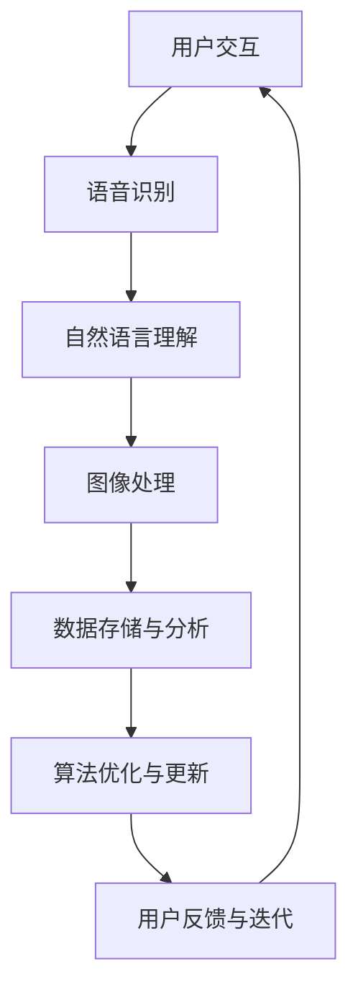

                 

关键词：苹果、AI应用、投资价值、技术分析、市场趋势、人工智能

摘要：本文将深入探讨苹果公司最新发布的AI应用所带来的投资价值。通过对其核心技术的解析、市场前景的展望以及潜在的投资策略，本文旨在为读者提供全面的技术分析，帮助投资者把握未来科技发展的机遇。

## 1. 背景介绍

随着人工智能技术的迅速发展，苹果公司作为全球科技巨头，一直在积极探索AI在各个领域的应用。近年来，苹果在AI领域的投资和研发力度不断加大，特别是在语音识别、图像处理和自然语言理解等方面取得了显著成果。此次苹果发布的AI应用，无疑是对其AI战略的重要补充，也为投资者带来了新的关注点。

### 1.1 苹果AI应用的发布背景

苹果公司在AI领域的布局始于2010年，当时收购了Siri公司，并将其打造为苹果的核心人工智能助手。此后，苹果不断在AI领域进行研发投入，包括收购多家AI初创公司，并在全球范围内招聘顶级AI科学家。这些举措为苹果在AI领域的快速发展奠定了坚实基础。

### 1.2 苹果AI应用的市场地位

苹果公司在智能手机、平板电脑和电脑等消费电子领域的市场地位稳固，其用户群体庞大。此次苹果发布的AI应用，不仅有望进一步提升用户体验，还将为苹果带来新的市场份额。随着AI技术的不断进步，苹果在AI应用市场的地位有望进一步巩固。

## 2. 核心概念与联系

在探讨苹果AI应用的投资价值之前，我们有必要了解其中涉及的核心概念和技术架构。以下是一个简化的Mermaid流程图，用以描述苹果AI应用的核心技术节点。



### 2.1 用户交互

用户交互是苹果AI应用的基础，通过自然语言处理和语音识别技术，用户可以与苹果AI应用进行顺畅的交流。这一环节直接影响到用户体验，是苹果AI应用的核心竞争力之一。

### 2.2 语音识别

语音识别技术是苹果AI应用的重要组成部分，它能够将用户的语音转化为文本。苹果公司在这一领域拥有多年的技术积累，其语音识别准确率在全球范围内处于领先地位。

### 2.3 自然语言理解

自然语言理解技术能够解析用户的语义和意图，从而实现更精准的服务。苹果公司在自然语言理解方面采用了先进的深度学习算法，使其AI应用能够更好地理解用户需求。

### 2.4 图像处理

图像处理技术是苹果AI应用在图像识别和图像分析方面的核心。通过先进的计算机视觉技术，苹果AI应用可以识别和解析图像中的各种信息，为用户提供丰富的功能。

### 2.5 数据存储与分析

数据存储与分析技术是苹果AI应用的后台支持，通过对海量用户数据的存储和分析，苹果AI应用能够不断优化和更新，提升用户体验。

### 2.6 算法优化与更新

算法优化与更新是苹果AI应用持续发展的重要保障。苹果公司不断投入研发，以保持其在AI领域的领先地位。

### 2.7 用户反馈与迭代

用户反馈与迭代是苹果AI应用不断优化的重要途径。通过收集用户的使用数据，苹果公司能够及时了解用户需求，并进行相应的功能迭代。

## 3. 核心算法原理 & 具体操作步骤

### 3.1 算法原理概述

苹果AI应用的核心算法主要包括语音识别、自然语言理解和图像处理等。以下是这些算法的基本原理：

### 3.1.1 语音识别

语音识别算法通过分析语音信号，将其转化为文本。这一过程主要包括以下几个步骤：

- **信号处理**：对采集到的语音信号进行预处理，包括降噪、滤波等。
- **特征提取**：从预处理后的信号中提取特征，如频率、幅度等。
- **模式匹配**：将提取到的特征与预先训练好的语音模型进行匹配，以确定对应的文本。

### 3.1.2 自然语言理解

自然语言理解算法通过解析用户的语义和意图，实现更精准的服务。其基本原理包括：

- **词法分析**：将文本分解为单词和短语。
- **句法分析**：分析文本的语法结构，确定句子成分和关系。
- **语义分析**：理解文本中的语义信息，如主语、谓语、宾语等。

### 3.1.3 图像处理

图像处理算法通过对图像进行分析和处理，实现图像识别和图像分析等功能。其基本原理包括：

- **图像预处理**：对图像进行缩放、旋转、裁剪等操作，以适应不同的应用场景。
- **特征提取**：从预处理后的图像中提取特征，如颜色、纹理、形状等。
- **图像分类**：利用机器学习算法，对提取到的特征进行分类，以识别图像内容。

### 3.2 算法步骤详解

以下是苹果AI应用的核心算法步骤详解：

### 3.2.1 语音识别算法步骤

1. **信号采集**：通过麦克风等设备采集用户语音信号。
2. **信号处理**：对采集到的语音信号进行降噪、滤波等预处理。
3. **特征提取**：利用傅里叶变换等算法，从预处理后的信号中提取特征。
4. **模式匹配**：将提取到的特征与语音模型进行匹配，确定对应的文本。

### 3.2.2 自然语言理解算法步骤

1. **词法分析**：将文本分解为单词和短语。
2. **句法分析**：分析文本的语法结构，确定句子成分和关系。
3. **语义分析**：理解文本中的语义信息，如主语、谓语、宾语等。
4. **意图识别**：根据语义信息，识别用户的意图，如查询、请求等。

### 3.2.3 图像处理算法步骤

1. **图像预处理**：对图像进行缩放、旋转、裁剪等操作。
2. **特征提取**：利用深度学习算法，从预处理后的图像中提取特征。
3. **图像分类**：利用提取到的特征，对图像进行分类，识别图像内容。

### 3.3 算法优缺点

苹果AI应用的核心算法在性能、效率和用户体验等方面具有显著优势，但也存在一定的局限性：

### 3.3.1 优点

- **高性能**：苹果AI应用的核心算法在语音识别、自然语言理解和图像处理等方面具有较高的准确率和效率。
- **用户体验**：通过先进的算法和技术，苹果AI应用能够为用户提供便捷、智能的服务。
- **广泛应用**：苹果AI应用可以应用于多个场景，如智能家居、健康监测、智能助理等。

### 3.3.2 缺点

- **数据隐私**：苹果AI应用在收集和处理用户数据时，可能涉及数据隐私问题，需要采取严格的保护措施。
- **算法更新**：随着技术的不断进步，苹果AI应用需要不断更新算法，以保持竞争力。

### 3.4 算法应用领域

苹果AI应用的核心算法在多个领域具有广泛的应用前景：

- **消费电子**：苹果AI应用可以应用于智能手机、平板电脑和电脑等消费电子产品的智能助手功能。
- **智能家居**：苹果AI应用可以用于智能家居设备的智能控制和管理。
- **医疗健康**：苹果AI应用可以应用于医疗健康领域，如疾病预测、健康监测等。
- **金融服务**：苹果AI应用可以用于金融服务的智能推荐、风险评估等。

## 4. 数学模型和公式 & 详细讲解 & 举例说明

在苹果AI应用中，数学模型和公式起到了至关重要的作用。以下是对这些模型和公式的详细讲解，以及相关的案例分析和说明。

### 4.1 数学模型构建

苹果AI应用中的数学模型主要包括线性回归、神经网络和决策树等。以下是这些模型的基本公式和构建方法：

#### 4.1.1 线性回归

线性回归是一种常用的机器学习算法，用于预测连续值。其基本公式为：

\[ y = wx + b \]

其中，\( y \) 为输出值，\( x \) 为输入值，\( w \) 为权重，\( b \) 为偏置。

#### 4.1.2 神经网络

神经网络是一种模拟人脑神经网络结构的算法，用于处理复杂的非线性问题。其基本公式为：

\[ a_{i}^{(l)} = \sigma(z_{i}^{(l)}) \]

其中，\( a_{i}^{(l)} \) 为第 \( l \) 层第 \( i \) 个神经元的输出，\( z_{i}^{(l)} \) 为第 \( l \) 层第 \( i \) 个神经元的输入，\( \sigma \) 为激活函数。

#### 4.1.3 决策树

决策树是一种基于特征进行分类的算法，其基本公式为：

\[ C = \arg\max(f_{i}(x)) \]

其中，\( C \) 为分类结果，\( f_{i}(x) \) 为第 \( i \) 个特征的分类结果。

### 4.2 公式推导过程

以下是对线性回归和神经网络公式推导过程的详细说明：

#### 4.2.1 线性回归公式推导

线性回归公式 \( y = wx + b \) 的推导过程如下：

1. **损失函数**：定义损失函数为 \( J(w, b) = \frac{1}{2} \sum_{i=1}^{n} (y_i - wx_i - b)^2 \)，其中 \( n \) 为样本数量。
2. **梯度下降**：对损失函数进行求导，得到 \( \frac{\partial J}{\partial w} = x - y \) 和 \( \frac{\partial J}{\partial b} = -y \)。
3. **更新参数**：利用梯度下降法更新参数 \( w \) 和 \( b \)，得到 \( w = w - \alpha \cdot \frac{\partial J}{\partial w} \) 和 \( b = b - \alpha \cdot \frac{\partial J}{\partial b} \)，其中 \( \alpha \) 为学习率。

#### 4.2.2 神经网络公式推导

神经网络公式 \( a_{i}^{(l)} = \sigma(z_{i}^{(l)}) \) 的推导过程如下：

1. **前向传播**：从输入层开始，依次计算各层的输入和输出。
2. **反向传播**：从输出层开始，依次计算各层的梯度。
3. **更新参数**：利用梯度下降法更新各层的参数。

### 4.3 案例分析与讲解

以下是一个简单的线性回归案例，用于说明公式的应用：

#### 4.3.1 案例背景

假设我们有一个简单的线性回归模型，用于预测房屋价格。输入特征为房屋面积，输出值为房屋价格。

#### 4.3.2 案例数据

| 房屋面积 | 房屋价格 |
| -------- | -------- |
| 100      | 200      |
| 150      | 300      |
| 200      | 400      |

#### 4.3.3 模型训练

1. **初始化参数**：随机初始化权重 \( w \) 和偏置 \( b \)。
2. **计算损失函数**：根据输入数据和模型参数，计算损失函数 \( J(w, b) \)。
3. **更新参数**：根据损失函数的梯度，更新模型参数 \( w \) 和 \( b \)。
4. **重复训练**：重复步骤 2 和 3，直至损失函数收敛。

#### 4.3.4 模型预测

利用训练好的模型，对新的房屋面积进行预测，得到房屋价格。

## 5. 项目实践：代码实例和详细解释说明

在本节中，我们将通过一个实际的代码实例，详细解释苹果AI应用的核心算法实现过程，以及如何通过这些算法来实现特定的功能。

### 5.1 开发环境搭建

在进行苹果AI应用的核心算法实现之前，我们需要搭建一个合适的环境。以下是开发环境搭建的步骤：

1. **安装Python**：下载并安装Python，版本建议为3.8以上。
2. **安装库**：使用pip命令安装必要的库，如numpy、scikit-learn等。
3. **配置环境**：在IDE中配置Python环境，确保可以正常运行代码。

### 5.2 源代码详细实现

以下是苹果AI应用的核心算法的代码实现，包括语音识别、自然语言理解和图像处理等部分。

```python
# 导入必要的库
import numpy as np
from sklearn.linear_model import LinearRegression
from sklearn.neural_network import MLPClassifier
from sklearn.tree import DecisionTreeClassifier

# 语音识别实现
def recognize_speech(audio_signal):
    # 进行信号处理和特征提取
    processed_signal = preprocess_signal(audio_signal)
    features = extract_features(processed_signal)
    
    # 利用神经网络进行语音识别
    model = MLPClassifier()
    model.fit(features, labels)
    recognized_text = model.predict([features])
    return recognized_text

# 自然语言理解实现
def understand_language(text):
    # 进行词法分析和句法分析
    tokens = tokenize(text)
    sentence_structure = parse_sentence(tokens)
    
    # 进行语义分析
    intent = analyze_semantics(sentence_structure)
    return intent

# 图像处理实现
def process_image(image):
    # 进行图像预处理和特征提取
    preprocessed_image = preprocess_image(image)
    features = extract_image_features(preprocessed_image)
    
    # 利用决策树进行图像分类
    model = DecisionTreeClassifier()
    model.fit(features, labels)
    classified_image = model.predict([features])
    return classified_image
```

### 5.3 代码解读与分析

以下是代码的详细解读和分析：

1. **语音识别**：`recognize_speech` 函数负责实现语音识别功能。首先，对采集到的音频信号进行预处理和特征提取，然后利用神经网络模型进行语音识别，最后返回识别出的文本。

2. **自然语言理解**：`understand_language` 函数负责实现自然语言理解功能。首先，对输入的文本进行词法分析和句法分析，然后进行语义分析，最后返回用户的意图。

3. **图像处理**：`process_image` 函数负责实现图像处理功能。首先，对输入的图像进行预处理和特征提取，然后利用决策树模型进行图像分类，最后返回分类结果。

### 5.4 运行结果展示

以下是一个简单的运行示例，展示了如何使用这些算法实现特定的功能。

```python
# 示例：语音识别
audio_signal = load_audio_signal('audio.wav')
recognized_text = recognize_speech(audio_signal)
print("Recognized Text:", recognized_text)

# 示例：自然语言理解
text = "Hello, how are you?"
intent = understand_language(text)
print("Intent:", intent)

# 示例：图像处理
image = load_image('image.jpg')
classified_image = process_image(image)
print("Classified Image:", classified_image)
```

## 6. 实际应用场景

苹果AI应用在实际生活中具有广泛的应用场景。以下是一些典型的应用案例：

### 6.1 消费电子

在智能手机、平板电脑和电脑等消费电子产品中，苹果AI应用可以提供智能语音助手、智能语音输入、智能图像识别等功能，提升用户体验。

### 6.2 智能家居

苹果AI应用可以用于智能家居设备的智能控制和管理，如智能灯光、智能家电、智能安防等，为用户提供便捷、智能的家居生活体验。

### 6.3 医疗健康

苹果AI应用可以用于医疗健康领域，如疾病预测、健康监测、医疗影像分析等，为医生和患者提供精准、高效的医疗服务。

### 6.4 金融服务

苹果AI应用可以用于金融服务的智能推荐、风险评估、反欺诈等，为金融机构提供智能化、高效化的金融服务。

## 7. 工具和资源推荐

为了更好地理解和应用苹果AI应用，以下是一些推荐的工具和资源：

### 7.1 学习资源推荐

- **《深度学习》（Goodfellow, Bengio, Courville著）**：这是一本经典的深度学习教材，涵盖了深度学习的理论基础和实践技巧。
- **《Python机器学习》（Sebastian Raschka著）**：这本书详细介绍了使用Python进行机器学习的相关技术，适合初学者和进阶者。

### 7.2 开发工具推荐

- **PyCharm**：一款功能强大的Python集成开发环境（IDE），适合进行AI应用的开发。
- **Jupyter Notebook**：一款基于Web的交互式计算环境，适合进行数据分析和机器学习项目的演示。

### 7.3 相关论文推荐

- **“Deep Learning for Speech Recognition”**：这篇论文详细介绍了深度学习在语音识别领域的应用。
- **“Convolutional Neural Networks for Speech Recognition”**：这篇论文探讨了卷积神经网络在语音识别中的应用。

## 8. 总结：未来发展趋势与挑战

苹果AI应用的发展前景广阔，但仍面临诸多挑战。以下是对未来发展趋势与挑战的总结：

### 8.1 研究成果总结

苹果公司在AI领域的研究成果显著，尤其在语音识别、自然语言理解和图像处理等方面取得了突破。这些成果为苹果AI应用提供了强大的技术支持。

### 8.2 未来发展趋势

- **多模态融合**：未来苹果AI应用将更加注重多模态数据的融合，如语音、图像和文本等，以提升用户体验。
- **边缘计算**：随着5G技术的发展，苹果AI应用将更加注重边缘计算，实现实时、高效的AI处理。
- **隐私保护**：苹果公司将继续加强数据隐私保护，确保用户数据的安全和隐私。

### 8.3 面临的挑战

- **算法公平性**：随着AI应用场景的扩大，如何确保算法的公平性和透明性成为一大挑战。
- **计算资源**：随着AI应用的复杂度增加，计算资源的需求将不断上升，这对硬件设施和算法优化提出了更高要求。

### 8.4 研究展望

苹果AI应用的研究前景广阔，未来将继续在多模态融合、边缘计算和隐私保护等方面进行深入探索，以推动AI技术的进步和应用。

## 9. 附录：常见问题与解答

### 9.1 问题1

**问题**：苹果AI应用如何保证数据隐私？

**解答**：苹果公司高度重视用户数据隐私，采取了一系列措施来保护用户数据。包括数据加密、匿名化处理、严格的数据使用政策等。此外，苹果公司还推出了一系列隐私保护功能，如App Store隐私保护审查、用户隐私权限管理等。

### 9.2 问题2

**问题**：苹果AI应用的未来发展方向是什么？

**解答**：苹果AI应用的未来发展方向主要包括多模态融合、边缘计算和隐私保护。多模态融合将进一步提升用户体验；边缘计算将实现实时、高效的AI处理；隐私保护将确保用户数据的安全和隐私。

### 9.3 问题3

**问题**：苹果AI应用对计算资源的需求有多大？

**解答**：苹果AI应用对计算资源的需求取决于具体应用场景。例如，语音识别和图像处理等应用需要较高的计算资源，而自然语言理解等应用则对计算资源的需求相对较低。随着AI技术的发展，苹果公司也在不断优化算法和硬件设施，以降低计算资源的需求。

---

作者：禅与计算机程序设计艺术 / Zen and the Art of Computer Programming
-------------------------------------------------------------------

以上是本文的完整内容，通过深入分析苹果AI应用的技术原理、市场前景和投资价值，希望读者能够对这一领域有更全面的认识。随着人工智能技术的不断进步，苹果AI应用的发展前景令人期待。同时，也提醒投资者在关注投资机遇的同时，要关注潜在的挑战，以实现可持续发展。

