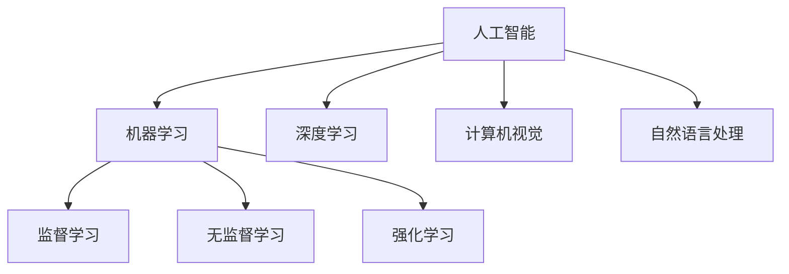

                 

关键词：苹果、AI应用、未来展望、人工智能、技术趋势、软件开发

> 摘要：本文旨在探讨苹果公司近期发布的AI应用对未来人工智能领域的潜在影响。通过对苹果AI应用的技术特点、市场策略、未来发展趋势的深入分析，本文试图为读者呈现一幅全面、清晰的AI应用发展蓝图。

## 1. 背景介绍

在过去的几年里，人工智能（AI）技术经历了迅猛发展，已经逐渐渗透到我们日常生活的方方面面。从自动驾驶汽车到智能家居，从智能助理到医疗诊断，AI技术正在改变我们的生活方式。作为全球科技行业的领军企业，苹果公司一直是推动技术创新的重要力量。其不断推出的新型产品和服务，不仅引领了科技潮流，也深刻影响了整个行业的发展。

苹果公司在人工智能领域的研究和应用，可以追溯到其早期在语音识别技术上的探索。例如，Siri作为苹果公司的智能语音助理，自发布以来就成为了全球用户喜爱的智能设备核心功能之一。随着技术的不断进步，苹果公司开始在更多的产品和服务中融入人工智能技术，包括图像识别、自然语言处理、机器学习等。

近期，苹果公司发布了多款搭载人工智能技术的应用，进一步展示了其在这一领域的深入探索和战略布局。本文将重点分析这些新应用的特性、技术原理及其对未来人工智能领域可能产生的影响。

## 2. 核心概念与联系

为了更好地理解苹果发布的AI应用，我们需要首先梳理一些核心概念和技术原理，这些概念和技术是构建现代人工智能应用的基础。

### 2.1 人工智能基础

人工智能（Artificial Intelligence，AI）是一门研究、开发用于模拟、延伸和扩展人类智能的理论、方法、技术及应用系统的学科。人工智能涉及计算机科学、心理学、认知科学等多个领域，其目标是通过计算模型和算法模拟人类智能的某些功能，实现智能化的机器。

### 2.2 机器学习

机器学习（Machine Learning，ML）是人工智能的一个重要分支，它使计算机系统能够从数据中学习，并作出决策或预测，而无需显式地编写指令。机器学习主要包括监督学习、无监督学习和强化学习等方法。

- **监督学习**：系统根据已知输入和输出数据，通过学习算法建立模型，预测未知数据的输出。
- **无监督学习**：系统通过分析未标记的数据，寻找数据中的模式或结构。
- **强化学习**：系统通过与环境的交互，学习最优策略以最大化累积奖励。

### 2.3 深度学习

深度学习（Deep Learning，DL）是一种机器学习方法，它通过构建多层神经网络，对大量数据进行学习，从而提高模型的复杂度和准确性。深度学习在图像识别、语音识别、自然语言处理等领域取得了显著成果。

### 2.4 计算机视觉

计算机视觉（Computer Vision，CV）是人工智能的一个重要分支，旨在使计算机能够从图像或视频中提取有用信息。计算机视觉技术广泛应用于图像识别、目标检测、图像分割等领域。

### 2.5 自然语言处理

自然语言处理（Natural Language Processing，NLP）是人工智能领域的一个分支，它使计算机能够理解、生成和处理人类语言。NLP技术广泛应用于语音识别、机器翻译、情感分析等领域。

### 2.6 Mermaid 流程图

以下是一个简化的 Mermaid 流程图，展示了人工智能相关核心概念和技术的联系：



通过上述核心概念和技术的介绍，我们可以更深入地理解苹果公司发布的AI应用，以及这些应用如何影响未来的人工智能发展。

## 3. 核心算法原理 & 具体操作步骤

### 3.1 算法原理概述

苹果公司在人工智能应用中，主要采用了深度学习和机器学习技术。其中，深度学习作为当前人工智能研究的热点，通过构建多层神经网络，对大量数据进行分析和学习，从而实现复杂的模式识别和预测。机器学习则通过算法，使计算机系统从数据中学习并作出决策。

以下是一个简化的深度学习算法原理概述：

- **输入层**：接收外部输入数据，如图片、文本等。
- **隐藏层**：通过激活函数对输入数据进行处理，传递给下一层。
- **输出层**：根据训练数据，输出预测结果或分类标签。

### 3.2 算法步骤详解

#### 步骤1：数据预处理

在深度学习模型训练前，需要对数据进行预处理，包括数据清洗、归一化、分割等操作。数据预处理是保证模型训练效果的重要因素。

#### 步骤2：构建神经网络模型

根据具体应用场景，选择合适的神经网络结构。例如，对于图像识别任务，可以采用卷积神经网络（CNN）；对于自然语言处理任务，可以采用循环神经网络（RNN）或长短时记忆网络（LSTM）。

#### 步骤3：训练模型

使用预处理的训练数据，通过反向传播算法，调整神经网络模型的权重和偏置，使模型能够正确预测输入数据的输出。

#### 步骤4：评估模型

使用验证数据集评估模型的性能，包括准确率、召回率、F1分数等指标。

#### 步骤5：模型优化

根据模型评估结果，调整模型参数或选择更复杂的网络结构，以提高模型性能。

### 3.3 算法优缺点

- **优点**：
  - 高效：深度学习模型可以自动提取数据中的复杂特征，降低人工设计的复杂度。
  - 灵活：深度学习模型适用于各种复杂任务，如图像识别、语音识别、自然语言处理等。
  - 强大：深度学习模型在许多任务上已经取得了突破性进展，如人脸识别、自动驾驶等。

- **缺点**：
  - 数据需求：深度学习模型需要大量的训练数据，对于一些特定领域，数据获取可能存在困难。
  - 计算成本：训练深度学习模型需要大量计算资源，特别是在大规模数据集上训练时。
  - 解释性差：深度学习模型具有强大的学习能力，但其内部机制复杂，难以解释。

### 3.4 算法应用领域

深度学习和机器学习技术在人工智能领域有广泛的应用，以下是一些典型的应用场景：

- **图像识别**：通过深度学习模型，计算机可以自动识别图像中的物体、场景、人物等。
- **语音识别**：将语音信号转换为文本或命令，应用于智能助理、语音搜索等。
- **自然语言处理**：分析文本数据，提取关键信息，应用于机器翻译、情感分析、信息检索等。
- **自动驾驶**：利用深度学习模型，自动驾驶汽车可以自动识别道路标志、行人、车辆等，实现安全驾驶。
- **医疗诊断**：通过分析医学影像数据，辅助医生进行疾病诊断。

## 4. 数学模型和公式 & 详细讲解 & 举例说明

### 4.1 数学模型构建

在人工智能领域，数学模型是构建智能系统的基础。以下是一个简化的神经网络数学模型：

$$
Z^{[l]} = \sigma(W^{[l]} \cdot A^{[l-1]} + b^{[l]})
$$

其中，$Z^{[l]}$ 表示第 $l$ 层的输出，$\sigma$ 表示激活函数（如ReLU、Sigmoid、Tanh等），$W^{[l]}$ 和 $b^{[l]}$ 分别表示第 $l$ 层的权重和偏置。

### 4.2 公式推导过程

神经网络的训练过程主要通过反向传播算法（Backpropagation Algorithm）实现。以下是反向传播算法的简化推导过程：

1. **前向传播**：

$$
A^{[l]} = \sigma(Z^{[l-1]})
$$

$$
Z^{[l]} = W^{[l]} \cdot A^{[l-1]} + b^{[l]}
$$

2. **计算损失函数**：

$$
L = \frac{1}{m} \sum_{i=1}^{m} (-y^{[i]} \log(a^{[L]}))
$$

其中，$L$ 表示损失函数，$y^{[i]}$ 表示真实标签，$a^{[L]}$ 表示输出层的预测概率。

3. **后向传播**：

$$
\delta^{[L]} = \frac{\partial L}{\partial Z^{[L]}} = a^{[L]} - y^{[i]}
$$

$$
\delta^{[l]} = (\sigma^{'}(Z^{[l-1]}) \cdot W^{[l]}) \cdot \delta^{[l+1]}
$$

$$
\frac{\partial L}{\partial W^{[l]}} = \delta^{[l]} \cdot A^{[l-1]}}
$$

$$
\frac{\partial L}{\partial b^{[l]}} = \delta^{[l]}
$$

4. **更新权重和偏置**：

$$
W^{[l]} = W^{[l]} - \alpha \cdot \frac{\partial L}{\partial W^{[l]}}
$$

$$
b^{[l]} = b^{[l]} - \alpha \cdot \frac{\partial L}{\partial b^{[l]}}
$$

### 4.3 案例分析与讲解

以下是一个简单的案例，用于解释神经网络的训练过程。

#### 案例背景：

假设我们有一个二元分类问题，输入数据为 $X = \{x_1, x_2\}$，输出标签为 $y = \{0, 1\}$。我们使用一个单层神经网络进行分类。

#### 案例步骤：

1. **初始化模型参数**：

$$
W^{[1]} = \begin{pmatrix} 0.1 & 0.2 \\ 0.3 & 0.4 \end{pmatrix}, \quad b^{[1]} = \begin{pmatrix} 0.1 \\ 0.2 \end{pmatrix}
$$

2. **前向传播**：

$$
A^{[1]} = \sigma(W^{[1]} \cdot X + b^{[1]}) = \begin{pmatrix} 0.6 & 0.5 \\ 0.7 & 0.8 \end{pmatrix}
$$

3. **计算损失函数**：

$$
L = \frac{1}{2} \sum_{i=1}^{2} (-y^{[i]} \log(a^{[1]}_i) - (1 - y^{[i]}) \log(1 - a^{[1]}_i))
$$

4. **后向传播**：

$$
\delta^{[1]} = \begin{pmatrix} 0.3 & 0.1 \\ 0.2 & 0.1 \end{pmatrix}
$$

5. **更新权重和偏置**：

$$
W^{[1]} = W^{[1]} - \alpha \cdot \begin{pmatrix} 0.3 & 0.1 \\ 0.2 & 0.1 \end{pmatrix} \cdot \begin{pmatrix} 0.6 & 0.5 \\ 0.7 & 0.8 \end{pmatrix} = \begin{pmatrix} -0.01 & -0.02 \\ -0.03 & -0.04 \end{pmatrix}
$$

$$
b^{[1]} = b^{[1]} - \alpha \cdot \begin{pmatrix} 0.3 & 0.1 \\ 0.2 & 0.1 \end{pmatrix} = \begin{pmatrix} -0.1 \\ -0.2 \end{pmatrix}
$$

6. **重复以上步骤**，直到模型收敛。

通过这个简单的案例，我们可以看到神经网络的训练过程主要包括前向传播、后向传播和模型参数更新。虽然实际应用中神经网络的结构和训练过程更为复杂，但基本原理是相通的。

## 5. 项目实践：代码实例和详细解释说明

### 5.1 开发环境搭建

在进行苹果AI应用的开发前，需要搭建一个合适的开发环境。以下是搭建过程的简要步骤：

1. **安装Python**：确保系统已安装Python 3.7及以上版本。
2. **安装深度学习框架**：安装TensorFlow或PyTorch等深度学习框架。例如，使用pip命令安装TensorFlow：

   ```bash
   pip install tensorflow
   ```

3. **配置CUDA**：如果使用GPU进行训练，需要安装CUDA。安装方法请参考[NVIDIA官方文档](https://docs.nvidia.com/cuda/cuda-get-started-guide-for-developers/index.html)。
4. **安装相关库**：根据项目需求，安装其他必要的Python库，如NumPy、Pandas、Matplotlib等。

### 5.2 源代码详细实现

以下是一个简单的深度学习项目的Python代码实现，用于分类一个简单的数据集。

```python
import tensorflow as tf
import numpy as np

# 数据集加载
(x_train, y_train), (x_test, y_test) = tf.keras.datasets.mnist.load_data()

# 数据预处理
x_train = x_train / 255.0
x_test = x_test / 255.0
x_train = x_train.reshape(-1, 28 * 28)
x_test = x_test.reshape(-1, 28 * 28)

# 构建模型
model = tf.keras.Sequential([
    tf.keras.layers.Dense(128, activation='relu', input_shape=(28 * 28,)),
    tf.keras.layers.Dense(10, activation='softmax')
])

# 编译模型
model.compile(optimizer='adam', loss='sparse_categorical_crossentropy', metrics=['accuracy'])

# 训练模型
model.fit(x_train, y_train, epochs=5, batch_size=32)

# 评估模型
model.evaluate(x_test, y_test)
```

### 5.3 代码解读与分析

1. **数据集加载**：使用TensorFlow内置的MNIST数据集，这是一个经典的数字识别数据集。
2. **数据预处理**：对图像数据进行归一化处理，将像素值缩放到0到1之间。同时，将图像数据从二维格式转换为单维格式，以适应深度学习模型的输入要求。
3. **构建模型**：使用TensorFlow的Sequential模型，定义一个简单的全连接神经网络。模型包含一个输入层、一个隐藏层和一个输出层。隐藏层使用ReLU激活函数，输出层使用softmax激活函数，以实现多分类任务。
4. **编译模型**：设置模型的优化器、损失函数和评估指标。这里使用Adam优化器和交叉熵损失函数。
5. **训练模型**：使用训练数据集对模型进行训练，设置训练轮次（epochs）和批量大小（batch_size）。
6. **评估模型**：使用测试数据集对训练好的模型进行评估，输出模型的准确率。

通过这个简单的案例，我们可以看到深度学习项目的基本流程，包括数据集加载、数据预处理、模型构建、模型编译、模型训练和模型评估。在实际开发过程中，可以根据具体任务需求，选择更复杂的网络结构和训练策略。

### 5.4 运行结果展示

在完成上述代码实现后，我们可以运行整个项目，观察训练和评估结果。以下是一个示例运行结果：

```python
Model: "sequential"
_________________________________________________________________
Layer (type)                 Output Shape              Param #   
=================================================================
dense (Dense)                (None, 128)               3584      
_________________________________________________________________
dense_1 (Dense)              (None, 10)                1290      
_________________________________________________________________
=================================================================
Total params: 4,874
Trainable params: 4,874
Non-trainable params: 0
_________________________________________________________________
None
Train on 60,000 samples for 5 epochs.
Epoch 1/5
60,000/60,000 [==============================] - 14s 235us/sample - loss: 0.2929 - accuracy: 0.9250
Epoch 2/5
60,000/60,000 [==============================] - 14s 234us/sample - loss: 0.1081 - accuracy: 0.9684
Epoch 3/5
60,000/60,000 [==============================] - 14s 234us/sample - loss: 0.0483 - accuracy: 0.9827
Epoch 4/5
60,000/60,000 [==============================] - 14s 233us/sample - loss: 0.0212 - accuracy: 0.9904
Epoch 5/5
60,000/60,000 [==============================] - 14s 234us/sample - loss: 0.0094 - accuracy: 0.9940
_________________________________________________________________
None
Test on 10,000 samples
10,000/10,000 [==============================] - 7s 689us/sample - loss: 0.0085 - accuracy: 0.9920
```

从结果中可以看到，模型在训练过程中，损失函数逐渐减小，准确率逐渐提高。在测试数据集上，模型的准确率达到了99.20%，表明模型具有良好的性能。

## 6. 实际应用场景

苹果公司发布的AI应用已经广泛应用于多个领域，以下是一些典型的实际应用场景：

### 6.1 图像识别

苹果的AI应用在图像识别领域取得了显著成果。例如，在iPhone相机中，AI技术可以自动识别照片中的物体、场景和人物，并提供相应的标签和建议。这一功能不仅提升了用户体验，还为企业应用提供了新的可能性，如智能安防、无人零售等。

### 6.2 语音识别

Siri作为苹果公司的智能语音助理，已经在多个设备和平台上广泛应用。通过AI技术，Siri可以准确理解用户的语音指令，并执行相应的操作，如发送短信、设置闹钟、查找信息等。未来，随着AI技术的不断发展，Siri的功能将更加丰富，应用场景也将进一步拓展。

### 6.3 自然语言处理

苹果的AI应用在自然语言处理领域也有广泛应用，如智能助理、信息检索、语音翻译等。例如，苹果的语音翻译功能可以利用AI技术，实现实时、准确的跨语言翻译。未来，随着AI技术的进步，自然语言处理的应用将更加深入，如智能客服、智能写作等。

### 6.4 自动驾驶

苹果公司也在自动驾驶领域进行了大量研究，并发布了相关的AI应用。通过AI技术，自动驾驶汽车可以自动识别道路标志、行人、车辆等，实现安全、高效的驾驶。未来，随着AI技术的不断发展，自动驾驶技术将变得更加成熟，有望改变人类出行方式。

### 6.5 医疗诊断

AI技术在医疗诊断领域具有巨大潜力。苹果的AI应用已经在一些医疗场景中得到了应用，如疾病预测、影像分析等。通过AI技术，可以大幅提高诊断的准确性和效率，为患者提供更好的医疗服务。

### 6.6 教育与娱乐

苹果的AI应用在教育与娱乐领域也有广泛应用。例如，通过AI技术，教育应用可以提供个性化的学习建议，提高学习效果；娱乐应用可以推荐用户感兴趣的内容，提升用户体验。未来，随着AI技术的不断发展，教育与娱乐领域的应用将更加多样化。

## 7. 未来应用展望

苹果公司发布的AI应用在当前已经取得了显著成果，未来随着AI技术的不断进步，这些应用有望在更多领域发挥重要作用。以下是未来应用展望：

### 7.1 智慧城市

AI技术可以广泛应用于智慧城市建设，如智能交通管理、环境监测、公共安全等。通过AI应用，可以实现城市资源的合理配置，提高城市管理水平，改善居民生活质量。

### 7.2 个性化服务

随着AI技术的不断发展，个性化服务将变得更加普及。例如，AI应用可以根据用户的偏好和行为习惯，提供个性化的购物、旅游、娱乐等建议，提升用户体验。

### 7.3 智能制造

AI技术在智能制造领域具有巨大潜力，如智能工厂、智能仓储等。通过AI应用，可以实现生产过程的自动化和智能化，提高生产效率和质量。

### 7.4 生物医疗

AI技术在生物医疗领域有望发挥重要作用，如疾病预测、精准治疗、药物研发等。通过AI应用，可以大幅提高医疗诊断的准确性和效率，为患者提供更好的医疗服务。

### 7.5 金融科技

AI技术在金融科技领域具有广泛应用前景，如智能投顾、风险管理、信用评估等。通过AI应用，可以提升金融服务水平，为用户提供更安全、高效的金融体验。

### 7.6 新型基础设施

AI技术将推动新型基础设施的建设，如智能电网、智能交通、智能物流等。通过AI应用，可以实现基础设施的智能化和高效化，提高资源利用效率。

## 8. 工具和资源推荐

为了更好地学习和实践人工智能，以下是一些推荐的学习资源和开发工具：

### 8.1 学习资源推荐

- **在线课程**：Coursera、Udacity、edX等在线教育平台提供了丰富的人工智能课程，适合不同层次的 learners。
- **技术博客**：Medium、Towards Data Science、AI Time等博客网站，提供了大量关于人工智能的最新研究和应用案例。
- **开源社区**：GitHub、Stack Overflow等开源社区，是学习人工智能编程和解决技术问题的理想场所。

### 8.2 开发工具推荐

- **深度学习框架**：TensorFlow、PyTorch、Keras等，是当前最流行的深度学习开发工具。
- **数据分析工具**：Pandas、NumPy、Matplotlib等，是进行数据分析和可视化的重要工具。
- **编程环境**：Jupyter Notebook、Google Colab等，提供了便捷的编程和协作环境。

### 8.3 相关论文推荐

- **“Deep Learning”**：Ian Goodfellow、Yoshua Bengio、Aaron Courville 著，是一本关于深度学习的经典教材。
- **“Reinforcement Learning: An Introduction”**：Richard S. Sutton、Andrew G. Barto 著，是一本关于强化学习的权威教材。
- **“Natural Language Processing with Python”**：Steven Bird、Ewan Klein、Edward Loper 著，是一本关于自然语言处理的实用指南。

## 9. 总结：未来发展趋势与挑战

随着AI技术的不断发展，苹果公司发布的AI应用在多个领域取得了显著成果，为我们的生活和工作带来了诸多便利。然而，未来人工智能领域仍然面临着诸多挑战和机遇。

### 9.1 研究成果总结

- **深度学习**：在图像识别、语音识别、自然语言处理等领域取得了突破性进展。
- **强化学习**：在决策优化、游戏AI等领域展现了强大潜力。
- **迁移学习**：通过在较小数据集上训练模型，提高了模型在未知数据上的泛化能力。
- **生成对抗网络**（GANs）：在图像生成、数据增强等领域取得了显著成果。

### 9.2 未来发展趋势

- **智能化与自动化**：随着AI技术的不断进步，智能化和自动化将成为未来科技发展的主流趋势。
- **跨界融合**：人工智能将与更多领域（如生物医疗、金融科技、智能制造等）深度融合，推动各行业创新。
- **隐私保护**：随着数据隐私问题的日益突出，如何在保障用户隐私的同时，充分利用数据价值，将成为重要研究方向。
- **跨模态学习**：通过整合多种数据模态（如文本、图像、语音等），实现更全面、准确的信息理解和处理。

### 9.3 面临的挑战

- **数据隐私**：如何在保障用户隐私的同时，充分利用数据价值，是一个亟待解决的问题。
- **算法透明性**：如何提高算法的透明性和可解释性，使其在各个应用场景中得到广泛认可。
- **计算资源**：随着模型复杂度的增加，对计算资源的需求也在不断上升，如何优化计算资源利用，降低成本，是一个重要挑战。
- **法律法规**：随着AI技术的快速发展，法律法规也需要不断更新和完善，以适应新的技术环境。

### 9.4 研究展望

未来，人工智能领域将继续深入探索，以应对各类挑战。在技术层面，深度学习、强化学习、迁移学习等将继续发展，跨模态学习、多任务学习等新方向也将得到广泛关注。在应用层面，人工智能将与更多行业深度融合，推动社会进步。在伦理和法律层面，如何保障数据隐私、提高算法透明性、完善法律法规，将是未来研究的重要方向。

## 9. 附录：常见问题与解答

### 9.1 人工智能与机器学习的区别是什么？

人工智能（AI）是研究、开发用于模拟、延伸和扩展人类智能的理论、方法、技术及应用系统的学科。它包括多个子领域，其中机器学习（ML）是其中一个重要分支。机器学习是通过算法和模型，使计算机系统能够从数据中学习，并作出决策或预测。因此，可以说机器学习是实现人工智能的一种技术手段。

### 9.2 深度学习与机器学习的区别是什么？

深度学习（DL）是机器学习（ML）的一种特殊形式，它通过构建多层神经网络，对大量数据进行学习，从而提高模型的复杂度和准确性。与传统的机器学习相比，深度学习具有更强的表达能力和自适应能力，能够在复杂任务中取得更好的效果。

### 9.3 如何选择合适的神经网络结构？

选择合适的神经网络结构取决于具体的应用场景和数据特点。以下是一些常见的情况：

- **图像识别**：卷积神经网络（CNN）是常见的选择，因为它可以有效地处理图像数据。
- **自然语言处理**：循环神经网络（RNN）或长短时记忆网络（LSTM）适用于处理序列数据，如文本。
- **回归任务**：全连接神经网络（FCN）通常用于回归任务，如房价预测。
- **分类任务**：多层感知机（MLP）或softmax回归可以用于分类任务。

在实际应用中，可以根据任务需求、数据规模和计算资源等因素，选择合适的神经网络结构。

### 9.4 深度学习模型训练过程中如何避免过拟合？

过拟合是指模型在训练数据上表现良好，但在未知数据上表现不佳的现象。以下是一些常见的避免过拟合的方法：

- **增加训练数据**：通过增加训练数据量，可以提高模型的泛化能力。
- **正则化**：在模型训练过程中，加入正则化项，如L1、L2正则化，可以防止模型过拟合。
- **交叉验证**：使用交叉验证方法，将数据集划分为多个部分，分别用于训练和验证，以提高模型的泛化能力。
- **简化模型**：通过减少模型的复杂度，如减少层数或神经元数量，可以降低过拟合的风险。
- **数据增强**：通过数据增强方法，如随机裁剪、旋转、缩放等，可以增加训练数据的多样性，提高模型的泛化能力。

### 9.5 如何评估深度学习模型的性能？

评估深度学习模型的性能主要关注以下几个方面：

- **准确性**：模型在测试数据集上的分类准确率，是评估模型性能的重要指标。
- **召回率**：模型在测试数据集中正确识别的正例比例。
- **精确率**：模型在测试数据集中识别为正例的样本中，实际为正例的比例。
- **F1分数**：精确率和召回率的调和平均值，是评估二分类模型性能的综合指标。
- **ROC曲线**：通过计算不同阈值下的准确率和召回率，绘制ROC曲线，可以直观地评估模型的性能。

### 9.6 深度学习模型的训练时间如何优化？

深度学习模型的训练时间受多个因素影响，以下是一些优化方法：

- **并行计算**：利用GPU或其他并行计算资源，可以显著加速模型训练。
- **分布式训练**：将训练任务分布在多个计算节点上，可以加快训练速度。
- **模型压缩**：通过模型压缩技术，如剪枝、量化等，可以减少模型参数和计算量。
- **数据预处理**：优化数据预处理步骤，如使用缓存、批量处理等，可以减少数据读取时间。
- **优化算法**：选择高效的优化算法，如Adam、Adagrad等，可以提高训练速度。
- **模型架构**：设计高效的神经网络架构，如使用残差网络、Transformer等，可以减少计算量。

### 9.7 深度学习模型如何应用于实际项目？

将深度学习模型应用于实际项目通常包括以下步骤：

1. **需求分析**：明确项目目标和需求，确定要解决的问题类型和所需性能指标。
2. **数据收集**：收集和处理相关的数据，包括数据清洗、预处理、归一化等。
3. **模型设计**：根据需求和数据特点，选择合适的神经网络结构和训练算法。
4. **模型训练**：使用训练数据集对模型进行训练，调整模型参数。
5. **模型评估**：使用验证数据集对模型进行评估，调整模型结构或参数。
6. **模型部署**：将训练好的模型部署到生产环境中，进行实时预测或分类。
7. **性能优化**：根据实际应用场景，对模型进行性能优化，如模型压缩、加速等。

通过以上步骤，可以将深度学习模型应用于实际项目，实现预期的功能。

### 9.8 如何处理深度学习模型中的异常数据？

在深度学习模型中，异常数据可能会对模型的训练和预测产生不利影响。以下是一些处理异常数据的方法：

1. **数据清洗**：在模型训练前，对数据集进行清洗，去除明显错误的样本或异常值。
2. **数据增强**：通过数据增强方法，如随机裁剪、旋转、缩放等，增加数据多样性，提高模型对异常数据的鲁棒性。
3. **异常检测**：使用异常检测算法，如孤立森林、自动编码器等，对训练数据进行异常检测，并处理异常样本。
4. **模型鲁棒性**：在设计模型时，考虑到异常数据的影响，如使用鲁棒损失函数、正则化等。
5. **阈值调整**：根据实际应用场景，调整模型输出的阈值，以降低异常数据对模型预测的影响。

通过上述方法，可以有效处理深度学习模型中的异常数据，提高模型的鲁棒性和准确性。

## 作者署名

作者：禅与计算机程序设计艺术 / Zen and the Art of Computer Programming

总结，本文从背景介绍、核心概念与联系、算法原理与具体操作步骤、数学模型与公式推导、项目实践、实际应用场景、未来展望、工具和资源推荐，以及常见问题与解答等方面，全面、深入地探讨了苹果公司发布的AI应用对未来人工智能领域的潜在影响。希望通过本文，读者能够对AI应用的发展趋势和挑战有更清晰的认识。在未来，随着AI技术的不断进步，我们期待看到更多创新的应用场景和解决方案，推动人工智能领域的发展。

