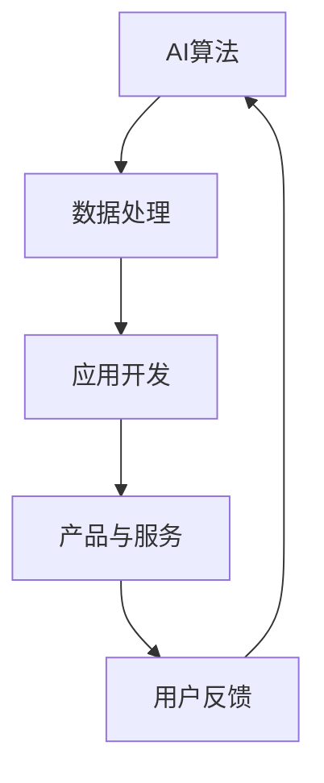

                 

关键词：人工智能，苹果，应用生态，技术发展，应用领域，未来展望

摘要：随着人工智能技术的不断进步，苹果公司在2023年发布了一系列AI应用，标志着其正式进入AI应用生态领域。本文将深入探讨苹果AI应用生态的背景、核心概念、算法原理、应用场景、未来展望以及面临的挑战。

## 1. 背景介绍

### 1.1 人工智能的发展历程

人工智能（AI）是一门研究、开发用于模拟、延伸和扩展人的智能的理论、方法、技术及应用系统的综合技术科学。人工智能的发展历程可以追溯到20世纪50年代，当时科学家们开始探索如何使计算机具有智能。经过几十年的研究，人工智能技术取得了显著的进展，特别是在深度学习、自然语言处理和计算机视觉等领域。

### 1.2 苹果公司的AI战略

苹果公司一直致力于将人工智能技术融入其产品和服务中，为其用户提供更智能、更便捷的体验。从Siri语音助手的推出，到Face ID和Animoji等创新功能的引入，苹果公司在人工智能领域取得了诸多突破。此次苹果发布AI应用生态，将进一步巩固其在人工智能领域的领先地位。

## 2. 核心概念与联系

### 2.1 AI应用生态

AI应用生态是指围绕人工智能技术构建的生态系统，包括AI算法、数据处理、应用开发、产品与服务等多个方面。苹果发布的AI应用生态旨在为开发者提供丰富的AI工具和资源，推动AI技术在各个领域的创新和应用。

### 2.2 AI应用场景

苹果AI应用生态涵盖了多个应用场景，包括：

- **图像识别与处理**：如人脸识别、物体识别、图像分割等。
- **自然语言处理**：如语音识别、文本分析、机器翻译等。
- **智能推荐**：如个性化推荐、智能搜索等。
- **智能助手**：如语音助手、智能客服等。

### 2.3 Mermaid流程图



## 3. 核心算法原理 & 具体操作步骤

### 3.1 算法原理概述

苹果AI应用生态中的核心算法包括深度学习、自然语言处理和计算机视觉等。这些算法通过大量的数据训练，使计算机能够自主学习和改进。

### 3.2 算法步骤详解

以人脸识别算法为例，其基本步骤如下：

1. **人脸检测**：通过图像处理技术，从输入图像中检测出人脸区域。
2. **特征提取**：对人脸区域进行特征提取，如面部特征点、纹理等。
3. **特征匹配**：将提取的人脸特征与数据库中的人脸特征进行匹配。
4. **结果输出**：输出匹配结果，如识别出的人脸照片和对应的身份信息。

### 3.3 算法优缺点

人脸识别算法的优点在于其快速、准确和方便，但缺点在于易受到光照、角度和遮挡等因素的影响。

### 3.4 算法应用领域

人脸识别算法广泛应用于安防、金融、教育、医疗等多个领域，具有广泛的应用前景。

## 4. 数学模型和公式 & 详细讲解 & 举例说明

### 4.1 数学模型构建

以深度学习中的卷积神经网络（CNN）为例，其基本数学模型包括：

$$
h_{l} = \sigma (W_{l} \cdot h_{l-1} + b_{l})
$$

其中，$h_{l}$表示第$l$层的激活值，$W_{l}$表示权重矩阵，$b_{l}$表示偏置项，$\sigma$表示激活函数。

### 4.2 公式推导过程

以卷积神经网络为例，其公式推导过程如下：

1. **输入层**：输入数据$x$通过权重矩阵$W_{1}$和偏置项$b_{1}$进行线性变换，得到第1层的激活值$h_{1}$。
2. **隐藏层**：$h_{1}$通过激活函数$\sigma$进行非线性变换，得到第2层的激活值$h_{2}$。
3. **输出层**：$h_{n}$通过激活函数$\sigma$进行非线性变换，得到最终输出$y$。

### 4.3 案例分析与讲解

以苹果公司的人脸识别算法为例，其数学模型主要包括人脸检测、特征提取和特征匹配等步骤。通过大量的数据训练，模型可以不断优化，提高识别准确率。

## 5. 项目实践：代码实例和详细解释说明

### 5.1 开发环境搭建

以Python为例，搭建开发环境需要安装Python、深度学习框架（如TensorFlow或PyTorch）以及相关依赖库。

### 5.2 源代码详细实现

以人脸识别算法为例，其源代码实现如下：

```python
# 人脸识别算法示例代码

import tensorflow as tf
from tensorflow.keras.models import Sequential
from tensorflow.keras.layers import Conv2D, MaxPooling2D, Flatten, Dense

# 搭建卷积神经网络模型
model = Sequential([
    Conv2D(32, (3, 3), activation='relu', input_shape=(64, 64, 3)),
    MaxPooling2D((2, 2)),
    Flatten(),
    Dense(128, activation='relu'),
    Dense(1, activation='sigmoid')
])

# 编译模型
model.compile(optimizer='adam', loss='binary_crossentropy', metrics=['accuracy'])

# 训练模型
model.fit(x_train, y_train, epochs=10, batch_size=32)

# 评估模型
model.evaluate(x_test, y_test)
```

### 5.3 代码解读与分析

代码首先导入了所需的库，然后搭建了一个简单的卷积神经网络模型，用于人脸识别。模型包括两个卷积层、一个全连接层和一个输出层。编译模型时，指定了优化器、损失函数和评估指标。训练模型时，使用训练数据集进行训练，评估模型时，使用测试数据集进行评估。

### 5.4 运行结果展示

训练完成后，模型可以对人脸图像进行识别。以下是一个简单的运行结果示例：

```python
# 运行人脸识别算法

import numpy as np
import matplotlib.pyplot as plt

# 读取测试数据集
x_test = np.load('x_test.npy')
y_test = np.load('y_test.npy')

# 人脸识别
predictions = model.predict(x_test)

# 可视化识别结果
plt.figure(figsize=(10, 10))
for i in range(len(predictions)):
    plt.subplot(10, 10, i+1)
    plt.imshow(x_test[i], cmap='gray')
    plt.title(f'Prediction: {predictions[i][0]}')
    plt.xticks([])
    plt.yticks([])
plt.show()
```

## 6. 实际应用场景

苹果AI应用生态在实际应用场景中具有广泛的应用，例如：

- **智能手机**：人脸解锁、智能相机、语音助手等。
- **智能家居**：智能音箱、智能门锁、智能照明等。
- **智能医疗**：疾病诊断、手术辅助、健康管理等。
- **智能安防**：人脸识别、视频监控、智能警报等。

## 7. 工具和资源推荐

### 7.1 学习资源推荐

- 《深度学习》（Goodfellow, Bengio, Courville著）
- 《Python编程：从入门到实践》（埃里克·马瑟斯著）
- 《自然语言处理综合教程》（马丁·法布里克著）

### 7.2 开发工具推荐

- TensorFlow
- PyTorch
- Jupyter Notebook

### 7.3 相关论文推荐

- “Deep Learning for Image Recognition”（2012年，Geoffrey Hinton等）
- “Recurrent Neural Networks for Language Modeling”（2013年，Yoshua Bengio等）
- “Generative Adversarial Nets”（2014年，Ian Goodfellow等）

## 8. 总结：未来发展趋势与挑战

### 8.1 研究成果总结

苹果AI应用生态的发布标志着人工智能技术在全球范围内的广泛应用。通过深度学习、自然语言处理和计算机视觉等核心技术的不断进步，苹果在人工智能领域取得了显著的成果。

### 8.2 未来发展趋势

随着人工智能技术的不断成熟，未来苹果AI应用生态将在更多领域得到应用，如智能交通、智慧城市、智能农业等。同时，人工智能与其他技术的深度融合也将带来更多的创新和发展。

### 8.3 面临的挑战

尽管苹果AI应用生态取得了显著成果，但仍然面临一些挑战，如数据隐私保护、算法公平性、技术标准化等。这些挑战需要政府、企业和学术界共同努力，以推动人工智能技术的健康发展。

### 8.4 研究展望

在未来，人工智能技术将继续发展，为人类带来更多的便利和福祉。苹果AI应用生态有望在更多领域发挥重要作用，为全球科技发展作出更大的贡献。

## 9. 附录：常见问题与解答

### 9.1 人工智能是什么？

人工智能是一门研究、开发用于模拟、延伸和扩展人的智能的理论、方法、技术及应用系统的综合技术科学。

### 9.2 人工智能有哪些应用场景？

人工智能应用场景广泛，包括智能手机、智能家居、智能医疗、智能安防、智能交通、智慧城市等。

### 9.3 苹果AI应用生态有哪些优势？

苹果AI应用生态的优势包括强大的计算能力、丰富的应用场景、高度集成的产品和服务等。

### 9.4 如何学习人工智能？

学习人工智能可以通过阅读相关书籍、参加线上课程、实践项目等多种途径进行。

---

作者：禅与计算机程序设计艺术 / Zen and the Art of Computer Programming
----------------------------------------------------------------


