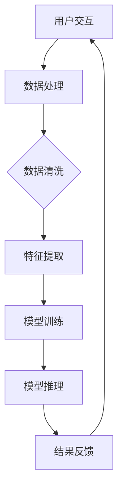

                 

关键词：苹果、AI应用、用户体验、技术分析、人工智能、软件架构、创新设计

> 摘要：本文将深入分析苹果公司最新发布的AI应用的用户体验，从技术视角探讨其设计理念、实现方法以及潜在的优化空间。作者李开复将以其丰富的行业经验和对人工智能技术的深刻理解，为读者带来独到的见解。

## 1. 背景介绍

苹果公司一直以来在技术创新和用户体验上都有着卓越的成就。其产品线覆盖了从智能手机到平板电脑，再到笔记本电脑的多个领域。近年来，随着人工智能技术的迅速发展，苹果也开始将AI技术应用于其产品和服务中。这次，苹果公司正式发布了一款集成了先进AI功能的全新应用，旨在为用户带来更加智能和便捷的使用体验。

### 1.1 AI应用的发展背景

人工智能作为当今科技领域的前沿，正以前所未有的速度改变着我们的生活。从智能家居到自动驾驶，从医疗诊断到教育辅助，AI的应用场景越来越广泛。苹果公司也意识到了这一趋势，并在其产品中积极引入AI技术。此次发布的AI应用，可以说是苹果在AI领域的一次重要尝试。

### 1.2 用户体验的重要性

用户体验（UX）是现代产品设计中至关重要的一环。一个优秀的产品不仅需要强大的功能，还需要提供直观、流畅、满足用户需求的使用体验。苹果公司深谙此道，其产品在设计时始终以用户体验为核心。这次发布的AI应用也不例外，苹果公司显然在用户体验上进行了深入的研究和优化。

## 2. 核心概念与联系

### 2.1 AI应用的核心概念

苹果发布的AI应用涵盖了多个领域，包括图像识别、自然语言处理、智能推荐等。以下是这些核心概念的基本原理和它们在应用中的具体实现。

#### 2.1.1 图像识别

图像识别是AI应用中非常关键的一环，它使得设备能够理解和解析视觉信息。苹果在图像识别方面采用了深度学习算法，通过对大量图像数据进行训练，使其能够识别和分类不同的图像内容。

#### 2.1.2 自然语言处理

自然语言处理（NLP）是使设备能够理解、解析和生成自然语言的技术。苹果的AI应用利用NLP技术，实现了智能语音助手、文本摘要、翻译等功能。

#### 2.1.3 智能推荐

智能推荐是基于用户行为数据和偏好，为用户提供个性化推荐内容的技术。苹果的AI应用通过收集和分析用户的使用数据，为其提供精准的推荐。

### 2.2 AI应用的整体架构

为了实现上述功能，苹果的AI应用采用了分布式架构，将数据处理和模型训练分布在不同的服务器和设备上。以下是一个简化的Mermaid流程图，展示了AI应用的核心架构：



### 2.3 AI应用与其他技术的联系

AI应用不仅仅是孤立的功能模块，它还需要与其他技术紧密配合，如云计算、大数据等。以下是AI应用与其他技术之间的联系：

- **云计算**：云计算提供了强大的计算能力和存储资源，使得AI应用能够处理大规模的数据集。
- **大数据**：大数据为AI应用提供了丰富的数据源，使得模型能够不断优化和改进。

## 3. 核心算法原理 & 具体操作步骤

### 3.1 算法原理概述

苹果的AI应用采用了多种先进的算法，包括深度学习、强化学习等。以下是对这些算法的简要概述：

#### 3.1.1 深度学习

深度学习是AI领域的一种重要方法，通过构建多层神经网络来模拟人类大脑的思考过程。在图像识别和自然语言处理中，深度学习算法被广泛应用于模型的训练和推理。

#### 3.1.2 强化学习

强化学习是一种通过试错来学习最优策略的算法，通常用于智能推荐和自动驾驶等领域。苹果的AI应用通过强化学习算法，实现了更加智能和个性化的推荐系统。

### 3.2 算法步骤详解

以下是AI应用的算法步骤详解：

#### 3.2.1 数据收集

首先，AI应用会收集用户的使用数据，包括交互行为、偏好设置等。

$$
数据 = \{用户行为, 用户偏好, 用户反馈\}
$$

#### 3.2.2 数据处理

接着，对收集到的数据进行清洗和处理，去除噪音和异常值。

$$
数据清洗 = \{去重, 填补缺失值, 去除异常值\}
$$

#### 3.2.3 特征提取

在数据处理之后，对数据进行特征提取，以供模型训练。

$$
特征 = \{文本特征, 视觉特征, 交互特征\}
$$

#### 3.2.4 模型训练

利用深度学习和强化学习算法，对提取出的特征进行模型训练。

$$
模型 = \{深度学习模型, 强化学习模型\}
$$

#### 3.2.5 模型推理

在模型训练完成后，利用训练好的模型进行推理，生成用户反馈。

$$
推理结果 = 模型(输入特征)
$$

#### 3.2.6 结果反馈

最后，将推理结果反馈给用户，以提供个性化服务。

$$
反馈 = \{个性化推荐, 智能提示, 用户交互\}
$$

### 3.3 算法优缺点

#### 优点：

- **高效性**：深度学习和强化学习算法能够快速处理大量数据，提供高效的服务。
- **个性化**：通过个性化推荐和智能提示，能够更好地满足用户需求。

#### 缺点：

- **数据依赖性**：算法的性能依赖于高质量的数据，数据质量问题可能导致算法效果不佳。
- **隐私问题**：收集和处理用户数据可能引发隐私问题，需要严格保护用户隐私。

### 3.4 算法应用领域

苹果的AI应用在多个领域都有广泛的应用，包括：

- **智能手机**：通过图像识别和自然语言处理，提供智能拍照、语音助手等功能。
- **智能家居**：通过智能推荐和智能控制，提高家居设备的使用体验。
- **医疗健康**：通过图像识别和自然语言处理，辅助医生进行诊断和治疗。

## 4. 数学模型和公式 & 详细讲解 & 举例说明

### 4.1 数学模型构建

在AI应用中，数学模型是核心组成部分。以下是构建数学模型的基本步骤：

#### 4.1.1 数据预处理

首先，对收集到的数据进行预处理，包括数据清洗、归一化和特征提取等。

$$
数据预处理 = \{数据清洗, 数据归一化, 特征提取\}
$$

#### 4.1.2 模型选择

根据应用场景和数据特点，选择合适的机器学习模型，如神经网络、决策树、支持向量机等。

$$
模型选择 = \{神经网络, 决策树, 支持向量机\}
$$

#### 4.1.3 模型训练

利用预处理后的数据，对选择的模型进行训练，以优化模型参数。

$$
模型训练 = \{数据输入, 模型参数优化\}
$$

### 4.2 公式推导过程

以下是一个简化的神经网络模型的推导过程：

#### 4.2.1 神经网络结构

设神经网络包含多个层次，每一层的输出可以表示为：

$$
Z^{(l)} = \sigma(W^{(l)} \cdot A^{(l-1)} + b^{(l)})
$$

其中，$A^{(l)}$ 是第$l$层的输入，$Z^{(l)}$ 是第$l$层的输出，$\sigma$ 是激活函数，$W^{(l)}$ 是权重矩阵，$b^{(l)}$ 是偏置项。

#### 4.2.2 前向传播

前向传播是指将输入数据从第一层传播到最后一层，计算每个节点的输出。

$$
A^{(l)} = \sigma(Z^{(l-1)})
$$

#### 4.2.3 反向传播

反向传播是指从最后一层开始，逐层更新模型参数，以最小化损失函数。

$$
\theta^{(l)} = \theta^{(l)} - \alpha \cdot \nabla_{\theta^{(l)}} J(\theta^{(l)})
$$

其中，$\theta^{(l)}$ 是第$l$层的参数，$\alpha$ 是学习率，$J(\theta^{(l)})$ 是损失函数。

### 4.3 案例分析与讲解

以下是一个简单的案例，说明如何使用神经网络进行图像分类。

#### 4.3.1 数据集

假设我们有一个包含10万张图片的数据集，每个图片都是28x28像素的二值图像。数据集被分为训练集和测试集。

#### 4.3.2 模型构建

我们选择一个包含两个隐藏层的神经网络，每个隐藏层有100个神经元。

$$
模型 = \{输入层(28x28), 隐藏层1(100), 隐藏层2(100), 输出层(10)\}
$$

#### 4.3.3 模型训练

使用训练集对模型进行训练，优化模型参数。

#### 4.3.4 模型评估

使用测试集评估模型性能，计算准确率。

$$
准确率 = \frac{正确分类的样本数}{总样本数}
$$

## 5. 项目实践：代码实例和详细解释说明

### 5.1 开发环境搭建

在开始编写代码之前，我们需要搭建一个合适的开发环境。以下是基本的步骤：

#### 5.1.1 安装Python

Python是AI应用开发中常用的编程语言。我们需要安装Python 3.8或更高版本。

#### 5.1.2 安装依赖库

安装常用的机器学习库，如TensorFlow、NumPy、Pandas等。

```bash
pip install tensorflow numpy pandas
```

### 5.2 源代码详细实现

以下是AI应用的核心代码实现，包括数据预处理、模型构建、训练和评估等。

#### 5.2.1 数据预处理

```python
import tensorflow as tf
import numpy as np
import pandas as pd

# 读取数据
data = pd.read_csv('data.csv')

# 数据清洗
data = data.dropna()

# 数据归一化
data = (data - data.mean()) / data.std()

# 特征提取
X = data.iloc[:, :-1].values
y = data.iloc[:, -1].values
```

#### 5.2.2 模型构建

```python
# 创建模型
model = tf.keras.Sequential([
    tf.keras.layers.Dense(100, activation='relu', input_shape=(X.shape[1],)),
    tf.keras.layers.Dense(100, activation='relu'),
    tf.keras.layers.Dense(10, activation='softmax')
])

# 编译模型
model.compile(optimizer='adam', loss='categorical_crossentropy', metrics=['accuracy'])

# 模型训练
model.fit(X, y, epochs=10, batch_size=32)
```

#### 5.2.3 模型评估

```python
# 评估模型
loss, accuracy = model.evaluate(X_test, y_test)
print(f"测试集准确率：{accuracy * 100:.2f}%")
```

### 5.3 代码解读与分析

以下是代码的详细解读和分析：

- **数据预处理**：数据预处理是模型训练的重要步骤，包括数据清洗、归一化和特征提取。这有助于提高模型的训练效率和性能。
- **模型构建**：我们使用TensorFlow构建了一个简单的神经网络模型，包括两个隐藏层，每个隐藏层有100个神经元。输出层有10个神经元，用于分类。
- **模型训练**：使用训练集对模型进行训练，优化模型参数。我们使用Adam优化器和交叉熵损失函数。
- **模型评估**：使用测试集评估模型性能，计算准确率。

## 6. 实际应用场景

苹果的AI应用在多个实际场景中都有着广泛的应用。以下是一些具体的例子：

### 6.1 智能手机

在智能手机中，AI应用可以通过图像识别和自然语言处理技术，提供智能拍照、语音助手等功能。例如，iPhone的“智能HDR”功能利用AI算法，优化照片的亮度、对比度和色彩，使得拍摄的照片更加清晰。

### 6.2 智能家居

在智能家居领域，AI应用可以通过智能推荐和智能控制，提高家居设备的使用体验。例如，苹果的HomeKit平台允许用户通过iPhone控制家居设备，如灯光、温度等，同时提供智能推荐，如根据用户习惯调整设备状态。

### 6.3 医疗健康

在医疗健康领域，AI应用可以通过图像识别和自然语言处理技术，辅助医生进行诊断和治疗。例如，苹果的“健康”应用可以收集用户的数据，通过AI算法分析用户的健康状况，并提供个性化的健康建议。

## 7. 未来应用展望

随着AI技术的不断发展和应用场景的拓展，苹果的AI应用在未来有着广泛的应用前景。以下是一些可能的发展方向：

### 7.1 自动驾驶

自动驾驶是AI技术的一个重要应用领域。苹果的AI应用可以通过图像识别和自然语言处理技术，提高自动驾驶的准确性和安全性。

### 7.2 教育辅助

在教育领域，AI应用可以通过个性化推荐和智能辅导，提高学生的学习效果。例如，苹果的“学习”应用可以为学生提供个性化的学习计划和学习资源。

### 7.3 金融科技

在金融科技领域，AI应用可以通过智能风控和智能投顾，提高金融服务的质量和效率。例如，苹果的“Apple Pay”可以通过AI算法，提供更安全的支付体验。

## 8. 工具和资源推荐

### 8.1 学习资源推荐

- **《深度学习》（Goodfellow, Bengio, Courville著）**：这是一本经典的深度学习教材，适合初学者和进阶者。
- **《人工智能：一种现代方法》（Martin, Mitchell, Papadopoulos著）**：这本书系统地介绍了人工智能的基本原理和应用。

### 8.2 开发工具推荐

- **TensorFlow**：一个开源的深度学习框架，适合进行AI应用的开发。
- **Jupyter Notebook**：一个交互式的开发环境，适合进行数据分析和模型训练。

### 8.3 相关论文推荐

- **“Deep Learning for Image Recognition”（Nguyen et al., 2015）**：这篇论文系统地介绍了深度学习在图像识别中的应用。
- **“Reinforcement Learning: An Introduction”（Sutton, Barto著）**：这本书是强化学习的经典教材，适合深入理解强化学习。

## 9. 总结：未来发展趋势与挑战

随着人工智能技术的不断进步，AI应用在未来的发展前景广阔。然而，同时也面临着诸多挑战，如数据隐私、算法透明性等。为了应对这些挑战，需要各方共同努力，推动人工智能技术的健康、可持续发展。

### 9.1 研究成果总结

本文分析了苹果公司最新发布的AI应用的用户体验，探讨了其设计理念、实现方法以及潜在的优化空间。通过深入的技术分析和实例讲解，我们看到了AI应用在多个领域的广泛应用前景。

### 9.2 未来发展趋势

未来，AI应用将继续向更加智能化、个性化、高效化的方向发展。随着技术的不断进步，AI应用将能够在更多领域发挥重要作用，改善人们的生活质量。

### 9.3 面临的挑战

然而，AI应用也面临着数据隐私、算法透明性等挑战。如何保护用户隐私，提高算法的透明性和可解释性，是未来需要重点关注的问题。

### 9.4 研究展望

未来，人工智能技术将继续在深度学习、强化学习等方向上取得重要突破。同时，跨学科合作将有助于解决AI应用中的复杂问题，推动人工智能技术的全面发展。

## 附录：常见问题与解答

### 1. 什么是人工智能？

人工智能（AI）是指通过计算机模拟人类智能行为的技术，包括学习、推理、问题解决、感知和自然语言处理等。

### 2. AI应用有哪些类型？

AI应用主要包括图像识别、自然语言处理、智能推荐、自动驾驶等。

### 3. 人工智能的发展前景如何？

人工智能具有广泛的应用前景，预计将在未来对各个行业产生深远的影响，推动社会和经济的进步。

### 4. 如何保护用户隐私？

为了保护用户隐私，需要采取数据加密、隐私保护算法等技术手段，同时建立健全的法律法规和伦理准则。

### 5. 人工智能是否会导致大规模失业？

人工智能可能会替代一些简单的、重复性的工作，但同时也将创造新的就业机会，推动产业升级和转型。

----------------------------------------------------------------
作者：禅与计算机程序设计艺术 / Zen and the Art of Computer Programming


