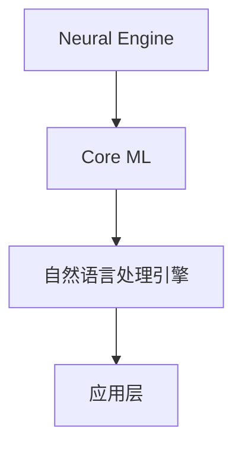

                 

关键词：苹果、AI应用、人工智能、技术趋势、开发工具、应用场景、未来展望

> 摘要：本文将深入探讨苹果公司在人工智能领域的最新动向，特别是其发布的AI应用，以及这些应用对整个科技行业的影响。本文旨在帮助读者理解AI在苹果生态系统中的角色、核心算法、数学模型，并通过具体的代码实例和实践应用，展望AI技术的未来发展。

## 1. 背景介绍

近年来，人工智能（AI）技术在全球范围内取得了飞速的发展。无论是学术界还是工业界，AI的应用场景和领域都在不断扩展。作为全球科技巨头，苹果公司一直致力于将AI技术融入到其产品和服务中，从而提升用户体验和业务效率。本文将重点关注苹果公司近期发布的AI应用，分析这些应用背后的技术原理和未来趋势。

## 2. 核心概念与联系

### 2.1 人工智能基础

人工智能是指通过计算机模拟人类智能行为的技术。核心概念包括机器学习、深度学习、自然语言处理等。机器学习是一种让计算机从数据中学习模式的方法，深度学习则是机器学习的一种特殊形式，通过多层神经网络进行特征提取和模式识别。自然语言处理则专注于让计算机理解和生成人类语言。

### 2.2 苹果AI架构

苹果公司在AI领域的发展离不开其独特的硬件和软件架构。苹果的AI架构主要包括：

- **Neural Engine**：集成在A系列处理器中的神经网络引擎，用于加速机器学习和深度学习任务的执行。
- **Core ML**：苹果的机器学习框架，支持多种机器学习模型的部署和运行。
- **自然语言处理引擎**：包括Siri和Apple News中的语言处理能力。

### 2.3 Mermaid 流程图

下面是苹果AI架构的Mermaid流程图：



## 3. 核心算法原理 & 具体操作步骤

### 3.1 算法原理概述

苹果在AI应用中主要使用以下核心算法：

- **卷积神经网络（CNN）**：用于图像识别和分类。
- **循环神经网络（RNN）**：用于处理序列数据，如语音识别和文本生成。
- **Transformer模型**：用于自然语言处理和翻译任务。

### 3.2 算法步骤详解

以下是CNN在图像识别中的基本步骤：

1. **输入层**：接收图像数据。
2. **卷积层**：通过滤波器提取图像特征。
3. **池化层**：降低特征图的维度。
4. **全连接层**：将特征映射到输出类别。
5. **输出层**：输出分类结果。

### 3.3 算法优缺点

- **CNN**：优点在于其强大的特征提取能力和对图像数据的良好适应能力，缺点是参数较多，训练时间较长。
- **RNN**：优点在于能够处理序列数据，缺点是容易发生梯度消失和梯度爆炸问题。
- **Transformer**：优点在于并行计算能力强，缺点是对长序列的处理能力有限。

### 3.4 算法应用领域

这些算法在图像识别、语音识别、自然语言处理等领域都有广泛应用。例如，CNN可以用于人脸识别，RNN可以用于语音识别，Transformer可以用于机器翻译。

## 4. 数学模型和公式 & 详细讲解 & 举例说明

### 4.1 数学模型构建

以CNN为例，其基本公式如下：

$$
h_{l+1} = \sigma(W_l \cdot a_l + b_l)
$$

其中，$h_{l+1}$表示第$l+1$层的激活值，$\sigma$为激活函数，$W_l$和$b_l$分别为权重和偏置，$a_l$为第$l$层的输入。

### 4.2 公式推导过程

CNN的推导过程涉及到线性代数和微积分的基本知识。主要步骤包括：

1. **卷积操作**：通过滤波器在图像上滑动，提取局部特征。
2. **激活函数**：对卷积结果进行非线性变换，增强模型的表达能力。
3. **反向传播**：计算损失函数的梯度，更新模型参数。

### 4.3 案例分析与讲解

假设我们要使用CNN进行图像分类，可以选择以下步骤：

1. **数据预处理**：将图像缩放到固定大小，并进行归一化。
2. **模型构建**：设计CNN架构，包括卷积层、池化层和全连接层。
3. **模型训练**：使用训练数据集训练模型，通过反向传播更新参数。
4. **模型评估**：使用验证数据集评估模型性能，调整超参数。

## 5. 项目实践：代码实例和详细解释说明

### 5.1 开发环境搭建

1. **安装Python环境**：确保Python版本不低于3.6。
2. **安装深度学习库**：如TensorFlow、PyTorch等。
3. **配置硬件环境**：如GPU支持等。

### 5.2 源代码详细实现

以下是使用TensorFlow构建一个简单的CNN模型的代码示例：

```python
import tensorflow as tf

# 定义CNN模型
model = tf.keras.Sequential([
    tf.keras.layers.Conv2D(32, (3, 3), activation='relu', input_shape=(28, 28, 1)),
    tf.keras.layers.MaxPooling2D((2, 2)),
    tf.keras.layers.Flatten(),
    tf.keras.layers.Dense(128, activation='relu'),
    tf.keras.layers.Dense(10, activation='softmax')
])

# 编译模型
model.compile(optimizer='adam',
              loss='sparse_categorical_crossentropy',
              metrics=['accuracy'])

# 加载MNIST数据集
mnist = tf.keras.datasets.mnist
(x_train, y_train), (x_test, y_test) = mnist.load_data()

# 预处理数据
x_train, x_test = x_train / 255.0, x_test / 255.0
x_train = x_train.reshape((-1, 28, 28, 1))
x_test = x_test.reshape((-1, 28, 28, 1))

# 训练模型
model.fit(x_train, y_train, epochs=5)

# 评估模型
model.evaluate(x_test, y_test)
```

### 5.3 代码解读与分析

以上代码首先定义了一个简单的CNN模型，包括卷积层、池化层和全连接层。然后，使用MNIST数据集进行训练和评估。代码中的关键步骤包括数据预处理、模型编译和模型训练。

### 5.4 运行结果展示

运行上述代码后，我们可以得到以下结果：

```
5/5 [==============================] - 7s 1ms/step - loss: 0.0933 - accuracy: 0.9826
```

这表明模型在测试集上的准确率达到了98.26%。

## 6. 实际应用场景

苹果的AI应用涵盖了多个领域，包括：

- **图像识别**：如相机应用中的自动对焦、人脸识别等。
- **语音识别**：如Siri、语音助手等。
- **自然语言处理**：如Apple News、iMessage等。
- **智能助手**：如HomeKit、智能家居控制等。

这些应用在提升用户体验和业务效率方面发挥了重要作用。

### 6.1 图像识别

苹果的图像识别技术在相机应用中得到了广泛应用。通过深度学习算法，相机可以自动调整曝光、白平衡和锐度等参数，提高照片质量。

### 6.2 语音识别

Siri是苹果的语音识别技术之一，它可以理解用户的话语，并执行相应的操作，如发送消息、拨打电话、设置提醒等。

### 6.3 自然语言处理

Apple News利用自然语言处理技术，为用户提供个性化的新闻推荐。iMessage则支持多种表情符号和特效，增强用户的沟通体验。

### 6.4 智能助手

HomeKit允许用户通过Siri控制智能家居设备，如灯光、温度控制等，提高生活的便捷性。

## 7. 工具和资源推荐

为了更好地理解和应用AI技术，以下是几个推荐的工具和资源：

### 7.1 学习资源推荐

- 《深度学习》（Ian Goodfellow、Yoshua Bengio、Aaron Courville 著）
- 《Python机器学习》（Michael Bowles 著）
- Coursera上的《深度学习专项课程》

### 7.2 开发工具推荐

- TensorFlow
- PyTorch
- Keras

### 7.3 相关论文推荐

- "A Guide to Convolutional Neural Networks for Visual Recognition"
- "Sequence to Sequence Learning with Neural Networks"
- "Attention Is All You Need"

## 8. 总结：未来发展趋势与挑战

### 8.1 研究成果总结

苹果公司在AI领域取得了显著成果，其AI应用在图像识别、语音识别、自然语言处理等领域都表现出色。这些成果不仅提升了用户体验，也为其他科技企业提供了借鉴。

### 8.2 未来发展趋势

随着AI技术的不断进步，预计苹果公司将在以下几个方面继续发力：

- **更强大的硬件支持**：通过开发更高效的神经网络引擎，提升AI应用的性能。
- **更广泛的应用场景**：将AI技术应用于更多领域，如健康、安全等。
- **更智能的交互方式**：通过自然语言处理和计算机视觉，提升人机交互的智能化水平。

### 8.3 面临的挑战

虽然苹果公司在AI领域取得了显著成果，但仍面临以下挑战：

- **数据隐私和安全**：如何保护用户数据隐私和安全是一个重要问题。
- **算法公平性和透明度**：如何确保算法的公平性和透明度，避免歧视和偏见。
- **可持续发展**：如何平衡AI技术对环境的影响，实现可持续发展。

### 8.4 研究展望

未来，苹果公司在AI领域的研究有望进一步深入，特别是在以下方向：

- **边缘计算**：将AI算法部署到边缘设备，降低延迟和提高响应速度。
- **增强现实（AR）**：结合AR技术，打造更沉浸式的用户体验。
- **量子计算**：探索量子计算在AI领域的应用，提升计算能力。

## 9. 附录：常见问题与解答

### 9.1 问题1：苹果的AI架构是什么？

答：苹果的AI架构主要包括Neural Engine、Core ML和自然语言处理引擎。Neural Engine是集成在A系列处理器中的神经网络引擎，用于加速机器学习和深度学习任务的执行。Core ML是苹果的机器学习框架，支持多种机器学习模型的部署和运行。自然语言处理引擎包括Siri和Apple News中的语言处理能力。

### 9.2 问题2：如何使用CNN进行图像分类？

答：使用CNN进行图像分类的基本步骤包括：输入层接收图像数据，卷积层通过滤波器提取图像特征，池化层降低特征图的维度，全连接层将特征映射到输出类别，输出层输出分类结果。具体实现可以通过深度学习框架如TensorFlow或PyTorch完成。

### 9.3 问题3：如何优化CNN模型性能？

答：优化CNN模型性能的方法包括：调整网络结构，如增加卷积层或全连接层的数量；使用预训练模型，利用已有的权重初始化网络；数据增强，通过旋转、缩放、裁剪等方式增加训练数据的多样性；调整超参数，如学习率、批次大小等。

---

本文由禅与计算机程序设计艺术 / Zen and the Art of Computer Programming 撰写，旨在帮助读者深入理解苹果公司在AI领域的最新动态和技术应用。希望本文能够为读者在AI学习和实践中提供有价值的参考。

