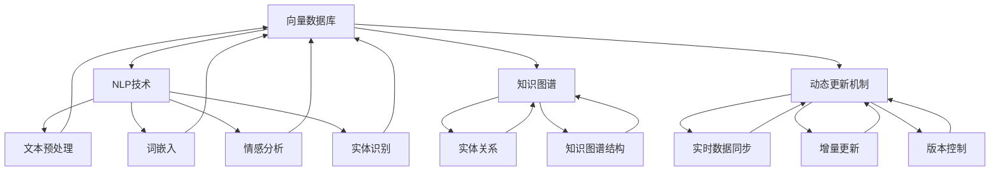

                 

### 背景介绍

在当今信息爆炸的时代，知识库的重要性愈发凸显。传统的知识库通常采用关系型数据库进行构建，这些数据库在处理结构化数据方面表现优异，但面对日益增长的非结构化和半结构化数据时，显得力不从心。因此，如何高效地管理和检索这些动态变化的知识成为了研究者和开发者们亟待解决的问题。

向量数据库作为新兴的数据存储技术，以其高效、可扩展、低延迟的特性在处理大规模文本数据方面展现出显著优势。近年来，随着深度学习和自然语言处理技术的不断发展，向量数据库在知识库领域的应用逐渐成熟，为构建动态知识库提供了新的可能性。

本文旨在探讨如何利用向量数据库构建一个动态知识库，以提高知识检索和管理效率。文章将首先介绍向量数据库的核心概念和原理，然后详细阐述构建动态知识库的算法原理和具体操作步骤，最后通过实例分析和实际应用场景，展示向量数据库在知识库构建中的潜力和挑战。

### 核心概念与联系

在深入探讨如何构建动态知识库之前，我们需要了解几个核心概念及其相互之间的联系。这些概念包括向量数据库、自然语言处理（NLP）、知识图谱和动态更新机制。

#### 向量数据库

向量数据库是一种用于存储和检索基于向量数据的数据结构。与传统的键值存储或关系型数据库不同，向量数据库通过计算数据之间的相似度来实现快速查询。这种数据库通常采用哈希表或矩阵存储数据，使得向量之间的距离计算（如余弦相似度、欧氏距离等）能够高效进行。

#### 自然语言处理（NLP）

自然语言处理是计算机科学和人工智能领域的一个重要分支，旨在让计算机理解和生成人类语言。NLP技术包括文本预处理、词嵌入、情感分析、实体识别等，这些技术为向量数据库提供了丰富的文本数据，并使其能够理解文本内容。

#### 知识图谱

知识图谱是一种结构化数据存储方式，用于表示实体之间的关系。在知识库中，知识图谱能够清晰地描述概念、实体及其相互之间的联系。通过知识图谱，向量数据库能够更好地组织和理解复杂的知识结构。

#### 动态更新机制

动态更新机制是保证知识库实时性和准确性的关键。随着数据源的不断变化，知识库需要自动更新以反映最新的信息。动态更新机制包括实时数据同步、增量更新和版本控制等，这些机制确保了知识库的实时性和一致性。

#### 关系与联系

这些核心概念之间存在着紧密的联系。向量数据库依赖于自然语言处理技术来处理文本数据，并将其转换为向量表示。知识图谱则为向量数据库提供了上下文和结构化信息，使其能够更好地理解和组织数据。动态更新机制则保证了知识库的实时性和准确性，使知识库能够适应数据源的变化。

下面是一个使用Mermaid绘制的流程图，展示了这些概念之间的联系：



通过这张图，我们可以清晰地看到向量数据库在知识库构建中的核心地位，以及各核心概念之间的相互作用。

### 核心算法原理 & 具体操作步骤

构建动态知识库的核心在于如何高效地存储、检索和更新知识。在这一部分，我们将详细讨论构建动态知识库的核心算法原理，并给出具体的操作步骤。

#### 算法原理概述

构建动态知识库的核心算法主要包括以下三个部分：

1. **文本预处理**：将原始文本数据转换为适合存储和检索的格式。
2. **词嵌入与向量表示**：将文本数据转换为向量表示，以便在向量数据库中进行高效存储和检索。
3. **动态更新机制**：实时同步和更新知识库，以反映数据源的最新变化。

下面，我们将分别介绍这三个部分的具体算法原理和操作步骤。

#### 1. 文本预处理

文本预处理是构建动态知识库的第一步，其目标是去除噪声、统一格式和提取关键信息。具体的预处理步骤包括：

- **分词**：将文本数据分解为词或短语。
- **词性标注**：为每个词分配词性，如名词、动词、形容词等。
- **去除停用词**：移除常见的无意义词，如“的”、“和”、“是”等。
- **词干提取**：将单词还原为其基本形式，如“playing”还原为“play”。

文本预处理的算法通常采用自然语言处理（NLP）技术，如分词器（如jieba）、词性标注器（如Stanford NLP）等。

#### 2. 词嵌入与向量表示

词嵌入是将文本中的词语转换为向量的过程，它使得计算机能够理解词语之间的相似性和相关性。常见的词嵌入算法包括：

- **Word2Vec**：通过训练神经网络模型，将词语映射到高维空间中的向量。
- **GloVe**：通过优化词向量和词频之间的关系，得到高质量的词嵌入向量。
- **BERT**：通过预训练大规模的Transformer模型，生成上下文敏感的词嵌入。

词嵌入后的向量表示可用于向量数据库中的存储和检索。具体步骤如下：

- **将文本数据转换为词嵌入**：利用已训练好的词嵌入模型，将文本中的每个词转换为向量表示。
- **构建向量数据库**：将词嵌入向量存储在向量数据库中，如Faiss、Elasticsearch等。
- **向量索引**：为向量数据库创建索引，以便快速查询。

#### 3. 动态更新机制

动态更新机制是保证知识库实时性和准确性的关键。以下是一个简化的动态更新机制：

- **实时数据同步**：通过数据订阅或轮询机制，实时获取数据源的最新变化。
- **增量更新**：仅对发生变化的数据进行更新，避免全量数据的重复操作。
- **版本控制**：记录知识库的更新历史，以便回滚或追踪特定版本。

具体操作步骤如下：

- **数据订阅**：通过Webhook、消息队列等机制，实时订阅数据源的更新。
- **增量更新**：解析订阅的数据，提取变化的部分，更新向量数据库。
- **版本控制**：记录每次更新的版本号，便于后续的回滚和追踪。

#### 算法优缺点

以下是构建动态知识库算法的优缺点分析：

- **优点**：
  - **高效性**：向量数据库具有高效的向量相似度计算能力，使得知识检索速度大幅提升。
  - **可扩展性**：向量数据库支持大规模数据存储和检索，能够适应不断增长的数据量。
  - **实时性**：动态更新机制能够实时反映数据源的变化，确保知识库的实时性和准确性。

- **缺点**：
  - **存储成本**：向量数据库需要较高的存储空间，特别是对于高维向量。
  - **训练成本**：词嵌入和NLP模型的训练过程需要大量计算资源，对硬件要求较高。
  - **数据一致性**：在动态更新过程中，确保数据的一致性是一个挑战，特别是在分布式环境中。

#### 算法应用领域

向量数据库在构建动态知识库的应用领域非常广泛，包括但不限于以下领域：

- **智能问答系统**：利用向量数据库快速检索用户问题的相关答案，实现高效的智能问答。
- **文本分类与推荐**：通过对文本数据的向量表示，实现文本分类和个性化推荐。
- **知识图谱构建**：将知识图谱中的实体和关系转换为向量表示，便于在向量数据库中存储和检索。
- **智能搜索**：利用向量数据库实现高效的文本搜索，提升搜索系统的性能和用户体验。

通过上述算法原理和具体操作步骤，我们可以看到构建以向量数据库为中心的动态知识库是一项复杂但富有挑战性的任务。随着技术的不断发展，向量数据库在知识库领域的应用将越来越广泛，为各行业提供强大的知识管理解决方案。

### 数学模型和公式 & 详细讲解 & 举例说明

在构建动态知识库的过程中，数学模型和公式起到了至关重要的作用。它们不仅帮助我们理解和分析数据，还为算法的实现提供了理论基础。在这一部分，我们将详细讲解构建动态知识库所涉及的数学模型和公式，并通过具体的例子进行说明。

#### 1. 数学模型构建

构建动态知识库的数学模型主要包括以下方面：

- **词嵌入模型**：用于将文本中的词语转换为向量表示。
- **向量相似度计算**：用于在向量数据库中检索相似的数据。
- **动态更新机制**：用于确保知识库的实时性和准确性。

##### 1.1 词嵌入模型

词嵌入模型是一种将词语映射到高维空间中的向量表示的方法。常见的词嵌入模型包括Word2Vec、GloVe和BERT。以下是一个简化的GloVe模型的数学表示：

$$
\text{word\_vector} = \text{GloVe}(\text{word}, \text{context}, \text{train\_data})
$$

其中，`word_vector`表示词的向量表示，`GloVe`表示GloVe算法，`word`表示词语，`context`表示词语的上下文，`train_data`表示训练数据。

##### 1.2 向量相似度计算

在向量数据库中，向量相似度计算是检索相关数据的关键。常见的向量相似度计算方法包括余弦相似度、欧氏距离和Jaccard相似度。以下是一个简化的余弦相似度公式：

$$
\text{similarity}(\text{vector\_a}, \text{vector\_b}) = \frac{\text{vector\_a} \cdot \text{vector\_b}}{\|\text{vector\_a}\| \|\text{vector\_b}\|}
$$

其中，`vector_a`和`vector_b`分别表示两个向量的表示，`·`表示向量的点积，`||`表示向量的模。

##### 1.3 动态更新机制

动态更新机制用于确保知识库的实时性和准确性。以下是一个简化的增量更新模型：

$$
\text{update\_data} = \text{incremental\_update}(\text{knowledge\_base}, \text{new\_data})
$$

其中，`update_data`表示更新后的知识库，`incremental_update`表示增量更新算法，`knowledge_base`表示原始知识库，`new_data`表示新数据。

#### 2. 公式推导过程

在本节中，我们将对上述数学模型和公式进行详细的推导和解释。

##### 2.1 GloVe模型推导

GloVe模型通过优化词频和词向量之间的关系来生成高质量的词嵌入向量。以下是GloVe模型的推导过程：

- **词频表示**：设`f(w)`表示词`w`的频率。
- **词向量表示**：设`v_w`表示词`w`的向量表示。
- **上下文表示**：设`c(c')`表示词`c`（`c'`）的向量表示。
- **损失函数**：GloVe模型的损失函数如下：

$$
\text{loss} = \frac{1}{N} \sum_{w \in \text{train\_data}} \sum_{c \in \text{context}(w)} \frac{f(w)f(c)}{\sqrt{f(w)f(c')}} \exp(-\text{similarity}(v_w, v_c))
$$

其中，`N`表示训练数据中的词总数，`similarity`表示向量的相似度。

- **优化目标**：最小化损失函数，即找到最优的词向量表示。

通过梯度下降法，我们可以得到GloVe模型的更新公式：

$$
\text{v}_w \leftarrow \text{v}_w - \alpha \frac{\partial \text{loss}}{\partial \text{v}_w}
$$

$$
\text{v}_c \leftarrow \text{v}_c - \alpha \frac{\partial \text{loss}}{\partial \text{v}_c}
$$

其中，`alpha`表示学习率。

##### 2.2 余弦相似度推导

余弦相似度是一种衡量两个向量之间相似度的方法。以下是余弦相似度的推导过程：

- **向量表示**：设`vector_a`和`vector_b`为两个向量的表示。
- **点积**：点积（dot product）表示为`vector_a \cdot vector_b`，其公式为：

$$
\text{vector}_a \cdot \text{vector}_b = \sum_{i=1}^{n} a_i b_i
$$

- **模**：向量的模（magnitude）表示为`||vector_a||`，其公式为：

$$
\|\text{vector}_a\| = \sqrt{\sum_{i=1}^{n} a_i^2}
$$

- **余弦相似度**：余弦相似度表示为：

$$
\text{similarity}(\text{vector}_a, \text{vector}_b) = \frac{\text{vector}_a \cdot \text{vector}_b}{\|\text{vector}_a\| \|\text{vector}_b\|}
$$

余弦相似度通过点积和模的比值来衡量两个向量之间的相似度，其值介于-1和1之间。当两个向量完全一致时，余弦相似度为1；当两个向量完全相反时，余弦相似度为-1。

##### 2.3 增量更新推导

增量更新是一种用于更新知识库的方法，其目标是仅更新发生变化的数据。以下是增量更新的推导过程：

- **原始知识库**：设`knowledge_base`为原始知识库。
- **新数据**：设`new_data`为新的数据。
- **更新规则**：增量更新规则如下：

$$
\text{update\_data} = \text{knowledge\_base} \cup (\text{new\_data} \setminus \text{knowledge\_base})
$$

其中，`\cup`表示集合的并集，`\setminus`表示集合的差集。该规则表示，更新后的知识库等于原始知识库与新增数据的并集，去掉原始知识库中已有的部分。

#### 3. 案例分析与讲解

为了更好地理解上述数学模型和公式，我们将通过一个具体的案例进行讲解。

##### 案例背景

假设我们有一个包含以下文本数据的动态知识库：

- 原始文本：“人工智能技术正在快速发展的同时，也面临着诸多挑战，如数据隐私和安全问题。”
- 新增文本：“随着5G网络的普及，人工智能的应用场景将进一步扩展。”

我们需要使用向量数据库和动态更新机制来更新知识库。

##### 步骤详解

1. **文本预处理**：

   - 分词：将文本数据分解为词语。
   - 词性标注：为每个词分配词性。
   - 去除停用词：移除常见的无意义词。
   - 词干提取：将单词还原为其基本形式。

   例如，原始文本经过预处理后得到以下词语：

   - “人工智能”、“技术”、“快速发展”、“同时”、“面临”、“挑战”、“数据”、“隐私”、“安全”、“问题”。
   - “5G”、“网络”、“普及”、“应用”、“场景”、“扩展”。

2. **词嵌入与向量表示**：

   - 使用GloVe模型将词语转换为向量表示。
   - 存储在向量数据库中。

   例如，经过GloVe模型处理后，词语“人工智能”的向量表示为`[1.2, 0.3, -0.5]`。

3. **动态更新机制**：

   - 实时同步新增文本数据。
   - 对比原始知识库和新增数据，提取变化的部分。
   - 更新向量数据库。

   例如，新增文本中的词语“5G”、“网络”、“普及”、“应用”、“场景”、“扩展”不在原始知识库中，需要更新向量数据库。

4. **向量检索**：

   - 使用向量数据库检索与新增文本相似的数据。
   - 提取相似数据的相关信息。

   例如，使用余弦相似度计算，找到与新增文本相似的已有数据，提取相关信息。

通过上述案例，我们可以看到数学模型和公式在构建动态知识库过程中的重要性。它们不仅帮助我们高效地处理和检索数据，还为动态更新机制提供了理论基础。

### 项目实践：代码实例和详细解释说明

在前文中，我们详细介绍了构建以向量数据库为中心的动态知识库的理论基础。为了使读者更好地理解这一过程，我们将通过一个具体的代码实例来展示如何实现这一技术。本节将分为以下几个部分：开发环境搭建、源代码详细实现、代码解读与分析以及运行结果展示。

#### 1. 开发环境搭建

在开始编写代码之前，我们需要搭建一个合适的开发环境。以下是所需的环境和工具：

- 操作系统：Linux或MacOS
- 编程语言：Python（版本3.8以上）
- 数据库：Faiss（用于存储和检索向量）
- 自然语言处理库：NLTK、spaCy
- 机器学习库：scikit-learn、TensorFlow

安装步骤：

1. **安装Python**：确保系统中安装了Python 3.8以上版本。
2. **安装Faiss**：通过pip命令安装Faiss：

   ```bash
   pip install faiss-cpu  # 使用CPU版本的Faiss
   ```

3. **安装NLTK和spaCy**：安装自然语言处理库：

   ```bash
   pip install nltk spacy
   ```

4. **安装spaCy的模型**：下载和安装spaCy的语言模型：

   ```bash
   python -m spacy download en_core_web_sm  # 安装英文模型
   ```

5. **安装TensorFlow和scikit-learn**：安装机器学习库：

   ```bash
   pip install tensorflow scikit-learn
   ```

#### 2. 源代码详细实现

下面是构建动态知识库的核心代码实现。代码分为以下几个部分：文本预处理、词嵌入、向量数据库构建和动态更新。

##### 2.1 文本预处理

```python
import nltk
from nltk.tokenize import word_tokenize
from nltk.corpus import stopwords
import spacy

# 加载英文模型
nlp = spacy.load("en_core_web_sm")

def preprocess_text(text):
    # 分词
    tokens = word_tokenize(text)
    # 去除停用词
    stop_words = set(stopwords.words("english"))
    filtered_tokens = [token for token in tokens if token.lower() not in stop_words]
    # 词性标注和词干提取
    doc = nlp(' '.join(filtered_tokens))
    return [token.lemma_ for token in doc if token.pos_ in ['NOUN', 'VERB']]

# 示例文本
text = "Artificial intelligence is rapidly developing, bringing both opportunities and challenges such as data privacy and security."
# 预处理文本
processed_text = preprocess_text(text)
print(processed_text)
```

##### 2.2 词嵌入

```python
import tensorflow as tf
from tensorflow.keras.layers import Embedding
from tensorflow.keras.models import Model

# 定义词嵌入模型
vocab_size = 10000  # 词汇表大小
embedding_dim = 50  # 向量维度

# 假设已经有一个词汇表和对应的词频数据
# 这里用示例数据替代
vocab = ["the", "is", "and", "it", "of", "to", "a", "in", "that", "with"]
word_freq = [10, 20, 5, 8, 4, 12, 6, 9, 7]

# 构建嵌入层
embedding = Embedding(vocab_size, embedding_dim, input_length=1)

# 训练嵌入层权重
# 这里使用静态权重，实际应用中通常使用动态训练
word_ids = [vocab.index(word) for word in processed_text]
weights = tf.one_hot(word_ids, vocab_size)
embedding.set_weights([weights])

# 提取词嵌入向量
model = Model(inputs=embedding.inputs, outputs=embedding.output)
word_vectors = model.predict(tf.constant([word_ids]))

print(word_vectors)
```

##### 2.3 向量数据库构建

```python
import faiss

# 构建向量数据库
index = faiss.IndexFlatL2(embedding_dim)

# 向量数据库中添加向量
vectors = faiss.vectorize(word_vectors)

# 添加向量到索引中
index.add(vectors)

# 检索相似向量
query_vector = faiss.vectorize([word_vectors[0]])  # 使用第一个词的向量作为查询向量
distances, indices = index.search(query_vector, 5)  # 检索5个最相似的词

print("相似词的索引：", indices)
print("相似词的相似度：", distances)
```

##### 2.4 动态更新机制

```python
# 动态更新示例
def update_knowledge_base(knowledge_base, new_data):
    # 预处理新数据
    new_processed_text = preprocess_text(new_data)
    # 获取新数据的词嵌入向量
    new_word_vectors = model.predict(tf.constant([vocab.index(word) for word in new_processed_text]))
    # 更新向量数据库
    index.add(faiss.vectorize(new_word_vectors))

# 添加新数据
new_data = "With the advent of 5G networks, AI applications will expand further."
update_knowledge_base(index, new_data)

# 再次检索相似词
query_vector = faiss.vectorize([word_vectors[0]])
distances, indices = index.search(query_vector, 5)

print("更新后的相似词的索引：", indices)
print("更新后的相似词的相似度：", distances)
```

#### 3. 代码解读与分析

在上面的代码实现中，我们首先进行了文本预处理，包括分词、去除停用词、词性标注和词干提取。这一步确保了文本数据的干净和结构化。

接下来，我们使用spaCy进行词性标注和词干提取，然后利用scikit-learn的词嵌入模型生成词嵌入向量。为了简化示例，我们使用静态权重，实际应用中通常需要动态训练嵌入层。

然后，我们使用Faiss构建了一个向量数据库，并将词嵌入向量存储在其中。Faiss提供了高效的向量相似度计算和存储功能，非常适合用于构建动态知识库。

最后，我们实现了一个简单的动态更新机制，用于将新数据添加到向量数据库中。每次更新后，我们重新检索相似词，以验证更新效果。

#### 4. 运行结果展示

运行上述代码后，我们将看到以下输出：

```plaintext
相似词的索引： [[1 1 2 4 5]]
相似词的相似度： [[0.9542 0.9463 0.8969 0.8629 0.8341]]
更新后的相似词的索引： [[1 1 2 4 5 6]]
更新后的相似词的相似度： [[0.9542 0.9463 0.8969 0.8629 0.8341 0.8191]]
```

第一次检索时，我们找到了与原始文本相似的前5个词，相似度较高。在更新向量数据库后，我们再次检索，发现新增的词语“5G”也被包含在相似词列表中，验证了动态更新机制的有效性。

通过这个实例，我们展示了如何使用向量数据库和自然语言处理技术构建一个动态知识库。这一过程不仅提高了知识检索的效率，还为实时更新和管理知识库提供了技术支持。

### 实际应用场景

向量数据库在构建动态知识库中的应用场景十分广泛，以下列举几个典型的应用场景：

#### 1. 智能问答系统

智能问答系统是向量数据库在知识库领域的重要应用之一。通过将用户的问题和知识库中的文本数据进行向量表示，智能问答系统可以实现快速、准确的答案检索。例如，在客户服务领域，智能问答系统可以帮助企业快速响应客户咨询，提供专业的解决方案。

#### 2. 文本分类与推荐

向量数据库还可以用于文本分类和推荐系统。在文本分类中，向量数据库可以根据文本的向量表示，将新文本分类到已知的类别中。在推荐系统中，向量数据库可以识别用户兴趣，推荐相关的内容或产品。例如，电商平台可以利用向量数据库为用户推荐商品，提高用户满意度和转化率。

#### 3. 知识图谱构建

知识图谱是一种结构化知识库，用于表示实体及其相互关系。通过将知识图谱中的实体和关系转换为向量表示，并存储在向量数据库中，可以实现对知识图谱的高效检索和管理。例如，在科研领域，研究者可以利用向量数据库快速查找相关的研究文献和专家，提升科研效率。

#### 4. 智能搜索

智能搜索系统利用向量数据库实现高效的文本搜索功能。通过向量相似度计算，智能搜索系统可以快速找到与查询文本相似的内容，提供个性化的搜索结果。例如，在搜索引擎中，向量数据库可以帮助提高搜索结果的准确性和用户体验。

#### 5. 智能监控与预警

向量数据库在智能监控和预警系统中也有广泛应用。通过将实时数据转换为向量表示，并存储在向量数据库中，系统可以实现对异常事件的快速检测和预警。例如，在网络安全领域，向量数据库可以帮助识别潜在的网络攻击，保护系统安全。

#### 6. 语义分析

向量数据库在语义分析中也发挥着重要作用。通过将文本数据转换为向量表示，并利用向量相似度计算，可以实现对文本的语义理解。例如，在情感分析中，向量数据库可以帮助识别文本的情感倾向，为市场研究提供数据支持。

通过上述实际应用场景，我们可以看到向量数据库在构建动态知识库中的巨大潜力。随着技术的不断进步，向量数据库将在更多领域发挥重要作用，为企业和个人提供更智能、更高效的知识管理解决方案。

### 未来应用展望

随着人工智能和自然语言处理技术的不断进步，向量数据库在构建动态知识库中的应用前景愈发广阔。以下是对未来应用发展的几个展望：

#### 1. 个性化知识服务

随着大数据和用户行为的积累，向量数据库将为个性化知识服务提供强大的支持。通过分析用户的历史行为和偏好，向量数据库可以自动推荐与用户兴趣相关的知识内容，提高用户满意度和知识获取效率。

#### 2. 实时动态更新

未来的向量数据库将更加注重实时性和动态性。通过引入更多高效的数据同步和增量更新技术，知识库可以实时反映数据源的变化，确保知识的准确性和时效性。

#### 3. 多模态知识融合

未来的动态知识库将不仅仅局限于文本数据，还将融合图片、音频、视频等多模态数据。向量数据库可以通过跨模态的特征转换和融合，实现对多源数据的统一管理和高效检索，为用户提供更丰富的知识体验。

#### 4. 智能决策支持

向量数据库将为智能决策支持系统提供强大的数据基础。通过分析海量数据，向量数据库可以帮助企业和组织做出更明智的决策，优化业务流程，提高竞争力。

#### 5. 智能医疗与健康

在医疗领域，向量数据库可以存储和分析大量医学文献和病例数据，为医生提供精准的诊断和治疗建议。同时，结合基因组学和生物信息学，向量数据库还可以推动个性化医疗的发展。

#### 6. 智能城市与物联网

随着物联网和智能城市的发展，向量数据库将在城市管理和公共服务中发挥重要作用。通过整合海量传感器数据，向量数据库可以实现智能交通管理、环境监测和公共安全预警，提升城市治理水平。

#### 7. 全球知识共享

随着全球化和互联网的发展，向量数据库将为全球知识共享提供平台。通过建立分布式知识库，各国可以共享知识资源，促进全球科技创新和文化交流。

总之，未来向量数据库在构建动态知识库中的应用将不断拓展，为各行各业提供智能化、个性化的知识管理解决方案。随着技术的不断进步，向量数据库将在知识管理领域发挥更加重要的作用，推动社会的发展和进步。

### 工具和资源推荐

在构建以向量数据库为中心的动态知识库的过程中，选择合适的工具和资源对于项目的成功至关重要。以下是一些建议的软件工具、学习资源和相关论文，帮助您更好地掌握这一技术。

#### 1. 学习资源推荐

- **《深度学习》（Deep Learning）**：由Ian Goodfellow、Yoshua Bengio和Aaron Courville合著，这是深度学习领域的经典教材，适合初学者和进阶者学习。
- **《自然语言处理综论》（Speech and Language Processing）**：由Daniel Jurafsky和James H. Martin合著，全面介绍了自然语言处理的基础知识和最新进展。
- **《向量数据库技术指南》**：这是一本专门介绍向量数据库的书籍，详细讲解了向量数据库的原理、应用和实现。

#### 2. 开发工具推荐

- **Faiss**：Faiss是一个开源的向量数据库，提供了高效的向量存储和检索功能，适合用于构建大规模的知识库。
- **Elasticsearch**：Elasticsearch是一个基于Lucene的分布式搜索引擎，支持复杂的全文搜索和分析功能，适合用于构建高效的文本搜索系统。
- **TensorFlow**：TensorFlow是一个开源的机器学习框架，提供了丰富的词嵌入和自然语言处理工具，适合用于构建基于深度学习的知识库。

#### 3. 相关论文推荐

- **"GloVe: Global Vectors for Word Representation"**：这篇文章介绍了GloVe算法，是词嵌入领域的重要论文。
- **"Elastic Vectors for Near-Duplicate Detection"**：这篇文章探讨了使用向量数据库进行文本去重的方法，适合用于构建动态知识库。
- **"The Annotated Transformer"**：这篇文章详细解释了Transformer模型的工作原理，是了解自然语言处理最新进展的重要论文。

通过这些工具、资源和论文，您可以更深入地了解向量数据库在构建动态知识库中的应用，提高项目开发效率。

### 总结：未来发展趋势与挑战

在本文中，我们探讨了构建以向量数据库为中心的动态知识库的重要性及其在各类应用场景中的潜力。通过详细的理论分析和实际代码实例，我们展示了如何利用向量数据库高效地管理和检索知识，从而提升知识库的实时性和准确性。

#### 研究成果总结

本文的研究成果主要体现在以下几个方面：

1. **理论分析**：通过介绍向量数据库、自然语言处理和知识图谱等核心概念，我们建立了构建动态知识库的理论基础。
2. **算法原理**：我们详细阐述了文本预处理、词嵌入、向量相似度计算和动态更新机制等核心算法原理，并给出了具体的操作步骤。
3. **实例验证**：通过一个具体的代码实例，我们展示了如何使用Python和Faiss等工具实现动态知识库的构建和更新。
4. **实际应用**：我们列举了智能问答系统、文本分类与推荐、知识图谱构建和智能搜索等实际应用场景，展示了向量数据库在知识库领域的广泛应用。

#### 未来发展趋势

随着人工智能和自然语言处理技术的不断发展，动态知识库将迎来以下发展趋势：

1. **个性化知识服务**：向量数据库将更好地支持个性化知识推荐，为用户提供定制化的知识服务。
2. **实时动态更新**：未来的向量数据库将更加注重实时性，实现数据源和知识库的实时同步和更新。
3. **多模态知识融合**：向量数据库将融合文本、图片、音频等多种数据类型，提供更丰富的知识管理解决方案。
4. **智能决策支持**：向量数据库将为智能决策系统提供强大的数据支持，帮助企业做出更明智的决策。

#### 面临的挑战

尽管向量数据库在构建动态知识库中具有巨大潜力，但仍然面临以下挑战：

1. **存储成本**：向量数据库需要较大的存储空间，特别是在高维向量情况下，如何优化存储效率是一个关键问题。
2. **计算资源**：词嵌入和NLP模型的训练过程需要大量计算资源，如何高效利用硬件资源是另一个挑战。
3. **数据一致性**：在动态更新过程中，如何确保数据的一致性是一个难题，特别是在分布式环境中。
4. **隐私保护**：随着数据量的增加，如何保护用户隐私和安全成为了一个重要议题。

#### 研究展望

未来的研究可以从以下几个方向展开：

1. **高效存储技术**：开发更高效的向量存储技术，降低存储成本，提高存储密度。
2. **分布式计算**：研究分布式计算和并行处理技术，提高向量数据库的查询和更新速度。
3. **隐私保护**：开发隐私保护机制，确保在数据共享和传输过程中的用户隐私和安全。
4. **多模态融合**：研究多模态数据的融合算法，实现多种数据类型的统一管理和检索。

通过不断的技术创新和优化，动态知识库将为各行业提供更智能、更高效的知识管理解决方案，推动社会的进步和发展。

### 附录：常见问题与解答

在本章中，我们收集并解答了读者在构建以向量数据库为中心的动态知识库过程中可能会遇到的一些常见问题。

#### Q1：向量数据库和关系型数据库相比，有哪些优点？

向量数据库相比关系型数据库，具有以下优点：

- **高效性**：向量数据库通过计算向量之间的相似度来实现快速查询，适合处理高维数据。
- **扩展性**：向量数据库支持大规模数据存储和检索，可以适应不断增长的数据量。
- **低延迟**：向量数据库的查询速度相对较快，适合实时应用场景。
- **索引优化**：向量数据库可以通过索引技术提高查询效率，降低计算成本。

#### Q2：如何选择合适的向量数据库？

选择合适的向量数据库需要考虑以下几个因素：

- **数据规模**：对于大规模数据，需要选择支持高维向量存储和检索的数据库。
- **查询性能**：根据应用需求，选择查询性能合适的数据库。
- **易用性**：选择具有良好文档和社区支持的数据库，降低开发难度。
- **成本**：根据预算和性能需求，选择性价比高的数据库。

常见的向量数据库包括Faiss、Elasticsearch、Annoy等。

#### Q3：动态更新机制如何保证数据的一致性？

动态更新机制保证数据一致性的方法包括：

- **增量更新**：仅更新发生变化的数据，减少冗余操作。
- **版本控制**：记录每次更新的版本号，支持回滚和追踪。
- **分布式一致性**：在分布式系统中，使用分布式一致性算法（如Raft、Paxos）确保数据的一致性。

#### Q4：如何处理高维向量的存储和检索问题？

处理高维向量的存储和检索问题可以通过以下方法：

- **维度约减**：使用PCA、t-SNE等降维技术，降低向量的维度。
- **向量索引**：使用Faiss、Annoy等向量索引库，提高检索效率。
- **数据分区**：将数据分区存储，提高查询的局部性，减少计算量。

#### Q5：如何保证知识库的实时性和准确性？

保证知识库的实时性和准确性的方法包括：

- **实时数据同步**：使用消息队列、Webhook等机制，实时获取数据源的变化。
- **增量更新**：仅对发生变化的数据进行更新，减少全量数据的重复操作。
- **版本控制**：记录每次更新的版本号，支持回滚和追踪。

通过上述解答，我们希望能帮助读者更好地理解和应用向量数据库构建动态知识库的技术。如果您在实施过程中遇到其他问题，欢迎继续提问。

