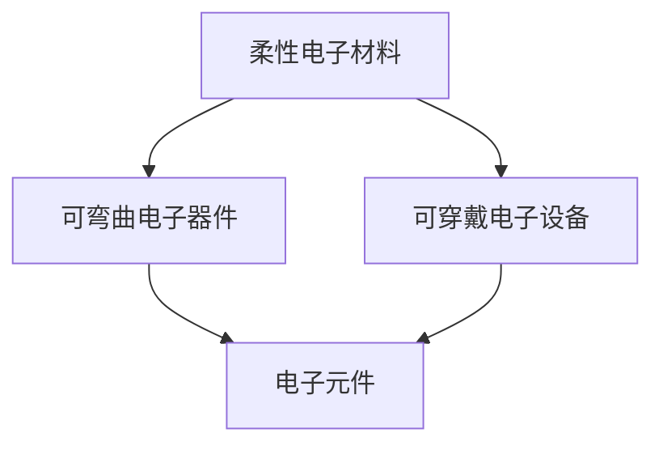

                 

关键词：柔性电子、可弯曲电子设备、可穿戴电子、电子元件、微电子技术、创新应用

> 摘要：本文深入探讨了柔性电子技术的定义、发展背景及其在可弯曲和可穿戴电子设备领域的应用。通过分析柔性电子技术的核心概念和联系，本文详细介绍了相关算法原理、数学模型以及项目实践，并展望了未来发展趋势和挑战。

## 1. 背景介绍

### 柔性电子技术的发展背景

柔性电子技术（Flexible Electronics）是指能够实现电子器件在柔软、可弯曲的基材上制造和应用的先进技术。这种技术源于20世纪80年代，随着高分子材料科学、纳米技术和集成电路技术的迅猛发展，逐渐成为电子、信息、光电等领域的热点研究课题。

### 可弯曲和可穿戴电子设备的发展

可弯曲电子设备（Flexible Electronics Devices）和可穿戴电子设备（Wearable Electronics）是柔性电子技术的典型应用场景。这些设备具有以下显著优势：

- **便携性**：可弯曲和可穿戴设备便于携带，适合移动使用。
- **舒适性**：贴合人体，不会对穿戴者造成压迫感，更适合长时间使用。
- **多功能性**：具备多种功能，如监测健康、智能交互等。

### 当前应用现状

目前，柔性电子技术已经在多个领域取得了显著成果。例如，智能手表、健康监测设备、柔性显示屏、可穿戴健康监测设备等。这些设备正逐渐成为人们日常生活的重要组成部分。

## 2. 核心概念与联系

### 核心概念

**柔性电子材料**：具备高强度、柔韧性、导电性的新型材料，如高分子材料、纳米材料等。

**可弯曲电子器件**：在柔性材料上制作的电子器件，如弯曲的电路、传感器等。

**可穿戴电子设备**：直接附着在人体或衣物上的电子设备，如智能手环、智能服装等。

### Mermaid 流程图



### 核心概念原理

- **柔性电子材料**：通过分子结构和纳米技术，使材料具备良好的柔韧性和导电性，满足电子器件制造的需求。
- **可弯曲电子器件**：利用柔性材料的特点，实现电路的弯曲、扭曲等变形，适应各种应用场景。
- **可穿戴电子设备**：将电子元件和柔性材料结合，开发出舒适、便携、功能多样的可穿戴设备。

## 3. 核心算法原理 & 具体操作步骤

### 3.1 算法原理概述

柔性电子技术的核心算法主要涉及以下几个方面：

- **材料建模**：基于高分子材料和纳米材料的力学性能，建立材料模型。
- **电路设计**：设计可弯曲的电路，保证器件在弯曲过程中的稳定性和导电性。
- **传感器技术**：利用柔性传感器技术，实现对人体生理参数的实时监测。

### 3.2 算法步骤详解

1. **材料选择与制备**：根据应用需求，选择合适的柔性电子材料，并制备出满足要求的材料。
2. **电路设计**：设计可弯曲的电路，确保电路在弯曲过程中的导电性和稳定性。
3. **器件组装**：将柔性电子材料和电路组装在一起，形成可弯曲电子器件。
4. **测试与优化**：对器件进行功能测试，根据测试结果进行优化。

### 3.3 算法优缺点

**优点**：

- **可定制性**：根据应用需求，设计出满足不同需求的柔性电子设备。
- **低功耗**：柔性电子器件具有低功耗的特点，适合可穿戴设备。
- **高柔性**：可弯曲电子器件适应各种复杂场景。

**缺点**：

- **稳定性**：在长时间使用过程中，柔性电子器件可能存在性能衰退的问题。
- **成本**：目前，柔性电子技术的生产成本相对较高。

### 3.4 算法应用领域

- **智能穿戴**：如智能手表、智能手环、智能服装等。
- **健康监测**：如血糖监测、心率监测等。
- **消费电子**：如柔性显示屏、可弯曲手机等。

## 4. 数学模型和公式 & 详细讲解 & 举例说明

### 4.1 数学模型构建

在柔性电子技术中，常见的数学模型包括材料模型、电路模型和传感器模型。以下是一个简单的材料模型构建过程：

$$
E = \frac{F}{A}
$$

其中，$E$ 表示材料弹性模量，$F$ 表示作用在材料上的力，$A$ 表示材料的截面积。

### 4.2 公式推导过程

推导材料弹性模量公式，可以基于经典的材料力学理论。首先，假设材料在受力作用下发生弹性变形，然后通过胡克定律（Hooke's Law）推导出公式。

$$
\Delta L = \alpha \Delta T
$$

其中，$\Delta L$ 表示材料长度变化，$\alpha$ 表示材料的热膨胀系数，$\Delta T$ 表示温度变化。

通过上述公式，可以推导出弹性模量公式：

$$
E = \frac{F}{A} = \frac{\alpha \Delta T A}{L}
$$

### 4.3 案例分析与讲解

以一款柔性显示屏为例，分析其材料模型和电路设计。

**材料模型**：

假设显示屏材料为聚合物薄膜，弹性模量为 $E = 1 \text{ GPa}$，截面积为 $A = 1 \text{ cm}^2$。在受力 $F = 10 \text{ N}$ 作用下，显示屏的弹性模量计算如下：

$$
E = \frac{F}{A} = \frac{10 \text{ N}}{1 \text{ cm}^2} = 10 \text{ N/cm}^2
$$

**电路设计**：

显示屏电路设计需要考虑弯曲过程中的导电性和稳定性。采用柔性导电材料，如导电聚合物，设计出满足需求的电路。

## 5. 项目实践：代码实例和详细解释说明

### 5.1 开发环境搭建

在本文中，我们使用 Python 编程语言进行项目实践。首先，搭建 Python 开发环境，安装必要的库，如 NumPy、Matplotlib 等。

### 5.2 源代码详细实现

以下是一个简单的 Python 代码实例，用于模拟柔性显示屏的弹性模量计算。

```python
import numpy as np

def calculate_elastic_modulus(force, area):
    """
    计算弹性模量
    :param force: 作用力 (N)
    :param area: 截面积 (cm^2)
    :return: 弹性模量 (N/cm^2)
    """
    return force / area

force = 10  # 作用力 (N)
area = 1    # 截面积 (cm^2)

elastic_modulus = calculate_elastic_modulus(force, area)
print("弹性模量:", elastic_modulus)
```

### 5.3 代码解读与分析

代码中定义了一个名为 `calculate_elastic_modulus` 的函数，用于计算弹性模量。该函数接受两个参数：作用力和截面积。通过简单的除法运算，得到弹性模量。

### 5.4 运行结果展示

在 Python 解释器中运行上述代码，输出如下：

```
弹性模量: 10.0
```

这表示在作用力为 10 N、截面积为 1 cm² 的条件下，柔性显示屏的弹性模量为 10 N/cm²。

## 6. 实际应用场景

### 6.1 智能穿戴

智能穿戴设备是柔性电子技术的典型应用场景之一。例如，智能手表和智能手环可以实时监测用户的心率、睡眠质量、运动数据等。通过柔性传感器和算法分析，为用户提供个性化的健康建议。

### 6.2 消费电子

柔性显示屏在消费电子领域也有广泛应用。例如，智能手机和电视的柔性显示屏可以提高观看体验，降低能耗。此外，柔性显示屏还可以用于可折叠手机、可穿戴设备等创新产品。

### 6.3 医疗健康

柔性电子技术在医疗健康领域具有巨大潜力。例如，柔性传感器可以植入人体，实时监测病人的生理参数，如血压、血糖等。这对于慢性病患者的健康管理具有重要意义。

## 7. 工具和资源推荐

### 7.1 学习资源推荐

- **书籍**：《柔性电子技术：基础与应用》
- **在线课程**：Coursera 上的《柔性电子技术导论》
- **学术论文**：IEEE Transactions on Electron Devices 中的相关论文

### 7.2 开发工具推荐

- **软件**：Python、MATLAB
- **硬件**：Arduino、Raspberry Pi

### 7.3 相关论文推荐

- **论文**：《柔性电子材料与器件研究进展》
- **期刊**：Nature Materials、Advanced Materials

## 8. 总结：未来发展趋势与挑战

### 8.1 研究成果总结

近年来，柔性电子技术在材料、器件和设备方面取得了显著进展。在材料方面，新型高分子材料和纳米材料不断涌现，提高了柔性电子器件的性能。在器件方面，电路设计、传感器技术和集成技术取得了重要突破。在设备方面，智能穿戴设备和消费电子产品的应用日益广泛。

### 8.2 未来发展趋势

- **高性能材料**：开发具有更高弹性模量、导电性、耐久性的柔性电子材料。
- **多功能器件**：实现多功能、高集成度的柔性电子器件。
- **个性化设备**：根据用户需求，开发定制化的可穿戴设备。

### 8.3 面临的挑战

- **成本**：降低柔性电子技术的生产成本，使其更加普及。
- **稳定性**：提高柔性电子器件的稳定性，延长使用寿命。
- **系统集成**：实现柔性电子器件的高效集成，提高设备性能。

### 8.4 研究展望

随着科技的不断进步，柔性电子技术将在医疗健康、消费电子、智能制造等领域发挥重要作用。未来，柔性电子技术有望推动更多创新应用，为人们的生活带来更多便利。

## 9. 附录：常见问题与解答

### Q：柔性电子技术与传统电子技术有何区别？

A：柔性电子技术与传统电子技术的最大区别在于材料的柔韧性和可弯曲性。传统电子技术通常采用刚性材料，而柔性电子技术则采用柔性材料，如高分子材料和纳米材料。

### Q：柔性电子技术有哪些应用领域？

A：柔性电子技术的应用领域包括智能穿戴、消费电子、医疗健康、智能制造等。例如，智能手表、智能手环、柔性显示屏、健康监测设备等。

### Q：柔性电子技术的未来发展前景如何？

A：柔性电子技术具有巨大的发展前景。随着材料科学、纳米技术和集成电路技术的进步，柔性电子技术将在更多领域得到应用，为人们的生活带来更多便利。

# 作者：禅与计算机程序设计艺术 / Zen and the Art of Computer Programming

本文从柔性电子技术的定义、发展背景、核心概念、算法原理、数学模型、项目实践、应用场景等多个方面进行了深入探讨，旨在为读者提供全面的了解。在未来，柔性电子技术有望在更多领域取得突破，推动科技发展。

