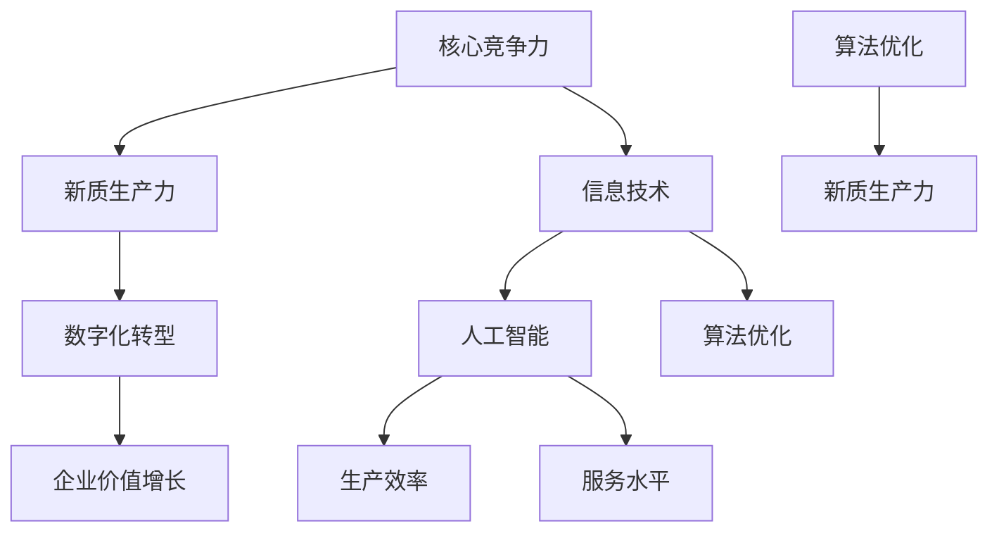

                 

关键词：核心竞争力、新质生产力、信息技术、数字化转型、人工智能、算法优化、技术架构

摘要：随着信息技术的飞速发展，核心竞争力与新质生产力的关系日益紧密。本文将探讨信息技术在数字化转型中的关键作用，分析人工智能和算法优化如何推动新质生产力的崛起，并探讨未来技术发展的趋势与挑战。

## 1. 背景介绍

随着全球经济的不断发展和信息化进程的加速，企业面临的竞争环境日益激烈。传统的核心竞争力已经难以满足现代企业的需求，新质生产力逐渐成为企业持续发展的重要驱动力。新质生产力是指通过技术创新、管理创新和商业模式创新等方式，提高生产效率、降低成本、提升产品质量和服务水平，从而实现企业价值增长的能力。

信息技术的飞速发展为新质生产力的形成提供了强有力的支持。从最初的计算机技术，到互联网、大数据、云计算、物联网等新兴技术的广泛应用，信息技术不断推动着产业变革和生产力升级。人工智能、机器学习、深度学习等算法优化技术的突破，更是为新质生产力的崛起提供了核心动力。

## 2. 核心概念与联系

为了深入理解核心竞争力与新质生产力的关系，我们需要明确以下几个核心概念：

### 2.1 核心竞争力

核心竞争力是指企业在长期竞争过程中形成的、具有竞争优势的能力。它包括企业的技术创新能力、品牌影响力、人力资源、管理体系等多个方面。核心竞争力是企业生存和发展的基石，是企业区别于竞争对手的独特优势。

### 2.2 新质生产力

新质生产力是指通过技术创新、管理创新和商业模式创新等方式，提高生产效率、降低成本、提升产品质量和服务水平，从而实现企业价值增长的能力。新质生产力以信息技术为支撑，具有高效、智能、绿色等特点。

### 2.3 信息技术

信息技术是指应用计算机科学和通信技术来设计、开发、应用和管理的系统，它涵盖了计算机技术、互联网技术、大数据技术、云计算技术、物联网技术等多个方面。信息技术是推动新质生产力发展的重要引擎。

### 2.4 数字化转型

数字化转型是指企业利用信息技术手段，对其业务流程、产品和服务进行数字化升级，从而提高企业的核心竞争力。数字化转型是企业发展新质生产力的重要途径。

### 2.5 人工智能

人工智能是指模拟、延伸和扩展人类智能的理论、方法、技术及应用。人工智能包括机器学习、深度学习、自然语言处理、计算机视觉等多个领域。人工智能技术在企业生产和管理中的应用，可以大幅提升企业的生产效率和服务水平。

### 2.6 算法优化

算法优化是指通过改进算法设计、优化算法实现、提高算法效率等方式，提升算法性能和效果。算法优化是人工智能技术发展的关键，它为新质生产力的提升提供了强有力的技术支持。

### 2.7 Mermaid 流程图

以下是一个描述核心概念与联系关系的 Mermaid 流程图：



## 3. 核心算法原理 & 具体操作步骤

### 3.1 算法原理概述

新质生产力的提升离不开核心算法的支持。核心算法主要包括机器学习算法、深度学习算法、自然语言处理算法、计算机视觉算法等。以下是一个典型的机器学习算法——支持向量机（SVM）的原理概述：

支持向量机是一种二分类模型，其基本模型定义为特征空间上的间隔最大的线性分类器，间隔最大是SVM最大的特点。在给定训练数据集中，寻找一个最佳 hyperplane 来完成分类任务。

### 3.2 算法步骤详解

1. **数据预处理**：对输入数据进行归一化、缺失值填充、异常值处理等操作，确保数据质量。

2. **特征提取**：从原始数据中提取有助于分类的特征，如文本数据的词频、词向量等。

3. **模型选择**：选择适当的机器学习算法，如SVM、决策树、神经网络等。

4. **模型训练**：使用训练数据集对选定的模型进行训练，优化模型参数。

5. **模型评估**：使用验证数据集评估模型性能，如准确率、召回率、F1 值等。

6. **模型应用**：将训练好的模型应用于实际业务场景，如预测、分类等。

### 3.3 算法优缺点

**优点**：
- **高效**：支持向量机在处理大规模数据集时具有较高的效率。
- **鲁棒**：支持向量机对噪声和异常值具有较强的鲁棒性。
- **可扩展**：支持向量机可以扩展到高维空间，适用于各种复杂数据类型。

**缺点**：
- **计算复杂度**：支持向量机的计算复杂度较高，尤其是在大规模数据集上训练时。
- **对数据分布敏感**：支持向量机对数据分布较为敏感，可能无法处理不平衡数据集。

### 3.4 算法应用领域

支持向量机广泛应用于各类分类问题，如文本分类、图像分类、语音识别、生物信息学等。在工业界，支持向量机被广泛应用于金融风控、医疗诊断、智能制造等领域。

## 4. 数学模型和公式 & 详细讲解 & 举例说明

### 4.1 数学模型构建

支持向量机的数学模型基于以下优化问题：

$$
\begin{align*}
\min_{\mathbf{w}, b} & \frac{1}{2}||\mathbf{w}||^2 \\
\text{subject to} & y_i(\mathbf{w}\cdot\mathbf{x_i} + b) \geq 1, \quad i = 1, 2, ..., n
\end{align*}
$$

其中，$\mathbf{w}$ 是权重向量，$b$ 是偏置项，$\mathbf{x_i}$ 是第 $i$ 个样本的特征向量，$y_i$ 是第 $i$ 个样本的标签。

### 4.2 公式推导过程

1. **拉格朗日函数**：

$$
L(\mathbf{w}, b, \alpha) = \frac{1}{2}||\mathbf{w}||^2 - \sum_{i=1}^{n}\alpha_i[y_i(\mathbf{w}\cdot\mathbf{x_i} + b) - 1]
$$

其中，$\alpha_i$ 是拉格朗日乘子。

2. **KKT 条件**：

$$
\begin{align*}
\alpha_i \geq 0, \quad \forall i \\
\mathbf{w} = \sum_{i=1}^{n}\alpha_i y_i\mathbf{x_i} \\
\alpha_i[y_i(\mathbf{w}\cdot\mathbf{x_i} + b) - 1] = 0, \quad \forall i
\end{align*}
$$

3. **求解最优解**：

$$
\begin{align*}
\mathbf{w}^* &= \sum_{i=1}^{n}\alpha_i y_i\mathbf{x_i} \\
b^* &= y_j - \sum_{i=1}^{n}\alpha_i y_i(\mathbf{x_i}\cdot\mathbf{x_j})
\end{align*}
$$

### 4.3 案例分析与讲解

假设有一个二分类问题，其中正类样本 $y_i = +1$，负类样本 $y_i = -1$。给定训练数据集 $\{\mathbf{x_1}, \mathbf{x_2}, ..., \mathbf{x_n}\}$，标签集 $\{y_1, y_2, ..., y_n\}$。

1. **数据预处理**：对输入数据进行归一化处理，使得特征向量的范数为 1。

2. **特征提取**：从原始数据中提取有助于分类的特征，如文本数据的词频、词向量等。

3. **模型选择**：选择支持向量机作为分类模型。

4. **模型训练**：使用训练数据集对支持向量机进行训练，优化模型参数。

5. **模型评估**：使用验证数据集评估模型性能。

6. **模型应用**：将训练好的模型应用于实际业务场景，如文本分类任务。

## 5. 项目实践：代码实例和详细解释说明

### 5.1 开发环境搭建

- Python 3.8 或更高版本
- Scikit-learn 库

### 5.2 源代码详细实现

```python
from sklearn import datasets
from sklearn.model_selection import train_test_split
from sklearn.preprocessing import StandardScaler
from sklearn.svm import SVC
from sklearn.metrics import accuracy_score

# 加载 Iris 数据集
iris = datasets.load_iris()
X = iris.data
y = iris.target

# 划分训练集和测试集
X_train, X_test, y_train, y_test = train_test_split(X, y, test_size=0.2, random_state=42)

# 数据预处理
scaler = StandardScaler()
X_train = scaler.fit_transform(X_train)
X_test = scaler.transform(X_test)

# 模型选择
model = SVC(kernel='linear', C=1.0)

# 模型训练
model.fit(X_train, y_train)

# 模型评估
y_pred = model.predict(X_test)
accuracy = accuracy_score(y_test, y_pred)
print("Accuracy:", accuracy)

# 模型应用
new_data = [[3, 5], [2, 4]]
new_data = scaler.transform(new_data)
new_pred = model.predict(new_data)
print("Predictions:", new_pred)
```

### 5.3 代码解读与分析

1. **导入库和模块**：导入所需的库和模块，包括 Scikit-learn 库。

2. **加载数据集**：使用 Scikit-learn 库加载 Iris 数据集。

3. **划分训练集和测试集**：使用 `train_test_split` 函数将数据集划分为训练集和测试集。

4. **数据预处理**：使用 `StandardScaler` 对输入数据进行归一化处理，确保特征向量的范数为 1。

5. **模型选择**：选择支持向量机（SVC）作为分类模型，并设置线性核函数（`kernel='linear'`）和惩罚参数（`C=1.0`）。

6. **模型训练**：使用训练数据集对支持向量机模型进行训练。

7. **模型评估**：使用测试数据集评估模型性能，计算准确率。

8. **模型应用**：将训练好的模型应用于新数据集，预测新数据的分类结果。

## 6. 实际应用场景

支持向量机在各类实际应用场景中具有广泛的应用，以下是一些典型的应用案例：

1. **文本分类**：支持向量机被广泛应用于文本分类任务，如垃圾邮件过滤、情感分析、主题分类等。

2. **图像分类**：支持向量机在图像分类任务中表现出色，如人脸识别、物体检测、图像标注等。

3. **语音识别**：支持向量机在语音识别任务中用于语音信号的分类和识别，如语音助手、智能客服等。

4. **生物信息学**：支持向量机在生物信息学领域应用于基因分类、蛋白质结构预测、疾病诊断等。

5. **金融风控**：支持向量机在金融风控领域用于信用评分、欺诈检测、风险控制等。

## 7. 未来应用展望

随着人工智能技术的不断发展，支持向量机在各个领域的应用前景将更加广阔。未来，支持向量机有望在以下几个方面实现突破：

1. **多模态数据融合**：支持向量机与其他人工智能技术（如深度学习、强化学习等）相结合，实现多模态数据的融合和处理。

2. **大规模数据处理**：优化支持向量机的算法和实现，提高其在处理大规模数据集时的效率和性能。

3. **自适应学习**：支持向量机将具备更强的自适应学习能力，能够根据数据特征和业务需求进行动态调整。

4. **跨领域应用**：支持向量机将在更多领域实现应用，如医疗、能源、交通等。

## 8. 工具和资源推荐

为了更好地学习和应用支持向量机，以下是一些建议的工具和资源：

### 8.1 学习资源推荐

- 《支持向量机：理论与应用》
- 《机器学习实战》
- 《深度学习》

### 8.2 开发工具推荐

- Jupyter Notebook
- Python 社区

### 8.3 相关论文推荐

- "Support Vector Machines for Classification and Regression"
- "A Tutorial on Support Vector Machines for Pattern Recognition"
- "An Overview of Support Vector Machines"

## 9. 总结：未来发展趋势与挑战

### 9.1 研究成果总结

支持向量机作为一种强大的机器学习算法，在分类、回归、聚类等多个领域取得了显著成果。其在文本分类、图像分类、语音识别等实际应用场景中表现出色，为各行业的数据处理和决策提供了有力支持。

### 9.2 未来发展趋势

1. **多模态数据处理**：支持向量机与其他人工智能技术相结合，实现多模态数据的融合和处理。
2. **大规模数据处理**：优化支持向量机的算法和实现，提高其在处理大规模数据集时的效率和性能。
3. **自适应学习**：支持向量机将具备更强的自适应学习能力，能够根据数据特征和业务需求进行动态调整。

### 9.3 面临的挑战

1. **计算复杂度**：支持向量机在处理大规模数据集时存在计算复杂度较高的问题，需要优化算法和实现。
2. **模型解释性**：支持向量机的决策过程较为复杂，难以解释，需要提高其解释性。

### 9.4 研究展望

支持向量机作为一种经典的机器学习算法，在未来仍具有广阔的研究和应用前景。通过优化算法和实现，提高其在处理大规模数据集和跨领域应用中的性能，支持向量机将为各行业的数据处理和决策提供更加有力的支持。

## 9. 附录：常见问题与解答

### Q1. 支持向量机与其他机器学习算法相比有哪些优势？

A1. 支持向量机具有以下优势：

- **高效**：支持向量机在处理大规模数据集时具有较高的效率。
- **鲁棒**：支持向量机对噪声和异常值具有较强的鲁棒性。
- **可扩展**：支持向量机可以扩展到高维空间，适用于各种复杂数据类型。
- **分类效果良好**：支持向量机在各类分类任务中表现出色，具有较高的准确率。

### Q2. 支持向量机如何处理不平衡数据集？

A2. 支持向量机可以通过以下方法处理不平衡数据集：

- **过采样**：增加少数类别的样本数量，使得数据集分布趋于平衡。
- **欠采样**：减少多数类别的样本数量，使得数据集分布趋于平衡。
- **集成学习**：将支持向量机与其他机器学习算法（如决策树、随机森林等）结合，提高分类效果。

### Q3. 支持向量机的参数如何选择？

A3. 支持向量机的参数选择包括：

- **惩罚参数 C**：控制模型复杂度和过拟合程度。
- **核函数类型**：选择合适的核函数，如线性核、多项式核、径向基核等。
- **核函数参数**：根据具体问题调整核函数参数，提高分类效果。

通常，可以使用交叉验证方法选择最优参数组合。

---

作者：禅与计算机程序设计艺术 / Zen and the Art of Computer Programming
--------------------------------------------------------------------

