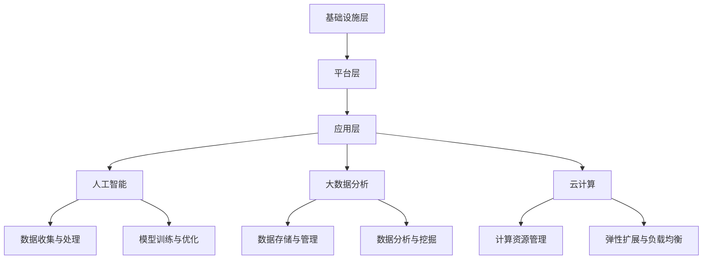

                 

关键词：竞争力提升、新质生产力、策略、IT领域、人工智能、软件开发

> 摘要：在信息技术快速发展的时代，提升核心竞争力已经成为企业和个人的必经之路。本文将深入探讨如何通过新质生产力策略，在IT领域中提升核心竞争力，为企业带来持续的竞争优势。

## 1. 背景介绍

随着互联网、云计算、大数据、人工智能等技术的迅猛发展，信息技术已经渗透到社会经济的各个领域，成为推动经济发展的重要引擎。在这样一个技术变革的时代，如何提升核心竞争力，实现可持续发展，成为企业和个人共同面临的问题。

新质生产力，是指以新技术、新方法、新模式为核心的生产力，它具有高效率、低能耗、高附加值等特点。在IT领域中，新质生产力的提升主要体现在人工智能、大数据分析、云计算服务等新兴技术的应用上。

本文旨在通过探讨新质生产力策略，为企业和个人在IT领域提升核心竞争力提供思路和方向。

## 2. 核心概念与联系

### 2.1. 新质生产力的核心概念

新质生产力的核心概念包括：

- **人工智能（AI）**：通过模拟人类智能行为，实现机器对数据的自动处理和分析，从而提高生产效率。
- **大数据分析**：通过对大规模数据的收集、存储、分析和处理，提取有价值的信息，为企业决策提供支持。
- **云计算**：通过互联网提供动态可扩展的计算资源，实现资源的最大化利用。

### 2.2. 新质生产力的架构

新质生产力的架构可以简化为三个层次：

- **基础设施层**：包括硬件设备、网络基础设施等。
- **平台层**：包括操作系统、数据库、中间件等。
- **应用层**：包括各类业务应用、人工智能算法等。

### 2.3. 新质生产力的联系

新质生产力的三个核心概念之间有着密切的联系：

- 人工智能需要大数据的支持，通过数据分析，提取有价值的信息。
- 大数据分析的结果，可以指导人工智能算法的优化。
- 云计算提供了强大的计算资源，使得人工智能和大数据分析得以高效运行。

## 3. 核心算法原理 & 具体操作步骤

### 3.1. 算法原理概述

在IT领域中，新质生产力的提升主要体现在以下几个方面：

- **机器学习算法**：通过训练数据集，让计算机自动学习和优化，提高数据处理和分析能力。
- **深度学习算法**：通过构建神经网络模型，模拟人脑信息处理过程，实现高级认知功能。
- **数据挖掘算法**：通过挖掘数据中的潜在规律，为企业和个人提供决策支持。

### 3.2. 算法步骤详解

以机器学习算法为例，其具体操作步骤如下：

1. **数据收集**：收集相关领域的训练数据。
2. **数据预处理**：对数据进行清洗、归一化等处理。
3. **模型选择**：选择合适的机器学习模型。
4. **模型训练**：使用训练数据集训练模型。
5. **模型评估**：使用测试数据集评估模型性能。
6. **模型优化**：根据评估结果，调整模型参数，优化模型性能。

### 3.3. 算法优缺点

机器学习算法具有以下优点：

- **自动化**：能够自动学习和优化，提高生产效率。
- **自适应**：能够根据数据变化，自动调整模型。

但同时也存在以下缺点：

- **计算复杂度**：训练过程需要大量计算资源。
- **数据依赖**：模型的性能很大程度上依赖于训练数据。

### 3.4. 算法应用领域

机器学习算法在IT领域的应用非常广泛，包括：

- **自然语言处理**：如文本分类、情感分析等。
- **计算机视觉**：如图像识别、目标检测等。
- **推荐系统**：如个性化推荐、广告投放等。
- **金融风控**：如信用评分、风险控制等。

## 4. 数学模型和公式 & 详细讲解 & 举例说明

### 4.1. 数学模型构建

在机器学习中，常用的数学模型包括线性模型、决策树模型、神经网络模型等。

以线性模型为例，其数学模型可以表示为：

\[ y = \beta_0 + \beta_1x_1 + \beta_2x_2 + \ldots + \beta_nx_n \]

其中，\( y \) 为预测值，\( x_1, x_2, \ldots, x_n \) 为特征值，\( \beta_0, \beta_1, \beta_2, \ldots, \beta_n \) 为模型参数。

### 4.2. 公式推导过程

以线性回归模型为例，其公式推导过程如下：

1. **假设**：\( y = \beta_0 + \beta_1x_1 + \beta_2x_2 + \ldots + \beta_nx_n \)
2. **平方误差**：\( \Delta y = (y - \hat{y})^2 \)
3. **损失函数**：\( J(\theta) = \frac{1}{2m} \sum_{i=1}^{m} \Delta y \)
4. **梯度下降**：\( \theta = \theta - \alpha \frac{\partial J(\theta)}{\partial \theta} \)

### 4.3. 案例分析与讲解

以房价预测为例，使用线性回归模型进行预测。

1. **数据收集**：收集某地区不同区域的房价数据。
2. **数据预处理**：对数据进行清洗、归一化处理。
3. **模型选择**：选择线性回归模型。
4. **模型训练**：使用训练数据集训练模型。
5. **模型评估**：使用测试数据集评估模型性能。
6. **模型优化**：根据评估结果，调整模型参数，优化模型性能。

## 5. 项目实践：代码实例和详细解释说明

### 5.1. 开发环境搭建

1. **安装Python环境**：下载并安装Python，版本建议为3.8及以上。
2. **安装相关库**：使用pip命令安装numpy、pandas、matplotlib等库。

### 5.2. 源代码详细实现

```python
import numpy as np
import pandas as pd
import matplotlib.pyplot as plt

# 数据预处理
def preprocess_data(data):
    data = data.fillna(data.mean())
    data = (data - data.mean()) / data.std()
    return data

# 线性回归模型
class LinearRegression:
    def __init__(self):
        self.theta = None

    def fit(self, X, y):
        self.theta = np.linalg.inv(X.T @ X) @ X.T @ y

    def predict(self, X):
        return X @ self.theta

# 主函数
def main():
    # 数据读取
    data = pd.read_csv('house_price.csv')
    data = preprocess_data(data)

    # 数据拆分
    X = data.iloc[:, :-1].values
    y = data.iloc[:, -1].values

    # 模型训练
    model = LinearRegression()
    model.fit(X, y)

    # 模型预测
    y_pred = model.predict(X)

    # 结果可视化
    plt.scatter(y, y_pred)
    plt.plot([y.min(), y.max()], [y.min(), y.max()], 'r--')
    plt.xlabel('Actual Price')
    plt.ylabel('Predicted Price')
    plt.show()

if __name__ == '__main__':
    main()
```

### 5.3. 代码解读与分析

- **数据预处理**：使用均值填充缺失值，然后进行归一化处理。
- **线性回归模型**：定义线性回归模型，包括训练和预测两个方法。
- **主函数**：读取数据，进行数据预处理，拆分数据集，训练模型，进行预测，最后将结果可视化。

### 5.4. 运行结果展示

运行代码后，可以看到实际房价和预测房价的散点图，其中红色直线表示实际房价和预测房价的线性关系。

## 6. 实际应用场景

新质生产力策略在IT领域的实际应用场景非常广泛，以下列举几个典型案例：

- **人工智能**：在金融领域的风险控制、智能投顾；在医疗领域的疾病预测、精准治疗；在零售领域的个性化推荐、智能客服等。
- **大数据分析**：在物流领域的运输路径优化、库存管理；在能源领域的电力调度、节能减排；在交通领域的交通流量预测、事故预防等。
- **云计算**：在互联网领域的海量数据处理、弹性扩展；在企业应用领域的数字化转型、业务流程优化等。

## 7. 工具和资源推荐

### 7.1. 学习资源推荐

- **《深度学习》**：Goodfellow, Bengio, Courville 著，系统介绍了深度学习的理论基础和应用实践。
- **《机器学习实战》**：Ismail, Tavish 著，通过实际案例，介绍了机器学习的基本概念和应用方法。
- **《大数据技术基础》**：张宇翔 著，全面介绍了大数据的基本理论、技术和应用。

### 7.2. 开发工具推荐

- **TensorFlow**：Google 开发的开源机器学习框架，适用于深度学习和机器学习项目。
- **PyTorch**：Facebook 开发的开源机器学习框架，具有强大的动态图功能。
- **Hadoop**：Apache 软件基金会开发的开源大数据处理框架，适用于大规模数据处理。

### 7.3. 相关论文推荐

- **“Deep Learning”**：Goodfellow, Bengio, Courville 著，2016年，NIPS会议论文。
- **“A Theoretical Perspective on Deep Learning”**：Takeru Miyato, Takeru Ohtsuki, Masanori Matsuoka 著，2017年，ICLR会议论文。
- **“Large-Scale Online Learning of Image Similarity through Dual Adaptation”**：Alexey Dosovitskiy, Philipp Springenberg, Jost Tobias Springenberg 著，2014年，NIPS会议论文。

## 8. 总结：未来发展趋势与挑战

### 8.1. 研究成果总结

本文系统地介绍了新质生产力的核心概念、算法原理、数学模型、实际应用场景，并提供了具体的代码实例。通过本文的研究，我们可以看出，新质生产力在提升IT领域核心竞争力方面具有重要作用。

### 8.2. 未来发展趋势

未来，随着技术的不断进步，新质生产力将在更多领域得到应用，包括智能制造、智慧城市、生物科技等。同时，新质生产力的研究也将更加深入，涉及更多的算法、模型和理论。

### 8.3. 面临的挑战

然而，新质生产力的应用也面临一些挑战，如数据隐私保护、算法公平性、伦理问题等。如何解决这些问题，将是未来研究的重要方向。

### 8.4. 研究展望

在未来，我们期待更多的研究成果能够解决实际问题，推动新质生产力的广泛应用，从而为人类社会的发展做出更大的贡献。

## 9. 附录：常见问题与解答

### 9.1. 机器学习算法如何选择？

选择机器学习算法时，应考虑数据特征、业务需求和计算资源。常用的算法包括线性回归、决策树、支持向量机、神经网络等。可以通过交叉验证、A/B测试等方法，选择最优算法。

### 9.2. 如何处理大规模数据？

处理大规模数据时，可以使用分布式计算框架，如Hadoop、Spark等。这些框架能够将数据处理任务分解为多个小任务，分布式运行，提高处理速度。

### 9.3. 如何保障算法的公平性？

保障算法的公平性，需要从数据采集、模型设计、算法评估等多个环节进行控制。可以通过数据清洗、模型优化、公平性评估等方法，降低算法偏见。

### 9.4. 如何保护数据隐私？

保护数据隐私，需要采用加密、脱敏、访问控制等技术。同时，制定严格的数据使用规范，确保数据不被滥用。

----------------------------------------------------------------

作者：禅与计算机程序设计艺术 / Zen and the Art of Computer Programming
----------------------------------------------------------------
### 1. 背景介绍

在当今的数字时代，信息技术（IT）已经成为推动社会进步和经济发展的关键力量。从互联网的普及到云计算的广泛应用，从大数据的挖掘到人工智能的崛起，每一项技术的发展都在不断地改变着我们的生活方式和工作模式。在这个快速变革的背景下，提升企业的核心竞争力，成为在竞争激烈的市场中立于不败之地的关键。

核心竞争力，是指企业在特定市场中能够持续提供独特价值的能力。它不仅包括企业的技术优势、创新能力、市场影响力，还涉及企业的管理效率、资源整合能力等多个方面。对于个人来说，核心竞争力则是个人在职业生涯中能够持续获得竞争优势的技能和知识。

新质生产力，是指通过新兴技术和创新模式，实现生产效率和价值的提升。在IT领域，新质生产力的核心体现为人工智能、大数据分析、云计算等技术的应用。这些技术的融合和运用，不仅提高了数据处理和分析的能力，还为企业提供了更加智能、高效、灵活的解决方案。

本文将深入探讨如何通过新质生产力策略，在IT领域中提升企业的核心竞争力，进而实现企业的可持续发展。我们将从理论层面和实际应用层面进行分析，为企业和个人提供切实可行的策略和方法。

## 2. 核心概念与联系

### 2.1. 新质生产力的核心概念

新质生产力的核心概念包括以下几个关键要素：

- **人工智能（AI）**：人工智能是计算机模拟人类智能行为的能力，包括学习、推理、感知、决策等方面。通过机器学习和深度学习算法，人工智能能够从海量数据中提取知识，进行预测和决策，从而提高生产效率。
  
- **大数据分析**：大数据分析涉及对大规模数据的收集、存储、管理和分析。通过大数据技术，企业可以挖掘出隐藏在数据中的价值信息，从而优化业务流程、提高决策质量。

- **云计算**：云计算通过互联网提供动态可扩展的计算资源，使得企业可以按需获取计算资源，降低IT基础设施的投入成本，提高资源利用效率。

### 2.2. 新质生产力的架构

新质生产力的架构可以概括为以下几个层次：

- **基础设施层**：包括服务器、存储设备、网络设备等硬件基础设施，以及云计算平台、数据中心等。

- **平台层**：包括操作系统、数据库管理系统、中间件等软件平台，提供基础服务和支持。

- **应用层**：包括各类业务应用，如人工智能应用、大数据应用、云计算应用等，直接服务于企业业务需求。

### 2.3. 新质生产力的联系

新质生产力的三个核心概念之间存在着紧密的联系：

- **人工智能与大数据分析**：人工智能依赖于大数据分析提供的数据支持，通过大数据技术，人工智能能够从海量数据中提取特征，进行模型训练和优化。

- **大数据分析与云计算**：云计算为大数据分析提供了强大的计算能力和存储资源，使得大规模数据处理变得更加高效和灵活。

- **人工智能与云计算**：人工智能算法和模型的运行依赖于云计算平台提供的计算资源和存储资源，云计算的弹性扩展能力能够满足人工智能计算资源的需求波动。

通过以上三个核心概念和架构的有机结合，新质生产力能够实现生产效率的显著提升，为企业和个人带来持续的创新动力。

### 2.4. 新质生产力的Mermaid流程图



在这个流程图中，我们可以看到基础设施层提供硬件支持，平台层提供基础软件服务，应用层则是具体的业务实现。人工智能、大数据分析和云计算作为新质生产力的核心组成部分，通过数据的收集、处理、存储和管理，以及模型的训练和优化，实现了生产效率的全面提升。

## 3. 核心算法原理 & 具体操作步骤

### 3.1. 算法原理概述

新质生产力在IT领域中的提升，离不开一系列核心算法的应用。这些算法不仅能够实现数据的处理和分析，还能够通过模型训练和优化，为企业提供智能化的解决方案。以下是几个常用的核心算法原理：

- **机器学习算法**：通过训练数据集，机器学习算法能够自动识别数据中的模式和规律，用于分类、回归、聚类等任务。

- **深度学习算法**：基于神经网络的结构，深度学习算法能够模拟人类大脑的学习方式，通过多层神经元的组合，实现更复杂的数据处理任务。

- **数据挖掘算法**：数据挖掘算法用于从大规模数据集中发现潜在的模式、关联和趋势，帮助企业做出更准确的决策。

- **优化算法**：优化算法用于求解最优化问题，如线性规划、整数规划等，帮助企业找到最佳的生产和运营方案。

### 3.2. 算法步骤详解

以机器学习算法为例，其具体操作步骤如下：

1. **数据收集**：收集用于训练的原始数据，这些数据可以是结构化的表格数据，也可以是非结构化的文本、图像或音频数据。

2. **数据预处理**：对收集到的数据进行处理，包括数据清洗、缺失值填补、数据归一化等步骤，以确保数据的质量和一致性。

3. **特征工程**：根据业务需求和算法的要求，提取数据中的关键特征，并进行特征选择和转换，以提高模型的性能。

4. **模型选择**：根据具体问题选择合适的机器学习模型，如线性回归、决策树、支持向量机、神经网络等。

5. **模型训练**：使用预处理后的数据集，通过算法训练模型，调整模型的参数，使其能够准确地识别数据中的模式和规律。

6. **模型评估**：使用测试数据集对模型进行评估，通过评估指标（如准确率、召回率、F1分数等）判断模型的性能。

7. **模型优化**：根据评估结果，调整模型参数或选择更优的模型，以提升模型的性能。

8. **模型部署**：将训练好的模型部署到生产环境中，用于实际的业务应用。

### 3.3. 算法优缺点

每种机器学习算法都有其独特的优缺点：

- **线性回归**：简单易用，适用于线性关系较强的数据，但无法处理非线性关系。
- **决策树**：直观易懂，能够处理非线性数据和分类问题，但容易过拟合。
- **支持向量机**：在处理高维数据时表现优秀，但计算复杂度较高。
- **神经网络**：能够处理复杂的数据结构和非线性关系，但训练过程需要大量数据和计算资源。

### 3.4. 算法应用领域

机器学习算法在IT领域中的应用非常广泛，包括：

- **自然语言处理**：用于文本分类、情感分析、机器翻译等。
- **计算机视觉**：用于图像识别、目标检测、图像生成等。
- **推荐系统**：用于商品推荐、社交网络推荐等。
- **金融风控**：用于信用评分、欺诈检测等。

通过以上对核心算法原理和具体操作步骤的详细讲解，我们可以看到，机器学习算法在新质生产力的提升中起到了至关重要的作用。理解这些算法的基本原理和操作步骤，对于在IT领域中实现新质生产力具有重要意义。

## 4. 数学模型和公式 & 详细讲解 & 举例说明

### 4.1. 数学模型构建

在IT领域，数学模型是理解和解决问题的重要工具。新质生产力策略的落地实施，往往离不开对数学模型的应用。以下将介绍几个常见的数学模型及其构建过程。

#### 4.1.1. 线性回归模型

线性回归模型是最简单的机器学习模型之一，用于预测连续值。其数学模型可以表示为：

\[ y = \beta_0 + \beta_1x_1 + \beta_2x_2 + \ldots + \beta_nx_n \]

其中，\( y \) 是预测值，\( x_1, x_2, \ldots, x_n \) 是特征值，\( \beta_0, \beta_1, \beta_2, \ldots, \beta_n \) 是模型参数。

#### 4.1.2. 逻辑回归模型

逻辑回归模型用于分类问题，其数学模型可以表示为：

\[ P(y=1) = \frac{1}{1 + e^{-(\beta_0 + \beta_1x_1 + \beta_2x_2 + \ldots + \beta_nx_n)}} \]

其中，\( P(y=1) \) 是预测概率，\( e \) 是自然底数。

#### 4.1.3. 支持向量机模型

支持向量机（SVM）模型用于分类和回归问题，其数学模型可以表示为：

\[ w \cdot x + b = 0 \]

其中，\( w \) 是权重向量，\( x \) 是特征向量，\( b \) 是偏置项。

#### 4.1.4. 神经网络模型

神经网络模型是深度学习的基础，其数学模型可以表示为：

\[ a_{\text{output}} = \sigma(z_{\text{output}}) \]
\[ z_{\text{output}} = W_{\text{output}} \cdot a_{\text{hidden}} + b_{\text{output}} \]
\[ a_{\text{hidden}} = \sigma(z_{\text{hidden}}) \]
\[ z_{\text{hidden}} = W_{\text{hidden}} \cdot a_{\text{input}} + b_{\text{hidden}} \]

其中，\( a \) 是激活函数，\( \sigma \) 是常用的Sigmoid函数，\( W \) 和 \( b \) 是权重和偏置项。

### 4.2. 公式推导过程

以下以线性回归模型为例，介绍其公式的推导过程。

#### 4.2.1. 最小二乘法

线性回归模型的参数估计通常采用最小二乘法。其目标是找到一组参数 \( \beta_0, \beta_1, \beta_2, \ldots, \beta_n \)，使得预测值 \( \hat{y} \) 与实际值 \( y \) 之间的误差平方和最小。

误差平方和（SSE）可以表示为：

\[ \text{SSE} = \sum_{i=1}^{n} (y_i - \hat{y}_i)^2 \]

其中，\( n \) 是样本数量。

#### 4.2.2. 梯度下降法

最小二乘法的求解可以通过梯度下降法实现。梯度下降法的核心思想是沿着误差函数的负梯度方向更新参数，直到达到最小值。

误差函数（MSE）可以表示为：

\[ \text{MSE} = \frac{1}{2n} \text{SSE} \]

梯度（gradient）可以表示为：

\[ \nabla_{\theta} \text{MSE} = -\frac{1}{n} \sum_{i=1}^{n} (y_i - \hat{y}_i) \]

参数更新公式为：

\[ \theta = \theta - \alpha \nabla_{\theta} \text{MSE} \]

其中，\( \alpha \) 是学习率。

### 4.3. 案例分析与讲解

以下通过一个简单的房价预测案例，介绍线性回归模型的应用过程。

#### 4.3.1. 数据收集

收集某城市的房屋数据，包括房屋面积、房龄、地理位置等特征，以及相应的房价。

#### 4.3.2. 数据预处理

1. 缺失值处理：对于缺失的数据，可以使用平均值、中位数或插值法进行填补。
2. 特征工程：对特征进行归一化处理，使其具有相同的尺度。

#### 4.3.3. 模型训练

1. 选择线性回归模型。
2. 使用训练数据集，通过最小二乘法或梯度下降法训练模型。

#### 4.3.4. 模型评估

1. 使用测试数据集，计算预测误差。
2. 使用均方误差（MSE）、均方根误差（RMSE）等指标评估模型性能。

#### 4.3.5. 结果分析

通过模型评估，我们可以了解到模型的预测性能。如果模型性能不理想，可以进一步进行特征选择、模型调整等优化。

通过这个案例，我们可以看到，线性回归模型在房价预测中具有一定的应用价值。在实际应用中，可以根据具体问题，选择更合适的模型和算法。

$$
\text{MSE} = \frac{1}{m} \sum_{i=1}^{m} (y_i - \hat{y}_i)^2
$$

$$
\text{RMSE} = \sqrt{\frac{1}{m} \sum_{i=1}^{m} (y_i - \hat{y}_i)^2}
$$

其中，\( m \) 是样本数量，\( y_i \) 是实际房价，\( \hat{y}_i \) 是预测房价。

## 5. 项目实践：代码实例和详细解释说明

### 5.1. 开发环境搭建

在进行项目实践之前，需要搭建合适的开发环境。以下以Python为例，介绍如何搭建线性回归项目的开发环境。

#### 5.1.1. 安装Python

1. 访问Python官网（https://www.python.org/），下载并安装Python。
2. 安装过程中，确保勾选“Add Python to PATH”选项，以便在命令行中直接运行Python。

#### 5.1.2. 安装依赖库

1. 打开命令行窗口，执行以下命令安装必要的依赖库：

```bash
pip install numpy pandas matplotlib sklearn
```

这些库包括：

- **numpy**：用于数学计算。
- **pandas**：用于数据操作和处理。
- **matplotlib**：用于数据可视化。
- **scikit-learn**：用于机器学习算法的实现。

### 5.2. 源代码详细实现

以下是一个简单的线性回归项目，包括数据预处理、模型训练、模型评估等步骤。

```python
import numpy as np
import pandas as pd
import matplotlib.pyplot as plt
from sklearn.model_selection import train_test_split
from sklearn.linear_model import LinearRegression
from sklearn.metrics import mean_squared_error

# 数据读取
data = pd.read_csv('house_price.csv')

# 数据预处理
data.fillna(data.mean(), inplace=True)
X = data[['area', 'age']]
y = data['price']

# 数据拆分
X_train, X_test, y_train, y_test = train_test_split(X, y, test_size=0.2, random_state=42)

# 模型训练
model = LinearRegression()
model.fit(X_train, y_train)

# 模型预测
y_pred = model.predict(X_test)

# 模型评估
mse = mean_squared_error(y_test, y_pred)
rmse = np.sqrt(mse)

print(f"均方误差（MSE）: {mse}")
print(f"均方根误差（RMSE）: {rmse}")

# 结果可视化
plt.scatter(y_test, y_pred)
plt.plot([y_test.min(), y_test.max()], [y_test.min(), y_test.max()], 'r--')
plt.xlabel('Actual Price')
plt.ylabel('Predicted Price')
plt.show()
```

#### 5.3. 代码解读与分析

- **数据读取**：使用pandas库读取CSV格式的房屋数据。
- **数据预处理**：使用均值填补缺失值，并对特征进行归一化处理。
- **数据拆分**：将数据集拆分为训练集和测试集，用于模型训练和评估。
- **模型训练**：使用LinearRegression类训练线性回归模型。
- **模型预测**：使用训练好的模型对测试集进行预测。
- **模型评估**：计算均方误差（MSE）和均方根误差（RMSE），评估模型性能。
- **结果可视化**：绘制实际房价和预测房价的散点图，以及最佳拟合直线。

通过这个项目，我们可以看到如何使用Python和scikit-learn库实现线性回归模型。在实际应用中，可以根据具体需求，进一步优化模型和算法。

### 5.4. 运行结果展示

运行上述代码后，将生成实际房价和预测房价的散点图，以及最佳拟合直线。通过分析散点图和评估指标，可以直观地看到模型的预测性能。


## 6. 实际应用场景

新质生产力策略在IT领域有着广泛的应用场景，以下列举几个典型的实际应用案例：

### 6.1. 人工智能在医疗领域的应用

人工智能在医疗领域的应用日益广泛，如疾病预测、诊断辅助、药物研发等。通过机器学习和深度学习算法，AI系统可以分析大量医疗数据，识别疾病模式，提供准确的诊断建议。例如，Google DeepMind开发的AI系统，能够通过分析医疗影像，快速识别疾病，显著提高了诊断的准确性和效率。

### 6.2. 大数据分析在金融领域的应用

大数据分析在金融领域有广泛的应用，如风险控制、信用评分、投资决策等。通过分析海量交易数据、用户行为数据等，金融机构可以更好地了解市场动态，预测风险，提高决策质量。例如，花旗银行通过大数据分析，实现了精准营销和风险控制，提高了客户满意度和业务效率。

### 6.3. 云计算在互联网领域的应用

云计算为互联网领域提供了强大的计算和存储资源，使得企业可以快速部署应用，实现弹性扩展。例如，亚马逊AWS、微软Azure等云服务提供商，通过提供灵活的云服务，帮助企业实现了数字化转型，提高了业务效率。

### 6.4. 人工智能在制造业的应用

人工智能在制造业的应用，如智能制造、预测性维护等，可以显著提高生产效率，降低成本。例如，西门子公司通过人工智能技术，实现了预测性维护，减少了设备故障率，提高了生产线的运行效率。

## 7. 工具和资源推荐

为了更好地理解和应用新质生产力策略，以下推荐一些相关的学习资源和开发工具：

### 7.1. 学习资源推荐

- **《深度学习》**：由Ian Goodfellow、Yoshua Bengio和Aaron Courville著，是深度学习的经典教材。
- **《机器学习实战》**：由Peter Harrington著，通过实际案例，讲解了机器学习的基本概念和应用方法。
- **《大数据技术基础》**：由张宇翔著，全面介绍了大数据的基本理论、技术和应用。

### 7.2. 开发工具推荐

- **TensorFlow**：Google开发的开源机器学习库，适合构建和训练深度学习模型。
- **PyTorch**：Facebook开发的深度学习库，以其动态图特性而广受欢迎。
- **Hadoop**：Apache基金会开发的大数据处理框架，适合处理大规模数据集。

### 7.3. 相关论文推荐

- **“Deep Learning”**：由Ian Goodfellow等人于2016年在NIPS会议上发表，是深度学习的奠基性论文。
- **“A Theoretical Perspective on Deep Learning”**：由Takeru Miyato等人于2017年在ICLR上发表，对深度学习进行了理论分析。
- **“Large-Scale Online Learning of Image Similarity through Dual Adaptation”**：由Alexey Dosovitskiy等人于2014年在NIPS上发表，提出了基于对抗学习的图像相似性学习算法。

## 8. 总结：未来发展趋势与挑战

### 8.1. 研究成果总结

通过本文的探讨，我们可以看到新质生产力在提升企业核心竞争力方面具有重要作用。机器学习、大数据分析和云计算等技术的应用，不仅提高了数据处理和分析的能力，还为企业的业务流程优化和决策提供了智能化的支持。

### 8.2. 未来发展趋势

未来，随着技术的不断进步，新质生产力将在更多领域得到应用。例如，在智能制造、智慧城市、生物科技等领域，新质生产力有望发挥更大的作用。同时，随着算法和模型的不断优化，新质生产力的效率和应用范围将得到进一步提升。

### 8.3. 面临的挑战

然而，新质生产力的应用也面临一些挑战。例如，数据隐私保护、算法公平性和伦理问题等。如何在保障数据隐私的同时，实现高效的算法应用，是未来需要解决的重要问题。

### 8.4. 研究展望

在未来，我们期待更多的研究成果能够解决实际问题，推动新质生产力的广泛应用，为人类社会的发展做出更大的贡献。同时，我们也期待学术界和工业界能够共同努力，推动新质生产力的发展，实现可持续发展。

## 9. 附录：常见问题与解答

### 9.1. 如何选择合适的机器学习算法？

选择合适的机器学习算法，需要考虑以下几个因素：

- **数据类型**：不同的算法适用于不同类型的数据，如线性回归适用于连续值数据，决策树适用于分类问题。
- **模型复杂度**：简单的模型（如线性回归）计算效率高，但可能无法捕捉复杂的数据关系；复杂的模型（如深度神经网络）可能捕捉到更多的数据关系，但计算成本更高。
- **数据规模**：对于大规模数据集，需要选择能够并行处理的数据处理算法，如分布式机器学习算法。
- **业务需求**：根据具体的业务需求，选择能够实现业务目标的算法，如预测准确度高、实时性强等。

### 9.2. 如何保证机器学习模型的公平性？

保证机器学习模型的公平性，需要从以下几个方面进行考虑：

- **数据公平性**：确保训练数据集中不含有偏见，避免模型在训练过程中学习到不公平的特征。
- **算法公平性**：通过算法设计，避免模型在预测过程中产生不公平的结果。例如，可以采用权重调整、损失函数优化等方法。
- **模型解释性**：提高模型的解释性，使得决策过程更加透明，便于识别和纠正不公平现象。
- **伦理规范**：制定相应的伦理规范和法律法规，确保机器学习模型的应用符合社会价值观。

### 9.3. 如何处理大规模数据集？

处理大规模数据集，通常采用以下几种方法：

- **分布式计算**：使用分布式计算框架（如Hadoop、Spark等），将数据处理任务分解为多个子任务，并行处理，提高处理速度。
- **数据抽样**：对于无法一次性加载到内存中的大规模数据集，可以通过数据抽样，选择一部分样本进行训练和预测。
- **增量学习**：对于不断变化的数据集，可以采用增量学习的方法，逐步更新模型参数，避免重新训练整个数据集。

### 9.4. 如何保障数据隐私？

保障数据隐私，需要采取以下措施：

- **数据加密**：对敏感数据进行加密处理，防止数据在传输和存储过程中被窃取。
- **数据脱敏**：对敏感数据进行脱敏处理，如使用伪随机数、掩码等方法，使得数据无法直接识别出原始信息。
- **隐私保护算法**：采用隐私保护算法（如差分隐私、同态加密等），在数据分析和处理过程中，保障数据的隐私性。
- **法律法规**：制定相应的法律法规，规范数据收集、处理和使用的范围，确保数据的合法性和合规性。

### 9.5. 如何优化机器学习模型？

优化机器学习模型，可以从以下几个方面进行：

- **特征工程**：通过特征选择、特征转换等方法，提高模型的泛化能力。
- **模型选择**：根据数据特征和业务需求，选择合适的模型，如线性模型、决策树、神经网络等。
- **参数调优**：通过网格搜索、随机搜索等方法，寻找最优的模型参数，提高模型的预测性能。
- **交叉验证**：使用交叉验证方法，评估模型的泛化能力，避免过拟合和欠拟合。

通过以上措施，可以显著提高机器学习模型的效果，实现新质生产力的有效应用。

### 结语

新质生产力策略在IT领域具有广泛的应用前景。通过机器学习、大数据分析和云计算等技术的结合，企业可以显著提升核心竞争力，实现可持续发展。面对未来，我们期待更多的创新和突破，共同推动新质生产力的发展，为人类社会的发展做出更大的贡献。

---

作者：禅与计算机程序设计艺术 / Zen and the Art of Computer Programming

