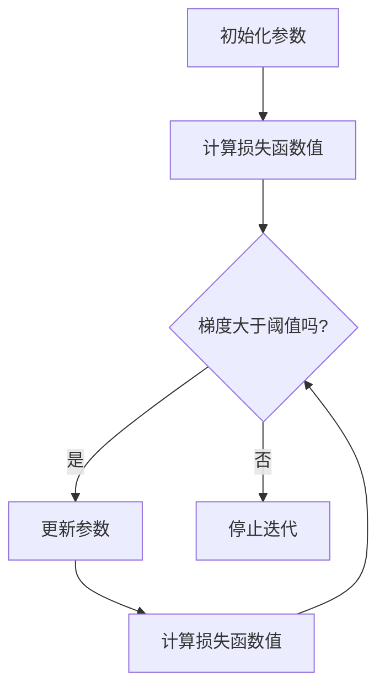

                 

 **关键词**：机器学习、优化算法、数据科学、深度学习、神经网络、梯度下降。

**摘要**：本文深入探讨了梯度下降算法在机器学习和深度学习中的应用。通过介绍其背景、核心概念、算法原理和具体操作步骤，我们揭示了梯度下降在复杂函数优化中的强大能力。本文还通过数学模型、公式推导和实际项目实践，详细阐述了梯度下降算法的实现和应用，为读者提供了全面的技术指南。

## 1. 背景介绍

梯度下降是一种优化算法，用于寻找函数的局部最小值或最大值。其背后的原理可以追溯到微积分中关于梯度的概念。梯度下降算法被广泛应用于机器学习、数据科学和深度学习等领域，是解决复杂优化问题的重要工具。

### 1.1 机器学习

机器学习是一种人工智能的分支，通过使用算法从数据中学习规律，并做出预测或决策。在机器学习中，模型的训练过程往往需要优化一个目标函数，而梯度下降算法是实现这一目标的有效方法。

### 1.2 数据科学

数据科学是使用统计学、机器学习和人工智能方法来分析和解释数据的学科。在数据科学中，梯度下降算法被用于各种任务，如回归分析、分类和聚类等。

### 1.3 深度学习

深度学习是机器学习的一个子领域，通过模拟人脑的神经网络结构来学习复杂的特征和模式。梯度下降算法在深度学习中扮演了核心角色，用于训练深度神经网络。

## 2. 核心概念与联系

为了更好地理解梯度下降算法，我们需要首先了解一些核心概念。

### 2.1 梯度

梯度是一个向量，它描述了函数在某一点的斜率方向。在二维空间中，梯度的方向指向函数增加最快的方向。在多维空间中，梯度的方向则指向函数增加最快的方向。

### 2.2 函数的局部最小值

函数的局部最小值是指在某一局部范围内，函数值最小的点。梯度下降算法的目标是找到函数的局部最小值。

### 2.3 步长

步长是梯度下降算法中的参数，用于控制每次迭代的步幅大小。适当的步长可以加速算法收敛，但过大的步长可能导致算法无法收敛。

### 2.4 Mermaid 流程图

以下是梯度下降算法的 Mermaid 流程图：



## 3. 核心算法原理 & 具体操作步骤

### 3.1 算法原理概述

梯度下降算法通过迭代的方式，逐步更新参数，以最小化损失函数。每次迭代中，参数的更新方向都是梯度的反方向。算法的具体操作步骤如下：

1. 初始化参数。
2. 计算当前参数下的损失函数值。
3. 计算损失函数关于参数的梯度。
4. 更新参数：$ \theta_{new} = \theta_{old} - \alpha \cdot \nabla f(\theta_{old}) $
5. 重复步骤2-4，直到满足停止条件。

### 3.2 算法步骤详解

以下是梯度下降算法的具体步骤：

1. **初始化参数**：设置一个初始的参数值，通常选择随机值或接近最优值的值。
2. **计算损失函数值**：计算当前参数下的损失函数值，损失函数通常用来衡量模型的预测值与真实值之间的差距。
3. **计算梯度**：计算损失函数关于参数的梯度，梯度反映了损失函数在参数空间中的斜率。
4. **更新参数**：使用步长$\alpha$更新参数，更新方向为梯度的反方向。
5. **迭代**：重复步骤2-4，直到满足停止条件，如达到预设的迭代次数或损失函数值变化小于某个阈值。

### 3.3 算法优缺点

**优点**：

- 梯度下降算法简单易懂，易于实现。
- 能够处理高维数据。
- 在大多数情况下，能够找到局部最小值。

**缺点**：

- 收敛速度较慢，特别是对于非凸函数。
- 需要选择合适的步长。
- 可能会陷入局部最小值。

### 3.4 算法应用领域

梯度下降算法在机器学习和深度学习中有着广泛的应用，包括：

- **线性回归**：用于拟合线性模型。
- **逻辑回归**：用于分类任务。
- **神经网络**：用于特征提取和预测。
- **聚类**：用于数据降维和模式识别。

## 4. 数学模型和公式 & 详细讲解 & 举例说明

### 4.1 数学模型构建

假设我们有一个目标函数$f(\theta)$，其中$\theta$是参数向量。我们的目标是最小化$f(\theta)$。

### 4.2 公式推导过程

我们使用以下公式来计算梯度：

$$
\nabla f(\theta) = \left[ \frac{\partial f}{\partial \theta_1}, \frac{\partial f}{\partial \theta_2}, \ldots, \frac{\partial f}{\partial \theta_n} \right]
$$

其中，$\frac{\partial f}{\partial \theta_i}$是$f$关于$\theta_i$的偏导数。

### 4.3 案例分析与讲解

假设我们有一个线性回归模型，目标函数为：

$$
f(\theta) = \sum_{i=1}^{n} (y_i - \theta_0 - \theta_1 x_{i1} - \theta_2 x_{i2} - \ldots - \theta_m x_{im})^2
$$

我们的目标是找到使得$f(\theta)$最小的参数$\theta$。

首先，我们计算梯度：

$$
\nabla f(\theta) = \left[ \frac{\partial f}{\partial \theta_0}, \frac{\partial f}{\partial \theta_1}, \frac{\partial f}{\partial \theta_2}, \ldots, \frac{\partial f}{\partial \theta_m} \right]
$$

然后，我们使用梯度下降算法更新参数：

$$
\theta_{new} = \theta_{old} - \alpha \cdot \nabla f(\theta_{old})
$$

其中，$\alpha$是步长。

## 5. 项目实践：代码实例和详细解释说明

### 5.1 开发环境搭建

为了实现梯度下降算法，我们首先需要搭建一个开发环境。这里，我们将使用Python编程语言和NumPy库来构建线性回归模型。

### 5.2 源代码详细实现

以下是实现梯度下降算法的Python代码：

```python
import numpy as np

# 初始化参数
theta = np.random.rand(m+1)

# 设置步长
alpha = 0.01

# 设置迭代次数
 iterations = 1000

# 计算损失函数值
def compute_loss(y, tx, theta):
    return ((y - (tx.dot(theta))) ** 2).sum() / (2 * m)

# 计算梯度
def compute_gradient(y, tx, theta):
    return (- (y - (tx.dot(theta))) * tx).sum(axis=0) / m

# 更新参数
def update_theta(theta, gradient, alpha):
    return theta - alpha * gradient

# 迭代梯度下降算法
for i in range(iterations):
    gradient = compute_gradient(y, tx, theta)
    theta = update_theta(theta, gradient, alpha)
    loss = compute_loss(y, tx, theta)

    if i % 100 == 0:
        print(f"Iteration {i}: Loss = {loss}")

print(f"Final theta: {theta}")
```

### 5.3 代码解读与分析

- `compute_loss`函数计算损失函数值。
- `compute_gradient`函数计算梯度。
- `update_theta`函数更新参数。
- 主循环中，我们迭代执行计算梯度、更新参数和计算损失函数值的操作，并每隔100次迭代打印损失函数值。

### 5.4 运行结果展示

运行上述代码，我们可以得到最终的参数值，并观察损失函数值的收敛情况。

## 6. 实际应用场景

梯度下降算法在多个实际应用场景中有着重要的地位，包括：

### 6.1 机器学习

在机器学习领域，梯度下降算法被广泛应用于模型训练，如线性回归、逻辑回归和神经网络等。

### 6.2 数据科学

在数据科学中，梯度下降算法用于回归分析、分类和聚类等任务，以优化模型参数。

### 6.3 深度学习

在深度学习中，梯度下降算法是训练深度神经网络的核心方法，用于优化网络权重和偏置。

## 7. 工具和资源推荐

### 7.1 学习资源推荐

- 《机器学习实战》（Peter Harrington）
- 《深度学习》（Ian Goodfellow、Yoshua Bengio、Aaron Courville）
- 《Python机器学习》（ Sebastian Raschka、Vahid Mirjalili）

### 7.2 开发工具推荐

- Jupyter Notebook：用于编写和运行Python代码。
- TensorFlow：用于构建和训练深度学习模型。
- Keras：用于快速构建和训练深度学习模型。

### 7.3 相关论文推荐

- "Stochastic Gradient Descent"（ Bottou，2006）
- "Gradient-Based Learning Applied to Document Classification"（Crammer and Singer，2001）

## 8. 总结：未来发展趋势与挑战

### 8.1 研究成果总结

梯度下降算法在机器学习和深度学习中取得了显著成果，成为解决优化问题的核心工具。通过改进算法和优化参数选择，研究人员不断提高了算法的收敛速度和稳定性。

### 8.2 未来发展趋势

未来，梯度下降算法将继续在机器学习和深度学习领域发挥作用，同时还将与其他优化算法相结合，解决更复杂的优化问题。

### 8.3 面临的挑战

梯度下降算法在处理高维数据和大规模数据时可能面临收敛速度慢和稳定性差的问题。因此，未来研究需要关注如何提高算法的收敛速度和稳定性。

### 8.4 研究展望

随着机器学习和深度学习的不断发展，梯度下降算法将面临更多挑战和机遇。通过不断创新和优化，梯度下降算法将继续在人工智能领域发挥重要作用。

## 9. 附录：常见问题与解答

### 9.1 什么是梯度？

梯度是一个向量，它描述了函数在某一点的斜率方向。在二维空间中，梯度的方向指向函数增加最快的方向。在多维空间中，梯度的方向则指向函数增加最快的方向。

### 9.2 什么是损失函数？

损失函数是一个衡量模型预测值与真实值之间差距的函数。在梯度下降算法中，损失函数用于衡量模型参数的效果。

### 9.3 梯度下降算法为什么能够找到局部最小值？

梯度下降算法通过迭代的方式，逐步更新参数，以最小化损失函数。每次迭代中，参数的更新方向都是梯度的反方向。在大多数情况下，这样的迭代过程能够使参数逐渐逼近局部最小值。

### 9.4 什么是步长？

步长是梯度下降算法中的参数，用于控制每次迭代的步幅大小。适当的步长可以加速算法收敛，但过大的步长可能导致算法无法收敛。

### 9.5 梯度下降算法为什么不能保证找到全局最小值？

梯度下降算法只能找到局部最小值，因为算法的收敛过程是基于局部梯度信息。对于非凸函数，局部最小值可能不是全局最小值。

### 9.6 梯度下降算法与其他优化算法相比有哪些优缺点？

与梯度下降算法相比，其他优化算法如牛顿法、共轭梯度法等具有不同的优势和局限性。梯度下降算法简单易懂，易于实现，但收敛速度较慢。其他优化算法可能具有更快的收敛速度，但实现更复杂。

### 9.7 梯度下降算法如何处理高维数据？

梯度下降算法可以通过增加步长的更新方式来处理高维数据。同时，还可以采用随机梯度下降（SGD）和批量梯度下降（BGD）等变体，以适应不同规模的数据集。

### 9.8 梯度下降算法在深度学习中的应用有哪些？

梯度下降算法在深度学习中被广泛用于训练深度神经网络。通过反向传播算法，梯度下降算法能够计算网络权重和偏置的梯度，并更新参数，以最小化损失函数。

### 9.9 梯度下降算法有哪些变体？

梯度下降算法有多种变体，包括随机梯度下降（SGD）、批量梯度下降（BGD）和小批量梯度下降（MBGD）等。这些变体通过调整参数的更新方式，以提高算法的收敛速度和稳定性。

