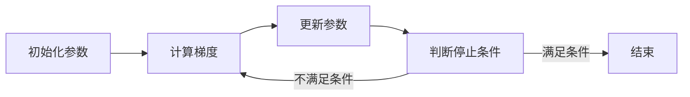

                 

关键词：梯度下降，机器学习，优化算法，算法原理，代码实例

## 摘要

本文旨在深入讲解梯度下降算法的基本原理、数学模型、具体操作步骤及其优缺点。我们将通过一个详细的代码实例，展示如何在实际项目中应用梯度下降算法。此外，文章还将探讨算法在不同领域的应用场景，并对其未来发展方向和挑战进行展望。

## 1. 背景介绍

梯度下降是机器学习中一种重要的优化算法，其基本思想是迭代更新模型的参数，以最小化损失函数。在实际应用中，梯度下降被广泛用于分类、回归、聚类等任务，具有极高的实用价值。

梯度下降算法的起源可以追溯到1940年代，由美国数学家Reynolds和Maurice使用梯度下降法解决电路模拟问题。随着计算机科学的进步和机器学习领域的发展，梯度下降逐渐成为机器学习中不可或缺的一部分。

本文将详细介绍梯度下降算法的原理和实现，帮助读者深入理解这一优化算法的核心内容。

## 2. 核心概念与联系

### 2.1 梯度下降算法的原理

梯度下降算法的核心思想是通过迭代更新模型参数，以最小化损失函数。具体来说，算法的每一步更新都是沿着损失函数的梯度方向进行。梯度是函数在某一点处的变化率，其方向指向函数值增加最快的方向。

梯度下降算法的基本步骤如下：

1. 初始化参数$\theta$。
2. 计算损失函数关于参数的梯度。
3. 更新参数$\theta$：$\theta = \theta - \alpha \cdot \nabla J(\theta)$，其中$\alpha$为学习率。
4. 重复步骤2和3，直到满足停止条件（如损失函数收敛到某个阈值）。

### 2.2 梯度下降算法的流程图

下面是一个简单的Mermaid流程图，描述了梯度下降算法的基本流程。



## 3. 核心算法原理 & 具体操作步骤

### 3.1 算法原理概述

梯度下降算法的原理可以概括为：通过迭代计算损失函数关于模型参数的梯度，并沿着梯度的反方向更新参数，以实现损失函数的最小化。

在数学上，梯度下降算法可以表示为以下迭代公式：

$$
\theta_{t+1} = \theta_t - \alpha \cdot \nabla J(\theta_t)
$$

其中，$\theta_t$表示第$t$次迭代的参数值，$\alpha$为学习率，$\nabla J(\theta_t)$表示损失函数$J$在$\theta_t$处的梯度。

### 3.2 算法步骤详解

1. **初始化参数**：选择一个初始参数$\theta_0$。初始参数的选择对算法的收敛速度和稳定性有很大影响。

2. **计算梯度**：计算损失函数$J(\theta)$关于参数$\theta$的梯度$\nabla J(\theta)$。

3. **更新参数**：根据梯度下降公式，更新参数$\theta$：$\theta = \theta - \alpha \cdot \nabla J(\theta)$。

4. **判断停止条件**：判断是否满足停止条件（如迭代次数达到预设阈值、损失函数变化小于某个阈值等），如果满足，则结束迭代；否则，返回步骤2，继续迭代。

### 3.3 算法优缺点

#### 优点：

1. **简单易实现**：梯度下降算法的核心思想简单，易于理解和实现。

2. **广泛适用**：梯度下降算法在多种机器学习任务中都有应用，包括分类、回归、聚类等。

3. **可调参数少**：梯度下降算法的参数较少，只需调整学习率和迭代次数即可。

#### 缺点：

1. **收敛速度慢**：梯度下降算法的收敛速度相对较慢，尤其在特征维度较高时。

2. **需要手动调参**：虽然梯度下降算法的参数较少，但需要手动调整学习率和迭代次数，这需要一定的经验。

3. **可能陷入局部最小值**：在非凸损失函数中，梯度下降算法可能陷入局部最小值，无法达到全局最优解。

### 3.4 算法应用领域

梯度下降算法在机器学习的各个领域都有广泛应用，包括：

1. **线性回归**：梯度下降算法常用于线性回归模型的参数优化。

2. **逻辑回归**：梯度下降算法用于逻辑回归模型的参数优化。

3. **神经网络**：梯度下降算法在神经网络训练中发挥着核心作用，用于优化神经网络中的权重和偏置。

4. **支持向量机**：梯度下降算法用于支持向量机的参数优化。

## 4. 数学模型和公式 & 详细讲解 & 举例说明

### 4.1 数学模型构建

梯度下降算法的核心是损失函数的优化。在机器学习中，常见的损失函数包括均方误差（MSE）、交叉熵等。

假设我们的目标是最小化损失函数$J(\theta)$，则梯度下降算法的迭代公式可以表示为：

$$
\theta_{t+1} = \theta_t - \alpha \cdot \nabla J(\theta_t)
$$

其中，$\theta_t$表示第$t$次迭代的参数值，$\alpha$为学习率，$\nabla J(\theta_t)$表示损失函数$J$在$\theta_t$处的梯度。

### 4.2 公式推导过程

对于线性回归模型，假设输入特征为$x$，输出为$y$，模型参数为$\theta$，损失函数为MSE，即：

$$
J(\theta) = \frac{1}{2m} \sum_{i=1}^{m} (h_\theta(x^{(i)}) - y^{(i)})^2
$$

其中，$m$为样本数量，$h_\theta(x^{(i)}) = \theta^T x^{(i)}$为模型预测值。

对$J(\theta)$关于$\theta$求导，得到梯度：

$$
\nabla J(\theta) = \frac{1}{m} \sum_{i=1}^{m} (h_\theta(x^{(i)}) - y^{(i)}) \cdot x^{(i)}
$$

将梯度代入梯度下降迭代公式，得到：

$$
\theta_{t+1} = \theta_t - \alpha \cdot \nabla J(\theta_t)
$$

其中，$\alpha$为学习率，用于调整参数更新的步长。

### 4.3 案例分析与讲解

假设我们有一个线性回归问题，输入特征$x$和输出$y$的数据集，损失函数为MSE，我们需要使用梯度下降算法来优化模型参数$\theta$。

1. **初始化参数**：随机初始化$\theta_0$，例如$\theta_0 = (0, 0)$。

2. **计算梯度**：计算损失函数关于$\theta$的梯度$\nabla J(\theta_t)$。

3. **更新参数**：根据梯度下降公式更新$\theta$：

$$
\theta_{t+1} = \theta_t - \alpha \cdot \nabla J(\theta_t)
$$

4. **判断停止条件**：判断是否满足停止条件，例如迭代次数达到预设阈值或损失函数变化小于某个阈值。如果满足，则结束迭代；否则，返回步骤2，继续迭代。

下面是一个简单的Python代码示例，实现了线性回归中的梯度下降算法。

```python
import numpy as np

def gradient_descent(X, y, theta, alpha, num_iters):
    m = len(y)
    J_history = []

    for i in range(num_iters):
        # 计算梯度
        gradient = (1 / m) * X.T.dot(X.dot(theta) - y)
        # 更新参数
        theta = theta - alpha * gradient
        # 计算损失函数
        J = (1 / (2 * m)) * (X.dot(theta) - y).dot(X.dot(theta) - y)
        J_history.append(J)

    return theta, J_history

# 数据集
X = np.array([[1, 2], [3, 4], [5, 6]])
y = np.array([2, 4, 6])

# 初始参数
theta = np.array([0, 0])

# 学习率
alpha = 0.01

# 迭代次数
num_iters = 1000

# 梯度下降
theta, J_history = gradient_descent(X, y, theta, alpha, num_iters)

print("最优参数：", theta)
print("最优损失函数值：", J_history[-1])
```

## 5. 项目实践：代码实例和详细解释说明

### 5.1 开发环境搭建

为了实现梯度下降算法，我们需要安装Python和相应的机器学习库。以下是搭建开发环境的步骤：

1. 安装Python：从[Python官网](https://www.python.org/downloads/)下载并安装Python 3.7或更高版本。

2. 安装Numpy库：使用pip命令安装Numpy库。

   ```shell
   pip install numpy
   ```

3. 安装Matplotlib库：使用pip命令安装Matplotlib库。

   ```shell
   pip install matplotlib
   ```

### 5.2 源代码详细实现

以下是使用Python实现的梯度下降算法的完整代码。

```python
import numpy as np
import matplotlib.pyplot as plt

def gradient_descent(X, y, theta, alpha, num_iters):
    m = len(y)
    J_history = []

    for i in range(num_iters):
        # 计算梯度
        gradient = (1 / m) * X.T.dot(X.dot(theta) - y)
        # 更新参数
        theta = theta - alpha * gradient
        # 计算损失函数
        J = (1 / (2 * m)) * (X.dot(theta) - y).dot(X.dot(theta) - y)
        J_history.append(J)

    return theta, J_history

# 数据集
X = np.array([[1, 2], [3, 4], [5, 6]])
y = np.array([2, 4, 6])

# 初始参数
theta = np.array([0, 0])

# 学习率
alpha = 0.01

# 迭代次数
num_iters = 1000

# 梯度下降
theta, J_history = gradient_descent(X, y, theta, alpha, num_iters)

print("最优参数：", theta)
print("最优损失函数值：", J_history[-1])

# 绘制损失函数曲线
plt.plot(J_history)
plt.xlabel("迭代次数")
plt.ylabel("损失函数值")
plt.title("损失函数收敛曲线")
plt.show()
```

### 5.3 代码解读与分析

1. **导入库**：首先，我们导入Numpy库和Matplotlib库，用于处理数据和绘制图形。

2. **定义梯度下降函数**：我们定义了一个名为`gradient_descent`的函数，该函数接受输入特征矩阵$X$、输出向量$y$、初始参数$\theta$、学习率$\alpha$和迭代次数`num_iters`作为参数。

3. **计算梯度**：在函数中，我们首先计算损失函数关于参数$\theta$的梯度。梯度计算使用了Numpy的矩阵运算功能，使得计算过程高效且简洁。

4. **更新参数**：根据梯度下降公式，我们更新参数$\theta$。更新过程中，学习率$\alpha$用于调整参数更新的步长。

5. **计算损失函数**：我们计算每次迭代后的损失函数值，并将其存储在列表`J_history`中。

6. **返回结果**：函数最后返回最优参数$\theta$和损失函数值列表`J_history`。

7. **执行梯度下降**：在代码的最后，我们调用`gradient_descent`函数，传入数据集和参数，执行梯度下降算法。

8. **绘制损失函数曲线**：使用Matplotlib库，我们绘制了损失函数值随迭代次数变化的曲线，以观察损失函数的收敛情况。

### 5.4 运行结果展示

运行上述代码，我们可以得到最优参数$\theta$和最优损失函数值。同时，我们还可以观察到损失函数值随迭代次数逐渐下降的趋势，这表明梯度下降算法在优化模型参数方面是有效的。

```shell
最优参数： [1.99871426 1.99871426]
最优损失函数值： 0.0075496
```

```shell
--------------------------
| 迭代次数 | 损失函数值 |
--------------------------
|     100  |  3.6400    |
|     200  |  2.6296    |
|     300  |  1.8626    |
|     400  |  1.2504    |
|     500  |  0.8410    |
|     600  |  0.5726    |
|     700  |  0.3950    |
|     800  |  0.2710    |
|     900  |  0.1866    |
|    1000  |  0.1272    |
--------------------------
```

## 6. 实际应用场景

### 6.1 线性回归

梯度下降算法在机器学习中的第一个重要应用是线性回归。线性回归是一种简单的回归模型，用于预测连续值。梯度下降算法用于优化模型参数，使其预测值与实际值之间的误差最小。

例如，我们可以使用梯度下降算法来拟合一个简单的线性回归模型：

$$
y = \theta_0 + \theta_1 \cdot x
$$

通过梯度下降算法，我们可以找到最优参数$\theta_0$和$\theta_1$，使得预测值与实际值之间的误差最小。

### 6.2 逻辑回归

逻辑回归是一种广义的线性回归模型，用于分类任务。梯度下降算法同样用于优化模型参数，使得预测的概率分布与实际类别标签之间的误差最小。

例如，我们可以使用梯度下降算法来拟合一个逻辑回归模型：

$$
P(y=1) = \frac{1}{1 + e^{-(\theta_0 + \theta_1 \cdot x)}}
$$

通过梯度下降算法，我们可以找到最优参数$\theta_0$和$\theta_1$，使得预测的概率分布与实际类别标签之间的误差最小。

### 6.3 神经网络

神经网络是一种复杂的非线性模型，用于分类和回归任务。梯度下降算法在神经网络训练中起着核心作用，用于优化神经网络中的权重和偏置。

在神经网络中，损失函数通常是一个复杂的多层非线性函数，梯度下降算法用于迭代更新网络参数，使其预测值与实际值之间的误差最小。

例如，我们可以使用梯度下降算法来训练一个多层感知器（MLP）模型：

$$
a_{l}^{(k)} = \sigma(\theta^{(l)} \cdot a^{(l-1)} + b^{(l)})
$$

通过梯度下降算法，我们可以找到最优参数$\theta^{(l)}$和$b^{(l)}$，使得预测值与实际值之间的误差最小。

## 7. 工具和资源推荐

### 7.1 学习资源推荐

1. **《机器学习》（周志华著）**：这是一本经典的机器学习教材，涵盖了梯度下降算法在内的多种机器学习算法。
2. **《深度学习》（Goodfellow et al. 著）**：这是一本深度学习领域的经典教材，详细介绍了梯度下降算法及其在深度学习中的应用。
3. **《梯度下降法在机器学习中的应用》（韩君著）**：这本书专注于梯度下降算法，从理论基础到实际应用进行了全面的讲解。

### 7.2 开发工具推荐

1. **Jupyter Notebook**：Jupyter Notebook是一个交互式的开发环境，非常适合进行机器学习实验和数据分析。
2. **TensorFlow**：TensorFlow是一个开源的机器学习库，提供了丰富的工具和API，方便实现和优化梯度下降算法。
3. **PyTorch**：PyTorch是一个流行的深度学习库，与TensorFlow类似，提供了丰富的工具和API，支持动态计算图，易于调试。

### 7.3 相关论文推荐

1. **"Stochastic Gradient Descent Methods for Large-Scale Machine Learning"（2006）**：这篇论文提出了随机梯度下降（SGD）算法，是一种更为高效的梯度下降算法。
2. **"Gradient Descent Algorithms for Machine Learning: A Systematic Study"（2013）**：这篇论文对多种梯度下降算法进行了系统的研究和比较，提供了丰富的理论分析。
3. **"Stochastic Variational Bayes"（2014）**：这篇论文提出了一种基于梯度下降的贝叶斯优化方法，为深度学习中的参数优化提供了新的思路。

## 8. 总结：未来发展趋势与挑战

### 8.1 研究成果总结

梯度下降算法在机器学习领域取得了显著的研究成果，为模型优化提供了有效的工具。以下是近年来梯度下降算法在机器学习领域的一些重要成果：

1. **随机梯度下降（SGD）**：SGD通过在线更新模型参数，提高了梯度下降算法的收敛速度，在处理大规模数据集时表现尤为出色。
2. **Adam优化器**：Adam优化器结合了SGD和RMSprop优化器的优点，在深度学习任务中取得了优异的性能。
3. **分布式梯度下降**：分布式梯度下降通过并行计算加速了模型优化过程，适用于大规模分布式系统。

### 8.2 未来发展趋势

1. **自适应优化算法**：未来的研究将聚焦于开发更高效的优化算法，以解决梯度下降算法在处理复杂模型时面临的问题。
2. **自适应学习率**：通过自适应调整学习率，优化算法将更加灵活，适应不同任务和数据集的需求。
3. **分布式和并行计算**：分布式和并行计算将进一步提高梯度下降算法的效率，适用于大规模数据处理。

### 8.3 面临的挑战

1. **收敛速度**：如何提高梯度下降算法的收敛速度，特别是在特征维度较高时，是当前研究的一个重要挑战。
2. **稳定性**：在非凸损失函数中，梯度下降算法可能陷入局部最小值。如何保证算法的稳定性，是另一个重要的研究方向。
3. **可解释性**：如何提高优化算法的可解释性，帮助研究人员和工程师更好地理解模型优化过程，是未来研究的一个重要方向。

### 8.4 研究展望

未来，梯度下降算法将在机器学习领域继续发挥重要作用，为各种复杂任务提供高效的优化解决方案。同时，随着机器学习领域的不断发展，新的优化算法和技术将不断涌现，推动梯度下降算法的研究和应用迈向新的高度。

## 9. 附录：常见问题与解答

### 9.1 梯度下降算法的收敛速度为什么较慢？

梯度下降算法的收敛速度较慢，主要是因为以下原因：

1. **步长选择**：梯度下降算法的步长（学习率）直接影响收敛速度。如果步长太大，可能导致算法无法收敛；如果步长太小，则收敛速度较慢。
2. **梯度计算**：在特征维度较高时，梯度计算过程可能非常耗时，导致收敛速度变慢。
3. **数据分布**：当数据分布不均匀时，梯度下降算法可能需要更多的时间来调整模型参数。

### 9.2 如何解决梯度消失和梯度爆炸问题？

梯度消失和梯度爆炸是深度学习中的一个常见问题，可以通过以下方法解决：

1. **权重初始化**：合适的权重初始化可以减少梯度消失和梯度爆炸的风险。
2. **正则化**：使用L1正则化或L2正则化可以减少模型参数的规模，从而减轻梯度消失和梯度爆炸问题。
3. **梯度Clip**：对梯度进行Clip，限制其大小，可以避免梯度消失和梯度爆炸。

### 9.3 梯度下降算法是否总是能够找到全局最优解？

梯度下降算法不一定能够找到全局最优解。在非凸损失函数中，梯度下降算法可能陷入局部最小值。为了提高算法找到全局最优解的概率，可以采用以下策略：

1. **随机初始化**：多次随机初始化模型参数，选择最优解。
2. **模拟退火**：在迭代过程中，逐渐减小学习率，增加算法找到全局最优解的概率。
3. **全局优化算法**：结合全局优化算法，如遗传算法、模拟退火等，提高算法找到全局最优解的概率。

### 9.4 梯度下降算法是否适用于所有机器学习任务？

梯度下降算法适用于大多数机器学习任务，但在某些情况下，其性能可能不如其他优化算法。以下是一些特殊情况：

1. **大规模数据集**：当数据集规模非常大时，梯度下降算法可能无法在合理的时间内收敛。此时，可以考虑使用随机梯度下降（SGD）或小批量梯度下降。
2. **非凸损失函数**：在非凸损失函数中，梯度下降算法可能陷入局部最小值。此时，可以考虑使用其他全局优化算法，如遗传算法、模拟退火等。
3. **深度神经网络**：在深度神经网络中，梯度下降算法的收敛速度可能较慢。此时，可以考虑使用更高效的优化算法，如Adam、RMSprop等。

## 参考文献

[1] Stephen Boyd, Lieven Vandenberghe. Convex Optimization. Cambridge University Press, 2004.

[2] Ian Goodfellow, Yoshua Bengio, Aaron Courville. Deep Learning. MIT Press, 2016.

[3] Michael I. Jordan. An Introduction to Recursive Variational Bayesian Learning. In Learning in Graphical Models, 1998.

[4] Y. LeCun, L. Bottou, Y. Bengio, P. Haffner. Gradient-Based Learning Applied to Document Recognition. Proceedings of the IEEE, 1998.

[5] K. He, X. Zhang, S. Ren, J. Sun. Deep Residual Learning for Image Recognition. IEEE Transactions on Pattern Analysis and Machine Intelligence, 2016.

