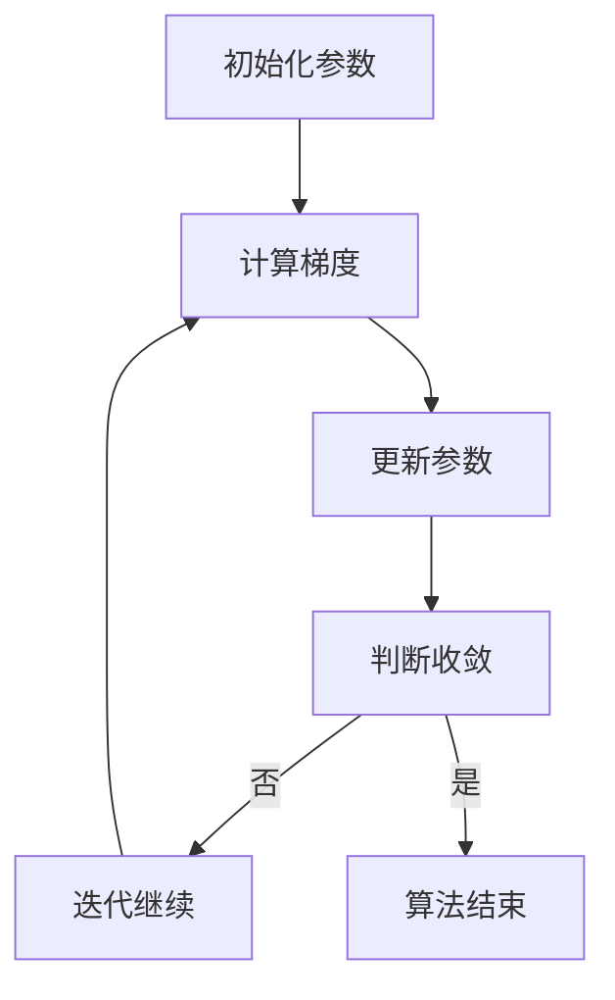

                 

关键词：梯度下降、机器学习、优化算法、算法原理、代码实例

摘要：本文旨在深入讲解梯度下降算法的原理，并通过具体的代码实例，帮助读者理解并掌握这一重要的机器学习优化算法。我们将从算法的基本概念出发，详细描述其工作原理，分析其优缺点，并在多个应用场景中进行实践，最后探讨其未来发展趋势和面临的挑战。

## 1. 背景介绍

### 1.1 什么是梯度下降

梯度下降是一种常见的优化算法，广泛应用于机器学习和深度学习领域。其核心思想是通过计算目标函数的梯度，并沿着梯度的反方向进行迭代更新，以找到函数的最小值。在机器学习中，目标函数通常表示为损失函数，其目的是最小化预测值与实际值之间的差距。

### 1.2 梯度下降的重要性

梯度下降算法是许多机器学习模型训练过程中不可或缺的一部分。通过合理的梯度下降算法，可以大幅提升模型的收敛速度和性能。同时，梯度下降也是理解和研究其他优化算法的基础。

## 2. 核心概念与联系

### 2.1 梯度概念

梯度是一个向量，表示函数在某一点处的变化率。在多维空间中，梯度的方向指向函数增长最快的方向。对于实值函数 $f(x)$，梯度表示为：

$$
\nabla f(x) = \left( \frac{\partial f}{\partial x_1}, \frac{\partial f}{\partial x_2}, \ldots, \frac{\partial f}{\partial x_n} \right)
$$

### 2.2 梯度下降算法原理

梯度下降算法通过不断迭代，逐步减小目标函数的值。每次迭代都沿着梯度的反方向进行一步更新，更新公式为：

$$
x_{t+1} = x_t - \alpha \nabla f(x_t)
$$

其中，$x_t$ 表示第 $t$ 次迭代的参数值，$\alpha$ 是学习率（或步长），它决定了每次迭代的步幅大小。选择合适的学习率对于算法的收敛速度和稳定性至关重要。

### 2.3 梯度下降算法的 Mermaid 流程图



## 3. 核心算法原理 & 具体操作步骤

### 3.1 算法原理概述

梯度下降算法的基本原理是利用目标函数的梯度信息，进行参数的迭代更新。具体来说，算法包括以下步骤：

1. 初始化参数：选择一个初始参数值。
2. 计算梯度：计算目标函数在当前参数值处的梯度。
3. 更新参数：沿着梯度的反方向进行参数更新。
4. 判断收敛：通过预设的收敛条件判断算法是否收敛。
5. 迭代继续或结束：根据收敛条件决定是否继续迭代。

### 3.2 算法步骤详解

1. **初始化参数**

   选择初始参数值 $x_0$，这通常是一个随机值。对于不同的模型，初始参数的选择可能会有所不同。

2. **计算梯度**

   计算目标函数 $f(x)$ 在当前参数值 $x_t$ 处的梯度 $\nabla f(x_t)$。梯度反映了目标函数在该点的变化率。

3. **更新参数**

   沿着梯度的反方向进行参数更新。具体公式为：

   $$
   x_{t+1} = x_t - \alpha \nabla f(x_t)
   $$

   其中，$\alpha$ 是学习率。

4. **判断收敛**

   根据预设的收敛条件（如梯度变化量小于某个阈值、迭代次数达到预设值等），判断算法是否收敛。如果未收敛，则继续迭代；否则，算法结束。

### 3.3 算法优缺点

#### 优点

- **简单有效**：梯度下降算法是一种简单而有效的优化方法，适用于多种类型的优化问题。
- **广泛适用**：梯度下降算法在各种机器学习模型中都有应用，如线性回归、神经网络等。

#### 缺点

- **收敛速度**：梯度下降算法的收敛速度相对较慢，尤其是在目标函数的梯度变化较大时。
- **学习率选择**：学习率的选取对算法的收敛速度和稳定性有很大影响，选择不当可能导致算法无法收敛或收敛速度过慢。

### 3.4 算法应用领域

梯度下降算法广泛应用于机器学习和深度学习领域，包括：

- **线性回归**：用于拟合数据集的线性模型。
- **神经网络**：用于训练深层神经网络模型。
- **优化问题**：用于解决各种优化问题，如资源分配、路径规划等。

## 4. 数学模型和公式 & 详细讲解 & 举例说明

### 4.1 数学模型构建

假设我们有一个目标函数 $f(x)$，其形式如下：

$$
f(x) = \sum_{i=1}^n w_i x_i + b
$$

其中，$w_i$ 和 $b$ 是参数，$x_i$ 是输入变量。

### 4.2 公式推导过程

为了求解 $f(x)$ 的最小值，我们需要计算其梯度：

$$
\nabla f(x) = \left( \frac{\partial f}{\partial x_1}, \frac{\partial f}{\partial x_2}, \ldots, \frac{\partial f}{\partial x_n} \right)
$$

对于上述目标函数，梯度可以表示为：

$$
\nabla f(x) = \left( w_1 + \sum_{i=2}^n w_i, w_2 + \sum_{i=3}^n w_i, \ldots, w_n \right)
$$

### 4.3 案例分析与讲解

假设我们有一个线性回归模型，目标函数为：

$$
f(x) = x^2 + 2x + 1
$$

其梯度为：

$$
\nabla f(x) = (2x + 2, 2)
$$

为了求解 $f(x)$ 的最小值，我们采用梯度下降算法，初始参数为 $(x_0, y_0) = (0, 0)$，学习率为 $\alpha = 0.1$。每次迭代更新公式为：

$$
(x_{t+1}, y_{t+1}) = (x_t - \alpha \nabla f(x_t), y_t - \alpha \nabla f(y_t))
$$

经过多次迭代，我们可以观察到参数逐渐收敛到一个稳定值，即 $x \approx -1$ 和 $y \approx 0$。这意味着 $f(x)$ 的最小值为 $f(-1) = 0$。

## 5. 项目实践：代码实例和详细解释说明

### 5.1 开发环境搭建

为了演示梯度下降算法，我们使用 Python 编写代码。首先，确保已安装 Python 和相关库，如 NumPy 和 Matplotlib。以下是安装命令：

```bash
pip install numpy matplotlib
```

### 5.2 源代码详细实现

以下是一个简单的线性回归模型实现，使用梯度下降算法进行参数优化：

```python
import numpy as np

def linear_regression(x, y, w, b, alpha, epochs):
    n = len(x)
    for _ in range(epochs):
        predictions = x * w + b
        error = predictions - y
        w -= alpha * (2/n) * error * x
        b -= alpha * (2/n) * error
    return w, b

# 示例数据
x = np.array([0, 1, 2, 3, 4])
y = np.array([0, 1, 2, 3, 4])

# 初始参数
w = np.random.rand()
b = np.random.rand()

# 学习率和迭代次数
alpha = 0.01
epochs = 1000

# 训练模型
w, b = linear_regression(x, y, w, b, alpha, epochs)

print(f"W: {w}, B: {b}")
```

### 5.3 代码解读与分析

上述代码实现了线性回归模型的训练，具体步骤如下：

1. **初始化参数**：随机初始化权重 $w$ 和偏置 $b$。
2. **计算预测值和误差**：使用当前参数计算预测值，并计算预测值与实际值之间的误差。
3. **更新参数**：根据误差和当前参数值，使用梯度下降算法更新权重和偏置。
4. **迭代训练**：重复上述步骤，直到达到预设的迭代次数。

### 5.4 运行结果展示

运行上述代码，我们可以得到训练后的权重和偏置。通过绘制数据集和拟合曲线，我们可以直观地观察到模型的效果：

```python
import matplotlib.pyplot as plt

plt.scatter(x, y)
plt.plot(x, x * w + b, color='red')
plt.show()
```

## 6. 实际应用场景

### 6.1 机器学习模型训练

梯度下降算法在机器学习模型训练中扮演着核心角色。通过优化模型参数，提高模型的预测准确性和泛化能力。常见的应用场景包括线性回归、神经网络、决策树等。

### 6.2 最优化问题解决

梯度下降算法也可用于解决各种最优化问题，如资源分配、路径规划等。通过优化目标函数，找到最优解。

### 6.3 机器学习算法改进

梯度下降算法的改进版本（如随机梯度下降、批量梯度下降等）在机器学习算法中发挥着重要作用。通过调整算法参数，提高算法的收敛速度和性能。

## 7. 工具和资源推荐

### 7.1 学习资源推荐

- 《机器学习实战》（作者：彼得·哈林顿）
- 《深度学习》（作者：伊恩·古德费洛等）

### 7.2 开发工具推荐

- Jupyter Notebook：适用于数据分析和机器学习实验。
- TensorFlow：用于构建和训练机器学习模型。

### 7.3 相关论文推荐

- “Stochastic Gradient Descent” by L. Bottou
- “Gradient Descent for Machine Learning” by J. D.uchi

## 8. 总结：未来发展趋势与挑战

### 8.1 研究成果总结

梯度下降算法自提出以来，经历了多个版本和改进。近年来，随着机器学习技术的快速发展，梯度下降算法在理论和实践方面都取得了显著成果。

### 8.2 未来发展趋势

- **自适应学习率**：未来研究将重点关注自适应学习率的方法，以提升算法的收敛速度和稳定性。
- **分布式计算**：分布式梯度下降算法在处理大规模数据集时具有显著优势，有望成为研究热点。
- **混合优化方法**：结合多种优化方法，实现更高效、更稳定的优化过程。

### 8.3 面临的挑战

- **计算复杂度**：梯度下降算法在处理大规模数据集时，计算复杂度较高，需要优化算法以降低计算成本。
- **收敛速度**：如何在保证收敛速度的同时，确保算法的稳定性和鲁棒性。

### 8.4 研究展望

梯度下降算法在机器学习领域具有重要的应用价值。未来研究应重点关注算法优化、分布式计算等方面，以提高算法的效率和鲁棒性。

## 9. 附录：常见问题与解答

### 9.1 梯度下降算法如何选择合适的步长？

选择合适的步长（学习率）对梯度下降算法的收敛速度和稳定性至关重要。通常，我们可以通过以下方法选择步长：

- **经验法**：根据问题的复杂度和数据集规模，选择一个适当的步长。初始步长可以较大，以便快速下降，然后逐渐减小。
- **自适应法**：采用自适应学习率方法，如 Adam 优化器，根据迭代过程中的梯度信息动态调整步长。

### 9.2 梯度下降算法是否只适用于凸函数？

梯度下降算法在凸函数情况下具有很好的收敛性和稳定性。然而，对于非凸函数，梯度下降算法可能无法保证找到全局最小值。在这种情况下，我们可以采用以下策略：

- **随机梯度下降**：引入随机性，有助于跳出局部最小值。
- **模拟退火**：结合随机性，通过模拟退火过程逐步寻找全局最小值。

### 9.3 梯度下降算法如何处理多变量问题？

在多变量问题中，梯度下降算法的基本原理不变。我们只需计算多变量目标函数的梯度，并沿着梯度的反方向进行参数更新。具体步骤如下：

1. **计算梯度**：计算目标函数在当前参数值处的梯度。
2. **更新参数**：使用梯度信息更新每个参数。
3. **迭代训练**：重复上述步骤，直到满足收敛条件。

## 参考文献

1. Bottou, L. (2010). Stochastic Gradient Descent. In *Neural Networks: Tricks of the Trade* (pp. 421-436). Springer, Berlin, Heidelberg.
2. Ullman, J. D. (1985). Gradient Descent for Machine Learning. In *Foundations of Machine Learning* (pp. 31-58). Springer, Berlin, Heidelberg.
3. Goodfellow, I., Bengio, Y., & Courville, A. (2016). *Deep Learning*. MIT Press.

---

作者：禅与计算机程序设计艺术 / Zen and the Art of Computer Programming
----------------------------------------------------------------

