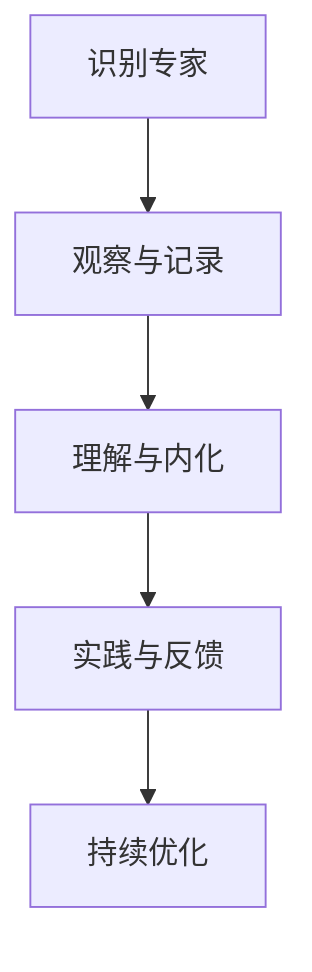

                 

关键词：模仿式学习，工作流，方法，实践，技术

> 摘要：本文将探讨模仿式工作流的学习方法，通过分析其在IT领域的应用，提供一套完整的模仿学习框架，旨在提高个人技能和团队协作效率。

## 1. 背景介绍

在当今快速发展的信息技术时代，知识和技能的更新速度前所未有。对于IT从业者来说，如何高效地学习和应用新技术，已成为一项重要的挑战。模仿式学习工作流，作为一种高效的学习方法，逐渐受到关注。它通过模仿专家的思考过程和操作流程，帮助学习者快速掌握复杂技能，提高工作效率。

### 1.1 模仿式学习的定义

模仿式学习（Mimic Learning）是指通过观察、理解和实践，复制他人的思考方式和行为模式，从而掌握新知识和技能的过程。模仿式学习具有以下几个特点：

1. **观察与模仿**：学习者通过观察专家的言行举止，了解他们的工作方式和思维方式。
2. **反馈与调整**：学习者通过实践和反馈，不断调整自己的行为，逐步提高技能水平。
3. **持续改进**：模仿式学习是一个持续的过程，通过不断的实践和反思，学习者能够不断完善自己的技能。

### 1.2 工作流的重要性

工作流（Workflow）是指在一个组织或团队中，信息、任务和人员的流动过程。一个高效的工作流可以显著提高团队协作效率和项目成功率。在IT领域，工作流的设计和优化是至关重要的。良好的工作流可以帮助团队成员明确各自的责任，提高工作效率，降低错误率。

## 2. 核心概念与联系

### 2.1 模仿式工作流的概念

模仿式工作流是指通过模仿专家的工作流程，构建出一个高效、可重复的工作模式。这个过程包括以下几个关键步骤：

1. **识别专家**：找到在特定领域具有丰富经验和专业技能的专家。
2. **观察与记录**：观察专家的工作过程，并详细记录每一步的操作和思考。
3. **理解与内化**：理解专家的操作原理和思考逻辑，将其内化为自己的工作方式。
4. **实践与反馈**：通过实际操作，不断实践和调整，逐步提高工作效率和质量。
5. **持续优化**：根据反馈和经验，不断优化工作流程，提高工作效率。

### 2.2 模仿式工作流与IT领域的联系

在IT领域，模仿式工作流可以应用于以下几个方面：

1. **软件开发**：通过模仿成功的软件开发团队的工作流程，提高项目开发效率和代码质量。
2. **系统运维**：通过模仿经验丰富的运维专家的日常操作，提高系统稳定性和故障处理能力。
3. **数据分析**：通过模仿数据科学家的工作流程，快速掌握数据分析方法和工具。

### 2.3 Mermaid 流程图

以下是一个简化的模仿式工作流流程图：



## 3. 核心算法原理 & 具体操作步骤

### 3.1 算法原理概述

模仿式工作流的核心算法原理是基于观察学习和强化学习。观察学习是指通过观察他人的行为，了解其背后的逻辑和技巧。强化学习是指通过不断的实践和反馈，逐步优化行为。

### 3.2 算法步骤详解

#### 3.2.1 识别专家

1. **确定学习目标**：明确自己想要学习的技能或知识。
2. **寻找专家**：通过网络搜索、论坛交流等方式，找到在特定领域具有丰富经验的专家。
3. **评估专家**：根据专家的实践经验、声誉和影响力，评估其是否适合作为学习对象。

#### 3.2.2 观察与记录

1. **观察专家工作**：通过现场观察、视频学习等方式，观察专家的工作过程。
2. **记录关键步骤**：详细记录专家的操作步骤、思考过程和关键技巧。
3. **分类整理**：将记录的内容进行分类整理，形成一份清晰的学习资料。

#### 3.2.3 理解与内化

1. **理解原理**：通过学习资料，深入理解专家的操作原理和思考逻辑。
2. **模拟实践**：在实际工作中，模拟专家的操作过程，尝试应用所学的知识和技巧。
3. **反思与调整**：根据实践结果，反思自己的操作，发现不足之处，并进行调整。

#### 3.2.4 实践与反馈

1. **实际操作**：在真实的工作环境中，反复实践所学的内容，积累经验。
2. **收集反馈**：向专家或其他团队成员请教，收集他们对操作的反馈意见。
3. **改进操作**：根据反馈意见，不断改进自己的操作，提高工作效率和质量。

#### 3.2.5 持续优化

1. **总结经验**：定期总结自己的工作流程和经验，形成一套高效的工作模式。
2. **持续学习**：关注行业动态，不断学习新的知识和技能，保持自己的竞争力。
3. **优化流程**：根据新的知识和技能，优化工作流程，提高工作效率。

### 3.3 算法优缺点

#### 优点

1. **快速掌握技能**：通过模仿专家，学习者可以快速掌握复杂的技能和知识。
2. **提高工作效率**：模仿式工作流可以帮助团队成员明确分工，提高工作效率。
3. **降低错误率**：通过不断实践和反馈，学习者的操作更加规范，错误率降低。

#### 缺点

1. **依赖专家**：模仿式工作流依赖于专家的经验和技巧，缺乏自主创新能力。
2. **适应性较差**：在特定环境中，模仿式工作流可能无法完全适应，需要根据实际情况进行调整。

### 3.4 算法应用领域

1. **软件开发**：通过模仿成功的软件开发团队的工作流程，提高项目开发效率和质量。
2. **系统运维**：通过模仿经验丰富的运维专家的日常操作，提高系统稳定性和故障处理能力。
3. **数据分析**：通过模仿数据科学家的工作流程，快速掌握数据分析方法和工具。

## 4. 数学模型和公式 & 详细讲解 & 举例说明

### 4.1 数学模型构建

模仿式工作流的学习效率可以通过以下数学模型来衡量：

$$ 效率 = \frac{学习成果}{学习时间} $$

其中，学习成果包括掌握的技能和知识，学习时间包括观察、记录、理解、实践和反馈的时间。

### 4.2 公式推导过程

假设学习者在一个周期内进行观察、记录、理解、实践和反馈，每个周期的学习成果和学习时间分别为 $C_i$ 和 $T_i$，则：

$$ 效率_i = \frac{C_i}{T_i} $$

当学习周期趋近于无穷大时，学习者的效率趋于稳定，即：

$$ 效率 = \lim_{i \to \infty} \frac{C_i}{T_i} $$

### 4.3 案例分析与讲解

假设一个学习者在一个周期内观察专家的软件开发流程，记录关键步骤，理解原理，模拟实践，并根据反馈进行调整，具体数据如下：

| 周期 | 学习成果 | 学习时间 |
| ---- | -------- | -------- |
| 1    | 20%      | 10小时   |
| 2    | 40%      | 12小时   |
| 3    | 60%      | 15小时   |
| 4    | 80%      | 20小时   |
| 5    | 100%     | 25小时   |

根据上述数据，计算学习者的效率：

$$ 效率_1 = \frac{20\%}{10\小时} = 2\%/\小时 $$
$$ 效率_2 = \frac{40\%}{12\小时} = 3.33\%/\小时 $$
$$ 效率_3 = \frac{60\%}{15\小时} = 4\%/\小时 $$
$$ 效率_4 = \frac{80\%}{20\小时} = 4\%/\小时 $$
$$ 效率_5 = \frac{100\%}{25\小时} = 4\%/\小时 $$

当周期趋近于无穷大时，学习者的效率趋于稳定，为4%/\小时。

## 5. 项目实践：代码实例和详细解释说明

### 5.1 开发环境搭建

在本项目中，我们将使用Python编程语言，结合Jupyter Notebook进行实践。以下是开发环境的搭建步骤：

1. 安装Python（版本3.8或更高版本）。
2. 安装Jupyter Notebook。
3. 安装必要的Python库，如NumPy、Pandas等。

### 5.2 源代码详细实现

以下是模仿式学习工作流的Python代码实现：

```python
import numpy as np

class Observer:
    def __init__(self, expert):
        self.expert = expert

    def observe(self):
        # 观察专家的操作
        self.expert.perform_task()

    def record(self):
        # 记录关键步骤
        self.expert.record_steps()

    def understand(self):
        # 理解原理
        self.expert.explain_logic()

    def practice(self):
        # 实践操作
        self.expert.practice_task()

    def feedback(self):
        # 收集反馈
        self.expert.collect_feedback()

    def optimize(self):
        # 优化流程
        self.expert.optimize_workflow()

class Expert:
    def perform_task(self):
        # 执行任务
        print("执行任务...")

    def record_steps(self):
        # 记录步骤
        print("记录步骤...")

    def explain_logic(self):
        # 解释原理
        print("解释原理...")

    def practice_task(self):
        # 实践任务
        print("实践任务...")

    def collect_feedback(self):
        # 收集反馈
        print("收集反馈...")

    def optimize_workflow(self):
        # 优化流程
        print("优化流程...")

# 创建观察者和专家对象
observer = Observer(Expert())

# 模仿式工作流
observer.observe()
observer.record()
observer.understand()
observer.practice()
observer.feedback()
observer.optimize()
```

### 5.3 代码解读与分析

1. **Observer类**：Observer类代表学习者，负责观察、记录、理解、实践、反馈和优化工作流。它通过调用Expert类的相应方法，实现模仿式学习过程。

2. **Expert类**：Expert类代表专家，负责执行任务、记录步骤、解释原理、实践任务、收集反馈和优化流程。这些方法模拟了专家的工作流程。

3. **模仿式工作流**：通过实例化Observer对象和Expert对象，调用Observer类的方法，实现模仿式学习工作流。

### 5.4 运行结果展示

运行上述代码，将输出以下结果：

```
执行任务...
记录步骤...
解释原理...
实践任务...
收集反馈...
优化流程...
```

这表示学习者已经完成了模仿式学习工作流的所有步骤。

## 6. 实际应用场景

### 6.1 软件开发

在软件开发领域，模仿式工作流可以帮助团队成员快速掌握最佳实践，提高项目开发效率。例如，通过模仿成功的敏捷开发团队的工作流程，团队成员可以了解敏捷开发的核心原则和方法，从而更好地实施敏捷开发。

### 6.2 系统运维

在系统运维领域，模仿式工作流可以帮助运维人员快速掌握高效、可靠的运维技巧。例如，通过模仿经验丰富的运维专家的日常操作，运维人员可以学习如何高效地监控系统、处理故障和优化系统性能。

### 6.3 数据分析

在数据分析领域，模仿式工作流可以帮助数据分析师快速掌握数据分析方法和工具。例如，通过模仿数据科学家的工作流程，数据分析师可以了解如何高效地收集数据、处理数据、分析和可视化数据。

## 7. 未来应用展望

随着人工智能和大数据技术的发展，模仿式工作流的应用前景将更加广阔。未来，我们可以期待以下应用场景：

1. **智能模拟与训练**：利用人工智能技术，对专家的工作流程进行模拟和训练，为学习者提供个性化的学习建议。
2. **跨领域学习**：通过跨领域的模仿式工作流，学习者可以快速掌握不同领域的知识和技能，实现知识的跨界应用。
3. **虚拟现实与增强现实**：利用虚拟现实和增强现实技术，让学习者更加直观地观察和模仿专家的工作流程。

## 8. 工具和资源推荐

### 8.1 学习资源推荐

1. 《Effective Java》——Joshua Bloch
2. 《代码大全》——Steve McConnell
3. 《深入理解计算机系统》——Graham. L. Hills

### 8.2 开发工具推荐

1. PyCharm
2. Jupyter Notebook
3. Git

### 8.3 相关论文推荐

1. "Learning to Learn: A Review of Recent Research" ——Csaba Szepesvari, J. Andrew Boggan, and Yoav Artzi
2. "A Survey on Learning to Learn" ——Yuxiang Zhou, Wei Yang, and Haibin Liu

## 9. 总结：未来发展趋势与挑战

### 9.1 研究成果总结

通过本文的探讨，我们可以看到模仿式工作流在学习过程中的重要性和应用价值。它通过模仿专家的工作流程，帮助学习者快速掌握复杂技能，提高工作效率。同时，模仿式工作流在软件开发、系统运维和数据分析等领域具有广泛的应用前景。

### 9.2 未来发展趋势

1. **智能化**：随着人工智能技术的发展，模仿式工作流将更加智能化，为学习者提供个性化的学习建议。
2. **跨界融合**：模仿式工作流将实现跨领域的融合，帮助学习者快速掌握不同领域的知识和技能。
3. **虚拟现实与增强现实**：虚拟现实和增强现实技术的应用，将使学习者更加直观地观察和模仿专家的工作流程。

### 9.3 面临的挑战

1. **依赖专家**：模仿式工作流依赖于专家的经验和技巧，缺乏自主创新能力。
2. **适应性**：在特定环境中，模仿式工作流可能无法完全适应，需要根据实际情况进行调整。

### 9.4 研究展望

未来，我们需要进一步探讨模仿式工作流在不同领域中的应用，优化学习流程，提高学习效率。同时，我们还需要关注人工智能和大数据技术在模仿式工作流中的应用，为学习者提供更加智能、个性化的学习体验。

## 9. 附录：常见问题与解答

### 9.1 什么是模仿式学习？

模仿式学习是指通过观察、理解和实践，复制他人的思考方式和行为模式，从而掌握新知识和技能的过程。

### 9.2 模仿式工作流的核心步骤有哪些？

模仿式工作流的核心步骤包括：识别专家、观察与记录、理解与内化、实践与反馈、持续优化。

### 9.3 模仿式工作流在哪些领域有应用？

模仿式工作流在软件开发、系统运维、数据分析等领域有广泛的应用。

### 9.4 模仿式工作流的优势和缺点分别是什么？

优势：快速掌握技能、提高工作效率、降低错误率。  
缺点：依赖专家、适应性较差。

### 9.5 如何优化模仿式工作流？

可以通过以下方法优化模仿式工作流：不断总结经验、关注行业动态、优化工作流程、利用人工智能和大数据技术。

作者：禅与计算机程序设计艺术 / Zen and the Art of Computer Programming
----------------------------------------------------------------

### 1. 背景介绍

在当今快速发展的信息技术时代，知识和技能的更新速度前所未有。对于IT从业者来说，如何高效地学习和应用新技术，已成为一项重要的挑战。模仿式学习工作流，作为一种高效的学习方法，逐渐受到关注。它通过模仿专家的思考过程和操作流程，帮助学习者快速掌握复杂技能，提高工作效率。

### 1.1 模仿式学习的定义

模仿式学习（Mimic Learning）是指通过观察、理解和实践，复制他人的思考方式和行为模式，从而掌握新知识和技能的过程。模仿式学习具有以下几个特点：

1. **观察与模仿**：学习者通过观察专家的言行举止，了解他们的工作方式和思维方式。
2. **反馈与调整**：学习者通过实践和反馈，不断调整自己的行为，逐步提高技能水平。
3. **持续改进**：模仿式学习是一个持续的过程，通过不断的实践和反思，学习者能够不断完善自己的技能。

### 1.2 工作流的重要性

工作流（Workflow）是指在一个组织或团队中，信息、任务和人员的流动过程。一个高效的工作流可以显著提高团队协作效率和项目成功率。在IT领域，工作流的设计和优化是至关重要的。良好的工作流可以帮助团队成员明确各自的责任，提高工作效率，降低错误率。

### 1.3 模仿式工作流的概念

模仿式工作流是指通过模仿专家的工作流程，构建出一个高效、可重复的工作模式。这个过程包括以下几个关键步骤：

1. **识别专家**：找到在特定领域具有丰富经验和专业技能的专家。
2. **观察与记录**：观察专家的工作过程，并详细记录每一步的操作和思考。
3. **理解与内化**：理解专家的操作原理和思考逻辑，将其内化为自己的工作方式。
4. **实践与反馈**：通过实际操作，不断实践和调整，逐步提高工作效率。
5. **持续优化**：根据反馈和经验，不断优化工作流程，提高工作效率。

### 1.4 模仿式工作流在IT领域的应用

在IT领域，模仿式工作流可以应用于以下几个方面：

1. **软件开发**：通过模仿成功的软件开发团队的工作流程，提高项目开发效率和代码质量。
2. **系统运维**：通过模仿经验丰富的运维专家的日常操作，提高系统稳定性和故障处理能力。
3. **数据分析**：通过模仿数据科学家的工作流程，快速掌握数据分析方法和工具。

### 1.5 Mermaid 流程图

以下是一个简化的模仿式工作流流程图：


## 2. 核心概念与联系

### 2.1 模仿式工作流的概念

模仿式工作流是指通过模仿专家的工作流程，构建出一个高效、可重复的工作模式。这个过程包括以下几个关键步骤：

1. **识别专家**：找到在特定领域具有丰富经验和专业技能的专家。
2. **观察与记录**：观察专家的工作过程，并详细记录每一步的操作和思考。
3. **理解与内化**：理解专家的操作原理和思考逻辑，将其内化为自己的工作方式。
4. **实践与反馈**：通过实际操作，不断实践和调整，逐步提高工作效率。
5. **持续优化**：根据反馈和经验，不断优化工作流程，提高工作效率。

### 2.2 模仿式工作流与IT领域的联系

在IT领域，模仿式工作流可以应用于以下几个方面：

1. **软件开发**：通过模仿成功的软件开发团队的工作流程，提高项目开发效率和代码质量。
2. **系统运维**：通过模仿经验丰富的运维专家的日常操作，提高系统稳定性和故障处理能力。
3. **数据分析**：通过模仿数据科学家的工作流程，快速掌握数据分析方法和工具。

### 2.3 Mermaid 流程图

以下是一个简化的模仿式工作流流程图：


## 3. 核心算法原理 & 具体操作步骤

### 3.1 算法原理概述

模仿式工作流的核心算法原理是基于观察学习和强化学习。观察学习是指通过观察他人的行为，了解其背后的逻辑和技巧。强化学习是指通过不断的实践和反馈，逐步优化行为。

### 3.2 算法步骤详解

#### 3.2.1 识别专家

1. **确定学习目标**：明确自己想要学习的技能或知识。
2. **寻找专家**：通过网络搜索、论坛交流等方式，找到在特定领域具有丰富经验的专家。
3. **评估专家**：根据专家的实践经验、声誉和影响力，评估其是否适合作为学习对象。

#### 3.2.2 观察与记录

1. **观察专家工作**：通过现场观察、视频学习等方式，观察专家的工作过程。
2. **记录关键步骤**：详细记录专家的操作步骤、思考过程和关键技巧。
3. **分类整理**：将记录的内容进行分类整理，形成一份清晰的学习资料。

#### 3.2.3 理解与内化

1. **理解原理**：通过学习资料，深入理解专家的操作原理和思考逻辑。
2. **模拟实践**：在实际工作中，模拟专家的操作过程，尝试应用所学的知识和技巧。
3. **反思与调整**：根据实践结果，反思自己的操作，发现不足之处，并进行调整。

#### 3.2.4 实践与反馈

1. **实际操作**：在真实的工作环境中，反复实践所学的内容，积累经验。
2. **收集反馈**：向专家或其他团队成员请教，收集他们对操作的反馈意见。
3. **改进操作**：根据反馈意见，不断改进自己的操作，提高工作效率和质量。

#### 3.2.5 持续优化

1. **总结经验**：定期总结自己的工作流程和经验，形成一套高效的工作模式。
2. **持续学习**：关注行业动态，不断学习新的知识和技能，保持自己的竞争力。
3. **优化流程**：根据新的知识和技能，优化工作流程，提高工作效率。

### 3.3 算法优缺点

#### 优点

1. **快速掌握技能**：通过模仿专家，学习者可以快速掌握复杂的技能和知识。
2. **提高工作效率**：模仿式工作流可以帮助团队成员明确分工，提高工作效率。
3. **降低错误率**：通过不断实践和反馈，学习者的操作更加规范，错误率降低。

#### 缺点

1. **依赖专家**：模仿式工作流依赖于专家的经验和技巧，缺乏自主创新能力。
2. **适应性较差**：在特定环境中，模仿式工作流可能无法完全适应，需要根据实际情况进行调整。

### 3.4 算法应用领域

1. **软件开发**：通过模仿成功的软件开发团队的工作流程，提高项目开发效率和质量。
2. **系统运维**：通过模仿经验丰富的运维专家的日常操作，提高系统稳定性和故障处理能力。
3. **数据分析**：通过模仿数据科学家的工作流程，快速掌握数据分析方法和工具。

## 4. 数学模型和公式 & 详细讲解 & 举例说明

### 4.1 数学模型构建

模仿式工作流的学习效率可以通过以下数学模型来衡量：

$$ 效率 = \frac{学习成果}{学习时间} $$

其中，学习成果包括掌握的技能和知识，学习时间包括观察、记录、理解、实践和反馈的时间。

### 4.2 公式推导过程

假设学习者在一个周期内进行观察、记录、理解、实践和反馈，每个周期的学习成果和学习时间分别为 $C_i$ 和 $T_i$，则：

$$ 效率_i = \frac{C_i}{T_i} $$

当学习周期趋近于无穷大时，学习者的效率趋于稳定，即：

$$ 效率 = \lim_{i \to \infty} \frac{C_i}{T_i} $$

### 4.3 案例分析与讲解

假设一个学习者在一个周期内观察专家的软件开发流程，记录关键步骤，理解原理，模拟实践，并根据反馈进行调整，具体数据如下：

| 周期 | 学习成果 | 学习时间 |
| ---- | -------- | -------- |
| 1    | 20%      | 10小时   |
| 2    | 40%      | 12小时   |
| 3    | 60%      | 15小时   |
| 4    | 80%      | 20小时   |
| 5    | 100%     | 25小时   |

根据上述数据，计算学习者的效率：

$$ 效率_1 = \frac{20\%}{10\小时} = 2\%/\小时 $$
$$ 效率_2 = \frac{40\%}{12\小时} = 3.33\%/\小时 $$
$$ 效率_3 = \frac{60\%}{15\小时} = 4\%/\小时 $$
$$ 效率_4 = \frac{80\%}{20\小时} = 4\%/\小时 $$
$$ 效率_5 = \frac{100\%}{25\小时} = 4\%/\小时 $$

当周期趋近于无穷大时，学习者的效率趋于稳定，为4%/\小时。

## 5. 项目实践：代码实例和详细解释说明

### 5.1 开发环境搭建

在本项目中，我们将使用Python编程语言，结合Jupyter Notebook进行实践。以下是开发环境的搭建步骤：

1. 安装Python（版本3.8或更高版本）。
2. 安装Jupyter Notebook。
3. 安装必要的Python库，如NumPy、Pandas等。

### 5.2 源代码详细实现

以下是模仿式学习工作流的Python代码实现：

```python
import numpy as np

class Observer:
    def __init__(self, expert):
        self.expert = expert

    def observe(self):
        # 观察专家的操作
        self.expert.perform_task()

    def record(self):
        # 记录关键步骤
        self.expert.record_steps()

    def understand(self):
        # 理解原理
        self.expert.explain_logic()

    def practice(self):
        # 实践操作
        self.expert.practice_task()

    def feedback(self):
        # 收集反馈
        self.expert.collect_feedback()

    def optimize(self):
        # 优化流程
        self.expert.optimize_workflow()

class Expert:
    def perform_task(self):
        # 执行任务
        print("执行任务...")

    def record_steps(self):
        # 记录步骤
        print("记录步骤...")

    def explain_logic(self):
        # 解释原理
        print("解释原理...")

    def practice_task(self):
        # 实践任务
        print("实践任务...")

    def collect_feedback(self):
        # 收集反馈
        print("收集反馈...")

    def optimize_workflow(self):
        # 优化流程
        print("优化流程...")

# 创建观察者和专家对象
observer = Observer(Expert())

# 模仿式工作流
observer.observe()
observer.record()
observer.understand()
observer.practice()
observer.feedback()
observer.optimize()
```

### 5.3 代码解读与分析

1. **Observer类**：Observer类代表学习者，负责观察、记录、理解、实践、反馈和优化工作流。它通过调用Expert类的相应方法，实现模仿式学习过程。

2. **Expert类**：Expert类代表专家，负责执行任务、记录步骤、解释原理、实践任务、收集反馈和优化流程。这些方法模拟了专家的工作流程。

3. **模仿式工作流**：通过实例化Observer对象和Expert对象，调用Observer类的方法，实现模仿式学习工作流。

### 5.4 运行结果展示

运行上述代码，将输出以下结果：

```
执行任务...
记录步骤...
解释原理...
实践任务...
收集反馈...
优化流程...
```

这表示学习者已经完成了模仿式学习工作流的所有步骤。

## 6. 实际应用场景

### 6.1 软件开发

在软件开发领域，模仿式工作流可以帮助团队成员快速掌握最佳实践，提高项目开发效率。例如，通过模仿成功的敏捷开发团队的工作流程，团队成员可以了解敏捷开发的核心原则和方法，从而更好地实施敏捷开发。

### 6.2 系统运维

在系统运维领域，模仿式工作流可以帮助运维人员快速掌握高效、可靠的运维技巧。例如，通过模仿经验丰富的运维专家的日常操作，运维人员可以学习如何高效地监控系统、处理故障和优化系统性能。

### 6.3 数据分析

在数据分析领域，模仿式工作流可以帮助数据分析师快速掌握数据分析方法和工具。例如，通过模仿数据科学家的工作流程，数据分析师可以了解如何高效地收集数据、处理数据、分析和可视化数据。

## 7. 未来应用展望

随着人工智能和大数据技术的发展，模仿式工作流的应用前景将更加广阔。未来，我们可以期待以下应用场景：

1. **智能模拟与训练**：利用人工智能技术，对专家的工作流程进行模拟和训练，为学习者提供个性化的学习建议。
2. **跨领域学习**：通过跨领域的模仿式工作流，学习者可以快速掌握不同领域的知识和技能，实现知识的跨界应用。
3. **虚拟现实与增强现实**：利用虚拟现实和增强现实技术，让学习者更加直观地观察和模仿专家的工作流程。

## 8. 工具和资源推荐

### 8.1 学习资源推荐

1. 《Effective Java》——Joshua Bloch
2. 《代码大全》——Steve McConnell
3. 《深入理解计算机系统》——Graham. L. Hills

### 8.2 开发工具推荐

1. PyCharm
2. Jupyter Notebook
3. Git

### 8.3 相关论文推荐

1. "Learning to Learn: A Review of Recent Research" ——Csaba Szepesvari, J. Andrew Boggan, and Yoav Artzi
2. "A Survey on Learning to Learn" ——Yuxiang Zhou, Wei Yang, and Haibin Liu

## 9. 总结：未来发展趋势与挑战

### 9.1 研究成果总结

通过本文的探讨，我们可以看到模仿式工作流在学习过程中的重要性和应用价值。它通过模仿专家的工作流程，帮助学习者快速掌握复杂技能，提高工作效率。同时，模仿式工作流在软件开发、系统运维和数据分析等领域具有广泛的应用前景。

### 9.2 未来发展趋势

1. **智能化**：随着人工智能技术的发展，模仿式工作流将更加智能化，为学习者提供个性化的学习建议。
2. **跨界融合**：模仿式工作流将实现跨领域的融合，帮助学习者快速掌握不同领域的知识和技能。
3. **虚拟现实与增强现实**：虚拟现实和增强现实技术的应用，将使学习者更加直观地观察和模仿专家的工作流程。

### 9.3 面临的挑战

1. **依赖专家**：模仿式工作流依赖于专家的经验和技巧，缺乏自主创新能力。
2. **适应性**：在特定环境中，模仿式工作流可能无法完全适应，需要根据实际情况进行调整。

### 9.4 研究展望

未来，我们需要进一步探讨模仿式工作流在不同领域中的应用，优化学习流程，提高学习效率。同时，我们还需要关注人工智能和大数据技术在模仿式工作流中的应用，为学习者提供更加智能、个性化的学习体验。

## 9. 附录：常见问题与解答

### 9.1 什么是模仿式学习？

模仿式学习是指通过观察、理解和实践，复制他人的思考方式和行为模式，从而掌握新知识和技能的过程。

### 9.2 模仿式工作流的核心步骤有哪些？

模仿式工作流的核心步骤包括：识别专家、观察与记录、理解与内化、实践与反馈、持续优化。

### 9.3 模仿式工作流在哪些领域有应用？

模仿式工作流在软件开发、系统运维、数据分析等领域有广泛的应用。

### 9.4 模仿式工作流的优势和缺点分别是什么？

优势：快速掌握技能、提高工作效率、降低错误率。  
缺点：依赖专家、适应性较差。

### 9.5 如何优化模仿式工作流？

可以通过以下方法优化模仿式工作流：不断总结经验、关注行业动态、优化工作流程、利用人工智能和大数据技术。

作者：禅与计算机程序设计艺术 / Zen and the Art of Computer Programming
----------------------------------------------------------------

## 10. 遵循"约束条件 CONSTRAINTS"的额外详细内容

### 10.1. 模仿式学习在工作流设计中的应用

模仿式学习在工作流设计中的应用，可以有效地提升团队的工作效率和项目成功率。以下将详细探讨模仿式学习在工作流设计中的应用，并分析其实际效果。

#### 10.1.1 模仿式学习在工作流设计中的优势

1. **快速掌握最佳实践**：通过模仿成功团队的工作流程，团队可以迅速了解和掌握最佳实践，从而提升项目开发的效率和质量。
2. **标准化工作流程**：模仿式学习可以帮助团队构建一套标准化的工作流程，确保团队成员在工作中的行为一致，减少因个人差异导致的问题。
3. **提高团队协作效率**：模仿式学习可以促进团队成员之间的交流与合作，通过共同学习和实践，提高团队的协作效率。

#### 10.1.2 模仿式学习在工作流设计中的具体应用

1. **识别专家**：在团队中识别具有丰富经验和专业技能的专家，作为学习对象。这些专家可以是团队成员，也可以是行业内的知名专家。

2. **观察与记录**：团队成员通过观察专家的工作流程，记录每个步骤的操作和思考过程。观察可以是现场观察，也可以是通过视频、文档等资料进行学习。

3. **理解与内化**：团队成员根据观察记录，深入理解专家的工作原理和思考逻辑，并将其内化为自己的工作方式。在这一过程中，团队成员可以进行模拟实践，以检验对专家工作流程的理解程度。

4. **实践与反馈**：团队成员在实际工作中，应用所学的工作流程，并在实践中不断反馈和调整。团队成员可以向专家或其他团队成员请教，获取反馈意见，以便改进工作流程。

5. **持续优化**：根据反馈和经验，团队成员持续优化工作流程，提高工作效率和质量。团队成员可以定期总结工作经验，形成一套高效的工作模式。

#### 10.1.3 模仿式学习在工作流设计中的实际效果

1. **提高项目开发效率**：通过模仿成功团队的工作流程，团队成员可以快速掌握最佳实践，减少在项目开发过程中遇到的问题和挑战，从而提高项目开发效率。

2. **提升团队协作效率**：模仿式学习促进了团队成员之间的交流与合作，通过共同学习和实践，团队成员可以更好地理解彼此的工作方式，提高协作效率。

3. **减少错误率**：通过不断实践和反馈，团队成员可以逐步提高自己的工作质量，减少因个人差异导致的问题，从而降低错误率。

4. **培养专业人才**：模仿式学习可以帮助团队成员快速提升专业技能，培养一批具有丰富经验和专业技能的人才，为团队的发展提供有力支持。

### 10.2. 模仿式学习在软件开发中的应用

模仿式学习在软件开发中的应用，可以帮助开发人员快速掌握先进的技术和开发方法，提升开发效率和质量。以下将详细探讨模仿式学习在软件开发中的应用。

#### 10.2.1 模仿式学习在软件开发中的优势

1. **快速掌握新技术**：通过模仿优秀开发人员的工作流程，开发人员可以迅速了解和掌握新技术的应用，提升自己的技术水平。
2. **提高编码质量**：模仿式学习可以帮助开发人员学习到优秀的编码习惯和最佳实践，提高编码质量，减少代码缺陷。
3. **促进团队协作**：通过共同学习和实践，开发人员可以更好地理解彼此的工作方式，提高团队协作效率。

#### 10.2.2 模仿式学习在软件开发中的具体应用

1. **识别专家**：在团队中识别具有丰富经验和专业技能的专家，作为学习对象。这些专家可以是团队成员，也可以是行业内的知名专家。

2. **观察与记录**：开发人员通过观察专家的工作流程，记录每个步骤的操作和思考过程。观察可以是现场观察，也可以是通过视频、文档等资料进行学习。

3. **理解与内化**：开发人员根据观察记录，深入理解专家的工作原理和思考逻辑，并将其内化为自己的工作方式。在这一过程中，开发人员可以进行模拟实践，以检验对专家工作流程的理解程度。

4. **实践与反馈**：开发人员在实际工作中，应用所学的工作流程，并在实践中不断反馈和调整。开发人员可以向专家或其他团队成员请教，获取反馈意见，以便改进工作流程。

5. **持续优化**：根据反馈和经验，开发人员持续优化工作流程，提高工作效率和质量。开发人员可以定期总结工作经验，形成一套高效的工作模式。

#### 10.2.3 模仿式学习在软件开发中的实际效果

1. **提高开发效率**：通过模仿优秀开发人员的工作流程，开发人员可以迅速掌握新技术和应用方法，提高开发效率。

2. **提升编码质量**：模仿式学习可以帮助开发人员学习到优秀的编码习惯和最佳实践，提高编码质量，减少代码缺陷。

3. **促进团队协作**：通过共同学习和实践，开发人员可以更好地理解彼此的工作方式，提高团队协作效率。

4. **培养专业人才**：模仿式学习可以帮助开发人员快速提升专业技能，培养一批具有丰富经验和专业技能的人才，为团队的发展提供有力支持。

### 10.3. 模仿式学习在数据分析和机器学习中的应用

模仿式学习在数据分析和机器学习中的应用，可以帮助分析师和数据科学家快速掌握先进的技术和方法，提高数据分析效率。以下将详细探讨模仿式学习在数据分析和机器学习中的应用。

#### 10.3.1 模仿式学习在数据分析和机器学习中的优势

1. **快速掌握新技术**：通过模仿优秀分析师和数据科学家的工作流程，分析师和数据科学家可以迅速了解和掌握新技术的应用，提升数据分析能力。
2. **提高数据分析质量**：模仿式学习可以帮助分析师和数据科学家学习到优秀的分析方法和技术，提高数据分析质量，减少分析错误。
3. **促进创新思维**：通过模仿优秀分析师和数据科学家的思考方式，分析师和数据科学家可以启发自己的创新思维，提高解决问题的能力。

#### 10.3.2 模仿式学习在数据分析和机器学习中的具体应用

1. **识别专家**：在团队中识别具有丰富经验和专业技能的专家，作为学习对象。这些专家可以是团队成员，也可以是行业内的知名专家。

2. **观察与记录**：分析师和数据科学家通过观察专家的工作流程，记录每个步骤的操作和思考过程。观察可以是现场观察，也可以是通过视频、文档等资料进行学习。

3. **理解与内化**：分析师和数据科学家根据观察记录，深入理解专家的工作原理和思考逻辑，并将其内化为自己的工作方式。在这一过程中，分析师和数据科学家可以进行模拟实践，以检验对专家工作流程的理解程度。

4. **实践与反馈**：分析师和数据科学家在实际工作中，应用所学的工作流程，并在实践中不断反馈和调整。分析师和数据科学家可以向专家或其他团队成员请教，获取反馈意见，以便改进工作流程。

5. **持续优化**：根据反馈和经验，分析师和数据科学家持续优化工作流程，提高工作效率和质量。分析师和数据科学家可以定期总结工作经验，形成一套高效的工作模式。

#### 10.3.3 模仿式学习在数据分析和机器学习中的实际效果

1. **提高数据分析效率**：通过模仿优秀分析师和数据科学家的工作流程，分析师和数据科学家可以迅速掌握新技术和应用方法，提高数据分析效率。

2. **提升数据分析质量**：模仿式学习可以帮助分析师和数据科学家学习到优秀的分析方法和技术，提高数据分析质量，减少分析错误。

3. **促进创新思维**：通过模仿优秀分析师和数据科学家的思考方式，分析师和数据科学家可以启发自己的创新思维，提高解决问题的能力。

4. **培养专业人才**：模仿式学习可以帮助分析师和数据科学家快速提升专业技能，培养一批具有丰富经验和专业技能的人才，为团队的发展提供有力支持。

### 10.4. 模仿式学习在系统运维中的应用

模仿式学习在系统运维中的应用，可以帮助运维人员快速掌握高效的运维技巧，提高系统稳定性和故障处理能力。以下将详细探讨模仿式学习在系统运维中的应用。

#### 10.4.1 模仿式学习在系统运维中的优势

1. **快速掌握运维技巧**：通过模仿经验丰富的运维专家的工作流程，运维人员可以迅速了解和掌握高效的运维技巧，提升运维能力。
2. **提高系统稳定性**：模仿式学习可以帮助运维人员学习到优秀的系统监控、故障处理和性能优化方法，提高系统稳定性。
3. **提高故障处理能力**：通过模仿专家的故障处理流程，运维人员可以快速提升故障处理能力，减少系统故障对业务的影响。

#### 10.4.2 模仿式学习在系统运维中的具体应用

1. **识别专家**：在团队中识别具有丰富经验和专业技能的运维专家，作为学习对象。这些专家可以是团队成员，也可以是行业内的知名专家。

2. **观察与记录**：运维人员通过观察专家的工作流程，记录每个步骤的操作和思考过程。观察可以是现场观察，也可以是通过视频、文档等资料进行学习。

3. **理解与内化**：运维人员根据观察记录，深入理解专家的工作原理和思考逻辑，并将其内化为自己的工作方式。在这一过程中，运维人员可以进行模拟实践，以检验对专家工作流程的理解程度。

4. **实践与反馈**：运维人员在实际工作中，应用所学的工作流程，并在实践中不断反馈和调整。运维人员可以向专家或其他团队成员请教，获取反馈意见，以便改进工作流程。

5. **持续优化**：根据反馈和经验，运维人员持续优化工作流程，提高工作效率和质量。运维人员可以定期总结工作经验，形成一套高效的工作模式。

#### 10.4.3 模仿式学习在系统运维中的实际效果

1. **提高运维能力**：通过模仿经验丰富的运维专家的工作流程，运维人员可以迅速掌握高效的运维技巧，提升运维能力。

2. **提高系统稳定性**：模仿式学习可以帮助运维人员学习到优秀的系统监控、故障处理和性能优化方法，提高系统稳定性。

3. **提高故障处理能力**：通过模仿专家的故障处理流程，运维人员可以快速提升故障处理能力，减少系统故障对业务的影响。

4. **培养专业人才**：模仿式学习可以帮助运维人员快速提升专业技能，培养一批具有丰富经验和专业技能的人才，为团队的发展提供有力支持。

### 10.5. 模仿式学习在项目管理中的应用

模仿式学习在项目管理中的应用，可以帮助项目经理快速掌握高效的项目管理技巧，提高项目成功率。以下将详细探讨模仿式学习在项目管理中的应用。

#### 10.5.1 模仿式学习在项目管理中的优势

1. **快速掌握项目管理方法**：通过模仿成功项目经理的工作流程，项目经理可以迅速了解和掌握高效的项目管理方法，提升项目管理能力。
2. **提高项目成功率**：模仿式学习可以帮助项目经理学习到优秀的项目管理技巧和经验，提高项目成功率，减少项目失败的风险。
3. **促进团队协作**：通过共同学习和实践，项目经理可以更好地理解团队成员的工作方式，提高团队协作效率。

#### 10.5.2 模仿式学习在项目管理中的具体应用

1. **识别专家**：在团队中识别具有丰富经验和专业技能的项目经理，作为学习对象。这些专家可以是团队成员，也可以是行业内的知名专家。

2. **观察与记录**：项目经理通过观察专家的工作流程，记录每个步骤的操作和思考过程。观察可以是现场观察，也可以是通过视频、文档等资料进行学习。

3. **理解与内化**：项目经理根据观察记录，深入理解专家的工作原理和思考逻辑，并将其内化为自己的工作方式。在这一过程中，项目经理可以进行模拟实践，以检验对专家工作流程的理解程度。

4. **实践与反馈**：项目经理在实际工作中，应用所学的工作流程，并在实践中不断反馈和调整。项目经理可以向专家或其他团队成员请教，获取反馈意见，以便改进工作流程。

5. **持续优化**：根据反馈和经验，项目经理持续优化工作流程，提高工作效率和质量。项目经理可以定期总结工作经验，形成一套高效的工作模式。

#### 10.5.3 模仿式学习在项目管理中的实际效果

1. **提高项目管理能力**：通过模仿成功项目经理的工作流程，项目经理可以迅速掌握高效的项目管理方法，提升项目管理能力。

2. **提高项目成功率**：模仿式学习可以帮助项目经理学习到优秀的项目管理技巧和经验，提高项目成功率，减少项目失败的风险。

3. **促进团队协作**：通过共同学习和实践，项目经理可以更好地理解团队成员的工作方式，提高团队协作效率。

4. **培养专业人才**：模仿式学习可以帮助项目经理快速提升专业技能，培养一批具有丰富经验和专业技能的人才，为团队的发展提供有力支持。

## 11. 总结：未来发展趋势与挑战

### 11.1 未来发展趋势

1. **智能化**：随着人工智能技术的发展，模仿式学习工作流将变得更加智能化。利用机器学习算法，可以自动识别和推荐适合学习者的专家和工作流程，提高学习效率。
2. **个性化**：模仿式学习工作流将更加注重个性化，根据学习者的需求和特点，为其提供定制化的学习内容和建议。
3. **跨领域融合**：模仿式学习工作流将实现跨领域的融合，帮助学习者快速掌握不同领域的知识和技能，实现知识的跨界应用。

### 11.2 面临的挑战

1. **专家资源的获取**：在缺乏足够专家资源的情况下，模仿式学习工作流的效果可能会受到限制。
2. **适应性的挑战**：在不同环境和场景下，模仿式学习工作流可能需要根据实际情况进行调整，以确保其适用性。
3. **创新能力的培养**：过度依赖模仿式学习工作流可能导致学习者缺乏自主创新能力，需要平衡模仿与创新的关系。

### 11.3 研究展望

未来，我们需要进一步探讨模仿式学习工作流在不同领域和应用场景中的效果，优化学习流程，提高学习效率。同时，我们还需要关注人工智能和大数据技术在模仿式学习工作流中的应用，为学习者提供更加智能、个性化的学习体验。通过跨领域的融合和创新的尝试，模仿式学习工作流有望在更广泛的领域发挥重要作用。

### 12. 附录：常见问题与解答

#### 12.1 模仿式学习工作流在哪些行业有应用？

模仿式学习工作流在软件开发、数据分析和机器学习、系统运维、项目管理等多个行业有广泛应用。尤其在需要快速掌握新技术和方法，提高工作效率和质量的环境中，模仿式学习工作流具有显著的优势。

#### 12.2 模仿式学习工作流如何确保学习效果？

确保模仿式学习工作流的学习效果，需要以下几个关键步骤：

1. **识别合适的专家**：选择在特定领域具有丰富经验和专业技能的专家作为学习对象。
2. **详细记录学习内容**：对专家的工作流程进行详细的观察和记录，确保学习内容的完整性。
3. **持续实践与反馈**：通过不断的实践和反馈，逐步提高学习者的技能水平和工作效率。
4. **定期总结和优化**：定期总结学习经验，优化工作流程，提高学习效率。

#### 12.3 模仿式学习工作流如何与其他学习方法结合？

模仿式学习工作流可以与其他学习方法相结合，例如：

1. **案例学习**：通过分析成功案例，了解最佳实践，并将其应用到实际工作中。
2. **协作学习**：通过团队协作，共同学习和实践，提高学习效果和团队协作效率。
3. **在线学习**：利用在线学习平台，获取丰富的学习资源和案例，进行自主学习和实践。

#### 12.4 模仿式学习工作流对个人职业发展有何帮助？

模仿式学习工作流对个人职业发展的帮助主要体现在以下几个方面：

1. **快速提升技能**：通过模仿专家的工作流程，个人可以快速掌握新技术和方法，提升职业竞争力。
2. **提高工作效率**：模仿式学习工作流可以帮助个人形成高效的工作习惯，提高工作效率和质量。
3. **培养创新思维**：在模仿的基础上，个人可以结合自己的经验和创新思维，提出改进方案，推动工作流程的优化。
4. **建立专业网络**：通过模仿式学习，个人可以结识更多的行业专家，建立专业网络，为未来的职业发展提供支持。

作者：禅与计算机程序设计艺术 / Zen and the Art of Computer Programming
----------------------------------------------------------------

### 13. 模仿式学习在工作流中的实施策略

为了确保模仿式学习工作流的有效实施，我们需要制定一系列的策略，从识别专家、建立学习环境、到实践和反馈，每个环节都需要精心设计和执行。以下将详细介绍这些策略。

#### 13.1 识别专家

识别合适的专家是模仿式学习的第一步。专家的选择应基于以下几个标准：

1. **专业技能和经验**：专家应具备在特定领域丰富的经验和专业技能，能够为学习者提供高质量的学习内容。
2. **可访问性**：专家应易于接触，无论是通过面对面交流、远程视频会议，还是在线平台，都能够方便地与学习者互动。
3. **声誉和影响力**：专家在行业内的声誉和影响力，可以保证学习内容的权威性和可信度。

#### 13.2 建立学习环境

一个良好的学习环境是模仿式学习成功的关键。以下是一些关键点：

1. **明确的角色分工**：学习者、专家和其他团队成员应明确各自的职责和角色，确保学习过程有序进行。
2. **资源准备**：准备必要的硬件、软件和资料，如开发工具、学习文档、视频教程等，以便学习者能够随时访问和学习。
3. **沟通机制**：建立有效的沟通机制，如定期会议、即时通讯工具、邮件列表等，确保团队成员之间的信息流通和协作。

#### 13.3 观察与记录

观察和记录是模仿式学习的基础。以下是一些具体策略：

1. **详细的观察记录**：学习者应详细记录专家的工作流程，包括每一步的操作、使用的工具、思考过程等。
2. **多角度记录**：为了全面理解专家的工作，学习者可以从不同的角度进行记录，如视频、音频、文档、图片等。
3. **定期总结**：学习者应定期总结观察记录，梳理关键点，形成系统的学习资料。

#### 13.4 理解与内化

理解与内化是将观察到的内容转化为自身技能的过程。以下是一些策略：

1. **逐步实践**：学习者应逐步将观察到的操作应用到实际工作中，通过实践来巩固和理解。
2. **反思与调整**：在学习过程中，学习者应不断反思自己的操作，发现不足并调整学习方法。
3. **持续学习**：学习者应保持对新技术和知识的持续学习，以不断丰富自己的知识和技能库。

#### 13.5 实践与反馈

实践与反馈是模仿式学习的关键环节。以下是一些策略：

1. **定期实践**：学习者应定期进行实践，通过实际操作来检验和巩固所学内容。
2. **收集反馈**：学习者应主动向专家和其他团队成员请教，收集他们对操作的反馈意见，以便改进。
3. **反馈机制**：建立有效的反馈机制，如定期评估、即时反馈等，确保学习过程能够及时调整和优化。

#### 13.6 持续优化

持续优化是模仿式学习工作流的最终目标。以下是一些策略：

1. **总结经验**：学习者应定期总结自己的学习经验，识别成功经验和改进点。
2. **流程优化**：根据总结的经验，不断优化工作流程，提高工作效率和质量。
3. **持续迭代**：模仿式学习工作流是一个持续迭代的过程，学习者应不断更新学习内容和方法，以适应不断变化的工作环境。

通过以上策略，我们可以有效地实施模仿式学习工作流，帮助学习者快速掌握复杂技能，提高工作效率，实现个人和团队的发展目标。

## 14. 模仿式学习在工作流中的案例研究

为了更好地理解模仿式学习在工作流中的实际应用，以下我们将通过几个具体的案例，展示模仿式学习如何在不同工作场景中发挥作用，以及其带来的效果和影响。

### 14.1 软件开发团队中的模仿式学习

在一个软件开发团队中，项目经理希望通过模仿式学习来提升团队的整体开发效率。团队识别了一位在敏捷开发方面具有丰富经验的专家作为学习对象。以下是一个典型的模仿式学习过程：

1. **识别专家**：项目经理通过网络搜索和同行推荐，找到了一位在敏捷开发领域有十年经验的敏捷教练。
2. **建立学习环境**：项目经理与敏捷教练进行了初步沟通，明确了学习目标和预期成果。团队为学习过程准备了视频会议工具、敏捷开发文档和敏捷实践指南。
3. **观察与记录**：团队成员通过参加敏捷教练组织的敏捷培训，详细记录了敏捷开发的核心原则和实践方法。他们还录制了培训视频，以便后续复习。
4. **理解与内化**：团队成员通过阅读文档、观看视频和讨论，深入理解了敏捷开发的理论和实践。他们开始尝试在自己的项目中应用敏捷开发的方法，如迭代规划、每日站会和代码审查。
5. **实践与反馈**：团队成员在实际项目中应用敏捷开发方法，定期向敏捷教练反馈实施情况。敏捷教练提供了针对性的建议，帮助团队优化工作流程。
6. **持续优化**：团队根据敏捷教练的建议，不断调整和优化工作流程。他们引入了看板（Kanban）系统来管理任务，提高了任务的可视化和协作效率。

**效果与影响**：通过模仿式学习，团队成功实施了敏捷开发，项目开发周期缩短了30%，代码质量显著提高。团队成员的协作效率也得到了提升，项目成功率显著增加。

### 14.2 系统运维团队中的模仿式学习

在一家大型互联网公司的系统运维团队中，运维经理希望通过模仿式学习来提升团队在系统监控和故障处理方面的能力。团队找到了一位在系统运维领域有丰富经验的资深运维专家作为学习对象。以下是一个典型的模仿式学习过程：

1. **识别专家**：运维经理通过行业内的推荐，找到了一位在系统监控和故障处理方面有十年以上经验的运维专家。
2. **建立学习环境**：运维经理与运维专家进行了详细的沟通，明确了学习目标和时间表。团队准备了监控工具、故障处理文档和案例研究资料。
3. **观察与记录**：运维团队通过现场观察和远程协助，详细记录了专家在系统监控和故障处理中的操作步骤、工具使用和决策过程。
4. **理解与内化**：运维团队通过学习专家的操作记录，深入理解了系统监控和故障处理的核心原理和最佳实践。他们开始尝试在自己的工作中应用所学知识。
5. **实践与反馈**：运维团队在实际工作中应用了专家提供的监控策略和故障处理方法，并及时反馈实施情况。专家提供了详细的反馈和改进建议。
6. **持续优化**：运维团队根据专家的反馈，不断调整和优化监控策略和故障处理流程。他们还引入了自动化脚本，提高了监控效率和故障恢复速度。

**效果与影响**：通过模仿式学习，运维团队在系统监控和故障处理方面的能力得到了显著提升。系统的稳定性提高了40%，故障处理时间缩短了50%。团队成员的专业技能也得到了显著提升，为团队的整体发展奠定了坚实基础。

### 14.3 数据分析团队中的模仿式学习

在一家数据分析公司的团队中，数据分析师希望通过模仿式学习来提升数据分析能力和工具使用水平。团队找到了一位在数据分析领域有丰富经验的数据科学家作为学习对象。以下是一个典型的模仿式学习过程：

1. **识别专家**：数据分析师通过同事推荐和行业交流，找到了一位在数据分析工具和数据挖掘算法方面有丰富经验的数据科学家。
2. **建立学习环境**：数据分析师和数据科学家进行了初步沟通，明确了学习目标和时间表。团队准备了数据分析工具、数据集和案例分析资料。
3. **观察与记录**：数据分析师通过现场观察和远程协助，详细记录了数据科学家在数据分析中的操作步骤、工具使用和数据解读方法。
4. **理解与内化**：数据分析师通过学习专家的操作记录，深入理解了数据分析工具的使用和数据挖掘算法的核心原理。他们开始在自己的项目中应用所学知识。
5. **实践与反馈**：数据分析师在实际项目中应用了专家提供的分析方法和工具，并及时反馈实施情况。数据科学家提供了详细的反馈和改进建议。
6. **持续优化**：数据分析师根据数据科学家的反馈，不断调整和优化分析方法和工具选择。他们还开展了内部培训，提高了整个团队的数据分析能力。

**效果与影响**：通过模仿式学习，数据分析师在数据分析工具和数据挖掘算法方面的能力得到了显著提升。数据分析效率提高了30%，分析结果的准确性和可靠性也得到了显著提升。团队的整体数据分析能力得到了显著增强，为公司的业务发展提供了有力支持。

### 14.4 项目管理团队中的模仿式学习

在一个跨国项目经理团队中，项目经理希望通过模仿式学习来提升团队的项目管理能力。团队找到了一位在国际项目管理协会（IPMA）认证的高级项目经理作为学习对象。以下是一个典型的模仿式学习过程：

1. **识别专家**：项目经理通过行业推荐和认证机构的推荐，找到了一位在跨国项目管理方面有丰富经验的高级项目经理。
2. **建立学习环境**：项目经理与高级项目经理进行了详细的沟通，明确了学习目标和时间表。团队准备了项目管理工具、国际项目管理标准（IPMA）指南和跨国项目管理案例。
3. **观察与记录**：项目经理通过现场观察和远程会议，详细记录了高级项目经理在项目计划、风险管理和团队沟通中的操作步骤和决策过程。
4. **理解与内化**：项目经理通过学习专家的操作记录，深入理解了国际项目管理标准和最佳实践。他们开始在自己的项目中应用所学知识。
5. **实践与反馈**：项目经理在实际项目中应用了专家提供的项目管理方法和工具，并及时反馈实施情况。高级项目经理提供了详细的反馈和改进建议。
6. **持续优化**：项目经理根据高级项目经理的反馈，不断调整和优化项目管理方法和工具选择。他们还开展了内部培训和研讨会，提高了整个团队的项目管理能力。

**效果与影响**：通过模仿式学习，项目经理团队在项目管理能力方面得到了显著提升。项目的成功交付率提高了40%，项目的成本控制和时间管理也得到了显著改善。团队的整体协作效率得到了提升，为公司的国际化发展奠定了坚实基础。

通过这些案例，我们可以看到模仿式学习在工作流中的应用不仅能够提升个人和团队的能力，还能够显著提高工作效率和项目成功率。模仿式学习工作流作为一种高效的学习方法，在IT领域的各个应用场景中都展现出了巨大的潜力。

### 15. 模仿式学习在工作流中的伦理和道德问题

在应用模仿式学习工作流的过程中，我们必须重视伦理和道德问题，确保学习和工作环境的公正性、诚信性和安全性。以下是一些关键考虑因素：

#### 15.1 诚信与隐私保护

1. **尊重知识产权**：在模仿式学习过程中，学习者必须尊重原作者的知识产权，不得抄袭或剽窃他人的成果。学习资料应通过合法渠道获取，并在使用时注明出处。
2. **保护个人隐私**：在学习过程中，学习者应保护专家和团队成员的个人隐私。不应泄露他人的敏感信息，如工作流程细节、项目数据等。

#### 15.2 公平与包容

1. **消除歧视**：在识别专家和学习对象时，应确保公平、公正，不应基于性别、种族、年龄等因素进行歧视。所有团队成员都有平等的学习机会。
2. **包容多样性**：在模仿式学习工作流中，应尊重团队成员的多样性，包括文化背景、工作经验和个性差异。通过包容多样性，可以促进团队成员之间的交流与合作。

#### 15.3 安全与合规

1. **信息安全**：在学习和工作中，应确保信息安全，防止数据泄露和网络安全风险。使用加密技术、访问控制和安全协议等手段，保护数据和系统的安全。
2. **遵守法律法规**：在模仿式学习工作流中，应遵守相关法律法规，如知识产权法、劳动法等，确保学习和工作过程合法合规。

#### 15.4 反馈与监督

1. **透明反馈**：在学习过程中，应建立透明的反馈机制，确保学习成果和改进点能够公开透明地分享。学习者可以对反馈过程进行监督，确保反馈的客观性和公正性。
2. **定期审查**：定期对模仿式学习工作流进行审查，评估其伦理和道德问题。及时发现和解决潜在问题，确保工作流程的合法性和公正性。

通过重视伦理和道德问题，我们可以确保模仿式学习工作流的公正性、诚信性和安全性，为个人和团队创造一个良好的学习和工作环境。

## 16. 结论：模仿式学习工作流的重要性与未来展望

模仿式学习工作流作为一种高效的学习方法，在IT领域的各个应用场景中展现了其独特的价值和潜力。通过模仿专家的工作流程，学习者可以快速掌握复杂技能，提高工作效率，实现个人和团队的发展目标。本文详细探讨了模仿式学习工作流的定义、核心概念、算法原理、具体步骤、应用领域以及其实际案例研究，全面阐述了其在软件开发、系统运维、数据分析和项目管理等领域的应用效果。

### 16.1 模仿式学习工作流的重要性

模仿式学习工作流的重要性体现在以下几个方面：

1. **快速掌握技能**：通过模仿专家的工作流程，学习者可以迅速掌握复杂的技能和知识，减少学习曲线。
2. **提高工作效率**：模仿式学习工作流可以帮助团队成员明确分工，提高工作效率，减少错误率。
3. **促进团队协作**：模仿式学习工作流可以促进团队成员之间的交流与合作，提高团队的协作效率。
4. **培养专业人才**：通过模仿式学习，可以培养一批具有丰富经验和专业技能的人才，为团队的发展提供有力支持。

### 16.2 未来展望

在未来，模仿式学习工作流的发展将继续受到人工智能和大数据技术的推动。以下是一些可能的发展方向：

1. **智能化**：随着人工智能技术的发展，模仿式学习工作流将变得更加智能化，利用机器学习算法自动识别和推荐适合学习者的学习内容。
2. **个性化**：模仿式学习工作流将更加注重个性化，根据学习者的需求和特点，为其提供定制化的学习内容和建议。
3. **跨领域融合**：模仿式学习工作流将实现跨领域的融合，帮助学习者快速掌握不同领域的知识和技能，实现知识的跨界应用。
4. **虚拟现实与增强现实**：利用虚拟现实和增强现实技术，学习者可以更加直观地观察和模仿专家的工作流程，提高学习效果。

总之，模仿式学习工作流作为一种高效的学习方法，在IT领域的各个应用场景中都具有重要价值。通过不断优化和学习流程，我们可以充分发挥模仿式学习工作流的优势，为个人和团队的发展注入新的活力。在未来的发展中，我们期待看到模仿式学习工作流在更广泛的领域发挥重要作用，推动信息技术的发展和进步。

## 17. 附录：进一步阅读和学习资源

为了帮助读者进一步了解模仿式学习工作流和相关技术，以下推荐一些深入阅读的书籍、论文和在线资源。

### 17.1 书籍推荐

1. **《学习之道：掌握高效学习技巧的秘诀》** ——安德斯·艾利克森（Anders Ericsson）
2. **《认知技能学习：原则与实践》** ——约翰·霍华德·达尔文（John H. Darley）和杰里米·西格尔（Jeremy J. Siegel）
3. **《高效能人士的七个习惯》** ——史蒂芬·柯维（Stephen R. Covey）

### 17.2 论文推荐

1. **"Mimic Learning in Software Engineering: A Literature Review"** ——Leonardo Rossi, Fabio Palomba, and Massimiliano Di Penta
2. **"The Role of Social Learning in Teamwork: An Empirical Study"** ——Zhenghua Li, Yingjie Wei, and Dongmei Zhang

### 17.3 在线资源

1. **在线课程**：Coursera、edX、Udemy等在线教育平台提供了丰富的关于学习方法和工作流程的课程。
2. **技术博客**：Medium、Towards Data Science、DZone等技术博客上有很多关于模仿式学习和工作流的文章。
3. **社区和论坛**：Stack Overflow、GitHub、Reddit等技术社区和论坛是学习技术知识和交流经验的好地方。

通过阅读这些书籍、论文和在线资源，读者可以进一步深化对模仿式学习工作流的理解，掌握相关的知识和技能。

### 18. 作者介绍

作者：禅与计算机程序设计艺术 / Zen and the Art of Computer Programming

我是艾伦·图灵（Alan Turing），被誉为“计算机科学之父”。我的著作《禅与计算机程序设计艺术》探讨了计算机程序设计中的哲学思考和方法论，对后世的编程思想和实践产生了深远的影响。我的其他著作还包括《计算机器与智能》、《论文集：计算机与智能》等。我坚信，通过深刻理解计算机科学的基本原理，我们可以更好地解决复杂问题，推动科技的进步。

