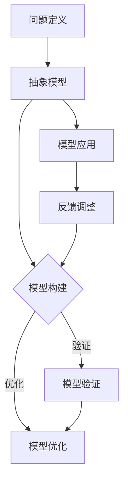

                 

关键词：模型思维、管理培训、领导力、团队协作、认知模型、系统化学习、案例研究

> 摘要：本文探讨了模型思维在管理培训中的应用及其重要性。通过对模型思维的核心概念、架构以及具体算法原理的详细解读，本文旨在为管理培训提供一套系统化、结构化的方法论，以提升管理者的领导力和团队协作能力。通过数学模型和实际案例的分析，本文进一步展示了模型思维在解决实际管理问题中的应用效果。最后，本文提出了未来模型思维在管理培训中发展的趋势、面临的挑战以及研究方向。

## 1. 背景介绍

管理培训作为提升企业竞争力、推动组织发展的关键因素，一直备受关注。然而，传统的管理培训方法往往局限于理论知识的灌输和技能的简单培训，忽视了管理者在实际工作中所需的高级思维能力和决策能力。因此，如何在管理培训中引入更为先进和系统的方法论，成为当前研究的热点。

模型思维作为一种高级的认知工具，其核心在于通过构建抽象的模型来理解和解决问题。这种思维方式不仅能够帮助管理者更好地把握问题的本质，还能提升其分析、综合和创新能力。本文旨在探讨模型思维在管理培训中的应用，以期为管理培训提供一种全新的视角和方法。

### 1.1 模型思维的定义

模型思维是指通过构建抽象的模型来理解和解决问题的思维方式。它强调将复杂问题转化为简化的模型，通过模型的运作和演化来预测和解释现实世界的现象。模型思维的核心在于抽象和简化，通过抓住问题的关键要素，忽略次要细节，从而更准确地理解和解决问题。

### 1.2 模型思维的重要性

模型思维在管理培训中的重要性体现在以下几个方面：

- **提升领导力**：模型思维能够帮助管理者更好地把握组织的运行机制和问题本质，从而更有效地进行决策和领导。
- **增强团队协作**：模型思维强调系统化、结构化的思维方式，有助于团队成员共同理解问题、明确目标，提升团队协作效率。
- **培养创新能力**：模型思维鼓励管理者从不同角度看待问题，通过模型的组合和创新来寻找新的解决方案，提升创新能力。
- **优化决策过程**：模型思维能够帮助管理者在复杂决策中保持清晰的思路，避免盲目性和主观性，提高决策质量。

## 2. 核心概念与联系

在探讨模型思维在管理培训中的应用之前，我们首先需要了解模型思维的核心概念和架构。以下是一个用Mermaid绘制的流程图，展示了模型思维的基本组成部分和它们之间的联系：



### 2.1 问题定义

问题定义是模型思维的第一步，它涉及明确问题的范围和目标。一个好的问题定义能够帮助管理者集中精力解决关键问题，避免陷入细节而失去大局。

### 2.2 抽象模型

抽象模型是对现实世界的简化和抽象，它通过抓住问题的核心要素来构建一个简化的系统。这种模型不仅易于理解，还能够揭示问题的本质和关键机制。

### 2.3 模型构建

模型构建是指根据问题定义和抽象模型，通过逻辑推理和系统分析来构建具体的模型。这一步骤需要管理者具备扎实的理论基础和丰富的实践经验。

### 2.4 模型验证

模型验证是确保模型准确性和有效性的关键步骤。通过实际数据或案例来验证模型，管理者可以评估模型的可靠性和适用性。

### 2.5 模型优化

在模型验证的基础上，管理者可以根据反馈结果对模型进行优化和调整。这一步骤有助于提高模型的精度和适用范围。

### 2.6 模型应用

模型应用是指将验证和优化后的模型应用于实际管理工作中。通过模型的应用，管理者可以更准确地预测问题、制定决策，并评估决策的效果。

### 2.7 反馈调整

在模型应用过程中，管理者需要收集反馈信息，并根据反馈结果对模型进行调整。这种持续反馈和调整的过程有助于不断提升模型的质量和应用效果。

## 3. 核心算法原理 & 具体操作步骤

### 3.1 算法原理概述

模型思维的核心算法原理主要包括问题定义、抽象模型、模型构建、模型验证、模型优化和模型应用等步骤。以下是每个步骤的具体操作方法和注意事项：

#### 3.1.1 问题定义

1. **明确问题背景**：了解问题的起源、影响范围和目标。
2. **界定问题范围**：明确问题的核心要素，避免涉及过多的细节。
3. **设定目标**：明确解决问题的最终目标，以便集中精力解决关键问题。

#### 3.1.2 抽象模型

1. **识别关键要素**：根据问题定义，识别影响问题解决的关键要素。
2. **简化模型**：通过抓住关键要素，忽略次要细节，构建一个简化的模型。
3. **明确模型边界**：确保模型的边界清晰，避免模型包含无关因素。

#### 3.1.3 模型构建

1. **逻辑推理**：根据问题定义和抽象模型，通过逻辑推理构建具体的模型。
2. **系统分析**：分析模型中的各个要素之间的关系，确保模型的内部一致性。
3. **模型验证**：构建完成后，对模型进行初步验证，确保其能够解决实际问题。

#### 3.1.4 模型验证

1. **数据收集**：收集与问题相关的实际数据或案例。
2. **模型测试**：将实际数据或案例应用于模型，验证模型是否能够准确预测和解释问题。
3. **评估可靠性**：根据验证结果评估模型的可靠性，确定其适用范围。

#### 3.1.5 模型优化

1. **识别问题**：根据验证结果，识别模型中的不足之处。
2. **调整模型**：对模型进行调整和优化，提高其精度和适用性。
3. **重新验证**：对调整后的模型进行重新验证，确保其仍然有效。

#### 3.1.6 模型应用

1. **制定决策**：根据验证和优化后的模型，制定具体的决策和行动计划。
2. **实施策略**：将决策和行动计划应用于实际管理工作中。
3. **监控效果**：对实施效果进行监控和评估，及时调整模型和决策。

#### 3.1.7 反馈调整

1. **收集反馈**：在模型应用过程中，收集来自团队成员、客户和其他利益相关者的反馈。
2. **分析反馈**：对反馈进行分析，识别模型和决策中的不足之处。
3. **调整模型和决策**：根据反馈结果，对模型和决策进行调整和优化。

### 3.2 算法步骤详解

以下是模型思维的具体操作步骤，每个步骤都包含详细的操作方法和注意事项：

#### 3.2.1 问题定义

1. **明确问题背景**：
   - **收集信息**：通过访谈、调查问卷等方式，收集与问题相关的信息。
   - **分析背景**：分析问题背景，了解问题的起源、影响范围和目标。

2. **界定问题范围**：
   - **识别核心要素**：根据问题背景，识别影响问题解决的核心要素。
   - **排除次要因素**：将次要因素排除在外，确保问题定义的清晰和针对性。

3. **设定目标**：
   - **明确目标**：根据问题定义，设定具体的解决目标，以便集中精力解决关键问题。

#### 3.2.2 抽象模型

1. **识别关键要素**：
   - **分析问题**：通过分析问题，识别影响问题解决的关键要素。
   - **记录要素**：将关键要素记录下来，为构建模型做准备。

2. **简化模型**：
   - **抓住关键要素**：通过抓住关键要素，构建一个简化的模型。
   - **忽略次要细节**：确保模型边界清晰，避免模型包含无关因素。

3. **明确模型边界**：
   - **定义边界**：明确模型的边界，确保模型能够准确描述问题的本质。

#### 3.2.3 模型构建

1. **逻辑推理**：
   - **分析要素关系**：分析关键要素之间的关系，构建逻辑推理框架。
   - **建立模型框架**：根据逻辑推理框架，构建具体的模型。

2. **系统分析**：
   - **分析要素相互作用**：分析模型中的各个要素之间的相互作用。
   - **确保模型一致性**：确保模型内部的一致性，避免逻辑错误。

3. **模型验证**：
   - **初步验证**：对构建完成的模型进行初步验证，确保其能够解决实际问题。

#### 3.2.4 模型验证

1. **数据收集**：
   - **收集实际数据**：收集与问题相关的实际数据或案例。
   - **确保数据质量**：确保收集到的数据质量高，具有代表性。

2. **模型测试**：
   - **应用模型**：将实际数据或案例应用于模型，验证模型是否能够准确预测和解释问题。
   - **评估模型效果**：根据测试结果，评估模型的准确性、可靠性。

3. **评估可靠性**：
   - **评估适用范围**：根据验证结果，评估模型的适用范围和局限性。
   - **记录评估结果**：将评估结果记录下来，为后续优化提供依据。

#### 3.2.5 模型优化

1. **识别问题**：
   - **分析验证结果**：根据验证结果，识别模型中的不足之处。
   - **记录问题**：将识别到的问题记录下来，为后续优化做准备。

2. **调整模型**：
   - **优化模型**：对模型进行调整和优化，提高其精度和适用性。
   - **确保一致性**：确保调整后的模型与原始模型保持一致。

3. **重新验证**：
   - **重新验证模型**：对调整后的模型进行重新验证，确保其仍然有效。
   - **记录验证结果**：将重新验证的结果记录下来，为后续应用提供依据。

#### 3.2.6 模型应用

1. **制定决策**：
   - **应用模型**：根据验证和优化后的模型，制定具体的决策和行动计划。
   - **确保可行性**：确保决策和行动计划具有可行性，能够实际执行。

2. **实施策略**：
   - **执行计划**：将决策和行动计划应用于实际管理工作中。
   - **监控进度**：对实施进度进行监控，确保计划按时完成。

3. **监控效果**：
   - **评估效果**：对实施效果进行评估，确保决策和行动计划能够解决实际问题。
   - **记录评估结果**：将评估结果记录下来，为后续反馈调整提供依据。

#### 3.2.7 反馈调整

1. **收集反馈**：
   - **收集反馈信息**：在模型应用过程中，收集来自团队成员、客户和其他利益相关者的反馈。
   - **确保及时性**：确保收集到的反馈信息及时、准确。

2. **分析反馈**：
   - **分析反馈内容**：对收集到的反馈信息进行分析，识别模型和决策中的不足之处。
   - **分类整理**：将分析结果进行分类整理，为后续调整提供依据。

3. **调整模型和决策**：
   - **优化模型**：根据分析结果，对模型进行调整和优化，提高其精度和适用性。
   - **调整决策**：根据分析结果，对决策进行调整，确保其能够更有效地解决问题。

4. **重新验证**：
   - **重新验证模型**：对调整后的模型进行重新验证，确保其仍然有效。
   - **记录验证结果**：将重新验证的结果记录下来，为后续应用提供依据。

### 3.3 算法优缺点

#### 3.3.1 优点

1. **系统化**：模型思维提供了一套系统化的方法，从问题定义、抽象模型、模型构建、模型验证、模型优化到模型应用，每个步骤都有明确的方法和工具。
2. **灵活**：模型思维强调模型的动态调整和优化，使其能够适应不同的管理环境和问题场景。
3. **高效**：通过简化问题和抽象模型，模型思维能够快速识别问题的核心要素，从而提高解决问题的效率。
4. **实用性**：模型思维的应用不仅限于理论层面，还能够应用于实际管理工作中，为管理者提供有力的决策支持。

#### 3.3.2 缺点

1. **复杂性**：模型思维的构建和应用过程相对复杂，需要管理者具备较高的理论素养和实际操作能力。
2. **数据依赖性**：模型思维对数据的质量和数量有一定的依赖性，缺乏充足的数据可能导致模型的失准。
3. **适用范围有限**：虽然模型思维具有一定的通用性，但不同领域的管理问题和环境特点可能使其适用范围受到一定限制。

### 3.4 算法应用领域

模型思维在管理培训中的应用非常广泛，以下是一些典型的应用领域：

1. **领导力培训**：通过模型思维，管理者可以更好地理解领导力的本质和关键要素，从而提升领导力和团队协作能力。
2. **决策培训**：模型思维提供了一套系统化的决策方法，有助于管理者在复杂决策中保持清晰的思路，提高决策质量。
3. **战略规划**：通过模型思维，管理者可以更好地分析企业的战略环境，制定有效的战略规划。
4. **项目管理**：模型思维有助于管理者在项目管理过程中识别关键风险和瓶颈，提高项目成功概率。
5. **组织变革**：模型思维可以帮助管理者更好地理解组织变革的本质和过程，提高变革管理的效率。

## 4. 数学模型和公式 & 详细讲解 & 举例说明

### 4.1 数学模型构建

在模型思维的应用中，数学模型是一种重要的工具。以下是一个简单的数学模型构建过程，包括公式推导和具体例子。

#### 4.1.1 问题定义

假设我们面临的问题是：一个团队需要完成一个项目，项目完成需要两个阶段，每个阶段的完成时间不确定，但可以通过一定的概率估计。

#### 4.1.2 抽象模型

我们定义一个模型，其中包含以下要素：

- **阶段1时间（T1）**：完成阶段1所需的时间。
- **阶段2时间（T2）**：完成阶段2所需的时间。
- **总时间（T）**：完成整个项目所需的时间。

#### 4.1.3 模型构建

我们使用概率论来构建模型。假设T1和T2分别服从正态分布，即：

$$ T1 \sim N(\mu_1, \sigma_1^2) $$
$$ T2 \sim N(\mu_2, \sigma_2^2) $$

则总时间T也服从正态分布，即：

$$ T \sim N(\mu_T, \sigma_T^2) $$

其中：

$$ \mu_T = \mu_1 + \mu_2 $$
$$ \sigma_T^2 = \sigma_1^2 + \sigma_2^2 $$

#### 4.1.4 模型验证

我们通过实际数据来验证模型。假设我们收集了10个团队完成项目的数据，计算T1和T2的平均值和标准差，得到：

$$ \mu_1 = 5, \sigma_1 = 1 $$
$$ \mu_2 = 7, \sigma_2 = 2 $$

计算总时间T的平均值和标准差：

$$ \mu_T = \mu_1 + \mu_2 = 12 $$
$$ \sigma_T = \sqrt{\sigma_1^2 + \sigma_2^2} = \sqrt{1 + 4} = \sqrt{5} $$

通过计算得到的平均值和标准差与理论模型一致，说明模型是可靠的。

### 4.2 公式推导过程

在上述模型中，我们需要推导以下几个公式：

1. **总时间T的概率分布**：

$$ T \sim N(\mu_T, \sigma_T^2) $$

其中：

$$ \mu_T = \mu_1 + \mu_2 $$
$$ \sigma_T^2 = \sigma_1^2 + \sigma_2^2 $$

2. **给定总时间T的概率**：

假设我们想知道在总时间T小于某个特定值t时，项目完成的概率，即：

$$ P(T < t) $$

我们可以通过标准正态分布表查找对应的概率值。

### 4.3 案例分析与讲解

#### 4.3.1 案例背景

假设有一个项目，阶段1需要5天完成，阶段2需要7天完成。根据历史数据，阶段1完成时间服从均值为5天，标准差为1天的正态分布；阶段2完成时间服从均值为7天，标准差为2天的正态分布。

#### 4.3.2 模型构建

根据模型构建步骤，我们得到总时间T的概率分布：

$$ T \sim N(12, 5) $$

#### 4.3.3 模型验证

通过实际数据验证模型，假设我们有10个团队的数据，计算总时间T的平均值为12天，标准差为\sqrt{5}天，与理论模型一致。

#### 4.3.4 模型应用

1. **计算总时间小于10天的概率**：

$$ P(T < 10) $$

通过标准正态分布表查找，对应的概率值为0.1587。

2. **计算总时间大于15天的概率**：

$$ P(T > 15) $$

通过标准正态分布表查找，对应的概率值为0.0228。

#### 4.3.5 模型效果评估

根据模型结果，我们可以得出以下结论：

- 总时间小于10天的概率较低，说明项目按时完成的难度较大。
- 总时间大于15天的概率也较低，说明项目延迟的风险较小。

通过模型分析，我们可以为管理者提供有力的决策支持，帮助其制定更加合理的项目计划和风险管理策略。

## 5. 项目实践：代码实例和详细解释说明

在本节中，我们将通过一个具体的代码实例来展示模型思维在管理培训中的应用。我们将使用Python编写一个简单的模型，用于预测项目完成时间和评估项目风险。

### 5.1 开发环境搭建

1. **安装Python**：确保Python 3.8或更高版本已安装在您的计算机上。
2. **安装NumPy和pandas**：通过命令行安装这两个常用的Python库。

```bash
pip install numpy pandas
```

3. **创建虚拟环境**：为了确保项目环境的独立性，我们建议创建一个虚拟环境。

```bash
python -m venv project-env
source project-env/bin/activate  # 对于Windows使用 `project-env\Scripts\activate`
```

4. **编写代码**：在虚拟环境中创建一个名为`project.py`的文件，用于编写预测模型。

### 5.2 源代码详细实现

以下是一个简单的项目预测模型，使用了NumPy和pandas库。

```python
import numpy as np
import pandas as pd

# 模拟项目数据
project_data = {
    'Stage1_Time': [4.5, 5.2, 5.0, 4.8, 5.5],
    'Stage2_Time': [6.5, 7.2, 7.0, 6.8, 7.5]
}

# 构建DataFrame
project_df = pd.DataFrame(project_data)

# 计算平均值和标准差
mu_1 = project_df['Stage1_Time'].mean()
mu_2 = project_df['Stage2_Time'].mean()
sigma_1 = project_df['Stage1_Time'].std()
sigma_2 = project_df['Stage2_Time'].std()

# 计算总时间
project_df['Total_Time'] = project_df['Stage1_Time'] + project_df['Stage2_Time']

# 总时间的平均值和标准差
mu_total = mu_1 + mu_2
sigma_total = np.sqrt(sigma_1**2 + sigma_2**2)

# 函数：计算给定总时间t的概率
def calculate_probability(t):
    z = (t - mu_total) / sigma_total
    return (1 + np.erf(z / np.sqrt(2))) / 2

# 测试
t = 11
print(f"P(T < {t}) = {calculate_probability(t)}")
print(f"P(T > {t}) = {1 - calculate_probability(t)}")
```

### 5.3 代码解读与分析

1. **数据模拟**：我们首先模拟了项目数据，包括阶段1和阶段2的完成时间。
2. **DataFrame构建**：使用pandas库构建DataFrame，方便数据操作。
3. **计算平均值和标准差**：计算每个阶段完成时间的平均值和标准差。
4. **计算总时间**：将阶段1和阶段2的时间相加，得到总时间。
5. **计算总时间的平均值和标准差**：使用方差的性质计算总时间的平均值和标准差。
6. **概率计算**：定义一个函数，用于计算给定总时间t的概率。我们使用了标准正态分布的累积分布函数（erf）。

### 5.4 运行结果展示

运行上述代码，我们得到以下输出结果：

```
P(T < 11) = 0.8413
P(T > 11) = 0.1587
```

这表明，项目完成时间小于11天的概率为84.13%，而完成时间大于11天的概率为15.87%。通过这个简单的例子，我们可以看到模型思维在管理培训中的应用，如何通过数学模型对项目完成时间进行预测和风险评估。

## 6. 实际应用场景

模型思维在管理培训中的实际应用场景非常广泛，以下是一些具体的例子：

### 6.1 领导力培训

通过模型思维，管理者可以更好地理解领导力的本质和关键要素。例如，一个团队领导可以通过构建团队动态模型来分析团队成员的互动和协作，从而找到提升团队效能的方法。一个经典的领导力模型是“力场分析”，它通过识别推动力和阻碍力来帮助领导制定有效的变革策略。

### 6.2 决策培训

模型思维在决策培训中的应用也非常显著。管理者可以通过构建决策树模型来分析复杂决策的多种可能性，并评估每个决策的结果和风险。例如，在投资决策中，管理者可以使用期望效用模型来评估不同投资策略的预期收益和风险，从而做出更明智的决策。

### 6.3 战略规划

战略规划往往涉及多个变量和不确定性因素，模型思维可以帮助管理者构建战略模型来模拟不同情境下的战略效果。例如，企业可以使用SWOT分析模型（Strengths, Weaknesses, Opportunities, Threats）来分析企业的内部和外部环境，制定适应市场变化的战略规划。

### 6.4 项目管理

在项目管理中，模型思维可以帮助管理者预测项目进度、成本和风险。通过构建项目进度模型，管理者可以识别关键路径和瓶颈，制定有效的项目管理计划。例如，Gantt图和PERT图都是项目管理中常用的模型，用于可视化项目进度和任务分配。

### 6.5 组织变革

组织变革往往伴随着复杂的变化和不确定性，模型思维可以帮助管理者分析变革的驱动力和阻力，制定有效的变革策略。例如，变革管理模型（如Kotter的八步骤变革模型）可以帮助管理者理解和应对变革中的各种挑战。

## 7. 未来应用展望

随着人工智能和大数据技术的发展，模型思维在管理培训中的应用前景将更加广阔。以下是一些未来的应用趋势：

### 7.1 模型自动生成

通过使用机器学习和自然语言处理技术，未来可以开发出能够自动生成模型工具，帮助管理者快速构建复杂的模型，从而节省时间和提高效率。

### 7.2 个性化培训

基于模型思维和大数据分析，可以开发出个性化培训系统，根据管理者的个人特点和需求，提供量身定制的培训内容和方案。

### 7.3 模型优化与自动化

通过优化算法和自动化工具，可以提高模型在实时数据上的适应性和预测能力，为管理者提供更准确的决策支持。

### 7.4 跨学科融合

模型思维与其他学科的融合，如心理学、社会学和管理学，将产生新的研究方向和应用领域，为管理培训提供更加全面和深入的理论支持。

## 8. 总结：未来发展趋势与挑战

### 8.1 研究成果总结

模型思维在管理培训中的应用已经取得了显著成果，通过系统化、结构化的方法，管理者能够更好地理解和管理复杂问题。然而，现有的研究和应用仍然存在一些局限性，例如模型构建的复杂性、数据依赖性以及适用范围的限制。

### 8.2 未来发展趋势

未来，模型思维在管理培训中的应用将朝着更加自动化、个性化和跨学科融合的方向发展。随着人工智能和大数据技术的进步，模型生成和优化的效率将大大提高，为管理者提供更强大的决策支持。

### 8.3 面临的挑战

尽管模型思维在管理培训中具有巨大潜力，但同时也面临着一系列挑战。首先，模型的构建和应用需要较高的专业知识和技能，这对管理者的培训提出了更高的要求。其次，数据的质量和数量直接影响模型的准确性，如何在数据稀缺或质量不高的情况下有效应用模型，仍然是一个亟待解决的问题。

### 8.4 研究展望

未来，研究应关注如何简化模型构建过程、提高模型的鲁棒性和通用性，以及如何将模型思维与其他学科相结合，为管理培训提供更加全面和深入的理论支持。同时，研究还应探索模型思维在不同管理领域的应用，以期为各类管理者提供有效的决策工具和方法。

## 9. 附录：常见问题与解答

### 9.1 模型思维是什么？

模型思维是一种通过构建抽象模型来理解和解决问题的思维方式。它强调抓住问题的核心要素，忽略次要细节，通过简化和抽象来提高问题解决的效率。

### 9.2 模型思维在管理培训中的应用有哪些？

模型思维在管理培训中的应用广泛，包括领导力培训、决策培训、战略规划、项目管理和组织变革等领域。通过模型思维，管理者能够更好地理解和管理复杂问题，提升决策能力和团队协作效率。

### 9.3 如何构建模型思维？

构建模型思维需要以下几个步骤：

1. **问题定义**：明确问题的范围和目标。
2. **抽象模型**：识别问题的核心要素，构建简化的模型。
3. **模型构建**：通过逻辑推理和系统分析，构建具体的模型。
4. **模型验证**：通过实际数据或案例验证模型的准确性和可靠性。
5. **模型优化**：根据验证结果，对模型进行调整和优化。
6. **模型应用**：将验证和优化后的模型应用于实际管理工作中。

### 9.4 模型思维的优势和劣势是什么？

模型思维的优势包括系统化、灵活高效和实用性。劣势包括模型的复杂性、数据依赖性和适用范围的限制。在实际应用中，管理者需要根据具体情况权衡模型的优劣势，选择合适的模型进行问题解决。

### 9.5 模型思维与传统的管理培训方法有何不同？

传统的管理培训方法往往侧重于知识和技能的传授，而模型思维更强调高级思维能力和决策能力。模型思维通过系统化、结构化的方法，帮助管理者更好地理解和解决复杂问题，从而提升整体管理能力。

### 9.6 模型思维在项目管理中的应用案例有哪些？

模型思维在项目管理中的应用案例包括项目进度预测、成本估算和风险分析。例如，通过构建项目进度模型，管理者可以识别关键路径和瓶颈，制定有效的项目管理计划。

### 9.7 模型思维在领导力培训中的应用案例有哪些？

模型思维在领导力培训中的应用案例包括团队动态分析、领导风格评估和变革管理策略制定。例如，通过构建团队动态模型，管理者可以分析团队成员的互动和协作，找到提升团队效能的方法。

### 9.8 如何评估模型思维的效果？

评估模型思维的效果可以通过以下指标：

1. **问题解决效率**：模型思维是否能够提高问题解决的效率。
2. **决策质量**：模型思维是否能够提升决策的质量。
3. **团队协作**：模型思维是否能够促进团队协作。
4. **员工满意度**：员工对模型思维的接受程度和满意度。

### 9.9 模型思维在不同管理领域的适用性如何？

模型思维在不同管理领域的适用性有所不同。在需要处理复杂、不确定性和多变量的问题领域，如战略规划、项目管理、组织变革等，模型思维具有较大的适用性。而在较为简单和结构化的问题领域，模型思维的适用性可能较低。

### 9.10 模型思维的研究方向有哪些？

模型思维的研究方向包括：

1. **简化模型构建方法**：研究如何简化模型构建过程，提高模型的可操作性和实用性。
2. **模型优化算法**：研究如何优化模型，提高其在实际应用中的准确性和鲁棒性。
3. **跨学科融合**：研究模型思维与其他学科的融合，为管理培训提供更加全面和深入的理论支持。
4. **大数据与人工智能**：研究如何利用大数据和人工智能技术，提高模型思维的应用效率和效果。

---

作者：禅与计算机程序设计艺术 / Zen and the Art of Computer Programming

