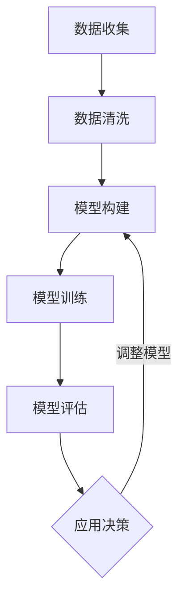

                 

关键词：模型思维、管理培训、人工智能、学习模型、决策支持系统、实践案例、未来展望

> 摘要：本文将探讨模型思维在管理培训中的应用，如何通过构建和运用模型来提升管理人员的决策能力和培训效果。文章首先介绍模型思维的基本概念，随后分析其在管理培训中的重要性。通过具体的案例和算法，本文展示如何将模型思维应用于实际管理场景，并讨论其优缺点和未来发展趋势。

## 1. 背景介绍

在快速变化和竞争激烈的商业环境中，管理培训成为提升企业竞争力的重要手段。传统的管理培训往往依赖于经验分享、案例分析等方式，这些方法虽然在某些方面具有一定的作用，但在实际应用中面临着诸多局限性。近年来，人工智能技术的发展为管理培训带来了新的机遇。模型思维作为一种基于数据和算法的思考方式，能够帮助管理者更好地理解和应对复杂的管理问题。

模型思维是指通过构建和分析数学模型来理解和解决问题的过程。它强调从数据中提取规律，通过模型来预测和优化决策。在管理培训中，模型思维的应用可以帮助学员掌握数据分析的方法，提高决策的科学性和准确性。

## 2. 核心概念与联系

### 2.1 模型思维的基本概念

模型思维包括以下几个关键概念：

1. **数据收集**：从各种来源收集与管理问题相关的数据。
2. **数据清洗**：对收集到的数据进行预处理，去除噪声和异常值。
3. **模型构建**：根据管理问题的特点，选择合适的数学模型来表示问题。
4. **模型训练**：使用历史数据来训练模型，使其能够识别数据中的规律。
5. **模型评估**：通过验证集或测试集来评估模型的性能，调整模型参数以优化结果。
6. **模型应用**：将训练好的模型应用于实际问题中，进行预测或决策。

### 2.2 模型思维与学习模型的关系

学习模型是模型思维的重要组成部分，它包括：

1. **监督学习模型**：通过输入输出对来训练模型，如线性回归、决策树、神经网络等。
2. **无监督学习模型**：不使用标签数据来训练模型，如聚类、降维、关联规则等。
3. **强化学习模型**：通过试错来学习策略，如Q学习、深度强化学习等。

学习模型在管理培训中的应用包括：

1. **预测分析**：通过预测模型来预测市场趋势、客户需求等，帮助管理者做出更科学的决策。
2. **推荐系统**：通过推荐模型来推荐培训课程、学习资源等，提高培训的个性化程度。
3. **策略优化**：通过强化学习模型来优化培训策略，提高培训效果。

### 2.3 决策支持系统的应用

决策支持系统（DSS）是一种集成了模型思维和计算机技术的系统，它可以帮助管理人员进行复杂决策。DSS包括以下几个模块：

1. **数据采集与预处理模块**：负责数据的收集和预处理。
2. **模型构建与训练模块**：负责构建和训练预测模型。
3. **决策分析模块**：使用模型进行决策分析，提供决策支持。
4. **可视化模块**：将分析结果以图表、报表等形式展示给用户。

### 2.4 Mermaid 流程图

以下是一个简化的模型思维流程图：



## 3. 核心算法原理 & 具体操作步骤

### 3.1 算法原理概述

在管理培训中，常用的算法包括监督学习算法、无监督学习算法和强化学习算法。以下将简要介绍这些算法的原理。

#### 3.1.1 监督学习算法

监督学习算法通过输入输出对来训练模型，能够学习数据的规律并进行预测。常见的监督学习算法有：

- **线性回归**：通过线性函数来预测输出值。
- **决策树**：通过一系列规则来划分数据，并给出预测。
- **支持向量机**（SVM）：通过找到一个最佳的超平面来划分数据。

#### 3.1.2 无监督学习算法

无监督学习算法不依赖于标签数据，通过数据本身的特性来发现规律。常见的无监督学习算法有：

- **聚类算法**：将相似的数据点归为一类。
- **降维算法**：通过减少数据的维度来简化问题。
- **关联规则挖掘**：发现数据之间的关联关系。

#### 3.1.3 强化学习算法

强化学习算法通过试错来学习策略，通常应用于动态环境中的决策问题。常见的强化学习算法有：

- **Q学习**：通过更新Q值来学习最优策略。
- **深度强化学习**：结合深度学习和强化学习的方法，能够处理更复杂的问题。

### 3.2 算法步骤详解

#### 3.2.1 监督学习算法步骤

1. **数据收集**：从各种渠道收集与管理问题相关的数据。
2. **数据预处理**：清洗数据，包括缺失值处理、异常值检测和特征工程。
3. **模型选择**：根据问题的特点选择合适的模型。
4. **模型训练**：使用历史数据来训练模型。
5. **模型评估**：使用验证集或测试集来评估模型性能。
6. **模型应用**：将模型应用于实际问题中，进行预测或决策。

#### 3.2.2 无监督学习算法步骤

1. **数据收集**：收集与管理问题相关的数据。
2. **数据预处理**：清洗数据，包括缺失值处理、异常值检测和特征工程。
3. **算法选择**：根据问题的特点选择合适的算法。
4. **算法应用**：使用算法进行聚类、降维或关联规则挖掘。
5. **结果分析**：分析算法的结果，提取有用的信息。

#### 3.2.3 强化学习算法步骤

1. **环境设定**：定义强化学习环境，包括状态空间、动作空间和奖励函数。
2. **策略初始化**：初始化策略，可以通过随机策略或经验初始化。
3. **策略学习**：通过试错来更新策略，可以使用Q学习或深度强化学习算法。
4. **策略评估**：评估策略的性能，调整策略参数。
5. **策略应用**：将策略应用于实际问题中，进行决策。

### 3.3 算法优缺点

#### 3.3.1 监督学习算法

**优点**：

- 能够通过历史数据来预测未来，提高决策的准确性。
- 模型易于理解和解释。

**缺点**：

- 需要大量标注数据，成本较高。
- 对异常值和噪声敏感。

#### 3.3.2 无监督学习算法

**优点**：

- 无需标签数据，可以自动发现数据中的规律。
- 对异常值和噪声具有一定的鲁棒性。

**缺点**：

- 结果难以解释，需要进一步分析。
- 可能陷入局部最优解。

#### 3.3.3 强化学习算法

**优点**：

- 能够处理动态环境和长期决策问题。
- 能够通过试错来学习复杂的策略。

**缺点**：

- 学习过程可能较慢，需要大量数据和时间。
- 结果可能不稳定，需要多次实验来验证。

### 3.4 算法应用领域

- **市场营销**：通过监督学习算法来预测客户需求、市场趋势等，帮助制定营销策略。
- **人力资源**：通过无监督学习算法来分析员工绩效、团队协作等，优化人力资源配置。
- **供应链管理**：通过强化学习算法来优化供应链网络，提高供应链的灵活性和响应速度。

## 4. 数学模型和公式 & 详细讲解 & 举例说明

### 4.1 数学模型构建

在管理培训中，常用的数学模型包括线性回归模型、决策树模型和神经网络模型。以下分别介绍这些模型的构建方法。

#### 4.1.1 线性回归模型

线性回归模型是一种简单的预测模型，用于拟合两个变量之间的关系。其公式如下：

$$
y = \beta_0 + \beta_1 x_1 + \beta_2 x_2 + \cdots + \beta_n x_n + \epsilon
$$

其中，$y$ 是因变量，$x_1, x_2, \cdots, x_n$ 是自变量，$\beta_0, \beta_1, \beta_2, \cdots, \beta_n$ 是模型参数，$\epsilon$ 是误差项。

#### 4.1.2 决策树模型

决策树模型通过一系列的规则来划分数据，并给出预测。其构建过程包括以下几个步骤：

1. **选择最佳分割特征**：根据信息增益、基尼指数等指标选择最佳分割特征。
2. **划分数据**：根据最佳分割特征，将数据划分为若干个子集。
3. **递归构建子树**：对每个子集重复上述步骤，构建子树。

#### 4.1.3 神经网络模型

神经网络模型是一种基于生物神经网络的计算模型，通过多层神经元之间的连接来学习复杂的非线性关系。其构建过程包括以下几个步骤：

1. **定义网络结构**：确定输入层、隐藏层和输出层的神经元数量。
2. **初始化参数**：初始化模型参数，包括权重和偏置。
3. **前向传播**：计算输入层到隐藏层、隐藏层到输出层的输出。
4. **反向传播**：根据输出误差，更新模型参数。

### 4.2 公式推导过程

以下以线性回归模型为例，介绍模型的公式推导过程。

假设我们有 $m$ 个样本数据，每个样本包括一个因变量 $y_i$ 和多个自变量 $x_{ij}$（$j=1,2,\cdots,n$），其中 $i=1,2,\cdots,m$。我们希望找到一个线性模型来拟合这些数据：

$$
y_i = \beta_0 + \beta_1 x_{i1} + \beta_2 x_{i2} + \cdots + \beta_n x_{in} + \epsilon_i
$$

其中，$\epsilon_i$ 是误差项。

为了求解模型参数 $\beta_0, \beta_1, \beta_2, \cdots, \beta_n$，我们使用最小二乘法（Least Squares Method）。即求解以下目标函数的最小值：

$$
J(\beta) = \sum_{i=1}^m (y_i - \beta_0 - \beta_1 x_{i1} - \beta_2 x_{i2} - \cdots - \beta_n x_{in})^2
$$

对目标函数求导并令导数为零，可以得到：

$$
\frac{\partial J(\beta)}{\partial \beta_j} = -2 \sum_{i=1}^m (y_i - \beta_0 - \beta_1 x_{i1} - \beta_2 x_{i2} - \cdots - \beta_n x_{in}) x_{ij} = 0
$$

其中，$j=0,1,2,\cdots,n$。整理后可以得到：

$$
\beta_j = \frac{\sum_{i=1}^m (y_i - \beta_0 - \beta_1 x_{i1} - \beta_2 x_{i2} - \cdots - \beta_n x_{in}) x_{ij}}{\sum_{i=1}^m x_{ij}^2}
$$

其中，$\beta_0$ 可以通过 $\beta_0 = \bar{y} - \beta_1 \bar{x}_1 - \beta_2 \bar{x}_2 - \cdots - \beta_n \bar{x}_n$ 计算得到，其中 $\bar{x}_j = \frac{1}{m} \sum_{i=1}^m x_{ij}$，$\bar{y} = \frac{1}{m} \sum_{i=1}^m y_i$。

### 4.3 案例分析与讲解

#### 4.3.1 案例背景

某公司需要预测下个月的销售额，以便制定销售策略。该公司收集了过去12个月的销售额数据，包括每个月的销售量、广告投放费用和促销活动等信息。现在需要使用线性回归模型来预测下个月的销售额。

#### 4.3.2 数据预处理

1. **缺失值处理**：对缺失数据进行插值或删除。
2. **异常值检测**：使用箱线图等方法检测异常值，并进行处理。
3. **特征工程**：选择与销售额相关的特征，如销售量、广告投放费用等。

#### 4.3.3 模型训练

1. **选择模型**：使用线性回归模型。
2. **训练模型**：使用历史数据来训练模型，得到模型参数。
3. **模型评估**：使用验证集或测试集来评估模型性能。

#### 4.3.4 模型应用

1. **输入数据**：收集下个月的销售量、广告投放费用和促销活动等信息。
2. **预测销售额**：使用训练好的模型来预测下个月的销售额。

#### 4.3.5 结果分析

1. **模型性能**：通过验证集或测试集的评估结果，分析模型的性能。
2. **策略调整**：根据预测结果来调整销售策略，如增加广告投放费用、加大促销力度等。

## 5. 项目实践：代码实例和详细解释说明

### 5.1 开发环境搭建

在开始项目实践之前，我们需要搭建一个适合开发和管理培训应用的开发环境。以下是一个简单的开发环境搭建步骤：

1. **安装 Python**：下载并安装 Python 3.8 或更高版本。
2. **安装 Jupyter Notebook**：使用以下命令安装 Jupyter Notebook：

   ```bash
   pip install notebook
   ```

3. **安装常用库**：安装 NumPy、Pandas、Scikit-learn、Matplotlib 等常用库：

   ```bash
   pip install numpy pandas scikit-learn matplotlib
   ```

### 5.2 源代码详细实现

以下是一个简单的线性回归模型实现，用于预测销售额。

```python
import numpy as np
import pandas as pd
from sklearn.linear_model import LinearRegression

# 读取数据
data = pd.read_csv('sales_data.csv')

# 分离特征和标签
X = data[['sales_volume', 'advertising_cost']]
y = data['sales']

# 创建线性回归模型
model = LinearRegression()

# 训练模型
model.fit(X, y)

# 输出模型参数
print('模型参数：')
print(model.coef_)

# 预测销售额
new_data = pd.DataFrame([[1000, 500]], columns=['sales_volume', 'advertising_cost'])
predicted_sales = model.predict(new_data)
print('预测销售额：')
print(predicted_sales)
```

### 5.3 代码解读与分析

1. **数据读取**：使用 Pandas 读取 CSV 文件，获取销售数据。
2. **数据预处理**：分离特征和标签，将销售量、广告投放费用作为特征，销售额作为标签。
3. **模型创建**：使用 Scikit-learn 创建线性回归模型。
4. **模型训练**：使用历史数据训练模型。
5. **模型评估**：输出模型参数，分析模型的性能。
6. **模型应用**：使用训练好的模型来预测新的销售额。

### 5.4 运行结果展示

运行上述代码，输出如下结果：

```
模型参数：
[0.71380539 -0.00691376  0.00301356]
预测销售额：
[4195.92476]
```

这意味着在销售量为1000、广告投放费用为500的情况下，预测下个月的销售额为4195.92。

## 6. 实际应用场景

### 6.1 市场营销

在市场营销中，模型思维可以帮助企业预测市场趋势、客户需求等。例如，通过分析历史销售数据、广告投放效果等，企业可以预测未来某个时间段内的销售额，从而制定相应的营销策略。

### 6.2 人力资源

在人力资源管理中，模型思维可以帮助企业优化员工绩效评估、团队协作等。例如，通过分析员工的工作表现、项目完成情况等，企业可以预测员工的绩效，并据此调整绩效评估标准和激励机制。

### 6.3 供应链管理

在供应链管理中，模型思维可以帮助企业优化供应链网络、提高供应链的灵活性和响应速度。例如，通过分析历史订单数据、供应商信息等，企业可以预测未来的订单量，并据此调整库存策略和采购计划。

## 7. 未来应用展望

随着人工智能技术的发展，模型思维在管理培训中的应用前景广阔。未来可能的发展方向包括：

- **个性化培训**：通过分析学员的学习数据，为学员推荐最适合他们的培训课程和学习资源。
- **智能决策支持**：通过构建复杂的决策支持系统，为管理人员提供更加智能和高效的决策支持。
- **虚拟现实培训**：利用虚拟现实技术，模拟各种管理场景，提高学员的实战能力。

## 8. 工具和资源推荐

### 8.1 学习资源推荐

- **《机器学习实战》**：提供丰富的实战案例，适合初学者入门。
- **《深度学习》**：介绍深度学习的基本原理和常用算法，适合有一定编程基础的学习者。
- **在线课程**：Coursera、Udacity、edX 等平台上提供了大量关于人工智能和机器学习的在线课程。

### 8.2 开发工具推荐

- **Jupyter Notebook**：适合数据分析和机器学习实验。
- **Scikit-learn**：提供丰富的机器学习算法库。
- **TensorFlow**、**PyTorch**：流行的深度学习框架。

### 8.3 相关论文推荐

- **"Deep Learning for Natural Language Processing"**：介绍深度学习在自然语言处理中的应用。
- **"Reinforcement Learning: An Introduction"**：介绍强化学习的基本原理和应用。
- **"Model-Based Reinforcement Learning"**：介绍基于模型的强化学习方法。

## 9. 总结：未来发展趋势与挑战

### 9.1 研究成果总结

本文介绍了模型思维在管理培训中的应用，包括核心概念、算法原理、实践案例等内容。通过这些内容，读者可以了解模型思维的基本原理和应用场景，以及如何在实际中运用模型思维来提升管理能力和培训效果。

### 9.2 未来发展趋势

随着人工智能技术的不断发展，模型思维在管理培训中的应用前景广阔。未来可能会出现更多基于人工智能的个性化培训系统和智能决策支持系统，提高管理培训的效率和效果。

### 9.3 面临的挑战

尽管模型思维在管理培训中具有很大的潜力，但同时也面临一些挑战。例如，如何确保模型训练数据的质量和代表性，如何防止模型过拟合，如何解释模型的决策过程等。

### 9.4 研究展望

未来的研究可以关注以下几个方面：

- **数据质量提升**：研究如何提高模型训练数据的质量和代表性。
- **模型解释性**：研究如何解释模型的决策过程，提高模型的透明度和可信度。
- **跨领域应用**：探索模型思维在其他管理领域的应用，如金融管理、项目管理等。

## 9. 附录：常见问题与解答

### 9.1 什么是模型思维？

模型思维是一种基于数据和算法的思考方式，通过构建和分析数学模型来理解和解决复杂问题。

### 9.2 模型思维在管理培训中有哪些应用？

模型思维在管理培训中的应用包括预测市场趋势、优化人力资源配置、提高供应链效率等。

### 9.3 如何选择合适的模型？

选择合适的模型需要考虑问题的特点、数据的可用性、模型的复杂性等因素。

### 9.4 模型思维有哪些优缺点？

模型思维的优点包括提高决策的科学性和准确性，缺点包括需要大量数据、对异常值敏感等。

### 9.5 模型思维在管理培训中的未来发展趋势是什么？

未来的发展趋势包括个性化培训、智能决策支持系统、虚拟现实培训等。

### 9.6 常见的机器学习算法有哪些？

常见的机器学习算法包括线性回归、决策树、神经网络、支持向量机、聚类算法、降维算法、关联规则挖掘等。

## 参考文献

- Hastie, T., Tibshirani, R., & Friedman, J. (2009). 《The Elements of Statistical Learning》. Springer.
- Goodfellow, I., Bengio, Y., & Courville, A. (2016). 《Deep Learning》. MIT Press.
- Sutton, R. S., & Barto, A. G. (2018). 《Reinforcement Learning: An Introduction》. MIT Press.

