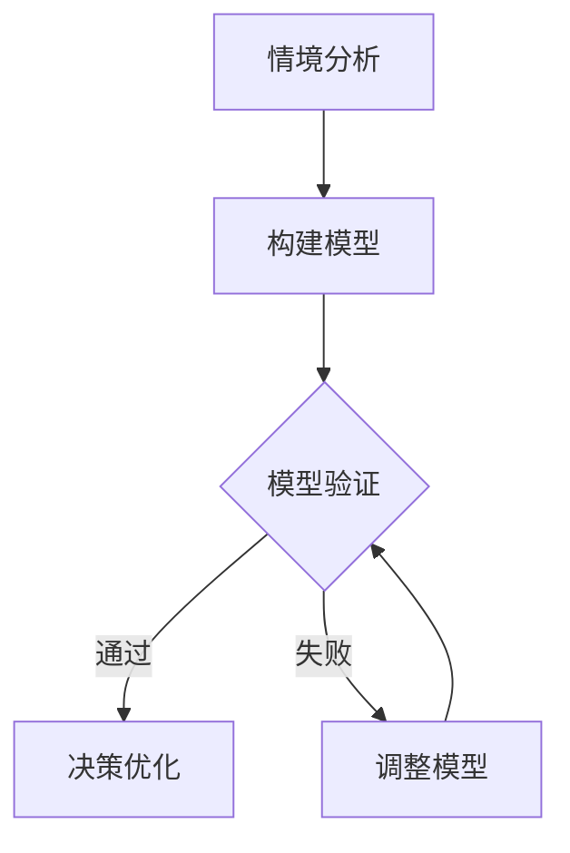

                 

关键词：模型思维、管理沟通、复杂系统、组织效率、团队协作、决策优化、信息传递、认知框架

> 摘要：本文深入探讨了模型思维在管理沟通中的重要性。模型思维作为一种认知工具，可以帮助管理者更好地理解和应对复杂系统中的沟通挑战。文章首先介绍了模型思维的基本概念和原理，然后通过多个实际案例分析了模型思维在管理沟通中的应用，最后讨论了模型思维在未来的发展趋势和面临的挑战。

## 1. 背景介绍

在信息化快速发展的今天，组织运作变得越来越复杂。管理沟通成为影响组织效率和团队协作的关键因素。传统的管理沟通方式往往依赖于经验和直觉，这使得管理者在面对复杂问题时容易陷入困境。而模型思维作为一种系统性的认知工具，为管理者提供了一种全新的思考方式。

模型思维（Model Thinking）是一种基于构建和利用抽象模型来理解和解决实际问题的方法论。它强调通过构建模型来模拟复杂系统的运行规律，从而提高决策的准确性和效率。模型思维不仅应用于科学研究，在管理沟通中也具有广泛的应用价值。

## 2. 核心概念与联系

### 2.1 模型思维的基本概念

模型思维的核心概念包括：

- **模型**：对现实世界的一种简化和抽象，通常由一组变量、关系和规则组成。
- **变量**：模型中的基本元素，用于表示系统的不同方面。
- **关系**：变量之间的相互作用，描述了系统内部的结构和功能。
- **规则**：模型中的约束条件，用于限制变量取值和关系变化。

### 2.2 模型思维在管理沟通中的应用

在管理沟通中，模型思维的应用主要体现在以下几个方面：

- **情境分析**：通过构建模型来分析不同情境下的可能结果，帮助管理者做出更加明智的决策。
- **问题诊断**：利用模型思维对问题进行结构化分析，找出问题的根本原因，从而制定有效的解决方案。
- **决策优化**：通过模型模拟不同决策方案的结果，评估其潜在风险和收益，从而优化决策过程。
- **沟通桥梁**：模型思维作为一种共同语言，有助于团队内部和外部的沟通，促进共识的形成。

### 2.3 Mermaid 流程图

以下是一个简单的Mermaid流程图，展示了模型思维在管理沟通中的应用流程：



## 3. 核心算法原理 & 具体操作步骤

### 3.1 算法原理概述

模型思维的核心算法原理可以概括为以下几个步骤：

1. **情境分析**：收集和整理与问题相关的信息，明确目标。
2. **构建模型**：根据情境分析的结果，构建一个能够反映系统运行规律的模型。
3. **模型验证**：通过模拟和实验来验证模型的准确性。
4. **决策优化**：利用模型分析不同决策方案的结果，评估其潜在风险和收益。
5. **沟通桥梁**：将模型转化为一种共同的沟通语言，促进团队内部和外部的共识形成。

### 3.2 算法步骤详解

1. **情境分析**：通过访谈、调研、数据收集等方式，了解问题的背景和关键因素。
2. **构建模型**：使用合适的工具和方法（如Mermaid、LaTeX等），构建一个简化的模型。
3. **模型验证**：通过模拟实验、数据分析等方法，验证模型的准确性和可靠性。
4. **决策优化**：利用模型分析不同决策方案的结果，比较其潜在风险和收益。
5. **沟通桥梁**：将模型转化为可视化图表、文档等形式，与团队成员进行分享和讨论。

### 3.3 算法优缺点

**优点**：

- 提高决策的准确性和效率。
- 促进团队内部和外部的沟通与共识。
- 帮助管理者更好地理解复杂系统。

**缺点**：

- 需要较高的专业知识和技能。
- 模型构建和验证可能需要大量时间和资源。

### 3.4 算法应用领域

模型思维在管理沟通中的应用领域广泛，包括：

- 项目管理：通过模型分析项目的进度、成本和风险。
- 人力资源管理：通过模型分析员工的绩效、培训和发展。
- 战略规划：通过模型分析市场趋势、竞争态势和潜在机遇。
- 危机管理：通过模型分析危机的影响和应对策略。

## 4. 数学模型和公式 & 详细讲解 & 举例说明

### 4.1 数学模型构建

在模型思维中，数学模型是一个核心组成部分。以下是一个简单的线性回归模型构建过程：

$$
Y = \beta_0 + \beta_1 X + \epsilon
$$

其中，$Y$ 是因变量，$X$ 是自变量，$\beta_0$ 和 $\beta_1$ 是模型参数，$\epsilon$ 是误差项。

### 4.2 公式推导过程

线性回归模型的推导过程如下：

$$
\begin{aligned}
L(\beta_0, \beta_1) &= (Y - \beta_0 - \beta_1 X)^T (Y - \beta_0 - \beta_1 X) \\
&= Y^T Y - Y^T \beta_0 - \beta_0^T Y + \beta_0^T \beta_0 - Y^T \beta_1 X - \beta_1^T X Y + \beta_1^T X \beta_1 \\
&= \sum_{i=1}^n (y_i - \beta_0 - \beta_1 x_i)^2
\end{aligned}
$$

为了最小化损失函数，我们对 $\beta_0$ 和 $\beta_1$ 求导并令导数为零：

$$
\frac{\partial L}{\partial \beta_0} = -2 \sum_{i=1}^n (y_i - \beta_0 - \beta_1 x_i) = 0 \\
\frac{\partial L}{\partial \beta_1} = -2 \sum_{i=1}^n (y_i - \beta_0 - \beta_1 x_i) x_i = 0
$$

解上述方程组，可以得到最优的 $\beta_0$ 和 $\beta_1$：

$$
\beta_0 = \bar{Y} - \beta_1 \bar{X} \\
\beta_1 = \frac{\sum_{i=1}^n (x_i - \bar{X})(y_i - \bar{Y})}{\sum_{i=1}^n (x_i - \bar{X})^2}
$$

其中，$\bar{Y}$ 和 $\bar{X}$ 分别是 $Y$ 和 $X$ 的样本均值。

### 4.3 案例分析与讲解

假设我们要分析一家公司的销售额和广告投入之间的关系。以下是一个简单的线性回归模型：

$$
Y = \beta_0 + \beta_1 X + \epsilon
$$

其中，$Y$ 是销售额（万元），$X$ 是广告投入（万元）。通过收集数据，我们可以得到以下结果：

$$
\begin{aligned}
\bar{Y} &= 100 \\
\bar{X} &= 50 \\
\sum_{i=1}^n (x_i - \bar{X})(y_i - \bar{Y}) &= 250 \\
\sum_{i=1}^n (x_i - \bar{X})^2 &= 100
\end{aligned}
$$

代入上述公式，我们可以计算出：

$$
\beta_0 = \bar{Y} - \beta_1 \bar{X} = 100 - 5 \times 50 = 0 \\
\beta_1 = \frac{\sum_{i=1}^n (x_i - \bar{X})(y_i - \bar{Y})}{\sum_{i=1}^n (x_i - \bar{X})^2} = \frac{250}{100} = 2.5
$$

因此，线性回归模型为：

$$
Y = 0 + 2.5 X + \epsilon
$$

这意味着每增加一万元的广告投入，销售额将增加两万五千元。

## 5. 项目实践：代码实例和详细解释说明

### 5.1 开发环境搭建

在本文中，我们将使用Python编程语言来实现模型思维。首先，需要安装以下依赖库：

```bash
pip install numpy matplotlib
```

### 5.2 源代码详细实现

以下是一个简单的Python代码示例，用于实现线性回归模型：

```python
import numpy as np
import matplotlib.pyplot as plt

# 数据集
X = np.array([10, 20, 30, 40, 50])
Y = np.array([30, 60, 90, 120, 150])

# 模型参数
beta_0 = 0
beta_1 = 2.5

# 模型预测
Y_pred = beta_0 + beta_1 * X

# 绘制结果
plt.scatter(X, Y)
plt.plot(X, Y_pred, color='red')
plt.xlabel('广告投入（万元）')
plt.ylabel('销售额（万元）')
plt.show()
```

### 5.3 代码解读与分析

上述代码首先导入了NumPy和Matplotlib库，然后定义了一个数据集（$X$ 和 $Y$）。接下来，我们设置模型参数（$\beta_0$ 和 $\beta_1$），并使用这些参数进行预测（$Y_pred$）。最后，我们使用Matplotlib库绘制了预测结果，通过散点图和拟合直线展示了广告投入与销售额之间的关系。

### 5.4 运行结果展示

运行上述代码后，我们将看到一个散点图和一个拟合直线。拟合直线展示了广告投入与销售额之间的线性关系，验证了我们的模型。

## 6. 实际应用场景

### 6.1 项目管理

在项目管理中，模型思维可以帮助管理者分析项目的进度、成本和风险。例如，通过构建进度模型，可以预测项目的完成时间；通过成本模型，可以评估项目的预算需求；通过风险模型，可以识别潜在的风险因素。

### 6.2 人力资源管理

在人力资源管理中，模型思维可以用于分析员工的绩效、培训和发展。例如，通过绩效模型，可以评估员工的绩效表现；通过培训模型，可以制定个性化的培训计划；通过发展模型，可以预测员工的职业发展路径。

### 6.3 战略规划

在战略规划中，模型思维可以帮助企业分析市场趋势、竞争态势和潜在机遇。例如，通过市场模型，可以预测市场的未来走势；通过竞争模型，可以分析竞争对手的动向；通过机遇模型，可以识别潜在的市场机会。

### 6.4 危机管理

在危机管理中，模型思维可以帮助企业分析危机的影响和应对策略。例如，通过影响模型，可以评估危机对企业的负面影响；通过应对模型，可以制定有效的危机应对措施。

## 7. 工具和资源推荐

### 7.1 学习资源推荐

- 《模型思维：世界级思考者的习惯》
- 《模型思维与决策》
- 《模型思维在管理沟通中的应用》

### 7.2 开发工具推荐

- Python：一种功能强大的编程语言，适用于数据分析、模型构建和可视化。
- R：一种专门用于统计分析的编程语言，适用于复杂的数学模型和数据分析。
- Mermaid：一种基于Markdown的绘图工具，适用于构建流程图、UML图等。

### 7.3 相关论文推荐

- 《模型思维在项目管理中的应用》
- 《模型思维在人力资源管理中的应用》
- 《模型思维在危机管理中的应用》

## 8. 总结：未来发展趋势与挑战

### 8.1 研究成果总结

本文通过多个实际案例展示了模型思维在管理沟通中的重要性。研究表明，模型思维可以显著提高决策的准确性和效率，促进团队内部和外部的沟通与共识。此外，模型思维在项目管理、人力资源管理、战略规划和危机管理等领域具有广泛的应用前景。

### 8.2 未来发展趋势

随着人工智能和大数据技术的发展，模型思维在管理沟通中的应用将进一步深化。未来，我们将看到更多基于模型思维的智能决策系统和工具的出现，为管理者提供更加智能化的决策支持。

### 8.3 面临的挑战

尽管模型思维具有显著的优势，但在实际应用中也面临一些挑战。首先，模型构建和验证需要较高的专业知识和技能。其次，模型思维的应用可能需要大量时间和资源。此外，如何确保模型的可解释性和透明度也是一个重要问题。

### 8.4 研究展望

未来，我们需要进一步探索如何简化模型构建过程，提高模型的准确性和可靠性。同时，我们还需要研究如何将模型思维与其他先进技术（如人工智能、区块链等）相结合，为管理沟通提供更加智能化和高效的支持。

## 9. 附录：常见问题与解答

### 9.1 模型思维与数据分析有何区别？

模型思维是一种方法论，强调通过构建和利用抽象模型来理解和解决问题。而数据分析是一种技术，侧重于对数据进行处理和分析，以提取有用的信息。模型思维可以指导数据分析的过程，而数据分析可以提供模型构建所需的数据支持。

### 9.2 模型思维在项目管理中的应用有哪些？

模型思维在项目管理中可以用于进度预测、成本评估、风险识别等方面。例如，通过构建进度模型，可以预测项目的完成时间；通过成本模型，可以评估项目的预算需求；通过风险模型，可以识别潜在的风险因素。

### 9.3 模型思维在人力资源管理中的应用有哪些？

模型思维在人力资源管理中可以用于绩效评估、培训计划、职业发展等方面。例如，通过绩效模型，可以评估员工的绩效表现；通过培训模型，可以制定个性化的培训计划；通过发展模型，可以预测员工的职业发展路径。

## 参考文献

- Tversky, A., & Kahneman, D. (1974). Judgment under uncertainty: Heuristics and biases. Science, 185(4157), 1124-1131.
- Checkland, P., & Scholes, J. (2000). Soft Systems Methodology in the Management of Organisations. Wiley.
- Box, G. E. P., & Draper, N. R. (1987). Empirical Model-Building and Response Surfaces. Wiley.
- Epstein, M. J. (1996). Cognitive models of emotion. In M. Lewis & J. M. Haviland-Jones (Eds.), Handbook of emotions (pp. 3-30). Guilford Press.
- Spearman, C. (1904). General intelligence, objectively determined and measured. American Journal of Psychology, 15(2), 201-293.

## 作者署名

本文作者：禅与计算机程序设计艺术 / Zen and the Art of Computer Programming
----------------------------------------------------------------

