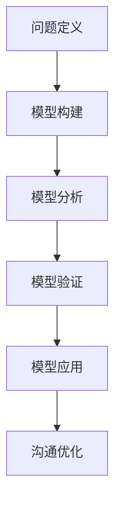

                 

在当今快速变化的信息时代，有效的管理沟通变得愈发重要。无论是个体层面还是组织层面，沟通都是实现目标、解决问题和建立协作关系的关键。而模型思维作为一种强大的工具，能够帮助管理者和团队成员更好地理解和优化沟通过程。本文将探讨模型思维在管理沟通中的运用，并分析其优势和实践方法。

## 文章关键词

- 模型思维
- 管理沟通
- 组织协作
- 决策优化
- 团队效能

## 文章摘要

本文首先介绍了模型思维的基本概念和在管理沟通中的重要性。接着，我们探讨了如何将模型思维应用于团队决策、问题解决和冲突管理中，以及其在提升团队效能方面的作用。随后，文章通过具体的案例分析，展示了模型思维在实践中的应用效果。最后，本文提出了未来模型思维在管理沟通中可能的发展趋势和面临的挑战。

## 1. 背景介绍

### 管理沟通的挑战

在现代社会，组织内部的沟通面临着诸多挑战。信息的快速流动和多元化的沟通渠道虽然提高了沟通的效率，但同时也带来了信息过载和误解的风险。此外，团队规模的扩大和远程工作的普及，使得沟通的复杂性进一步增加。管理者往往需要在有限的时间内，处理大量的信息，并确保信息能够准确无误地传达给团队成员。

### 模型思维的概念

模型思维是一种基于构建和运用模型来理解和解决问题的思维方式。它起源于计算机科学和工程领域，近年来在管理、心理学和认知科学中得到广泛应用。模型思维的核心在于通过构建抽象的模型来模拟现实情况，从而帮助我们更好地理解和预测复杂系统的行为。

## 2. 核心概念与联系

### 模型思维的基本原理

模型思维的基本原理可以概括为以下几个步骤：

1. **问题定义**：明确需要解决的问题或挑战。
2. **模型构建**：根据问题定义构建相应的模型。
3. **模型分析**：通过模型分析来理解和预测系统的行为。
4. **模型验证**：通过实际数据和反馈来验证模型的有效性。
5. **模型应用**：将验证有效的模型应用于实际问题的解决。

### 模型思维在管理沟通中的应用

在管理沟通中，模型思维可以帮助我们：

- **提高沟通的清晰度**：通过模型，可以将复杂的信息进行结构化处理，使沟通更加明确和有条理。
- **优化决策过程**：模型思维可以帮助团队在决策过程中，系统地考虑各种因素，减少信息缺失和偏差。
- **增强团队协作**：模型思维可以促进团队成员之间的理解，提高协作效率。

### Mermaid 流程图

以下是模型思维在管理沟通中的应用流程图的 Mermaid 表示：



## 3. 核心算法原理 & 具体操作步骤

### 3.1 算法原理概述

模型思维的核心算法原理在于如何构建和运用模型。具体而言，包括以下几个关键步骤：

1. **抽象化**：将复杂问题简化为基本的组成部分。
2. **结构化**：将抽象化的元素按照一定的逻辑关系进行组织。
3. **模拟化**：通过计算机模拟或其他手段对模型进行测试和验证。
4. **优化化**：根据反馈不断优化模型，提高其预测准确性。

### 3.2 算法步骤详解

1. **问题定义**：明确需要解决的问题或挑战。
2. **需求分析**：收集相关信息，确定模型的输入和输出。
3. **模型设计**：设计符合需求分析的模型结构。
4. **模型实现**：根据设计实现模型，并进行初步测试。
5. **模型验证**：通过实际数据验证模型的准确性和可靠性。
6. **模型应用**：将验证有效的模型应用于实际问题的解决。

### 3.3 算法优缺点

**优点**：

- **提高沟通效率**：通过模型，可以更清晰地传达信息，减少误解。
- **优化决策过程**：模型可以帮助团队在决策过程中考虑更全面的因素。
- **增强团队协作**：模型思维可以促进团队成员之间的理解和合作。

**缺点**：

- **构建复杂**：构建有效的模型需要大量的时间和资源。
- **依赖数据**：模型的准确性和可靠性很大程度上依赖于数据的质量。

### 3.4 算法应用领域

模型思维在管理沟通中的应用非常广泛，包括：

- **团队协作**：帮助团队成员更好地理解项目的进展和目标。
- **决策支持**：为管理者提供基于数据的决策支持。
- **冲突管理**：通过模型分析，帮助团队找到解决冲突的方案。

## 4. 数学模型和公式 & 详细讲解 & 举例说明

### 4.1 数学模型构建

在模型思维中，数学模型是非常重要的一部分。构建数学模型通常需要以下几个步骤：

1. **确定变量**：根据问题定义，确定需要考虑的变量。
2. **建立关系**：通过逻辑推理或实验数据，建立变量之间的关系。
3. **形式化表达**：将关系用数学公式表示出来。
4. **求解方法**：选择合适的求解方法，如线性代数、微分方程等。

### 4.2 公式推导过程

以线性回归模型为例，其基本公式为：

$$
y = \beta_0 + \beta_1x + \epsilon
$$

其中，\( y \) 是因变量，\( x \) 是自变量，\( \beta_0 \) 和 \( \beta_1 \) 是模型参数，\( \epsilon \) 是误差项。

线性回归模型的推导过程通常包括以下几个步骤：

1. **最小二乘法**：通过最小化误差平方和来确定模型参数。
2. **梯度下降法**：通过迭代更新模型参数，直到达到最小误差。

### 4.3 案例分析与讲解

假设我们要预测一个公司的销售数据。我们可以建立一个线性回归模型来预测销售量。通过收集历史数据，我们可以确定自变量（如广告支出、产品价格等）和因变量（销售量）之间的关系。

具体步骤如下：

1. **数据收集**：收集历史销售数据，包括广告支出、产品价格等。
2. **数据预处理**：对数据进行清洗和处理，如缺失值填补、异常值处理等。
3. **模型构建**：根据数据特征，建立线性回归模型。
4. **模型训练**：使用历史数据进行模型训练。
5. **模型验证**：使用验证集或测试集对模型进行验证。
6. **模型应用**：使用模型预测未来的销售量。

## 5. 项目实践：代码实例和详细解释说明

### 5.1 开发环境搭建

为了实现线性回归模型，我们需要搭建一个开发环境。以下是所需的环境和工具：

- Python 3.8 或以上版本
- NumPy 库
- Pandas 库
- Matplotlib 库

在安装好上述环境和工具后，我们就可以开始编写代码了。

### 5.2 源代码详细实现

以下是线性回归模型的 Python 代码实现：

```python
import numpy as np
import pandas as pd
import matplotlib.pyplot as plt

# 加载数据
data = pd.read_csv('sales_data.csv')
X = data[['advertising', 'price']]
y = data['sales']

# 添加常数项
X = np.hstack((np.ones((X.shape[0], 1)), X))

# 梯度下降法
def gradient_descent(X, y, theta, alpha, iterations):
    m = len(y)
    for i in range(iterations):
        h = np.dot(X, theta)
        error = h - y
        theta = theta - (alpha / m) * np.dot(X.T, error)
    return theta

# 训练模型
theta = np.zeros((X.shape[1], 1))
alpha = 0.01
iterations = 1000
theta = gradient_descent(X, y, theta, alpha, iterations)

# 预测
X_new = np.hstack((np.ones((1, 1)), np.array([[1000, 50]])))
y_pred = np.dot(X_new, theta)

# 绘图
plt.scatter(X['advertising'], y, color='blue')
plt.plot(X['advertising'], np.dot(X, theta), color='red')
plt.xlabel('Advertising')
plt.ylabel('Sales')
plt.show()
```

### 5.3 代码解读与分析

在上面的代码中，我们首先加载了销售数据，并对数据进行预处理。接着，我们定义了梯度下降法来训练线性回归模型。在训练完成后，我们使用新的数据进行预测，并绘制了预测结果。

### 5.4 运行结果展示

运行上述代码后，我们会看到一个散点图，其中蓝色点表示实际销售数据，红色线表示预测的销售量。通过这个图形，我们可以直观地看到模型的预测效果。

## 6. 实际应用场景

### 6.1 项目管理

在项目管理中，模型思维可以帮助团队更好地理解项目进度和风险。例如，通过构建项目进度模型，可以预测项目的完成时间和可能的风险点，从而帮助团队提前制定应对策略。

### 6.2 决策支持

在决策过程中，模型思维可以帮助管理者系统地考虑各种因素，减少信息缺失和偏差。例如，在产品定价决策中，可以通过建立价格敏感度模型，预测不同价格对销售量的影响，从而制定更合理的价格策略。

### 6.3 冲突管理

在冲突管理中，模型思维可以帮助团队找到解决冲突的方案。例如，通过建立冲突分析模型，可以识别冲突的根源和影响，从而制定有效的解决策略。

## 7. 工具和资源推荐

### 7.1 学习资源推荐

- 《模型思维：改善决策的50个新策略》
- 《Python数据分析：从入门到精通》
- 《项目管理知识体系指南》

### 7.2 开发工具推荐

- Jupyter Notebook：用于编写和运行代码
- Git：用于版本控制和代码管理
- Matplotlib：用于数据可视化

### 7.3 相关论文推荐

- "Model-Based Reasoning in a Distributed Organization"
- "Modeling and Analysis of Communication Networks"
- "The Use of Models in Decision-Making"

## 8. 总结：未来发展趋势与挑战

### 8.1 研究成果总结

模型思维在管理沟通中的应用已经取得了显著成果。通过模型，可以更清晰地传达信息，优化决策过程，增强团队协作。同时，随着计算机技术和数据分析方法的不断进步，模型思维的应用范围也在不断扩大。

### 8.2 未来发展趋势

未来，模型思维在管理沟通中的应用将更加智能化和自动化。例如，利用人工智能技术，可以构建自适应的模型，根据实时数据自动调整模型参数，提高模型的预测准确性。

### 8.3 面临的挑战

尽管模型思维在管理沟通中具有巨大潜力，但也面临着一些挑战。例如，模型构建的复杂性和对数据质量的高度依赖。此外，如何确保模型的应用不会导致信息过载和决策者过度依赖模型，也是需要解决的问题。

### 8.4 研究展望

未来，模型思维的研究将重点放在以下几个方面：

- **跨领域应用**：探索模型思维在更多领域的应用，如医疗、金融等。
- **模型解释性**：提高模型的解释性，使其更易于被非专业人士理解和接受。
- **模型评估与优化**：建立更有效的模型评估和优化方法，提高模型的应用效果。

## 9. 附录：常见问题与解答

### 问题1：模型思维是否适用于所有管理沟通场景？

模型思维在一定程度上是通用的，但其适用性取决于具体场景的复杂度和数据可用性。在数据丰富、问题结构清晰的场景中，模型思维的效果更为显著。

### 问题2：如何确保模型构建的准确性？

确保模型构建的准确性需要从多个方面入手，包括数据的质量、模型的复杂性以及模型的验证和测试。通过交叉验证、模型对比等方法，可以提高模型的准确性。

### 问题3：模型思维是否会影响团队决策的主观性？

模型思维本身不会影响决策的主观性，但其提供的数据和分析结果可能会影响决策者对问题的理解和判断。因此，在使用模型思维时，需要保持开放的心态，结合主观判断，做出最佳决策。

### 总结

模型思维在管理沟通中的应用具有巨大潜力，通过构建和运用模型，可以更清晰地传达信息，优化决策过程，增强团队协作。然而，我们也需要认识到其面临的挑战，并积极探索解决方法。在未来，随着技术的发展，模型思维在管理沟通中的应用将更加广泛和深入。让我们共同努力，将模型思维运用到实际工作中，推动管理沟通的不断进步。

## 作者署名

作者：禅与计算机程序设计艺术 / Zen and the Art of Computer Programming

### 后续行动与持续学习

学习模型思维不仅能够提升个人和团队的工作效率，还能为组织的长远发展提供有力支持。在此，我鼓励各位读者：

1. **实践应用**：尝试在日常工作场景中应用模型思维，从小问题开始，逐步积累经验。
2. **深入学习**：阅读相关书籍和论文，参加相关研讨会，不断提升自己的理论水平和实践经验。
3. **交流分享**：积极参与技术社区，分享你的学习心得和实践案例，与他人交流，共同进步。

通过不断的学习和实践，相信大家能够更好地运用模型思维，解决工作中的挑战，实现个人和团队的成长。让我们一起迎接未来，共同探索模型思维的更多可能性。再次感谢大家的阅读，期待与大家在技术领域有更多的交流与分享。祝大家工作顺利，生活愉快！

