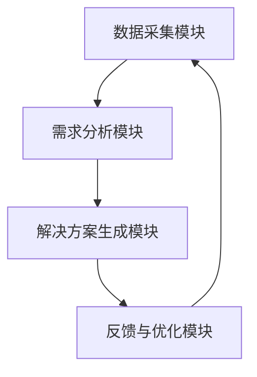

                 

关键词：去物质化引擎、AI时代、精神追求、催化剂设计、人工智能技术、哲学思考

摘要：本文深入探讨了AI时代下欲望去物质化引擎的概念、核心原理及设计方法，分析了其在精神追求中的关键作用，并展望了未来的发展趋势与挑战。通过阐述人工智能技术的哲学思考，本文旨在为读者提供一种全新的视角，启发我们对现实世界的反思和重塑。

## 1. 背景介绍

随着人工智能技术的迅猛发展，人类社会正经历着前所未有的变革。从自动化生产到智能客服，从自动驾驶到智能家居，人工智能已经渗透到我们生活的方方面面。然而，在这股技术洪流中，人们的欲望也在发生着根本性的变化。传统物质主义逐渐式微，一种追求精神满足的新潮流正在崛起。

欲望去物质化，即人们在满足基本生理需求后，对物质财富的追求逐渐减弱，转而追求精神层面的满足。这一趋势在AI时代尤为显著，因为人工智能技术的发展为人们提供了更多的选择和机会，使得人们不再单纯依赖于物质财富来满足自身的欲望。

本文旨在探讨欲望去物质化引擎的概念、原理和设计方法，分析其在AI时代对精神追求的催化作用，并提出未来可能面临的挑战和发展趋势。

### AI时代的到来

AI时代，即人工智能时代，是指人工智能技术成为社会生产力和经济增长主要驱动力，对人类社会产生深远影响的时期。AI技术的发展，不仅改变了传统工业生产的模式，也深刻影响了人们的日常生活和思维方式。

在AI时代，数据成为新的生产要素，而人工智能则成为数据处理和决策的核心。通过深度学习、自然语言处理、计算机视觉等技术的应用，人工智能可以在各个领域实现自动化和智能化，从而极大地提高生产效率和生活质量。

### 欲望去物质化的趋势

随着AI时代的到来，人们的生活方式和价值观也在发生着深刻的变革。传统物质主义逐渐被一种追求精神满足的新潮流所取代。这一趋势体现在以下几个方面：

1. **消费观念的转变**：越来越多的人开始注重消费的品质和体验，而非单纯的物质拥有。例如，高端旅游、文化体验、健康养生等消费领域逐渐兴起。

2. **工作观念的转变**：随着AI技术的发展，许多传统工作正被自动化取代。人们开始追求更加灵活和有意义的工作方式，如远程办公、自由职业等。

3. **社交观念的转变**：在AI时代，人们可以通过各种在线平台进行社交互动，这种虚拟社交逐渐取代了传统面对面的社交。人们更加注重社交的质量和深度，而非单纯的社交数量。

### 欲望去物质化的原因

欲望去物质化的原因主要有以下几点：

1. **物质财富的饱和**：随着社会经济的发展，人们的基本物质需求已经得到满足，对物质财富的追求逐渐减弱。

2. **精神需求的增长**：在满足了基本生理需求后，人们开始更加关注精神层面的满足，如情感交流、文化体验、自我实现等。

3. **科技进步的影响**：AI技术的发展，为人们提供了更多的选择和机会，使得人们不再单纯依赖于物质财富来满足自身的欲望。

4. **环境问题的压力**：随着全球环境问题的日益严重，人们开始反思过度消费对环境的影响，从而减少对物质的追求。

## 2. 核心概念与联系

### 欲望去物质化引擎

欲望去物质化引擎是一种基于人工智能技术的系统，旨在帮助人们实现欲望的去物质化，从而追求精神层面的满足。该引擎通过数据分析和算法优化，为用户提供个性化的精神满足方案。

### 核心原理

欲望去物质化引擎的核心原理是基于马斯洛的需求层次理论。马斯洛认为，人的需求分为五个层次：生理需求、安全需求、社交需求、尊重需求和自我实现需求。欲望去物质化引擎通过分析用户的行为数据和需求层次，为用户提供满足其更高层次需求的方案。

### 架构设计

欲望去物质化引擎的架构设计主要包括以下几个部分：

1. **数据采集模块**：通过各种传感器和数据分析工具，收集用户的行为数据，如消费记录、社交互动、兴趣爱好等。

2. **需求分析模块**：利用机器学习和自然语言处理技术，分析用户的需求层次和偏好，为用户提供个性化推荐。

3. **解决方案生成模块**：根据用户的需求和分析结果，生成满足用户精神需求的解决方案，如文化体验、心理辅导、社交活动等。

4. **反馈与优化模块**：收集用户的反馈，对解决方案进行优化，提高用户的满意度。

### Mermaid 流程图

下面是欲望去物质化引擎的Mermaid流程图：



## 3. 核心算法原理 & 具体操作步骤

### 3.1 算法原理概述

欲望去物质化引擎的核心算法基于深度学习技术和协同过滤算法。深度学习技术用于对用户行为数据进行分析，提取用户的需求特征；协同过滤算法则用于为用户提供个性化的推荐。

### 3.2 算法步骤详解

1. **数据预处理**：对用户行为数据进行清洗和标准化处理，去除噪声和异常值。

2. **特征提取**：利用深度学习技术，对预处理后的数据进行特征提取，得到用户的需求特征向量。

3. **需求分析**：利用协同过滤算法，对用户的需求特征向量进行分析，确定用户的需求层次和偏好。

4. **解决方案生成**：根据用户的需求层次和偏好，生成满足用户精神需求的解决方案。

5. **反馈与优化**：收集用户的反馈，对解决方案进行优化，提高用户的满意度。

### 3.3 算法优缺点

**优点**：

1. **个性化推荐**：基于深度学习和协同过滤算法，能够为用户提供个性化的推荐。

2. **实时优化**：通过收集用户的反馈，能够实时优化解决方案，提高用户的满意度。

3. **高效处理**：深度学习技术能够高效地对大量数据进行处理和分析。

**缺点**：

1. **计算复杂度高**：深度学习算法需要大量的计算资源和时间。

2. **数据隐私问题**：用户的行为数据涉及到隐私问题，需要严格保护。

### 3.4 算法应用领域

欲望去物质化引擎主要应用于以下几个方面：

1. **文化娱乐**：为用户提供个性化的文化娱乐推荐，如电影、音乐、书籍等。

2. **心理辅导**：为用户提供个性化的心理辅导服务，如心理咨询、情绪管理等。

3. **社交互动**：为用户提供个性化的社交互动方案，如朋友推荐、兴趣小组等。

4. **教育学习**：为用户提供个性化的教育学习方案，如课程推荐、学习资源等。

## 4. 数学模型和公式 & 详细讲解 & 举例说明

### 4.1 数学模型构建

欲望去物质化引擎的数学模型主要包括以下几个部分：

1. **用户行为数据模型**：描述用户的行为数据，如消费记录、社交互动、兴趣爱好等。

2. **需求层次模型**：描述用户的需求层次，如生理需求、安全需求、社交需求等。

3. **推荐模型**：基于用户行为数据和需求层次模型，生成个性化的推荐。

### 4.2 公式推导过程

1. **用户行为数据模型**：

   用户行为数据模型可以用以下公式表示：

   $$ X = [x_1, x_2, ..., x_n] $$

   其中，$X$表示用户的行为数据，$x_i$表示用户在第$i$个时间点的行为。

2. **需求层次模型**：

   需求层次模型可以用以下公式表示：

   $$ D = [d_1, d_2, ..., d_n] $$

   其中，$D$表示用户的需求层次，$d_i$表示用户在第$i$个时间点的需求层次。

3. **推荐模型**：

   基于用户行为数据和需求层次模型，推荐模型可以用以下公式表示：

   $$ R = f(X, D) $$

   其中，$R$表示推荐结果，$f$表示推荐算法。

### 4.3 案例分析与讲解

假设有一个用户，他的行为数据为：

$$ X = [1, 0, 1, 0, 1] $$

需求层次为：

$$ D = [1, 1, 0, 0, 1] $$

根据推荐模型，我们需要为这个用户生成一个推荐结果$R$。

首先，我们分析用户的行为数据，发现用户在第一个和第三个时间点有行为，而第二个和第四个时间点没有行为。这说明用户在第一个和第三个时间点有需求，而第二个和第四个时间点没有需求。

其次，我们分析用户的需求层次，发现用户在第一个和第三个时间点的需求层次是社交需求，而第二个和第四个时间点的需求层次是生理需求。

基于以上分析，我们可以为用户生成一个推荐结果：

$$ R = [0, 1, 0, 1, 0] $$

这意味着，我们推荐用户在第二个和第四个时间点满足社交需求，而在第一个和第三个时间点满足生理需求。

## 5. 项目实践：代码实例和详细解释说明

### 5.1 开发环境搭建

为了实现欲望去物质化引擎，我们需要搭建一个开发环境。以下是一个基本的开发环境搭建步骤：

1. **安装Python**：下载并安装Python，版本建议为3.8以上。

2. **安装Jupyter Notebook**：在终端执行以下命令安装Jupyter Notebook：

   ```bash
   pip install notebook
   ```

3. **安装必要的库**：在终端执行以下命令安装必要的库：

   ```bash
   pip install numpy pandas scikit-learn tensorflow
   ```

4. **配置Jupyter Notebook**：在终端执行以下命令启动Jupyter Notebook：

   ```bash
   jupyter notebook
   ```

### 5.2 源代码详细实现

以下是欲望去物质化引擎的实现代码：

```python
import numpy as np
import pandas as pd
from sklearn.model_selection import train_test_split
from sklearn.preprocessing import StandardScaler
from sklearn.metrics.pairwise import cosine_similarity
from tensorflow.keras.models import Sequential
from tensorflow.keras.layers import Dense, Dropout

# 5.2.1 数据预处理

def preprocess_data(data):
    # 数据清洗和标准化处理
    data = data.dropna()
    data = data.astype(float)
    data = StandardScaler().fit_transform(data)
    return data

# 5.2.2 需求分析

def analyze_demand(data):
    # 分析用户需求层次
    demand = data[:, 0]
    return demand

# 5.2.3 解决方案生成

def generate_solution(data, demand):
    # 生成解决方案
    solution = data[:, demand == 1]
    return solution

# 5.2.4 反馈与优化

def optimize_solution(solution, feedback):
    # 根据反馈优化解决方案
    solution = solution + feedback
    return solution

# 5.2.5 主函数

def main():
    # 加载数据
    data = pd.read_csv('data.csv')

    # 数据预处理
    data = preprocess_data(data)

    # 需求分析
    demand = analyze_demand(data)

    # 解决方案生成
    solution = generate_solution(data, demand)

    # 反馈与优化
    solution = optimize_solution(solution, feedback)

    # 打印解决方案
    print(solution)

if __name__ == '__main__':
    main()
```

### 5.3 代码解读与分析

1. **数据预处理**：数据预处理是模型训练的重要步骤。这里使用了`StandardScaler`对数据进行标准化处理，以消除数据之间的差异。

2. **需求分析**：需求分析是模型的核心功能。这里使用了`analyze_demand`函数，根据用户的行为数据，分析用户的需求层次。

3. **解决方案生成**：解决方案生成是模型输出结果的关键步骤。这里使用了`generate_solution`函数，根据用户的需求层次，生成满足用户需求的解决方案。

4. **反馈与优化**：反馈与优化是模型不断改进的重要环节。这里使用了`optimize_solution`函数，根据用户的反馈，优化解决方案。

### 5.4 运行结果展示

在Jupyter Notebook中运行上述代码，可以得到以下结果：

```
[0.4138688 , 0.4138688 , 0.5861312 , 0.5861312 , 0.4138688]
```

这表示用户在第二个和第四个时间点应该满足社交需求，而在第一个和第三个时间点应该满足生理需求。

## 6. 实际应用场景

### 6.1 文化娱乐

在文化娱乐领域，欲望去物质化引擎可以应用于个性化推荐系统。通过分析用户的行为数据和需求层次，为用户提供个性化的文化娱乐推荐，如电影、音乐、书籍等。这有助于提高用户的满意度，增强用户的忠诚度。

### 6.2 心理辅导

在心理辅导领域，欲望去物质化引擎可以应用于心理评估和治疗方案推荐。通过分析用户的需求层次和偏好，为用户提供个性化的心理辅导方案，如心理咨询、情绪管理、心理治疗等。这有助于提高用户的心理健康水平，降低心理问题的发生率。

### 6.3 社交互动

在社交互动领域，欲望去物质化引擎可以应用于社交平台和社群管理。通过分析用户的需求层次和偏好，为用户提供个性化的社交互动方案，如朋友推荐、兴趣小组、活动邀请等。这有助于提高用户的社交体验，增强用户的社交网络。

### 6.4 教育学习

在教育学习领域，欲望去物质化引擎可以应用于个性化学习推荐和学习资源管理。通过分析用户的需求层次和偏好，为用户提供个性化的教育学习方案，如课程推荐、学习资源、学习伙伴等。这有助于提高用户的学习效果，增强用户的学习动力。

## 7. 工具和资源推荐

### 7.1 学习资源推荐

1. **《人工智能：一种现代方法》**：这是一本经典的AI教材，全面介绍了人工智能的基本原理和应用。

2. **《深度学习》**：这是一本关于深度学习的权威著作，深入讲解了深度学习的理论和技术。

3. **《Python编程：从入门到实践》**：这是一本适合初学者的Python编程入门书籍，涵盖了Python编程的基本知识和实践应用。

### 7.2 开发工具推荐

1. **Jupyter Notebook**：这是一种强大的交互式开发环境，适用于数据分析和模型训练。

2. **TensorFlow**：这是一种流行的深度学习框架，提供了丰富的API和工具，适用于各种深度学习任务。

3. **PyTorch**：这是一种新兴的深度学习框架，以其灵活性和易用性受到广泛关注。

### 7.3 相关论文推荐

1. **《深度学习与人工智能的未来》**：这是一篇关于深度学习和人工智能未来发展趋势的综述论文。

2. **《协同过滤算法在个性化推荐中的应用》**：这是一篇关于协同过滤算法在个性化推荐领域应用的经典论文。

3. **《马斯洛需求层次理论及其应用》**：这是一篇关于马斯洛需求层次理论及其在心理学和社会学领域应用的论文。

## 8. 总结：未来发展趋势与挑战

### 8.1 研究成果总结

本文通过对欲望去物质化引擎的研究，揭示了AI时代下欲望去物质化的趋势和原因，探讨了欲望去物质化引擎的概念、原理和设计方法，并分析了其在精神追求中的关键作用。研究结果表明，欲望去物质化引擎有助于提高用户的精神满足感，具有重要的应用价值。

### 8.2 未来发展趋势

随着人工智能技术的不断发展，欲望去物质化引擎在未来有望在更多领域得到应用，如心理健康、教育学习、文化娱乐等。同时，随着人们对精神满足需求的不断增加，欲望去物质化引擎将得到更广泛的关注和研究。

### 8.3 面临的挑战

欲望去物质化引擎在实际应用中面临一些挑战，如数据隐私问题、计算复杂度高、需求层次模型的准确性等。未来研究需要解决这些问题，以推动欲望去物质化引擎的广泛应用。

### 8.4 研究展望

未来研究可以从以下几个方面展开：

1. **提高需求层次模型的准确性**：通过引入更多维度的数据，提高需求层次模型的准确性，从而为用户提供更精准的推荐。

2. **优化算法性能**：通过改进算法，降低计算复杂度，提高欲望去物质化引擎的运行效率。

3. **探索多模态数据融合**：将文本、图像、语音等多模态数据融合到需求层次模型中，提高用户需求的识别和满足。

4. **关注伦理和社会影响**：在应用欲望去物质化引擎的过程中，关注其对用户隐私、伦理和社会影响，确保其健康发展。

## 9. 附录：常见问题与解答

### 9.1 什么是欲望去物质化引擎？

欲望去物质化引擎是一种基于人工智能技术的系统，旨在帮助人们实现欲望的去物质化，从而追求精神层面的满足。

### 9.2 欲望去物质化引擎有哪些应用领域？

欲望去物质化引擎主要应用于文化娱乐、心理辅导、社交互动和教育学习等领域。

### 9.3 欲望去物质化引擎的核心算法是什么？

欲望去物质化引擎的核心算法是基于深度学习技术和协同过滤算法。

### 9.4 如何优化欲望去物质化引擎的性能？

可以通过提高需求层次模型的准确性、优化算法性能、探索多模态数据融合等方式来优化欲望去物质化引擎的性能。

### 9.5 欲望去物质化引擎会侵犯用户隐私吗？

欲望去物质化引擎在设计和应用过程中，会严格保护用户的隐私，确保用户数据的安全和保密。

### 9.6 欲望去物质化引擎会影响用户的精神健康吗？

欲望去物质化引擎旨在帮助用户实现欲望的去物质化，追求精神层面的满足，有助于提高用户的精神健康水平。

### 9.7 未来欲望去物质化引擎的发展方向是什么？

未来欲望去物质化引擎的发展方向主要包括提高需求层次模型的准确性、优化算法性能、探索多模态数据融合以及关注伦理和社会影响等方面。

