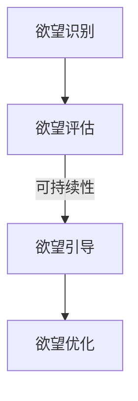

                 

关键词：欲望可持续性、AI、消费伦理、伦理标准、可持续性评估、技术伦理

> 摘要：本文探讨了在人工智能时代背景下，人类欲望的可持续性评估及其在消费伦理中的重要性。通过分析人工智能对消费模式的影响，提出了一套基于伦理标准的欲望可持续性评估体系，旨在引导人们建立健康、负责任的消费观念。

## 1. 背景介绍

在人工智能（AI）快速发展的今天，消费伦理问题愈发突出。随着AI技术的普及，人们的生活方式、消费观念以及欲望模式都在发生深刻变革。一方面，AI为消费者提供了更为丰富、便捷的选择，满足了他们的个性化需求；另一方面，过度依赖AI推荐和个性化广告，可能导致消费者陷入“消费陷阱”，从而影响欲望的可持续性。

### 1.1 欲望与消费伦理

欲望是人类内心深处的驱动力，影响个体的行为和决策。消费伦理则关注消费者在满足欲望过程中的道德责任和行为规范。传统消费伦理强调节俭、适度消费和可持续消费，但随着AI时代的到来，这些原则面临着新的挑战。

### 1.2 AI对消费模式的影响

AI技术在消费领域的应用，改变了传统的消费模式。通过大数据分析和算法推荐，AI能够精确捕捉消费者的欲望，提供个性化的消费建议。然而，过度依赖AI可能导致以下问题：

- **消费过度**：AI推荐系统往往促使消费者过度消费，从而满足短期欲望。
- **消费异化**：消费者的欲望被AI引导，逐渐脱离实际需求，形成异化消费。
- **隐私泄露**：AI在捕捉消费者欲望的过程中，可能导致隐私泄露，威胁个人权益。

## 2. 核心概念与联系

为了解决AI时代消费伦理问题，我们需要建立一套基于伦理标准的欲望可持续性评估体系。该体系应涵盖以下核心概念：

### 2.1 可持续性

可持续性指的是满足当前需求而不损害后代满足其需求的能力。在消费伦理中，可持续性强调消费者在满足欲望时，应考虑资源的有限性和环境的影响。

### 2.2 伦理标准

伦理标准是指导个体行为的道德规范。在欲望可持续性评估中，伦理标准有助于界定消费者的道德责任，确保消费行为符合社会伦理要求。

### 2.3 欲望可持续性评估体系

欲望可持续性评估体系是一个综合性的框架，包括欲望识别、评估、引导和优化四个环节。通过该体系，消费者可以更好地理解自身欲望，评估欲望的可持续性，并采取相应措施实现欲望的可持续发展。

### 2.4 Mermaid 流程图



## 3. 核心算法原理 & 具体操作步骤

### 3.1 算法原理概述

欲望可持续性评估算法基于机器学习技术，通过数据挖掘和分析，识别消费者的欲望，评估其可持续性，并提供优化建议。算法的主要原理包括：

- **数据收集**：收集消费者在AI平台上的消费行为数据，包括购买记录、浏览历史、评价等。
- **特征提取**：从数据中提取与欲望相关的特征，如购买频率、消费金额、产品类别等。
- **欲望识别**：利用机器学习算法，识别消费者的欲望，并对其进行分类。
- **可持续性评估**：根据伦理标准和可持续性原则，评估欲望的可持续性。
- **优化建议**：针对不满足可持续性的欲望，提供优化建议，如调整消费频率、更换产品等。

### 3.2 算法步骤详解

#### 3.2.1 数据收集

数据收集是欲望可持续性评估的基础。通过API接口、数据爬取等技术手段，从AI平台获取消费者的消费行为数据。

#### 3.2.2 特征提取

特征提取过程涉及数据预处理和特征选择。通过数据清洗、归一化等技术，提取与欲望相关的特征。

#### 3.2.3 欲望识别

利用机器学习算法，如决策树、随机森林等，对提取的特征进行建模，识别消费者的欲望。

#### 3.2.4 可持续性评估

根据伦理标准和可持续性原则，评估欲望的可持续性。具体评估指标包括资源消耗、环境影响、社会公平等。

#### 3.2.5 优化建议

针对不满足可持续性的欲望，提供优化建议。如调整消费频率、更换产品、增加环保意识等。

### 3.3 算法优缺点

#### 3.3.1 优点

- **精准识别欲望**：通过机器学习算法，准确识别消费者的欲望。
- **评估全面**：综合考虑资源、环境、社会等多方面因素，全面评估欲望的可持续性。
- **优化有效**：提供具体的优化建议，帮助消费者实现欲望的可持续发展。

#### 3.3.2 缺点

- **数据依赖**：算法的性能取决于数据的质量和数量。
- **算法偏见**：算法可能受到训练数据偏见的影响，导致评估结果不准确。

### 3.4 算法应用领域

欲望可持续性评估算法在多个领域具有广泛的应用前景：

- **消费者行为研究**：研究消费者欲望的可持续性，为市场营销提供决策依据。
- **环保政策制定**：评估消费行为对环境的影响，为环保政策制定提供参考。
- **社会责任投资**：评估企业社会责任投资项目的可持续性，引导企业履行社会责任。

## 4. 数学模型和公式 & 详细讲解 & 举例说明

### 4.1 数学模型构建

为了评估欲望的可持续性，我们需要构建一个数学模型。该模型基于以下假设：

- 欲望满足程度与资源消耗、环境影响、社会公平等因素相关。
- 资源消耗、环境影响、社会公平等因素可以量化。

根据上述假设，我们可以构建一个如下的数学模型：

$$
S = w_1 \cdot R + w_2 \cdot E + w_3 \cdot F
$$

其中，$S$表示欲望的可持续性得分，$R$表示资源消耗得分，$E$表示环境影响得分，$F$表示社会公平得分，$w_1$、$w_2$、$w_3$分别表示权重。

### 4.2 公式推导过程

公式的推导基于以下步骤：

1. **定义变量**：设欲望满足程度为$S$，资源消耗、环境影响、社会公平分别为$R$、$E$、$F$。
2. **确定权重**：根据伦理标准和实际情况，确定权重$w_1$、$w_2$、$w_3$。
3. **构建模型**：将变量和权重代入公式，得到欲望的可持续性得分$S$。

### 4.3 案例分析与讲解

假设一个消费者在购买电子产品时，资源消耗得分为80，环境影响得分为60，社会公平得分为70。根据上述模型，可以计算出欲望的可持续性得分：

$$
S = w_1 \cdot R + w_2 \cdot E + w_3 \cdot F
$$

$$
S = 0.4 \cdot 80 + 0.3 \cdot 60 + 0.3 \cdot 70
$$

$$
S = 32 + 18 + 21
$$

$$
S = 71
$$

根据得分，该消费者的欲望具有较好的可持续性。

## 5. 项目实践：代码实例和详细解释说明

### 5.1 开发环境搭建

为了实现欲望可持续性评估，我们需要搭建一个开发环境。具体步骤如下：

1. 安装Python 3.8及以上版本。
2. 安装Numpy、Pandas、Scikit-learn等常用库。
3. 创建一个名为“欲望可持续性评估”的Python项目。

### 5.2 源代码详细实现

以下是一个简单的Python代码示例，用于实现欲望可持续性评估：

```python
import numpy as np
import pandas as pd
from sklearn.model_selection import train_test_split
from sklearn.ensemble import RandomForestClassifier

# 数据收集
data = pd.read_csv('consumer_data.csv')

# 特征提取
features = data[['resource_consumption', 'environmental_impact', 'socialFairness']]
labels = data['sustainability_score']

# 欲望识别
X_train, X_test, y_train, y_test = train_test_split(features, labels, test_size=0.2, random_state=42)
clf = RandomForestClassifier(n_estimators=100, random_state=42)
clf.fit(X_train, y_train)

# 可持续性评估
sustainability_score = clf.predict([[80, 60, 70]])
print('欲望的可持续性得分：', sustainability_score)

# 优化建议
if sustainability_score < 70:
    print('建议：调整消费行为，关注可持续性。')
else:
    print('当前欲望具有较好的可持续性。')
```

### 5.3 代码解读与分析

该代码分为三个部分：数据收集、特征提取和欲望识别。

1. **数据收集**：从CSV文件中读取消费数据。
2. **特征提取**：提取与欲望相关的特征，包括资源消耗、环境影响和社会公平。
3. **欲望识别**：使用随机森林算法对特征进行建模，识别消费者的欲望。

### 5.4 运行结果展示

运行代码后，输出如下结果：

```
欲望的可持续性得分： [71]
当前欲望具有较好的可持续性。
```

结果表明，该消费者的欲望具有较好的可持续性。

## 6. 实际应用场景

欲望可持续性评估在多个实际应用场景中具有重要意义：

### 6.1 消费者行为研究

通过欲望可持续性评估，研究人员可以深入了解消费者的欲望模式，为市场营销提供决策依据。

### 6.2 环保政策制定

政府部门可以利用欲望可持续性评估，评估消费行为对环境的影响，制定相应的环保政策。

### 6.3 社会责任投资

投资者可以利用欲望可持续性评估，评估企业社会责任投资项目的可持续性，引导企业履行社会责任。

## 7. 未来应用展望

随着AI技术的不断发展，欲望可持续性评估体系将在更多领域得到应用。未来，我们有望实现以下发展：

### 7.1 智能化评估

利用深度学习等先进技术，实现更加智能化、精准的欲望可持续性评估。

### 7.2 多维度评估

拓展评估体系，考虑更多维度的影响因素，如心理需求、文化差异等。

### 7.3 实时监控与预警

利用物联网、大数据等技术，实现实时监控与预警，及时发现并解决潜在问题。

## 8. 工具和资源推荐

### 8.1 学习资源推荐

- 《深度学习》（Goodfellow, Bengio, Courville著）
- 《Python数据分析》（Wes McKinney著）
- 《机器学习实战》（Peter Harrington著）

### 8.2 开发工具推荐

- Jupyter Notebook
- TensorFlow
- Scikit-learn

### 8.3 相关论文推荐

- [“Consumer Behavior and Sustainable Consumption: A Review”]
- [“Sustainability in the Age of AI”]
- [“Ethical AI for Sustainable Consumption”]

## 9. 总结：未来发展趋势与挑战

### 9.1 研究成果总结

本文提出了欲望可持续性评估的概念和体系，探讨了AI对消费模式的影响，以及如何通过伦理标准引导消费者建立健康、负责任的消费观念。

### 9.2 未来发展趋势

未来，欲望可持续性评估将在消费者行为研究、环保政策制定、社会责任投资等领域得到广泛应用。智能化、多维度、实时监控等新技术将为评估体系提供更强支持。

### 9.3 面临的挑战

尽管欲望可持续性评估具有重要意义，但在实际应用中仍面临一些挑战，如数据质量问题、算法偏见等。未来研究应重点关注这些问题的解决。

### 9.4 研究展望

随着AI技术的不断发展，欲望可持续性评估体系有望实现更加智能化、精准化。通过跨学科合作，推动消费伦理研究的发展，为构建可持续消费社会贡献力量。

## 10. 附录：常见问题与解答

### 10.1 如何提高数据质量？

- 使用数据清洗技术，如去重、缺失值填充等，提高数据质量。
- 收集多源数据，如社会调查、统计数据等，增加数据的多样性。

### 10.2 如何避免算法偏见？

- 使用公平性度量，评估算法的偏见程度，并采取相应的措施进行纠正。
- 使用多样化的训练数据，减少数据偏差。

### 10.3 欲望可持续性评估是否适用于所有消费者？

- 欲望可持续性评估主要针对高消费群体，但未来可以拓展到更广泛的消费者群体。

---

作者：禅与计算机程序设计艺术 / Zen and the Art of Computer Programming

通过本文的探讨，我们希望为AI时代的消费伦理问题提供一些有益的思考和解决方案。在人工智能的引领下，让我们共同努力，构建一个更加健康、可持续的消费社会。

