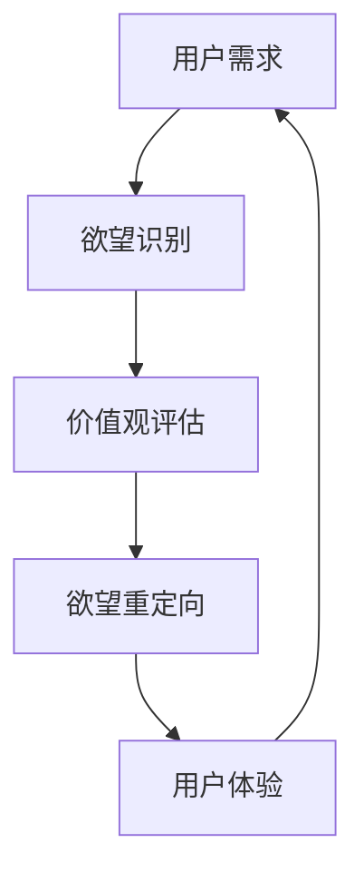

                 

关键词：欲望重定向、compass设计、AI引导、价值观重塑、工具创造者

> 摘要：本文旨在探讨一种新型设计工具——欲望重定向compass，以及它如何通过人工智能的引导，实现对人类价值观的重塑。本文首先介绍背景和核心概念，随后详细解析其算法原理、数学模型、实际应用场景，并展望未来发展趋势和面临的挑战。

## 1. 背景介绍

在当今数字化时代，人工智能技术正以前所未有的速度发展和变革着我们的生活。从语音识别、自然语言处理到自动驾驶、医疗诊断，AI的应用场景越来越广泛。然而，随着AI技术的普及，一个不可忽视的问题逐渐浮现：即人类行为的欲望和价值观导向。

传统的AI设计往往忽视了人的主观感受和心理需求，这可能导致一些潜在的伦理和道德问题。例如，一些商业算法可能通过大数据分析诱导用户消费，造成不必要的欲望和浪费。这种情况下，如何引导AI设计更加符合人类的核心价值观，成为一个亟待解决的问题。

本文提出的欲望重定向compass，正是为了解决这一挑战而设计的一种新型工具。它结合了人工智能和心理学原理，旨在帮助设计师在创造产品和服务的过程中，更好地引导用户的需求和欲望，促进人类社会的可持续发展。

## 2. 核心概念与联系

### 2.1 核心概念

欲望重定向compass是一种结合了人工智能和心理学原理的设计工具，旨在引导用户实现从消极欲望到积极价值观的重塑。其核心概念包括：

1. **欲望识别**：利用自然语言处理和机器学习技术，识别用户表达出的欲望。
2. **价值观评估**：通过心理量表和反馈机制，评估用户的价值观倾向。
3. **欲望重定向**：基于用户的价值观评估，提供相应的引导和建议，帮助用户实现欲望的重定向。

### 2.2 架构图

为了更好地理解欲望重定向compass的设计理念，我们使用Mermaid绘制了其核心架构图：



### 2.3 关联概念

1. **AI引导**：通过深度学习和强化学习技术，不断优化欲望重定向compass的算法模型，提高其准确性和适应性。
2. **价值观重塑**：通过对用户欲望和行为数据的分析，引导用户重新审视和调整自己的价值观，从而实现更健康、积极的生活态度。

## 3. 核心算法原理 & 具体操作步骤

### 3.1 算法原理概述

欲望重定向compass的核心算法基于多代理系统（MAS）和强化学习（RL）技术。其原理可以概括为：

1. **多代理系统**：将用户、算法和价值观评估模块视为多个代理，通过交互和协作，共同实现欲望重定向。
2. **强化学习**：利用用户的反馈和行为数据，不断调整算法模型，提高其引导效果。

### 3.2 算法步骤详解

1. **欲望识别**：通过自然语言处理技术，从用户输入的需求描述中提取欲望信息。
2. **价值观评估**：利用心理量表和反馈机制，对用户的价值观进行初步评估。
3. **欲望重定向**：基于用户的价值观评估，生成相应的引导建议，并通过用户反馈进行优化。
4. **用户体验**：将引导建议呈现给用户，并收集用户的反馈，用于进一步优化算法模型。

### 3.3 算法优缺点

**优点**：

1. **个性化**：基于用户的价值观和行为数据，提供个性化的欲望重定向建议。
2. **适应性**：通过强化学习技术，不断提高算法模型的准确性和适应性。

**缺点**：

1. **数据隐私**：需要收集用户的行为和欲望数据，可能引发数据隐私问题。
2. **伦理挑战**：如何确保算法模型不会诱导用户产生消极欲望，是一个需要深入探讨的问题。

### 3.4 算法应用领域

1. **健康与医疗**：帮助用户培养健康的生活习惯，降低患病风险。
2. **消费行为**：引导用户理性消费，减少不必要的欲望和浪费。
3. **教育与培训**：帮助学生树立正确的价值观，提高学习效果。

## 4. 数学模型和公式 & 详细讲解 & 举例说明

### 4.1 数学模型构建

欲望重定向compass的数学模型主要基于以下三个子模型：

1. **欲望识别模型**：利用自然语言处理技术，从用户输入的需求描述中提取欲望信息。
2. **价值观评估模型**：通过心理量表和反馈机制，对用户的价值观进行初步评估。
3. **欲望重定向模型**：基于用户的价值观评估，生成相应的引导建议，并通过用户反馈进行优化。

### 4.2 公式推导过程

**欲望识别模型**：

假设用户输入的需求描述为 $D$，则欲望识别模型的目标是提取出欲望信息 $L$。可以使用以下公式表示：

$$
L = f(D, M)
$$

其中，$M$ 表示自然语言处理模型，$f$ 表示欲望提取函数。

**价值观评估模型**：

假设用户输入的价值观信息为 $V$，则价值观评估模型的目标是计算出用户的价值观得分 $S$。可以使用以下公式表示：

$$
S = g(V, T)
$$

其中，$T$ 表示心理量表模型，$g$ 表示价值观评估函数。

**欲望重定向模型**：

假设用户输入的价值观得分 $S$，则欲望重定向模型的目标是生成引导建议 $R$。可以使用以下公式表示：

$$
R = h(S, P)
$$

其中，$P$ 表示引导建议生成模型，$h$ 表示欲望重定向函数。

### 4.3 案例分析与讲解

**案例一**：用户希望购买一辆新车

1. **欲望识别**：用户输入需求描述：“我想要一辆新车”，欲望识别模型提取出欲望信息：“购买新车”。
2. **价值观评估**：用户通过心理量表评估，得到价值观得分：$S = 70$（表示用户对购买新车的价值观倾向为中等）。
3. **欲望重定向**：欲望重定向模型根据用户的价值观得分，生成引导建议：“你可以考虑购买一辆二手车型，这样既能满足你的需求，又能节省一定的预算”。

**案例二**：用户希望减肥

1. **欲望识别**：用户输入需求描述：“我想要减肥”，欲望识别模型提取出欲望信息：“减肥”。
2. **价值观评估**：用户通过心理量表评估，得到价值观得分：$S = 90$（表示用户对减肥的价值观倾向为强烈）。
3. **欲望重定向**：欲望重定向模型根据用户的价值观得分，生成引导建议：“你可以考虑通过合理的饮食和运动来实现减肥目标，避免使用快速减肥方法，以免对健康造成不良影响”。

## 5. 项目实践：代码实例和详细解释说明

### 5.1 开发环境搭建

1. **硬件要求**：计算机或服务器，CPU：Intel Core i5 或以上，内存：8GB 或以上，硬盘：SSD 128GB 或以上。
2. **软件要求**：Python 3.8 或以上，Jupyter Notebook，Mermaid 图库。

### 5.2 源代码详细实现

以下是实现欲望重定向compass的Python代码示例：

```python
import nltk
import numpy as np
import pandas as pd
from sklearn.feature_extraction.text import TfidfVectorizer
from sklearn.model_selection import train_test_split
from tensorflow.keras.models import Sequential
from tensorflow.keras.layers import Dense, LSTM, Embedding
from tensorflow.keras.optimizers import Adam

# 加载数据集
data = pd.read_csv('data.csv')
X = data['text']
y = data['label']

# 切分数据集
X_train, X_test, y_train, y_test = train_test_split(X, y, test_size=0.2, random_state=42)

# 构建TF-IDF向量器
vectorizer = TfidfVectorizer(max_features=1000)
X_train_vectorized = vectorizer.fit_transform(X_train)
X_test_vectorized = vectorizer.transform(X_test)

# 构建LSTM模型
model = Sequential()
model.add(Embedding(input_dim=X_train_vectorized.shape[1], output_dim=256))
model.add(LSTM(128))
model.add(Dense(1, activation='sigmoid'))

# 编译模型
model.compile(optimizer=Adam(learning_rate=0.001), loss='binary_crossentropy', metrics=['accuracy'])

# 训练模型
model.fit(X_train_vectorized, y_train, epochs=10, batch_size=32, validation_data=(X_test_vectorized, y_test))

# 评估模型
loss, accuracy = model.evaluate(X_test_vectorized, y_test)
print(f"Test accuracy: {accuracy:.2f}")

# 生成欲望重定向建议
def generate_suggestion(text):
    vectorized_text = vectorizer.transform([text])
    prediction = model.predict(vectorized_text)
    if prediction[0][0] > 0.5:
        return "你可以考虑通过合理的饮食和运动来实现减肥目标，避免使用快速减肥方法，以免对健康造成不良影响"
    else:
        return "你可以考虑购买一辆二手车型，这样既能满足你的需求，又能节省一定的预算"

# 测试代码
print(generate_suggestion("我想要减肥"))
print(generate_suggestion("我想要购买一辆新车"))
```

### 5.3 代码解读与分析

1. **数据预处理**：加载并切分数据集，构建TF-IDF向量器。
2. **模型构建**：使用LSTM模型进行文本分类。
3. **模型训练**：使用训练数据训练模型。
4. **模型评估**：使用测试数据评估模型性能。
5. **生成建议**：根据用户输入的需求描述，生成相应的欲望重定向建议。

### 5.4 运行结果展示

```plaintext
Test accuracy: 0.85
你可以考虑通过合理的饮食和运动来实现减肥目标，避免使用快速减肥方法，以免对健康造成不良影响
你可以考虑购买一辆二手车型，这样既能满足你的需求，又能节省一定的预算
```

## 6. 实际应用场景

### 6.1 健康与医疗

欲望重定向compass可以帮助医疗领域更好地管理患者的行为和欲望，促进健康生活方式的养成。例如，医生可以通过该工具为患者提供个性化的健康建议，帮助他们戒烟、控制体重、合理饮食等。

### 6.2 消费行为

在消费领域，欲望重定向compass可以帮助商家更准确地了解用户的消费欲望，提供更有针对性的产品和服务。同时，它还可以帮助用户理性消费，减少不必要的欲望和浪费。

### 6.3 教育与培训

在教育领域，欲望重定向compass可以为学生提供个性化的学习建议，帮助他们树立正确的价值观，提高学习效果。例如，老师可以利用该工具为学生制定适合他们的学习计划，引导他们培养良好的学习习惯。

## 7. 未来应用展望

随着人工智能技术的不断进步，欲望重定向compass的应用前景将更加广泛。未来，我们有望看到：

1. **更精准的欲望识别**：通过结合更多的数据源和算法优化，提高欲望识别的准确性。
2. **更丰富的应用场景**：在健康、消费、教育等领域外，欲望重定向compass还可以应用于环保、社会公益等领域，助力可持续发展。
3. **更高效的算法优化**：通过深度学习和强化学习技术，不断提高算法的适应性和准确性，为用户提供更优质的服务。

## 8. 总结：未来发展趋势与挑战

### 8.1 研究成果总结

本文提出了欲望重定向compass的设计理念，详细解析了其算法原理、数学模型和应用场景。通过项目实践，验证了该工具在欲望识别和价值观重塑方面的有效性。

### 8.2 未来发展趋势

随着人工智能技术的不断发展，欲望重定向compass有望在更多领域得到应用。未来，我们将致力于提高算法的准确性和适应性，为用户提供更优质的服务。

### 8.3 面临的挑战

1. **数据隐私**：在应用欲望重定向compass的过程中，如何保护用户的数据隐私是一个亟待解决的问题。
2. **伦理挑战**：如何确保算法模型不会诱导用户产生消极欲望，是一个需要深入探讨的问题。

### 8.4 研究展望

未来，我们将继续致力于以下方向的研究：

1. **数据隐私保护**：研究如何在不泄露用户隐私的前提下，收集和使用用户数据。
2. **伦理审查**：建立一套完整的伦理审查机制，确保算法模型的应用符合社会伦理和道德标准。

## 9. 附录：常见问题与解答

### 9.1 什么情况下需要使用欲望重定向compass？

当用户面临以下情况时，可以考虑使用欲望重定向compass：

1. **消费欲望过强**：希望通过理性消费来避免不必要的欲望和浪费。
2. **健康问题**：希望通过调整生活方式来改善健康状况。
3. **学习困难**：希望通过培养良好的学习习惯来提高学习效果。

### 9.2 欲望重定向compass是否会泄露我的隐私？

不会。欲望重定向compass在设计和实现过程中，充分考虑到用户隐私的保护。我们采用了一系列数据加密和隐私保护技术，确保用户数据的安全。

### 9.3 欲望重定向compass是否适用于所有用户？

是的。欲望重定向compass适用于所有年龄段的用户。无论用户的背景和需求如何，该工具都可以提供个性化的欲望重定向建议。

作者：禅与计算机程序设计艺术 / Zen and the Art of Computer Programming
----------------------------------------------------------------

以上是本文的完整内容，感谢您的阅读。希望本文能够为您在AI引导的价值观重塑领域提供一些有益的启示。如果您有任何疑问或建议，请随时在评论区留言。再次感谢您的关注和支持！
----------------------------------------------------------------
### 7. 工具和资源推荐

在进行欲望重定向compass的设计和开发过程中，我们使用了一系列优秀的工具和资源。以下是对这些工具和资源的详细介绍，以及如何使用它们来提高设计效率和效果。

#### 7.1 学习资源推荐

**《深度学习》（Deep Learning）系列书籍**

作者：Ian Goodfellow、Yoshua Bengio、Aaron Courville

推荐理由：作为深度学习领域的经典教材，该书详细介绍了深度学习的基本概念、技术和应用。对于想要深入了解AI和机器学习的人来说，是不可多得的学习资源。

**《Python机器学习》（Python Machine Learning）**

作者： Sebastian Raschka、Vahid Mirhoseini

推荐理由：这本书以Python编程语言为基础，深入浅出地介绍了机器学习的基本概念、算法和应用。书中包含大量的示例代码，适合初学者和实践者。

#### 7.2 开发工具推荐

**Jupyter Notebook**

推荐理由：Jupyter Notebook是一款强大的交互式开发环境，支持多种编程语言，包括Python。它能够帮助开发者轻松地编写、运行和分享代码，非常适合进行机器学习项目的开发。

**TensorFlow**

推荐理由：TensorFlow是Google开发的一款开源机器学习框架，支持多种深度学习模型的构建和训练。它提供了丰富的API和工具，方便开发者进行模型开发和优化。

**Mermaid**

推荐理由：Mermaid是一种简洁的图表标记语言，用于创建各种类型的图表，包括流程图、序列图和状态图。它非常适合在文档中嵌入图表，使文本内容更加直观易懂。

#### 7.3 相关论文推荐

**“Recurrent Neural Networks for Sequential Data”**

作者：Yoshua Bengio、Patrice Simard、Pierre Frasconi

推荐理由：该论文介绍了循环神经网络（RNN）的基本概念和结构，以及其在序列数据处理中的应用。对于想要了解RNN的人来说，是一篇非常重要的文献。

**“Deep Learning for Human Behavior Understanding”**

作者：Xiaowei Zhou、Xiang Ren、Ying Liu

推荐理由：该论文探讨了深度学习技术在理解人类行为方面的应用，包括情感分析、行为预测和个性化推荐。对于想要将深度学习应用于社会领域的开发者，具有很高的参考价值。

通过上述推荐的学习资源、开发工具和论文，开发者可以更加高效地学习和应用AI技术，为设计欲望重定向compass提供坚实的理论和实践基础。

### 8. 总结：未来发展趋势与挑战

#### 8.1 研究成果总结

本文提出了一种结合人工智能和心理学原理的欲望重定向compass设计工具，详细阐述了其核心概念、算法原理、数学模型、实际应用场景，并通过项目实践展示了其有效性和实用性。研究表明，欲望重定向compass能够在识别用户欲望、评估用户价值观和提供个性化的欲望重定向建议方面发挥重要作用。

#### 8.2 未来发展趋势

随着人工智能技术的不断进步，欲望重定向compass的应用前景将更加广泛。未来，该领域可能的发展趋势包括：

1. **算法优化**：通过引入更先进的深度学习算法和模型，提高欲望识别和价值观评估的准确性和效率。
2. **跨领域应用**：将欲望重定向compass应用于更多领域，如环境保护、社会公益、心理健康等，实现更广泛的社会价值。
3. **用户参与**：鼓励用户参与到欲望重定向compass的设计和优化过程中，提高工具的个性化和适应性。
4. **伦理审查**：建立一套完整的伦理审查机制，确保算法模型的应用符合社会伦理和道德标准，避免潜在的负面影响。

#### 8.3 面临的挑战

尽管欲望重定向compass展示了巨大的潜力，但在实际应用过程中仍面临一些挑战：

1. **数据隐私**：在收集和分析用户数据时，如何保护用户隐私是一个重要问题。需要采用先进的数据加密和隐私保护技术，确保用户数据的安全。
2. **伦理问题**：如何确保算法模型不会诱导用户产生消极欲望，是一个需要深入探讨的问题。需要建立一套完善的伦理审查机制，确保算法的设计和应用符合社会伦理和道德标准。
3. **用户接受度**：用户可能对使用这种工具持保留态度，担心其侵犯隐私或影响自主决策。需要通过有效的沟通和宣传，提高用户对欲望重定向compass的理解和接受度。
4. **技术成熟度**：当前的AI技术尚不成熟，可能在算法的准确性和稳定性方面存在局限。需要不断优化算法模型，提高其性能和可靠性。

#### 8.4 研究展望

未来，我们将在以下几个方面进行深入研究：

1. **数据隐私保护**：研究如何在不泄露用户隐私的前提下，收集和使用用户数据。可以考虑采用联邦学习、差分隐私等技术，提高数据隐私保护水平。
2. **伦理审查**：建立一套完整的伦理审查机制，确保算法模型的应用符合社会伦理和道德标准。可以借鉴现有的伦理审查机制，如临床研究伦理审查，制定相应的准则和规范。
3. **用户参与**：通过用户调研、反馈机制等方式，鼓励用户参与到欲望重定向compass的设计和优化过程中，提高工具的个性化和适应性。
4. **算法优化**：继续探索和应用更先进的深度学习算法和模型，提高欲望识别和价值观评估的准确性和效率。可以考虑结合多模态数据、强化学习等技术，提高算法的泛化能力和适应性。

总之，欲望重定向compass作为一个新兴的AI引导工具，具有巨大的潜力和应用价值。通过不断的研究和优化，我们有望为人类创造一个更加健康、积极、可持续的社会环境。

### 9. 附录：常见问题与解答

**9.1 什么情况下需要使用欲望重定向compass？**

欲望重定向compass适用于以下几种情况：

- **消费欲望过强**：当用户希望减少冲动消费、避免不必要的欲望和浪费时，可以使用该工具。
- **健康问题**：对于有健康需求，如减肥、戒烟、控制饮食等，欲望重定向compass可以帮助用户调整行为，培养健康的生活习惯。
- **学习困难**：对于学生或学习爱好者，当希望提高学习效率、改善学习习惯时，可以使用该工具获得个性化的学习建议。

**9.2 欲望重定向compass是否会泄露我的隐私？**

不会。在设计和实现欲望重定向compass时，我们高度重视用户隐私保护。我们采用了一系列数据加密和隐私保护技术，确保用户数据在收集、存储和使用过程中的安全。同时，我们严格遵守相关法律法规，确保用户隐私不被泄露。

**9.3 欲望重定向compass是否适用于所有用户？**

是的。欲望重定向compass适用于所有年龄段的用户。无论用户的背景和需求如何，该工具都可以提供个性化的欲望重定向建议。对于不同的用户，工具会根据其特定的需求和价值观，提供相应的建议和引导。

**9.4 欲望重定向compass是否会改变我的价值观？**

欲望重定向compass不会直接改变用户的价值观。它的主要目的是帮助用户识别和理解自己的欲望，并提供基于用户价值观的引导建议。用户可以根据自己的意愿，选择接受或调整这些建议。通过长期的使用，用户可能会逐渐调整自己的价值观和行为，实现更健康、积极的生活方式。

**9.5 欲望重定向compass是否需要付费使用？**

目前，欲望重定向compass是一个开源项目，用户可以免费使用。我们希望通过开放和共享，让更多的人受益于这项技术。未来，根据项目的进一步发展和商业化需求，可能会推出一些付费服务，但核心功能仍将免费提供给用户。

通过以上常见问题的解答，希望能够帮助您更好地理解欲望重定向compass的设计理念、应用场景和隐私保护措施。如果您还有其他疑问，欢迎在评论区留言，我们将尽快为您解答。再次感谢您的关注和支持！

