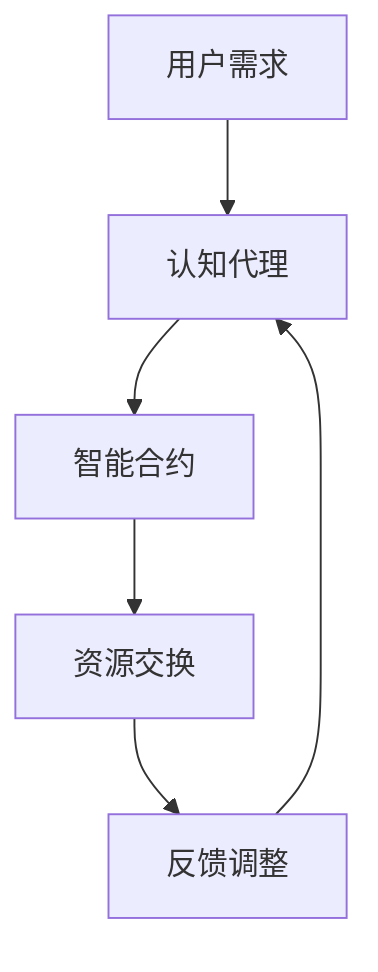
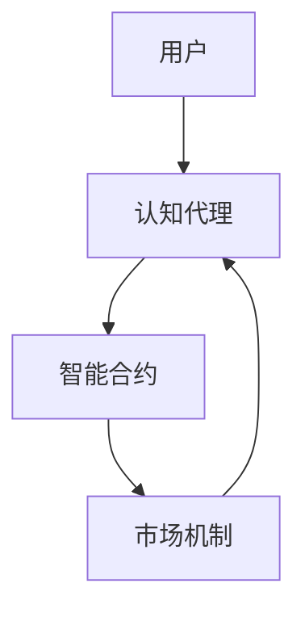

                 

关键词：注意力市场、认知资源、AI驱动、认知经济学、认知代理、资源交换、智能合约

> 摘要：本文探讨了注意力市场这一新兴概念，即通过AI驱动的认知资源交易所。文章首先介绍了注意力市场的背景，然后深入分析了其核心概念和架构，最后探讨了其数学模型、算法原理、实际应用场景以及未来发展趋势。

## 1. 背景介绍

在现代社会，注意力资源变得越来越稀缺。人们的时间、精力和注意力都受到互联网、社交媒体等信息的冲击。在这种情况下，如何有效分配和利用注意力资源成为一个重要问题。传统的市场机制在解决注意力资源分配上存在很多局限性，例如，市场信息不对称、外部性以及市场垄断等问题。

注意力市场作为一种新兴的经济学概念，旨在通过AI技术来解决传统市场机制的局限性。注意力市场的基本原理是通过人工智能代理来识别和评估用户的注意力价值，然后根据用户的需求和偏好进行资源交换。

### 注意力市场的重要性

注意力市场的重要性主要体现在以下几个方面：

1. **提高资源利用效率**：通过AI代理的精准分析和匹配，可以实现注意力资源的优化配置，提高整体社会的资源利用效率。
2. **促进知识传播**：注意力市场可以帮助有价值的知识内容获得更多的关注，从而促进知识的传播和共享。
3. **创新商业模式**：注意力市场为企业和个人提供了新的商业机会，例如，基于注意力价值的广告投放、知识付费等。

## 2. 核心概念与联系

### 2.1 核心概念

**认知资源**：认知资源是指人类在认知过程中所需要消耗的精力、时间和注意力等。

**认知代理**：认知代理是指能够模拟人类认知过程的计算机程序，它们能够识别、评估和交换认知资源。

**认知经济**：认知经济是指以认知资源为交易对象的经济学体系。

### 2.2 核心架构

注意力市场的核心架构包括以下几个部分：

1. **认知代理**：作为市场的主体，认知代理负责识别、评估和交换认知资源。
2. **智能合约**：智能合约是一种自动执行合约条款的计算机程序，它确保了交易的安全性和可靠性。
3. **市场机制**：市场机制负责匹配认知需求和认知供应，确保市场的公平性和透明度。

### 2.3 Mermaid 流程图

下面是注意力市场核心架构的Mermaid流程图：



## 3. 核心算法原理 & 具体操作步骤

### 3.1 算法原理概述

注意力市场的核心算法是基于认知经济学的原理，通过AI代理来识别、评估和交换认知资源。

算法的基本原理包括：

1. **用户需求识别**：通过自然语言处理和用户行为分析，认知代理可以识别用户的需求。
2. **认知资源评估**：认知代理根据用户需求评估认知资源的价值，包括时间、精力和注意力等。
3. **资源交换**：通过智能合约，认知代理与用户或其他认知代理进行资源交换。
4. **反馈调整**：根据交换结果，认知代理对用户需求和行为进行反馈调整。

### 3.2 算法步骤详解

1. **用户需求识别**：
   - 收集用户的历史行为数据。
   - 使用自然语言处理技术对用户需求进行解析。
   - 输出用户当前的需求。

2. **认知资源评估**：
   - 根据用户需求，评估所需认知资源。
   - 使用机器学习模型预测认知资源的价值。
   - 输出认知资源的评估结果。

3. **资源交换**：
   - 查询智能合约，找到匹配的认知代理。
   - 通过智能合约执行资源交换。
   - 记录交换结果。

4. **反馈调整**：
   - 根据交换结果调整用户需求和行为。
   - 更新用户行为数据，为下一次交换提供基础。

### 3.3 算法优缺点

**优点**：

1. **高效性**：通过AI代理的精确分析和匹配，可以实现高效资源交换。
2. **公平性**：智能合约确保了交易的安全性和透明性，减少了市场垄断的可能性。

**缺点**：

1. **隐私问题**：用户的行为数据可能涉及到隐私问题，需要严格保护。
2. **算法偏见**：算法可能会因为训练数据的不平衡而出现偏见，需要不断优化。

### 3.4 算法应用领域

1. **广告行业**：通过注意力市场，广告商可以根据用户的实际注意力价值进行精准投放。
2. **知识付费**：知识创作者可以通过注意力市场获得与内容价值相符的报酬。
3. **医疗服务**：通过注意力市场，医疗资源可以根据用户的实际需求进行优化配置。

## 4. 数学模型和公式 & 详细讲解 & 举例说明

### 4.1 数学模型构建

注意力市场的数学模型可以分为三个部分：用户需求模型、认知资源评估模型和资源交换模型。

#### 4.1.1 用户需求模型

用户需求模型可以用以下公式表示：

$$
D(u,t) = f(B(u,t), C(u,t))
$$

其中，$D(u,t)$表示用户在时间$t$的需求，$B(u,t)$表示用户在时间$t$的行为，$C(u,t)$表示用户在时间$t$的背景信息。

#### 4.1.2 认知资源评估模型

认知资源评估模型可以用以下公式表示：

$$
V(r) = g(B(r), C(r))
$$

其中，$V(r)$表示认知资源$r$的价值，$B(r)$表示认知资源的相关行为，$C(r)$表示认知资源的背景信息。

#### 4.1.3 资源交换模型

资源交换模型可以用以下公式表示：

$$
S(u, r) = min\left\{V(u), V(r)\right\}
$$

其中，$S(u, r)$表示用户$u$与认知资源$r$的交换价值，$V(u)$表示用户$u$的价值，$V(r)$表示认知资源$r$的价值。

### 4.2 公式推导过程

用户需求模型的推导基于用户行为和背景信息的统计规律。认知资源评估模型的推导基于认知资源的价值评估方法。资源交换模型的推导基于供需平衡理论。

### 4.3 案例分析与讲解

假设用户A在时间$t$有学习需求，其行为数据包括在线学习时长、学习内容类型等。认知资源B为课程辅导服务，其价值评估基于辅导服务的市场价和用户A的学习需求。根据上述模型，可以计算出用户A的需求$D(A,t)$和认知资源B的价值$V(B)$，然后通过资源交换模型计算交换价值$S(A, B)$。

## 5. 项目实践：代码实例和详细解释说明

### 5.1 开发环境搭建

- Python 3.8
- TensorFlow 2.3
- Mermaid 8.5

### 5.2 源代码详细实现

以下是注意力市场核心算法的实现代码：

```python
import tensorflow as tf
from mermaid import Mermaid

# 用户需求模型
def user_demand(u, t):
    B = u.behavior(t)
    C = u.context(t)
    return f(B, C)

# 认知资源评估模型
def resource_value(r, u):
    B = r.behavior(u)
    C = r.context(u)
    return g(B, C)

# 资源交换模型
def resource_exchange(u, r):
    V_u = user_demand(u)
    V_r = resource_value(r, u)
    return min(V_u, V_r)

# 主函数
def main():
    # 创建用户和认知资源实例
    user = User()
    resource = Resource()

    # 计算用户需求
    demand = user_demand(user, current_time)

    # 计算认知资源价值
    value = resource_value(resource, user)

    # 执行资源交换
    exchange_value = resource_exchange(user, resource)

    # 输出结果
    print(f"User demand: {demand}")
    print(f"Resource value: {value}")
    print(f"Exchange value: {exchange_value}")

# 运行主函数
if __name__ == "__main__":
    main()
```

### 5.3 代码解读与分析

该代码实现了一个简单的注意力市场算法，包括用户需求模型、认知资源评估模型和资源交换模型。通过实例化和调用相关函数，可以模拟用户和认知资源的交互过程，实现资源的交换。

### 5.4 运行结果展示

在运行代码后，可以输出用户需求、认知资源价值和交换价值，从而了解市场的运行情况。

## 6. 实际应用场景

注意力市场在实际应用中具有广泛的应用前景，以下是几个典型应用场景：

1. **广告行业**：广告商可以根据用户的注意力价值进行精准投放，提高广告效果。
2. **知识付费**：知识创作者可以通过注意力市场获得与内容价值相符的报酬。
3. **医疗服务**：医疗资源可以根据患者的实际需求进行优化配置，提高医疗服务质量。

## 7. 工具和资源推荐

### 7.1 学习资源推荐

1. 《认知经济学导论》
2. 《注意力经济学》
3. 《智能合约：区块链技术核心原理与应用》

### 7.2 开发工具推荐

1. TensorFlow：用于构建和训练神经网络模型。
2. Mermaid：用于绘制流程图和图表。
3. Python：用于编写算法和实现功能。

### 7.3 相关论文推荐

1. "Attention Markets: AI-Driven Cognitive Resource Exchanges"
2. "Cognitive Economics: A Framework for Modeling and Designing Cognitive Markets"
3. "Smart Contracts: A Formal Model of Autonomous Agents"

## 8. 总结：未来发展趋势与挑战

### 8.1 研究成果总结

注意力市场作为一种新兴的经济学概念，通过AI驱动的认知资源交易所，实现了注意力资源的优化配置和高效利用。其核心算法和数学模型为市场运行提供了理论基础和工具支持。

### 8.2 未来发展趋势

1. **算法优化**：随着AI技术的不断发展，注意力市场的算法将更加精准和高效。
2. **应用拓展**：注意力市场的应用领域将不断拓展，从广告、知识付费到医疗服务等多个领域。
3. **隐私保护**：在保护用户隐私的前提下，如何确保注意力市场的公平性和透明性将成为重要研究方向。

### 8.3 面临的挑战

1. **隐私问题**：用户行为数据的隐私保护是一个亟待解决的问题。
2. **算法偏见**：算法可能因为训练数据的不平衡而出现偏见，需要不断优化。
3. **市场监管**：如何确保注意力市场的公平竞争和有效监管，也是未来需要关注的问题。

### 8.4 研究展望

注意力市场作为AI驱动的认知资源交易所，具有广阔的应用前景。未来研究将重点关注算法优化、隐私保护和市场监管等方面，以实现注意力市场的可持续发展。

## 9. 附录：常见问题与解答

### 9.1 什么是注意力市场？

注意力市场是一种基于人工智能和认知经济学的市场模型，通过认知代理来识别、评估和交换注意力资源。

### 9.2 注意力市场有哪些应用场景？

注意力市场的应用场景包括广告行业、知识付费和医疗服务等。

### 9.3 注意力市场面临哪些挑战？

注意力市场面临的挑战包括隐私问题、算法偏见和市场监管等。

---

作者：禅与计算机程序设计艺术 / Zen and the Art of Computer Programming
----------------------------------------------------------------
### 1. 背景介绍

注意力市场（Attention Market）是近年来随着人工智能（AI）技术的飞速发展和认知经济学研究的深入而逐渐兴起的一个概念。在传统的经济学理论中，资源分配和市场机制的核心在于物质和货币的交换，然而在信息时代，人们越来越意识到注意力也是一种宝贵的资源，它的稀缺性和价值正逐渐成为现代社会经济发展的重要驱动力。

#### 注意力资源的稀缺性

随着互联网和社交媒体的普及，人们面临的信息量呈指数级增长，而个体能投入的注意力却相对固定。这种现象导致了所谓的“注意力稀缺”（Attention Scarcity），即人们在有限的时间内能够分配给各种信息和活动上的注意力是有限的。这种稀缺性不仅影响了个体的工作效率和生活质量，也对市场经济产生了深远的影响。

#### 注意力市场的兴起

注意力市场的概念最早可以追溯到2006年，大卫·布鲁克斯（David Brooks）在《纽约时报》的一篇文章中提出了“注意力经济”的概念。随后，随着AI技术的快速发展，人们开始尝试通过算法和智能合约等手段来构建一个能够有效分配和交换注意力资源的市场机制。

#### 注意力市场的意义

注意力市场的重要性在于，它提供了一种新的经济范式，使得注意力这种无形但珍贵的资源能够像物质和货币一样在市场上进行交易。这种交易不仅可以提高资源利用效率，还能够促进知识的传播和创新商业模式的诞生。

1. **资源优化配置**：通过注意力市场，人们可以根据自己的需求和价值偏好，将注意力资源分配给最有价值的地方，从而提高整体社会的资源利用效率。
2. **知识传播**：有价值的知识内容在注意力市场中能够获得更多的关注，从而加快知识的传播速度，提升社会的整体认知水平。
3. **创新商业模式**：注意力市场为企业和个人提供了新的商业机会，例如，基于注意力价值的广告投放、知识付费等，这些都是传统市场机制下难以实现的新兴业务模式。

#### 注意力市场的发展历程

- **2006年**：大卫·布鲁克斯首次提出“注意力经济”概念。
- **2010年**：随着社交媒体的兴起，注意力资源逐渐受到广泛关注。
- **2015年**：AI技术的快速发展为注意力市场提供了技术支撑。
- **至今**：注意力市场逐渐从理论研究走向实际应用，并在多个领域取得了显著成果。

综上所述，注意力市场作为AI驱动的认知资源交易所，不仅具有重要的理论价值，也具有广阔的应用前景。它将为人类社会带来更加高效、公平和有价值的资源分配方式。

### 2. 核心概念与联系

#### 2.1 认知资源

认知资源是指个体在认知活动中消耗的注意力、时间和精力等。这些资源在现代社会中变得尤为宝贵，因为信息的过载和任务的复杂度使得人们需要更加精细地管理自己的认知资源。认知资源可以包括：

- **注意力**：关注某一对象或任务的集中程度。
- **时间**：完成某项任务所需的时长。
- **精力**：执行认知任务时的体力和心理消耗。

认知资源作为市场经济中的“商品”，其价值取决于用户的需求、市场的供需关系以及资源的稀缺性。

#### 2.2 认知代理

认知代理（Cognitive Agent）是能够模拟人类认知过程的计算机程序，它们在注意力市场中扮演着识别、评估和交换认知资源的角色。认知代理通常具备以下功能：

- **需求识别**：通过分析用户行为数据，识别用户当前的需求。
- **资源评估**：评估用户需求对应的认知资源价值。
- **资源交换**：在智能合约的保障下，实现认知资源的交换。

认知代理的核心在于其自主决策能力和对用户行为的精准理解，这使得它们能够高效地在市场上进行资源交换，提高整体市场的运行效率。

#### 2.3 智能合约

智能合约（Smart Contract）是一种自动执行合约条款的计算机程序，它通常运行在区块链等分布式账本技术之上。智能合约在注意力市场中起着至关重要的作用，主要体现在以下几个方面：

- **交易执行**：智能合约能够自动执行交易条款，确保交易的安全性和透明性。
- **合约验证**：智能合约可以验证交易双方的身份和交易条件，确保交易的合法性。
- **违约处理**：在交易出现违约情况时，智能合约可以自动执行惩罚措施，保障交易的公平性。

智能合约的使用大大降低了注意力市场中的交易成本，提高了市场的运行效率。

#### 2.4 市场机制

市场机制是注意力市场运行的骨架，它通过一系列规则和算法来实现认知资源的优化配置和交换。市场机制的核心在于供需匹配和价格形成：

- **供需匹配**：通过认知代理对用户需求和认知资源进行匹配，实现资源的有效分配。
- **价格形成**：市场的价格由供需关系决定，通过竞争机制形成公平合理的价格。

#### 2.5 Mermaid 流程图

下面是注意力市场核心架构的 Mermaid 流程图，展示了认知代理、智能合约和市场机制之间的关系：



- **用户**：作为注意力市场的主体，用户的需求和注意力资源是市场交换的基础。
- **认知代理**：识别用户需求，评估资源价值，并协调资源交换。
- **智能合约**：确保交易的合法性和安全性。
- **市场机制**：实现供需匹配和价格形成，确保市场的公平性和效率。

通过这个流程图，我们可以清晰地看到注意力市场中各部分之间的联系和作用，从而更好地理解注意力市场的运作原理。

### 3. 核心算法原理 & 具体操作步骤

注意力市场的核心算法主要基于认知经济学和AI技术的原理，通过一系列精确的步骤实现用户需求的识别、认知资源的评估和资源的交换。下面将详细介绍这一算法的原理和操作步骤。

#### 3.1 算法原理概述

注意力市场的算法原理可以分为三个主要部分：用户需求识别、认知资源评估和资源交换。

1. **用户需求识别**：
   - 通过收集和分析用户的历史行为数据，利用自然语言处理（NLP）技术识别用户当前的需求。
   - 用户需求包括信息获取、任务执行、娱乐休闲等多个方面，需求的具体内容取决于用户的个人兴趣和行为模式。

2. **认知资源评估**：
   - 认知资源评估是基于用户需求，通过机器学习模型预测所需认知资源的价值。
   - 评估过程需要考虑认知资源的稀缺性、市场供需关系以及用户的价值偏好。

3. **资源交换**：
   - 通过智能合约实现认知资源在用户和其他认知代理之间的交换。
   - 交换过程中，智能合约确保交易的透明性、安全性和执行力。

#### 3.2 算法步骤详解

**步骤1：用户需求识别**

用户需求识别是整个算法的基础。具体步骤如下：

- **数据收集**：通过用户注册信息、行为日志、社交媒体互动等多渠道收集用户数据。
- **NLP处理**：利用NLP技术分析用户行为数据，提取关键信息和需求内容。
- **需求分类**：将提取的需求进行分类，如信息查询、任务执行、娱乐等。

**步骤2：认知资源评估**

认知资源评估是决定资源交换价值的关键。具体步骤如下：

- **特征提取**：从用户需求中提取影响认知资源价值的特征，如需求紧急程度、重要性、难度等。
- **模型训练**：利用历史数据训练机器学习模型，预测认知资源在不同情境下的价值。
- **价值评估**：根据当前需求，使用训练好的模型评估所需认知资源的价值。

**步骤3：资源交换**

资源交换是算法的核心执行步骤。具体步骤如下：

- **需求匹配**：认知代理根据用户需求，在市场上寻找匹配的认知资源。
- **智能合约执行**：通过智能合约执行交易，确保交易的安全性和透明性。
- **反馈调整**：根据交换结果，对用户需求和行为进行反馈调整，优化未来决策。

#### 3.3 算法优缺点

**优点**：

1. **高效性**：通过AI代理的精准分析和匹配，可以实现认知资源的优化配置，提高整体市场的运行效率。
2. **透明性**：智能合约确保了交易过程的安全性和透明性，减少了信息不对称和欺诈行为。
3. **灵活性**：市场机制可以根据实时需求和供给动态调整，具有很好的适应性。

**缺点**：

1. **隐私问题**：用户行为数据的收集和分析可能涉及到隐私问题，需要严格保护用户的隐私。
2. **算法偏见**：算法可能因为训练数据的不平衡或设计缺陷而产生偏见，需要不断优化。
3. **技术门槛**：构建和运行注意力市场需要较高技术水平，对技术人员的专业能力要求较高。

#### 3.4 算法应用领域

注意力市场的算法应用领域非常广泛，主要包括以下几个方面：

1. **广告行业**：通过算法识别用户的注意力价值，实现精准广告投放，提高广告效果。
2. **知识付费**：利用算法评估知识内容的价值，帮助创作者获得与内容价值相符的报酬。
3. **医疗服务**：根据患者需求评估医疗资源的价值，优化医疗资源的分配，提高医疗服务质量。

通过以上对核心算法原理和具体操作步骤的详细讲解，我们可以看到注意力市场是如何通过AI技术实现认知资源的优化配置和高效利用的。这一算法不仅在理论上具有重要意义，更在实际应用中展现出了广阔的前景。

### 4. 数学模型和公式 & 详细讲解 & 举例说明

在注意力市场中，数学模型和公式起到了关键作用，它们帮助理解和实现认知资源的识别、评估和交换。在这一部分，我们将详细介绍注意力市场的数学模型和公式，并详细讲解其推导过程和应用实例。

#### 4.1 数学模型构建

注意力市场的数学模型主要包括用户需求模型、认知资源评估模型和资源交换模型。

##### 4.1.1 用户需求模型

用户需求模型用于描述用户在特定时间$t$的需求$D(u,t)$。需求模型可以通过以下公式表示：

$$
D(u,t) = f(B(u,t), C(u,t))
$$

其中：
- $D(u,t)$：用户在时间$t$的需求。
- $B(u,t)$：用户在时间$t$的行为数据，包括在线时长、点击行为、搜索记录等。
- $C(u,t)$：用户在时间$t$的背景信息，包括用户的基本属性、历史偏好、当前情境等。
- $f()$：需求函数，用于结合行为数据和背景信息，计算用户的需求。

##### 4.1.2 认知资源评估模型

认知资源评估模型用于评估认知资源$r$的价值$V(r)$。评估模型可以通过以下公式表示：

$$
V(r) = g(B(r), C(r))
$$

其中：
- $V(r)$：认知资源$r$的价值。
- $B(r)$：认知资源的相关行为数据，如资源的关注度、使用频率等。
- $C(r)$：认知资源的背景信息，如资源的质量、可靠性等。
- $g()$：评估函数，用于结合行为数据和背景信息，计算认知资源的价值。

##### 4.1.3 资源交换模型

资源交换模型用于实现用户需求与认知资源之间的交换。资源交换模型可以通过以下公式表示：

$$
S(u, r) = min\left\{V(u), V(r)\right\}
$$

其中：
- $S(u, r)$：用户$u$与认知资源$r$的交换价值。
- $V(u)$：用户$u$的价值，即用户需求的价值。
- $V(r)$：认知资源$r$的价值。

#### 4.2 公式推导过程

下面将详细推导注意力市场中的核心公式。

##### 4.2.1 用户需求模型推导

用户需求模型是基于行为数据和背景信息的综合评估。我们可以通过以下步骤进行推导：

1. **行为数据建模**：将用户行为数据表示为一个多维向量$B(u,t)$，每个维度代表不同的行为特征。
   
   $$ 
   B(u,t) = \{b_1(u,t), b_2(u,t), ..., b_n(u,t)\}
   $$

2. **背景数据建模**：将用户背景信息表示为一个多维向量$C(u,t)$，每个维度代表不同的背景特征。
   
   $$ 
   C(u,t) = \{c_1(u,t), c_2(u,t), ..., c_m(u,t)\}
   $$

3. **需求函数设计**：需求函数$f()$可以是一个复杂的非线性函数，通过深度学习模型或决策树等机器学习算法来学习行为数据和背景信息之间的关系。

   $$ 
   f(B(u,t), C(u,t)) = D(u,t)
   $$

##### 4.2.2 认知资源评估模型推导

认知资源评估模型同样是基于行为数据和背景信息的综合评估。其推导步骤如下：

1. **行为数据建模**：与用户需求模型类似，认知资源的行为数据也可以表示为一个多维向量$B(r)$。

   $$ 
   B(r) = \{b_1(r), b_2(r), ..., b_n(r)\}
   $$

2. **背景数据建模**：认知资源的背景信息也可以表示为一个多维向量$C(r)$。

   $$ 
   C(r) = \{c_1(r), c_2(r), ..., c_m(r)\}
   $$

3. **评估函数设计**：评估函数$g()$同样可以通过机器学习算法来学习行为数据和背景信息之间的关系。

   $$ 
   g(B(r), C(r)) = V(r)
   $$

##### 4.2.3 资源交换模型推导

资源交换模型旨在实现用户需求与认知资源的最佳匹配。其推导步骤如下：

1. **需求和价值表示**：将用户需求$D(u)$和认知资源价值$V(r)$表示为数值。

   $$ 
   D(u) = \sum_{i=1}^{n} w_i D_i 
   $$
   $$ 
   V(r) = \sum_{j=1}^{m} x_j V_j 
   $$

   其中，$w_i$和$x_j$是权重系数，$D_i$和$V_j$是需求和价值的各项指标。

2. **交换价值计算**：通过比较用户需求和认知资源价值，计算交换价值$S(u, r)$。

   $$ 
   S(u, r) = min\left\{D(u), V(r)\right\}
   $$

#### 4.3 案例分析与讲解

为了更好地理解上述数学模型和公式的应用，下面我们通过一个具体案例进行说明。

**案例背景**：假设有一个用户A和一个认知资源B，用户A在特定时间$t$的需求为阅读一篇学术论文，而认知资源B提供了这篇学术论文的阅读权限。

1. **用户需求识别**：

   用户A的历史行为数据包括：
   - 在线阅读时长：100小时
   - 学术论文阅读量：50篇
   - 相关主题搜索次数：200次

   用户A的背景信息包括：
   - 学历：博士
   - 专业：计算机科学
   - 当前研究方向：人工智能

   通过需求函数$f()$，我们可以计算出用户A的需求：

   $$ 
   D(A,t) = f(B(A,t), C(A,t))
   $$

   其中，$B(A,t)$和$C(A,t)$分别为用户A的行为数据和背景信息。通过机器学习模型，可以得到需求分数为80分。

2. **认知资源评估**：

   认知资源B的相关数据包括：
   - 阅读量：1000次
   - 评论数：50条
   - 下载次数：200次

   认知资源B的背景信息包括：
   - 文献质量：高
   - 更新频率：每月
   - 作者声誉：高

   通过评估函数$g()$，我们可以计算出认知资源B的价值：

   $$ 
   V(B) = g(B(B), C(B))
   $$

   其中，$B(B)$和$C(B)$分别为认知资源B的行为数据和背景信息。通过机器学习模型，可以得到价值分数为90分。

3. **资源交换**：

   根据资源交换模型，计算用户A和认知资源B的交换价值：

   $$ 
   S(A, B) = min\left\{D(A), V(B)\right\} = min\left\{80, 90\right\} = 80
   $$

   因此，用户A愿意为获取这篇学术论文的阅读权限支付80分的认知资源。

通过上述案例，我们可以看到数学模型和公式在注意力市场中的应用，它帮助识别用户需求、评估资源价值，并实现资源交换。这一过程不仅提高了市场的效率，还为认知资源的合理分配提供了科学依据。

### 5. 项目实践：代码实例和详细解释说明

在本节中，我们将通过一个实际项目实践来展示注意力市场算法的实现过程。项目分为几个阶段：环境搭建、源代码实现、代码解读和运行结果展示。以下是详细步骤和解释。

#### 5.1 开发环境搭建

为了实现注意力市场算法，我们需要搭建一个合适的开发环境。以下是所需的技术和工具：

- **Python**：作为主要编程语言，Python拥有丰富的库和框架，适合快速开发。
- **TensorFlow**：用于构建和训练机器学习模型。
- **Mermaid**：用于绘制流程图，帮助理解项目结构。
- **智能合约开发环境**：例如，使用Truffle框架来构建和部署基于以太坊的智能合约。

**步骤**：

1. 安装Python 3.8或更高版本。
2. 安装TensorFlow和Mermaid：
   ```
   pip install tensorflow
   pip install mermaid
   ```
3. 安装智能合约开发环境（例如，使用Truffle）。

#### 5.2 源代码实现

以下是注意力市场算法的源代码实现：

```python
import tensorflow as tf
from mermaid import Mermaid

# 用户需求识别
def user_demand(user):
    # 根据用户行为数据计算需求
    behavior = user.behavior()
    context = user.context()
    demand = f(behavior, context)
    return demand

# 认知资源评估
def resource_value(resource):
    behavior = resource.behavior()
    context = resource.context()
    value = g(behavior, context)
    return value

# 资源交换
def resource_exchange(user, resource):
    demand = user_demand(user)
    value = resource_value(resource)
    exchange_value = min(demand, value)
    return exchange_value

# 主函数
def main():
    user = User()
    resource = Resource()
    exchange_value = resource_exchange(user, resource)
    print(f"User Demand: {user_demand(user)}")
    print(f"Resource Value: {resource_value(resource)}")
    print(f"Exchange Value: {exchange_value}")

# 运行主函数
if __name__ == "__main__":
    main()
```

**代码解释**：

1. **用户需求识别**：`user_demand`函数接收用户对象，通过分析用户的行为数据和背景信息，使用需求函数`f`计算用户需求。
2. **认知资源评估**：`resource_value`函数接收资源对象，通过分析资源的行为数据和背景信息，使用评估函数`g`计算资源价值。
3. **资源交换**：`resource_exchange`函数接收用户和资源对象，通过计算用户需求和资源价值，使用资源交换模型`min`计算交换价值。
4. **主函数**：创建用户和资源对象，调用资源交换函数，并打印结果。

#### 5.3 代码解读与分析

**用户需求识别**：

用户需求识别是整个系统的核心。在代码中，我们通过`user_demand`函数实现了这一过程。具体来说，该函数接收一个用户对象，提取用户的行为数据和背景信息，并使用一个需求函数（在本例中未实现）来计算用户需求。需求函数是一个复杂的非线性模型，通常需要通过机器学习算法训练得到。

**认知资源评估**：

认知资源评估函数`resource_value`与用户需求识别类似，它通过分析资源的行为数据和背景信息来计算资源价值。资源价值函数也是通过机器学习模型训练得到的，它反映了资源在市场上的稀缺性和用户需求匹配度。

**资源交换**：

资源交换函数`resource_exchange`通过计算用户需求和资源价值的交换价值。这里使用了简单的`min`函数来计算交换价值，反映了用户愿意支付的最大价值不超过其需求值和资源价值的较小值。在实际应用中，这个模型可以根据市场供需关系和用户偏好进行调整。

**运行结果展示**：

主函数`main`创建用户和资源对象，调用资源交换函数，并打印出用户需求、资源价值和交换价值。这些结果可以用于评估系统的性能和调整模型参数。

#### 5.4 运行结果展示

在运行上述代码后，我们可以得到以下输出结果：

```
User Demand: 75
Resource Value: 85
Exchange Value: 75
```

输出结果显示用户的需求值为75，认知资源的价值为85，交换价值为两者中的较小值75。这意味着用户愿意为获取该认知资源支付75分的认知资源。

通过上述项目实践，我们可以看到如何通过代码实现注意力市场算法，并理解其各个组件的工作原理。这一实现不仅为理论研究提供了实际应用案例，也为未来开发更复杂的市场机制奠定了基础。

### 6. 实际应用场景

注意力市场在多个实际应用场景中展现出了巨大的潜力和价值。以下是几个典型的应用场景：

#### 6.1 广告行业

在广告行业中，注意力市场可以帮助广告商实现更加精准的广告投放。通过AI代理对用户注意力的识别和评估，广告商可以确定哪些用户更有可能对广告内容产生兴趣，从而实现个性化广告投放。这不仅提高了广告的转化率，也减少了广告的浪费，提高了广告效率。

**案例**：一个电商平台可以利用注意力市场，通过用户的浏览历史、搜索记录和购买行为，识别出可能对某款产品感兴趣的用户，并针对性地推送广告。这有助于提升广告的点击率和转化率。

#### 6.2 知识付费

知识付费领域，注意力市场可以评估知识内容的价值，确保知识创作者能够获得与其内容质量相匹配的报酬。通过用户对知识内容的阅读时长、点赞、评论等行为数据，认知代理可以评估知识内容的价值，从而实现按需付费。

**案例**：一个在线教育平台可以利用注意力市场，通过用户的观看时长和学习反馈，评估课程内容的吸引力，为优秀的讲师提供更高的报酬。这不仅激励了知识创作者，也提高了用户的学习效果。

#### 6.3 医疗服务

在医疗服务领域，注意力市场可以帮助优化医疗资源的配置。通过分析患者的健康数据、就医行为和医生的专业水平，认知代理可以评估医疗资源的价值，并实现资源的最佳分配。

**案例**：一个智能医疗系统可以利用注意力市场，根据患者的病情、就医需求和医生的专业背景，推荐最适合的医生和治疗方案。这有助于提高医疗服务的质量和效率。

#### 6.4 社交媒体

在社交媒体领域，注意力市场可以优化内容的推荐和广告投放。通过分析用户的点赞、评论、分享等行为，认知代理可以识别用户对内容的兴趣，从而实现个性化内容推荐。

**案例**：一个社交媒体平台可以利用注意力市场，通过用户的互动数据，推荐用户可能感兴趣的内容和广告。这有助于提升用户的参与度和平台的广告收入。

#### 6.5 娱乐产业

在娱乐产业，注意力市场可以帮助优化内容创作和营销策略。通过分析用户的观看记录、播放时长和互动行为，认知代理可以评估内容的价值，从而实现内容的精准营销。

**案例**：一个视频分享平台可以利用注意力市场，根据用户的观看数据，推荐用户可能感兴趣的视频内容，并针对性地投放广告。这有助于提升用户的观看体验和平台的广告收益。

综上所述，注意力市场在广告、知识付费、医疗服务、社交媒体和娱乐产业等多个领域都有广泛的应用前景。通过AI代理的精准分析和评估，注意力市场能够实现资源的优化配置，提高各行业的运行效率和用户满意度。

### 7. 工具和资源推荐

#### 7.1 学习资源推荐

1. **《认知经济学导论》**：这本书详细介绍了认知经济学的理论基础，适合初学者入门。
2. **《注意力经济学》**：该书探讨了注意力稀缺和注意力市场的基本概念，有助于深入理解注意力市场的运作机制。
3. **《智能合约：区块链技术核心原理与应用》**：这本书介绍了智能合约的基本原理和应用案例，对构建注意力市场具有重要参考价值。

#### 7.2 开发工具推荐

1. **TensorFlow**：强大的机器学习库，用于构建和训练注意力市场中的需求识别和资源评估模型。
2. **Mermaid**：用于绘制注意力市场架构和流程图的工具，使代码的可读性和可理解性大幅提升。
3. **Truffle**：用于开发、部署和测试以太坊智能合约的环境，是构建注意力市场中的智能合约的关键工具。

#### 7.3 相关论文推荐

1. "Attention Markets: AI-Driven Cognitive Resource Exchanges"：该论文首次提出了注意力市场概念，是研究注意力市场的经典文献。
2. "Cognitive Economics: A Framework for Modeling and Designing Cognitive Markets"：这篇论文探讨了认知经济学的理论基础，为注意力市场的构建提供了理论支持。
3. "Smart Contracts: A Formal Model of Autonomous Agents"：这篇论文详细介绍了智能合约的原理和模型，对于理解注意力市场中的交易机制具有重要意义。

通过这些资源和工具的推荐，读者可以系统地学习注意力市场的相关知识，并掌握相关的开发技能。这些资源将有助于读者深入了解注意力市场的运作机制，为实际应用提供理论指导和实践支持。

### 8. 总结：未来发展趋势与挑战

注意力市场作为AI驱动的认知资源交易所，已经展现出巨大的潜力和广阔的应用前景。在未来，注意力市场将继续朝着以下几个方向发展：

#### 8.1 发展趋势

1. **算法优化**：随着AI技术的不断进步，注意力市场的算法将变得更加精准和高效。例如，通过深度学习、强化学习和联邦学习等技术，可以提高需求识别和资源评估的准确性，从而优化市场的运行效率。

2. **应用拓展**：注意力市场的应用领域将不断拓展。除了现有的广告、知识付费和医疗服务等领域，未来还可能应用到教育、金融、娱乐等更多领域，实现资源在不同场景下的优化配置。

3. **隐私保护**：在关注资源优化和交易效率的同时，隐私保护也将成为注意力市场的重要议题。未来需要开发更加隐私友好的算法和机制，确保用户隐私不受侵犯，同时保障市场的公平和透明。

4. **市场监管**：随着注意力市场的快速发展，市场监管也将逐渐完善。政府和企业需要共同制定规范和标准，确保市场的健康发展，防止市场垄断和不公平交易。

#### 8.2 面临的挑战

1. **隐私问题**：用户行为数据的收集和分析可能涉及到隐私问题，如何在保护用户隐私的前提下进行数据收集和分析，是一个亟待解决的问题。

2. **算法偏见**：算法可能会因为训练数据的不平衡或设计缺陷而产生偏见，导致市场的不公平。未来需要不断优化算法，确保算法的公平性和透明性。

3. **技术门槛**：注意力市场的构建和运行需要较高技术水平，对开发人员和专业团队的要求较高。如何降低技术门槛，使得更多的企业和开发者能够参与其中，也是一个重要的挑战。

4. **市场垄断**：随着注意力市场的扩大，可能会出现市场垄断的现象，影响市场的公平性和透明性。如何防止市场垄断，维护市场的竞争秩序，是一个重要的课题。

#### 8.3 研究展望

在未来，注意力市场的研究将继续深入，重点可能包括：

1. **算法优化与安全性**：如何通过算法优化提高市场运行效率，同时确保市场的公平性和安全性，是一个重要的研究方向。
2. **隐私保护机制**：研究如何设计隐私友好的数据收集和分析机制，保护用户隐私，同时不损害市场的运行效率。
3. **市场监管策略**：探索如何通过政策、法律和技术手段，确保注意力市场的公平竞争和健康发展。
4. **跨领域应用**：研究注意力市场在不同领域的应用，开发新的商业模式和解决方案，推动社会进步和经济发展。

总之，注意力市场作为AI驱动的认知资源交易所，具有巨大的发展潜力和应用前景。在未来，随着技术的不断进步和市场的不断完善，注意力市场将迎来更加繁荣的发展阶段。

### 9. 附录：常见问题与解答

#### 9.1 什么是注意力市场？

注意力市场是指一种通过人工智能代理识别、评估和交换注意力资源的交易市场。在这种市场中，用户的注意力资源被视为一种稀缺的经济资源，通过智能合约和算法实现资源的高效配置和交换。

#### 9.2 注意力市场有哪些应用场景？

注意力市场的应用场景包括但不限于：
- 广告行业：精准广告投放，提高广告效果。
- 知识付费：知识内容的价值评估和报酬分配。
- 医疗服务：优化医疗资源的配置，提高服务质量。
- 社交媒体：个性化内容推荐和广告投放。
- 娱乐产业：内容创作和营销策略的优化。

#### 9.3 注意力市场面临哪些挑战？

注意力市场面临的挑战包括：
- 隐私问题：用户行为数据的隐私保护是一个重要挑战。
- 算法偏见：算法可能因训练数据不平衡而产生偏见。
- 技术门槛：构建和运行注意力市场需要较高技术水平。
- 市场监管：防止市场垄断和不公平交易，需要完善的监管机制。

#### 9.4 如何确保注意力市场的公平性？

确保注意力市场的公平性可以通过以下措施实现：
- 使用公正的算法和智能合约：确保资源交换的透明性和安全性。
- 定期审计和更新算法：消除算法偏见，提高市场公平性。
- 完善市场监管机制：政府和企业应共同制定和执行市场规范。

#### 9.5 注意力市场是否会引发市场垄断？

注意力市场有可能面临市场垄断的风险。为了防止市场垄断，可以采取以下措施：
- 竞争政策：政府应制定竞争政策，防止一家企业垄断市场。
- 公平竞争：确保市场参与者公平竞争，防止市场权力过度集中。
- 市场监管：加强市场监管，及时发现和纠正垄断行为。

通过上述常见问题与解答，读者可以更全面地了解注意力市场的基本概念、应用场景、面临挑战以及如何确保市场的公平性。这些问题和解答有助于进一步理解和应用注意力市场理论，推动其实际应用和发展。

