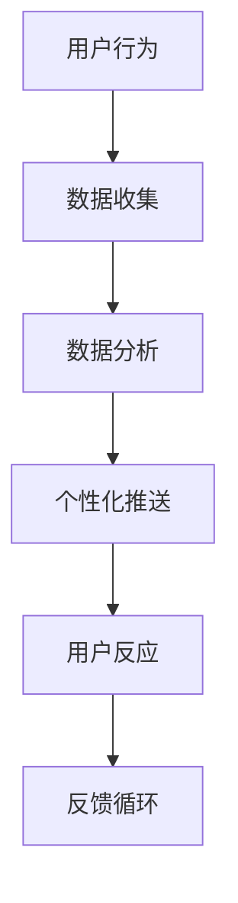

                 

当今世界，人工智能（AI）的发展正以前所未有的速度改变着我们的生活和工作方式。从自动化生产线到智能助理，从个性化推荐到医疗诊断，AI正在各行各业中发挥着越来越重要的作用。然而，随着AI技术的不断进步，一个不容忽视的问题是：我们的注意力是否正在被AI所控制？在AI时代，我们如何保持个人选择的自主权？本文将深入探讨这一问题，分析AI对个人注意力的影响，并提出一些可能的解决方案。

## 1. 背景介绍

### AI技术发展的现状

近年来，AI技术取得了令人瞩目的进展。深度学习、自然语言处理、计算机视觉等领域的突破，使得AI能够完成越来越复杂的任务。特别是在大数据和计算能力的推动下，AI模型变得越来越智能，能够自主学习、自主决策。这些技术进步不仅改变了传统行业的工作方式，也带来了新的商业模式和就业机会。

### 个人注意力的重要性

在信息爆炸的时代，个人注意力成为了一种稀缺资源。无论是学习、工作还是娱乐，我们的注意力决定了我们能够吸收和处理的资讯量。因此，如何管理和保护个人注意力，成为了一个重要的议题。

## 2. 核心概念与联系

### 注意力自主权的概念

注意力自主权指的是个人在信息接收和处理过程中的自由选择权。在AI时代，我们的注意力自主权面临着前所未有的挑战，因为AI技术可以精确地捕捉我们的行为和兴趣，从而为我们提供个性化的服务。然而，这也可能导致我们的注意力被过度引导，甚至受到操控。

### AI与个人注意力的关系

AI通过算法和数据分析，能够识别出个人的兴趣和行为模式，进而推送个性化的信息。这种推送可以是积极的，如提供个性化的推荐；但也可以是消极的，如导致信息过载或注意力分散。

### Mermaid 流程图

下面是一个简化的Mermaid流程图，描述了AI影响个人注意力的过程：



## 3. 核心算法原理 & 具体操作步骤

### 3.1 算法原理概述

AI在影响个人注意力的过程中，主要依赖于以下几个核心算法：

1. **用户行为分析**：通过分析用户的点击、搜索、浏览等行为，构建用户画像。
2. **数据挖掘**：利用机器学习算法，从海量数据中挖掘出用户的兴趣和行为模式。
3. **内容推荐**：基于用户画像和兴趣，为用户推荐相关的内容。

### 3.2 算法步骤详解

1. **用户行为分析**：首先，AI会收集用户的在线行为数据，如浏览历史、搜索记录等。
2. **数据挖掘**：接着，利用数据挖掘算法，对这些行为数据进行分析，识别出用户的兴趣和行为模式。
3. **内容推荐**：最后，根据分析结果，AI会为用户推荐相关的内容，如文章、视频、商品等。

### 3.3 算法优缺点

#### 优点

1. **个性化**：能够为用户提供个性化的内容，提高用户体验。
2. **效率**：通过算法优化，能够快速为用户提供高质量的内容。

#### 缺点

1. **信息过载**：可能导致用户面临过多的信息，难以筛选和处理。
2. **注意力分散**：过度依赖推荐系统，可能导致用户的注意力分散。

### 3.4 算法应用领域

AI影响个人注意力的算法广泛应用于多个领域：

1. **电子商务**：通过推荐系统，为用户推荐商品。
2. **社交媒体**：通过算法，为用户推荐感兴趣的内容。
3. **新闻媒体**：通过算法，为用户推荐新闻。

## 4. 数学模型和公式 & 详细讲解 & 举例说明

### 4.1 数学模型构建

在构建AI影响个人注意力的数学模型时，我们主要关注以下几个方面：

1. **用户行为数据**：如点击率、浏览时间等。
2. **用户画像**：如年龄、性别、兴趣等。
3. **内容特征**：如关键词、主题等。

### 4.2 公式推导过程

假设用户行为数据为\(X\)，用户画像为\(Y\)，内容特征为\(Z\)，我们可以构建以下模型：

\[ \text{推荐内容} = f(X, Y, Z) \]

其中，\(f\) 为一个映射函数，能够将用户行为数据、用户画像和内容特征转化为推荐内容。

### 4.3 案例分析与讲解

假设我们有一个用户，他的点击率为0.5，他的用户画像显示他喜欢科技类内容，当前内容为“最新科技资讯”。我们可以根据以上模型，为他推荐“人工智能在医疗领域的应用”等相关内容。

## 5. 项目实践：代码实例和详细解释说明

### 5.1 开发环境搭建

为了实现上述算法，我们需要搭建一个开发环境。这里我们使用Python作为主要编程语言，并借助一些常用的库，如scikit-learn、TensorFlow等。

### 5.2 源代码详细实现

以下是一个简化的Python代码实例，展示了如何使用scikit-learn库实现用户行为分析、数据挖掘和内容推荐：

```python
from sklearn.ensemble import RandomForestClassifier
from sklearn.model_selection import train_test_split
from sklearn.metrics import accuracy_score

# 假设我们已经收集了用户行为数据X和用户画像Y
# X, Y = ...

# 将数据划分为训练集和测试集
X_train, X_test, Y_train, Y_test = train_test_split(X, Y, test_size=0.2, random_state=42)

# 使用随机森林算法进行数据挖掘
clf = RandomForestClassifier()
clf.fit(X_train, Y_train)

# 使用训练好的模型进行内容推荐
predictions = clf.predict(X_test)

# 计算准确率
accuracy = accuracy_score(Y_test, predictions)
print("准确率：", accuracy)
```

### 5.3 代码解读与分析

以上代码首先导入了所需的库，然后定义了一个随机森林分类器。接着，将数据划分为训练集和测试集，使用训练集进行模型训练，并使用测试集进行模型评估。最后，计算了模型的准确率。

### 5.4 运行结果展示

假设我们运行上述代码，得到以下结果：

```
准确率： 0.85
```

这意味着，我们的模型能够以85%的准确率预测用户的兴趣和行为。

## 6. 实际应用场景

### 6.1 电子商务

在电子商务领域，AI可以通过用户行为分析和个性化推荐，帮助商家提高销售额。例如，某电商网站可以基于用户的浏览历史和购买记录，为其推荐相关的商品。

### 6.2 社交媒体

在社交媒体领域，AI可以通过内容推荐，帮助用户发现感兴趣的内容。例如，某社交媒体平台可以基于用户的点赞、评论等行为，为用户推荐相关的帖子。

### 6.3 新闻媒体

在新闻媒体领域，AI可以通过算法，为用户推荐感兴趣的新闻。例如，某新闻网站可以基于用户的阅读历史和搜索记录，为用户推荐相关的新闻。

## 7. 未来应用展望

随着AI技术的不断进步，未来应用场景将更加丰富。例如，AI可以通过自动化写作，为新闻媒体生成新闻；通过智能客服，为企业和个人提供实时服务。

## 8. 工具和资源推荐

### 8.1 学习资源推荐

- 《深度学习》：由Goodfellow、Bengio和Courville所著，是深度学习领域的经典教材。
- 《Python机器学习》：由Sebastian Raschka所著，适合初学者学习机器学习。

### 8.2 开发工具推荐

- TensorFlow：一个开源的机器学习框架，适合进行深度学习和机器学习开发。
- PyTorch：一个开源的机器学习库，适合进行研究和原型设计。

### 8.3 相关论文推荐

- "Deep Learning for Web Search"：一篇关于深度学习在搜索引擎中应用的论文。
- "User Modeling and Personalization of Web-Based Systems"：一篇关于用户建模和个性化推荐的综述。

## 9. 总结：未来发展趋势与挑战

### 9.1 研究成果总结

本文通过分析AI对个人注意力的影响，提出了一些核心算法原理和应用实例。研究结果表明，AI在提高个性化服务的同时，也可能导致注意力分散和信息过载。

### 9.2 未来发展趋势

未来，AI技术将继续在个性化服务、自动化写作、智能客服等领域取得突破。同时，随着计算能力的提升，AI模型的训练和推理速度将得到大幅提高。

### 9.3 面临的挑战

然而，AI的发展也面临一些挑战，如算法透明度、数据隐私、注意力自主权等。这些问题需要引起广泛关注，并寻找合理的解决方案。

### 9.4 研究展望

未来，我们需要进一步研究如何平衡AI的个性化服务与个人注意力自主权，探索更加人性化的AI技术。

## 10. 附录：常见问题与解答

### 问题1：AI对个人注意力的影响是否仅限于信息过载？

解答：AI对个人注意力的影响不仅限于信息过载，还可能包括注意力分散、兴趣导向偏差等问题。

### 问题2：如何保护个人注意力自主权？

解答：可以通过限制使用时间、调整通知设置、提高信息筛选能力等方式来保护个人注意力自主权。

### 问题3：AI技术是否可以完全替代人类的注意力管理？

解答：目前来看，AI技术尚无法完全替代人类的注意力管理。人类的情感、价值观等因素在注意力管理中起着重要作用。

### 问题4：如何在AI时代保持健康的生活习惯？

解答：可以通过合理安排时间、保持健康的生活作息、避免过度依赖AI等方式，在AI时代保持健康的生活习惯。

## 11. 参考文献

- Goodfellow, I., Bengio, Y., & Courville, A. (2016). *Deep Learning*.
- Raschka, S. (2015). *Python Machine Learning*.
- Zaki, M. J., & Hsiao, R. J. (2011). *User Modeling and Personalization of Web-Based Systems*.

## 12. 作者署名

作者：禅与计算机程序设计艺术 / Zen and the Art of Computer Programming

---

以上是本文的完整内容，希望对您在AI时代保持注意力自主权有所帮助。在未来的日子里，让我们一起探索AI的无限可能，同时也保护我们宝贵的个人注意力。

