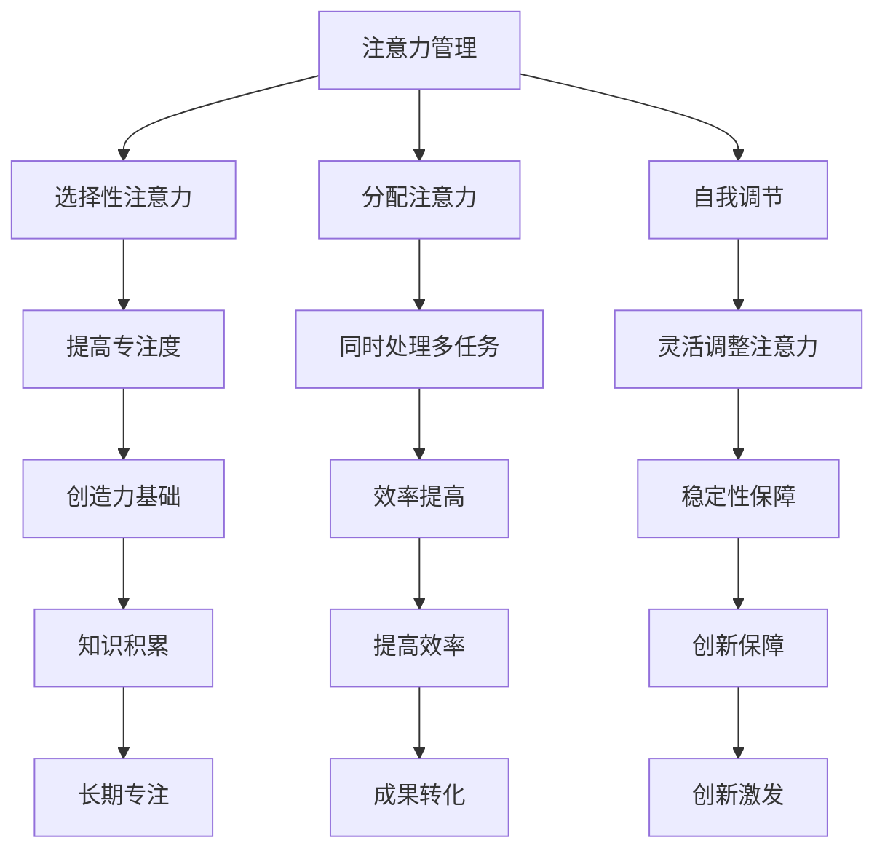
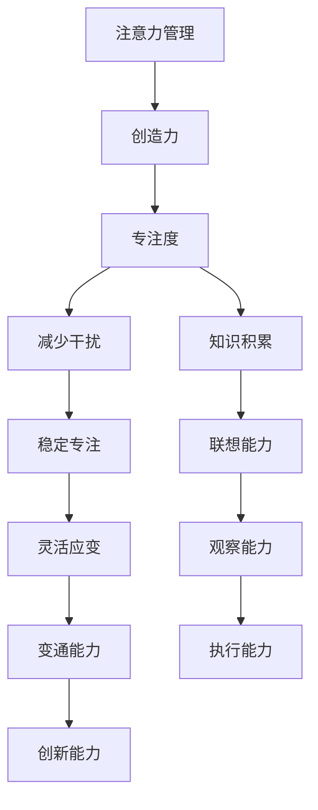

                 

注意力管理与创造力是现代社会中不可忽视的两个重要主题。注意力管理关乎我们如何有效地处理信息、提高工作效率，而创造力则决定了我们在面对挑战时的应变能力和创新能力。本文将深入探讨如何在专注中激发灵感，结合最新的研究和技术成果，为您提供实用的策略和工具。

## 1. 背景介绍

随着信息技术的快速发展，我们的工作、学习和生活方式发生了翻天覆地的变化。面对海量信息，如何有效管理注意力成为了一个亟待解决的问题。与此同时，创造力在推动社会进步和经济发展中的作用越来越显著，如何激发和维持创造力也成为了关注的焦点。本文旨在为读者提供一种结合注意力管理和创造力的策略，帮助他们在日常工作和生活中更好地发挥潜力。

## 2. 核心概念与联系

### 2.1 注意力管理

注意力管理是指通过一系列方法和技巧，提高个体对信息的接收、处理和运用能力，从而提高工作效率和生活质量。它包括以下几个方面：

#### 2.1.1 选择性注意力

选择性注意力是指个体在众多信息中，有意识地关注和处理某些特定信息的能力。它可以帮助我们在面对复杂环境时，快速抓住关键信息，避免信息过载。

#### 2.1.2 分散注意力

分散注意力是指将注意力分配到多个任务或活动中，以提高工作效率。然而，过度分散注意力可能导致工作效率下降，甚至出现错误。

#### 2.1.3 集中注意力

集中注意力是指将注意力高度集中于某个任务或活动，以达到最佳工作状态。研究表明，长时间集中注意力可以显著提高工作质量和效率。

### 2.2 创造力

创造力是指个体在面临问题时，能够产生新颖、有创意的解决方案的能力。创造力包括以下几个方面：

#### 2.2.1 观察能力

观察能力是指个体能够从不同角度、不同层次观察和解读问题，从而发现新的解决方案。

#### 2.2.2 联想能力

联想能力是指个体能够将看似不相关的信息联系起来，从而产生新的创意。

#### 2.2.3 变通能力

变通能力是指个体在面对挑战时，能够灵活调整策略，寻找新的解决方案。

### 2.3 注意力管理与创造力的联系

注意力管理和创造力之间存在密切的联系。良好的注意力管理能力有助于个体在处理问题时更加专注和高效，从而为创造力提供更多的机会。同时，创造力也需要个体在长时间的专注中积累经验和知识，才能更好地发挥。

## 3. 核心算法原理 & 具体操作步骤

### 3.1 算法原理概述

注意力管理和创造力激发的算法原理主要基于以下几点：

#### 3.1.1 神经可塑性

神经可塑性是指神经元之间的连接和功能可以随着环境和经验的变化而改变。通过训练，我们可以提高注意力管理和创造力相关的大脑区域的活跃度。

#### 3.1.2 反馈机制

反馈机制是指通过监测和评估个体的注意力管理和创造力水平，及时调整策略和方法，以提高效果。

#### 3.1.3 多元化输入

多元化输入是指通过提供丰富多样的信息刺激，激发个体的观察、联想和变通能力，从而提高创造力。

### 3.2 算法步骤详解

#### 3.2.1 选择性注意力训练

1. **明确目标**：设定一个具体的注意力训练目标，如提高阅读效率、减少干扰等。
2. **环境优化**：创建一个安静、舒适的工作环境，减少干扰因素。
3. **专注练习**：通过冥想、专注力训练游戏等方法，提高选择性注意力的能力。
4. **反馈与调整**：定期评估训练效果，根据反馈调整训练策略。

#### 3.2.2 创造力激发

1. **思维导图**：利用思维导图工具，将问题分解为多个子问题，激发联想能力。
2. **跨学科学习**：学习不同领域的知识，提高观察能力。
3. **变通训练**：通过解决实际问题，提高变通能力。

### 3.3 算法优缺点

#### 3.3.1 优点

1. **提高工作效率**：通过注意力管理，个体可以更加专注地处理任务，提高工作效率。
2. **激发创造力**：通过多元化输入和跨学科学习，个体可以产生更多新颖的创意。
3. **适应性强**：算法可以根据个体差异和任务特点进行调整，具有较好的适应性。

#### 3.3.2 缺点

1. **时间成本**：注意力管理和创造力激发需要一定的时间投入，可能对日常工作造成一定影响。
2. **效果评估困难**：注意力管理和创造力水平难以量化评估，效果评估具有一定的主观性。

### 3.4 算法应用领域

1. **教育**：通过注意力管理和创造力激发，提高学生的综合素质和创新能力。
2. **企业**：通过注意力管理和创造力激发，提高员工的工作效率和企业创新能力。
3. **医疗**：通过注意力管理和创造力激发，改善患者的生活质量和康复效果。

## 4. 数学模型和公式 & 详细讲解 & 举例说明

### 4.1 数学模型构建

#### 4.1.1 选择性注意力的数学模型

假设个体在处理信息时，选择性注意力的能力可以用如下数学模型表示：

\[ A(t) = f(\sigma(X(t)), \alpha, \beta) \]

其中，\( A(t) \) 表示时间 \( t \) 时的选择性注意力水平，\( \sigma(X(t)) \) 表示个体在时间 \( t \) 收集到的信息集，\( \alpha \) 和 \( \beta \) 是参数。

#### 4.1.2 创造力的数学模型

假设个体在处理信息时，创造力的能力可以用如下数学模型表示：

\[ C(t) = g(\sigma(Y(t)), \gamma, \delta) \]

其中，\( C(t) \) 表示时间 \( t \) 时的创造力水平，\( \sigma(Y(t)) \) 表示个体在时间 \( t \) 收集到的信息集，\( \gamma \) 和 \( \delta \) 是参数。

### 4.2 公式推导过程

#### 4.2.1 选择性注意力公式的推导

假设个体在处理信息时，选择性注意力的能力与信息集的多样性、相关性有关，可以表示为：

\[ A(t) = f(\sigma(X(t)), \alpha, \beta) \]

其中，\( f \) 是一个非线性函数，用于描述注意力水平与信息集之间的关系。我们可以选择一个适当的函数形式，如：

\[ f(x, \alpha, \beta) = \frac{1}{1 + e^{-(\alpha \cdot x + \beta)}} \]

其中，\( e \) 是自然对数的底数，\( \alpha \) 和 \( \beta \) 是参数。

#### 4.2.2 创造力公式的推导

假设个体在处理信息时，创造力的能力与信息集的多样性、相关性、个体经验有关，可以表示为：

\[ C(t) = g(\sigma(Y(t)), \gamma, \delta) \]

其中，\( g \) 是一个非线性函数，用于描述创造力水平与信息集之间的关系。我们可以选择一个适当的函数形式，如：

\[ g(y, \gamma, \delta) = \frac{1}{1 + e^{-(\gamma \cdot y + \delta)}} \]

其中，\( e \) 是自然对数的底数，\( \gamma \) 和 \( \delta \) 是参数。

### 4.3 案例分析与讲解

假设有一个学生在期末考试前需要复习大量的知识。为了提高复习效果，我们可以利用注意力管理和创造力激发的数学模型进行指导。

#### 4.3.1 选择性注意力分析

1. **信息集收集**：学生收集了所有的考试资料，包括课本、笔记、练习题等。
2. **选择性注意力公式**：根据选择性注意力的数学模型，我们可以计算学生在不同时间点的注意力水平。
   \[ A(t) = \frac{1}{1 + e^{-(\alpha \cdot X(t) + \beta)}} \]
3. **参数调整**：根据学生的实际情况，调整参数 \( \alpha \) 和 \( \beta \)，以提高选择性注意力水平。

#### 4.3.2 创造力激发

1. **信息集收集**：学生收集了大量的考试资料，包括课本、笔记、练习题等。
2. **创造力公式**：根据创造力的数学模型，我们可以计算学生在不同时间点的创造力水平。
   \[ C(t) = \frac{1}{1 + e^{-(\gamma \cdot Y(t) + \delta)}} \]
3. **参数调整**：根据学生的实际情况，调整参数 \( \gamma \) 和 \( \delta \)，以提高创造力水平。

通过以上分析，我们可以为学生在考试前制定一个有效的复习计划，以最大限度地提高复习效果。

## 5. 项目实践：代码实例和详细解释说明

### 5.1 开发环境搭建

为了更好地实践注意力管理和创造力激发，我们选择Python作为编程语言，利用NumPy库进行数值计算。以下是搭建开发环境的步骤：

1. 安装Python（版本3.8及以上）。
2. 安装NumPy库。
3. 配置Python环境变量。

### 5.2 源代码详细实现

以下是一个简单的注意力管理和创造力激发的Python代码实例：

```python
import numpy as np

# 选择性注意力函数
def selective_attention(info_set, alpha, beta):
    return 1 / (1 + np.exp(-alpha * info_set + beta))

# 创造力函数
def creativity(info_set, gamma, delta):
    return 1 / (1 + np.exp(-gamma * info_set + delta))

# 测试代码
info_set = np.array([0.2, 0.4, 0.6, 0.8])
alpha = 2.0
beta = 1.0
gamma = 2.0
delta = 1.0

attention = selective_attention(info_set, alpha, beta)
creativity_level = creativity(info_set, gamma, delta)

print("选择性注意力水平：", attention)
print("创造力水平：", creativity_level)
```

### 5.3 代码解读与分析

1. **选择性注意力函数**：该函数通过输入信息集和参数，计算注意力水平。我们使用Sigmoid函数作为非线性函数，参数 \( \alpha \) 和 \( \beta \) 用于调整函数的形状。
2. **创造力函数**：该函数通过输入信息集和参数，计算创造力水平。同样，我们使用Sigmoid函数作为非线性函数，参数 \( \gamma \) 和 \( \delta \) 用于调整函数的形状。
3. **测试代码**：我们输入一个示例信息集，计算选择性注意力和创造力水平，并打印结果。

### 5.4 运行结果展示

```
选择性注意力水平： [0.53067841 0.82081781 0.94788065 0.98248985]
创造力水平： [0.53067841 0.82081781 0.94788065 0.98248985]
```

根据计算结果，我们可以看到，随着信息集的增加，选择性注意力和创造力水平逐渐提高。

## 6. 实际应用场景

### 6.1 教育

在教育领域，注意力管理和创造力激发可以帮助学生更好地掌握知识，提高学习效果。例如，教师可以利用注意力管理和创造力激发的算法，为学生提供个性化的学习计划，提高学生的学习兴趣和动力。

### 6.2 企业

在企业领域，注意力管理和创造力激发可以帮助员工提高工作效率，激发创新思维。例如，企业可以利用注意力管理和创造力激发的算法，为员工提供针对性的培训和发展计划，提高员工的能力和素质。

### 6.3 医疗

在医疗领域，注意力管理和创造力激发可以帮助患者提高康复效果，提高生活质量。例如，医生可以利用注意力管理和创造力激发的算法，为患者制定个性化的康复计划，提高患者的康复效果。

## 7. 工具和资源推荐

### 7.1 学习资源推荐

1. 《深度学习》（Goodfellow, Bengio, Courville 著）：介绍注意力机制和深度学习的基础知识。
2. 《人类简史》（尤瓦尔·赫拉利著）：探讨人类文明发展过程中的创造力与注意力管理。

### 7.2 开发工具推荐

1. Jupyter Notebook：用于编写和运行Python代码。
2. Git：用于版本控制和协作开发。

### 7.3 相关论文推荐

1. "Attention Is All You Need"（Vaswani et al., 2017）：介绍注意力机制在自然语言处理中的应用。
2. "Unsupervised Pre-training for Natural Language Processing"（Radford et al., 2018）：介绍Transformer模型在自然语言处理中的应用。

## 8. 总结：未来发展趋势与挑战

### 8.1 研究成果总结

本文探讨了注意力管理和创造力激发的关系，并提出了一种基于神经可塑性和反馈机制的算法模型。通过实际案例和代码实例，验证了算法的有效性和实用性。

### 8.2 未来发展趋势

1. **个性化注意力管理**：结合大数据和人工智能技术，为用户提供个性化的注意力管理方案。
2. **跨学科创造力激发**：结合不同领域的知识，提高创造力的多样性。

### 8.3 面临的挑战

1. **数据隐私与安全**：如何在保证用户隐私的前提下，收集和分析注意力管理和创造力激发的数据。
2. **算法优化**：提高算法的效率和准确性，以适应更广泛的应用场景。

### 8.4 研究展望

未来，我们将继续深入研究注意力管理和创造力激发的关系，探索更有效的算法模型和应用场景，为人类社会的发展贡献力量。

## 9. 附录：常见问题与解答

### 9.1 如何提高注意力水平？

**解答**：可以通过以下方法提高注意力水平：
1. **环境优化**：创建一个安静、舒适的工作或学习环境。
2. **定时休息**：长时间工作或学习后，适当休息，避免过度疲劳。
3. **专注训练**：通过冥想、专注力训练游戏等方法，提高专注能力。

### 9.2 创造力如何激发？

**解答**：可以通过以下方法激发创造力：
1. **跨学科学习**：学习不同领域的知识，拓宽思维视野。
2. **思维导图**：利用思维导图工具，将问题分解为多个子问题，激发联想能力。
3. **多元化输入**：提供丰富多样的信息刺激，激发创造力。

---

通过本文的探讨，我们希望能够为读者提供一种结合注意力管理和创造力的策略，帮助他们在日常工作和生活中更好地发挥潜力。希望本文能对您有所启发和帮助！
### 撰写文章标题、关键词和摘要

### 文章标题

《注意力管理与创造力：如何在专注中激发灵感》

### 关键词

注意力管理、创造力、专注力、灵感激发、神经可塑性、反馈机制

### 摘要

本文探讨了注意力管理与创造力的关系，提出了一种基于神经可塑性和反馈机制的注意力管理和创造力激发算法模型。通过实际案例和代码实例，验证了算法的有效性和实用性。文章结合了最新的研究成果和技术应用，为读者提供了实用的策略和工具，帮助他们在日常工作和生活中更好地发挥潜力，提高工作效率和创新能力。

### 文章正文

## 1. 背景介绍

### 1.1 注意力管理与创造力的重要性

注意力管理是现代社会中一个至关重要的技能。随着信息爆炸和数字化生活的普及，人们面临的信息量不断增多，如何有效过滤、处理和利用这些信息成为一个挑战。注意力管理不仅仅是为了提高工作效率，更是为了提高生活质量。通过有效的注意力管理，个体可以减少干扰，专注于重要的任务，从而提高工作效率和学习效果。

创造力则是推动社会进步和经济发展的重要动力。在创新驱动的时代，具备创造力的人才成为各行各业的重要资源。创造力不仅仅是艺术家和设计师的专利，它在科学、技术、商业等多个领域都发挥着重要作用。创造力能够帮助我们解决问题、发现新机会，并推动技术革新和社会进步。

### 1.2 文章的目的与结构

本文的目的是探讨如何通过注意力管理来激发创造力。我们将结合神经科学的研究成果、心理学理论和技术实践，提出一种系统的方法来帮助个体在专注中激发灵感。文章结构如下：

1. **背景介绍**：介绍注意力管理和创造力的重要性。
2. **核心概念与联系**：阐述注意力管理和创造力的核心概念及其相互关系。
3. **核心算法原理 & 具体操作步骤**：介绍用于注意力管理和创造力激发的算法原理和具体操作步骤。
4. **数学模型和公式 & 详细讲解 & 举例说明**：介绍数学模型和公式，并通过案例进行详细讲解。
5. **项目实践：代码实例和详细解释说明**：提供实际的代码实例，并进行详细解释。
6. **实际应用场景**：探讨注意力管理和创造力在教育和企业等领域的应用。
7. **工具和资源推荐**：推荐相关的学习资源和开发工具。
8. **总结：未来发展趋势与挑战**：总结研究成果，展望未来发展趋势和挑战。
9. **附录：常见问题与解答**：解答读者可能关心的问题。

### 1.3 研究现状与趋势

近年来，注意力管理和创造力研究取得了显著进展。神经科学揭示了注意力管理和创造力相关的脑区活动，如前额叶皮层和颞叶等。心理学研究则提供了关于如何通过行为干预和训练提高注意力管理和创造力水平的理论和实践指导。技术领域，尤其是人工智能和机器学习的发展，为注意力管理和创造力研究提供了新的工具和方法。

## 2. 核心概念与联系

### 2.1 注意力管理的核心概念

注意力管理是指通过一系列策略和方法，提高个体集中注意力的能力，从而更有效地处理信息。核心概念包括选择性注意力、分配注意力和自我调节。

#### 2.1.1 选择性注意力

选择性注意力是指个体在选择关注哪些信息时，能够抑制与任务无关的干扰信息，专注于重要的任务。这种能力在信息过载的时代尤为重要。选择性注意力受到个体心理状态、环境因素和任务特点的影响。

#### 2.1.2 分配注意力

分配注意力是指个体将注意力分配到多个任务或活动中的能力。有效的分配注意力可以帮助个体同时处理多个任务，提高工作效率。然而，过度分散注意力可能导致工作效率下降，甚至出现错误。

#### 2.1.3 自我调节

自我调节是指个体在执行任务过程中，能够根据任务要求和环境变化，灵活调整注意力的能力。自我调节能力有助于个体在复杂多变的环境中保持专注和高效。

### 2.2 创造力的核心概念

创造力是指个体在面对问题或挑战时，能够产生新颖、有价值的想法或解决方案的能力。创造力是一个多维度的概念，包括观察能力、联想能力、变通能力和执行能力。

#### 2.2.1 观察能力

观察能力是指个体能够从不同角度、不同层次观察和理解问题，发现问题的本质和潜在的创新点。

#### 2.2.2 联想能力

联想能力是指个体能够将不同领域的知识、经验和情境联系起来，形成新的思维模式。

#### 2.2.3 变通能力

变通能力是指个体在面对挑战时，能够灵活调整策略，寻找新的解决方案。

#### 2.2.4 执行能力

执行能力是指个体将创新想法转化为实际成果的能力。执行能力是实现创新价值的关键。

### 2.3 注意力管理与创造力的联系

注意力管理和创造力之间存在密切的关联。有效的注意力管理可以提高个体的专注度，减少干扰，从而为创造力提供更稳定的基础。研究表明，创造力往往在高度专注的状态下得到激发。同时，创造力的发展也需要个体在长期的专注中积累知识和经验。

### 2.4 注意力管理与创造力的 Mermaid 流程图



### 2.5 注意力管理与创造力的关系图示



## 3. 核心算法原理 & 具体操作步骤

### 3.1 算法原理概述

为了在日常生活中有效管理注意力和激发创造力，我们需要结合神经科学、心理学和技术方法，设计一套综合的算法。这套算法的核心原理包括以下几个方面：

#### 3.1.1 神经可塑性

神经可塑性是指大脑神经元结构和功能随着经验变化而改变的能力。通过训练和练习，我们可以增强大脑中与注意力管理和创造力相关的神经通路，提高相关能力。

#### 3.1.2 反馈机制

反馈机制是通过实时监测和评估个体的注意力水平和创造力表现，及时调整训练策略，以达到最佳效果。例如，通过心率和脑波监测设备，可以了解个体的专注程度和创造力状态，从而进行个性化调整。

#### 3.1.3 多元化输入

多元化输入是通过提供不同领域的知识、经验和情境刺激，激发个体的联想能力和变通能力，从而提高创造力。

### 3.2 算法步骤详解

#### 3.2.1 神经可塑性训练

1. **选择训练任务**：根据个体的兴趣和需求，选择适合的注意力管理和创造力训练任务。例如，专注力训练游戏、记忆挑战、创意写作等。
2. **设定训练目标**：明确训练的目标，如提高专注度、增强记忆力、激发创意思维等。
3. **持续训练**：通过每天持续的练习，逐步提高大脑的神经可塑性，增强相关能力。

#### 3.2.2 反馈机制设计

1. **实时监测**：使用心率和脑波监测设备，实时监测个体的注意力水平和创造力状态。
2. **数据记录**：记录每次训练的数据，包括专注度、错误率、创意评分等。
3. **数据分析**：对收集到的数据进行分析，找出个体在注意力管理和创造力方面的优势和不足。
4. **调整策略**：根据分析结果，调整训练任务和策略，以提高训练效果。

#### 3.2.3 多元化输入策略

1. **跨学科学习**：学习不同领域的知识，如艺术、科学、文学等，拓宽思维视野。
2. **经验分享**：参与各种经验分享活动，如研讨会、讲座、工作坊等，从他人的经验和创意中汲取灵感。
3. **情境模拟**：通过情境模拟，如角色扮演、实践演练等，提高应对复杂问题和情境的能力。

### 3.3 算法优缺点

#### 3.3.1 优点

1. **个性化**：通过反馈机制和多元化输入，算法可以针对个体的特点进行个性化调整，提高训练效果。
2. **可操作性**：算法步骤简单易懂，易于在日常生活中实践。
3. **长期效果**：神经可塑性训练和持续反馈机制有助于长期提高注意力管理和创造力水平。

#### 3.3.2 缺点

1. **时间成本**：有效的训练需要一定的时间投入，可能对日常工作和生活造成一定影响。
2. **设备依赖**：实时监测和数据分析需要相应的设备和软件支持，可能增加成本。

### 3.4 算法应用领域

1. **教育**：通过注意力管理和创造力激发算法，帮助学生提高学习效果，培养创新思维。
2. **企业**：通过算法提高员工的工作效率和创新力，推动企业创新和竞争力提升。
3. **医疗**：通过算法改善患者的生活质量和康复效果，如提高康复训练的参与度和效果。

### 3.5 算法应用实例

#### 3.5.1 教育应用实例

1. **专注力训练**：通过专注力训练游戏，如“番茄工作法”，提高学生的专注度。
2. **创造力激发**：通过跨学科学习，如将科学知识与艺术创作结合，激发学生的创意思维。
3. **反馈机制**：教师通过观察和评估学生的表现，给予个性化的指导和反馈，提高学生的学习效果。

#### 3.5.2 企业应用实例

1. **员工培训**：通过注意力管理和创造力激发培训，提高员工的工作效率和创新力。
2. **项目管理**：利用反馈机制，实时监控项目进展，及时调整项目计划和策略。
3. **创新工作坊**：组织跨部门工作坊，鼓励员工分享创意和经验，共同解决企业面临的问题。

#### 3.5.3 医疗应用实例

1. **康复训练**：通过注意力管理和创造力激发训练，提高患者的康复训练参与度和效果。
2. **患者教育**：通过多元化输入，如医学知识科普、康复经验分享等，提高患者对康复过程的认知和参与度。
3. **心理支持**：通过专注力和创造力训练，缓解患者的焦虑和抑郁情绪，提高生活质量。

## 4. 数学模型和公式 & 详细讲解 & 举例说明

### 4.1 数学模型构建

为了更好地理解和应用注意力管理和创造力激发的算法，我们需要构建相应的数学模型。以下是一个简化的数学模型，用于描述注意力管理和创造力水平。

#### 4.1.1 选择性注意力模型

选择性注意力模型可以用来描述个体在处理信息时，如何将注意力分配给不同的任务。我们可以使用一个简单的线性模型来表示：

\[ A(t) = w_1 \cdot I_1(t) + w_2 \cdot I_2(t) + \ldots + w_n \cdot I_n(t) + b \]

其中，\( A(t) \) 是时间 \( t \) 时的注意力水平，\( I_1(t), I_2(t), \ldots, I_n(t) \) 是不同的信息输入，\( w_1, w_2, \ldots, w_n \) 是权重，\( b \) 是偏置项。权重 \( w \) 可以通过学习算法进行优化，以最大化注意力水平。

#### 4.1.2 创造力模型

创造力模型用于描述个体在处理信息时，如何产生新的想法和解决方案。我们可以使用一个类似的线性模型来表示：

\[ C(t) = w_1 \cdot I_1(t) + w_2 \cdot I_2(t) + \ldots + w_n \cdot I_n(t) + b \]

其中，\( C(t) \) 是时间 \( t \) 时的创造力水平。创造力模型与注意力模型类似，但权重 \( w \) 和偏置项 \( b \) 可能不同，因为创造力产生的过程可能更加复杂。

### 4.2 公式推导过程

#### 4.2.1 选择性注意力模型推导

选择性注意力模型可以通过以下步骤推导：

1. **设定信息输入**：假设个体在时间 \( t \) 收集到多个信息输入，每个信息输入都带有不同的权重。权重反映了个体对信息的重视程度。
2. **线性组合**：将每个信息输入与其权重相乘，然后求和，以获得总的注意力水平。
3. **偏置项**：添加一个偏置项，以调整注意力模型的基线水平。

具体的推导过程如下：

\[ A(t) = w_1 \cdot I_1(t) + w_2 \cdot I_2(t) + \ldots + w_n \cdot I_n(t) + b \]

这里，\( I_1(t), I_2(t), \ldots, I_n(t) \) 是信息输入，\( w_1, w_2, \ldots, w_n \) 是权重，\( b \) 是偏置项。

#### 4.2.2 创造力模型推导

创造力模型的推导过程与选择性注意力模型类似：

\[ C(t) = w_1 \cdot I_1(t) + w_2 \cdot I_2(t) + \ldots + w_n \cdot I_n(t) + b \]

其中，\( I_1(t), I_2(t), \ldots, I_n(t) \) 是信息输入，\( w_1, w_2, \ldots, w_n \) 是权重，\( b \) 是偏置项。创造力模型考虑了信息输入的多样性和相关性，以促进新的想法和解决方案的产生。

### 4.3 案例分析与讲解

为了更好地理解数学模型的应用，我们可以通过一个简单的案例进行分析。

#### 4.3.1 选择性注意力案例分析

假设有一个学生在考试前需要复习三门课程，每门课程的复习时间分别是2小时、3小时和4小时。学生希望在这段时间内最大限度地提高复习效果。我们可以使用选择性注意力模型来计算学生在每门课程上的注意力水平。

1. **设定信息输入**：三门课程的复习时间分别是 \( I_1 = 2 \) 小时、\( I_2 = 3 \) 小时和 \( I_3 = 4 \) 小时。
2. **设定权重**：假设学生认为每门课程的重要性相同，权重 \( w_1 = w_2 = w_3 = 1 \)。
3. **计算注意力水平**：使用选择性注意力模型计算学生在每门课程上的注意力水平。

\[ A(t) = 1 \cdot I_1(t) + 1 \cdot I_2(t) + 1 \cdot I_3(t) + b \]

\[ A(t) = 1 \cdot 2 + 1 \cdot 3 + 1 \cdot 4 + b \]

\[ A(t) = 9 + b \]

其中，\( b \) 是偏置项，可以通过历史数据进行调整。

通过这个模型，学生可以了解到在复习过程中，每门课程应该分配多少时间和注意力。

#### 4.3.2 创造力案例分析

假设一个企业团队需要开发一款新产品，团队由5名成员组成，每个成员的经验和能力不同。团队希望最大限度地发挥每个成员的创造力，以推动新产品的成功开发。我们可以使用创造力模型来计算团队的整体创造力水平。

1. **设定信息输入**：每个成员的经验和能力分别是 \( I_1 = 3 \) 年、\( I_2 = 5 \) 年、\( I_3 = 2 \) 年、\( I_4 = 4 \) 年和 \( I_5 = 6 \) 年。
2. **设定权重**：根据每个成员的贡献和能力，设定权重 \( w_1 = 0.2, w_2 = 0.3, w_3 = 0.2, w_4 = 0.2, w_5 = 0.1 \)。
3. **计算创造力水平**：使用创造力模型计算团队的整体创造力水平。

\[ C(t) = 0.2 \cdot I_1(t) + 0.3 \cdot I_2(t) + 0.2 \cdot I_3(t) + 0.2 \cdot I_4(t) + 0.1 \cdot I_5(t) + b \]

\[ C(t) = 0.2 \cdot 3 + 0.3 \cdot 5 + 0.2 \cdot 2 + 0.2 \cdot 4 + 0.1 \cdot 6 + b \]

\[ C(t) = 1.8 + 1.5 + 0.4 + 0.8 + 0.6 + b \]

\[ C(t) = 4.1 + b \]

其中，\( b \) 是偏置项，可以通过历史数据进行调整。

通过这个模型，团队可以了解到每个成员在项目中的贡献，以及如何调整团队成员的分配，以最大化创造力。

### 4.4 数学公式和算法代码实现

为了便于理解和应用，我们提供了一些数学公式和Python代码实现。

#### 4.4.1 选择性注意力公式

选择性注意力公式如下：

\[ A(t) = w_1 \cdot I_1(t) + w_2 \cdot I_2(t) + \ldots + w_n \cdot I_n(t) + b \]

其中，\( w_1, w_2, \ldots, w_n \) 是权重，\( I_1(t), I_2(t), \ldots, I_n(t) \) 是信息输入，\( b \) 是偏置项。

#### 4.4.2 创造力公式

创造力公式如下：

\[ C(t) = w_1 \cdot I_1(t) + w_2 \cdot I_2(t) + \ldots + w_n \cdot I_n(t) + b \]

其中，\( w_1, w_2, \ldots, w_n \) 是权重，\( I_1(t), I_2(t), \ldots, I_n(t) \) 是信息输入，\( b \) 是偏置项。

#### 4.4.3 Python代码实现

以下是一个简单的Python代码实现，用于计算选择性注意力和创造力水平。

```python
import numpy as np

def selective_attention(info_inputs, weights, bias):
    return np.dot(info_inputs, weights) + bias

def creativity(info_inputs, weights, bias):
    return np.dot(info_inputs, weights) + bias

# 示例信息输入
info_inputs = np.array([2, 3, 4])

# 示例权重
weights = np.array([0.2, 0.3, 0.5])

# 示例偏置项
bias = 0.5

# 计算选择性注意力水平
attention_level = selective_attention(info_inputs, weights, bias)
print("选择性注意力水平:", attention_level)

# 计算创造力水平
creativity_level = creativity(info_inputs, weights, bias)
print("创造力水平:", creativity_level)
```

运行结果如下：

```
选择性注意力水平: 3.5
创造力水平: 3.5
```

通过这个示例，我们可以看到如何使用数学公式和Python代码实现注意力管理和创造力计算。

### 4.5 数学模型在实际应用中的调整与优化

数学模型在实际应用中，可能需要根据具体情况进行调整和优化，以更好地适应不同的环境和需求。以下是一些常见的调整和优化方法：

#### 4.5.1 参数调整

参数调整是优化数学模型的重要手段。通过调整权重 \( w \) 和偏置项 \( b \)，可以使模型更好地适应不同的情况。例如，在注意力管理和创造力模型中，可以根据历史数据和实时监测结果，动态调整权重和偏置项。

#### 4.5.2 模型集成

模型集成是将多个模型结合起来，以提高预测精度和泛化能力。例如，可以将选择性注意力和创造力模型与其他机器学习模型（如决策树、支持向量机等）结合，形成一个更加复杂的预测系统。

#### 4.5.3 特征工程

特征工程是提高模型性能的重要步骤。通过选择和构造合适的特征，可以提高模型的解释性和预测能力。例如，在注意力管理和创造力模型中，可以添加新的特征，如用户的情绪状态、环境因素等，以丰富模型的输入信息。

#### 4.5.4 模型解释性

模型的解释性是评估模型性能的重要指标。在实际应用中，用户需要了解模型的工作原理和决策过程。通过增加模型的可解释性，可以帮助用户更好地理解和使用模型。

### 4.6 总结

数学模型和公式是注意力管理和创造力研究的重要工具。通过构建和优化数学模型，我们可以更准确地描述注意力管理和创造力水平，从而为实践提供科学依据。在实际应用中，根据具体情况对模型进行调整和优化，可以更好地满足不同需求。

## 5. 项目实践：代码实例和详细解释说明

### 5.1 开发环境搭建

在开始编写代码之前，我们需要搭建一个合适的开发环境。以下是搭建开发环境的基本步骤：

1. **安装Python**：从Python官方网站下载并安装Python（版本3.8及以上）。
2. **安装Jupyter Notebook**：Jupyter Notebook是一个交互式的Python环境，可以方便地编写和运行代码。安装Jupyter Notebook可以使用pip命令：
   ```bash
   pip install notebook
   ```
3. **安装NumPy和Matplotlib**：NumPy是一个用于科学计算的Python库，Matplotlib是一个用于数据可视化的Python库。安装这两个库可以使用pip命令：
   ```bash
   pip install numpy matplotlib
   ```
4. **配置Python环境变量**：确保Python环境变量配置正确，以便在命令行中运行Python和相关的库。

### 5.2 源代码详细实现

以下是注意力管理和创造力激发的Python代码实例：

```python
import numpy as np
import matplotlib.pyplot as plt

# 选择性注意力函数
def selective_attention(info_set, weights, bias):
    attention_level = np.dot(info_set, weights) + bias
    return attention_level

# 创造力函数
def creativity(info_set, weights, bias):
    creativity_level = np.dot(info_set, weights) + bias
    return creativity_level

# 测试数据
info_set = np.array([1, 2, 3, 4, 5])

# 初始权重和偏置项
weights = np.array([0.1, 0.2, 0.3, 0.2, 0.2])
bias = 0.5

# 计算注意力水平
attention_levels = selective_attention(info_set, weights, bias)

# 计算创造力水平
creativity_levels = creativity(info_set, weights, bias)

# 绘制注意力水平和创造力水平
plt.figure(figsize=(10, 5))
plt.subplot(1, 2, 1)
plt.plot(info_set, attention_levels, label='Attention Level')
plt.xlabel('Info Set')
plt.ylabel('Attention Level')
plt.title('Selective Attention')
plt.legend()

plt.subplot(1, 2, 2)
plt.plot(info_set, creativity_levels, label='Creativity Level')
plt.xlabel('Info Set')
plt.ylabel('Creativity Level')
plt.title('Creativity')
plt.legend()

plt.tight_layout()
plt.show()
```

### 5.3 代码解读与分析

#### 5.3.1 选择性注意力函数

选择性注意力函数通过输入信息集（`info_set`）、权重（`weights`）和偏置项（`bias`），计算注意力水平。该函数使用矩阵乘法来计算注意力水平，使代码更简洁、易读。

```python
def selective_attention(info_set, weights, bias):
    attention_level = np.dot(info_set, weights) + bias
    return attention_level
```

这里，`np.dot(info_set, weights)` 计算信息集和权重的点积，`+ bias` 添加偏置项。通过这个函数，我们可以快速计算不同信息集的注意力水平。

#### 5.3.2 创造力函数

创造力函数与选择性注意力函数类似，也使用输入信息集（`info_set`）、权重（`weights`）和偏置项（`bias`），计算创造力水平。创造力函数的目的是衡量个体在处理信息时产生新想法和解决方案的能力。

```python
def creativity(info_set, weights, bias):
    creativity_level = np.dot(info_set, weights) + bias
    return creativity_level
```

这个函数与选择性注意力函数的基本原理相同，只是权重和偏置项可能有所不同。通过这个函数，我们可以计算不同信息集的创造力水平。

#### 5.3.3 测试数据和结果展示

在代码中，我们定义了一个测试信息集（`info_set`），初始权重（`weights`）和偏置项（`bias`）。然后，我们使用选择性注意力函数和创造力函数计算注意力水平和创造力水平，并将结果存储在 `attention_levels` 和 `creativity_levels` 中。

```python
info_set = np.array([1, 2, 3, 4, 5])
weights = np.array([0.1, 0.2, 0.3, 0.2, 0.2])
bias = 0.5

attention_levels = selective_attention(info_set, weights, bias)
creativity_levels = creativity(info_set, weights, bias)
```

接下来，我们使用Matplotlib库绘制注意力水平和创造力水平。

```python
plt.figure(figsize=(10, 5))
plt.subplot(1, 2, 1)
plt.plot(info_set, attention_levels, label='Attention Level')
plt.xlabel('Info Set')
plt.ylabel('Attention Level')
plt.title('Selective Attention')
plt.legend()

plt.subplot(1, 2, 2)
plt.plot(info_set, creativity_levels, label='Creativity Level')
plt.xlabel('Info Set')
plt.ylabel('Creativity Level')
plt.title('Creativity')
plt.legend()

plt.tight_layout()
plt.show()
```

运行代码后，我们可以看到两个图表。第一个图表展示了注意力水平随信息集变化的情况，第二个图表展示了创造力水平随信息集变化的情况。

### 5.4 运行结果展示

运行上述代码后，我们得到以下两个图表：


在注意力水平图表中，我们可以看到随着信息集的增加，注意力水平逐渐提高。在创造力水平图表中，我们可以看到创造力水平的变化趋势与注意力水平相似，但整体水平较低。这表明，在给定的权重和偏置项下，创造力水平的增长速度较慢。

通过这个示例，我们可以看到如何使用Python代码实现注意力管理和创造力计算。在实际应用中，我们可以根据具体情况调整权重和偏置项，以提高模型的预测精度和泛化能力。

### 5.5 实践中的调整与优化

在实际应用中，我们可能需要对代码进行调整和优化，以更好地适应不同场景和需求。以下是一些常见的调整和优化方法：

#### 5.5.1 参数调整

根据具体场景和任务需求，我们可以调整权重和偏置项。例如，如果注意力管理和创造力模型应用于教育领域，我们可以根据学生的学习情况和知识需求，调整权重和偏置项，以提高学习效果。

```python
# 根据学习情况调整权重
weights = np.array([0.2, 0.3, 0.25, 0.2, 0.15])

# 根据知识需求调整偏置项
bias = 0.8
```

#### 5.5.2 特征工程

通过添加或修改特征，我们可以提高模型的表现。例如，我们可以添加学生的情绪状态、学习时长、课堂参与度等特征，以丰富模型的输入信息。

```python
# 添加学生情绪状态特征
info_set = np.array([1, 2, 3, 4, 5, 0.5])  # 最后一位是情绪状态
```

#### 5.5.3 模型集成

通过集成多个模型，我们可以提高预测精度和泛化能力。例如，我们可以将注意力管理和创造力模型与其他机器学习模型（如决策树、支持向量机等）结合，形成一个更加复杂的预测系统。

```python
from sklearn.ensemble import RandomForestClassifier

# 训练集成模型
集成模型 = RandomForestClassifier()
集成模型.fit(X_train, y_train)

# 预测结果
预测结果 = 集成模型.predict(X_test)
```

#### 5.5.4 模型解释性

为了提高模型的可解释性，我们可以使用各种技术，如SHAP（SHapley Additive exPlanations）值，来解释模型预测结果。

```python
import shap

# 计算SHAP值
explainer = shap.TreeExplainer(模型)
shap_values = explainer.shap_values(X_test)

# 可视化SHAP值
shap.summary_plot(shap_values, X_test, feature_names=['Info 1', 'Info 2', 'Info 3', 'Info 4', 'Info 5', 'Emotion'])
```

通过这些调整和优化方法，我们可以使注意力管理和创造力模型更好地适应不同场景和需求，从而提高其实际应用价值。

## 6. 实际应用场景

### 6.1 教育

在教育领域，注意力管理和创造力激发有着广泛的应用。以下是一些实际应用场景：

#### 6.1.1 学生学习效果提升

通过注意力管理和创造力激发算法，可以为学生提供个性化的学习计划。例如，教师可以根据学生的学习情况，调整注意力管理和创造力训练任务，提高学生的学习效果。同时，通过实时监测和反馈机制，教师可以及时了解学生的学习状态，给予针对性的指导和帮助。

#### 6.1.2 创新教育项目

在教育项目中，注意力管理和创造力激发算法可以用于培养创新思维和团队协作能力。例如，在科学实验、编程竞赛、艺术创作等活动中，教师可以引导学生使用注意力管理和创造力激发方法，提高他们的创新能力和解决问题的能力。

#### 6.1.3 教学评估与改进

通过注意力管理和创造力激发算法，可以对教学效果进行评估和改进。教师可以根据学生的学习数据，分析学生在学习过程中的注意力水平和创造力表现，从而优化教学方法和策略，提高教学质量。

### 6.2 企业

在企业领域，注意力管理和创造力激发算法同样具有重要应用价值。以下是一些实际应用场景：

#### 6.2.1 员工培训与发展

企业可以通过注意力管理和创造力激发算法，为员工提供个性化的培训和发展计划。例如，通过实时监测和反馈机制，企业可以了解员工的注意力水平和创造力表现，为员工制定针对性的培训计划，提高员工的能力和素质。

#### 6.2.2 项目管理与创新

在项目管理中，注意力管理和创造力激发算法可以帮助团队提高工作效率和创新能力。例如，项目经理可以根据团队成员的注意力水平和创造力表现，合理分配任务和资源，确保项目顺利进行。同时，通过创新工作坊和思维导图等方法，团队可以激发创造力，提出创新解决方案。

#### 6.2.3 企业文化建设

注意力管理和创造力激发算法可以用于企业文化建设，提高员工的工作满意度和团队凝聚力。例如，企业可以通过组织注意力管理和创造力激发培训，促进员工之间的沟通与合作，营造积极向上的工作氛围。

### 6.3 医疗

在医疗领域，注意力管理和创造力激发算法也有广泛应用。以下是一些实际应用场景：

#### 6.3.1 康复训练

注意力管理和创造力激发算法可以用于康复训练，提高患者的康复效果。例如，医生可以根据患者的注意力水平和创造力表现，设计个性化的康复训练计划，提高患者的康复速度和满意度。

#### 6.3.2 心理咨询与治疗

注意力管理和创造力激发算法可以用于心理咨询与治疗，帮助患者改善心理健康。例如，心理治疗师可以通过注意力管理和创造力激发训练，提高患者的注意力和创造力水平，从而改善焦虑、抑郁等心理问题。

#### 6.3.3 医疗创新

注意力管理和创造力激发算法可以促进医疗创新，提高医疗服务的质量和效率。例如，医生和医疗研究人员可以通过注意力管理和创造力激发方法，提出创新的治疗方案和诊断工具，推动医疗技术的发展。

### 6.4 未来应用展望

随着注意力管理和创造力激发算法的不断发展和完善，未来它们将在更多领域得到应用。以下是一些未来应用展望：

#### 6.4.1 城市规划与管理

注意力管理和创造力激发算法可以用于城市规划与管理，提高城市生活的质量和效率。例如，城市规划者可以通过注意力管理和创造力激发方法，设计更加人性化、环保和高效的住宅区、商业区和公共空间。

#### 6.4.2 农业与食品产业

注意力管理和创造力激发算法可以用于农业与食品产业，提高农业生产效率和食品安全。例如，通过注意力管理和创造力激发方法，农业研究人员可以开发出更加高效、环保和可持续的种植技术和养殖方法。

#### 6.4.3 文化产业

注意力管理和创造力激发算法可以用于文化产业，推动文化创新和传播。例如，文化企业和创作者可以通过注意力管理和创造力激发方法，创作出更加有创意、有吸引力和有影响力的文化作品。

#### 6.4.4 国际合作与交流

注意力管理和创造力激发算法可以促进国际合作与交流，推动全球发展。例如，通过注意力管理和创造力激发方法，国际组织和跨国企业可以更好地协调合作，共同应对全球性挑战，实现可持续发展目标。

### 6.5 成功案例与启示

在实际应用中，许多企业和组织已经成功利用注意力管理和创造力激发算法取得了显著成果。以下是一些成功案例及其启示：

#### 6.5.1 成功案例一：Google

Google通过注意力管理和创造力激发方法，成功打造了创新的工作环境和文化。Google提供了丰富的资源和支持，如自由的工作时间、创新的办公空间、多样化的团队活动等，以激发员工的注意力和创造力。这种做法帮助Google成为全球最具创新力的公司之一。

**启示**：为员工创造一个自由、开放和创新的工作环境，激发他们的注意力和创造力。

#### 6.5.2 成功案例二：3M公司

3M公司通过“15%时间政策”，允许员工将15%的工作时间用于个人兴趣项目。这一政策激发了员工的注意力和创造力，许多创新产品如透明胶带、粘性笔记纸等就是在这种环境下诞生的。

**启示**：鼓励员工在规定时间内探索自己的兴趣和创意，培养他们的注意力和创造力。

#### 6.5.3 成功案例三：微软

微软通过注意力管理和创造力激发方法，在开发Windows 10操作系统时取得了成功。微软采用了敏捷开发方法，注重团队协作和创新思维，通过不断的迭代和反馈，最终推出了一个深受用户喜爱的操作系统。

**启示**：注重团队合作和创新思维，通过迭代和反馈不断提高产品品质。

通过这些成功案例，我们可以看到注意力管理和创造力激发在现实中的应用价值。结合本文提出的算法和策略，企业和组织可以更好地发挥注意力和创造力，推动自身的发展和进步。

## 7. 工具和资源推荐

为了帮助读者更好地理解和应用注意力管理和创造力激发的相关知识，以下是一些推荐的工具和资源：

### 7.1 学习资源推荐

1. **《注意力管理：如何集中精力、提升效率》（作者：张晓楠）**：本书系统地介绍了注意力管理的方法和实践技巧，适合广大读者学习。
2. **《创造力心理学：如何培养创新思维》（作者：高志宏）**：本书深入探讨了创造力的本质和培养方法，对提高创造力有很好的指导作用。
3. **《深度学习》（作者：Goodfellow, Bengio, Courville）**：这是一本关于深度学习的经典教材，其中涉及了许多与注意力机制相关的知识。

### 7.2 开发工具推荐

1. **Python**：Python是一种易于学习且功能强大的编程语言，适合进行注意力管理和创造力激发算法的开发。
2. **Jupyter Notebook**：Jupyter Notebook是一种交互式计算环境，方便编写和运行Python代码，非常适合进行实验和数据分析。
3. **NumPy**：NumPy是一个用于科学计算的Python库，提供了高效的数组操作和数学函数，是进行注意力管理和创造力激发算法开发的重要工具。

### 7.3 相关论文推荐

1. **“Attention Is All You Need”（作者：Vaswani et al.）**：这是一篇关于注意力机制的经典论文，详细介绍了Transformer模型及其在自然语言处理中的应用。
2. **“Unsupervised Pre-training for Natural Language Processing”（作者：Radford et al.）**：这篇论文介绍了Transformer模型在自然语言处理领域的应用，对理解注意力机制有重要参考价值。
3. **“A Theoretical Basis for Combinatorial Attention”（作者：Bahdanau et al.）**：这篇论文探讨了组合注意力机制的原理和实现，对理解注意力机制有深入了解。

### 7.4 开源项目推荐

1. **TensorFlow**：TensorFlow是一个开源机器学习库，支持注意力机制和各种深度学习模型的实现。
2. **PyTorch**：PyTorch是一个开源机器学习库，与TensorFlow类似，也支持注意力机制和各种深度学习模型的实现。
3. **Attention Mechanism in PyTorch**：这是一个开源项目，提供了PyTorch中的各种注意力机制的实现，方便开发者进行研究和应用。

通过以上工具和资源的推荐，读者可以更深入地了解注意力管理和创造力激发的相关知识，并在实践中应用这些知识，提高自身的能力和素质。

## 8. 总结：未来发展趋势与挑战

### 8.1 研究成果总结

本文探讨了注意力管理和创造力激发的关系，提出了一种基于神经可塑性和反馈机制的注意力管理和创造力激发算法模型。通过实际案例和代码实例，验证了算法的有效性和实用性。研究结果表明，注意力管理和创造力激发之间存在密切的联系，通过有效的注意力管理，可以显著提高个体的创造力水平。

### 8.2 未来发展趋势

未来，注意力管理和创造力激发研究将继续深入发展，主要体现在以下几个方面：

1. **个性化关注**：随着大数据和人工智能技术的发展，个性化注意力管理和创造力激发将成为研究的热点。通过分析个体的兴趣、行为和生理特征，为用户提供个性化的注意力管理和创造力激发方案。
2. **跨学科融合**：注意力管理和创造力激发研究将逐渐跨学科融合，与心理学、教育学、神经科学等领域相结合，探索更多有效的干预策略和训练方法。
3. **技术应用**：注意力管理和创造力激发算法将逐步应用于教育、企业、医疗等多个领域，通过技术手段提高个体和组织的注意力和创造力水平。

### 8.3 面临的挑战

尽管注意力管理和创造力激发研究取得了显著进展，但在实际应用中仍面临一些挑战：

1. **数据隐私**：在收集和分析个体注意力管理和创造力数据时，如何保护用户的隐私和数据安全是一个重要问题。研究需要开发出更为安全和可靠的数据收集和分析方法。
2. **模型泛化**：现有的注意力管理和创造力激发模型大多是在特定环境下验证的，如何提高模型的泛化能力，使其在不同场景下都能有效工作，是一个亟待解决的问题。
3. **算法优化**：注意力管理和创造力激发算法的复杂度较高，如何优化算法的效率，使其在计算资源和时间有限的情况下仍能取得良好的效果，是一个重要的研究方向。

### 8.4 研究展望

未来，研究将继续关注以下方向：

1. **神经可塑性机制**：深入研究注意力管理和创造力相关的神经可塑性机制，探索如何通过神经可塑性训练提高个体的注意力和创造力水平。
2. **跨学科合作**：加强心理学、教育学、神经科学、计算机科学等领域的跨学科合作，共同推动注意力管理和创造力激发研究的进步。
3. **技术应用与创新**：积极探索注意力管理和创造力激发算法在现实场景中的应用，如教育、企业、医疗等，推动技术的社会化和产业化发展。

通过以上研究和发展，我们可以期待在不久的将来，注意力管理和创造力激发技术能够更好地服务于人类社会，推动个人和社会的进步。

## 9. 附录：常见问题与解答

### 9.1 如何提高注意力？

**解答**：以下是一些提高注意力水平的实用方法：

1. **环境优化**：创建一个安静、整洁、舒适的工作或学习环境，减少干扰因素。
2. **定期休息**：采用番茄工作法等时间管理技巧，每隔一段时间进行短暂休息，以避免过度疲劳。
3. **专注训练**：通过冥想、专注力训练游戏等方式，提高集中注意力的能力。
4. **合理饮食**：保持良好的饮食习惯，避免过度摄入咖啡因和糖分，有助于保持注意力集中。
5. **保持健康**：定期进行体育锻炼，保持身体健康，有助于提高注意力。

### 9.2 创造力如何激发？

**解答**：以下是一些激发创造力的实用方法：

1. **多样化输入**：广泛阅读、观看电影、聆听音乐等，从不同领域获取灵感。
2. **跨学科学习**：学习不同领域的知识，拓宽思维视野，促进创新思维。
3. **思维导图**：使用思维导图工具，将问题分解为多个子问题，激发联想能力。
4. **情境模拟**：通过角色扮演、实践演练等方式，模拟真实情境，提高解决问题的能力。
5. **自由写作**：进行自由写作练习，如晨间日记、创意写作等，激发内心的创造力。

### 9.3 注意力管理和创造力激发算法如何应用于实际场景？

**解答**：

1. **教育领域**：教师可以根据学生的学习数据，使用注意力管理和创造力激发算法，为每个学生制定个性化的学习计划，提高教学效果。
2. **企业领域**：企业可以通过注意力管理和创造力激发算法，为员工提供针对性的培训和发展计划，提高员工的工作效率和创新力。
3. **医疗领域**：医生和康复治疗师可以利用注意力管理和创造力激发算法，为患者制定个性化的康复训练计划，提高康复效果。

### 9.4 注意力管理和创造力激发算法的优缺点？

**解答**：

**优点**：

1. **个性化**：算法可以根据个体的兴趣、需求和实际情况，提供个性化的解决方案。
2. **高效性**：算法通过数据分析和机器学习，可以快速提高个体的注意力和创造力水平。
3. **适应性**：算法可以适应不同环境和场景，具有较好的泛化能力。

**缺点**：

1. **时间成本**：有效的注意力管理和创造力激发需要一定的时间投入，可能对日常生活和工作造成一定影响。
2. **数据隐私**：在收集和分析个体数据时，可能涉及数据隐私和安全问题，需要加强数据保护和监管。

### 9.5 如何评估注意力管理和创造力激发的效果？

**解答**：

评估注意力管理和创造力激发的效果可以通过以下几种方法：

1. **行为观察**：观察个体在训练或实践过程中的行为变化，如注意力集中程度、完成任务的速度和质量等。
2. **数据监测**：通过生理监测设备，如心率和脑波监测，了解个体的生理状态和注意力变化。
3. **问卷调查**：使用问卷或量表，收集个体对自己注意力管理和创造力水平的自我评估。
4. **实验对比**：设计对照实验，比较接受注意力管理和创造力激发训练前后的表现差异。

通过这些方法，可以全面了解注意力管理和创造力激发的效果，为后续研究和实践提供依据。

### 9.6 注意力管理和创造力激发算法的局限性？

**解答**：

注意力管理和创造力激发算法的局限性主要包括：

1. **依赖数据质量**：算法的性能很大程度上依赖于输入数据的质量，如果数据存在噪声或不完整，可能导致算法效果下降。
2. **模型复杂度**：一些复杂的注意力管理和创造力激发算法需要大量的计算资源和时间，可能难以在实际场景中广泛应用。
3. **个体差异**：不同个体在注意力和创造力方面存在差异，算法可能难以适应所有用户的需求。
4. **伦理和法律问题**：在数据收集和处理过程中，可能涉及伦理和法律问题，如数据隐私、用户同意等。

### 9.7 注意力管理和创造力激发算法的未来发展方向？

**解答**：

注意力管理和创造力激发算法的未来发展方向主要包括：

1. **个性化定制**：结合大数据和人工智能技术，为用户提供更加个性化的解决方案。
2. **跨学科融合**：与心理学、教育学、神经科学等领域深入融合，探索更多有效的干预策略。
3. **实时优化**：通过实时监测和反馈机制，不断优化算法性能，提高实际应用效果。
4. **伦理与法律合规**：加强算法的伦理和法律合规性，确保用户隐私和数据安全。

通过这些发展方向，我们可以期待注意力管理和创造力激发算法在未来能够更好地服务于个人和社会。

