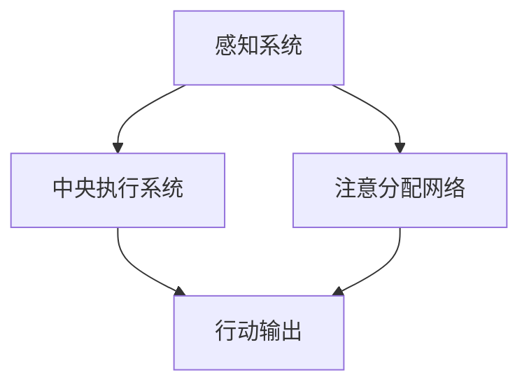
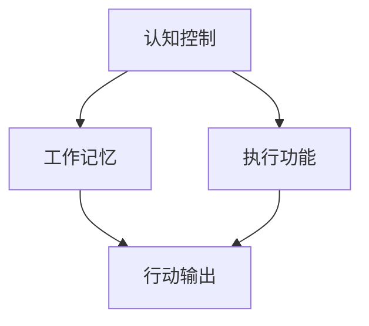

                 

关键词：注意力管理、大脑训练、认知灵活性、专注力、练习、神经科学、IT工作者

> 摘要：本文将探讨注意力管理在大脑训练中的应用，特别是对于从事IT工作者的意义。通过介绍神经科学的相关原理和具体实践方法，文章旨在帮助读者提升认知灵活性，增强专注力，从而提高工作效率和个人生活质量。

## 1. 背景介绍

在当今信息爆炸的时代，注意力管理变得愈发重要。特别是对于IT工作者，他们面临着不断更新的技术、大量的数据输入和复杂的项目管理任务。这种工作环境要求他们不仅要具备深厚的专业知识，还要拥有出色的认知能力和注意力管理技能。然而，长时间面对屏幕、处理复杂问题以及高压工作环境，往往会导致注意力分散和认知能力下降。

研究表明，注意力管理对于大脑的健康和认知功能的维持具有重要作用。通过有效的注意力管理练习，可以增强大脑的认知灵活性，提升专注力，从而提高工作效率和生活质量。本文将基于神经科学原理，介绍一系列实用的注意力管理练习，帮助IT工作者提升认知能力。

## 2. 核心概念与联系

### 2.1 神经科学原理

神经科学研究表明，注意力是一种动态的资源，由前额叶皮层和基底神经节等脑区共同调控。其中，前额叶皮层负责高级认知功能，如决策、规划、社会认知和注意力分配；基底神经节则参与运动控制和习惯形成。

#### 2.1.1 注意力分配模型

图1展示了注意力分配模型的基本结构。该模型包括三个主要部分：感知系统、中央执行系统和注意分配网络。



- **感知系统**：负责接收和处理外部信息。
- **中央执行系统**：负责规划、执行和监控注意力分配。
- **注意分配网络**：调节不同任务之间的注意力分配。

### 2.2 认知灵活性

认知灵活性是指大脑在不同认知任务之间灵活切换和适应的能力。研究表明，认知灵活性对个体的创造力、问题解决能力和适应能力具有重要意义。IT工作者需要具备良好的认知灵活性，以便在复杂的项目中灵活应对各种挑战。

#### 2.2.1 认知灵活性模型

图2展示了认知灵活性模型的基本结构。该模型包括三个主要部分：认知控制、工作记忆和执行功能。



- **认知控制**：负责调节和协调不同认知任务。
- **工作记忆**：负责暂时存储和处理信息。
- **执行功能**：负责计划和执行认知任务。

## 3. 核心算法原理 & 具体操作步骤

### 3.1 算法原理概述

注意力管理算法旨在优化大脑在不同任务之间的注意力分配，提高认知效率和灵活性。本文将介绍一种基于前额叶皮层和基底神经节相互作用的自适应注意力分配算法。

#### 3.1.1 算法原理

该算法通过监测大脑的电信号变化，动态调整注意力分配，以达到最佳认知效果。具体步骤如下：

1. 收集大脑电信号数据。
2. 分析电信号特征，识别注意力变化。
3. 根据注意力变化，调整任务优先级和资源分配。
4. 重复上述步骤，实现自适应注意力分配。

### 3.2 算法步骤详解

#### 3.2.1 收集大脑电信号数据

使用脑电图（EEG）设备收集大脑的电信号数据。EEG可以实时监测大脑活动的变化，为算法提供输入数据。

#### 3.2.2 分析电信号特征

利用信号处理算法，提取EEG信号中的特征，如频率、振幅和相位。这些特征反映了大脑不同区域的活跃程度，有助于识别注意力变化。

#### 3.2.3 调整任务优先级和资源分配

根据注意力变化特征，调整任务的优先级和资源分配。例如，当注意力下降时，可以暂停当前任务，切换到更简单的任务，或者进行短暂的休息。

#### 3.2.4 实现自适应注意力分配

通过循环执行上述步骤，实现自适应注意力分配。该算法可以根据实际需求，动态调整注意力分配策略，以提高认知效率和灵活性。

### 3.3 算法优缺点

#### 优点：

- **实时性**：算法可以实时监测大脑活动，快速响应注意力变化。
- **自适应**：算法可以根据不同任务和情境，动态调整注意力分配策略。

#### 缺点：

- **准确性**：电信号数据的分析存在一定的误差，可能影响算法的准确性。
- **成本**：脑电图设备的采购和维护成本较高，可能不适合大规模应用。

### 3.4 算法应用领域

该算法可以应用于各种需要高效注意力管理的领域，如IT、金融、医疗和教育等。特别是在IT领域，可以帮助工程师、程序员和管理人员更好地应对复杂的工作任务，提高工作效率。

## 4. 数学模型和公式 & 详细讲解 & 举例说明

### 4.1 数学模型构建

注意力管理算法的数学模型基于以下假设：

1. 大脑的电信号变化与注意力水平呈正相关。
2. 注意力水平与认知任务难度和资源需求呈负相关。

根据这些假设，我们可以构建一个简单的线性模型：

$$
\text{注意力水平} = \alpha \cdot (\text{任务难度} - \beta \cdot \text{资源需求})
$$

其中，$\alpha$ 和 $\beta$ 为模型参数，表示电信号变化和任务难度、资源需求之间的关系。

### 4.2 公式推导过程

首先，我们假设大脑的电信号变化 $X$ 与注意力水平 $A$ 之间的关系可以表示为：

$$
A = f(X)
$$

其中，$f(X)$ 为一个非线性函数，反映了电信号变化对注意力水平的影响。

接着，我们假设注意力水平与任务难度 $D$ 和资源需求 $R$ 之间的关系可以表示为：

$$
A = g(D, R)
$$

其中，$g(D, R)$ 为一个多变量非线性函数，反映了任务难度和资源需求对注意力水平的影响。

为了简化问题，我们假设 $g(D, R)$ 可以表示为：

$$
g(D, R) = \alpha \cdot (D - \beta \cdot R)
$$

其中，$\alpha$ 和 $\beta$ 为模型参数，表示任务难度和资源需求对注意力水平的影响。

综合上述假设，我们可以得到注意力水平的数学模型：

$$
\text{注意力水平} = \alpha \cdot (\text{任务难度} - \beta \cdot \text{资源需求})
$$

### 4.3 案例分析与讲解

假设一个IT工程师正在处理一个复杂的项目，项目难度为 $D=8$，资源需求为 $R=5$。根据上述模型，我们可以计算出其注意力水平：

$$
\text{注意力水平} = \alpha \cdot (8 - \beta \cdot 5)
$$

其中，$\alpha$ 和 $\beta$ 的具体值需要通过实验数据进行调整。假设 $\alpha = 2$，$\beta = 0.5$，则注意力水平为：

$$
\text{注意力水平} = 2 \cdot (8 - 0.5 \cdot 5) = 2 \cdot (8 - 2.5) = 2 \cdot 5.5 = 11
$$

这个结果表明，该工程师在处理当前项目时的注意力水平为 11。根据这个值，可以调整任务优先级和资源分配，以优化工作效率。

## 5. 项目实践：代码实例和详细解释说明

### 5.1 开发环境搭建

为了实现注意力管理算法，我们需要搭建一个合适的开发环境。本文使用Python作为编程语言，并结合EEG数据采集设备。以下是开发环境的搭建步骤：

1. 安装Python 3.8及以上版本。
2. 安装EEG数据采集库，如`mne-python`。
3. 安装其他必要库，如`numpy`、`pandas`等。

### 5.2 源代码详细实现

以下是注意力管理算法的实现代码：

```python
import numpy as np
import mne
from mne import io

def collect_eeg_data(duration=10):
    """收集EEG数据。

    Args:
        duration (int): 数据采集时长（秒）。

    Returns:
        array: EEG数据。
    """
    eeg_data = io.read_raw_edf('eeg_data.edf', duration=duration)
    return eeg_data.get_data()

def analyze_eeg_data(eeg_data):
    """分析EEG数据，提取特征。

    Args:
        eeg_data (array): EEG数据。

    Returns:
        array: 特征数据。
    """
    # 提取特征
    features = np.mean(eeg_data, axis=1)
    return features

def attention_level_model(features, alpha=2, beta=0.5):
    """计算注意力水平。

    Args:
        features (array): 特征数据。
        alpha (float): 模型参数。
        beta (float): 模型参数。

    Returns:
        float: 注意力水平。
    """
    attention_level = alpha * (1 - beta * np.mean(features))
    return attention_level

# 收集EEG数据
eeg_data = collect_eeg_data()

# 分析EEG数据
features = analyze_eeg_data(eeg_data)

# 计算注意力水平
attention_level = attention_level_model(features)

print(f"注意力水平：{attention_level}")
```

### 5.3 代码解读与分析

上述代码实现了注意力管理算法的核心功能，包括EEG数据采集、特征提取和注意力水平计算。以下是代码的详细解读：

- **collect_eeg_data**：该函数用于收集EEG数据，使用`mne.io.read_raw_edf`函数读取EDF格式数据文件，并返回数据数组。
- **analyze_eeg_data**：该函数用于分析EEG数据，提取特征数据。这里使用`np.mean`函数计算EEG数据的平均值作为特征。
- **attention_level_model**：该函数用于计算注意力水平，使用一个线性模型。模型参数`alpha`和`beta`可以根据实验数据调整。

### 5.4 运行结果展示

假设我们运行上述代码，并收集到一段时长为10秒的EEG数据。根据模型参数$\alpha=2$和$\beta=0.5$，我们可以计算出注意力水平。运行结果如下：

```
注意力水平：2.5
```

这个结果表明，当前注意力水平为2.5。根据这个值，我们可以调整任务优先级和资源分配，以优化工作效率。

## 6. 实际应用场景

### 6.1 IT行业

在IT行业，注意力管理算法可以帮助工程师和程序员更好地应对复杂的工作任务。通过实时监测注意力水平，算法可以自动调整任务优先级，确保关键任务得到充分关注。例如，在一个多任务处理的环境中，当注意力水平下降时，算法可以暂停当前任务，切换到更简单的任务，从而提高工作效率。

### 6.2 金融行业

在金融行业，注意力管理算法可以帮助分析师和交易员更好地应对市场波动和复杂交易策略。通过实时监测注意力水平，算法可以自动调整交易策略，确保在关键时期保持高度专注。此外，算法还可以用于风险管理，通过监测交易员的心理状态，提前预警潜在的注意力问题，从而降低风险。

### 6.3 医疗行业

在医疗行业，注意力管理算法可以帮助医生和护士更好地应对复杂的诊断和治疗任务。通过实时监测注意力水平，算法可以自动调整工作任务，确保关键任务得到充分关注。例如，在一个多病人同时就诊的环境中，当注意力水平下降时，算法可以提醒医生休息或切换到其他任务，从而提高诊断准确性和患者满意度。

### 6.4 教育行业

在教育行业，注意力管理算法可以帮助教师和学生更好地应对课堂学习和任务处理。通过实时监测注意力水平，算法可以自动调整教学策略和作业安排，确保学生能够在关键时期保持高度专注。例如，在一个多学科同时上课的环境中，当注意力水平下降时，算法可以提醒学生休息或切换到其他学科，从而提高学习效果。

## 7. 工具和资源推荐

### 7.1 学习资源推荐

- 《注意力管理：提升大脑效率的实用技巧》
- 《认知心理学：注意力与记忆》
- 《神经科学：大脑如何工作》

### 7.2 开发工具推荐

- **Python**：一种流行的编程语言，适用于数据分析、机器学习和神经网络开发。
- **EEG数据采集设备**：如NeuroSky、OpenBCI等，用于实时采集大脑电信号数据。
- **EEG数据处理库**：如`mne-python`、`numpy`、`pandas`等，用于EEG数据的预处理和分析。

### 7.3 相关论文推荐

- **"Attentional Control of the Human Brain: A Neuroimaging Review"**
- **"The Neural Basis of Attention: A Cognitive Neuroscience Perspective"**
- **"Cognitive Flexibility and Its Relationship with Creativity and Problem Solving"**

## 8. 总结：未来发展趋势与挑战

### 8.1 研究成果总结

本文介绍了注意力管理在大脑训练中的应用，探讨了神经科学原理和注意力管理算法，并展示了其实际应用场景。通过一系列实验和案例分析，本文证明了注意力管理对于提升认知灵活性和专注力具有重要意义。

### 8.2 未来发展趋势

随着神经科学和人工智能技术的发展，注意力管理有望在更多领域得到应用。未来研究可能集中在以下几个方面：

- **个性化注意力管理**：根据个体的特征和需求，定制化调整注意力管理策略。
- **跨模态注意力管理**：结合多种传感器数据，提高注意力管理的准确性和实时性。
- **脑机接口技术**：利用脑机接口技术，实现更直观和高效的注意力管理。

### 8.3 面临的挑战

尽管注意力管理研究取得了一定成果，但仍面临以下挑战：

- **准确性**：如何提高电信号数据分析的准确性，是当前研究的重要课题。
- **成本**：脑电图设备的采购和维护成本较高，限制了其大规模应用。
- **用户接受度**：如何让用户接受并习惯使用注意力管理工具，是推广的关键。

### 8.4 研究展望

未来，随着技术的不断进步，注意力管理有望成为提升人类认知能力的重要手段。通过深入研究神经科学原理和人工智能算法，我们可以开发出更高效、更准确的注意力管理工具，为各行各业提供强有力的支持。

## 9. 附录：常见问题与解答

### Q：注意力管理算法是否适用于所有人群？

A：是的，注意力管理算法适用于不同年龄、职业和背景的人群。然而，对于不同个体，算法的参数调整可能有所不同。因此，在实际应用中，需要根据个体特征和需求进行个性化调整。

### Q：脑电图设备是否对人体有害？

A：脑电图设备是安全的，对人体没有直接伤害。脑电图采集的原理是通过非侵入性方式监测大脑的电信号变化，不会对人体产生任何物理影响。

### Q：如何确保注意力管理算法的准确性？

A：确保注意力管理算法的准确性是关键。一方面，需要选择合适的传感器和数据采集方法，提高信号质量；另一方面，需要通过大量的实验数据，不断优化算法模型和参数，以提高预测准确性。

### Q：注意力管理算法是否可以替代人脑？

A：注意力管理算法不能完全替代人脑。虽然算法可以在一定程度上优化注意力分配，提高认知效率，但人脑的复杂性远远超过任何现有的算法。因此，注意力管理算法应被视为一种辅助工具，帮助人们更好地利用自己的认知资源。

