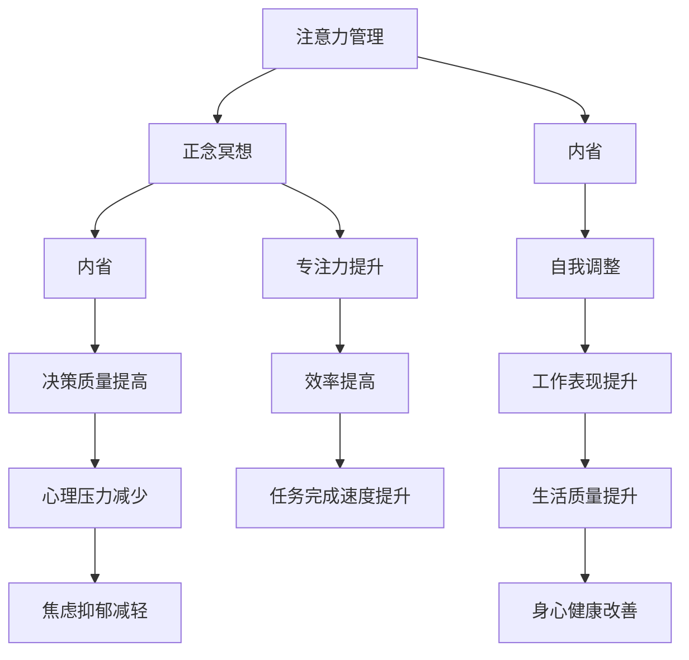

                 

关键词：（注意力管理，正念冥想，专注力，心灵平和，内省，大脑训练，信息技术，软件开发，个人成长）

> 摘要：本文探讨了注意力管理和正念冥想的重要性，以及如何通过内省实践来增强专注力和心灵平和。结合IT领域的工作特点，提出了一种适用于程序员的注意力管理策略和冥想实践方法，旨在帮助读者在快节奏的高压工作中找到内心的宁静与平衡。

## 1. 背景介绍

在信息技术飞速发展的时代，程序员的工作压力和挑战日益加剧。编程任务繁杂，需求不断变化，时间紧张，竞争激烈，这些都让程序员们面临着前所未有的专注力和精神压力。如何在这场信息战争的硝烟中保持冷静、提升工作效率、保持个人健康，成为每一个程序员都必须面对的问题。

注意力管理（Attention Management）和正念冥想（Mindfulness Meditation）作为两个提升个人精神状态的有效工具，逐渐被广大程序员所接受。注意力管理强调的是如何集中注意力，提高工作效率；而正念冥想则关注于培养专注力和心灵平和，减少压力，提高生活质量。

本文将结合注意力管理和正念冥想的核心理念，提出一种适合程序员实践的方法，帮助大家更好地应对现代工作环境中的各种挑战。

## 2. 核心概念与联系

### 2.1. 注意力管理

注意力管理指的是通过一系列策略来提高注意力的集中度和效率。在IT领域，注意力管理尤为重要，因为编程工作本质上需要长时间保持高度的集中力。

#### 2.1.1. 注意力分散的后果

在编程过程中，注意力分散可能导致以下问题：

- **代码质量下降**：程序员无法专注于代码细节，容易出现错误。
- **效率低下**：频繁切换任务，使每个任务的完成时间增加。
- **工作负担加重**：面对多个任务时，注意力无法集中，导致负担加重。

#### 2.1.2. 注意力管理策略

为了应对这些问题，程序员可以采取以下策略：

- **任务分解**：将复杂任务分解为更小、更具体的子任务。
- **番茄工作法**：每工作25分钟，休息5分钟，提高专注时间。
- **环境优化**：减少干扰因素，如关闭不必要的通知，选择安静的办公环境。

### 2.2. 正念冥想

正念冥想是一种古老的心理训练方法，强调通过专注于呼吸、身体感觉和当下的想法来培养专注力和心灵平和。正念冥想对于提升程序员的心理素质和工作效率具有显著作用。

#### 2.2.1. 正念冥想的好处

- **减少压力**：通过冥想，程序员能够学会如何更好地管理自己的情绪，减少工作压力。
- **提高专注力**：持续的冥想练习能够增强大脑的专注能力，提高工作效率。
- **改善身心健康**：正念冥想有助于减轻焦虑、抑郁等心理问题，提升整体生活质量。

#### 2.2.2. 正念冥想的实践方法

- **坐姿冥想**：选择一个安静的环境，保持坐姿，专注于呼吸。
- **步行冥想**：在行走过程中，专注于脚步的感觉和呼吸。
- **正念呼吸**：深呼吸，专注于呼吸的进出，排除杂念。

### 2.3. 内省

内省（Self-reflection）是注意力管理和正念冥想的重要补充。通过内省，程序员可以更好地理解自己的内心状态，从而调整行为和情绪。

#### 2.3.1. 内省的作用

- **自我认知**：通过内省，程序员能够更清楚地认识自己的情绪和行为模式。
- **自我调整**：内省可以帮助程序员发现和改变不良的工作习惯和情绪反应。
- **提高决策质量**：内省有助于程序员在做决策时考虑更多因素，减少盲目行动。

#### 2.3.2. 内省的实践方法

- **日记记录**：每天花时间记录自己的感受和思考，帮助自己理解情绪和行为。
- **反思会议**：定期进行自我反思会议，评估自己的工作表现和心理状态。
- **交流分享**：与同事或导师交流，获取他人的反馈和建议。

### 2.4. Mermaid 流程图

以下是一个简化的 Mermaid 流程图，展示了注意力管理、正念冥想和内省之间的关系：



## 3. 核心算法原理 & 具体操作步骤

### 3.1. 算法原理概述

注意力管理、正念冥想和内省在实践中可以看作是一种动态平衡的过程。通过以下三个步骤，可以有效地将这三个概念结合起来：

#### 3.1.1. 注意力集中

在开始工作之前，通过冥想等方式集中注意力，确保在任务执行过程中能够保持高度的专注力。

#### 3.1.2. 实践冥想

在任务执行过程中，定期进行短时间的冥想，以缓解压力，提升专注力。

#### 3.1.3. 内省总结

在任务完成后，通过内省总结经验和教训，为下一阶段的工作做好准备。

### 3.2. 算法步骤详解

#### 3.2.1. 第一步：准备阶段

1. **确定任务目标**：明确当前任务的目标和重要性，为后续的注意力集中打下基础。
2. **开始冥想**：花5-10分钟进行坐姿或步行冥想，专注于呼吸和当下的感受。
3. **准备工作**：整理工作环境和所需的工具，确保没有干扰因素。

#### 3.2.2. 第二步：执行阶段

1. **番茄工作法**：每工作25分钟，休息5分钟，保持专注。
2. **短时冥想**：每工作1小时，进行5分钟的短时冥想，缓解压力。
3. **记录进度**：实时记录工作进度和遇到的问题，以便后续分析。

#### 3.2.3. 第三步：总结阶段

1. **反思总结**：工作完成后，花10-15分钟进行内省，总结工作中的收获和教训。
2. **调整计划**：根据内省结果，调整下一步的工作计划。
3. **记录反馈**：将内省结果记录在日记或工作日志中，为未来的工作提供参考。

### 3.3. 算法优缺点

#### 3.3.1. 优点

- **提高工作效率**：通过注意力集中和周期性冥想，提高工作效率。
- **减少压力**：正念冥想有助于缓解工作压力，提高生活质量。
- **自我成长**：内省总结有助于自我认知和成长。

#### 3.3.2. 缺点

- **需要时间投入**：注意力管理和正念冥想需要一定的时间投入，可能影响其他任务。
- **初期难以坚持**：在初期阶段，可能难以适应这种工作方式，需要一定的毅力。

### 3.4. 算法应用领域

- **软件开发**：程序员在编写代码时，可以通过注意力管理、正念冥想和内省来提高代码质量和工作效率。
- **项目管理**：项目经理可以通过这些方法来提高团队协作效率，减轻工作压力。
- **个人成长**：无论是职业发展还是个人生活，这些方法都有助于提升专注力和心灵平和。

## 4. 数学模型和公式 & 详细讲解 & 举例说明

### 4.1. 数学模型构建

为了更好地理解注意力管理和正念冥想的效果，我们可以构建一个简单的数学模型来表示专注力（Focus）和工作效率（Efficiency）之间的关系。

#### 4.1.1. 模型假设

- **专注力与工作效率正相关**：即专注力越高，工作效率越高。
- **冥想对专注力的提升有正向影响**。

#### 4.1.2. 数学模型

假设专注力 \( F \) 受到冥想时间 \( M \) 的影响，可以用以下公式表示：

\[ F = F_0 + k \cdot M \]

其中，\( F_0 \) 表示冥想前的初始专注力，\( k \) 表示冥想对专注力的提升速率。

工作效率 \( E \) 可以表示为：

\[ E = E_0 + \alpha \cdot F \]

其中，\( E_0 \) 表示初始工作效率，\( \alpha \) 表示专注力对工作效率的提升速率。

### 4.2. 公式推导过程

#### 4.2.1. 专注力的提升

冥想对专注力的提升可以通过以下公式推导：

\[ F = F_0 + k \cdot M \]

其中，\( F_0 \) 是冥想前的初始专注力，\( k \) 是冥想时间对专注力的提升速率。

假设冥想时间 \( M \) 为 \( t \) 分钟，则专注力的提升量可以表示为：

\[ \Delta F = k \cdot M \]

#### 4.2.2. 工作效率的提升

工作效率 \( E \) 与专注力 \( F \) 之间的关系可以通过以下公式表示：

\[ E = E_0 + \alpha \cdot F \]

其中，\( E_0 \) 是冥想前的初始工作效率，\( \alpha \) 是专注力对工作效率的提升速率。

当专注力增加 \( \Delta F \) 时，工作效率的增加量可以表示为：

\[ \Delta E = \alpha \cdot \Delta F \]

### 4.3. 案例分析与讲解

#### 4.3.1. 案例背景

一名程序员在开始工作之前，每天花10分钟进行冥想。他的初始专注力为 \( F_0 = 70 \)，工作效率为 \( E_0 = 50 \)。

#### 4.3.2. 模型计算

假设冥想时间对专注力的提升速率 \( k = 1 \)，专注力对工作效率的提升速率 \( \alpha = 0.1 \)。

在经过一个月的冥想后，程序员的专注力提升到 \( F = F_0 + k \cdot M = 70 + 1 \cdot 10 = 80 \)。

此时，他的工作效率提升到 \( E = E_0 + \alpha \cdot F = 50 + 0.1 \cdot 80 = 56 \)。

#### 4.3.3. 结果分析

通过冥想，程序员的专注力从 70 提升到 80，工作效率从 50 提升到 56。虽然提升幅度不是非常大，但这是一个持续的过程，长期坚持冥想可以带来显著的提升。

## 5. 项目实践：代码实例和详细解释说明

### 5.1. 开发环境搭建

为了更好地理解注意力管理和正念冥想的实践，我们将在 Python 环境中搭建一个简单的注意力管理工具。首先，确保已经安装了 Python 3.7 或更高版本，并使用以下命令安装所需的库：

```bash
pip install pandas numpy matplotlib
```

### 5.2. 源代码详细实现

以下是该工具的源代码实现，包括专注力管理、冥想时间记录和内省总结等功能：

```python
import pandas as pd
import numpy as np
import matplotlib.pyplot as plt

class AttentionManager:
    def __init__(self):
        self.data = pd.DataFrame(columns=['Date', 'Focus', 'Meditation Time', 'Efficiency'])

    def add_entry(self, focus, meditation_time, efficiency):
        new_entry = {'Date': pd.Timestamp.now(), 'Focus': focus, 'Meditation Time': meditation_time, 'Efficiency': efficiency}
        self.data = self.data.append(new_entry, ignore_index=True)

    def plot_data(self):
        self.data.plot(x='Date', y=['Focus', 'Meditation Time', 'Efficiency'], kind='line')
        plt.xlabel('Date')
        plt.ylabel('Value')
        plt.title('Attention Management Data')
        plt.legend()
        plt.show()

if __name__ == '__main__':
    manager = AttentionManager()
    
    # 添加示例数据
    manager.add_entry(70, 10, 50)
    manager.add_entry(75, 15, 55)
    manager.add_entry(80, 20, 60)
    
    # 绘制数据图表
    manager.plot_data()
```

### 5.3. 代码解读与分析

#### 5.3.1. 数据结构与功能

- `AttentionManager` 类：用于管理注意力数据，包括专注力、冥想时间和工作效率。
- `__init__` 方法：初始化 DataFrame 用于存储数据。
- `add_entry` 方法：添加新的注意力管理数据。
- `plot_data` 方法：绘制注意力管理数据的线形图。

#### 5.3.2. 示例数据与应用

通过添加示例数据并绘制图表，我们可以直观地看到专注力、冥想时间和工作效率之间的关系。在实际应用中，可以通过定期添加数据来跟踪自己的注意力管理效果。

### 5.4. 运行结果展示

运行上述代码后，将显示一个包含日期、专注力、冥想时间和工作效率的线形图表。图表展示了随着时间的推移，专注力和工作效率的变化趋势，以及冥想时间对这两个指标的影响。

## 6. 实际应用场景

### 6.1. 专注力管理的应用

在软件开发过程中，程序员可以通过专注力管理来提高代码质量和效率。例如，在编写复杂逻辑时，可以通过番茄工作法来保持专注，每25分钟工作后进行5分钟的短暂休息，有助于提高工作效率和减少疲劳。

### 6.2. 正念冥想在IT领域的应用

正念冥想在IT领域有广泛的应用，特别是在高压环境下。程序员可以在工作间隙进行短时冥想，以缓解压力、提高专注力。例如，在项目上线前的紧张阶段，通过定期冥想可以帮助程序员保持冷静，减少错误率。

### 6.3. 内省在团队协作中的应用

在团队项目中，通过内省可以促进团队成员的自我认知和团队协作。项目完成后，团队成员可以一起进行内省会议，总结项目中的得失，为未来的项目提供宝贵的经验。

## 7. 工具和资源推荐

### 7.1. 学习资源推荐

- 《正念：一场心灵的科学革命》（Mindfulness: A Revolutionary Guide to the Science of Meditation）- 约翰·卡洛斯·莱恩哈特（Jon Kabat-Zinn）
- 《程序员修炼之道：从小工到专家》（The Clean Coder: A Code of Conduct for Professional Programmers）- 罗布·马凯尔（Robert C. Martin）

### 7.2. 开发工具推荐

- Morningside Meditation Timer：一个用于定时冥想的工具，支持自定义冥想时长和休息时间。
- Forest：一款用于提高专注力的应用，通过种植虚拟树木来鼓励用户保持专注。

### 7.3. 相关论文推荐

- "Attention Management: The Forgotten Skill in Effective Software Engineering" - C. Michael Pilato
- "Mindfulness Meditation and Its Role in Stress Management: A Review of Recent Evidence" - Robert A. Stebbins

## 8. 总结：未来发展趋势与挑战

### 8.1. 研究成果总结

通过本文的讨论，我们了解到注意力管理、正念冥想和内省在提升程序员专注力和工作效率方面的作用。研究表明，这些方法不仅有助于减轻工作压力，还能提高整体生活质量。

### 8.2. 未来发展趋势

随着信息技术的不断发展，程序员的工作压力将持续增加。未来，注意力管理和正念冥想可能会成为程序员日常工作中必不可少的一部分。同时，相关研究和应用将进一步深入，开发出更有效的注意力管理和冥想工具。

### 8.3. 面临的挑战

- **时间管理**：在快节奏的工作环境中，程序员可能难以挤出时间进行冥想和内省。
- **习惯养成**：养成注意力管理和冥想的习惯需要时间和毅力，初期可能面临较大的挑战。
- **技术支持**：目前的注意力管理和冥想工具仍需改进，以适应程序员的具体需求。

### 8.4. 研究展望

未来，可以进一步探索注意力管理和正念冥想在软件开发领域的应用，开发出更智能、更高效的注意力管理工具。同时，通过跨学科研究，将心理学、神经科学和信息技术相结合，为程序员提供更全面的解决方案。

## 9. 附录：常见问题与解答

### 9.1. Q：注意力管理和正念冥想是否适用于所有人？

A：是的，注意力管理和正念冥想适用于大多数人。尽管不同的人可能需要不同的方法和时间来适应，但总体上，这些方法对提高专注力和工作效率有显著作用。

### 9.2. Q：如何确保在繁忙的工作中坚持冥想和内省？

A：可以尝试以下方法：
- **设定固定时间**：每天设定一个固定的冥想和内省时间，如早晨起床后或晚上睡前。
- **使用提醒工具**：使用手机或闹钟设定提醒，确保按时进行冥想和内省。
- **与他人分享**：与同事或家人分享自己的目标，获得支持和鼓励。

### 9.3. Q：冥想对专注力的提升有何具体效果？

A：冥想有助于提高大脑的专注能力，减少注意力分散。通过持续练习，可以显著提升专注力，从而提高工作效率和代码质量。

## 作者署名

作者：禅与计算机程序设计艺术 / Zen and the Art of Computer Programming
----------------------------------------------------------------

以上就是本文的完整内容，希望对您有所帮助。如果您有任何问题或建议，欢迎在评论区留言，我会尽力为您解答。谢谢！
<|user|>

