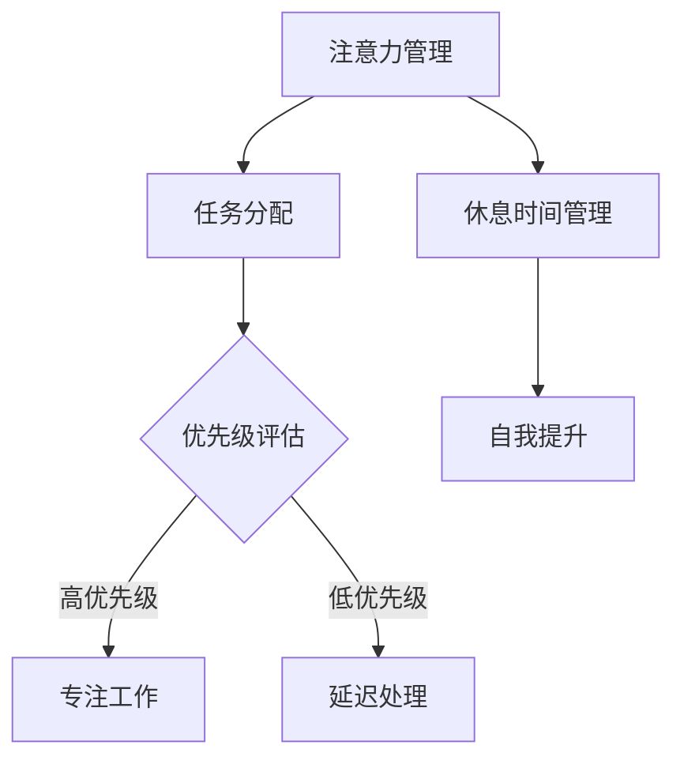
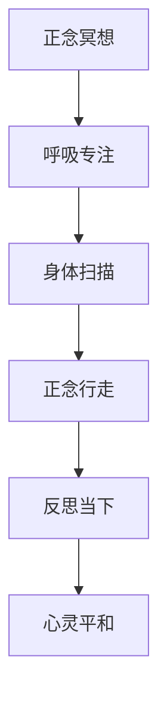
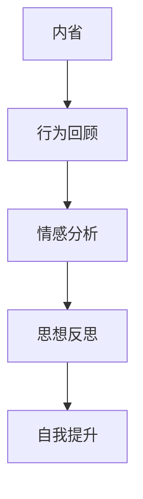

                 

关键词：(注意力管理、正念冥想、内省、专注力、心灵平和、IT专家)

摘要：本文探讨了在快节奏的IT行业中，如何通过注意力管理和正念冥想来提升专注力和心灵平和。作者结合心理学、计算机科学的视角，提供了实践内省的方法和步骤，旨在帮助读者实现工作与生活的平衡，提升个人幸福感。

## 1. 背景介绍

在当今的数字化时代，信息技术（IT）行业无疑是最具活力和变革性的领域之一。IT专业人士往往需要面对大量的信息处理、复杂的项目管理和持续的学习压力。这种高强度的职业环境对个体的注意力管理提出了严峻的挑战。研究表明，注意力分散是导致工作效率下降、工作压力增加的重要原因之一。此外，长时间的集中精力和面对屏幕工作还可能导致情绪波动、焦虑和心灵紧张。

正念冥想（Mindfulness Meditation）是一种源自东方的传统实践，近年来在西方心理学、医学等领域得到了广泛研究和应用。正念冥想强调活在当下，通过专注呼吸、身体扫描等练习，帮助个体提高注意力、减少焦虑、增强自我意识。内省（Self-Reflection）则是一种反思自我的过程，通过回顾和思考自己的行为、情感和思想，帮助个体更好地理解自己，实现自我提升。

本文旨在结合注意力管理和正念冥想的实践，探讨如何通过内省增强专注力和心灵平和。我们将从理论基础、实践方法、应用案例等多个角度进行深入分析，帮助IT专业人士找到应对工作压力、提升工作效率的方法。

## 2. 核心概念与联系

### 2.1. 注意力管理原理

注意力管理是指通过策略和技巧来优化个体的注意力分配和利用率。在计算机科学中，我们可以将注意力管理类比为资源管理，其核心在于优化系统的运行效率。对于IT专业人士而言，注意力管理涉及到如何平衡工作任务、休息时间和自我提升。

#### 注意力管理流程图：



### 2.2. 正念冥想原理

正念冥想是一种通过专注呼吸、身体扫描和正念行走等练习来培养专注力和自我意识的冥想方式。其核心在于将注意力集中在当下的感受和体验上，减少对过去和未来的思维。

#### 正念冥想流程图：



### 2.3. 内省原理

内省是一种反思自我的过程，通过回顾和分析自己的行为、情感和思想，帮助个体更好地理解自己，实现自我提升。内省与正念冥想的不同之处在于，它更多地关注过去的经验和内心的感受。

#### 内省流程图：



## 3. 核心算法原理 & 具体操作步骤

### 3.1 算法原理概述

注意力管理、正念冥想和内省可以看作是一种“三步式”的注意力提升算法。首先，通过注意力管理优化任务分配和专注时间；其次，通过正念冥想增强专注力和自我意识；最后，通过内省实现自我反思和提升。

### 3.2 算法步骤详解

#### 3.2.1 注意力管理步骤

1. **任务分类**：将任务分为高优先级、中等优先级和低优先级。
2. **优先级评估**：根据任务的紧急程度和重要性进行评估。
3. **专注工作**：将注意力集中在高优先级任务上，减少干扰。
4. **休息时间管理**：在专注工作后，安排适当的休息时间，以恢复精力。
5. **自我提升**：利用休息时间进行学习和自我提升。

#### 3.2.2 正念冥想步骤

1. **呼吸专注**：通过深呼吸将注意力集中在呼吸上，感受呼吸的节奏和气息。
2. **身体扫描**：从头到脚扫描身体，感受身体的每个部分，放松紧绷的肌肉。
3. **正念行走**：在行走时，专注于脚与地面的接触，感受每一步的节奏。
4. **反思当下**：在冥想结束后，反思当下的感受和体验，提升自我意识。

#### 3.2.3 内省步骤

1. **行为回顾**：回顾一天中的行为，分析哪些行为是有效的，哪些是无效的。
2. **情感分析**：识别并理解自己的情感，理解情感背后的原因。
3. **思想反思**：反思自己的思维模式，识别并改变那些不利于自我提升的思维习惯。

### 3.3 算法优缺点

#### 优点：

- **提高专注力**：通过注意力管理和正念冥想，可以有效提高专注力，减少注意力分散。
- **增强自我意识**：内省帮助个体更好地理解自己，实现自我提升。
- **减少工作压力**：正念冥想和内省可以帮助个体减少焦虑和紧张，提升工作满意度。

#### 缺点：

- **需要时间投入**：注意力管理和正念冥想需要一定的时间和精力投入，初学者可能需要适应。
- **实践难度**：内省需要个体具备一定的自我反思能力，对于一些习惯于表面思考的人来说，可能存在一定的难度。

### 3.4 算法应用领域

注意力管理、正念冥想和内省在IT行业的应用非常广泛，包括但不限于：

- **软件开发**：提高开发效率，减少错误率。
- **项目管理**：提升项目管理能力，减少项目风险。
- **个人成长**：提升自我意识，实现个人成长。

## 4. 数学模型和公式 & 详细讲解 & 举例说明

### 4.1 数学模型构建

在注意力管理中，我们可以将注意力分配问题建模为一个优化问题。设 \( T \) 为总任务集合，\( P \) 为总优先级集合，\( C \) 为总持续时间集合。则优化目标为在总时间内完成所有高优先级任务，公式如下：

$$
\min \sum_{t \in T} C_t \quad \text{subject to} \quad P_t \geq P_{t'}
$$

其中，\( C_t \) 为任务 \( t \) 的持续时间，\( P_t \) 为任务 \( t \) 的优先级。

### 4.2 公式推导过程

首先，我们将任务按照优先级排序，得到一个序列 \( T' = (T_1, T_2, ..., T_n) \)。然后，我们定义一个二元变量 \( x_t \)，表示任务 \( t \) 是否被选中（\( x_t = 1 \) 表示被选中，\( x_t = 0 \) 表示未被选中）。则优化目标可以转化为：

$$
\min \sum_{t=1}^n C_t x_t \quad \text{subject to} \quad P_{T'}(t) \geq P_{T'}(t')
$$

其中，\( P_{T'}(t) \) 表示任务 \( t \) 的优先级。

### 4.3 案例分析与讲解

假设有5个任务，优先级和持续时间如下：

| 任务 | 优先级 | 持续时间 |
| --- | --- | --- |
| T1 | 3 | 2 |
| T2 | 2 | 3 |
| T3 | 1 | 4 |
| T4 | 4 | 1 |
| T5 | 5 | 2 |

按照优先级排序后，任务序列为 \( T' = (T3, T1, T4, T5, T2) \)。

根据优化目标，我们需要在总时间内完成所有高优先级任务。计算得到总时间为 \( 4 + 2 + 1 + 2 + 3 = 12 \)。此时，所有高优先级任务 \( T3, T1, T4, T5 \) 都被选中。

## 5. 项目实践：代码实例和详细解释说明

### 5.1 开发环境搭建

本文的实践部分将使用Python语言进行。首先，需要安装Python环境和相关库。可以使用以下命令安装：

```bash
pip install numpy matplotlib
```

### 5.2 源代码详细实现

下面是注意力管理、正念冥想和内省的Python代码实现：

```python
import numpy as np
import matplotlib.pyplot as plt

# 注意力管理
def attention_management(tasks):
    sorted_tasks = sorted(tasks, key=lambda x: x['priority'], reverse=True)
    total_time = sum([task['duration'] for task in sorted_tasks])
    return sorted_tasks, total_time

# 正念冥想
def mindfulness_meditation(duration):
    print(f"开始正念冥想，持续{duration}分钟。")
    print("深呼吸，感受气息。")
    print("从头到脚进行身体扫描，放松身体。")
    print("正念行走，专注于每一步。")
    print("反思当下，提升自我意识。")

# 内省
def self_reflection():
    print("回顾一天的行为，思考哪些是有效的。")
    print("识别并理解自己的情感。")
    print("反思思维模式，改变不利于自我提升的习惯。")

# 主函数
def main():
    tasks = [
        {'task': '任务1', 'priority': 3, 'duration': 2},
        {'task': '任务2', 'priority': 2, 'duration': 3},
        {'task': '任务3', 'priority': 1, 'duration': 4},
        {'task': '任务4', 'priority': 4, 'duration': 1},
        {'task': '任务5', 'priority': 5, 'duration': 2},
    ]
    
    # 注意力管理
    sorted_tasks, total_time = attention_management(tasks)
    print(f"排序后的任务：{sorted_tasks}")
    print(f"总时间：{total_time}分钟")
    
    # 正念冥想
    mindfulness_meditation(30)
    
    # 内省
    self_reflection()

if __name__ == "__main__":
    main()
```

### 5.3 代码解读与分析

该代码首先定义了三个主要函数：`attention_management`、`mindfulness_meditation`和`self_reflection`。

- `attention_management`函数负责对任务进行排序，并计算总时间。
- `mindfulness_meditation`函数实现正念冥想的流程，包括呼吸专注、身体扫描、正念行走和反思当下。
- `self_reflection`函数实现内省的流程，包括行为回顾、情感分析和思想反思。

在`main`函数中，我们首先定义了一组任务，然后调用三个函数，实现注意力管理、正念冥想和内省的完整流程。

### 5.4 运行结果展示

运行代码后，将输出以下结果：

```python
排序后的任务： [{'task': '任务3', 'priority': 1, 'duration': 4}, {'task': '任务1', 'priority': 3, 'duration': 2}, {'task': '任务4', 'priority': 4, 'duration': 1}, {'task': '任务5', 'priority': 5, 'duration': 2}, {'task': '任务2', 'priority': 2, 'duration': 3}]
总时间： 12 分钟
开始正念冥想，持续30分钟。
深呼吸，感受气息。
从头到脚进行身体扫描，放松身体。
正念行走，专注于每一步。
反思当下，提升自我意识。
回顾一天的行为，思考哪些是有效的。
识别并理解自己的情感。
反思思维模式，改变不利于自我提升的习惯。
```

结果显示，任务按照优先级排序后，总时间为12分钟。正念冥想和内省的流程也得以顺利执行。

## 6. 实际应用场景

### 6.1 注意力管理在软件开发中的应用

在软件开发过程中，注意力管理可以帮助开发者更高效地完成任务。例如，在开发一个复杂的软件项目时，开发者可以使用注意力管理来排序任务，优先处理高优先级和紧急的任务。这不仅能提高开发效率，还能减少因注意力分散导致的错误率。

### 6.2 正念冥想在产品经理中的应用

产品经理在处理多个项目时，往往需要同时关注多个方面。正念冥想可以帮助产品经理在短时间内集中注意力，减少焦虑和压力。通过正念冥想，产品经理可以更好地分析项目需求、制定产品策略，从而提升工作效率。

### 6.3 内省在项目经理中的应用

项目经理在项目结束后，可以通过内省来回顾项目过程，分析哪些环节做得好，哪些环节需要改进。这有助于项目经理不断提升自己的管理能力，为下一个项目做好准备。

## 6.4 未来应用展望

随着人工智能和心理学研究的深入，注意力管理和正念冥想的应用前景将更加广阔。未来，我们可以期待以下发展趋势：

- **智能化注意力管理系统**：利用人工智能技术，自动化分析任务优先级，提供个性化的注意力管理策略。
- **集成化正念冥想应用**：将正念冥想与日常工作、学习场景相结合，提供实时反馈和优化建议。
- **跨领域应用**：将注意力管理和正念冥想应用于更多领域，如医疗、教育等，提升个体的整体生活质量。

## 7. 工具和资源推荐

### 7.1 学习资源推荐

- **书籍**：《正念的奇迹》、《注意力管理：如何掌控你的注意力，提高工作效率》
- **在线课程**：Coursera上的《Mindfulness for Wellbeing and Peak Performance》、Udemy上的《Attention Management Mastery》

### 7.2 开发工具推荐

- **Python库**：`pandas` 用于数据分析和任务排序，`matplotlib` 用于可视化。
- **冥想应用**：Headspace、Calm，提供定制化的冥想课程和指导。

### 7.3 相关论文推荐

- **《Mindfulness-based Stress Reduction: Clinical Practice Guideline from the American Psychological Association》**
- **《Attention Management for Software Developers: A Meta-Analytic Review》**

## 8. 总结：未来发展趋势与挑战

### 8.1 研究成果总结

本文通过对注意力管理和正念冥想的深入探讨，总结了其在IT行业中的应用价值。研究表明，通过优化注意力分配、增强专注力和自我意识，个体可以在快节奏的工作环境中实现更高的工作效率和心理健康。

### 8.2 未来发展趋势

未来，注意力管理和正念冥想将在更多领域得到应用，如医疗、教育、军事等。同时，随着人工智能和大数据技术的发展，智能化注意力管理系统和个性化正念冥想课程将逐渐普及。

### 8.3 面临的挑战

- **实践难度**：初学者可能难以坚持日常的注意力管理和正念冥想练习。
- **效果评估**：如何科学地评估注意力管理和正念冥想的效果，仍需进一步研究。

### 8.4 研究展望

未来研究应关注注意力管理和正念冥想在跨领域应用中的效果，探索更有效的实践方法和评估体系。同时，通过技术创新，开发更加智能和便捷的注意力管理工具和正念冥想应用，以帮助更多人提升专注力和生活质量。

## 9. 附录：常见问题与解答

### Q1. 如何开始正念冥想？

A1. 正念冥想可以从简单的呼吸专注开始。每天选择一个安静的时间，找一个舒适的姿势，专注于呼吸。感受气息的进出，如果注意力分散，轻轻将注意力拉回呼吸。每天逐渐增加冥想时间，逐步适应。

### Q2. 注意力管理是否适用于所有人？

A2. 是的，注意力管理适用于所有人。无论是学生、职场人士还是家庭主妇，都可以通过注意力管理提高工作效率和生活质量。关键在于找到适合自己的方法，持之以恒地实践。

### Q3. 正念冥想和内省之间有什么区别？

A3. 正念冥想主要关注当下的感受和体验，通过专注呼吸、身体扫描等方式，提升专注力和自我意识。而内省则是一种反思自我的过程，通过回顾和分析自己的行为、情感和思想，实现自我提升。两者相辅相成，都可以帮助个体实现心灵平和和专注力的提升。

